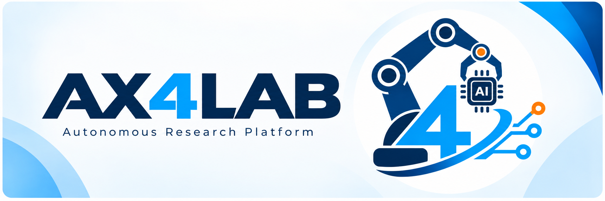
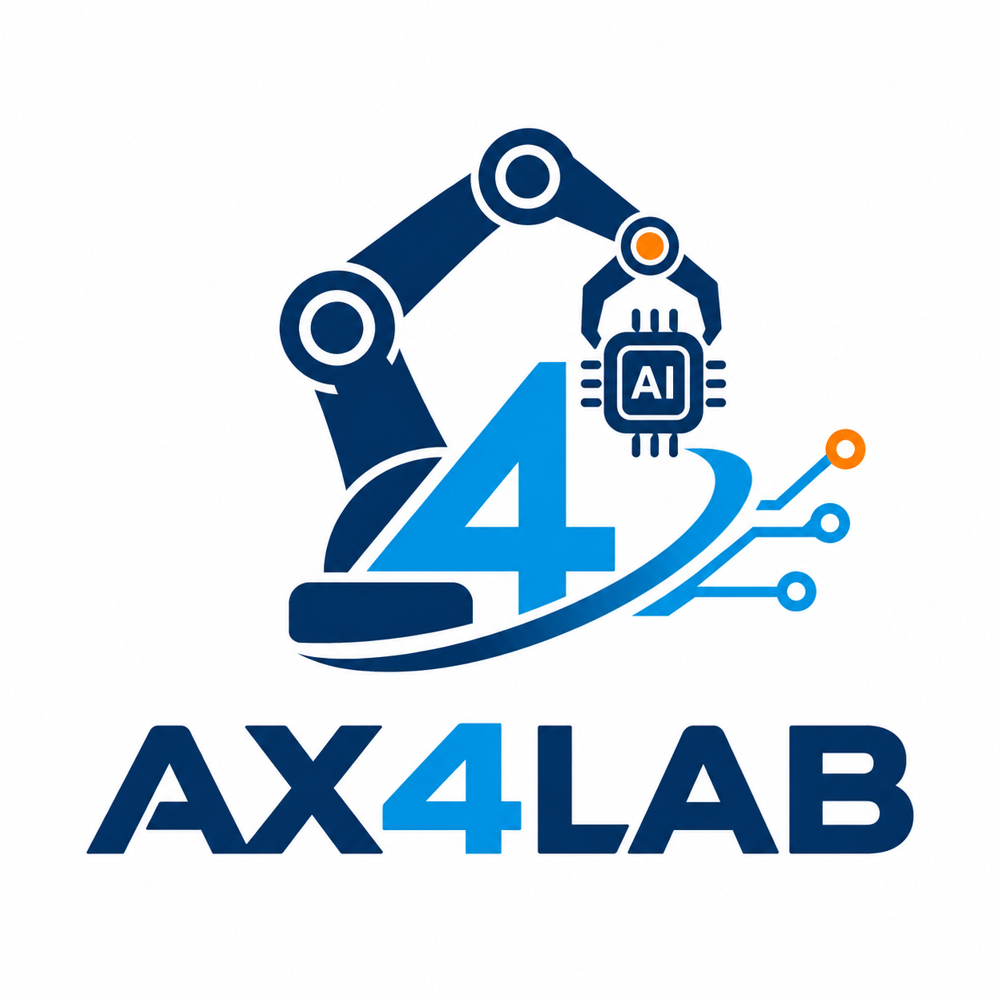
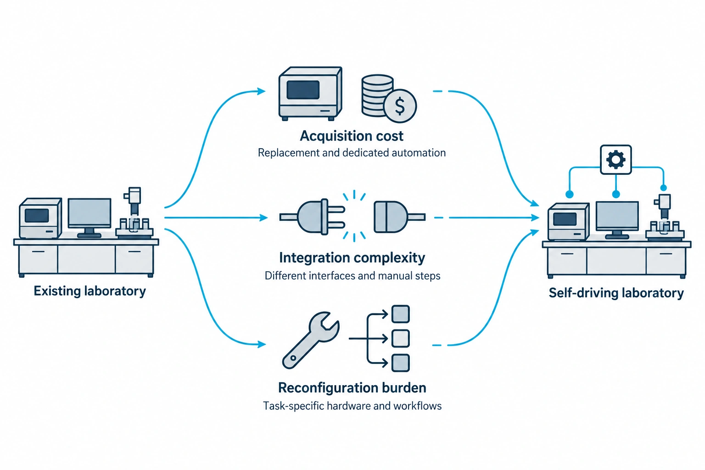
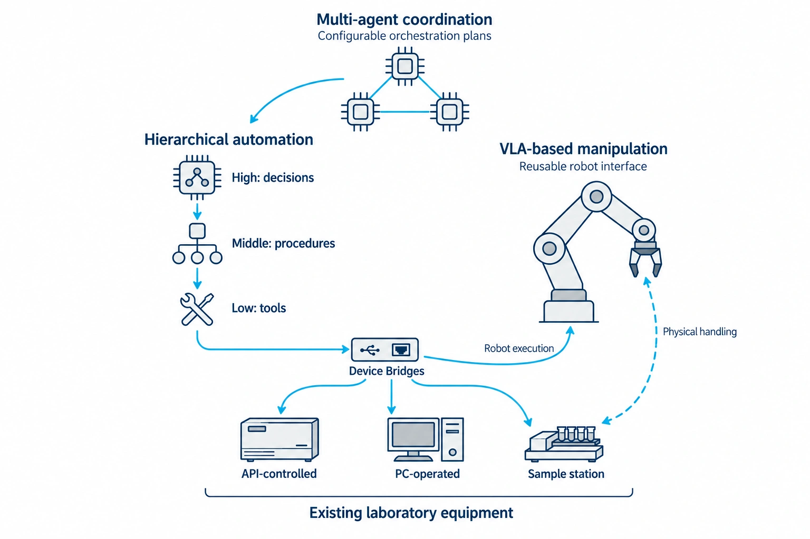
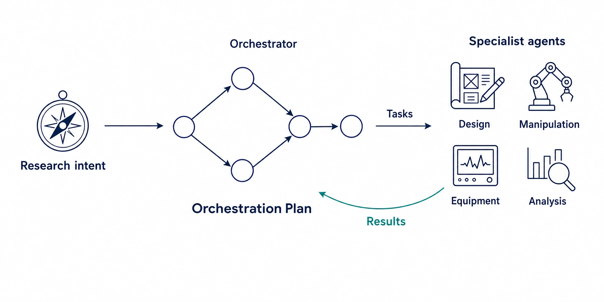
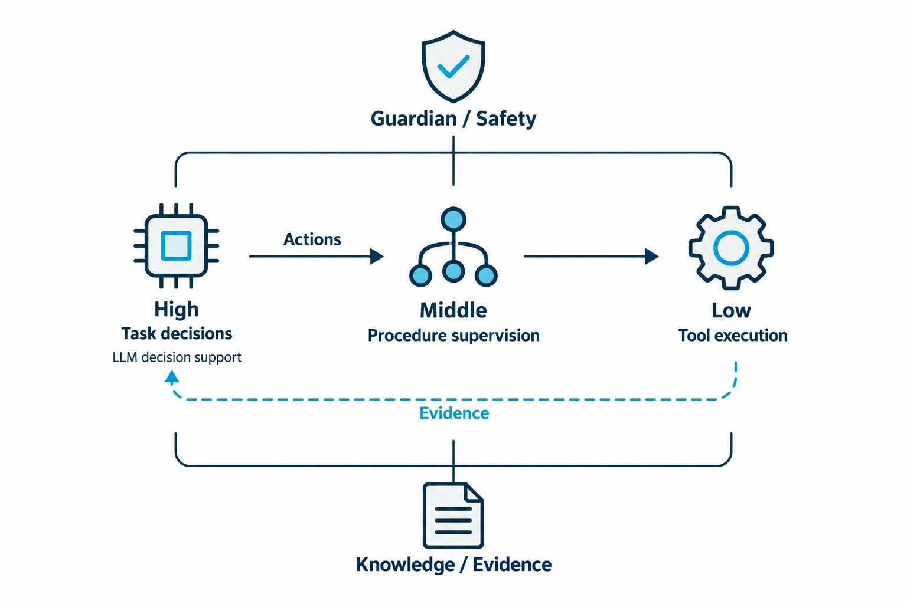
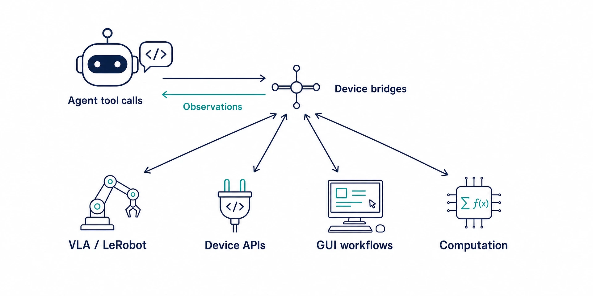
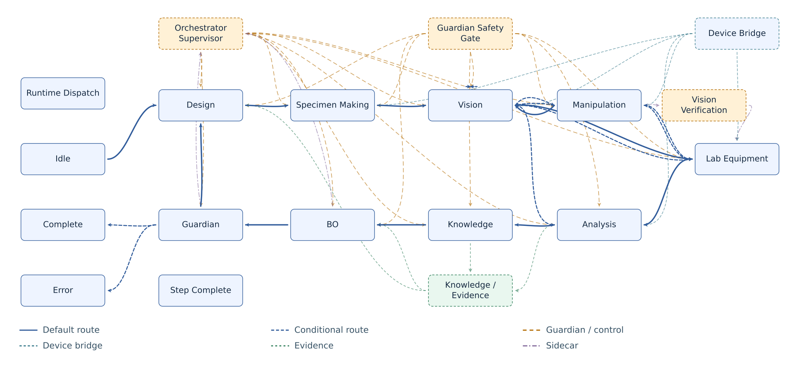

<!-- atr-doc
doc_type: index
subtype: index
status: active
authority: navigation
audience:
  - researcher
  - reviewer
  - artifact_evaluator
  - operator
  - developer
scope:
  - repository
  - paper
  - korean_companion
summary: AX4LAB의 시스템 기여와 이를 지원하는 플랫폼을 소개하는 한국어 메인 문서.
related_docs:
  - README.md
  - README.en.md
  - docs/paper/README.md
  - docs/README.md
  - docs/standards/paper_documentation_standard.md
  - docs/runtime/current_code_snapshot.md
  - docs/runtime/three_level_control_model.md
  - CONTRIBUTING.md
  - SECURITY.md
supersedes: []
-->

# AX4LAB

Powered by the ATR Framework

  
  
  
  
  

<a href="README.md">English</a>

### 간결한 하드웨어. 체계적인 AI. 자율 실험실.

  <strong>기존 실험실에 멀티에이전트 AI를 더합니다.</strong> 
  연구 판단과 절차, 장비 실행을 연결합니다. 
  AI 기반 로봇부터 API 제어 장비, PC로 조작하는 계측기까지 함께 다룹니다.

  <strong>장비는 재사용하고, VLA로 연결하고, 소프트웨어로 조율합니다.</strong> 
  전용 지그와 별도 이송 자동화에 대한 의존을 줄이면서 
  기존 장비와 작업 환경을 유지하도록 설계했습니다.

  

| 문서 | 주요 내용 |
|:---:|:---:|
| **[논문 개요](docs/paper/README.md)** | 연구 배경, 기여, 논문 구성과 읽는 순서. |
| **[시스템 아키텍처](docs/paper/02_system_architecture.md)** | 오케스트레이션, 에이전트별 책임, 실행 인터페이스. |
| **[에이전트 상세 문서](docs/agents/README.md)** | 각 에이전트의 역할, LLM 판단, 도구, 검증 현황. |
| **[Device Bridges](docs/device_bridges/README.md)** | 로봇, 실험 장비, 해석 도구의 연동 규약. |
| **[Runtime IDE](docs/runtime/runtime_ide.md)** | 실행 계획 편집, 실행 제어, 런 상태 확인. |
| **[결과와 근거](docs/paper/06_evaluation_and_results.md)** | 실증 결과와 이를 뒷받침하는 아티팩트. |
| **[설치와 운영](README.en.md)** | 설치, 설정, 운영 절차. |
| **[전체 문서](docs/README.md)** | 상세 문서, 가이드, 문서 작성 규칙. |

## Graphical Abstract

*멀티에이전트 오케스트레이션이 Device Bridge를 통해 기존 장비를 연결합니다.*

## 연구 배경

자율 실험실 도입을 어렵게 만드는 장벽.

자율 실험실을 구축하려면 AI 모델을 추가하는 것만으로는 부족합니다.
사람이 조작하도록 설계된 기존 장비를 연결해야 하고, 전용 자동화를 도입하려면
하드웨어와 소프트웨어, 엔지니어링 비용이 추가로 필요합니다.

- **도입 비용:** 정상적으로 쓰던 장비를 자동화 대응 장비로 교체하거나 전용 이송 시스템을 추가하면 초기 투자가 커집니다.
- **통합 난이도:** API 제어 장비, PC로 조작하는 계측기, 수작업 시편 이송처럼 서로 다른 인터페이스를 하나의 실험 과정으로 연결해야 합니다.
- **재구성 부담:** 특정 작업, 지그, 장비 조합에 맞춘 자동화는 실험이 달라질 때 상당한 재통합 작업이 필요할 수 있습니다.

이러한 장벽은 [자율 실험실의 접근성](https://www.nature.com/articles/s41467-025-59231-1)과
[모듈형 실험실 인터페이스](https://www.nist.gov/programs-projects/development-standards-support-modular-and-autonomous-laboratory-ecosystem)에 관한 연구로 이어지고 있습니다.
우리가 다루는 질문은 다음과 같습니다. **새 실험 워크플로우가 생길 때마다
자동화를 다시 구축하지 않고, 기존 실험실을 어떻게 자율화할 수 있을까요?**

## 시스템 기여

AX4LAB은 **계층적 자동화, 멀티에이전트 조율, VLA 기반 매니퓰레이션**을
결합해 기존 실험실을 자율화합니다. ATR Framework를 기반으로 기존 장비를
유지하면서, 통합 로직을 재사용 가능한 소프트웨어 인터페이스와
각 에이전트가 담당하는 절차에 배치합니다.

| 시스템 기여 | 장벽을 낮추는 방식 | 상세 문서 |
|---|---|---|
| 계층적 자동화와 Device Bridges | High-Level 판단, Middle-Level 절차, Low-Level 도구를 구분해 연구 로직을 API·PC·로봇 인터페이스와 분리하고 기존 장비를 연결합니다. | [장비 인터페이스](docs/device_bridges/README.md) |
| 멀티에이전트 조율 | 전문 에이전트가 작업 판단, 절차, 근거 전달 규약을 담당합니다. Orchestration Plan이 이 기능들을 조합하므로 변경 범위를 관련 에이전트와 인터페이스에 집중할 수 있습니다. | [에이전트별 책임](docs/agents/README.md) |
| VLA 기반 물리 작업 연결 | 학습된 정책으로 동작하는 로봇팔이 수작업 이송 단계를 연결해 작업별 전용 이송 지그의 대안을 제공합니다. LeRobot은 지원 로봇의 연동과 작업 조율을 분리합니다. | [Manipulation](docs/agents/manipulation_agent.md) |

핵심 기여는 이 요소들을 **재사용 가능한 연구 프레임워크로 통합한 것**입니다.
간결한 하드웨어, 고도화된 소프트웨어 조율, 명확한 에이전트 간 인계를 통해
실험 피드백을 연결합니다. 현재의 [실험 사이클](docs/paper/03_closed_loop_method.md)은
이 아키텍처를 적용한 하나의 실행 구성입니다.

## 시스템 아키텍처

프레임워크는 에이전트 간 조율, 에이전트 내부의 책임, 실험 장비와의 연동을
구분합니다.

### 프레임워크

Orchestrator는 연구 의도를 에이전트 작업으로 구체화하고, 구성 가능한
Orchestration Plan을 통해 결과를 조율합니다. 전문 에이전트는 하나의 고정된
순서를 정의하는 대신, 계획에 필요한 기능을 제공합니다.

  

- 작업 라우팅과 전문 에이전트 조율 — [시스템 아키텍처](docs/paper/02_system_architecture.md).
- 실행 계획 설정과 모니터링 — [Runtime IDE](docs/runtime/runtime_ide.md).

### 에이전트

High-Level은 작업 판단을, Middle-Level은 절차 감독을, Low-Level 도구는
실행을 담당합니다. Guardian/Safety와 Knowledge/Evidence는 이 책임 전반에
걸쳐 작용하며, 별도의 순차 실행 단계가 아닙니다. LLM은 해당 에이전트에
허용된 도구와 근거를 바탕으로 판단합니다.

- 제어 계층별 책임과 공유 근거 — [제어 모델](docs/runtime/three_level_control_model.md).

### 장비 연동

에이전트의 절차는 도구와 Device Bridge를 통해 실험실의 기능을 사용합니다.
이 어댑터는 학습된 로봇 정책, 장비 API, PC로 조작하는 계측기를 수용하며,
장비별 실행을 연구 계획과 분리합니다.

- 도구 호출, 데이터 규약, 외부 연결 — [API 및 연결 매트릭스](docs/agents/agent_api_connection_matrix.md).

## Orchestration Route

메인 GUI의 런타임 맵으로, 설정된 에이전트 인계와 조건부 복귀 경로를
제어·Device Bridge·근거 연결과 함께 보여줍니다.

- 그래프 설정과 실행 상태 확인 — [런타임 맵과 IDE](docs/runtime/runtime_ide.md).

## 실증과 근거

보관된 **운영자 감독하 혼합 모드 closed-loop 실증**에서는 장비 시험,
시험 후 정리, Analysis, BO가 관리하는 LHS 진행, 다음 Design 인계까지
완료했습니다. 해당 런에서는 프린팅 적층을 생략했고 시편 동일성을
독립적으로 검증하지 않았습니다. 따라서 이 결과는 해당 통합 경로의 실증이며,
무인으로 제조 전 과정을 완료했다는 뜻은 아닙니다.

압축시험은 현재의 적용 사례이며, **플랫폼 자체의 범위를 정의하지 않습니다**.

| 확인할 내용 | 근거 |
|---|---|
| 기록된 사이클에서 무엇이 완료되었나요? | [Closed-loop 결과](docs/paper/06_evaluation_and_results.md) |
| 각 주장은 어떤 아티팩트로 뒷받침되나요? | [주장–근거 대응표](docs/paper/09_claim_evidence_traceability.md) |
| 검증을 어떻게 재현할 수 있나요? | [재현 방법](docs/paper/07_reproducibility.md) |
| 사이클별 산출물은 어디에 보관되나요? | [루프 아티팩트 보관](docs/runtime/loop_artifact_archiving.md) |

에이전트별 API, 로컬 모델, 가상 장비 검증은 각 상세 문서에 기록되어 있으며,
실제 장비 검증을 대신하지는 않습니다. 비용 비교, 과학적 효용,
여러 런에 걸친 신뢰성은 추가 평가 대상입니다.

## 에이전트 상세 문서

각 문서는 역할 구조도와 현재 상태로 시작하며, 워크플로우, 도구,
인터페이스, 아티팩트, 검증 내용을 이어서 설명합니다.

| 에이전트 | 담당 역할 | 상세 문서 |
|---|---|---|
| Orchestrator | 연구 의도를 해석하고 단계 간 인계를 조율 | [Orchestrator](docs/agents/orchestrator_agent.md) |
| Design | 후보 적합성을 검토하고 설계 명세를 생성 | [Design](docs/agents/design_agent.md) |
| Specimen Making | 제작 적합성을 평가하고 준비 도구를 호출 | [Specimen Making](docs/agents/specimen_agent.md) |
| Vision | 관측을 수행하고 시각적 근거를 검토 | [Vision](docs/agents/vision_agent.md) |
| Manipulation | 로봇 스킬을 선택하고 이송 완료를 검토 | [Manipulation](docs/agents/manipulation_agent.md) |
| Lab Equipment | 저장된 워크플로우를 실행하고 데이터 획득 결과를 검토 | [Lab Equipment](docs/agents/equipment_agent.md) |
| Analysis | 측정 데이터를 처리하고 해석 모델을 고도화 | [Analysis](docs/agents/analysis_agent.md) |
| Knowledge | Markdown 지식을 정리하고 범위에 맞는 맥락을 검색 | [Knowledge](docs/agents/knowledge_agent.md) |
| Bayesian Optimization | 최적화 전략을 선택하고 수치 도구의 제안을 검토 | [BO](docs/agents/bo_agent.md) |
| Guardian | 실행 근거를 검토하고 계속 진행할지 판단하는 데 의견을 제공 | [Guardian](docs/agents/guardian_agent.md) |

## 플랫폼 기여

지원 플랫폼은 실험 로직을 장비 인터페이스, 모델 백엔드, 운영자
워크스페이스와 분리합니다. 이러한 확장 지점은 실증된 시스템을 재사용할 수
있게 하며, 다른 실험실에 적용할 때는 별도의 연동과 검증이 필요합니다.

[플랫폼 아키텍처](docs/paper/04_platform_architecture.md) ·
[Runtime IDE](docs/runtime/runtime_ide.md) ·
[인터페이스 규약](docs/paper/appendix_a_interfaces.md)

## Device Bridge 상세 문서

| 기능 | 인터페이스 역할 | 상세 문서 |
|---|---|---|
| 프린터 플릿 | 프린터 제공자를 선택하고 조율 | [Printer Fleet](docs/device_bridges/printer_fleet_bridge.md) |
| Bambu Lab | 프린터 제어와 제작 아티팩트 관리 | [Bambu X2D](docs/device_bridges/bambu_x2d_bridge.md) |
| Prusa | 프린터 제공자 연동 | [Prusa MK4S](docs/device_bridges/prusa_mk4s_bridge.md) |
| 로보틱스 | 학습 정책 실행, 리플레이, 로봇 워크스페이스 | [LeRobot](docs/device_bridges/lerobot_bridge.md) |
| PC 조작 계측기 | 저장된 GUI 워크플로우와 데이터 획득 | [Windows PyAutoGUI](docs/device_bridges/windows_pyautogui_bridge.md) |
| 시험 영역 비전 | 카메라 관측과 검증 근거 | [UTM Vision](docs/device_bridges/utm_vision_bridge.md) |
| 해석·연산 | 시뮬레이션과 분석 어댑터 | [CAE](docs/device_bridges/cae_computation_bridges.md) |
| 가상 장비 | 실제 장비 없이 검증하기 위한 결정론적 대체 장비 | [Base and Simulators](docs/device_bridges/base_simulator_bridges.md) |

## 시작하기

| 독자 | 시작할 문서 |
|---|---|
| 연구자·리뷰어 | [문제 정의와 기여](docs/paper/01_problem_and_contributions.md) → [결과](docs/paper/06_evaluation_and_results.md) |
| 운영자 | [설치와 운영](README.en.md) → [Device Bridges](docs/device_bridges/README.md) |
| 개발자 | [런타임 상세 문서](docs/runtime/current_code_snapshot.md) → [에이전트 API](docs/agents/agent_api_connection_matrix.md) |
| 기여자 | [기여 가이드](CONTRIBUTING.md) → [문서 작성 규칙](docs/standards/documentation_standard.md) |

실제 장비를 연결하기 전에 [운영 조건과 한계](docs/paper/08_safety_ethics_and_limitations.md)를
확인하세요. 취약점 제보 절차는 [보안 정책](SECURITY.md)에 안내되어 있습니다.

## 인용과 라이선스

저장소의 [인용 정보](CITATION.cff)와 [라이선스](LICENSE)를 참고하세요.
[논문 문서 모음](docs/paper/README.md)은 작성 중인 연구 문서이며,
출판 정보는 확정되는 대로 기록합니다.
