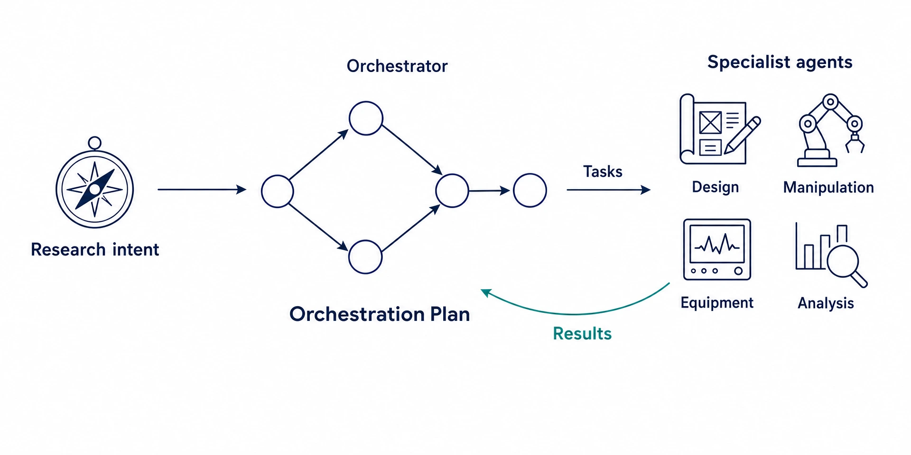
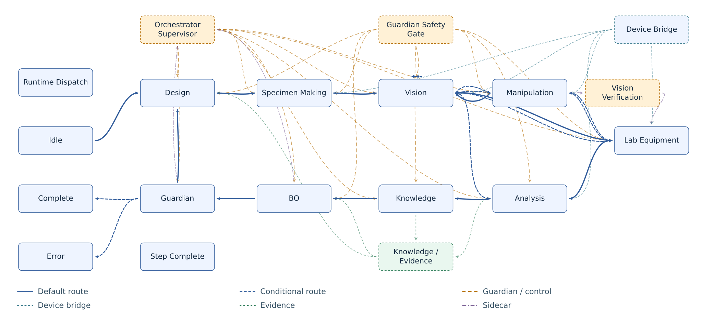
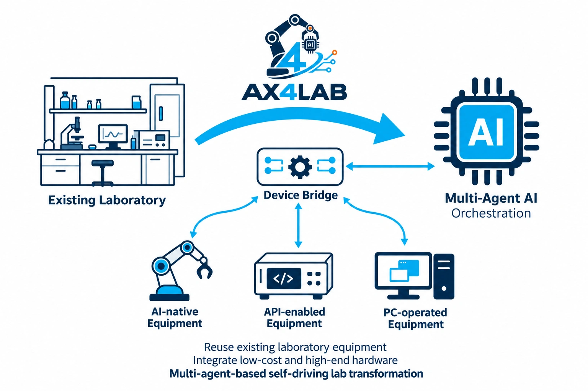
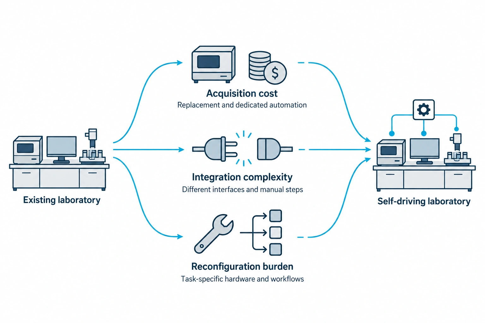
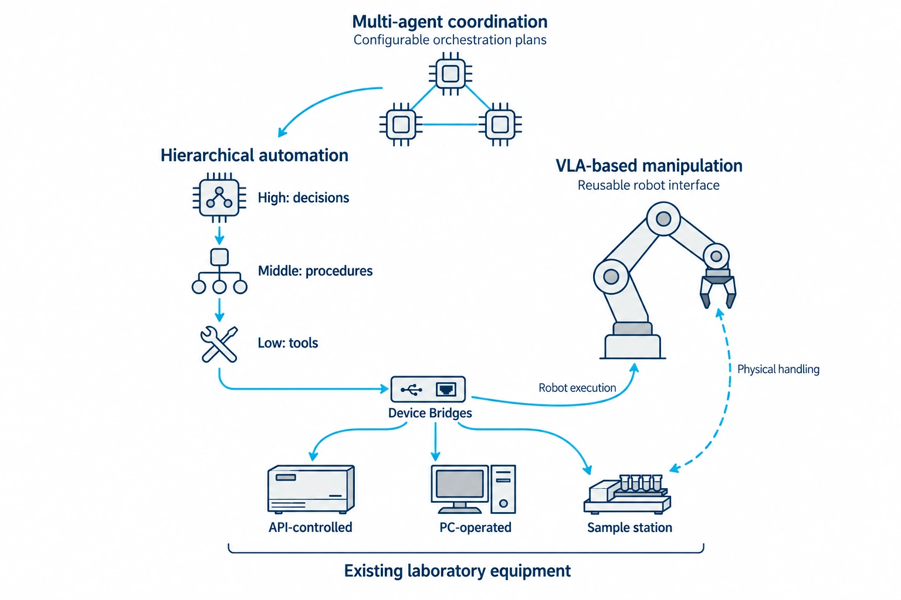
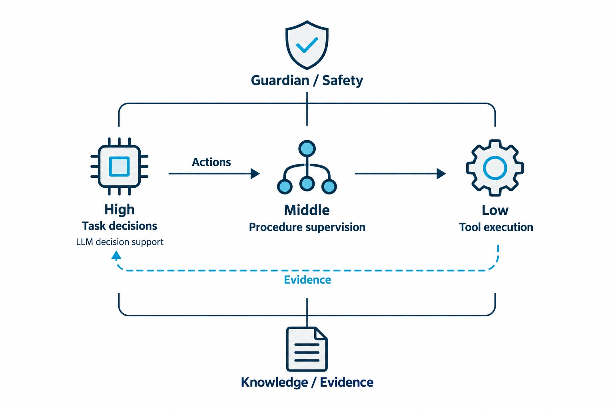
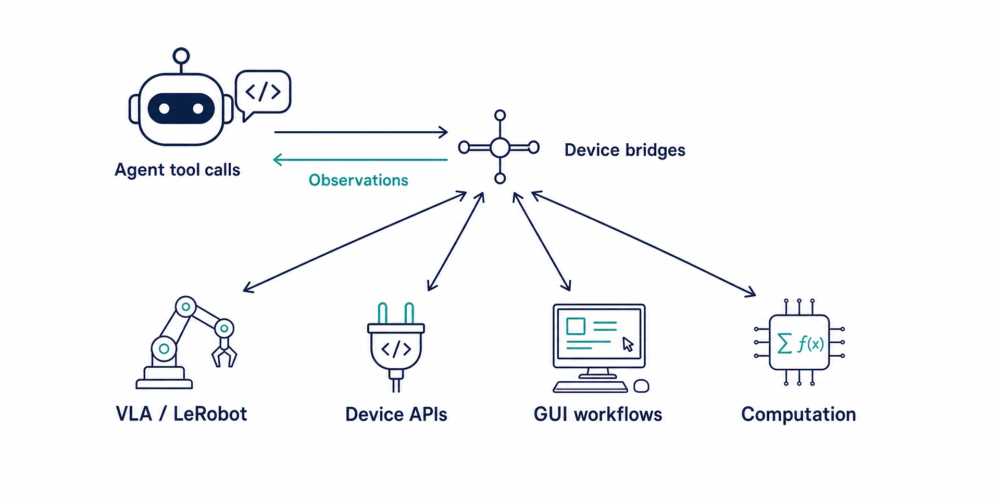

<!-- atr-doc
doc_type: index
subtype: index
status: active
authority: navigation
audience:
  - researcher
  - reviewer
  - artifact_evaluator
  - operator
  - developer
scope:
  - repository
  - paper
  - korean_companion
summary: AX4LAB의 목적, 사용 순서와 연구 근거를 안내하는 한국어 시작 문서.
related_docs:
  - README.md
  - docs/paper/README.md
  - docs/README.md
  - docs/standards/paper_documentation_standard.md
  - docs/runtime/current_code_snapshot.md
  - docs/runtime/three_level_control_model.md
  - docs/modularity.md
  - CONTRIBUTING.md
  - SECURITY.md
supersedes: []
-->

# AX4LAB
Powered by the ATR Framework

[English](README.md) · [사용자 문서](docs/README.ko.md) · [연구와 실험 근거](docs/paper/README.md)

AX4LAB은 설계를 제안하고, 시편을 만들고 옮겨 시험한 뒤, 측정 결과를 바탕으로
다음 실험을 선택하는 과정을 연결합니다. 역할별 AI 에이전트, 실행 절차,
장비 연결 소프트웨어를 조합해 기존 프린터·로봇팔·PC로 조작하는 계측기를
하나의 실험 흐름에서 사용할 수 있게 합니다.

현재 적용 사례는 Gyroid 시편의 반복 압축시험입니다. 이는 프레임워크를 활용한
한 가지 구성이지, 모든 실험실이 같은 재료와 장비, 순서를 써야 한다는 뜻은 아닙니다.

## 시작하기

지금 하려는 일에 맞는 문서부터 읽으세요. 프로그램을 사용하기 위해 내부 구현
문서부터 모두 읽을 필요는 없습니다.

| 하려는 일 | 읽는 순서 |
|---|---|
| 처음 설치하고 실험 한 번 완료하기 | [설치](install/README.md) → [첫 실험](docs/tutorials/first_autonomous_run.ko.md) |
| 이미 설치된 시스템 사용하기 | [사용자 가이드](docs/tutorials/user_manual.ko.md) → [작업별 문서](docs/README.ko.md) |
| 화면 구성과 버튼 위치 익히기 | [GUI 화면 안내](docs/gui/visual_structure.md) |
| 실험 방법과 결과 검토하기 | [연구 개요](docs/paper/README.md) → [결과](docs/paper/06_evaluation_and_results.md) |
| 기능을 추가하거나 실행 흐름 바꾸기 | [모듈 구성](docs/modularity.md) → [Runtime IDE](docs/runtime/runtime_ide.md) |

장비를 사용하기 전에는 [실행 모드](docs/runtime/test_mode.md)를 먼저 선택하세요.
가상 브릿지, 설치된 실제 프린터를 활용하는 테스트, 실제 출력은 작동 범위가
서로 다릅니다. **TEST라는 표시만으로 장비가 움직이지 않는다고 판단하면 안 됩니다.**
첫 실험 가이드에서 각 경로에 필요한 준비와 확인 절차를 안내합니다.

## 실험을 진행하는 방법

실험 목적을 설명하고 설정을 검토하는 데서 시작합니다. 실행이 승인되면
Orchestrator가 작업을 조율하고, 각 에이전트가 담당 작업을 수행한 뒤 근거를
돌려줍니다. Live GUI에서는 현재 작업과 리포트를 확인하고, 필요한 경우
운영자 요청에 응답합니다. 요청이 접수됐다는 표시와 실제 장비 동작이 완료됐다는
판정은 구분해서 봐야 합니다.

*상단에서 현재 상태를 확인하고, 왼쪽에서 에이전트를 선택한 뒤, 리포트에서
판정 근거를 살펴봅니다. 특정 시점에 촬영한 화면 예시입니다.
[화면 안내](docs/gui/visual_structure.md)에 촬영 조건과 개별 기능이 설명돼 있습니다.*

자주 하는 작업은 다음 문서에서 바로 찾을 수 있습니다.

- [출력 옵션 바꾸기](docs/tutorials/device_workspace_3dp_usage.ko.md):
  이동 속도 비율과 출력 시작·종료 동작을 설정합니다.
- [카메라와 검증 이미지 확인하기](docs/tutorials/device_workspace_vision_camera_bridge_usage.ko.md).
- [런 일시정지·재개하기](docs/gui/run_resume.md),
  [프린터 대기 문제 해결하기](docs/gui/printer_wait_recovery.md).
- [저장된 런 다시 보기](docs/gui/run_replay.md),
  [사이클별 산출물 찾기](docs/runtime/loop_artifact_archiving.md).

읽기 전용 Replay는 저장된 기록을 보여주는 기능입니다. 로봇 replay는 실제
동작을 재생하는 기능이므로 서로 혼동하지 마세요. 장비를 다룰 때는 해당 준비
절차와 [운영 조건·한계](docs/paper/08_safety_ethics_and_limitations.md)를 확인해야 합니다.

## 왜 이런 구조를 사용하나요?

기존 실험실의 장비는 제어 방식이 제각각입니다. 장비를 모두 교체하거나 전용
이송 장치를 추가하고, 실험이 바뀔 때마다 연결을 다시 구현하면 자동화 도입과
유지가 어려워집니다. AX4LAB은 이를 줄이기 위해 세 가지 책임을 나눕니다.

- **판단:** 에이전트가 작업과 현재 근거를 해석합니다.
- **절차:** 소프트웨어가 허용된 순서로 작업하고 결과를 확인합니다.
- **장비 실행:** 브릿지가 로봇 정책, 장비 API 또는 PC 프로그램과 통신합니다.

이렇게 나누면 장비별 처리 방식을 연구 계획과 분리하고 기존 기능을 재사용할 수
있습니다. 다만 연결 소프트웨어가 있다고 장비까지 준비되는 것은 아닙니다.
다른 실험실에 적용할 때는 별도의 연동과 검증이 필요합니다.
[연구 배경](docs/paper/01_problem_and_contributions.md)에서 이 문제와 관련 연구를 설명합니다.

## 각 부분은 어떻게 연결되나요?

Orchestrator는 Orchestration Plan으로 전문 에이전트의 작업을 연결합니다.
허용된 도구와 절차가 실행을 맡고, 수치 계산 기능이 측정 물성과 BO 추천값을
계산합니다. Guardian의 점검과 Knowledge의 기록은 여러 단계에 걸쳐 사용됩니다.

전체 관계는 [시스템 구조](docs/paper/02_system_architecture.md)에서,
판단·절차·장비 실행의 구분은 [제어 모델](docs/runtime/three_level_control_model.md)에서
확인할 수 있습니다. 기능을 구성하거나 확장하려면 [모듈 구성 안내](docs/modularity.md)를 읽으세요.

## Orchestration Route

이 지도는 다음 작업으로 넘어가거나 이전 단계로 돌아가는 이유를 파악할 때
유용합니다. 조건부 경로도 포함하므로 모든 런이 각 노드를 한 번씩 방문하는 것은
아닙니다. [Runtime IDE 안내](docs/runtime/runtime_ide.md)에서 설정된 그래프와
현재 실행을 확인하는 방법을 설명합니다.

## 실증과 근거

[보존된 캠페인 검토](docs/paper/evidence/2026-09-28-campaign-archive-audit.md)는
**완료된 실험 관측 15개**를 사이클별 Gyroid STL, 응력–변형률 곡선, 물성,
BO 입력·다음 추천 기록과 대조한 결과입니다. 산출물 해시와 SEA 정규화를 확인했으며,
실패 시도와 운영자 개입, 복구 이력도 함께 보존되어 있습니다.

이는 기록된 다중 사이클 실행을 뒷받침합니다. 무인 제조, 비교 대상 대비 비용
우위, 대조 실험으로 확인한 과학적 우월성을 입증하는 자료는 아닙니다.
이전 감독하 혼합 모드 실증은 적층 생략과 시편 동일성의 한계를 포함해 별도로
기록돼 있습니다. 에이전트별 API·로컬 모델·가상 장비 검증도 실제 장비 검증과 구분합니다.

[결과 해석](docs/paper/06_evaluation_and_results.md),
[주장별 근거](docs/paper/09_claim_evidence_traceability.md),
[재현 방법](docs/paper/07_reproducibility.md)으로 이어서 읽을 수 있습니다.
[당시 구현 점검](docs/maintenance/code_documentation_audit_20260928.md)에서는 main과
별도 RPT 개발 상태도 구분합니다. 다른 브랜치의 기능이 현재 설치돼 있다고 가정하지 마세요.

## 에이전트 상세 문서

정확한 역할, 완료 근거 또는 인터페이스를 확인할 때 참고하세요.
일상적인 조작은 위의 사용자 가이드에서 시작하는 편이 빠릅니다.

역할과 상세 규약 펼치기

| 에이전트 | 담당 역할 | 상세 문서 |
|---|---|---|
| Orchestrator | 실험 목적과 확정 설정을 검토하고 승인된 작업을 조율 | [Orchestrator](docs/agents/orchestrator_agent.md) |
| Design | 후보 적합성 검토와 설계 명세 생성 | [Design](docs/agents/design_agent.md) |
| Specimen Making | 제작 적합성 검토와 준비 도구 호출 | [Specimen Making](docs/agents/specimen_agent.md) |
| Vision | 이미지 촬영과 시각적 근거 검토 | [Vision](docs/agents/vision_agent.md) |
| Manipulation | 저장된 로봇 스킬 실행과 이송 완료 검토 | [Manipulation](docs/agents/manipulation_agent.md) |
| Lab Equipment | 저장된 장비 절차 실행과 측정 결과 검토 | [Lab Equipment](docs/agents/equipment_agent.md) |
| Analysis | 측정 데이터에서 물성·SEA와 BO용 근거 산출 | [Analysis](docs/agents/analysis_agent.md) |
| Knowledge | Markdown 지식 정리와 필요한 맥락 검색 | [Knowledge](docs/agents/knowledge_agent.md) |
| Bayesian Optimization | 최적화 전략 선택과 수치 추천 검토 | [BO](docs/agents/bo_agent.md) |
| Guardian | 실행 근거 확인과 계속 진행할지 검토 | [Guardian](docs/agents/guardian_agent.md) |

[에이전트 문서 읽는 법](docs/agents/README.md) · [API·연결 관계](docs/agents/agent_api_connection_matrix.md)

## Device Bridge 상세 문서

장비별 연결 규약 펼치기

| 기능 | 인터페이스 역할 | 상세 문서 |
|---|---|---|
| 프린터 플릿 | 프린터 제공자 선택과 조율 | [Printer Fleet](docs/device_bridges/printer_fleet_bridge.md) |
| Bambu Lab | 프린터 제어와 제작 산출물 관리 | [Bambu X2D](docs/device_bridges/bambu_x2d_bridge.md) |
| Prusa | 프린터 제공자 연동 | [Prusa MK4S](docs/device_bridges/prusa_mk4s_bridge.md) |
| 로봇 | 학습 정책 실행과 실제 로봇 동작 재생 | [LeRobot](docs/device_bridges/lerobot_bridge.md) |
| PC 조작 계측기 | 저장된 GUI 절차와 데이터 획득 | [Windows PyAutoGUI](docs/device_bridges/windows_pyautogui_bridge.md) |
| 시험 영역 비전 | 카메라 관측과 검증 근거 | [UTM Vision](docs/device_bridges/utm_vision_bridge.md) |
| 가상 장비 | 실제 장비 없이 검증하는 대체 장비 | [Base and Simulators](docs/device_bridges/base_simulator_bridges.md) |

[장비별 사용 안내 찾기](docs/device_bridges/README.md).
브릿지가 있다는 사실만으로 장비 준비나 물리적 안전이 확인되지는 않습니다.

## 연구 개념도

개념도와 추가 설명 펼치기

실험 관측 사진이 아닌 설명용 그림입니다.
[그림 출처](docs/assets/presentation/README.md)와 [연구 문서](docs/paper/README.md)에서
배경을 확인할 수 있습니다.

## 인용과 라이선스

[인용 정보](CITATION.cff)를 사용하고 재사용 전에 [라이선스](LICENSE)를 확인하세요.
[논문 문서 모음](docs/paper/README.md)은 작성 중인 연구 문서이며 출판 정보는
확정된 내용만 기록합니다. 개발 참여는 [기여 안내](CONTRIBUTING.md),
취약점 제보는 [보안 정책](SECURITY.md)를 참고하세요.
