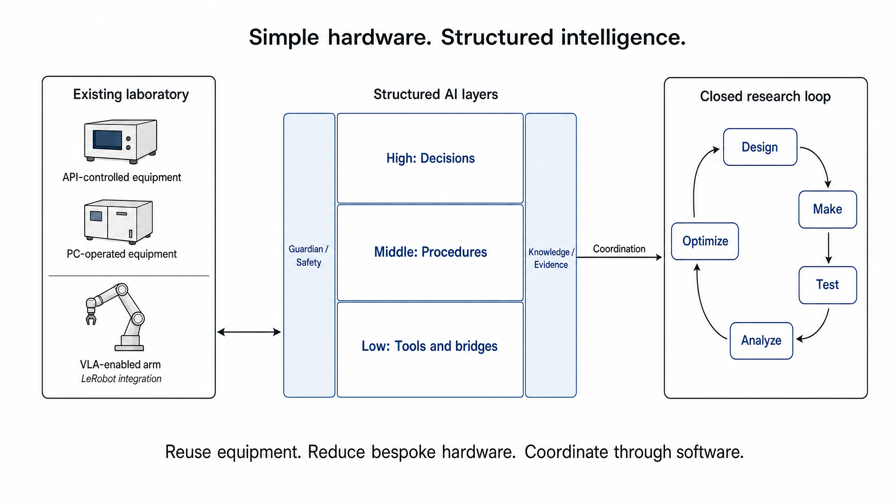
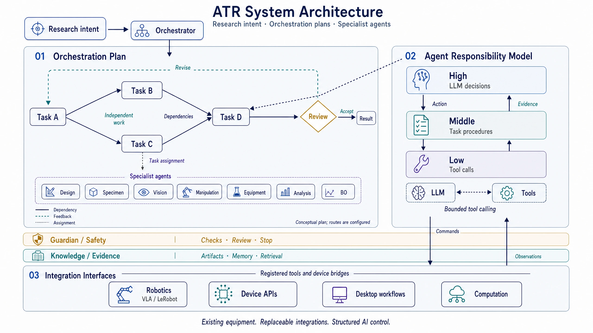

<!-- atr-doc
doc_type: index
subtype: index
status: active
authority: navigation
audience:
  - researcher
  - reviewer
  - artifact_evaluator
  - operator
  - developer
scope:
  - repository
  - paper
summary: Paper-first landing page for the Autonomous Researcher Framework system and supporting platform.
related_docs:
  - README.ko.md
  - README.en.md
  - docs/paper/README.md
  - docs/README.md
  - docs/standards/paper_documentation_standard.md
  - docs/runtime/current_code_snapshot.md
  - docs/runtime/three_level_control_model.md
  - CONTRIBUTING.md
  - SECURITY.md
supersedes: []
-->

# Autonomous Researcher Framework

### Simple hardware. Structured intelligence. Self-driving laboratories.

ATR adds a **structured AI control architecture to existing laboratories**.
Specialist agents connect reasoning, procedures, and device execution across
AI-native robots, API-controlled devices, and PC-operated instruments.

The approach combines **equipment reuse, a VLA-enabled robot arm, and advanced
software coordination**. It aims to reduce dependence on bespoke fixtures and
dedicated transfer automation while retaining the laboratory's existing
equipment and working environment.

[Paper](docs/paper/README.md) · [Results](docs/paper/06_evaluation_and_results.md) ·
[Setup](README.en.md) · [Agents](docs/agents/README.md) ·
[Device bridges](docs/device_bridges/README.md) · [All docs](docs/README.md) ·
[한국어](README.ko.md)

*Structured AI layers coordinate existing equipment and VLA-enabled manipulation.*

## Problem

Laboratories rarely start with a uniform automation interface. A robot may use
a learned policy, a printer may expose an API, and a measurement instrument may
only be accessible through its desktop software. Connecting those capabilities
to research decisions is the systems problem ATR addresses.

The hardware remains simple; the software carries the integration complexity.
A VLA-enabled arm provides the manipulation capability, with LeRobot offering
an integration boundary for supported replacement robots. Changing an arm
still requires compatible hardware support, calibration, and policy validation.

Reusing instruments avoids replacing them solely for automation, while learned
manipulation offers an alternative to task-specific fixtures and transfer
mechanisms. These are architectural cost advantages, not a measured comparison
of total deployment cost.

## System Contribution

ATR places High/Middle/Low control and the cross-cutting Guardian/Safety and
Knowledge/Evidence responsibilities over existing laboratory capabilities.
VLA-based manipulation connects otherwise separate physical stages; the
software architecture coordinates that capability with research decisions.

The primary contribution is the integrated research system—not a new optimizer,
robot policy, or finite-element solver.

| System idea | What ATR implements | Read more |
|---|---|---|
| Existing-lab transformation | Agent-owned procedures call tools and bridges for robot, API, and desktop operations | [Equipment interfaces](docs/device_bridges/README.md) |
| VLA-enabled physical integration | A robot arm connects physical stages, offering an alternative to bespoke transfer fixtures; LeRobot separates supported robot integration from task coordination | [Manipulation](docs/agents/manipulation_agent.md) |
| Structured AI layers | LLM decision layers interpret evidence and select bounded tools; numerical and device execution stay with their specialist implementations | [Agent responsibilities](docs/agents/README.md) |
| Closed-loop experimental feedback | Design, fabrication, observation, transfer, testing, analysis, knowledge, and next-candidate selection share explicit handoffs | [Closed-loop method](docs/paper/03_closed_loop_method.md) |

### System Architecture

ATR organizes research work through an **Orchestration Plan**: a graph of
agent tasks, dependencies, conditional routes, and feedback. A closed-loop
experiment is one execution pattern within that plan—not the framework's
fixed organizing sequence.

*Framework overview. Plan nodes represent tasks assigned to specialist agents;
the configured plan defines their dependencies, conditions, and actual routes.*

**Plan and coordination.** The Orchestrator connects research intent to
specialist-agent handoffs, while the graph runtime follows declared routes
and evaluates transition conditions. Feedback can initiate another design;
independent background work, such as FEM, can continue without blocking the
measurement-to-optimization path. See the [system architecture](docs/paper/02_system_architecture.md)
for runtime responsibilities and the [Runtime IDE](docs/runtime/runtime_ide.md)
for plan inspection and configuration.

**Structured agent intelligence.** High-level decision layers interpret evidence
and select bounded actions; middle-level procedures manage the task; low-level
tools execute it and return observations. LLM judgment complements numerical
methods and established workflows rather than replacing their computations.
The [control model](docs/runtime/three_level_control_model.md) explains the
levels, and the [agent references](docs/agents/README.md) map each agent's
implemented decisions, tools, and handoffs.

**Shared safety and knowledge.** Guardian/Safety reviews execution conditions
and continuation, while Knowledge/Evidence preserves artifacts, curates memory,
and supplies relevant context. These responsibilities span the architecture;
they are not simply two more sequential experiment steps. See
[Guardian](docs/agents/guardian_agent.md) and [Knowledge](docs/agents/knowledge_agent.md)
for their respective contracts.

**Replaceable integration interfaces.** Registered tools and device bridges
connect agent procedures to VLA/LeRobot robotics, device APIs, desktop-operated
instruments, and computation. This separates research coordination from
equipment-specific execution and supports reuse of existing laboratory
hardware. The [bridge references](docs/device_bridges/README.md) describe these
interfaces; the [API and connection matrix](docs/agents/agent_api_connection_matrix.md)
shows which agents consume them.

## Closed Loop

Design → Make → Observe and transfer → Test → Analyze → Learn and optimize → Design.

The execution graph also includes verification, operator review, failure routes,
and per-cycle artifacts. Analysis supplies measured objectives to optimization;
background FEM work can continue independently.

## Demonstration and Evidence

The retained supervised **mixed-mode closed-loop demonstration** completed
equipment testing, post-test clearance, Analysis, BO-managed LHS advancement,
and the next Design handoff. Printing deposition was skipped in that run;
specimen identity was not independently validated. It therefore demonstrates
that integrated path, not unattended end-to-end manufacturing.

Compression testing is the current application example, **not the definition
of the platform**.

| Question | Evidence |
|---|---|
| What completed in the recorded cycle? | [Closed-loop results](docs/paper/06_evaluation_and_results.md) |
| Which artifacts support each claim? | [Claim–evidence map](docs/paper/09_claim_evidence_traceability.md) |
| How can the checks be reproduced? | [Reproducibility](docs/paper/07_reproducibility.md) |
| Where are per-cycle outputs retained? | [Loop artifact archiving](docs/runtime/loop_artifact_archiving.md) |

Agent-local API, local-model, and virtual-device checks are reported in the
individual references. They do not replace physical validation. Comparative
cost, scientific benefit, and multi-run reliability remain evaluation work.

## Agent References

Each linked reference opens with a role diagram and current status, followed by
workflow, tools, interfaces, artifacts, and verification.

| Agent | Responsibility | Detailed reference |
|---|---|---|
| Orchestrator | Interpret intent and coordinate stage handoffs | [Orchestrator](docs/agents/orchestrator_agent.md) |
| Design | Review candidate suitability and emit design specifications | [Design](docs/agents/design_agent.md) |
| Specimen Making | Evaluate fabrication suitability and call preparation tools | [Specimen Making](docs/agents/specimen_agent.md) |
| Vision | Capture observations and review visual evidence | [Vision](docs/agents/vision_agent.md) |
| Manipulation | Select robot skills and review transfer completion | [Manipulation](docs/agents/manipulation_agent.md) |
| Lab Equipment | Execute stored workflows and review acquisition results | [Lab Equipment](docs/agents/equipment_agent.md) |
| Analysis | Process measurements and develop computational models | [Analysis](docs/agents/analysis_agent.md) |
| Knowledge | Curate Markdown knowledge and retrieve scoped context | [Knowledge](docs/agents/knowledge_agent.md) |
| Bayesian Optimization | Select optimization strategy and review numerical proposals | [BO](docs/agents/bo_agent.md) |
| Guardian | Review execution evidence and advise continuation | [Guardian](docs/agents/guardian_agent.md) |

## Platform Contribution

The supporting platform separates experiment logic from device interfaces,
model backends, and operator workspaces. Its extension surfaces make the
demonstrated system reusable; compatibility with another laboratory still
requires integration and validation.

[Platform architecture](docs/paper/04_platform_architecture.md) ·
[Runtime IDE](docs/runtime/runtime_ide.md) ·
[Interface contracts](docs/paper/appendix_a_interfaces.md)

## Device Bridge References

| Capability | Interface role | Reference |
|---|---|---|
| Printer fleet | Select and coordinate printer providers | [Printer Fleet](docs/device_bridges/printer_fleet_bridge.md) |
| Bambu Lab | Printer control and fabrication artifacts | [Bambu X2D](docs/device_bridges/bambu_x2d_bridge.md) |
| Prusa | Printer provider integration | [Prusa MK4S](docs/device_bridges/prusa_mk4s_bridge.md) |
| Robotics | Learned-policy execution, replay, and robot workspaces | [LeRobot](docs/device_bridges/lerobot_bridge.md) |
| Desktop instruments | Stored GUI workflows and acquisition | [Windows PyAutoGUI](docs/device_bridges/windows_pyautogui_bridge.md) |
| Test-area vision | Camera observations and verification evidence | [UTM Vision](docs/device_bridges/utm_vision_bridge.md) |
| Computation | Simulation and analysis adapters | [CAE](docs/device_bridges/cae_computation_bridges.md) |
| Virtual devices | Deterministic substitutes for non-hardware tests | [Base and Simulators](docs/device_bridges/base_simulator_bridges.md) |

## Getting Started

| Reader | Start here |
|---|---|
| Researcher or reviewer | [Problem and contributions](docs/paper/01_problem_and_contributions.md) → [Results](docs/paper/06_evaluation_and_results.md) |
| Operator | [Installation and operation](README.en.md) → [Device bridges](docs/device_bridges/README.md) |
| Developer | [Runtime reference](docs/runtime/current_code_snapshot.md) → [Agent APIs](docs/agents/agent_api_connection_matrix.md) |
| Contributor | [Contributing](CONTRIBUTING.md) → [Documentation rules](docs/standards/documentation_standard.md) |

Consult [operational limitations](docs/paper/08_safety_ethics_and_limitations.md)
before connecting physical equipment. [Security policy](SECURITY.md) covers
vulnerability reporting.

## Citation and License

Use the repository's [citation metadata](CITATION.cff) and [license](LICENSE).
The [paper package](docs/paper/README.md) is a working research narrative;
publication metadata is recorded only when available.
