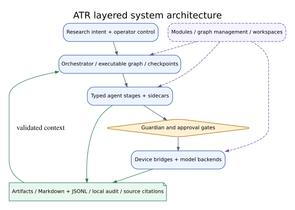
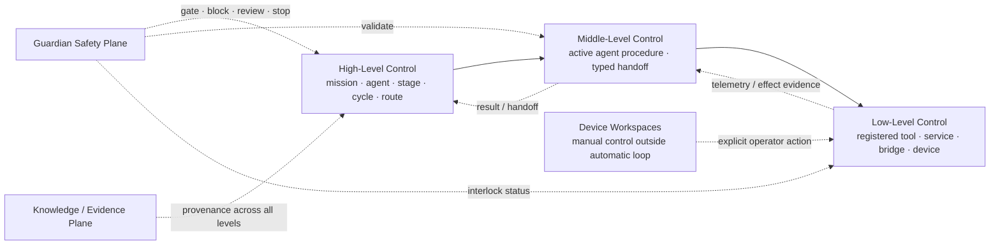
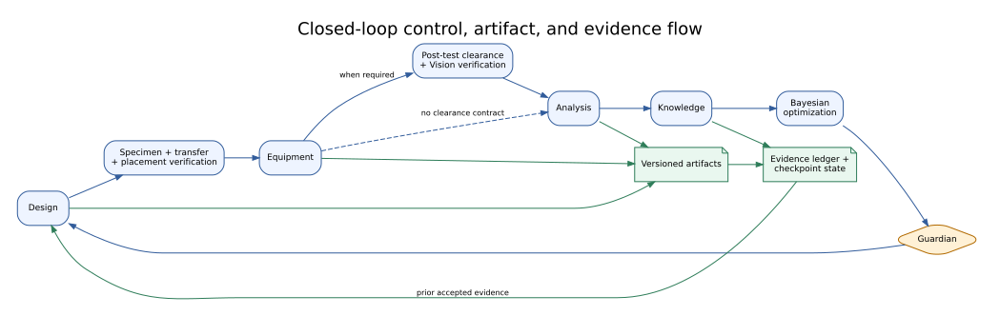
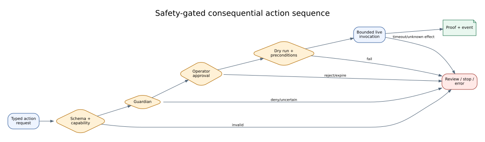

# Autonomous Researcher Framework

> **Research artifact status:** active software repository; paper package in
> review; end-to-end scientific and live-hardware results not yet evaluated.

Autonomous Researcher Framework (ATR) is a safety-gated, evidence-aware
multi-agent system that connects research intent, experimental design,
specimen preparation, perception, manipulation, equipment operation, analysis,
durable knowledge, and Bayesian optimization in a resumable closed loop.

[한국어](README.ko.md) · [Detailed English guide](README.en.md) ·
[Paper package](docs/paper/README.md) · [Documentation index](docs/README.md) ·
[Runtime IDE Reference](docs/runtime/runtime_ide.md)

## Graphical Abstract


**Figure 1.** ATR treats laboratory automation as a governed system loop.
Amber diamonds represent Guardian/operator gates; green artifacts represent
durable evidence. The structure is backed by repository inspection. Scientific
benefit and live-hardware robustness remain `not_evaluated`.

## Paper Summary

**Working title:** *Autonomous Researcher Framework: A Safety-Gated
Closed-Loop Multi-Agent System and Extensible Platform for Laboratory
Automation*

The paper narrative is intentionally asymmetric:

1. **Primary — system contribution:** a declared, checkpointed research loop
   with typed stage handoffs, explicit safety/operator gates, durable evidence,
   knowledge feedback, and diagnosable terminal states.
2. **Secondary — platform contribution:** replaceable modules, graphs, model
   backends, device bridges, and operator workspaces that extend the loop
   without bypassing its contracts.

The canonical research questions are:

| ID | Research question |
|---|---|
| RQ1 | How does ATR compose heterogeneous research stages into a complete, resumable closed loop? |
| RQ2 | How does ATR preserve auditable evidence across decisions, execution, observation, analysis, and knowledge updates? |
| RQ3 | How do Guardian and operator gates constrain unsafe, uncertain, or irreversible actions? |
| RQ4 | How can new agents, devices, models, and workspaces be added without weakening system contracts? |

Read the [paper package](docs/paper/README.md) for the complete argument,
evaluation design, reproduction tiers, safety limitations, and claim-evidence
map.

## Problem

A laboratory research loop crosses reasoning, software, physical state,
measurement, analysis, and iterative decision-making. At every boundary, a
system can lose the original objective, artifact provenance, approval state,
external-effect state, or recovery context. Independent tool calls make a demo
easy to assemble but leave a scientific run difficult to audit. A single
opaque agent hides policy and failure boundaries.

ATR models the workflow as an explicit graph of domain stages, sidecars,
control gates, evidence paths, feedback edges, and terminal states. A model
suggestion, an approved control decision, a device response, and a scientific
observation remain distinct artifacts.

## System Contribution

At implementation baseline `0b7627b`, the checked-in primary graph contains 19
nodes, 68 declared edges, and 12 stage-dispatch entries. Those counts are dated
architecture observations—not performance or stability guarantees.

| System mechanism | Role in the research loop | Evidence boundary |
|---|---|---|
| Executable graph | Makes dispatch, feedback, sidecars, and terminal routes inspectable | Structure inspected; complete physical campaign not evaluated |
| Typed stage handoffs | Separates objectives, decisions, domain artifacts, and errors | Concrete end-to-end contract matrix not evaluated here |
| Checkpointed state | Supports explicit continuation and recovery context | Recovery effectiveness by failure class not evaluated |
| Guardian/operator gates | Constrain consequential or uncertain actions | Control points inspected; live safety effectiveness not evaluated |
| Evidence and Knowledge path | Preserves artifacts, ledger/outbox state, provenance, and context | Package contracts tested; full scientific lineage not evaluated |
| Bayesian-optimization return path | Proposes a next candidate through governed feedback | Path inspected; scientific benefit not evaluated |

The current code and configuration support the bounded architecture claim
`C-SYS-ARCH-01`. They do not support a claim of unattended operation,
generalized laboratory safety, or improved scientific outcomes.

## System Architecture



**Figure 2.** Research intent and operator control enter an orchestrated graph;
typed agents and sidecars operate behind Guardian, model, and device boundaries;
artifacts flow to durable evidence and knowledge. Dashed platform paths are
extension surfaces, not a separate primary thesis.

### Three-Level Control Model

ATR uses three control levels **during the automatic experiment loop**. These
names describe existing runtime boundaries; they do not introduce a second
scheduler or a separate device path.



| Level or plane | Runtime responsibility | Main authority |
|---|---|---|
| High-Level Control | Select mission, active agent, stage, cycle, retry/review, and terminal route | Orchestrator, LangGraph runtime, controller |
| Middle-Level Control | Execute the active agent's bounded internal procedure and emit typed results | Agent implementation and module contract |
| Low-Level Control | Execute and observe one approved bounded action | ToolRegistry/MCP tool, service, queue/lease manager, device or computation bridge |
| Guardian Safety Plane | Gate all levels and issue continue/review/stop/error decisions | Guardian, approval policy, bridge hard interlocks |
| Knowledge/Evidence Plane | Preserve intent, decision, command, observation, result, and provenance | events, artifacts, reports, Knowledge ledger/outbox/graph |

Device Workspaces remain explicit manual setup, commissioning, training, and
control surfaces. Reusing a bridge does not make a workspace action an
automatic agent handoff. See the
[Three-Level Control Model](docs/runtime/three_level_control_model.md) and the
[per-agent classifications](docs/agents/README.md#three-level-control-classification).

The nominal research stages are:

```text
design -> specimen -> vision/manipulation -> equipment -> analysis
       -> knowledge -> Bayesian optimization -> Guardian
       -> continue / review / complete / error
```

The actual graph includes runtime dispatch, supervisor overlays, evidence
flows, sidecars, and explicit terminal nodes. See
[System Architecture](docs/paper/02_system_architecture.md) and the
[Current Code Snapshot](docs/runtime/current_code_snapshot.md).

## Closed Loop



**Figure 3.** Control progression and durable evidence are separate paths. A
cycle is complete only when it reaches an explicit continuation or terminal
state and retains the artifacts needed to explain that state.

One explanatory cycle is:

1. initialize or resume objective, run/cycle identity, state, and prior evidence;
2. generate a typed design or protocol artifact;
3. prepare and verify specimen/physical state;
4. resolve capability, approval, dry run, and bounded equipment execution;
5. analyze validated observations with input and parameter identity;
6. update durable knowledge through validated service contracts;
7. propose a next candidate from constraints and accepted trials;
8. pass continuation through Guardian and operator policy.

Failure handling distinguishes invalid input, unavailable capability, denied
approval, known no-effect timeout, uncertain external effect, analysis error,
knowledge-sync degradation, and explicit policy stop. See the
[Closed-Loop Method](docs/paper/03_closed_loop_method.md).

## Agent References

The [Agent Reference Index](docs/agents/README.md) provides the canonical
per-agent reading path, and the
[API and Connection Matrix](docs/agents/agent_api_connection_matrix.md)
compares responsibilities, contracts, connections, effects, safety, and
recovery. Each figure below is an implementation-inspection projection; code,
manifests, the executable graph, imported routes, and bridge implementations
remain authoritative.

| Agent | Actual role | Primary input → output | Highest effect | Details | Figures |
|---|---|---|---|---|---|
| [Orchestrator](docs/agents/orchestrator_agent.md) | Compiles mission, context, handoffs, decisions, and routes | intent/run state → mission, handoff, decision, route | model/local state; no direct device | [Reference](docs/agents/orchestrator_agent.md) | [Flow](docs/agents/assets/figures/orchestrator_01_closed_loop_handoffs.svg) · [Execution](docs/agents/assets/figures/orchestrator_02_execution_effect_boundary.svg) |
| [Design](docs/agents/design_agent.md) | Selects a deterministic constrained experiment candidate | objective/priors → experiment specification | model/local state; no physical action | [Reference](docs/agents/design_agent.md) | [Flow](docs/agents/assets/figures/design_01_closed_loop_handoffs.svg) · [Execution](docs/agents/assets/figures/design_02_execution_effect_boundary.svg) |
| [Specimen Making](docs/agents/specimen_agent.md) | Creates and verifies the manufacturing digital thread | experiment specification → specimen evidence/handoff | physical possible after printer gates | [Reference](docs/agents/specimen_agent.md) | [Flow](docs/agents/assets/figures/specimen_01_closed_loop_handoffs.svg) · [Execution](docs/agents/assets/figures/specimen_02_execution_effect_boundary.svg) · [Connections](docs/agents/assets/figures/specimen_03_api_connection_architecture.svg) |
| [Vision](docs/agents/vision_agent.md) | Emits freshness-bounded observation and verification | camera/context → vision report/signal/evidence | read-only observation; verified stop possible | [Reference](docs/agents/vision_agent.md) | [Flow](docs/agents/assets/figures/vision_01_closed_loop_handoffs.svg) · [Execution](docs/agents/assets/figures/vision_02_execution_effect_boundary.svg) · [Connections](docs/agents/assets/figures/vision_03_api_connection_architecture.svg) |
| [Manipulation](docs/agents/manipulation_agent.md) | Supervises a bounded robot transfer and post-place verification | specimen/fresh Vision → verified transfer result | physical possible after robot gates | [Reference](docs/agents/manipulation_agent.md) | [Flow](docs/agents/assets/figures/manipulation_01_closed_loop_handoffs.svg) · [Execution](docs/agents/assets/figures/manipulation_02_execution_effect_boundary.svg) · [Connections](docs/agents/assets/figures/manipulation_03_api_connection_architecture.svg) |
| [Lab Equipment](docs/agents/equipment_agent.md) | Executes an exact registered instrument protocol | verified placement/protocol → measurement/proof | desktop and physical possible after live gates | [Reference](docs/agents/equipment_agent.md) | [Flow](docs/agents/assets/figures/equipment_01_closed_loop_handoffs.svg) · [Execution](docs/agents/assets/figures/equipment_02_execution_effect_boundary.svg) · [Connections](docs/agents/assets/figures/equipment_03_api_connection_architecture.svg) |
| [Analysis](docs/agents/analysis_agent.md) | Derives curves, metrics, objectives, uncertainty, and optional CAE comparison | raw measurement → evaluation/BO handoff | optional external analysis; no direct device | [Reference](docs/agents/analysis_agent.md) | [Flow](docs/agents/assets/figures/analysis_01_closed_loop_handoffs.svg) · [Execution](docs/agents/assets/figures/analysis_02_execution_effect_boundary.svg) · [Connections](docs/agents/assets/figures/analysis_03_api_connection_architecture.svg) |
| [Knowledge](docs/agents/knowledge_agent.md) | Persists provenance, patterns, performance, and bounded context | accepted artifacts/reports → durable records/contexts | local/external persistence; no physical action | [Reference](docs/agents/knowledge_agent.md) | [Flow](docs/agents/assets/figures/knowledge_01_closed_loop_handoffs.svg) · [Execution](docs/agents/assets/figures/knowledge_02_execution_effect_boundary.svg) · [Connections](docs/agents/assets/figures/knowledge_03_api_connection_architecture.svg) |
| [Bayesian Optimization](docs/agents/bo_agent.md) | Proposes the next constrained candidate | analysis/priors → ranked recommendation | model/local state; proposal only | [Reference](docs/agents/bo_agent.md) | [Flow](docs/agents/assets/figures/bo_01_closed_loop_handoffs.svg) · [Execution](docs/agents/assets/figures/bo_02_execution_effect_boundary.svg) |
| [Guardian](docs/agents/guardian_agent.md) | Decides continue, review, stop, or error | risk/health/failures/approvals → route decision | blocks/stops downstream; no direct action | [Reference](docs/agents/guardian_agent.md) | [Flow](docs/agents/assets/figures/guardian_01_closed_loop_handoffs.svg) · [Execution](docs/agents/assets/figures/guardian_02_execution_effect_boundary.svg) |

## Device Bridge References

The [Device Bridge Reference Index](docs/device_bridges/README.md) documents
the actual manager, provider, runtime-sidecar, computation, and simulator
boundaries; the [Bridge API and Connection Matrix](docs/device_bridges/bridge_api_connection_matrix.md)
compares entry points, protocols, modes, effects, evidence, and recovery. The
graph registry is a projection rather than the complete provider inventory, so
the table includes code-registered Bambu, CalculiX/PINN, camera, and test
boundaries as well as graph entries.

| Boundary | Actual role | Agent/tool entry | Protocol/target | Highest effect | Details | Figures |
|---|---|---|---|---|---|---|
| [Printer Fleet](docs/device_bridges/printer_fleet_bridge.md) | Selects one explicit printer profile and routes without silent fallback | Specimen · `printer.prepare` | in-process routing to Bambu or Prusa | physical possible only inside selected provider gates | [Reference](docs/device_bridges/printer_fleet_bridge.md) | [Flow](docs/device_bridges/assets/figures/printer_fleet_01_system_handoffs.svg) · [Execution](docs/device_bridges/assets/figures/printer_fleet_02_execution_effect_boundary.svg) · [Connections](docs/device_bridges/assets/figures/printer_fleet_03_api_connection_architecture.svg) |
| [Bambu Lab X2D](docs/device_bridges/bambu_x2d_bridge.md) | Slices, probes, transfers, monitors, and guards native autoejection artifacts | Specimen via Printer Fleet | Bambu Studio · MQTT TLS · FTPS · LAN video · printer | upload/start/ejection physical possible after identity and proof gates | [Reference](docs/device_bridges/bambu_x2d_bridge.md) | [Flow](docs/device_bridges/assets/figures/bambu_x2d_01_system_handoffs.svg) · [Execution](docs/device_bridges/assets/figures/bambu_x2d_02_execution_effect_boundary.svg) · [Connections](docs/device_bridges/assets/figures/bambu_x2d_03_api_connection_architecture.svg) |
| [Prusa MK4S](docs/device_bridges/prusa_mk4s_bridge.md) | Slices and validates G-code, then separates upload, start, status, and optional ejection | Specimen · `printer.prepare` | PrusaSlicer · PrusaLink HTTP · printer | upload/start/ejection physical possible after live flags and validation | [Reference](docs/device_bridges/prusa_mk4s_bridge.md) | [Flow](docs/device_bridges/assets/figures/prusa_mk4s_01_system_handoffs.svg) · [Execution](docs/device_bridges/assets/figures/prusa_mk4s_02_execution_effect_boundary.svg) · [Connections](docs/device_bridges/assets/figures/prusa_mk4s_03_api_connection_architecture.svg) |
| [LeRobot](docs/device_bridges/lerobot_bridge.md) | Manages robot profiles, ports, cameras, processes, rollouts, datasets, and Isaac sidecars | Manipulation/Vision · `lerobot.*` | subprocess · serial · camera · Isaac/HF/files | robot motion possible after profile, policy, Vision, operator, and Guardian gates | [Reference](docs/device_bridges/lerobot_bridge.md) | [Flow](docs/device_bridges/assets/figures/lerobot_01_system_handoffs.svg) · [Execution](docs/device_bridges/assets/figures/lerobot_02_execution_effect_boundary.svg) · [Connections](docs/device_bridges/assets/figures/lerobot_03_api_connection_architecture.svg) |
| [Windows PyAutoGUI](docs/device_bridges/windows_pyautogui_bridge.md) | Runs exact token-gated desktop programs with allowlists, traces, artifacts, and proof | Equipment · `equipment.pyautogui.*` | HTTP · Windows server · PyAutoGUI · desktop/UTM | desktop and instrument effects possible after live preflight | [Reference](docs/device_bridges/windows_pyautogui_bridge.md) | [Flow](docs/device_bridges/assets/figures/windows_pyautogui_01_system_handoffs.svg) · [Execution](docs/device_bridges/assets/figures/windows_pyautogui_02_execution_effect_boundary.svg) · [Connections](docs/device_bridges/assets/figures/windows_pyautogui_03_api_connection_architecture.svg) |
| [UTM Vision](docs/device_bridges/utm_vision_bridge.md) | Manages ROS/camera runtime, streams, calibration, pose, and temporal state evidence | Vision/Equipment · camera and UTM tools | ROS 2 · subprocess · RealSense/USB · MJPEG | process/camera side effects; no UTM mechanics authority | [Reference](docs/device_bridges/utm_vision_bridge.md) | [Flow](docs/device_bridges/assets/figures/utm_vision_01_system_handoffs.svg) · [Execution](docs/device_bridges/assets/figures/utm_vision_02_execution_effect_boundary.svg) · [Connections](docs/device_bridges/assets/figures/utm_vision_03_api_connection_architecture.svg) |
| [CAE Computation](docs/device_bridges/cae_computation_bridges.md) | Provides deterministic CAE, guarded CalculiX jobs, and explicit-availability PINN contracts | Analysis · `cae.*`/`calculix.*`/`pinn.*` | filesystem · Gmsh/CalculiX subprocess · model registry | local compute/resource effects; no physical device action | [Reference](docs/device_bridges/cae_computation_bridges.md) | [Flow](docs/device_bridges/assets/figures/cae_computation_01_system_handoffs.svg) · [Execution](docs/device_bridges/assets/figures/cae_computation_02_execution_effect_boundary.svg) · [Connections](docs/device_bridges/assets/figures/cae_computation_03_api_connection_architecture.svg) |
| [Base and Simulators](docs/device_bridges/base_simulator_bridges.md) | Supplies deterministic schema/routing substitutes and labels their evidence limits | test-mode agents · mock tools | in-process/local fixtures only | no external device effect | [Reference](docs/device_bridges/base_simulator_bridges.md) | [Flow](docs/device_bridges/assets/figures/base_simulator_01_system_handoffs.svg) · [Execution](docs/device_bridges/assets/figures/base_simulator_02_execution_effect_boundary.svg) · [Connections](docs/device_bridges/assets/figures/base_simulator_03_api_connection_architecture.svg) |

## Runtime IDE Reference

The Runtime IDE is the operator workbench for graph drafting, validation,
compilation evidence, dry-run gates, version activation, saved-run control,
approval resolution, timeline inspection, and artifact lineage. Its UI is an
authoring and control surface: active configuration, backend gates, registered
handlers, bridge implementations, and device-specific safeguards retain
authority over execution.

| Surface | Route | Actual role | Highest effect | Details | Figures |
|---|---|---|---|---|---|
| [Runtime IDE](docs/runtime/runtime_ide.md) | `/ide` | Draft, validate, inspect compiled structure, dry-run, version/activate, run, approve, stop, and inspect evidence | Active configuration and run-control effects; physical effects remain downstream of runtime and device gates | [Reference](docs/runtime/runtime_ide.md) | [Boundaries](docs/runtime/assets/figures/runtime_ide_01_system_boundaries.svg) · [Activation](docs/runtime/assets/figures/runtime_ide_02_config_activation_flow.svg) · [Evidence](docs/runtime/assets/figures/runtime_ide_03_observability_evidence_flow.svg) |

## Safety



**Figure 4.** A consequential action may pass schema/capability validation,
Guardian policy, configured operator approval, and dry-run/precondition checks
before live invocation. Failure or uncertainty routes to review, stop, or
error.

These controls are defense layers, not universal safety certification.
Laboratory-specific interlocks, risk assessment, responsible operators,
least-privilege deployment, emergency stops, and evidence remain required. An
ambiguous physical timeout must not be retried automatically until external
state is re-established.

See [Safety, Ethics, and Limitations](docs/paper/08_safety_ethics_and_limitations.md)
and [Security Policy](SECURITY.md).

## Evaluation Status

| Result or question | Status | Evidence |
|---|---|---|
| Route and graph architecture counts | `supported` within inspection scope | `E-INSPECT-ARCH-001` |
| Paper claim-evidence/document contracts | `partially_supported` | `E-TEST-DOC-001` |
| Supervised closed-loop integration, one iteration | `supported` within mixed-mode scope | [E-LIVE-LOOP-001](docs/paper/evidence/2026-09-07-supervised-closed-loop.md) |
| Latest run: one-cycle integration demonstration completed | `supported` with measured-data feedback | [E-LIVE-LOOP-002](docs/paper/evidence/2026-09-07-latest-cycle-demonstration.md) |
| Checkpoint/resume effectiveness | `not_evaluated` | No qualifying paper record |
| Guardian/live safety effectiveness | `not_evaluated` | No qualifying paper record |
| Knowledge/BO scientific benefit | `not_evaluated` | No comparative study |
| End-to-end physical/scientific outcome | `not_evaluated` | No Tier 4 campaign record |

Architecture inspection observed 346 FastAPI `APIRoute` entries, 353 total
application routes, 19 graph nodes, 68 graph edges, and 12 stage-dispatch
entries at baseline `0b7627b`. Focused documentation validation initially
reported 23 selected tests passing. These are architecture and documentation
results, not scientific efficacy metrics.

See [Evaluation and Results](docs/paper/06_evaluation_and_results.md) and the
[artifact manifest](docs/paper/artifact_manifest.yaml).

The latest audited run, `run-20260907T043145Z-f6152b`, completed one integration
cycle: live compression data (2,113 samples) passed Analysis, the BO objective
was handed off, and the next Design/Specimen stage was reached. Placement and
post-test clearance were verified. Printer deposition was skipped; optional
observer errors remained non-blocking. This is a completed one-cycle system
demonstration, not a full-manufacturing or scientific-efficacy claim.

The earlier 2026-09-07 record (`E-LIVE-LOOP-001`) reached live UTM clearance, Analysis, BO-managed LHS point
2/8, and the next Design/Specimen entry. Printer deposition was skipped and
the operator substituted a specimen. This verifies feedback integration, not
full manufacturing, material validity, or acquisition-based optimization.
The linked report includes an archive hash index; raw operational artifacts
remain local and are not included in the public repository.

## Platform Contribution

The secondary platform contribution makes the system adaptable while retaining
its boundaries:

| Extension surface | Contract boundary |
|---|---|
| Agent modules | Manifest, handler, schemas, stage registration, optional presentation metadata |
| Execution graphs | Versioned nodes, edges, dispatch, transitions, validation, activation rules |
| Model backends | Routed provider/model contract, readiness state, bounded inference, priority where configured |
| Device bridges | Capabilities, allowlists, authentication, dry run, proof, timeout/error semantics |
| Knowledge backends | Ontology, provenance, durable ledger/outbox, receipts, bounded queries |
| Operator workspaces | Server-authoritative APIs for inspection, review, configuration, and mutation |

At baseline `0b7627b`, the FastAPI application exposes 346 `APIRoute` entries
and 353 total routes across runtime, graph/module, knowledge, equipment,
printer, robotics, optimization, analysis, and operator surfaces. Route count
shows breadth and documentation drift; it is not a usability metric.

See [Platform Architecture](docs/paper/04_platform_architecture.md), the
[Interface Appendix](docs/paper/appendix_a_interfaces.md), and the
[Deployment Appendix](docs/paper/appendix_b_hardware_and_deployment.md).

## Reproducibility

Reproduction is tiered so a lower-tier result cannot be mistaken for a higher
one:

| Tier | Environment | Initial package status |
|---|---|---|
| 0 | Static repository, document, figure, and evidence inspection | Available |
| 1 | Focused unit and contract tests | Documentation subset available |
| 2 | Deterministic replay or simulation | `not_evaluated` |
| 3 | Browser-level operator workflow | `not_evaluated` in this package |
| 4 | Supervised live hardware | `not_evaluated` |

Minimal Tier 0/1 document checks from repository root:

```bash
.venv/bin/python scripts/validate_documentation.py
.venv/bin/python scripts/validate_paper_publication.py
.venv/bin/python -m pytest -q \
  tests/unit/test_documentation_validation.py \
  tests/unit/test_paper_publication_validation.py
```

Environment setup, application launch, and optional subsystem requirements are
documented in [REQUIREMENTS.md](REQUIREMENTS.md), the
[Detailed English Guide](README.en.md), and the
[Korean user guide](README.ko.md). Do not proceed to live equipment solely
because lower-tier checks pass.

## Paper Documentation

The canonical paper-shaped reading path is:

1. [Problem and Contributions](docs/paper/01_problem_and_contributions.md)
2. [System Architecture](docs/paper/02_system_architecture.md)
3. [Closed-Loop Method](docs/paper/03_closed_loop_method.md)
4. [Platform Architecture](docs/paper/04_platform_architecture.md)
5. [Experimental Setup](docs/paper/05_experimental_setup.md)
6. [Evaluation and Results](docs/paper/06_evaluation_and_results.md)
7. [Reproducibility](docs/paper/07_reproducibility.md)
8. [Safety, Ethics, and Limitations](docs/paper/08_safety_ethics_and_limitations.md)
9. [Claim-Evidence Traceability](docs/paper/09_claim_evidence_traceability.md)

Writing and review rules are normative in the
[Paper Documentation Standard](docs/standards/paper_documentation_standard.md).
Developer/operator navigation remains in the
[Documentation Index](docs/README.md).

Detailed current roles, handoffs, APIs, services, device connections, safety
gates, and recovery boundaries for all ten agents are indexed in the
[Agent References](docs/agents/README.md), with a cross-agent
[API and Connection Matrix](docs/agents/agent_api_connection_matrix.md).

## Citation

Use [CITATION.cff](CITATION.cff) for software citation metadata. The current
record intentionally uses a contributor-group name because the responsible
people have not supplied an approved author list or affiliations. No paper DOI
or archival DOI is claimed.

## License and Security

No open-source license has been granted for this repository. Read
[LICENSE](LICENSE) before use, modification, or redistribution. This status is
a release blocker if public reuse is intended; selecting a license requires an
explicit owner decision.

Report vulnerabilities through the private process in
[SECURITY.md](SECURITY.md). Do not open public issues containing secrets,
private endpoints, or exploit details.

Contribution workflow: [CONTRIBUTING.md](CONTRIBUTING.md) · Release history:
[CHANGELOG.md](CHANGELOG.md)
