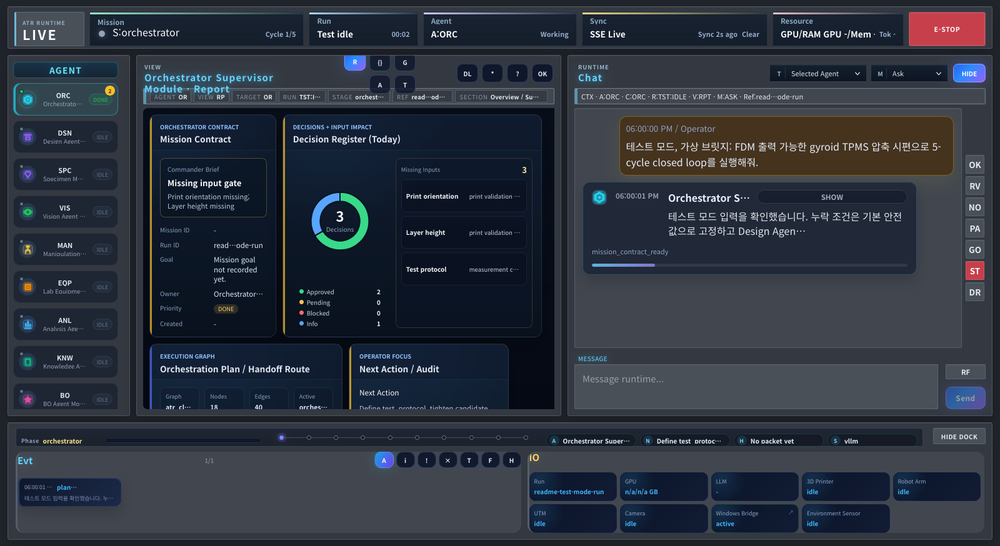
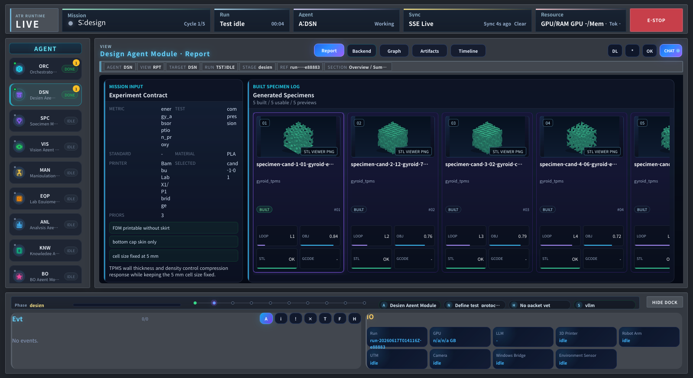
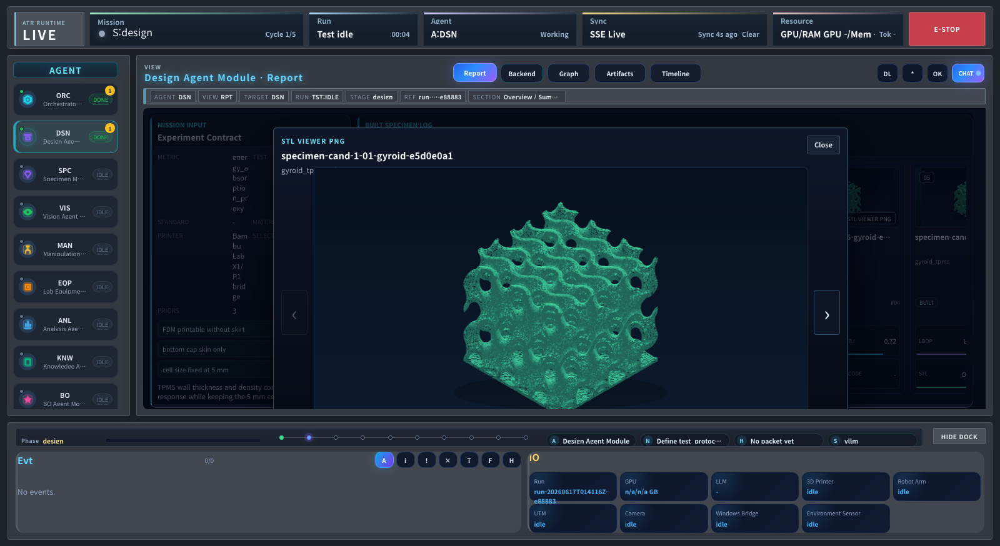
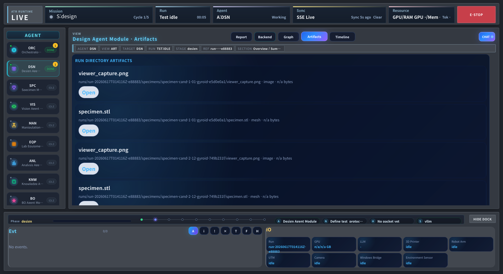

# Autonomous Researcher Framework

Closed-loop laboratory automation framework for autonomous experiment planning,
metamaterial specimen design, device bridges, robot workflows, analysis, BO, and
operator-supervised live execution.

## Live GUI Preview

Browser-captured test-mode screens from the active Live GUI renderer:

<table>
  <tr>
    <td width="50%">
      
       
      <b>Orchestrator</b> - mission contract, handoff plan, runtime chat, and cycle status.
    </td>
    <td width="50%">
      
       
      <b>Design Agent</b> - generated gyroid TPMS candidates, DOE board, and FDM handoff state.
    </td>
  </tr>
  <tr>
    <td width="50%">
      
       
      <b>STL Preview</b> - enlarged generated specimen preview inside the operator report area.
    </td>
    <td width="50%">
      
       
      <b>Artifacts</b> - runtime files, STL captures, and digital-thread evidence for generated specimens.
    </td>
  </tr>
</table>

Choose a documentation language:

- [English Guide](README.en.md)
- [한국어 가이드](README.ko.md)

Fast entry points:

- [Documentation Index](docs/README.md)
- [Documentation Standard](docs/standards/documentation_standard.md)
- [Document Type Templates](docs/templates/document_types.md)
- [Complete User Manual KR](docs/tutorials/user_manual.ko.md)
- [Complete User Manual EN](docs/tutorials/user_manual.en.md)
- [Closed Loop / Page / Agent Reference](docs/runtime/closed_loop_and_pages_reference.md)
- [Current Code Snapshot](docs/runtime/current_code_snapshot.md)
- [Knowledge Graph Operations KR](docs/knowledge/knowledge_graph_operations.ko.md)
- [Documentation Governance Design](docs/superpowers/specs/2026-08-08-documentation-governance-design.md)
- [Requirements](REQUIREMENTS.md)
- [API Docs](http://localhost:7860/docs)
- [Live GUI](http://localhost:7860/live)
- [Runtime IDE](http://localhost:7860/ide)

The root guides and complete manuals describe the actual repository layout, GUI pages, closed-loop stage flow, agents, runtime modes, operation sequence, troubleshooting, and developer extension rules.

For current behavior, code/configuration and active References take priority.
Use Guides for procedures, Designs for approved or proposed target decisions,
Plans for execution order, and Evidence for time-bounded research or audits.
