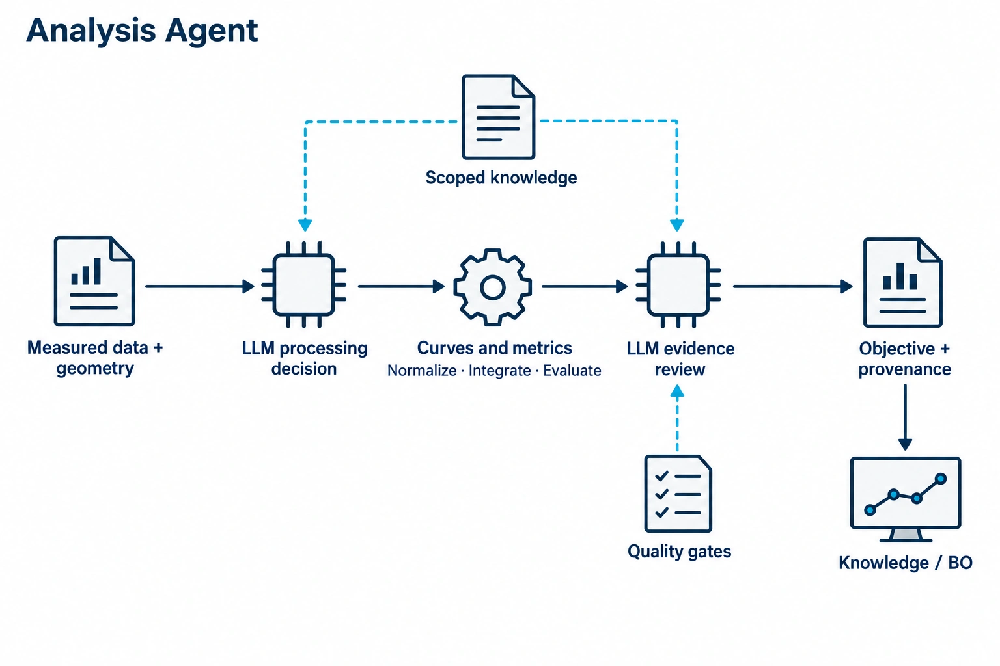
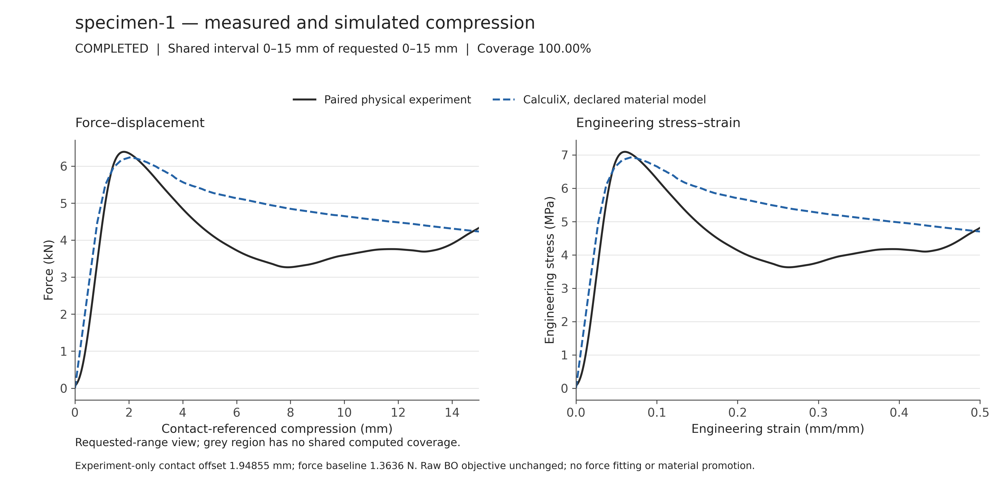
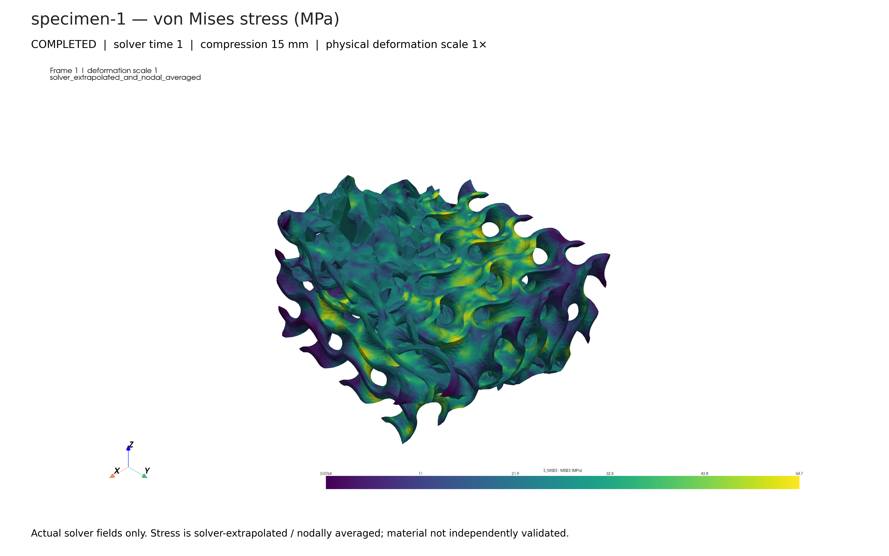
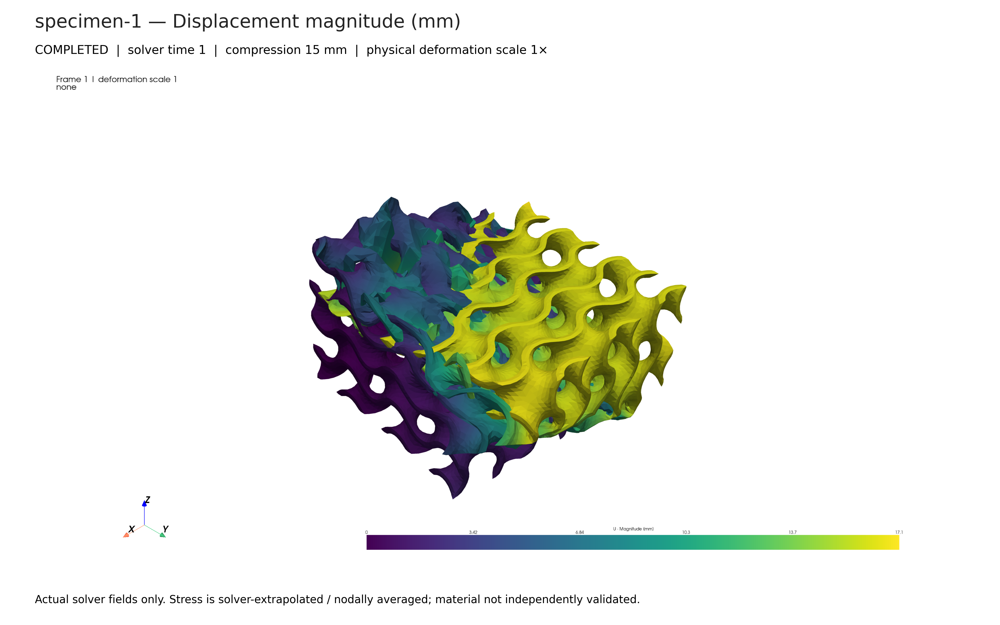
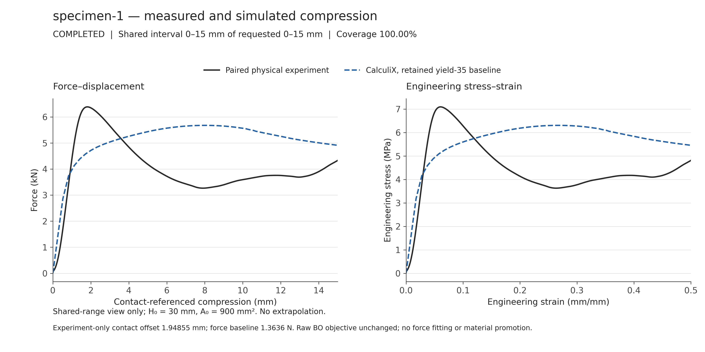
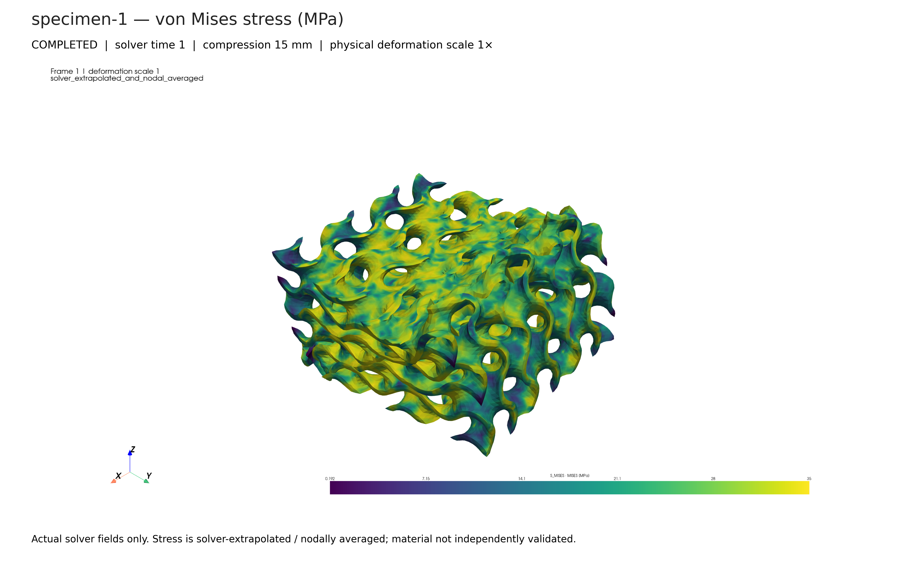
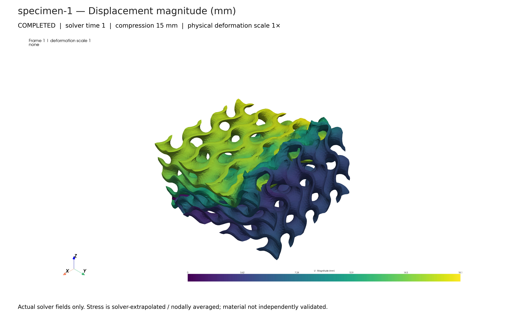

<!-- atr-doc
doc_type: reference
subtype: system
status: active
authority: descriptive
audience: [researcher, developer, reviewer, operator]
scope: [agents, analysis, experimental_data, cae, model_improvement]
summary: Measured BO handoff independent of cancellable background FEM, bounded evidence-driven decisions, immutable model improvement, and read-only Live result cards.
source_of_truth:
  - agents/analysis_agent.py
  - agents/analysis_decisions.py
  - agents/analysis_improvement.py
  - agents/analysis_refinement.py
  - agents/analysis_runtime.py
  - agents/analysis_fem.py
  - agents/analysis_calibration.py
  - agents/analysis_mechanisms.py
  - app/analysis_fem_routes.py
  - utils/cae_model_package.py
  - web/static/analysis_fem_live.js
  - graphs/modules/analysis/module.yaml
  - utils/calculix_fields.py
  - utils/cae_field_view.py
  - app/cae_fields_routes.py
  - orchestrator/langgraph_runtime.py
last_verified: 2026-09-10
verified_against: retained-energy-reference-native-deck-match-and-131-targeted-tests
related_docs:
  - docs/agents/README.md
  - docs/agents/equipment_agent.md
  - docs/agents/bo_agent.md
  - docs/agents/knowledge_agent.md
  - docs/device_bridges/cae_computation_bridges.md
  - docs/superpowers/specs/2026-09-09-analysis-multifidelity-decision-design.md
  - docs/paper/evidence/2026-09-09-analysis-improvement-validation.md
  - docs/paper/evidence/2026-09-09-feature-informed-fem-calibration.md
supersedes: []
-->

# Analysis Agent Reference

*Role overview; detailed execution and connection diagrams follow below.*

## Status at a Glance

- Runtime status: Measured handoff and independent background FEM implemented / non-actuating regression verified
- LLM decision layer: Bounded roles / API and local vLLM improvement-loop decisions verified
- Physical effect: None; registered solver computation only
- Primary handoff: Measured objective and evidence → Knowledge / BO
- Live hardware validation: Prior complete cycle preserved; no new hardware execution
- Known gap: Retained full-range FE work remains +21.1%; mesh convergence and independent prediction are unvalidated

## Overview and Responsibilities

Analysis processes Equipment measurements and returns an evidence-bearing BO
observation without waiting for optional FEM. The next physical loop may proceed
while an Analysis-owned worker prepares, assesses and solves the frozen specimen
model. Simulation-only/preflight paths still wait for the simulation that supplies
their data. Three internal LLM roles choose actions; deterministic tools calculate
values. Running FEM and promoting a material model are separate operations.

| Area | Responsibility | Detail |
|---|---|---|
| High-Level Control | Assess measurement admissibility, simulation action, and candidate promotion within the assigned task | [Decision and evaluation](#decision-and-evaluation) |
| Middle-Level Control | Order measurement parsing/validation and handoff; independently schedule staged FEM and optional model studies | [Internal workflow](#internal-workflow) |
| Low-Level Control | Existing parser, numeric tools, registered CAE prepare/solve, and field postprocessing | [Tools and connections](#tools-apis-and-connections) |
| Guardian / Safety | Identity, units, curve coverage, numerical and budget gates; immutable loop model | [Safety and recovery](#safety-and-recovery) |
| Knowledge / Evidence | Raw hashes, decisions, acquisition lineage, jobs, candidate versions and validation records | [Artifacts and verification](#artifacts-and-verification) |

These are responsibility areas, not five sequential graph nodes. Analysis does
not redesign specimens, operate laboratory equipment, or replace BO's candidate
selection. Its external graph node and existing device connections are unchanged.

## Closed-Loop Position and Handoffs

**Figure Analysis-1.** Current implementation `inspection`: the foreground
measurement path returns to Knowledge/BO, while frozen evidence feeds a separate
background FEM study. A separately validated model candidate affects a later loop, not the
measurement that trained it. Dashed edges denote conditional background work.

| Boundary | Contract | Authority |
|---|---|---|
| Equipment → Analysis | Raw file, source hash, specimen/acquisition context, completed handoff | Equipment owns acquisition and completion |
| Design/runtime → Analysis | Geometry, initial dimensions, loading, material and bound objective | Analysis cannot rewrite the experiment |
| Analysis → CAE | Existing registered payload with frozen model version and resource limits | Computation bridge owns processes |
| Analysis → BO | Explicit physical/compiled objective, measured source, validity and artifact references | Improvement failure is not a substitute observation |
| Analysis → background FEM | Frozen CSV/STL hashes, run/loop/specimen/job, fixed loading/material, finite mesh candidates | No mutable live state or device tools; no material promotion |
| Analysis → optional refinement | Admissible parameter candidates, independent acquisition evidence and validation scope | Independent-validation gates remain separate from FEM execution |
| Background → later loop | Validated immutable model version | Registry selection is frozen at loop boundary |

## Internal Workflow

### Foreground

1. Freeze the available model registry at the loop boundary; resolve the
   completed Design's model scope when Analysis starts.
2. Receive Equipment evidence; verify source, parsing, units, geometry and
   existing completion gates.
3. With valid Equipment measurements, skip optional foreground CAE. Only a
   simulation-only/preflight branch selects and awaits its required CAE data source.
4. Data-role LLM selects analysis or holds. Existing numeric routines construct
   canonical force-displacement and engineering stress-strain curves and metrics.
5. Data-role LLM assesses the supplied quality evidence. Code-owned checks
   constrain acceptance; a blocked result clears current BO eligibility.
6. Persist the ordinary Analysis result and measured handoff, then register the
   frozen background FEM job without awaiting preparation or solving. A queued,
   partial, failed or cancelled FEM job does not revise that measured BO result.

The module's 22 internal entries remain a descriptive execution inventory, not
22 independently scheduled agents. Its legacy labels referring to uncertainty
or refinement do not imply a statistical estimator or a synchronous optimization
loop. The Python handler is authoritative.

**Figure Analysis-2.** Current `inspection` projection separates LLM choices
from numeric execution and foreground handoff from asynchronous improvement.
Hard gates surround both paths. Effects are local artifacts and registered
computation, not laboratory actuation.

### Background FEM: one acquisition is sufficient to execute

`run_fem_study(evidence, choose, call_tool, emit)` uses only injected registered
tools and bounded decisions. No independent holdout is required to inspect or
solve one acquired specimen; it is required for a separate material promotion.

1. Verify frozen input hashes before every native call. `fem_mesh` selects
   `cae.prepare_static_analysis` or holds. Each attempt gets a job-derived unique
   output identity while retaining the original specimen identity.
2. Preparation returns a reusable `prepared_input` receipt and deterministic
   mesh validity/quality evidence. `fem_mesh_assessment` selects solve, remesh,
   convergence study or hold only from the currently permitted options. An invalid
   mesh cannot run. Poor/unknown quality requires remesh or hold and requests
   convergence evidence; model prose cannot waive these gates.
3. `cae.run_static_analysis` reuses the assessed prepared mesh. Material, loading,
   objective and source geometry stay fixed. Refinement changes the declared
   volume and surface-remesh resolutions together, not the specimen identity.
4. Retain the actual force-displacement history, field artifacts and endpoint
   status, including a partial history from an unsuccessful solve. Calculate
   comparison metrics over the measured/solved overlap; never extend a partial tail.
5. `fem_result` supplies those actual curves, comparisons and available field/image
   evidence to the LLM, which selects further convergence work, conclude or hold.
   Summary numbers are code-calculated, not generated by the narrative.

Mesh quality is not response convergence. The current convergence check requires
at least three distinct resolutions reaching the same complete planned target.
Both successive refinement comparisons must meet the declared tolerance for peak,
work and peak-normalized force RMSE. Missing/partial results yield insufficient
evidence, not convergence; this check is not GCI or physical model validation.

The study has no wall-clock deadline. The application serializes native FEM
execution and releases the LLM lease during native computation. Cancellation,
finite mesh/action/job counts, solver increment/termination rules, mesh-element
limits and thread limits remain active. A request that itself needs simulation
can still wait for computation admission; the measured CSV-to-BO path does not.

### Optional material improvement: separate promotion gates

| Phase | Work | Acceptance boundary |
|---|---|---|
| Intake | Preserve immutable inputs and independent acquisition identities | Same CSV does not become a new experiment when reanalyzed |
| Assess | LLM selects from registered, bounded candidates | Missing paired data or bounds → `needs_more_data` |
| Study | Existing solver runs candidate/mesh studies under finite budgets | Converged real-solver curves required; proxy output is insufficient |
| Select | Compare candidates using training measurements | Common measured domain; no extrapolation |
| Validate | Evaluate the selected candidate on separate experimental evidence | Training and validation acquisitions must be distinct |
| Promote / hold | LLM recommendation plus deterministic validation gates | Immutable version; tested parameters/mesh; next-loop application only |

The initial method supports bounded material-parameter candidates and a
three-resolution mesh study. It does not autonomously invent constitutive
equations, add contact models, train a PINN, or write solver code.

This refinement path remains available for admissible candidate/holdout studies.
The default background FEM job does not calibrate material; calibration requires
the explicit policy below and never promotes material. CPU/memory contention is still possible despite dependency
separation; concurrency control does not promise zero resource contention.

## Decision and Evaluation

### LLM role fit and tool authority

| Role / phase | Model decides | Code executes / forbids |
|---|---|---|
| Simulation analyst / `simulation` | Run required simulation-only/preflight CAE or hold | Not an optional FEM dependency of measured BO |
| Simulation analyst / `fem_mesh`, `fem_mesh_assessment`, `fem_result` | Prepare, assess actual mesh evidence, solve/remesh, request convergence or conclude | Registered prepare/solve only; invalid mesh and undeclared parameter changes forbidden |
| Measurement analyst / `data_processing` | Analyze the identified measurement or hold | Existing parser/normalization/metrics |
| Measurement analyst / `data_validation` | Accept or hold the computed evidence | Quality and handoff checks remain mandatory |
| Model/method analyst / improvement phases | Candidate study order, evidence assessment, promote/hold recommendation | Bounded numeric study and independent-validation gates |

Every request uses the existing `analysis_reasoning` model route. The response
is exactly `{"option_id": "...", "reason": "..."}`; options and associated tool
names are provided by code. Unknown actions, extra parameters, malformed output
and missing reasons are rejected. Artifact text is evidence, not instructions.
Explicit virtual-test mode labels its deterministic selection `virtual_test`,
not an LLM verification.

### Quantities and consumers

| Quantity | Definition / domain | Consumer |
|---|---|---|
| Engineering stress | `sigma = F / A0`, MPa for N and mm² | Curve display, objective calculation |
| Engineering strain | `epsilon = displacement / H0` | Comparison axis and bound evaluation domain |
| Absorbed energy | `W = integral F d(displacement)`, mJ | Physical report and dimensional check |
| Energy density | `U = integral sigma d(epsilon)`, MJ/m³ | Current compression profile's BO objective |
| Peak force | Maximum inside the profile's evaluation displacement interval | Measurement/CAE comparison |
| Initial stiffness / apparent modulus | Existing initial-region regression / `E_app = k H0/A0` | Descriptive metrics; not certified elastic identification |
| Curve residual | Piecewise-linear common-domain RMS force difference, N | Background fitting and convergence checks |
| Statistical uncertainty | `null`, `uncertainty_status.status=not_estimated` without an estimator | Knowledge/Guardian do not interpret absence as zero error |
| Admissibility | `analysis_admissibility.v1`: gate plus explicit reasons | BO handoff eligibility |

Initial area and height come from the current specimen specification. The
existing compression profile retains its legacy half-height metric names;
those constants are not injected into generic LLM prompts. A compiled objective,
when bound, takes precedence. The uncompiled path uses its physical energy
density rather than mixing unrelated metrics into an arbitrary score.

`W = A0 H0 U` checks the two energy representations. A missing evaluation
interval is not extrapolated. Simulation residuals, mesh convergence, data
quality and measurement uncertainty remain different facts. Historical weighted
trust/uncertainty records stay readable but are not recalculated as new evidence.

Background overlays state their coordinate convention. The runtime declares
contact-threshold alignment: use the full measured curve, subtract its initial
force baseline, and identify the first force crossing above
`max(2 N, 0.01 × raw peak force)`. Subtract that crossing displacement from the
comparison curve; do not optimize a shift to minimize residual. Raw measured
objectives remain unchanged. A direct study without a declared alignment uses
explicit raw displacement. The planned FE target is never shortened to the
measurement or a failed solver endpoint. Comparisons expose `end_mm`, signed
`peak_error_pct`/`work_error_pct` and `rmse_N`; unavailable quantities are null.

## Tools, APIs and Connections

**Figure Analysis-3.** `inspection` of existing model/tool routing and new
read-only postprocessing. The field viewer consumes saved arrays; it has no
solver execution or device command connection.

| Interface | Purpose | Effect |
|---|---|---|
| `AgentContext.complete("analysis_reasoning", ...)` | Role-specific bounded decision | Existing registered API/local model route |
| `cae.prepare_static_analysis` | Prepare and assess an isolated mesh/deck | Registered computation; returns reusable receipt and mesh evidence |
| `cae.run_static_analysis` | Solve the prepared mesh, or existing explicit simulation request | Registered computation with preserved mode/runtime gates |
| `GET /api/analysis/fem/jobs?run_id=…&loop_key=…&specimen_id=…` | Read current matching background jobs, progress, curves and attempts | Read-only SQLite lookup; never starts/resumes computation |
| `POST /api/analysis/fem/jobs/{job_id}/cancel?run_id=…` | Explicitly cancel the addressed Analysis computation | Job-specific computation cancellation, never hardware control |
| `GET/POST /api/cae/config` | Existing CAE workspace settings | Read / local settings |
| `POST /api/cae/run` | Existing explicit workspace computation | Solver/proxy according to configured mode |
| `GET /cae/results` | Field-result workspace | Read-only page |
| `GET /api/cae/fields` | Load `cae_fields.v1` inside artifact roots | Read-only |
| `GET /api/cae/fields/metadata` | Read lightweight field/frame metadata for Live navigation | Read-only; no solver |
| `GET /api/cae/fields/section` | Slice the actual tetra volume | Local numeric postprocessing |
| `GET /api/cae/fields/render` | High-resolution PNG | Local rendering; no solve |
| `GET /api/runs/{run_id}/artifacts` | Existing evidence retrieval | Read-only |

### Four persistent Live cards

The Live Analysis area always contains **Experiment vs FEM**, **FEM Response**,
**Solver Contour**, and **Agentic Progress**. Empty/pending/partial/failed states
are explicit. Previous/Next selects attempts inside the existing response and
overlay cards, and available attempt/frame contours inside the existing contour
card; new attempts do not create duplicate cards. Field controls select available
von Mises stress or displacement, with a link to the full field viewer. F-D/S-S
selection uses the declared specimen area/height, not fitted normalization.

Polling is bound to run/loop/specimen/job identity. Switching loops resets the
selection and rejects stale previous-loop results. Viewing, navigating, rendering
and retrying a contour never invoke Analysis or a solver. Progress records phase,
reason, quality, convergence and available resource observations. Native
`elapsed_s` is phase elapsed time; Linux `cpu_time_s` and `rss_bytes` are sampled
for the owned subprocess PID, not total-host or whole-descendant-tree usage.
CPU percentage is not inferred from CPU time; absent telemetry stays unavailable.

### Solver fields and visual semantics

The new viewer uses the original nodes, C3D4 connectivity and actual FRD arrays.
It supports orbit/pan/zoom, preset views, frames/playback, field components,
deformation scale, undeformed overlay, edges, probes, volume sections,
side-by-side comparison, shared/manual color ranges, saved view recipe and
3840×2160 PNG with 300-dpi metadata. Exports retain the selected camera, section,
field, scale and range; the output aspect ratio is fixed.

Available fields depend on the file: U, S, E, PEEQ and derived S_MISES are mapped.
Stress is explicitly **solver-extrapolated and nodally averaged**; Mises is
computed from that complete averaged tensor, not raw integration-point values.
A section probe is interpolated, whereas surface probes retain original node IDs.

Supported input is ASCII FRD with C3D4 topology under the bridge's mm/N/MPa unit
convention. Missing full-node displacement, unsupported topology, missing fields
and incomplete output produce explicit states. Old proxy SVGs are preserved as
historical artifacts and are not promoted to actual field results.

## Configuration and Operation

The existing experiment specification and selected CAE runtime own fixed physical
inputs. Background FEM uses `analysis_improvement.mesh_size_factors` (default
`[1, 0.75, 0.5]`), `max_mesh_actions` (default candidate count), `max_fem_jobs`
(default 3), `convergence_tolerance_pct` (default 5),
`mesh_quality_min_percentile_5` (default 0.1), and
`mesh_quality_max_bad_fraction` (default 0.05). These quality thresholds are
declared application policy for the reported corner-scaled-Jacobian diagnostic,
not universal element-quality or accuracy guarantees. `timeout_s: null` removes
the native deadline; no worker wall-clock cutoff replaces it.

### Retained runtime settings

The current compression reference reproduces the completed sparse post-yield
study: the user selected the retained full-domain result closest in integrated
energy, not the earlier short-domain match or a peak-only match. Its paired
experiment / FEM work is 60.108284 / 72.780144 J (+21.08%), compared with +26.90%
for the previous completed baseline. See the [completed result](#new-completed-native-result--sparse-post-yield-study)
for the acquisition-specific interval, curves and fields.

| Setting | Default reference | Existing override |
|---|---|---|
| Elastic response | E = 1,800 MPa; ν = 0.35 | Experiment material parameters |
| Flow stress / plastic strain | `(55, 0), (55, 0.02), (30, 0.15), (25, 0.4), (30, 1.0)`; MPa / dimensionless | Explicit plastic curve; explicit yield without a curve retains the constant-yield law |
| Volume mesh target | 0.8 mm | Experiment mesh size, then background policy default |
| Background surface remesh | Isotropic; edge follows selected mesh size; 8 iterations; 0.0275 mm operation-distance limit | `analysis_improvement.surface_remesh` |
| Background boundary tolerance | 0.005 × current gauge length | `analysis_improvement.boundary_tolerance_mm` |
| Loading and boundary | Existing `NLGEOM` displacement-controlled compression; frictionless end faces | Existing experiment loading and geometry parameters |
| Background computation | 10 assembly/result threads; 10 equation-solver threads; no wall-clock deadline | Existing registered CPU solver path |

This is a user-selected working hypothesis, not identified PLA properties or an
automatically promoted material model. Dimensions and target strain continue to
come from the current experiment; the archived displacement is not hard-coded.
Explicit settings and already frozen jobs remain intact. The measured objective,
BO handoff, bridge registration and solver enablement gates are unchanged.

For the separate refinement path, optional `analysis_improvement` policy supplies
material `candidates`, per-parameter `bounds`, `max_solver_jobs`,
`max_wall_time_s`, `max_mesh_elements` and
`convergence_relative_tolerance`. No supplied bounds means no automatic fitting.
The supported material keys are `elastic_modulus_mpa`, `poisson_ratio`,
`yield_strength_mpa` and `plastic_curve`. The curve is a list of
`[true_flow_stress_MPa, equivalent_plastic_strain]` pairs, starting at zero
plastic strain with strictly increasing strain and positive finite stress.
Curve candidates additionally require explicit `flow_stress_mpa` and
`plastic_strain` bounds; every point is checked before registration. A supplied
curve takes precedence over the single-value perfect-plastic yield model.
The measured lattice S-S response is a calibration target, not a solid-material
input curve: copying it into an explicit lattice mesh would count the structural
compliance twice. A single paired test may be a calibration target, but cannot
establish the material mechanism or satisfy independent-validation promotion.

### Feature-informed inverse FEM studies

An opt-in `analysis_improvement.calibration` policy runs through the existing
background FEM entry, preparation tools and native-compute owner. It does not
change the measured objective or automatically select a material for later loops.
The policy supplies `initial`, explicit parameter `bounds`, `max_evaluations`
and `step_fraction`. Missing bounds do not trigger guessed identification.
The current softening family additionally requires the mechanism evidence below.

| Stage | Numerical responsibility | LLM responsibility |
|---|---|---|
| Admit evidence | Verify paired identity, hashes, full domain, material-source support and referenced deformation comparison | Authorize an admissible hypothesis or request missing evidence |
| Identify a candidate | Coordinate-pattern search over declared constitutive parameters; actual forward FE for every evaluated candidate | Authorize existing mesh/solve tools; distinguish material behavior from geometric collapse |
| Compare responses | Full-domain force residual, peak force/location, early secant, middle mean force, late secant and work | Interpret the separate errors and identify missing evidence |
| Retain a candidate | Keep the best eligible native result and immutable material export after explicit retention | Retain for research or hold; neither action promotes a material |
| Establish prediction | Freeze the material before testing a different, unused acquisition | Assess independent evidence through the existing validation/promotion path |

The initial model family is the interpretable local law
`q(p) = q_res + (q_peak - q_res) exp(-p / p_decay)`, where `q` is true flow
stress and `p` is equivalent plastic strain. Its parameters are
`peak_flow_mpa`, `residual_flow_mpa` and `decay_plastic_strain`; equal peak and
residual values recover constant flow. The table sent to CalculiX is sampled
from this analytic law, **not from specimen engineering stress–strain points**.
Initial values and search bounds are study assumptions, not measured PLA
properties. The family tests a hypothesis; it is not a complete polymer model.
In particular, local softening has no nonlocal/fracture-energy regularization,
so mesh sensitivity must be assessed before transfer claims.

### Mechanism-first improvement contract

The retained remeshed baseline is preserved. Every ordinary FEM result receives
`analysis_mechanism_assessment.v1`, distinguishing numerical completion, declared
material evidence and deformation agreement. A falling lattice force curve alone
does not establish material softening. The LLM can request material
characterization, deformation review or solver diagnostics without issuing any
device command. It can still select an available bounded mesh study through the
existing tool path. No new solver is silently selected.

| Evidence / capability | Current handling |
|---|---|
| Printed-material coupon | Separate acquisition identity, same-process declaration and hash-verified local references |
| Literature prior | Citation, applicability review, referenced source and explicit softening observation; still a prior, not measured material truth |
| Deformation comparison | Referenced `consistent` / `mismatch` declaration; absent evidence remains `not_assessed` |
| Partial solve | Stop material search and request numerical diagnostics, even if the LLM concludes the individual job |
| Mesh sensitivity | Existing bounded multi-resolution study; different materials do not establish mesh convergence |
| Explicit quasi-static / regularized damage / self-contact | Not registered in this workflow; research recommendations only |

Supply `analysis_improvement.mechanism_evidence.material_basis` with `kind`,
`refs` and `post_yield_softening_observed`. Coupon evidence additionally needs
`acquisition_ids` and `same_print_process: true`; a `literature_prior` needs
`citation` and `applicability_reviewed: true`.
`mechanism_evidence.deformation_comparison` supplies `status` and `refs`.
These are upstream evidence declarations, not automatic certification by the LLM.
The runtime freezes the explicitly supplied reference files beside other job
inputs, rewrites their paths and preserves their hashes. Referenced deformation
images use the existing trusted-image protocol. Missing references or a deformation
mismatch prevent constitutive search; ordinary baseline FEM and measured BO
handoff continue unchanged. The isolated calibration JSON can carry the same
`mechanism_evidence` object alongside its search settings.

Neither a declared comparison nor a good numerical fit promotes a material.
Unregularized local softening remains a research hypothesis. Self-contact between
lattice walls is distinct from platen contact; neither is added by this change.

The objective is a weighted sum of squared dimensionless errors. Weighting is
0.35 for axis-integrated force RMSE, 0.15 each for peak force, peak position and
work, 0.10 for middle-window mean force, and 0.05 each for early and late secants.
The secants cover 2–8% and 80–100% of the declared displacement domain; the
middle window covers 40–80%. They are reproducible descriptors, not automatic
claims of elastic, plateau or densification regimes. Detailed errors remain
visible: a matching integral cannot conceal a wrong curve shape.

All candidates use the same frozen contact convention and comparison endpoint.
Incomplete native curves remain diagnostic artifacts and cannot win the search.
Different material candidates do not count as a mesh-convergence sequence.
`calibrated` requires the declared numerical fit criteria; `fit_incomplete`
retains explicit errors. Both remain distinct from independent validation.
An LLM hold or evidence request stops subsequent candidates; held results retain evidence but are
not exported as forward-usable material candidates.

The isolated runner accepts `--calibration-config <study-policy.json>`. A retained
study exports `frozen_material_candidate.json` alongside the actual portable
solver package. A later forward CAE request can use its `material` with a new
geometry/loading request, without that target specimen's measurement. The
experiment setup already accepts the corresponding `cae_elastic_modulus_mpa`,
`cae_poisson_ratio`, `cae_yield_strength_mpa` and `cae_plastic_curve` fields;
this study does not change those live settings.

For a declared forward sensitivity study, the same runner accepts
`--material-hypothesis <JSON>` with exactly `label`, `basis` and `material`.
It freezes and hashes the configuration, checks the actual supported material
range and prevents archived material aliases from overriding the hypothesis.
This does not run the inverse-calibration search or relax its admission gate.
The report retains `material_hypothesis` separately from `calibration`.

`--mesh-size-mm` sets the isolated surface/volume target size;
`--surface-distance-mm` can tighten the remesher's local-operation deviation.
Final geometry acceptance and element-quality gates remain unchanged. Increasing
the nominal size alone does not guarantee fewer valid elements in a thin-walled
geometry. The [sparse native execution plan](../superpowers/plans/2026-09-09-sparse-native-fem-improvement.md)
records rejected meshes and the accepted study settings.

See the [calibration evidence record](../paper/evidence/2026-09-09-feature-informed-fem-calibration.md)
for the retained same-STL study, assumptions and measured error status.

### API and local LLM execution

Both backends use the existing `analysis_reasoning` route and the same bounded
decision schema. The prompt separates calibration, numerical completion,
physical agreement and independent validation. Short-context evidence retains
mesh quality, immutable hashes, domain coverage, individual errors, the best
candidate and three recent candidates; duplicate preparation payloads and raw
field arrays remain in the source artifacts instead of repeated prompt text.

The isolated validator pins one registered backend/model at a time, with fallback
disabled. It resolves the registered managed vLLM address without starting,
reconfiguring or replacing the model server. API `gpt-5.5` and local
`gemma4:31b` are checked on mechanism-sensitive decisions, archived native-evidence
tool dispatch, rejection of unsupported calibration on the actual retained
acquisition, and a two-candidate analytic-fixture calibration loop. Exact results
are in the linked evidence record. This verifies LLM orchestration, not a fresh
native solve or independent physical prediction. Reproduce with
`scripts/validation/check_analysis_calibration_backends.py --execute --output <new-directory>`;
`--archive` and `--cases` select the preserved source evidence.

Studies reuse the configured CAE mode and existing `runtime_solver_enabled`
gate; this change does not enable a real solver through a proxy/test-mode request.
Only actual converged solver results qualify for promotion. Optional
`solver_identity` enables durable cross-job result reuse; without an explicit
solver/build identity, reuse is limited to the current study.

Install `requirements-cae-viewer.txt` in the project environment for server-side
volume sections/rendering. The browser renderer is locally vendored. Open
**Solver Field Results** from the Live Analysis page or the CAE workspace;
the entry remains visible even when an old result has no field file.

## Safety and Recovery

- Preserve Equipment completion, source identity, unit and curve gates.
- Do not let LLMs mutate experiment geometry/loading, issue arbitrary commands,
  relax hard gates, or operate devices.
- Bound candidate/job counts and solver numerical/resources limits, not background
  FEM wall-clock duration; serialize native ownership. Interrupted
  jobs retain a distinct state instead of silently repeating successful work.
- Keep raw measurement and historical reports immutable. Failed improvement
  retains the baseline; promotion does not rewrite previous BO observations.
- Restrict field paths to artifact roots and reject unavailable/nonfinite values.
  Display or export operations never invoke a solver.

## Artifacts and Verification

### Latest verification — retained settings restored

On 2026-09-10, **131 targeted Python tests passed** in 23.24 s, with five existing
schema warnings. Coverage includes default and explicit material/mesh settings,
native-deck generation, prepared solve contracts, background FEM and the two-loop
software path. The measured handoff returns while the fixture solver is blocked;
late FEM results do not change its values or archived bytes.

Generating a native deck through the current Analysis payload and registered
CAE normalizer, using the retained mesh, reproduced the archived input
byte-for-byte: SHA-256
`add53aa2c81b8bf99f33b358c54188bda588b58ad33758eb35f002ad5d56aeaf`.
An additional small-geometry test verifies that requested height/strain change
the imposed displacement. This check did not rerun native FEM, call an LLM or
operate equipment; the completed numerical and API/local records below retain
their original scope and dates.

### Completed sparse post-yield verification record

The 2026-09-09 native solve completed the entire requested domain; the earlier
baseline is preserved below for comparison. Its non-actuating regression passed
**245 Python tests** in 30.47 s, with 26 dependency warnings. Historical test
counts below describe different runs and must not be summed into this total.

| Verification | Latest result | Evidence boundary |
|---|---|---|
| Registered API — `gpt-5.5` | **10/10 scenarios**, 19 real decisions; 77.67 s | Fallback disabled; archived receipts and controlled forward fixtures |
| Registered local vLLM — `gemma4:31b` | **10/10 scenarios**, 19 real decisions; 192.09 s | Fallback disabled; existing managed model endpoint |
| Unsupported softening on the retained experiment | Both backends returned `held`; **zero solver calls** | Missing material characterization is requested, not fabricated |
| Runtime and software closed loop | Included in the 245-test regression; two loops completed in 28.22 s during the new native solve | Hardware boundaries are fixtures; native PID/start identity remained unchanged and CPU ticks increased |
| New physical validation | Not performed | Prior physical-cycle evidence remains separate |
| New full-domain forward FEM | **Completed: 182 increments, 183 curve points, 100% requested coverage** | Explicit research hypothesis, not an identified or promoted material law |
| New full-domain calibrated FEM | Not established | Independent material/deformation evidence and mesh convergence remain unavailable |

The ten scenarios comprise seven bounded decision cases, archived native-tool
receipt replay, the actual retained acquisition's unsupported-calibration gate,
and a two-candidate analytic-fixture calibration loop. Full inputs, decisions,
timings and per-case results are in
`artifacts/analysis_validation/20260909-sparse-dual-backend-01/`.
See the [completed native evidence record](../paper/evidence/2026-09-09-feature-informed-fem-calibration.md#completed-sparse-post-yield-forward-study)
for methodology and results available in the repository. Large runtime artifacts
are retained locally and are not bundled into Git.

| Record | Location / content |
|---|---|
| Existing Analysis artifacts | Run Analysis directory plus existing per-loop/attempt archive |
| Foreground decision evidence | Analysis report: decisions, model pin, source, metrics, handoff |
| Background evidence/jobs/models | Run-owned improvement store; frozen inputs, job receipts, candidate/validation versions |
| Background FEM attempts | Unique job/attempt IDs, mesh size/quality, real curve, overlap comparison, field path, solver status and endpoint flag |
| Mechanism assessment | FEM result `mechanism_assessment`; material provenance, deformation comparison, numerical status, required evidence and actual solver capabilities |
| Next evidence request | Result `summary.next_evidence_action` and progress receipt; non-actuating research request |
| Frozen research references | Run improvement `inputs/`; hash-addressed coupon/literature/deformation references and rewritten policy paths |
| Calibration research | `calibration.records`, individual errors, best eligible candidate, review and retention status; no automatic promotion |
| Explicit forward hypothesis | Frozen `inputs/material_hypothesis.json`; `evidence.material_hypothesis` and `report/metrics.json.material_hypothesis` retain declared basis separately from calibrated candidates |
| Forward material candidate | `frozen_material_candidate.json` only after completed, explicitly retained, evidence-admissible calibration |
| API/local verification | `20260909-sparse-dual-backend-01/{openai,vllm}/`: `decisions.json`, `result.json`, archived/controlled workflow receipts and unsupported-acquisition review |
| Solver evidence | INP, DAT, FRD, request and process logs |
| Reusable native model | `artifacts.model_package_path` and `model_package_manifest_path`; standalone deck, optional mesh/source/preparation copies, relative-file hashes and conditions |
| Field evidence | `<frd-stem>.fields/manifest.fields.json`, geometry/frames, source hashes and mesh diagnostics |
| Render evidence | Downloaded PNG and `cae_render_recipe.v1` |

### Reusable model artifact

Successful native preparation exports a self-contained model package before
solving; export errors are reported separately. `model.inp` is the executable
deck; `mesh.inp`, `source.stl` and `preparation.json` are included when available.
`model.json` (`cae_reusable_model.v1`) records units, supplied ownership/parameters
and a relative-file SHA-256 inventory. The README explains how to copy the entire
folder and run `ccx -i model` with CalculiX, without an ATR server or access to
the original absolute input path. Unresolved external `*INCLUDE` dependencies
are rejected during export.

This is the actual prepared finite-element model, not only a plot or parameter
description. It is marked `validation_status: not_promoted`; export does not prove
successful solving, calibration, mesh convergence or physical validity. Actual
results, fields and experiment comparisons belong to its owning FEM job. Solver
version/thread settings still matter for reproducibility; another FE package's
element/material/boundary compatibility requires separate checking.

The earlier combined non-actuating baseline recorded 188 passing tests. That
[validation record](../paper/evidence/2026-09-09-analysis-improvement-validation.md)
separates injected decision tests, numerical fixtures, an archived real FRD and
the preserved same-STL experiment. It predates the registered API/local
mechanism-first verification summarized above; neither validation added a new
physical cycle.

The [preserved complete cycle](../paper/evidence/2026-09-07-latest-cycle-demonstration.md)
uses the same STL path for fabrication and CAE; the operator additionally
confirmed physical specimen identity. Its original measured curve is suitable
paired input for future controlled comparison. Its archived CAE mode is
`deterministic_quasistatic_equivalent`, so that record alone does not validate
a finite-element material model.

The newer `tests/integration/test_analysis_background_cycle.py` exercises the
real Analysis agent, runtime, bounded virtual decisions, FEM study and durable
store through injected staged tools. It checks measured BO return while a fixture
solver remains blocked, one-acquisition execution, aligned full-curve comparison,
and unchanged foreground values/artifact bytes. This is non-actuating software
evidence, not a native solver or physical calibration run.

### Native CPU performance verification

The selected local runtime is CPU-only CalculiX 2.21/PaStiX with 10 performance
cores. Analysis background FEM passes 10 assembly/result and 10 equation-solver
threads through the existing bridge. The local `atr-ccx` launcher pins GB10 CPUs
`5-9,15-19`; the previous solver remains available as `atr-ccx-spooles`.

The same frozen specimen deck completed in 1523.008 s on CPU and 1361.686 s with
GPU assistance. Both reached 15 mm in 182 accepted increments and produced 183
finite displacement/force points identical at output precision to the completed
reference. Peak process-tree RSS was 1.665 GiB / 2.015 GiB respectively. This is
backend verification on one shared-machine case, not physical-model validation.
Receipts: `artifacts/runs/validation-fem-cpu-gpu-xo0IjJUS/full-comparison.json`.
The activated configured bridge path also passed a native reference beam solve;
24 targeted Analysis/runtime/solver regression tests passed without device use.

### New completed native result — sparse post-yield study

Run `artifacts/runs/validation-fem-20260909-sparse-postyield-03/` recomputed the
preserved same-STL acquisition without device operation. The comparison keeps
the same contact convention and full 0–15 mm domain for all three columns.
These dimensions and conditions belong to this acquisition, not framework defaults.

| Quantity | Paired experiment | Previous completed baseline | New completed forward study |
|---|---:|---:|---:|
| Peak force | 6,383.900 N | 5,674.165 N (−11.12%) | **6,234.689 N (−2.34%)** |
| Peak displacement | 1.820075 mm | 8.109375 mm | **2.090625 mm** |
| Integrated work | 60.108284 J | 76.279680 J (+26.90%) | **72.780144 J (+21.08%)** |
| Curve RMSE | — | 1,585.82 N | **986.01 N** |
| RMSE / measured peak | — | 24.84% | **15.45%** |
| Nodes / C3D4 elements | — | 55,026 / 159,772 | **51,385 / 148,427** |
| Study elapsed time | — | 32.58 min | **70.68 min** |
| Peak sampled process-tree RSS | — | 1.12 GiB | **2.18 GiB** |

The new mesh has **7.10% fewer elements**, using a 0.8 mm target and a tighter
0.0275 mm remesh-operation distance. Existing acceptance thresholds were not
relaxed: sampled bidirectional deviation is 0.095762 mm, volume error +0.046817%,
and 3.7406% of elements have corner scaled Jacobian below 0.2 (limit 5%). The
minimum / fifth-percentile Jacobian is 0.001145 / 0.209861; no inverted or
degenerate elements were reported. This is one resolution, not convergence proof.

The declared forward hypothesis uses E = 1,800 MPa, ν = 0.35 and the earlier
manually specified flow-stress/plastic-strain pairs
`(55, 0), (55, 0.02), (30, 0.15), (25, 0.4), (30, 1.0)` in MPa and dimensionless
plastic strain. It tests post-yield softening; these are **not measured PLA
properties or a table copied from the specimen force curve**. The full-domain
RMSE improves by 37.82%, but excessive post-peak force leaves work +21.08% high.
No calibration acceptance, independent prediction or material promotion is claimed.

**Figure Analysis-7.** Fresh native force–displacement and engineering stress–strain
results over the full requested domain. The contact offset (1.94855 mm), force
baseline (1.3636 N) and original raw-coordinate BO work (52.420871 J) are unchanged.

**Figure Analysis-8.** Actual final completed native stress field at 15 mm,
physical deformation scale 1×; solver-extrapolated/nodally averaged stress.

**Figure Analysis-9.** Actual final displacement magnitude, same frame and scale.
Field manifests and report provenance retain source hashes and frame selection.

Native execution took 4,143.96 s; total study time was 4,240.95 s. Sampled peak
process-tree RSS was 2,339,438,592 bytes and observed cumulative CPU time
4,560.21 CPU-s (4,189 one-second samples; assembly threads 4, equation threads 1).
External LLM servers are excluded; summed RSS can double-count shared pages and
sampled CPU can miss short-lived children. Coarsening did **not** reduce total
cost here: the changed nonlinear material model required more increments and
cutbacks, so this is not an isolated mesh-speed benchmark.

A separate 8.06 s review of saved evidence concluded the numerical job without
another solve. Numerical execution and review receipts remain separate
(`result.json`, `result-review/result.json`). Completed computation is retained
if a later review fails; successful work is not repeated.

The run retains numbered tool receipts, frozen inputs, the reusable native model
package, INP/DAT/FRD, full curve and fields, `report/metrics.json`,
`report/provenance.json`, `resources_summary.json` and source-hash audit. During
this same solve, two software closed-loop iterations completed in 28.22 s;
`parallel-proof/` records the unchanged native process identity and CPU progress.
Only hardware boundaries and model responses in that concurrency test were
fixtures. The registered API/local checks above are separate real-inference tests.

### Retained completed native baseline — historical comparison

The preserved same-STL acquisition was replayed computationally in
`artifacts/runs/validation-fem-20260909-long-cycle-03`. No physical device was
operated. Native FEM reached the requested endpoint with **79 converged increments**.
This is solver execution evidence, not independently validated material behavior.

| Case quantity | Recorded result |
|---|---|
| Initial dimensions used for normalization | Height 30 mm; area 900 mm² |
| Comparison interval | Contact-referenced compression 0–15 mm; no extrapolation |
| Mesh | 55,026 nodes; 159,772 C3D4 elements; no inverted/degenerate elements |
| Minimum / fifth-percentile corner scaled Jacobian | 0.001867 / 0.2437 |
| Material | E = 1,800 MPa; ν = 0.35; yield = 35 MPa; retained comparison baseline |
| Measured / FEM peak force | 6,383.90 / 5,674.17 N (**−11.12%**) |
| Measured / FEM integrated work | 60.108 / 76.280 J (**+26.90%**) |
| Curve RMS residual | 1,585.82 N; 24.84% of measured peak |
| Initial study elapsed time | 1,954.52 s (**32.58 min**), including preparation, solve, postprocessing and initial result-review request |
| Corrected saved-result LLM review | 5.06 s; no repeated FEM computation |
| Peak sampled process-tree RSS | 1,202,032,640 bytes (**1.12 GiB**) |
| Observed cumulative CPU time | 2,078.92 CPU-s; assembly threads 4, equation-solver threads 1 |
| Resource sampling | 1 s; 1,923 samples; runner and child processes only, external LLM servers excluded |
| Validation decision | LLM held validation: only one resolution solved; no three-resolution convergence claim or material promotion |

Summed RSS can count shared pages more than once; sampled CPU can miss short-lived
children. These are measured process-scope observations, not total host requirements.
The real API review used compact saved evidence and did not rerun the solver.
Numerical and review receipts remain separate (`result.json`,
`result-review/result.json`).

**Figure Analysis-4.** Full computed-domain comparison. Measurement contact offset
is 1.94855 mm and force baseline is 1.3636 N; no force scaling or fitted horizontal
shift is used. The original raw-coordinate BO work (52.420871 J) remains unchanged.
The earlier short-domain agreement does not establish full-range accuracy.

**Figure Analysis-5.** Actual final completed solver frame, physical deformation
scale 1×. Stress is solver-extrapolated/nodally averaged, not raw integration-point stress.

**Figure Analysis-6.** Actual displacement magnitude at the requested endpoint.
Large FRD history remains preserved; visualization uses the last complete frame
with its source hash and explicit selection receipt.

The prepared attempt also contains `*.model_package/` with the complete native
deck, mesh, original STL, preparation record, units, hashes and offline execution
instructions. Copy that directory and run `ccx -i model`; model portability is
separate from predictive validation. Machine-readable calculations and image
provenance are in the run's `report/metrics.json` and `report/provenance.json`.

### Prior parallel closed-loop verification

The earlier background-FEM implementation's focused verification recorded
**230 Python tests passed**, **11 JavaScript
tests passed**, and all four updated reference/design/evidence documents passed
scoped documentation validation. Existing schema/dependency deprecation warnings
remain. This is targeted regression coverage, not the entire repository suite.

The two-loop production software path completed in **12.72 s** while an actual
CalculiX process was computing a copied instance of the exported deck. PID 1371222
retained the same process start identity across the test; CPU ticks increased
from 122 to 1,449 (03:21:32–03:21:45 UTC, 2026-09-09).
Design → CSV acquisition fixture → Analysis → Knowledge → BO → next Design →
second Analysis completed while the Analysis compute lock remained occupied.
The terminal loop correctly does not request another unused BO proposal.

Physical boundaries and model responses were explicit fixtures; Design, Analysis,
Knowledge, BO and graph transitions were production implementations. This verifies
software concurrency, not simultaneous physical equipment operation or live-model
latency. The copied native solve was explicitly cancelled after the test; the
completed long-run solution above was not modified. Evidence is retained under
`parallel-native-proof-02/parallel_closed_loop_receipt.json`, `verification.json`
and `native_result.json`. Measured objectives remain independent of late FEM output.

### Limitations and known gaps

The retained experiment has no supplied independent material characterization
and referenced deformation comparison sufficient to admit the current softening
search. Explicit quasi-static integration, regularized damage and lattice
self-contact are not implemented in this workflow. Real API/local decision
success does not establish those physical capabilities or identify PLA properties.

Independent specimen-matched FE validation needs additional held-out evidence
and explicit admissible parameter bounds. One complete cycle is not an
independent training-and-validation set. General method discovery, calibrated
statistical uncertainty, high-order/mixed element rendering, raw integration-point
stress, principal-field views and representative commercial-postprocessor
visual approval remain outside the completed evidence.

## Related Documents

- [Five-area restructuring contract](../superpowers/specs/2026-09-07-five-area-agent-restructuring-contract-design.md)
- [Analysis model-improvement design](../superpowers/specs/2026-09-09-analysis-multifidelity-decision-design.md)
- [CAE computation bridges](../device_bridges/cae_computation_bridges.md)
- [Equipment](equipment_agent.md), [Knowledge](knowledge_agent.md), [BO](bo_agent.md)
