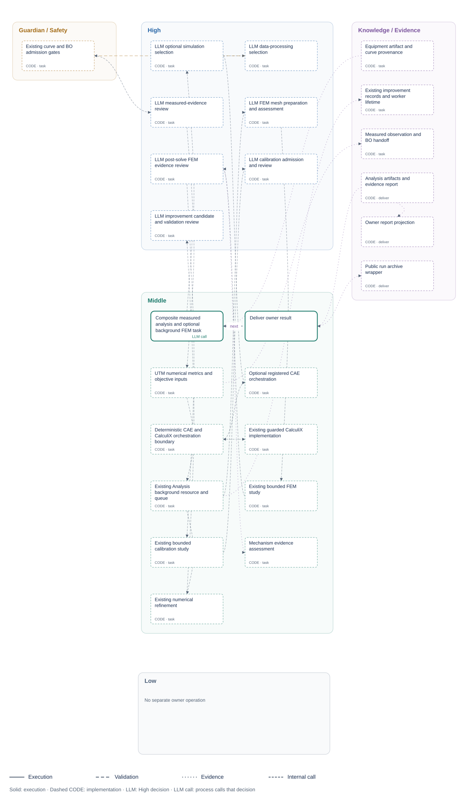

<!-- atr-doc
doc_type: reference
subtype: system
status: active
authority: descriptive
audience: [researcher, developer, reviewer, operator]
scope: [agents, analysis, experimental_data, objective_evaluation]
summary: Evidence-backed experimental postprocessing, physical metrics and bound-objective delivery to BO.
source_of_truth:
  - agents/analysis/agent.py
  - agents/analysis/decisions.py
  - agents/analysis/module.py
  - agents/analysis/execution.py
  - agents/analysis/structure.py
  - agents/analysis/presentation.py
  - agents/analysis/frontend/live_report.js
  - graphs/modules/analysis/module.yaml
  - graphs/modules/analysis/ui.yaml
  - packages/agents/analysis/package.yaml
last_verified: 2026-09-14
verified_against: measurement-only-owner-unit-tests
related_docs: [docs/agents/README.md, docs/agents/equipment_agent.md, docs/agents/bo_agent.md, docs/agents/knowledge_agent.md]
supersedes: []
-->

# Analysis Agent Reference

## Status at a Glance

| At a glance | Details |
|---|---|
| Runtime status | Installed `analysis@1.0.0`; experimental postprocessing and objective evaluation |
| LLM decision layer | Processing selection and evidence review; numerical results remain code-owned |
| Physical effect | None; no device bridge dependency |
| Primary handoff | `bo_observation.v1` and `analysis_bo_handoff_v2`, with provenance |
| Verification scope | No-hardware owner, numerical and contract regression tests; no new physical validation |
| Known gap | No validated measurement-error estimator; observation uncertainty remains unset |

## Overview and Responsibilities

Analysis turns the Equipment agent's measured files or inline curves into
validated curves, physical metrics and a BO-ready observation. Initial specimen
geometry comes from the experiment specification; the measured extent comes
from the data. The agent does not infer missing measurements from a model.

The LLM decides whether to process the supplied evidence and whether the computed
results are admissible. Parsing, normalization, integration and objective
evaluation remain deterministic. The existing [AX4LAB Wiki](../knowledge/wiki_memory.md)
and scoped Knowledge context supply reference-only information to these decisions.

| Control area | Responsibility | Authority |
|---|---|---|
| High | Select processing or hold; accept computed evidence or hold | Bounded LLM response options |
| Middle | Parse curves, normalize stress/strain, calculate metrics and evaluate the bound objective | Analysis numerical code and objective service |
| Low | No direct device operation | Equipment retains acquisition ownership |
| Guardian / Safety | Check input validity, geometry, measured coverage and BO admission | Deterministic gates cannot be overridden by model prose |
| Knowledge | Source provenance, decision receipts, measured artifacts and downstream evidence | Loop-scoped archive and Knowledge handoff |

## Installed Package and Executable Structure

The [Analysis package](../../packages/agents/analysis/package.yaml) installs the
owner, report projection, frontend and execution definition. Its bridge dependency
list is empty. Registration and removal continue to use the existing module host.

The executable graph still contains `analysis.task` followed by `analysis.deliver`.
The internal view describes source-bound operations within that task; it does not
introduce extra dispatches. `LLM call` relationships identify actual decisions.

## Orchestration Position and Handoffs

**Figure Analysis-1.** Measured-data ownership and downstream handoffs.

| Boundary | Input or output | Consumer responsibility |
|---|---|---|
| Equipment → Analysis | Measured curve/file, acquisition evidence, parser metadata | Validate data and the existing acquisition handoff |
| Experiment setup → Analysis | Initial geometry, mass when available, objective binding | Normalize using configured physical quantities |
| Knowledge → Analysis | Scoped reference pack | Reference only; cannot replace measurement evidence |
| Analysis → Knowledge | Metrics, source hashes, decisions and artifact references | Preserve and supply experiment evidence |
| Analysis → BO | Objective value, feasibility, admissibility and provenance | Admit only a valid observation |
| Analysis → Orchestrator / Guardian | Owner success or explicit blocked result | Continue or hold through the existing plan contracts |

## Internal Workflow

1. Resolve initial geometry and the Equipment output without operating devices.
2. Read measured rows or the supplied file using the existing parser. A supplied
   unreadable or invalid file is not replaced by fabricated data.
3. Check geometry and signal validity; live execution also requires the existing
   Equipment proof/handoff gates.
4. Ask the LLM to select `analysis.process_curve` or hold.
5. Construct the engineering stress–strain curve and compute physical metrics.
6. Evaluate coverage and data-quality gates, then ask the LLM to accept metrics
   or hold. Invalid metrics do not offer an accept option.
7. Evaluate the run-bound objective with the objective service. Missing or
   mismatched required bindings block delivery.
8. Persist canonical data, metrics, decision evidence and handoff artifacts;
   return the owner result through the unchanged orchestration route.

**Figure Analysis-2.** Bounded decisions, numerical processing and quality gates.

## Decision and Evaluation

| LLM phase | Evidence | Allowed action |
|---|---|---|
| `data_processing` | Source, initial geometry, point count and configured objective | `analyze` → `analysis.process_curve`, or `hold` |
| `data_validation` | Computed metrics and deterministic quality gate | `accept` → `analysis.accept_metrics`, or `hold`; accept unavailable for invalid data |

The response is exactly an offered `option_id` and a brief evidence-based `reason`.
The model cannot supply replacement numerical results, new tools, commands or
changed experiment conditions. API and local backends use the same decision
protocol and scoped Knowledge context. Explicit stub tests are labeled as such;
they are not evidence of an actual model invocation.

| Quantity | Definition / source | Use |
|---|---|---|
| Force–displacement curve | Recorded force and displacement with parser unit normalization | Measured response and integration |
| Engineering stress | Force divided by initial cross-sectional area | Specimen-normalized response |
| Engineering strain | Displacement divided by initial gauge length | Evaluation interval and normalized response |
| Peak force | Maximum in the configured evaluation interval; full-curve peak retained separately | Physical summary without mixing intervals |
| Energy absorption | Trapezoidal integral of measured force over displacement | Work, with explicit unit conversion |
| Energy density | Stress–strain integral over the evaluation interval | Geometry-normalized energy objective |
| Specific energy absorption | Absorbed energy divided by available specimen mass | Mass-normalized metric |
| Objective value | Evaluation of the activated, run-bound objective | BO observation |
| Observation uncertainty | Unset unless a validated estimator exists | Never inferred from sample count alone |

The current compression profile retains its existing half-height energy fallback
when no compiled objective is active. Historical metric identifiers containing
`50pct` are compatibility names, not a reason to override configured geometry or
the measured domain. Full-domain coverage is required for the corresponding BO
energy metric; the code does not extrapolate a partial measured curve to success.

## Tools, APIs and Connections

**Figure Analysis-3.** Owner APIs, storage and Live report projection.

| Interface | Purpose |
|---|---|
| `analysis.task`, `analysis.deliver` | Existing owner invocation and result delivery |
| `AgentContext.complete("analysis_reasoning", …)` | Bounded LLM decision through the registered backend |
| Objective service | Resolve activated objective identity and evaluate registered measured metrics |
| `GET /api/modules/analysis` | Module contract and source-bound structure |
| `GET /api/agents/analysis/report` | Read-only owner report projection |
| `/module-assets/analysis/live_report.js` | Installed Analysis frontend |

Live GUI uses five stable, full-width cards in the existing report theme:

| Card | Visible information |
|---|---|
| Objective | Recorded objective identity, direction, value, unit and evaluation interval |
| Measured Response | SS/FD switch and shaded evaluation region from recorded settings; both views use the same canonical measured samples (up to 200 extrema-preserving points), not the sparse raw summary |
| Key Metrics | Peak load, peak stress, absorbed energy and measured travel |
| Agentic Progress | Measurement, processing decision, metrics, evidence review and BO handoff |
| Data Quality & BO Handoff | Admissibility and warnings; expandable source, parser, geometry and decision evidence |

Missing data retains the card layout without fabricating values or completed LLM
decisions. Curve previews are visual summaries; numerical metrics remain
backend-owned. Historical reports remain readable as archived evidence without
creating retired service panels or starting computation.

## Configuration and Operation

Use the existing experiment setup for geometry, available mass, objective and
execution mode. Analysis adds no separate device settings or solver workspace.
Virtual test input can exercise the numerical path but is labeled synthetic and
is not a physical validation. Real-data paths retain acquisition identity and
the same parser and objective contracts.

## Safety and Recovery

Invalid geometry, missing or malformed measurements, failed Equipment handoff,
LLM holds, invalid decision responses and objective-binding failures produce
explicit blocked results. A fresh valid acquisition can be evaluated through the
existing route. The agent does not reacquire data or change experiment conditions
on its own.

## Artifacts and Verification

Per-specimen outputs retain the existing `runs/<run_id>/analysis/<specimen_id>/`
location and loop/attempt archive ownership. Outputs include the raw-input
sidecar, parse report, canonical curve, preprocessing and quality reports,
metrics, admissibility record, objective evaluation, BO handoff and decision trace.
Original experimental files and historical run artifacts are preserved.

The measurement-only revision passed 44 guarded orchestration-mode/loop checks
(including virtual next-Design and mixed device-mode handoffs), 96 targeted
Analysis/core-plan checks and two frontend lifecycle/rendering tests. Fresh-app
API checks confirm retired computation routes are absent. These checks use
controlled LLM responses and blocked device boundaries, not new registered-model
or physical validation. The wider legacy UI suite and documentation validator
still contain unrelated Equipment/Windows documentation expectations; this is
not a claim that every repository test passes. The prior supervised physical demonstration
is documented separately in the [cycle evidence](../paper/evidence/2026-09-07-supervised-closed-loop.md).

## Validation warnings and archived-data recovery

The Live GUI restores the complete bounded plotting preview from the same-run
`analysis_report.json` when available, checking the original CSV SHA-256 before
using it. It caches that curve and leaves metrics, decisions and source files
unchanged. SS and FD use identical canonical samples and the recorded-start
zero reference. Contact detection is reported separately; it does not silently
shift displacement or the objective integration interval.

The validation decision distinguishes `quality_gate.ok_for_metrics` and
`ok_for_bo` from diagnostic `curve_quality` warnings. An endpoint maximum alone
does not invalidate a measured interval maximum or a fixed-limit energy integral
whose required coverage is present; it does not establish an ultimate peak
outside that interval. The warning remains in the report. Invalid signals,
units, missing coverage and contradictory evidence can still require a hold.
No metric values, thresholds or model acceptance are forced by this clarification.

For an operator-requested archived recovery, Analysis reads the original
hash-verified compression CSV after separate saved-image review. The non-actuating
route continues through BO to one next Design, then pauses before fabrication.
It does not recapture images, re-run compression, or convert an old image into
current physical-safety evidence.

## Related Documents

- [Equipment Agent](equipment_agent.md) — acquisition and terminal handoff.
- [BO Agent](bo_agent.md) — observation admission and next-candidate selection.
- [Knowledge Agent](knowledge_agent.md) — evidence storage and scoped retrieval.
- [Agent API matrix](agent_api_connection_matrix.md) — module interfaces.
- [Historical implementation archive](../../oldversion/2026-09-14-retired-computation/README.md) — reference-only superseded code and documents.
