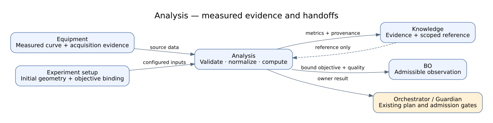
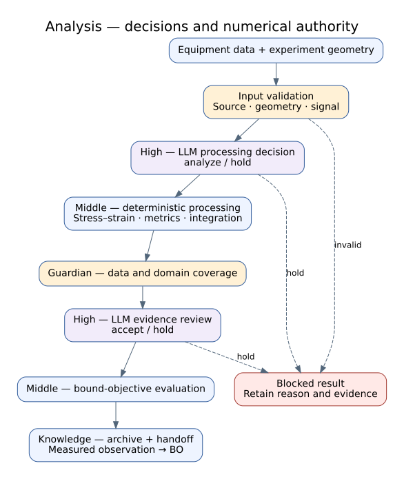
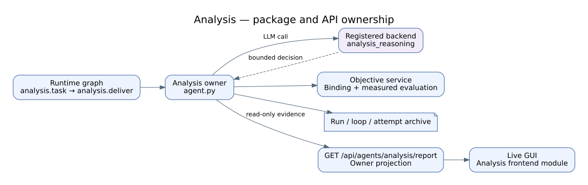

# Analysis Agent Reference

## Summary

`AnalysisAgent` converts an identifiable equipment artifact into a canonical
force-displacement record and specimen-normalized engineering stress-strain
record, quality record, UTM metrics, optional CAE/FEM comparison, objective and
uncertainty, versioned analysis artifacts, experiment evaluation, and BO
handoff. It preserves the distinction between measured input and derived or
simulated output.

## Scope

Included are file fingerprinting, format/parser and unit resolution, curve
processing, UTM metrics, optional CalculiX/CAE, prior comparison, and evidence.
It does not fabricate missing measurements or operate equipment.

## Source of Truth

Analysis agent/module, CAE bridge, experiment schemas, Analysis/BO merge paths,
and CAE APIs.

## Actual Role

| Does | Does not |
|---|---|
| Hash and parse an equipment artifact | Assume an unidentifiable file is valid measurement |
| Resolve columns/units and build canonical curve | Silently guess units needed for the result |
| Compute bounded UTM metrics/objective/uncertainty | Replace raw evidence with derived values |
| Normalize with initial apparent area and height | Relabel energy density as total energy |
| Optionally run validated CAE/CalculiX | Describe simulation as physical measurement |
| Emit evaluation and BO handoff | Select the next physical experiment itself |

## Three-Level Control Classification

| Level | Analysis responsibility | Authority boundary |
|---|---|---|
| High-Level Control | Receives the identified Equipment handoff and returns accepted evaluation evidence to Knowledge/BO | Does not select or start the next physical experiment |
| Middle-Level Control | Hash and parse input, resolve columns/units, construct canonical curves, compute metrics/objective/uncertainty, run quality gates, compare optional CAE, and emit evaluation contracts | Raw measurement identity and unit/quality gates remain authoritative over narrative interpretation |
| Low-Level Control | Calls `cae.run_static_analysis` or other registered computation tools where configured | Solver subprocess, CalculiX/Gmsh files, resource limits, cancellation, and computation receipts remain computation-bridge authority; no direct physical actuator is owned |

Solver/process recovery is Low-Level; reparsing or recomputing an evaluation is
Middle-Level; routing to retry/review/Knowledge/BO/terminal state is
High-Level. The CAE Workspace is a manual computation surface, not proof that
the automatic Analysis stage completed.

## Closed-Loop Position and Handoffs

**Figure Analysis-1.** An identity-checked Equipment artifact becomes a
canonical curve, measured metrics, optional CAE comparison, objective, and
uncertainty for Knowledge and BO; invalid input or ambiguous units stop the
handoff. This is an `inspection`-backed projection of baseline `0b7627b`, not
measurement or solver-accuracy evidence.

| Direction | Component | Contract/state | Purpose | Gate |
|---|---|---|---|---|
| In | Equipment | measurement file/handoff/proof | raw analysis input | identity/completion |
| In | CAE service | config/runtime capability | optional simulation | probe/validated payload |
| In | Prior trials | previous metrics | comparison | compatible schema/units |
| Out | Knowledge | analysis artifacts/provenance | durable record | input/output refs |
| Out | BO | objective/uncertainty/constraints | candidate scoring | evaluation validity |

## Inputs and Outputs

Input state includes equipment handoff/result, raw file path and hash context,
format hints, units, experiment specification, previous experiments, and CAE
configuration. Outputs include canonical F-D and engineering S-S curves,
quality report, UTM metrics, CAE/FEM problem/results/comparison, objective
score, uncertainty, decisions, analysis artifacts, experiment evaluation, and
BO handoff.

Engineering stress is `F/A0` in MPa and engineering compressive strain is
`delta/H0`, where `A0` and `H0` are the initial apparent area and height from
the current experiment plan/specimen geometry. The default uncompiled BO
objective is the S-S integral through 50% strain,
`energy_density_50pct_MJ_per_m3`. Total F-D energy through the same boundary is
retained as `energy_absorption_50pct_mJ`, with `W50 = V0 * U50` used as a
dimensional cross-check.

## Internal Execution

| IDs | Work | Boundary/output |
|---|---|---|
| `01_receive_equipment_artifact`, `02_fingerprint_input_file` | receive/hash | missing/mismatch blocks |
| `03_detect_format_and_parser`, `04_parse_raw_table`, `05_resolve_columns_and_units` | parse/normalize | unsupported format/unit blocks |
| `06_build_canonical_curve`, `07_preprocess_curve`, `08_validate_curve_quality` | F-D preservation, S-S normalization, curve pipeline | quality pass/failure |
| `09_compute_utm_metrics` | measured metrics | typed metrics |
| `10_prepare_fem_problem`, `11_prepare_cae_calculix_payload`, `12_probe_cae_runtime` | optional CAE preparation | unavailable remains explicit |
| `13_run_cae_calculix_analysis`, `14_compare_iteration_with_utm`, `15_accept_or_refine_fem` | iterative CAE path | compare/refine result |
| `16_run_cae_if_available`, `17_compare_fem_with_utm` | compatibility optional path | no silent physical equivalence |
| `18_compute_objective_and_uncertainty`, `19_compare_with_previous_experiments` | evaluation | score/uncertainty/comparison |
| `20_write_analysis_artifacts`, `21_emit_experiment_evaluation`, `22_emit_bo_handoff` | persist/handoff | artifacts/evaluation/BO context |

All 22 manifest IDs are represented above.

**Figure Analysis-2.** Twenty-two internal entries preserve raw identity,
parsing, units, canonical and processed curves, quality, measured metrics,
optional CAE, objective/uncertainty, artifacts, evaluation, and BO handoff as
distinct records. This `inspection` figure groups contract steps; optional CAE
is dashed and no physical-device authority is implied.

### Execution trace details

| Phase | Identity/configuration | Transformation/gate | Evidence/output | Failure/recovery |
|---|---|---|---|---|
| Receive | run/specimen/equipment artifact and expected hash | verify existence and fingerprint | immutable raw reference/hash | missing or mismatched input blocks |
| Parse | format hint and parser version | detect format, parse raw table | parser record and raw columns | unsupported/corrupt input stays rejected |
| Normalize | column mapping and declared units | resolve columns/units without guessing | normalized mapping | ambiguous units require corrected input |
| Curve | raw values and preprocessing configuration | build canonical curve, preprocess, quality-check | canonical and processed curves plus quality report | failed quality blocks evaluation |
| Metrics | quality-approved physical curve | compute typed UTM metrics | measured metric record | missing measurement is never synthesized |
| Optional CAE | validated problem/payload and available runtime | probe, run, compare and accept/refine | solver config/log/result and FEM comparison | unavailable/failed solver remains explicit |
| Evaluate | measured metrics, optional FEM and compatible priors | compute objective, uncertainty and comparison | evaluation and decisions | incompatible prior is excluded with reason |
| Persist/handoff | complete lineage | write artifacts and package BO contract | artifact refs, experiment evaluation, BO handoff | incomplete lineage blocks downstream claim |

## API Surface

| Class | Method | Path | Service | Effect | Notes |
|---|---|---|---|---|---|
| connected | GET | `/api/cae/config` | CAE bridge | read_only | selected runtime/config |
| operator | POST | `/api/cae/config` | CAE bridge | local_state | saves validated config |
| connected | POST | `/api/cae/run` | CAE bridge | external_service/local_state | bounded analysis payload |
| shared | GET | `/api/runs/{run_id}/artifacts` | run artifact service | read_only | raw/derived retrieval |

The graph-stage agent runs through the graph handler, not a dedicated
`/api/analysis/run` endpoint.

## Tools and Connections

| Tool/service | Boundary | Effect | Evidence |
|---|---|---|---|
| `cae.run_static_analysis` | registered CAE bridge | external_service/local process | payload/log/result/artifacts |
| Parser/curve/metric logic | in-process Python | local_state | input hash, parser, units, curve, metrics |
| CalculiX/CAE runtime | optional process/service | external_service | probe and solver outputs |
| task-specific `analysis_reasoning` | selected model route; module role empty | model | reasoning metadata |

An empty module `llm_role` keeps Python task routes distinct rather than
granting one broad Analysis role.

**Figure Analysis-3.** Run artifacts feed deterministic parsing and metric
logic, while validated optional CAE requests pass through the registered bridge
to a configured solver process; all derived outputs retain raw/configuration
lineage. This `inspection` figure does not establish solver availability,
accuracy, or physical equivalence.

### Connection lifecycle

| Connection | Resolve/preflight | Invoke/observe | Persist/recover |
|---|---|---|---|
| Run artifacts | run/specimen/artifact ID and hash | retrieve immutable raw input | preserve raw reference across reruns |
| Parser/metrics | parser version, mapping, units and preprocessing | deterministic curve/metric calculation | store mapping, configuration and derived hashes |
| CAE config | solver/runtime selection and validated payload | probe capability before run | configuration change creates a distinct result context |
| CAE process | bounded `cae.run_static_analysis` request | observe process/log/result or cancellation | known failure may rerun; ambiguous external state remains failed/pending |
| Derived retrieval | raw and configuration lineage complete | expose curve/metric/FEM/objective artifacts | never overwrite or relabel raw measurement |

The CAE workspace and model rationale cannot bypass input identity, unit, curve
quality, registered-tool, or artifact-lineage gates.

## State, Events, Artifacts, and Storage

Raw measurement, fingerprint, parser/unit mapping, canonical/preprocessed
curve, quality report, metrics, CAE payload/log/result, comparison, objective,
uncertainty, and handoff are separate records. Derived artifacts reference raw
input and configuration; they do not overwrite it.

## Modes and Fallbacks

Test can use fixtures; replay uses recorded raw artifacts; simulation/CAE is
labeled separately; Live analysis can consume physical measurement but remains
software-only. Unavailable CAE yields explicit no-CAE/degraded state where the
contract permits it, not a fabricated solver result.

## Safety, Approval, and Effect Boundary

Analysis has no direct physical effect. Input identity, units, curve quality,
validated CAE payload, and artifact paths are the main gates. CAE process
execution is bounded by the registered tool. Results cannot authorize equipment
actions without BO/Design/Guardian/downstream gates.

## Errors and Recovery

Missing/corrupt input, hash mismatch, unsupported format, ambiguous units, or
invalid curve blocks evaluation. Preserve raw and partial outputs; correct the
mapping/input and rerun deterministically. CAE failure may be reported as
unavailable/failed; do not substitute a synthetic physical value.

## Operator and GUI Surfaces

CAE workspace configures and invokes bounded CAE runs. Live GUI Analysis report
shows a white-background publication-style engineering S-S figure with
explicit percent-strain and MPa axes, UTM metrics, objective/uncertainty,
FEM/CAE cards, comparisons, and artifacts. The line retains measured
serrations without smoothing; report rendering is not numerical authority.

## Current Verification

The [2026-09-07 supervised integration record](../paper/evidence/2026-09-07-supervised-closed-loop.md)
observed Equipment CSV → Analysis → BO handoff in one live-equipment loop.
The operator substituted a specimen and the quality report retained
`peak_at_curve_boundary`; the transported objective is not validated material
performance or evidence of CAE agreement.

Verified against all 22 internal IDs, `cae.run_static_analysis`, three CAE API
routes, engineering S-S normalization, the 50%-strain energy-density handoff,
and the publication-style GUI contract on the 2026-09-02 working tree. No new
physical measurement or solver benchmark was executed for this documentation
update.

## Limitations and Known Gaps

The cited compression literature supports the engineering normalization and
energy-density dimensions, but it does not establish this implementation's
parser coverage, unit inference accuracy, metric uncertainty calibration, CAE
fidelity, or specimen-specific scientific validity. Optional solver
availability varies.

## Related Documents

- [Agent Matrix](agent_api_connection_matrix.md)
- [Equipment](equipment_agent.md)
- [Knowledge](knowledge_agent.md)
- [BO](bo_agent.md)
- [Three-Level Control Model](../runtime/three_level_control_model.md)
- [Legacy UTM Analysis Guideline](analysis_utm_runtime_guideline.txt)
- [Legacy CAE Guideline](cae_analysis_runtime_guideline.txt)
- [Stress-Strain and Energy-Density Design](../superpowers/specs/2026-09-02-analysis-stress-strain-energy-design.md)
