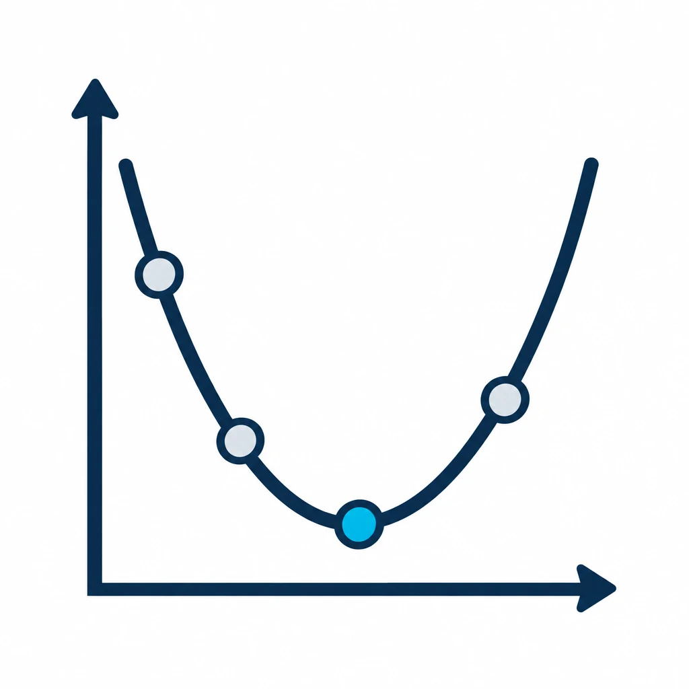
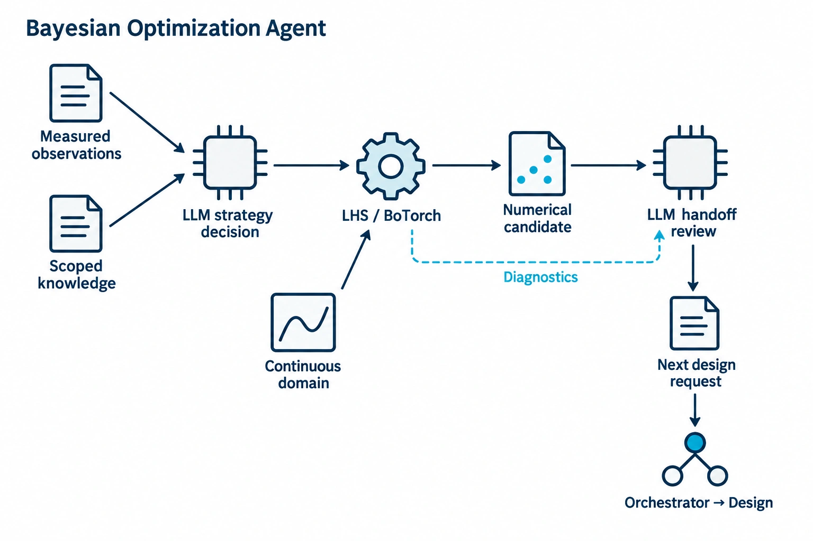
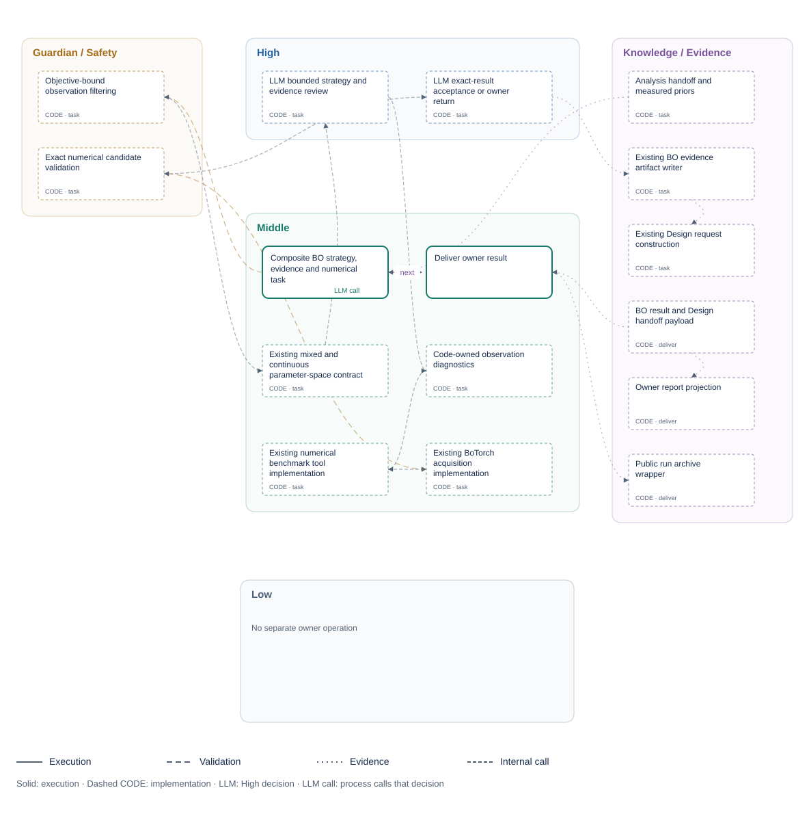
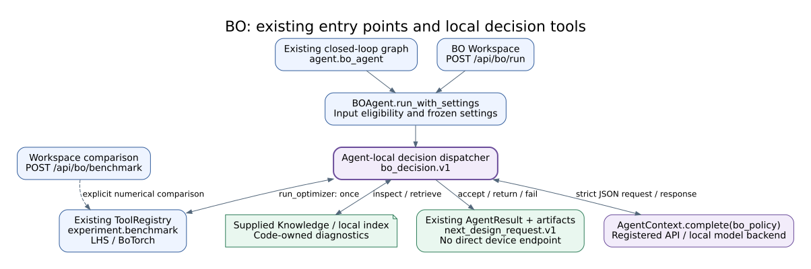

<!-- atr-doc
doc_type: reference
subtype: system
status: active
authority: descriptive
audience: [researcher, reviewer, developer, operator]
scope: [agents, bayesian_optimization, next_candidate, decision_tools]
summary: BO-owned strategy and tool decisions around the existing numerical optimizer, with continuous parameter handoff to Design.
source_of_truth:
  - agents/bo/agent.py
  - agents/bo/decision.py
  - agents/bo/module.py
  - agents/bo/execution.py
  - agents/bo/structure.py
  - agents/bo/presentation.py
  - agents/bo/frontend/live_report.js
  - packages/agents/bo/package.yaml
  - learning/bo_parameter_space.py
  - learning/botorch_backend.py
  - experiments/bo_visualization.py
  - experiments/lhs_design_visualization.py
  - reporting/bo_visualization_artifacts.py
  - graphs/modules/bo/module.yaml
  - app/main.py
  - objectives/authoring.py
  - objectives/service.py
last_verified: 2026-09-14
verified_against: working-tree BO owner package
related_docs:
  - docs/agents/README.md
  - docs/agents/agent_api_connection_matrix.md
  - docs/agents/analysis_agent.md
  - docs/agents/knowledge_agent.md
  - docs/agents/design_agent.md
  - docs/agents/bo_agent_runtime_guideline.txt
  - docs/oldversion/superpowers/specs/2026-09-10-bo-strategy-continuous-design.md
supersedes: []
-->

# Bayesian Optimization Agent Reference

Main GUI: **Bayesian Optimization · Workspace** opens the optimization workspace in a separate window.

*Role overview; detailed execution and connection diagrams follow below.*

## Status at a Glance

| At a glance | Details |
|---|---|
| Runtime status | Installed `bo@1.0.0` owner package / software recommendation only |
| LLM decision layer | Implemented / API and local vLLM verified |
| Numeric candidate authority | LHS / BoTorch; two continuous variables by default |
| Physical effect | None |
| Primary handoff | `next_design_request.v1` → Orchestrator → Design |
| Live hardware validation | No new device validation in this revision |
| Known gap | No demonstrated optimization gain from the LLM decision layer |

## Installed Package and Executable Structure

At the final cycle of an approved `planning_cycle_contract.v1`, BO performs a
final assessment instead of requesting another design. It refits the same GP
using accepted measurements (including the last cycle), saves posterior and
uncertainty/acquisition visualizations, and returns `optimization_phase:
final_report`. Acquisition values are displayed but are not optimized to
propose an additional specimen. No next-design handoff is emitted; the existing
Guardian review and run-completion path remain in force. With insufficient
distinct observations, the report explicitly records that a GP could not be
fitted; missing evidence or genuine model errors are not converted into success.
Intermediate cycles retain the existing LHS/BO decision path.

BO is discovered once from `agents/bo/module.py` and installed as
`bo@1.0.0`. Canonical implementation lives under `agents/bo/`. Maintained
callers and monkeypatch targets now import that owner directly; the former root
wrappers were retired after migration without changing the `bo_agent` runtime ID.

The public `run(state, ctx)` and `run_with_settings(state, ctx, settings)`
entrypoints both traverse the registered `bo.task` → `bo.deliver` graph once.
The first resolves the existing workspace/default settings, while the second
preserves its explicit settings. The original composite task still owns all
numerical behavior, and the existing public archive wrapper writes one attempt
receipt for either entrypoint.

| Surface | Owner contract |
|---|---|
| Agent module | `agents/bo/module.py`, discovered as the single `bo_agent` owner |
| Execution/source catalog | `agents/bo/execution.py` and `agents/bo/structure.py` |
| Package | `packages/agents/bo/package.yaml`; no Device Bridge dependencies |
| Live report | `/api/agents/bo/report` projected by `agents/bo/presentation.py` |
| Frontend | `/module-assets/bo/live_report.js`, composed through the common Live module host |
| Settings | Existing `/api/bo/settings` and `memory/bo_workspace_settings.json`; no second store |
| Numerics | Existing `learning/` and `experiments/` services; no optimizer bridge |

**BO control areas.** The Runtime IDE and this document use the same owner
catalog. High nodes are the existing BO policy/review calls, Middle nodes cite
the actual parameter-space and numerical services, Guardian nodes retain hard
identity/domain checks, and Knowledge nodes retain report/artifact evidence.
The Low area is intentionally empty because BO has no physical effect.

## Overview and Responsibilities

The existing LLM decision boundary receives a bounded, reference-only
[AX4LAB Wiki pack](../knowledge/wiki_memory.md). This supplies platform context
without changing this agent's tools, numerical authority or execution gates.

BO turns accepted Analysis observations and compatible Knowledge evidence into
a proposed next experiment. Its local High layer decides which permitted
optimization action to request and whether the numerical result is suitable
for handoff. LHS or BoTorch calculates the point; the model does not generate
coordinates or add a subjective preference score to replace that point.

| Owned by BO | Not owned |
|---|---|
| Optimization strategy and evidence-sufficiency decisions | Global cycle scheduling or physical execution |
| LHS state, numerical optimizer invocation and candidate review | Recalculating measured Analysis scores |
| Continuous search-domain normalization and recommendation | Changing the approved objective or locked user settings |
| Decision, numerical result and next-Design artifacts | Target-attainment judgment or automatic stopping |

### Five-Area Responsibility Map

Figure notation: **LLM** marks the High decision; **LLM call** marks the process
that supplies context and consumes its response ([shared label contract](../runtime/three_level_control_model.md#llm-node-labels)).

| Area | BO responsibility | Boundary |
|---|---|---|
| High-Level Control | LLM interprets optimization evidence, selects permitted strategy/tools and reviews the numerical result | Global mission/routing stays with Orchestrator; coordinates stay with the optimizer |
| Middle-Level Control | Freeze inputs, validate requests, run LHS/BoTorch and acquisition optimization, then package the result | One optimizer invocation per decision; no re-execution after success |
| Low-Level Control | No direct device execution; numerical optimizers are Middle | Numerical computation only |
| Guardian / Safety | Observation identity/eligibility, bounds, locked values, candidate identity and budgets | Model acceptance cannot bypass hard checks |
| Knowledge / Evidence | Supplied history, local retrieval, diagnostics and loop-scoped artifacts | Sources are evidence, not instructions or current measurements |

These are responsibility areas, not five serial model calls. The normal BO
path contains a bounded local decision loop, not a new Orchestrator node.

## Closed-Loop Position and Handoffs

**Figure BO-1.** Code-inspection projection of BO within the existing loop.
Solid arrows carry task/result handoffs; dashed arrows carry evidence.
Downstream device ownership is unchanged.

| Direction | Contract/state | Purpose |
|---|---|---|
| In: Analysis | `bo_handoff`, `bo_observation`, experiment evaluations | Valid objective observations with parameter/provenance identity |
| In: Knowledge | BO context and compatible prior records | History and failure context |
| In: operator/runtime | Objective, `parameter_space`, strategy, LHS configuration and locks | Bounded optimization request |
| Out: runtime | `AgentResult.data.bo_result` and decision evidence | Accepted, returned or failed result |
| Out: Design | `next_design_request.v1` → `orchestrator_design_contract.v1` | Candidate ID, exact coordinates and declared domain |
| Out: artifacts | Numerical result, decision/tool trace and plots | Per-loop audit and read-only visualization |

## Internal Workflow

| Phase | Work | Result |
|---|---|---|
| Intake | Resolve objective; filter incompatible/invalid observations; preserve failures separately | Frozen eligible observations and evidence IDs |
| Decide | Existing `AgentContext.complete("bo_policy", ...)` selects a local action | Validated tool request |
| Inspect | Compute diagnostics or retrieve bounded local context | Source-labelled evidence returned to the model |
| Optimize | Dispatch the existing numerical tool once | LHS point or optimizer-selected candidate |
| Review | Model accepts the exact result or returns to owner | Candidate identity and hard checks remain authoritative |
| Finalize | Existing artifact/state/handoff builders | No change to graph, bridge or device routes |

**Figure BO-2.** Strategy and evidence review belong to the local LLM layer.
The numerical result is frozen before review; inspection cannot reopen the
optimizer or mutate its candidate. Evidence is retained on both acceptance
and failure.

## Decision and Evaluation

**Decision question:** Given the current observations, permitted settings and
available evidence, which optimization action is appropriate, and is its
numerical result ready for Design review?

| Evidence | Model decision | Code-owned limit |
|---|---|---|
| Observations, domain and LHS state | Inspect or run the configured optimizer | LHS count/seed/phase cannot be overridden |
| Acquisition configuration | Preserve configured strategy, or select an allowed strategy when explicitly enabled | Objective, domain, budget and locked settings remain fixed |
| Local Knowledge and numerical diagnostics | Request more evidence or return to owner | No arbitrary web, file, shell or device call |
| Numerical candidate and diagnostics | Accept that candidate or hold the handoff | Known candidate ID; unchanged finite in-domain coordinates |

Diagnostics describe available observations and optimizer output. They do not
declare that a research target has been reached or trigger cycle termination.
Posterior uncertainty is a model quantity, not an invented measurement
uncertainty or a proof of scientific improvement.

### Local Decision Tools

These names describe the BO-local JSON dispatcher, not new global bridge APIs.

| Tool | Work | Allowed phase |
|---|---|---|
| `inspect_diagnostics` | Read code-computed observation/domain/result diagnostics | Before or after optimization |
| `retrieve_knowledge` | Retrieve bounded source-labelled context | Before or after optimization |
| `run_optimizer` | Invoke `experiment.benchmark` with validated settings | Before optimization only |
| `accept_recommendation` | Accept the exact numerical candidate | After a valid optimizer result |
| `return_to_owner` | Return without a ready Design handoff | Either phase |

Requests are strict JSON with `tool`, `arguments`, `reason` and
`evidence_refs`. Every reference must resolve to supplied context or a recorded
tool result. An acceptance names the numerical candidate ID, not a new
parameter vector. Malformed requests and unavailable inference remain explicit
failures; they do not silently execute a successful numeric fallback.

| Decision setting | Default | Valid control |
|---|---|---|
| `strategy_control` | `configured` | `configured` keeps settings; `adaptive` permits bounded acquisition arguments |
| `decision_max_calls` | 6 | Integer 1–12 local decisions |
| `decision_call_timeout_s` | 45 s | Positive, at most 300 s |
| `decision_total_timeout_s` | 120 s | Positive, at most 300 s |

The Workspace exposes strategy control. The timeout/call settings are BO runtime
settings, not new device parameters. In adaptive mode, `run_optimizer` accepts
only the supported acquisition enum, `kappa` in [0, 20], and `xi`,
`exploration_weight`, `exploitation_weight` in [0, 1]. Other request arguments
cannot change the experiment contract.

Synchronous numerical/local-index callbacks run off the event loop. Decision
timeouts bound how long the coordinator awaits them; cancelling that wait does
not kill native computation already running in a worker thread. Existing
backend optimization timeouts remain in effect. A timed-out decision is not
accepted and does not dispatch another optimization within that decision.

## Continuous Parameter Contract

| Input form | Meaning in new BO requests | Example |
|---|---|---|
| One numeric value | Fixed coordinate | `cell_size_mm: [7.13789]` |
| Two ascending finite values | Continuous bounds | `cell_size_mm: [6.2, 9.1]` |
| Legacy numeric cell table | Normalize to minimum/maximum bounds | `[5, 6, 7.5, 10]` → `[5, 10]` |
| Archived discrete visualization | Preserve original discrete semantics | Old artifacts are not rewritten |

The default active domains are `cell_size_mm: [5.0, 10.0]` and
`relative_density: [0.20, 0.48]`. These are configuration defaults, not an
integer-cell-count equation. Existing manufacturing bounds and fixed geometry/
process settings remain enforced. The generic `BOParameterSpace` still supports
mixed/discrete problems.

The first LHS request and subsequent BO requests carry `parameter_space`.
At the planning-to-Design boundary, the initial-design contract publishes its
actual LHS points and a run-local figure before the first measurement or BO
result exists. Live GUI consumes `lhs.visualization.updated` and hydrates the
current run's figure; no optimizer replay is needed. Test paths and live
experiments explicitly configured with `initial_design.sampler=latin_hypercube`
use this same intake. A manually specified live design without LHS configuration
retains its requested coordinates.
Orchestrator republishes it with the authoritative point. Design validates
against that domain and preserves numerical precision through candidate
preparation and geometry arguments; display rounding does not change the
stored coordinate. Older requests without domain metadata retain their
compatible legacy validation path.

### Initialization and Acquisition

The existing initial-design policy is unchanged: the default two-variable
problem requires eight accepted LHS observations. Rejected or ineligible
records do not advance that count. The first TEST Design request is still
published by Orchestrator; later BO requests continue the same deterministic
queue before GP acquisition becomes active.

During initialization, `optimization_phase=initial_design`,
`backend_active=lhs` and `initial_design.completed/target/next_index` are
authoritative. Acquisition ranking and model preference cannot replace the
LHS point. Once eligible, the default backend fits `SingleTaskGP` and calls
`optimize_acqf` for the continuous space. Generic mixed spaces retain
`optimize_acqf_mixed`.

The default acquisition is Expected Improvement, implemented with
`LogExpectedImprovement`; UCB, PI and the existing other supported acquisition
policies remain available. The selected numeric backend never silently
switches to `lightweight_pool`.

## Compiled Objective Binding

BO can consume a run-bound `objective_spec.v1` produced by the Objective
Compiler. There is no fixed objective-template picker or implicit formula
fallback. An objective becomes eligible only after deterministic validation,
historical-observation preview, explicit operator approval, and activation for
one `run_id`.

For a compiled objective, BO accepts observations only when all of the
following are present and valid: matching `objective_hash`, finite score,
`feasible=true`, fidelity, parameter vector, provenance references, and
`ok_for_bo=true`. Records duplicated through `bo_handoff` and
`bo_observation` are deduplicated by `observation_id`. Live mode additionally
requires measured fidelity and rejects synthetic proxy observations. Test mode
may accept explicitly labelled synthetic or simulation evidence.

`next_design_request.v1` carries `objective_id`, `objective_version`, and
`objective_hash`; it never recompiles or changes the active expression.

### Operator-authored objectives

The BO Workspace provides three authoring surfaces that converge on the same
bounded contract and lifecycle:

| Surface | Purpose | Authority boundary |
|---|---|---|
| AI Compose | turn research intent into a bounded draft | LLM output remains untrusted |
| Visual Builder | construct a registered expression tree and Boolean constraints | browser edits remain unsaved until accepted by the server |
| Advanced JSON | edit the complete `objective_spec.v1` document | only registered metrics, units, and enabled operators are accepted |

The Visual Builder is not a fixed objective-template selector. It reads the
server-owned `/api/objectives/authoring-contract`, which describes every
enabled operator, child slot, field, supported unit, and AST limit. Nested
unary, variadic, binary, weighted-term, aggregate, conditional, comparison,
logical, and piecewise-penalty structures share one canonical tree. Compatible
subtrees can be reordered, duplicated, removed, or moved through drag and drop.

Visual and JSON modes share one unsaved browser state. Invalid JSON remains in
the editor with path-specific errors and does not replace the last valid visual
tree. Unsaved work is kept in browser storage for refresh recovery; a
successful server save clears that recovery record.

`POST /api/objectives/manual` is the only manual-draft persistence boundary.
The server ignores client lifecycle, version, creator, timestamp, and Metric
Registry version fields, then writes operator provenance and an immutable new
version. Selecting a stored version is read-only: the operator must explicitly
choose `Load Selected as Revision` before it can become the parent of a new
manual version. Manual drafts still require Validate, Preview, Approve, and
Activate before BO can consume them.

## Tools, APIs and Connections

**Figure BO-3.** Existing graph and workspace-agent entry points share the
decision layer. The separate benchmark API remains a numerical comparison.
Agent-local tools do not introduce device or provider-specific endpoints.

| Surface | Existing route/tool | Effect |
|---|---|---|
| Read/save settings | `GET/POST /api/bo/config` | Read or persist bounded configuration |
| Workspace benchmark | `POST /api/bo/benchmark` | Explicit numerical comparison; separate from agent judgment |
| Workspace agent run | `POST /api/bo/run` | BO decision, numeric result and handoff proposal |
| Model | `bo_policy` through the registered backend | Strict JSON decision; API/local transport is unchanged |
| Numeric tool | `experiment.benchmark` | Existing LHS/BoTorch execution |
| Objective authoring | `/api/objectives/*` | Separate draft/validate/preview/approve/activate lifecycle |
| Design handoff | Existing Orchestrator state | Proposal for the next cycle, not direct fabrication |

## State, Events, Artifacts and Storage

Existing `bo_result`, `recommendation`, `next_design_request`, visualization
and prior-summary fields remain. Decision evidence records the requested tool,
validated arguments, evidence references, result and model/test provenance.
Legacy preference fields are compatibility data, not candidate-selection
authority.

| Artifact | Content |
|---|---|
| `bo_reasoning_report.json` | Decision/evidence report |
| `bo_decision.json` | `bo_decision.v1` tool trace, model provenance and terminal decision |
| `candidate_pool.json` | Numerical candidate audit |
| `bo_next_candidate.json` | Existing next-Design request |
| Decision/tool records | Local action sequence, validation and terminal result |
| `*_posterior.png/.svg/.csv` | Shared posterior/acquisition figure and exact numeric companion |
| LHS visualization artifacts | Initial design points, domain and progress |

The existing `archive_agent_run` mechanism preserves results per run/loop/
attempt; run-local BO files remain latest-view compatibility outputs.
See [Loop Artifact Archiving](../runtime/loop_artifact_archiving.md).

### Visualization Contract

Live Posterior and Initial Design / LHS have independent previous/next arrows
at the right of their card headers. They browse stored PNG artifacts from the
current run, show the step and position, and disable unavailable directions.
Unchanged refreshes preserve browsing; a new live step returns its card to the
latest graph. Switching runs clears the selection and history. This is
read-only artifact browsing, not replay or restoration of optimizer state.

Live GUI places the run objective across the full report width, with posterior
and LHS figures side by side below it. The objective is supplied independently
of completed BO steps by the owner report API: the exact run binding
(ID, version and hash) selects the registered expression and metric unit.
Unbound archived runs retain their historical objective; they are never
relabeled using a newer experiment's settings. Technical identity is available
under Details. Posterior updates do not overwrite this objective projection.
When a stored posterior PNG is available, Live GUI displays that exact figure;
results without a stored image show an explicit unavailable state on Live GUI.
The lower report keeps three fixed cards (Next Experiment, Optimization Status,
Selection Evidence) across empty and populated states. Agentic Progress follows
as a full-width SPC-style connected workflow row immediately before the host's
Runtime Support card: Input Check, Strategy Decision, LHS / BoTorch, Result
Review and Design Handoff. Each stage expands its own evidence; completion is
derived from available BO results and decision records, not from its position
in the row. Historical results without LLM decision evidence do not mark the
LLM stages complete. Detailed tool records remain separately expandable.

LHS and acquisition remain separate read-only projections:
`lhs_design_visualization.v1` and `bo_visualization.v1`. The LHS card shows
the declared continuous domain and actual measured/next/planned coordinates.
Archived discrete payloads keep discrete labels.

The posterior card uses the backend-provided normalized search path, score,
uncertainty bands and actual acquisition. It does not refit the GP in the
browser, invent measurements or expose a one-dimensional parameter slice as
the multidimensional search. Signed UCB values are preserved; EI-specific
threshold annotations are shown only for EI.

Workspace, Live GUI and saved Matplotlib artifacts use the same projection.
Completed-step events replace existing figures; step selection is inspection,
not another optimizer call. Initial LHS metadata can render before a posterior
exists. Objective identity and constraints remain read-only on Live GUI.

## Safety and Recovery

BO has no printer, robot or equipment authority. Existing downstream Guardian,
Orchestrator, Design and device gates remain in place.

| Condition | Behavior |
|---|---|
| Missing/incompatible Analysis observation | Existing BO observation gate blocks the request |
| Invalid domain or requested coordinate | Explicit validation error; no snap to a table point |
| Invalid model request, unknown evidence or candidate | No corresponding action is dispatched |
| Model failure or mock response on normal path | Failed decision; no successful numeric fallback |
| Successful optimization followed by model rejection/error | Preserve numerical evidence; no second optimizer invocation |
| Explicit non-LLM TEST | Same local dispatcher with deterministic actions and `virtual_test` provenance |
| Cancel | Propagate cancellation; no hidden retry |

The software TEST path does not imply that all platform TEST configurations are
non-actuating; only BO's own computation has no hardware effect.

## Artifacts and Verification

Owner-package verification is recorded in the
[BO package plan](../oldversion/superpowers/plans/2026-09-14-bo-agent-package.md); the
earlier strategy verification remains in its linked historical plan.
Tests cover domain conversion, precision-preserving Design handoff, bounded
tool decisions, optimizer-result integrity and read-only visualization.

| Software check | Observed result | Scope |
|---|---|---|
| Combined changed-path regression suite | 194 passed / 22.78 s | BO/Design, real BoTorch, controller domains, compiled-objective restart, two offline graph loops, API, JavaScript and figures |
| Static browser fixture | 4 viewport/view checks passed | Production LHS/BO renderers at desktop/mobile widths; no console errors or network requests |
| Scoped documentation and figures | 7 Markdown documents / 3 SVGs valid | Current references, design, plan and source-backed figures |

The combined suite includes fixed-density displays and accepted-to-held cache
invalidation. It reported 12 existing Pydantic/framework deprecation warnings.
Fabrication/acquisition are fixtures in the offline loops. This is software-path
verification, not another physical closed-loop demonstration.

The 2026-09-14 migration retained all 74 focused BO agent, decision and
parameter-space regressions. Five guarded mode/route scenarios passed with no
device calls. A separately guarded registered `gpt-5.5` check exercised both
initial LHS and real BoTorch acquisition through the public
`run_with_settings` path: each made three `bo_policy` calls and preserved the
optimizer coordinates, with zero physical calls. Those inputs were explicitly
synthetic observations and did not represent a whole closed-loop cycle.

Final owner-package checks passed 44 BO plotting/visualization contracts and
four guarded BO API contracts. A 37-file staged publication scan was clean, and
the corrected 1920×1080 Live/IDE helper showed the installed control map,
initial-LHS/acquisition views, exact candidate parameters and Design priority
with no console error, physical call or denied effect. Scoped review closed the
report-preservation and pre-hydration precedence findings before handoff.

Registered-provider probes on 2026-09-10 ran `BOAgent.run_with_settings` with
real LHS/BoTorch computation and explicitly synthetic observations. Each case
completed `inspect_diagnostics → run_optimizer → accept_recommendation` with
exactly one optimizer invocation and unchanged numerical coordinates.

| Registered backend / returned model | Initial LHS | Acquisition proposal | Result |
|---|---:|---:|---|
| API / `gpt-5.5` | 11.684 s | 10.372 s | Both accepted |
| Local vLLM / `gemma4:31b` | 25.074 s | 31.349 s | Both accepted |

Times cover the complete BO Agent call, not one model response. These checks
used `strategy_control=configured`; bounded adaptive argument selection is
covered separately by deterministic dispatch tests. No device tools were
registered, and no model services were started or restarted.
The [redacted verification record](assets/verification/bo_decisions_2026-09-10.json)
retains run IDs, exact coordinates, tool sequences and timings. Reproduce with
`scripts/verify_bo_decisions.py --execute` against available registered providers.

The [supervised integration record](../paper/evidence/2026-09-07-supervised-closed-loop.md)
remains historical evidence for the prior loop: BO-managed LHS point 2/8
reached Design. It is not evidence for this new LLM strategy layer or for
acquisition-stage optimization gain.

## Limitations and Known Gaps

No comparative study establishes improved sample efficiency, convergence or
research outcomes from these decisions. Continuous inputs remain subject to
existing Design/manufacturing checks. Target-attainment decisions, automatic
stopping, automatic re-experimentation and new device validation are excluded.

## Related Documents

- [Agent Index](README.md)
- [API/Connection Matrix](agent_api_connection_matrix.md)
- [Analysis](analysis_agent.md)
- [Knowledge](knowledge_agent.md)
- [Design](design_agent.md)
- [BO Runtime Guideline](bo_agent_runtime_guideline.txt)
- [Approved BO Design](../oldversion/superpowers/specs/2026-09-10-bo-strategy-continuous-design.md)
