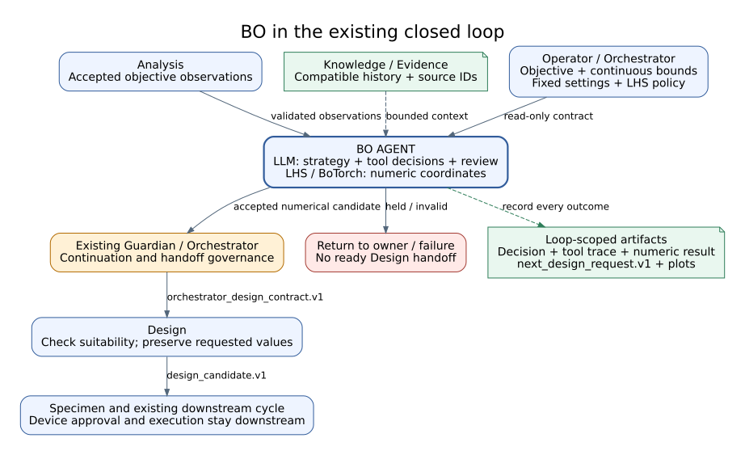
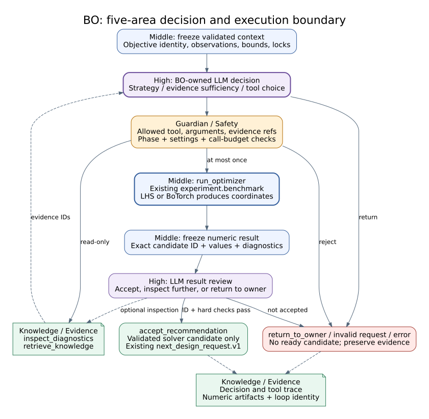

# Bayesian Optimization Agent Reference

## Summary

`BOAgent` converts valid analysis/prior evidence and a bounded search space into
one sequential next-candidate recommendation. Latin Hypercube sampling supplies
the initial design; after enough accepted observations, a BoTorch
`SingleTaskGP` and direct acquisition optimizer select the next point. Numeric
acquisition, constraints, failure penalties, and validators are authoritative;
LLM hypothesis/preference is advisory. The recommendation returns through
Guardian and Design before any physical action.

The default Gyroid problem has exactly two active variables:
`cell_size_mm` and `relative_density`. For a 30 mm specimen,
`cell_size_mm` is restricted by `a=L/N` to `{5.0, 6.0, 7.5, 10.0}` mm for
`N={6,5,4,3}`, while `relative_density` is continuous on `[0.20, 0.48]`.
Both dimensions are normalized to `[0,1]` before model fitting.

The canonical initial design requires eight accepted Latin Hypercube
observations. Rejected, infeasible, proxy-only, or missing-SEA measurements do
not count toward that target. The standard 20-cycle test mission uses the first
eight accepted cycles for LHS and the remaining twelve for the ARD Matérn 5/2
`SingleTaskGP` plus Expected Improvement phase. If a cycle is rejected, the GP
transition waits until eight valid measured SEA observations exist.

During this initial phase the selected point is the next deterministic LHS
point. Candidate ranking, acquisition scoring, combined scoring, and LLM
preference reranking are disabled and cannot replace that point. `bo_result`
reports `optimization_phase=initial_design`, `backend_active=lhs`, and explicit
`initial_design.completed/target/next_index` fields. These fields are also the
authoritative source for the Live GUI phase display.

The first and every subsequent Design call is mediated by Orchestrator. Test
mode automatically allocates the fixed LHS queue, but Orchestrator still emits
`orchestrator_design_contract.v1` JSON before Design Agent runs. BO emits
`next_design_request.v1`; Orchestrator validates and republishes it for the next
cycle. Design Agent does not read a competing default/random active-variable
source when that contract is ready.

## Compiled Objective Binding

BO can consume a run-bound `objective_spec.v1` produced by the Objective
Compiler. There is no fixed objective-template picker or implicit formula
fallback. An objective becomes eligible only after deterministic validation,
historical-observation preview, explicit operator approval, and activation for
one `run_id`.

For a compiled objective, BO accepts observations only when all of the
following are present and valid: matching `objective_hash`, finite score,
`feasible=true`, fidelity, parameter vector, provenance references, and
`ok_for_bo=true`. Records duplicated through `bo_handoff` and
`bo_observation` are deduplicated by `observation_id`. Live mode additionally
requires measured fidelity and rejects synthetic proxy observations. Test mode
may accept explicitly labelled synthetic or simulation evidence.

`next_design_request.v1` carries `objective_id`, `objective_version`, and
`objective_hash`; it never recompiles or changes the active expression.

### Operator-authored objectives

The BO Workspace provides three authoring surfaces that converge on the same
bounded contract and lifecycle:

| Surface | Purpose | Authority boundary |
|---|---|---|
| AI Compose | turn research intent into a bounded draft | LLM output remains untrusted |
| Visual Builder | construct a registered expression tree and Boolean constraints | browser edits remain unsaved until accepted by the server |
| Advanced JSON | edit the complete `objective_spec.v1` document | only registered metrics, units, and enabled operators are accepted |

The Visual Builder is not a fixed objective-template selector. It reads the
server-owned `/api/objectives/authoring-contract`, which describes every
enabled operator, child slot, field, supported unit, and AST limit. Nested
unary, variadic, binary, weighted-term, aggregate, conditional, comparison,
logical, and piecewise-penalty structures share one canonical tree. Compatible
subtrees can be reordered, duplicated, removed, or moved through drag and drop.

Visual and JSON modes share one unsaved browser state. Invalid JSON remains in
the editor with path-specific errors and does not replace the last valid visual
tree. Unsaved work is kept in browser storage for refresh recovery; a
successful server save clears that recovery record.

`POST /api/objectives/manual` is the only manual-draft persistence boundary.
The server ignores client lifecycle, version, creator, timestamp, and Metric
Registry version fields, then writes operator provenance and an immutable new
version. Selecting a stored version is read-only: the operator must explicitly
choose `Load Selected as Revision` before it can become the parent of a new
manual version. Manual drafts still require Validate, Preview, Approve, and
Activate before BO can consume them.

## Scope

Included are priors, evidence table, search-space update, deterministic initial
design, GP fitting, acquisition optimization, advisory preference audit,
constraints, recommendation, artifacts, and Design handoff. BO does not command
devices or certify scientific improvement.

## Source of Truth

BO agent/module, experiment benchmark/evaluation services, BO routes, and
Analysis/Knowledge/Design handoff state.

## Actual Role

| Does | Does not |
|---|---|
| Filter valid prior observations | Use invalid/missing trials as measured facts |
| Generate and numerically score candidates | Let LLM preference override hard constraints |
| Apply failure/constraint penalties | Treat a recommendation as approval |
| Select and explain one bounded recommendation | Start Design, printing, robot, or equipment directly |
| Emit artifacts and Design constraints | Prove optimization benefit without comparison evidence |

## Three-Level Control Classification

| Level | BO responsibility | Authority boundary |
|---|---|---|
| High-Level Control | Receives accepted Analysis/Knowledge evidence and emits one governed next-candidate recommendation for Guardian/Orchestrator/Design | A recommendation is neither approval nor a started experiment |
| Middle-Level Control | Filter compatible priors, maintain LHS/cold-start state, fit/update GP, optimize acquisition, apply constraints/failure penalties, rank candidates, record critique, and package Design constraints | Numeric backend and deterministic validators remain authoritative over LLM preference; measured observations and posterior state must retain provenance |
| Low-Level Control | Calls `experiment.benchmark` and configured BoTorch/numeric computation services | Tensor/model fitting, acquisition optimization, benchmark execution, and artifact generation are bounded computation effects; no printer, robot, or equipment authority exists |

Numeric backend recovery is Low-Level; rebuilding a valid posterior or
recommendation is Middle-Level; accepting another cycle or stopping remains
High-Level through Guardian and Orchestrator. The BO Workspace is manual
authoring/inspection and does not itself execute the recommended experiment.

## Closed-Loop Position and Handoffs

**Figure BO-1.** Valid Analysis evidence and provenance-bounded Knowledge
context become a ranked recommendation that still passes Guardian,
Orchestrator, and Design governance before another cycle. This is an
`inspection`-backed projection of baseline `0b7627b`; it does not establish
optimization benefit or authorize a physical action.

| Direction | Component | Contract/state | Purpose | Gate |
|---|---|---|---|---|
| In | Analysis | objective/uncertainty/evaluation | current trial | valid evidence |
| In | Knowledge | BO context/prior trials/patterns | historical context | provenance/compatibility |
| In | Constraints/failures | bounded search/safety limits | exclude/penalize | schema and domain rules |
| Out | Guardian | recommendation/risk/evidence | continuation review | policy/budget |
| Out | Design | candidate/parameters/constraints | next experiment spec | Design hard constraints |

## Inputs and Outputs

Inputs include analysis handoff, objective score, uncertainty, valid prior
observations, Knowledge BO context, search-space constraints, failure memory,
strategy, acquisition, and budget. Outputs include reasoning hypothesis/patch,
candidate pool, numeric and LLM scores, penalties, ranked top-k, critique,
recommendation, artifacts, metrics, decisions, and Design constraints.

## Internal Execution

| Step ID | Work | Boundary/output |
|---|---|---|
| `01_load_analysis_handoff` | current result | invalid handoff blocks |
| `02_filter_valid_priors` | evidence filtering | accepted prior set |
| `03_summarize_evidence_table` | bounded table | provenance summary |
| `04_llm_reasoning_hypothesis_pass` | advisory hypothesis | no authority |
| `05_validate_reasoning_patch` | schema/allowlist | accepted/rejected patch |
| `06_update_search_space` | bounded variables | valid space |
| `07_generate_initial_or_fit_gp` | LHS point or fitted SingleTaskGP | reproducible numeric state |
| `08_optimize_numeric_acquisition` | one optimize_acqf(_mixed) point | numeric authority |
| `09_score_llm_preference` | advisory preference | separate score |
| `10_apply_constraint_and_failure_penalties` | exclusions/penalties | safe ranked inputs |
| `11_rank_top_k_candidates` | numeric combined ranking | top-k |
| `12_llm_top_k_critique` | bounded critique | advisory notes |
| `13_select_recommendation` | validated selection | candidate/parameters |
| `14_write_bo_artifacts` | score/reasoning records | evidence artifacts |
| `15_handoff_design_constraints` | next-cycle packet | Design context |

**Figure BO-2.** Fifteen internal entries preserve evidence intake, bounded
reasoning, search construction, numeric acquisition, advisory model preference,
constraints, penalties, critique, recommendation, artifacts, and Design
handoff as distinct steps. This `inspection` figure groups manifest entries;
numeric acquisition and validators remain authoritative.

### Execution trace details

| Phase | State read | Authoritative decision | State/evidence written | Failure/recovery |
|---|---|---|---|---|
| Trial intake | Analysis handoff and evidence identity | accept only valid objective/uncertainty records | current trial row | invalid handoff blocks BO |
| Prior filtering | Knowledge BO context and prior trials | provenance/compatibility filtering and deduplication | accepted prior set and exclusions | missing priors may use explicit cold-start configuration |
| Reasoning patch | bounded evidence table | schema/allowlist validation of model proposal | accepted or rejected reasoning patch | invalid patch is ignored and recorded |
| Search and acquisition | strategy, mixed space, valid priors | LHS until ready, then direct BoTorch acquisition optimization | one selected point and posterior | empty/invalid space or fit failure yields revise/stop |
| Preference and penalty | numeric scores, model preference, constraints, failure memory | validators and penalties bound the combined rank | separate preference, exclusion, and penalty fields | model preference cannot restore an invalid candidate |
| Top-k and recommendation | valid ranked candidates | bounded critique followed by validated selection | top-k, critique, recommendation | no accepted candidate remains explicit |
| Handoff | recommendation, parameters, constraints | package next-cycle proposal | BO artifacts and Design context | downstream Guardian and Design gates remain required |

`/api/bo/config` persists strategy, `/api/bo/benchmark` produces bounded
comparison evidence, and `/api/bo/run` performs a direct workspace
recommendation. None of those responses proves a subsequent graph cycle or
physical experiment occurred.

## API Surface

| Class | Method | Path | Service | Effect | Notes |
|---|---|---|---|---|---|
| connected | GET | `/api/bo/config` | BO workspace config | read_only | strategy/search settings |
| operator | POST | `/api/bo/config` | BO workspace config | local_state | validated save |
| connected | POST | `/api/bo/benchmark` | experiment benchmark | local_state/model | bounded comparative tooling, not live loop |
| owned | POST | `/api/bo/run` | BO agent workspace execution | local_state/model | direct bounded recommendation and node event |
| connected | GET | `/api/objectives/authoring-contract` | Objective Compiler | read_only | operators, units, fields, and AST limits |
| operator | POST | `/api/objectives/manual` | Objective Compiler | local_state | normalized immutable operator-authored draft |
| shared | POST | `/api/run/start` | graph/controller | physical_possible | closed-loop execution, not BO alone |

Objective authoring and lifecycle operations are exposed separately through
`/api/objectives/*`. The BO Workspace can compose/revise, validate, preview,
approve, and activate an objective, while the Live GUI only displays the
active binding as a compact read-only card.

## Tools and Connections

| Tool/service | Boundary | Effect | Evidence |
|---|---|---|---|
| `experiment.benchmark` | experiment service | local_state/model | benchmark result/config |
| Numeric acquisition | in-process/lightweight or configured backend | local_state | score table |
| LLM `bo_policy` | selected model backend | model | hypothesis/preference/critique |
| Knowledge context | runtime/service output | read_only | trial/provenance refs |
| Design handoff | Orchestrator state | local_state | candidate/constraints |

## State, Events, Artifacts, and Storage

BO state records strategy, acquisition, budget, priors, evidence summary,
search-space version, pool, scores, penalties, top-k, recommendation, rationale,
and handoff. Direct workspace execution emits a BO node-completion/result event;
graph execution merges through normal stage state.

### Objective and posterior visualization contract

Initial design and Bayesian optimization use separate read-only projections.
LHS steps emit `lhs_design_visualization.v1`; acquisition steps emit
`bo_visualization.v1`. Neither projection selects a candidate, alters an
acquisition value, or calls a device. The same contracts are consumed by `/bo`,
Live GUI, and artifact rendering, so displayed values share one backend source
without presenting LHS as a fitted posterior.

| Field | Meaning |
|---|---|
| `objective` | active equation, direction, unit, constraints, and immutable identity |
| `posterior.mean` | SingleTaskGP posterior mean of the scalar score over the backend-provided normalized visualization coordinate |
| `posterior.lower_95` / `upper_95` | exact `mean +/- 1.96 * std` bounds supplied by the backend |
| `observations` | measured or explicitly labelled test observations already accepted by BO |
| `current_best` | best accepted observation under the objective direction |
| `next_point` | candidate selected by the existing BO execution path |
| `acquisition` | configured acquisition values for the same candidate coordinates |
| `parameter_slices` | backend-only diagnostic projections; never rendered in the default BO score figure |
| `candidate_index_view` | bounded audit order retained for compatibility and initial-design inspection |

The production backend label is `SingleTaskGP`. It is generated from the same
posterior arrays used by the optimizer; browsers must not refit, rescale
uncertainty, or recompute confidence bounds. During initial design the model is
labelled `LatinHypercube`. `pool_projection` remains only for the explicitly
selected lightweight comparison backend.

The Live GUI posterior is an output-space view over accepted multidimensional
measurements, not a fabricated one-dimensional optimization. Its visible axes,
labels, legends, annotations, and tooltips show only score, uncertainty,
measured score, Expected Improvement, and an anonymous normalized search
coordinate. Input names or values, parameter strata, parameter slices, and
facet labels belong only to the separate LHS design-space card or backend audit
data and must never appear in this posterior/EI figure.
Design-stage proxy scores are excluded once measured Analysis outcomes exist,
missing uncertainty is not invented, and the acquisition label uses the actual
backend class such as `LogExpectedImprovement`.

Before the eight-point initial design is complete, the Live GUI displays the
LHS progress and selected design vector instead of presenting a candidate
ranking or combined/acquisition score. The GP posterior and EI presentation is
enabled only after the backend reports `optimization_phase=acquisition`.
New initial-design payloads include the measured and next LHS coordinates for a
true `cell_size_mm x relative_density` scatter. Legacy compact payloads that do
not contain those coordinates retain the same labeled two-dimensional design
space with an explicit missing-coordinate notice; the frontend must not invent
points or fall back to a misleading one-dimensional sequence chart.

A normal live update occurs only after one step completes. The controller emits
`lhs.visualization.updated` during initial design and `bo.visualization.updated`
during acquisition, persists both latest projections independently in run
metadata, and keeps compact step identities for selector restoration. A stale,
missing, invalid, or unbound payload is shown explicitly rather than replaced
with invented values.

On completed BO workspace/agent results, the controller writes a 7.2 x 5.2 inch
Matplotlib figure and its numeric companion under the run-local BO artifact
directory:

- `<run>_bo_step_<NNN>_posterior.png`, 150 DPI preview/report figure
- `<run>_bo_step_<NNN>_posterior.svg`, vector publication artifact
- `<run>_bo_step_<NNN>_posterior.csv`, exact `x`, mean, standard deviation,
  confidence bounds, and acquisition values

Artifact-rendering errors are recorded as warnings and cannot change BO
selection or fail the experiment. The older compact progress SVG is retained
only for legacy BO results that do not contain `bo_visualization.v1`.

## Modes and Fallbacks

Test uses bounded synthetic/fixture observations. Replay reuses recorded trials.
Benchmark is a separate evaluation path. Live-loop recommendation remains a
software proposal until downstream governance. `botorch` is the production
default; `lightweight_pool` is never an automatic fallback.

## Safety, Approval, and Effect Boundary

BO has no direct physical authority. Numeric acquisition and validators remain
authoritative over model advice. Constraints and failure penalties precede
selection. Guardian and Design re-evaluate the recommendation; downstream
Specimen/Manipulation/Equipment gates still apply.

## Errors and Recovery

Invalid analysis or priors are excluded with reason. Empty search space or no
valid candidate yields stop/revise, not an unconstrained suggestion. Invalid
LLM patch/critique is ignored or recorded as rejected. Backend failure can use
an explicitly configured deterministic path; configuration change remains
visible.

## Operator and GUI Surfaces

BO workspace exposes configuration, benchmark, direct run, AI objective
composition, a template-free visual expression-tree builder, and a synchronized
advanced JSON editor. Saved objective versions remain separate from the
unsaved manual draft until explicit revision loading. Live GUI shows
surrogate/acquisition, candidate ranking, uncertainty, recommendation, and
artifacts. Workspace run or manual-draft creation does not prove graph or
physical execution.

The BO Workspace and Live GUI both place `BO Objective Equation` before a
single replace-in-place `Live Posterior` figure. The default figure is the
scalar score posterior and Expected Improvement over an anonymous normalized
search coordinate; it is not a selected-parameter slice. Input-space inspection
is confined to the separate LHS card and backend audit data. Operators can
inspect a prior completed step without running BO again. Repeated events replace
the existing SVG; they do not append hidden figures or base64 image copies to
browser state.

## Current Verification

The [2026-09-07 supervised integration record](../paper/evidence/2026-09-07-supervised-closed-loop.md)
observed BO-managed LHS point 2/8 (`bo-candidate-002`) reaching the next Design,
which preserved the requested geometry parameters. The summary's `via bo`
label does not mean acquisition optimization was active: initialization was
still in progress. No optimization-gain claim follows from this observation.

Verified against all 15 internal steps, `experiment.benchmark`, BO and Objective
Compiler APIs, manual Visual/JSON browser authoring at desktop/mobile widths,
and Analysis/Knowledge/Design handoffs at baseline `4cccb05`. No comparative
optimization benefit is claimed.

## Limitations and Known Gaps

No paper-scoped evidence establishes sample efficiency, convergence,
calibration, superiority, or physical improvement. Behavior depends on valid
priors, selected backend, constraints, and model configuration.

## Related Documents

- [Agent Matrix](agent_api_connection_matrix.md)
- [Analysis](analysis_agent.md)
- [Knowledge](knowledge_agent.md)
- [Design](design_agent.md)
- [Three-Level Control Model](../runtime/three_level_control_model.md)
- [Legacy BO Guideline](bo_agent_runtime_guideline.txt)
- [Evaluation and Results](../paper/06_evaluation_and_results.md)
