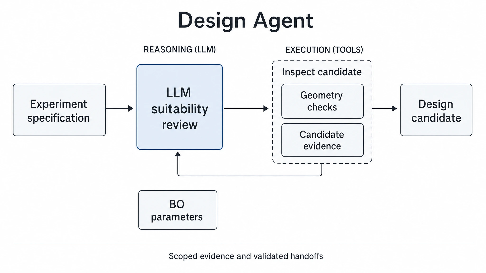
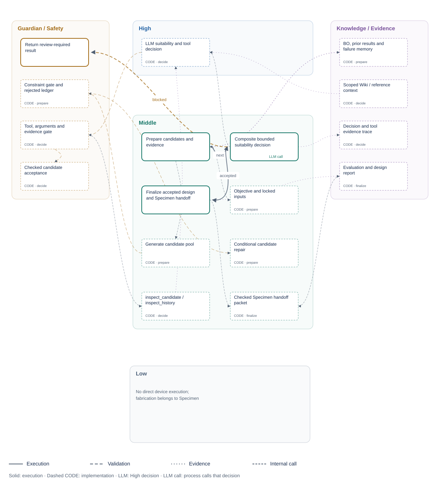
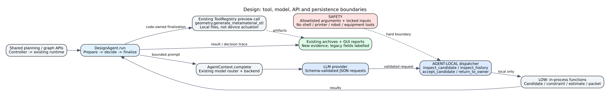

<!-- atr-doc
doc_type: reference
subtype: system
status: active
authority: descriptive
audience: [researcher, developer, operator, reviewer]
scope: [agents, design, experiment_specification, decision_tools]
summary: Evidence-based design evaluation and a bounded LLM decision layer preserving existing experiment and device contracts.
source_of_truth:
  - agents/design/agent.py
  - agents/design/decision.py
  - agents/design/execution.py
  - agents/design/structure.py
  - agents/execution_graph.py
  - agents/design/module.py
  - agents/design/presentation.py
  - agents/design/frontend/live_report.js
  - graphs/modules/design/module.yaml
  - backends/prompt_registry.py
  - app/controller.py
  - policies/validation_policy.py
last_verified: 2026-09-13
verified_against: working-tree-2026-09-13-executable-agent-ide
related_docs:
  - docs/agents/README.md
  - docs/agents/agent_api_connection_matrix.md
  - docs/agents/specimen_agent.md
  - docs/agents/bo_agent.md
  - docs/runtime/loop_artifact_archiving.md
  - docs/superpowers/specs/2026-09-07-five-area-agent-restructuring-contract-design.md
supersedes: []
-->

# Design Agent Reference



*Role overview; detailed execution and connection diagrams follow below.*

## Status at a Glance

| At a glance | Details |
|---|---|
| Runtime status | Implemented; applied-graph Design module lifecycle |
| LLM decision layer | Implemented / locally verified |
| Physical effect | None |
| Primary handoff | `design_candidate.v1` → Specimen |
| Live hardware validation | Not applicable to Design / downstream pending |
| Known gap | Candidate-matched performance prediction unavailable |

### Module Ownership and Layout

Design is the first agent bound through the existing `AgentRegistry` with a
code-owned `AgentModule` declaration. Orchestrator and LangGraph remain in the
program core; the existing `agent.design_agent` handler invokes the same agent.

```text
agents/
└── design/
    ├── module.py                 # implementation, UI/config/storage declarations
    ├── agent.py                  # existing DesignAgent implementation
    ├── decision.py               # existing bounded LLM decision and local tools
    ├── presentation.py           # Design projection for the existing report API
    └── frontend/live_report.js   # Design-only report rendering
```

Maintained callers import `agents.design.agent` and `agents.design.decision`
directly. The former root wrappers were retired after the caller migration and
canonical-import regression coverage.

| Boundary | Design owns | Existing host retained |
|---|---|---|
| Registration | [Code declaration](../../agents/design/module.py), factory and public metadata | `AgentRegistry`; [graph module](../../graphs/modules/design/module.yaml) remains the editable execution contract |
| Backend/API | Design report projection | `/api/agents/design/report`; module details and runtime manifests expose read-only `implementation` metadata |
| Frontend | Dashboard/report factory, evidence, brief, material, manufacturability and handoff renderers | Common manifest-driven module host at `/live`; shared STL/capture/Specimen helpers are explicitly injected |
| Configuration | Declared defaults and existing experiment/Orchestrator input sources | Graph/module configuration and run snapshots; no new editable Design Setup control or settings store |
| Storage | `design_agent` archive identity and candidate preview references | `runs/<run_id>/runtime/loops/loop-N/design_agent/attempt-N/` and existing `design_candidates/` folders |
| Documents | This reference and its existing figures | Canonical documentation paths and links remain stable |

The application discovers installed `agents/*/module.py` declarations. Applying
a valid IDE graph attaches or detaches Design execution admission, current
report/asset access, Live GUI and ORC owner discovery together. A remaining
graph reference, including an enabled pre-execution binding, keeps the owner
available. Installed handlers stay in the editor catalog for later re-addition.

The common browser host loads `/module-assets/design/live_report.js` only from
active code-owned manifests and calls `AX4LABDesignUI.createFrontend(deps)`.
Its dashboard/report renderers receive explicit host helpers and start no
timers, network calls or device commands. Exclusion disposes the frontend;
re-addition reuses installed code and the retained backend instance.

| IDE action | Runtime effect |
|---|---|
| Open/close Module Management editor | None; not activation |
| Validate/Compile draft | Preview applied/draft owners and add/remove impact; no membership change |
| Apply a valid graph while idle | Reconcile execution access, manifests and owner/setup discovery |
| Invalid graph or activation during a run | Reject; retain the applied composition |
| Exclude Design | Detach active access, not files, history, settings or shared bridges |

The graph still needs valid transitions; removal never invents a replacement
experiment route. New editable Design Setup fields, running-job hot swaps,
package installation and Bridge migration are outside this change. See the
[lifecycle plan and verification](../superpowers/plans/2026-09-13-design-ide-module-lifecycle.md).

## Overview and Responsibilities

The existing LLM decision boundary receives a bounded, reference-only
[AX4LAB Wiki pack](../knowledge/wiki_memory.md). This supplies platform context
without changing this agent's tools, numerical authority or execution gates.

Design converts a requested experiment into a checked specimen specification.
Existing code prepares candidates; a role-specific LLM layer decides acceptance,
additional inspection, or return to the owner.

| Owned by Design | Not owned |
|---|---|
| Candidate preparation and suitability/evidence decisions | BO/LHS experiment-point selection |
| Constraint checks and candidate-specific evaluation | Operator-fixed settings and global objectives |
| Authoritative Design-to-Specimen handoff | Graph transitions, physical approval, fabrication |
| Design decision evidence and local queries | Robot, camera, equipment or printer commands |

### Five-Area Responsibility Map

Figure notation: **LLM** marks the High decision; **LLM call** marks the process
that supplies context and consumes its response ([shared label contract](../runtime/three_level_control_model.md#llm-node-labels)).

The five areas map responsibilities across the workflow, rather than defining
sequential runtime stages.

| Area | Design responsibility and boundary | Detail |
|---|---|---|
| High-Level Control | LLM interprets bounded candidate evidence and selects inspect, accept or return tools; global routing stays with Orchestrator | [Position and handoffs](#closed-loop-position-and-handoffs), [decision](#decision-and-evaluation) |
| Middle-Level Control | Prepare candidates; execute local queries, checks and previews; dispatch bounded tools and finalize the handoff | [Internal workflow](#internal-workflow) |
| Low-Level Control | No direct device execution; downstream Specimen owns fabrication | [Tools and connections](#tools-apis-and-connections) |
| Guardian / Safety | Enforce input ownership, hard checks, budgets and existing handoff gates across the workflow | [Safety and recovery](#safety-and-recovery) |
| Knowledge / Evidence | Supply compatible history and preserve evaluation, decision and artifact provenance | [Decision evidence](#decision-and-evaluation), [artifacts and verification](#artifacts-and-verification) |

## Closed-Loop Position and Handoffs


**Figure Design-1.** Current code-inspection projection: the normal Design path
contains a bounded suitability decision before the existing Specimen handoff.
BO and user inputs remain authoritative. Dashed lines identify history and
deterministic-test paths.

| Boundary | Contract | Authority |
|---|---|---|
| In: runtime | `OrchestratorState`, goal, run/loop identity, current constraints | High/controller supplies the bounded task |
| In: BO | `bo_recommended_constraints` and authoritative `orchestrator_design_contract.requested_parameters` | Requested variables cannot be rewritten by model tools |
| In: Knowledge/history | Existing metadata, experiment DB and failure summaries | Context only; old scores are not current-candidate predictions |
| Out: Specimen | `experiment_spec`, `design_candidate`, `handoff_packet` | Existing `design_candidate.v1` payload is preserved |
| Out: runtime | `AgentResult`, decisions, reports, failure code | Existing runtime handles routing/retry; Design never starts Specimen directly |

### Continuous BO Inputs

New BO requests carry `parameter_space` through the existing
`next_design_request.v1` → `orchestrator_design_contract.v1` path. Design checks
the authoritative `requested_parameters` against that transmitted domain,
including continuous bounds and fixed values, instead of requiring membership
in a four-value cell-size table.

| Contract case | Design behavior |
|---|---|
| Continuous coordinate within the declared domain | Preserve the value through candidate preparation, evaluation and geometry arguments |
| Fixed coordinate | Preserve the declared value; reject a conflicting request |
| Outside domain or manufacturing limits | Reject with the relevant reason; do not snap into compliance |
| Historical request without domain metadata | Retain the compatible legacy validation path |

For example, a supplied `cell_size_mm=7.13789` and
`relative_density=0.32123456` remain those values in the geometry request.
Display formatting is not coordinate rounding. Minimum-wall, bridge-distance,
envelope and other manufacturing checks remain independent of BO bounds;
Design's LLM still cannot rewrite the requested experiment point.

## Internal Workflow

### Editable Runtime IDE Structure



The canvas, backend runner and this SVG share
[`module.execution_graph`](../../graphs/modules/design/module.yaml). Its edges
route actual registered operations: `prepare → decide`, then `accepted → finalize`
or `blocked → owner_review`. Editing a valid route changes backend execution after
activation; moving a node changes layout only. Five areas classify responsibility,
not five mandatory sequential stages.

The **LLM call** operation sends context to the High decision and consumes its
response through the existing composite suitability/tool loop. This denotes a
call relationship, not a shared source file or an additional decision layer.
Candidate preparation, result finalization and review reporting retain their
existing functions in the [owner adapters](../../agents/design/execution.py).
Its actual LLM suitability and tool decisions appear in **High**. Candidate
generation, inspection and deterministic handoff remain **Middle**, constraint
and acceptance checks remain **Guardian / Safety**, and context, traces and
reports remain **Knowledge / Evidence**. Design has no direct **Low** device work.
The [owner structure](../../agents/design/structure.py) supplies these relationships
through the existing catalog API. Dashed **CODE** boxes reference existing functions
or inline tool branches; they do not add commands, editable inner-loop routes or
independent completion states. Selecting one opens its owner and source references
in the existing inspector. Stage-level Orchestrator preparation and runtime
validation remain outside this internal graph.

The existing inspector edits allowlisted operations and outcome routes. Validate
rejects unsupported handlers, missing dependencies and invalid routes before
activation. Running definitions remain pinned; reload obtains backend changes
without silently replacing a dirty draft. The [renderer](../../web/static/module_control_view.js)
uses explicit edge kinds and outcomes; regenerate with
`python -m scripts.render_module_control_views`. The document SVG uses a white
background and print-readable colors; the interactive IDE retains its own theme.

| Phase | Implementation | Authority |
|---|---|---|
| Prepare | `_prepare_design_payload` | Existing constraints, candidates, filtering, legacy ranking and prior summaries |
| Evaluate | `candidate_evaluation` | Code-owned checks, locked inputs, physical-unit margins, cost estimates |
| Decide | `decide_design` through `AgentContext.complete("design_reasoning", ...)` | LLM selects a meaningful local tool/action |
| Finalize | `_finalize_design_payload` | Existing report, preview, identity and handoff builders |
| Return | `AgentResult` plus `archive_agent_run` | Runtime handoff and execution-scoped evidence |

Executable node IDs identify real owner-operation calls and their traces.
The detailed decision-loop figure below focuses on the same inspection/observation
feedback visible in the CODE relationships; its checks remain inside the owner loop.


**Figure Design-2.** Current implementation-inspection projection: deterministic
preparation feeds the local LLM layer; validated inspection results can return to
that layer, acceptance enters finalization, and owner return/error emits no ready
handoff. The non-LLM test branch is explicitly separate.

### Completion and Handoff

`accepted` is a checked candidate decision, not fabrication success.
`returned` or `failed` produces `success=False`, a decision trace and no new
`experiment_spec`. The existing runtime handles the next step and retries.

## Decision and Evaluation

**Decision question:** Is a realization of the requested experiment suitable
given its checks, goal, available context and evidence, or is further inspection
or owner review necessary?

| Decision input | Model choice | Code-enforced boundary |
|---|---|---|
| Candidate parameters and validity | Accept a valid authorized candidate | Candidate ID resolves to stored data; no parameter patch accepted |
| Missing/conflicting detail | Inspect candidate or historical context | Read-only local data; no arbitrary query/code/device tool |
| Goal, constraints and history | Decide whether evidence is sufficient | Cited evidence IDs must exist; hard failures cannot be approved |
| Unresolved conflict | Return to owner | No ready spec/handoff emitted |

The LLM interprets relevance, sufficiency and tradeoffs across code-computed
evidence. It can accept the supplied evidence or request additional observations.
Unassessed performance is normal before an experiment and alone does not
require rejection.

No tools currently expose parameter modification/re-generation. Such tools would
need an explicit owner-approved variable set; absence of a fixed input is not
automatic permission to redesign a BO-requested experiment.

### Evaluation Contract

| Evaluation target | Current implementation | Interpretation |
|---|---|---|
| Validity | Existing rules plus authorized-pool and locked-input checks | Pass/fail with reasons |
| Constraint margins | Actual/limit/relation/margin/unit for wall, cell spacing, envelope, estimated mass/time | No saturated aggregate “margin score”; estimates remain estimates |
| Performance | Explicit `unassessed`, value/source null | No fabricated CAE result, posterior, uncertainty or information gain |
| Cost | Envelope×relative-density volume/mass; legacy time estimate | Mass depends on assumed material density; time is not slicer output |

### Historical Context

Prior experiment count, failure summaries and existing Knowledge entries provide
context. Historical scalar scores with unknown compatibility/units are not
current-candidate predictions. External text is evidence, not authority to alter
tools or constraints.

## Tools, APIs and Connections

### Agent-Local Decision Tools

All four decision tools are **agent-local**, dispatched in
`agents/design/decision.py`; they are not new global ToolRegistry/device tools.

| Tool | Arguments | Result/effect | Preconditions |
|---|---|---|---|
| `inspect_candidate` | `candidate_id: string` | Detailed evaluation and per-constraint margins | Known candidate, matching evidence ref |
| `inspect_history` | Empty object | Available prior count, failure summary, Knowledge context | Context ref exists; absence stays explicit |
| `accept_candidate` | `candidate_id: string` | Select candidate for existing finalization | Authorized pool, hard checks and locked inputs pass |
| `return_to_owner` | Empty object | Return task without ready handoff | Nonempty reason and supplied evidence refs |

The existing `geometry.generate_metamaterial_stl` registry call is used by
code-owned preview generation after selection. It is not exposed as an
unrestricted LLM tool. Module `tools: []` describes the absence of declared
global model tools, not the absence of internal computation or preview calls.

### Request Contract

Requests use schema-validated JSON, not native provider-specific function calls:

```json
{
  "tool": "accept_candidate",
  "arguments": {"candidate_id": "candidate ID from the supplied context"},
  "reason": "Brief evidence-based decision rationale",
  "evidence_refs": ["candidate:the same supplied candidate ID"]
}
```

Exactly these fields are accepted. Evidence references must identify supplied
context or candidate records.

### API and Connection Map



**Figure Design-3.** Implementation-inspection view of the bounded local
dispatcher, shared model backend, existing computation/preview tool, controller
and storage. API paths are shared platform surfaces.

| Surface | Method/path or implementation | Effect/owner |
|---|---|---|
| Model | `AgentContext.complete`, `design_reasoning`, existing router/backend | Inference only; backend selection unchanged |
| Computation | `_candidate_pool`, `_estimate_candidate`, `_reject_reasons` | Local computation, no physical execution |
| Preview | `geometry.generate_metamaterial_stl` | Existing local files, not G-code/device commands |
| Planning | GET/POST `/api/planning/session`, `/messages`, `/bootstrap`, `/message` family | Shared controller/session/model state |
| Artifacts | GET `/api/planning/artifacts/{run_id}/{specimen_id}/{filename}` | Read-only artifact delivery |
| Graph platform | GET/POST/PUT `/api/graphs/*` | Shared authoring/validation/runtime management |
| Run start | POST `/api/run/start` | Shared runtime; physical effects possible downstream, not invoked by Design tools |

## Configuration and Operation

| Setting | Owner/source/default | Application |
|---|---|---|
| Requested variables | Existing BO/controller input contract | Read before candidate generation; acceptance rechecks |
| Geometry/material/printer constraints | Existing Design defaults and explicit caller settings | Existing normalization; model cannot change settings |
| `design_decision_settings.max_calls` | Design, run metadata; default 6, integer 1–12 | Maximum model calls per invocation |
| `timeout_s` / `total_timeout_s` | Design, same metadata; defaults 45 / 120 seconds; each >0 and ≤300 | Per-call and total model-loop budgets |
| `force_real_llm_in_test` | Existing AgentContext setting | False + Mode.TEST keeps explicit deterministic test path |
| Model/backend | Existing `configs/models.yaml` and AgentContext | No new model server or provider required |

Live/non-test work and forced-LLM tests use the decision layer. Explicit
deterministic tests preserve legacy selection and are labelled
`deterministic_test`, never counted as successful LLM reasoning. Forced-LLM
timeouts no longer silently become successful deterministic selection. Model
fallback remains owned by AgentContext; mock responses cannot stand in for
normal model decisions.

### Operator and GUI Surfaces

Live GUI exposes candidate previews, the Design report, evidence-based evaluation
and the current decision/review state. Model and API selection remain shared
platform settings.

Legacy proxy/risk/information/uncertainty fields are retained for compatibility,
not redefined as meaningful measurements. Existing virtual experiment and degraded
Specimen paths still consume legacy fields. New Design display branches use
evidence rather than synthetic score/radar/heatmap panels; historical reports
without new metadata remain readable.

## Safety and Recovery

BO-requested/user-fixed variables, hard constraints and candidate identity remain
code-owned. The model cannot introduce fields into a candidate, call a bridge,
generate executable code or override a failed check. No new device interlocks
are added.

| Condition | Response | Retry/stop boundary |
|---|---|---|
| Unknown tool, extra/missing arguments, nonexistent evidence | `DESIGN_DECISION_INVALID`; no ready spec | Existing runtime owns subsequent handling |
| Rejected/unauthorized candidate or changed locked input | Acceptance denied, evidence retained | No unchecked repair promoted to success |
| Timeout | `DESIGN_DECISION_TIMEOUT` | No silent winner selection |
| Call budget exhausted | `DESIGN_DECISION_BUDGET_EXHAUSTED` | Bounded loop ends |
| Model returns to owner | `DESIGN_OWNER_REVIEW` | No fabrication dispatch by Design |
| Cancellation | Propagated through existing cancellation path; completed tool observations already archived | Never converted to acceptance |
| Marked legacy proxy | Guardian excludes it from objective-vs-proxy comparison | All unrelated safety checks remain unchanged |

`validate_agent_output` recognizes the Design-specific blocked-decision contract
without requiring a ready `experiment_spec`. The existing Guardian path receives
the failure code. Planning refuses retry/incomplete or nonaccepted results before
adapting seeded/previous inputs. A current blocked report replaces stale ready
reports, and the Design dashboard shows the review requirement.

### Post-Selection Adaptation

Controller planning still adapts the output through `_build_planning_spec` and
existing mode policies.

If those existing policies change geometry/material after selection, Design's
`reconcile_planning_evidence` refreshes the final fingerprint and marks current
evaluation `unassessed`, retaining the original checks as `selection_evaluation`.
The report and GUI distinguish the selected design from the adapted geometry.

### Failure, Retry and Stop

The legacy generator can supply a conservative repair seed. In the LLM path it
must pass the same acceptance checks. The explicit non-LLM test path retains
its existing fallback behavior.

Design's stop responsiveness during inference is bounded/cancellable. Existing
synchronous preview generation and runtime/device stop behavior are not replaced
by this decision layer.

## Artifacts and Verification

### Artifacts and Storage

| Artifact/field | Meaning and consumer | Storage |
|---|---|---|
| `design_evaluation.v1` | Validity, margins, cost, performance status per candidate | Spec/report/candidate ledger |
| `design_decision.v1` | Model, selected action, brief rationale, evidence refs, tool results/errors | Agent result/report and existing attempt archive |
| `experiment_spec` / `handoff_packet` | Existing authoritative specimen input | Existing controller/runtime merge |
| Candidate previews | Existing STL/viewer/SVG artifacts | Existing run candidate folders, archived references |
| `ax4lab.execution_trace.v1` | Real operation IDs, outcome edges, run/revision/invocation and status; no private operation inputs | Existing runtime event stream |
| Legacy numeric fields | Compatibility only, marked `score_semantics=legacy_heuristic_compatibility_only` | Retained for historical/virtual consumers; excluded from model context |

The result records which candidate was accepted or why none was committed.
Run/loop/agent/attempt storage separates repeated invocations and supplies
decision evidence for later knowledge work.

### Current Verification

| Contract | Verification source | Boundary |
|---|---|---|
| Meaningful tool selection, inspect→accept/return | `tests/unit/test_design_decision.py` | Controlled model responses, real dispatcher/evaluation |
| Locked variables, invalid requests, unchecked repair, timeout/budget/cancel | Same suite | No devices |
| Existing output schema and explicit deterministic mode | `tests/unit/test_design_agent.py` | Legacy test compatibility, not model quality |
| Executable IDE definition and guarded activation | `tests/unit/test_agent_execution_graph.py`, `tests/integration/test_agent_execution_graph_api.py` | Real owner routing, rejected invalid graphs and pinned definitions; synthetic providers and denied hardware |
| Evidence display and zero-valued quantities | `tests/unit/test_planning_design_report_js.py` | Node helper execution, not full browser validation |
| Guardian proxy interpretation | Design decision tests + Guardian suite | Only marked synthetic proxy comparison changes |
| Controller display and handoff | Design/controller tests | Must distinguish baseline failures from regressions |
| Module registration and report/asset hosting | `tests/unit/test_design_module.py`, `tests/integration/test_design_module_api.py` | Real registry and in-process API; external effects denied |
| Applied graph lifecycle and IDE preview | `tests/integration/test_design_module_lifecycle.py`, `tests/unit/test_ide_module_lifecycle_js.py` | Add/remove/re-add, inactive entry rejection, draft/busy protection, retained data and alternate bindings; isolated roots |
| Browser module lifecycle | `tests/js/agent_module_host.test.cjs` | Repeated refresh, removal during loading, overlapping reconciliation and re-addition |
| Existing mode routes and redesign | `tests/integration/test_orchestrator_setup_loop.py` | Existing owners/controller; simulated transport only, including printer profiles and next Design handoff |
| Loop-scoped retention | Module tests and `tests/integration/test_all_agent_loop_archives.py` | Two-loop decision evidence and all agent archive identities; not hardware proof |
| Module frontend extraction | `tests/js/design_live_report.test.cjs` and isolated browser fixture | Existing markup/values preserved; no operating Live GUI server restarted |
| Continuous BO domain and exact coordinates (2026-09-10) | BO, Design, parameter-space, BoTorch and controller regression tests | Custom bounds, legacy compatibility and `7.13789` / `0.32123456` preserved through geometry arguments; no device execution |
| Actual DesignAgent API / registered vLLM 31B | [Agent verification](../paper/evidence/2026-09-07-design-gemma31b-virtual-api-verification.md) | API 6.34 s / 31B 12.11 s: accepted local decision and matching handoff; 31B used registered model fallback; E4B-primary and closed-loop acceptance pending |
| Physical closed-loop validation | Not performed for this change | Hardware validation pending; stable-tag evidence remains historical |

The [implementation verification record](../superpowers/plans/2026-09-07-design-decision-layer.md#verification)
records a successful actual local-model accept/tool-dispatch smoke test, focused
regressions, baseline failures, and the limits of that evidence.

### Limitations and Known Gaps

Candidate-matched CAE/BO performance integration and parameter-repair tools are
not implemented; performance remains unassessed. History lookup provides
summaries. Valid evidence IDs do not establish correct interpretation or design
optimality. Model/preview latency and baseline GUI/controller test findings are
tracked in the linked verification records.

### Source of Truth and Related Documents

- [Design implementation](../../agents/design/agent.py)
- [Evaluation and local decision tools](../../agents/design/decision.py)
- [Code module declaration](../../agents/design/module.py)
- [Module implementation and verification](../superpowers/plans/2026-09-13-design-agent-module.md)
- [Module](../../graphs/modules/design/module.yaml)
- [Controller](../../app/controller.py)
- [Implementation and verification plan](../superpowers/plans/2026-09-07-design-decision-layer.md)
- [Five-area contract](../superpowers/specs/2026-09-07-five-area-agent-restructuring-contract-design.md)
- [API and Connection Matrix](agent_api_connection_matrix.md)
- [Specimen Making](specimen_agent.md)
- [Loop Artifact Archiving](../runtime/loop_artifact_archiving.md)
- [Specimen manufacturing and handoff contract](specimen_agent.md)
