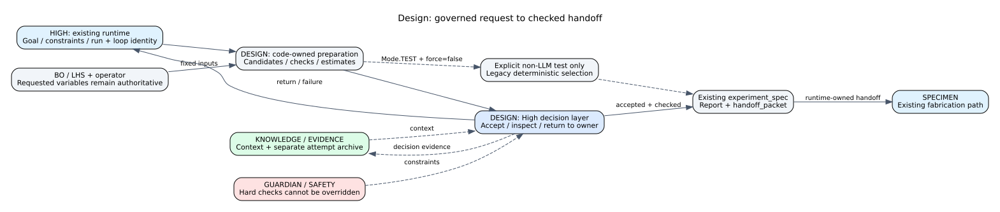
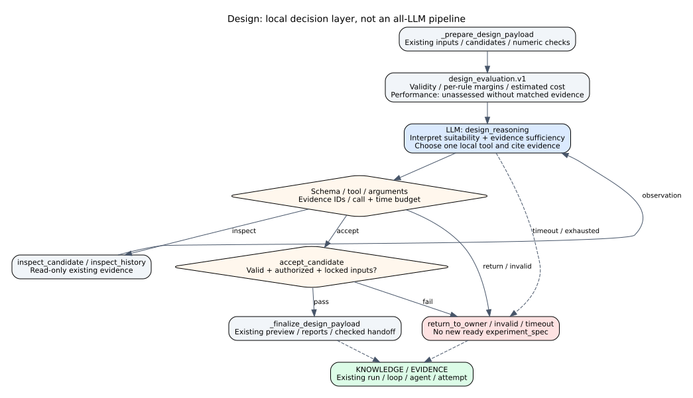

# Design Agent Reference

## Summary

`DesignAgent` converts a normalized objective, constraints, and prior
BO/Knowledge/failure context into an authoritative experiment specification.
Deterministic candidate generation, hard constraints, repair/rejection, and
ranking select the candidate; LLM reasoning reviews rationale rather than
overriding the selection contract.

## Scope

The agent owns design-space construction and the Design-to-Specimen handoff. It
does not manufacture a specimen, author arbitrary runtime graphs, or command a
device.

## Source of Truth

`agents/design_agent.py`, `graphs/modules/design/module.yaml`, the Design node
and transitions in the primary graph, and controller merge/handoff behavior.

## Actual Role

| Does | Does not |
|---|---|
| Normalize objective and constraints | Treat free-form chat as an accepted experiment contract |
| Use prior BO, Knowledge, and failure evidence | Claim missing evidence exists |
| Generate, constrain, repair/reject, and score candidates | Let LLM prose bypass hard constraints |
| Select and report one authoritative candidate | Slice, print, move, or test a specimen |
| Emit a Specimen handoff | Own graph/module authoring APIs |

## Three-Level Control Classification

| Level | Design responsibility | Authority boundary |
|---|---|---|
| High-Level Control | Receives the governed Design stage with mission, constraints, prior evidence, and cycle identity; returns one validated Specimen handoff | Does not select the next graph route or start downstream fabrication |
| Middle-Level Control | Normalize objective/units, collect compatible BO/Knowledge/failure context, construct the design space, generate candidates, enforce/repair constraints, score, select, and emit `experiment_spec` | Deterministic constraints and score ledger remain authoritative over model rationale |
| Low-Level Control | Uses deterministic in-process design computation and bounded `design_reasoning`; the module declares no tools | Has no printer, robot, camera, desktop, instrument, shell, or solver authority |

Design recovery changes the bounded candidate or experiment specification at
Middle-Level Control. Retry/review/stop remains High-Level, and physical
realization begins only after Specimen Making enters its own low-level path.

## Closed-Loop Position and Handoffs

**Figure Design-1.** Orchestrator objectives and accepted Knowledge, BO, and
failure context become a constrained experiment specification for Specimen
Making; an empty or invalid candidate set returns to bounded repair or review.
This is an `inspection`-backed projection of baseline `0b7627b`, not evidence
of design quality or downstream fabrication success.

| Direction | Component | Contract/state | Purpose | Gate |
|---|---|---|---|---|
| In | Orchestrator | mission/context/handoff | bounded objective and inputs | required values complete |
| In | BO | prior recommendation/constraints | next-cycle search context | recommendation validated |
| In | Knowledge | prior trials/patterns/failures | evidence-aware design | provenance present |
| Out | Specimen Making | experiment spec/design handoff | fabricate selected candidate | hard constraints passed |
| Out | Runtime/Guardian | decisions/metrics/risk | audit and downstream review | schema/decision state |

## Inputs and Outputs

Input state includes objective, constraints, prior context, `bo_result`,
Knowledge context, and failure memory. Outputs include `experiment_spec`,
`design_report`, `design_candidate`, `candidate_ledger`, decisions, metrics, and
`handoff_packet`. Optional LLM rationale remains distinguishable from the
deterministic scores and selected candidate.

## Internal Execution

| Step ID | Work | Output/failure boundary |
|---|---|---|
| `orchestrator_plan` | Orchestrator pre-execution planning | accepted mission/context or missing-input state |
| `01_receive_objective_context` | receive objective/runtime | bounded context |
| `02_normalize_objective_contract` | normalize schema/units | invalid objective blocks design |
| `03_collect_prior_bo_knowledge_failure` | collect prior evidence | absence remains explicit |
| `04_form_hypothesis` | hypothesis/test variables | rationale, not authority |
| `05_construct_design_space` | build constrained variables | empty/invalid space blocks |
| `06_generate_candidate_pool` | deterministic candidates | reproducible pool |
| `07_apply_constraint_gate` | FDM/fixture/failure constraints | rejected candidates |
| `08_repair_or_reject_candidates` | bounded repair | no silent constraint removal |
| `09_score_uncertainty_information_risk` | multi-factor score | score ledger |
| `10_select_authoritative_candidate` | choose winner | no valid candidate blocks |
| `11_emit_design_report` | report/decision register | traceable rationale |
| `12_handoff_specimen` | package downstream contract | schema/handoff validation |

**Figure Design-2.** The Orchestrator pre-stage and twelve internal entries
separate objective normalization, prior evidence, deterministic candidate
generation, constraint/repair gates, scoring, authoritative selection, and
handoff. Model rationale is bounded advice. This `inspection` figure groups
contract steps and does not imply independently scheduled graph nodes.

### Execution trace details

| Phase | Required/optional state | Authoritative operation | State/evidence written | Failure/recovery |
|---|---|---|---|---|
| Objective intake | objective and hard constraints required; priors optional | normalize schema, units, and bounds | normalized objective contract | missing/invalid input returns to Orchestrator |
| Prior context | BO, Knowledge, and failure refs with provenance | accept only compatible bounded context | context references and absence reasons | absent evidence stays explicit |
| Candidate construction | normalized variables and fixture/manufacturing rules | deterministic space and pool generation | reproducible candidate ledger | empty space blocks selection |
| Constraint gate | each candidate and hard rules | reject or allowlisted repair, then recheck | rejection/repair reason | no constraint is silently removed |
| Scoring | valid candidates | objective, uncertainty, information, and risk score | score ledger | unscorable candidate is rejected with reason |
| Selection | complete score ledger | deterministic authoritative winner selection | `experiment_spec` and decision register | no valid winner yields revise/stop |
| Handoff | selected spec and report | validate Specimen contract | report, metrics, handoff packet | invalid handoff cannot dispatch Specimen |

`design_reasoning` may explain hypotheses or critique a candidate, but its text
does not mutate hard constraints or replace deterministic scores. Planning and
graph-authoring APIs configure shared runtime surfaces; the graph handler is
the Design execution boundary.

## API Surface

| Class | Method | Path/family | Service | Effect | Notes |
|---|---|---|---|---|---|
| shared | GET/POST | `/api/planning/session`, `/messages`, `/bootstrap`, `/message` | planning/controller | local_state/model | operator intent and generated design artifacts |
| connected | GET | `/api/planning/artifacts/{run_id}/{specimen_id}/{filename}` | artifact service | read_only | design/STL preview artifacts where present |
| operator | GET/POST/PUT | `/api/graphs/*` | graph platform | read_only/local_state | author, validate, compile, version, dry-run, run graphs |
| shared | POST | `/api/run/start` | controller | physical_possible | invokes graph, not Design alone |

There is no dedicated direct Design execution endpoint. Graph APIs configure
the platform; they are not owned by `DesignAgent`.

## Tools and Connections

| Connection | Implementation | Boundary | Effect | Evidence |
|---|---|---|---|---|
| LLM role `design_reasoning` | selected model backend | bounded rationale review | model | reasoning metadata |
| Candidate/constraint logic | `agents/design_agent.py` | deterministic Python | local_state | candidate ledger/scores |
| Orchestrator | pre-stage/handoff | in-process | local_state | mission/handoff |
| Knowledge/BO context | runtime state | in-process | read_only | provenance/prior refs |

The module declares no tools. This prevents design reasoning from acquiring
implicit device or shell authority.

## State, Events, Artifacts, and Storage

Design data merges into run metadata and planning messages. Candidate ledger,
decision register, metrics, selected spec, preview/STL-related artifacts, and
handoff references provide the audit path. A GUI preview is derived from these
artifacts and is not selection authority.

## Modes and Fallbacks

Test can use deterministic autofill and virtual downstream paths. Replay uses
recorded context. Live changes downstream execution risk, not the need for hard
design constraints. Model fallback changes rationale configuration; it must not
change the deterministic authority contract silently.

## Safety, Approval, and Effect Boundary

Design has no direct physical effect. Hard geometry/manufacturing/fixture and
failure constraints precede handoff. Live approval occurs downstream at
physical execution gates. A high model confidence cannot repair an invalid
candidate outside allowlisted deterministic rules.

## Errors and Recovery

Missing input returns to Orchestrator; invalid units/schema block normalization;
empty design space or no valid candidate produces a diagnosable stop/revise
state. Recovery changes objective/constraints or uses a recorded bounded repair.
It must not delete constraints or fabricate prior evidence.

## Operator and GUI Surfaces

Live GUI shows objective, candidate board, report, decisions, previews, and
artifacts. Planning chat supplies and confirms missing values. Runtime IDE and
graph management affect composition, not candidate authority.

## Current Verification

Verified against the class, one pre-execution entry, all 12 internal IDs, input
and output manifest contracts, planning/graph route families, and current
Design GUI manifest at baseline `0b7627b`.

## Limitations and Known Gaps

This Reference does not establish design optimality, scientific novelty,
manufacturing success, or model-rationale quality. Domain constraint coverage
depends on the selected experiment and implementation.

## Related Documents

- [Agent Matrix](agent_api_connection_matrix.md)
- [Orchestrator](orchestrator_agent.md)
- [Specimen Making](specimen_agent.md)
- [Three-Level Control Model](../runtime/three_level_control_model.md)
- [Legacy Design/Specimen Guideline](specimen_design_existing_runtime_guideline.txt)
- [Problem and Contributions](../paper/01_problem_and_contributions.md)
