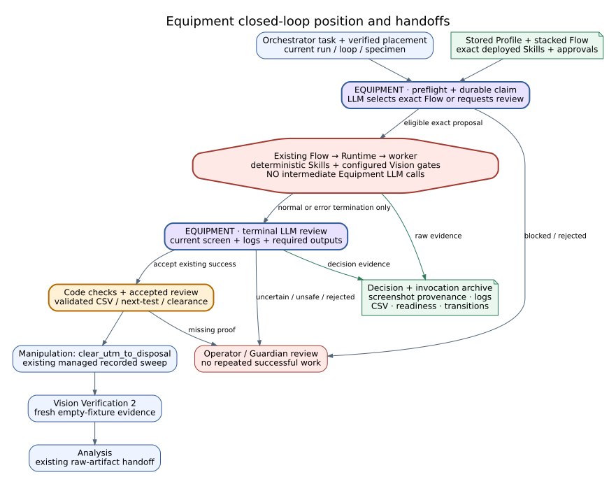
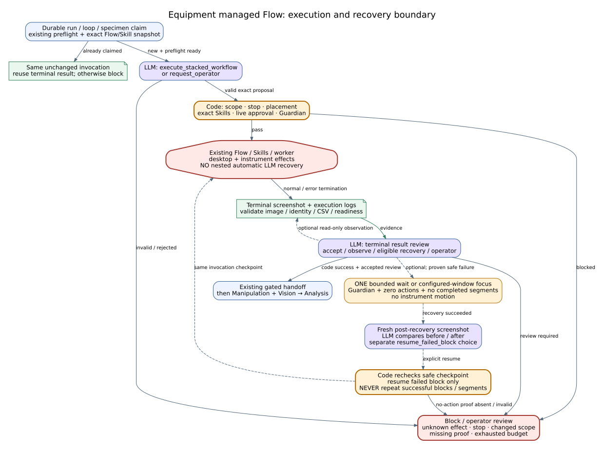
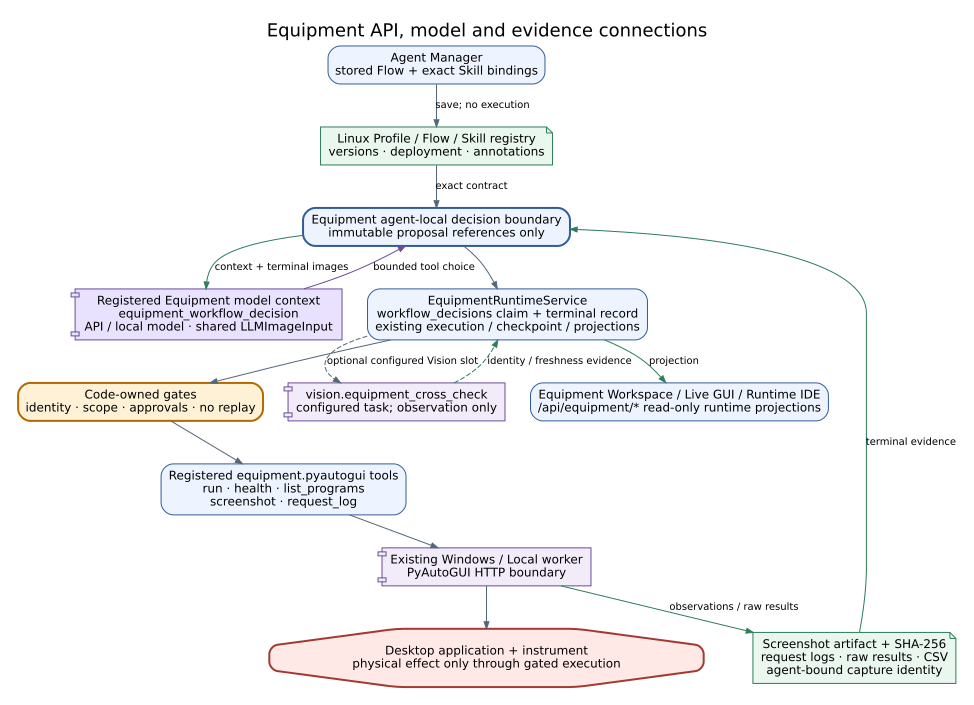

# Lab Equipment Agent Reference

## 역할

`LabEquipmentAgent`는 저자동화·반자동화 PC 제어 장비의 실험 단계를 소유합니다. UTM은 현재 등록된 첫 Equipment Profile이며 Agent 본체의 고정 장비가 아닙니다.

Agent는 정확한 Profile/Skill/program을 선택하고 Linux `EquipmentRuntimeService`에 실행을 등록합니다. Windows 또는 Local Bridge는 선택된 프로그램을 결정론적으로 실행하고 원시 증거만 반환합니다. 완료 판정과 Analysis handoff는 Linux에서 한 번만 수행합니다.

## 세 단계 제어

| 제어 수준 | 책임 | 구현 경계 |
|---|---|---|
| High-Level | Equipment 단계 진입/종료, Profile/Skill 선택, 제한적 LLM 복구, 재시도·정지·handoff 결정 | `LabEquipmentAgent` |
| Middle-Level | 실행 ID, worker, 모드, 증거, 완료 판정, 상태 저장과 projection | `EquipmentRuntimeService`, Profile/Skill runtime |
| Low-Level | PyAutoGUI 입력, 창/locator 확인, 화면 캡처, 녹화, 파일과 원시 결과 반환 | Windows/Local Bridge |

Device Workspace는 수동 개발·설정·검증 화면이며 자동 실험 루프의 별도 제어 원본이 아닙니다.

## 유일한 자동 실행 경로

```text
LangGraph Equipment stage
  -> LabEquipmentAgent.run()
  -> EquipmentRuntimeService execution record
  -> equipment.pyautogui.run
  -> selected Windows or Local worker
  -> raw evidence
  -> one Linux completion interpretation
  -> Analysis handoff or explicit block
```

PyAutoGUI tool 부재를 이유로 `utm.run_protocol`에 자동 fallback하지 않습니다. native UTM이 필요하면 별도 provider를 가진 명시적 Profile로 등록해야 합니다.



**Figure Equipment-1.** Lab Equipment 단계는 상위 orchestration 결정과 Profile-bound
실행 계약을 받아 worker에 제한된 명령을 전달하고, 검증된 장비 증거만 Analysis 단계로
handoff합니다. 도표는 구성 경계를 설명하며 물리 장비 성능을 입증하지 않습니다.

## Profile과 Skill

Profile은 다음을 선언합니다.

- `profile_id`, label, provider
- 허용 program ID와 기본 program
- 모드별 worker payload
- 필요한 locator/evidence
- 선택적 `vision_link`
- completion interpreter
- manual knowledge scope

Skill은 Linux `memory/equipment_skills/`가 원본입니다. Windows에는 검증된 배포 캐시 또는 로컬 초안만 존재합니다.

```text
record -> transfer -> annotate -> edit/save -> deploy[compile + validate + transfer] -> execute
```

`annotate`는 전체 2 FPS 원본을 한 요청에 적재하지 않습니다. Linux가 16 frame 4x4 스토리보드를 만들고 청크별 상태 변화를 순차 분석한 후 전체 workflow를 합성합니다. Overview 스토리보드는 GUI와 감사용으로 보존하고, 최종 합성에는 순서가 보존된 청크 분석과 아직 분석되지 않은 action locator 이미지만 전달해 동일한 고해상도 상태 프레임을 중복 전송하지 않습니다. 청크 진행 상태는 `ANALYZING_TIMELINE`, 최종 합성은 `SYNTHESIZING`으로 작업 기록과 GUI에 표시됩니다. 정상 실행에는 LLM을 사용하지 않습니다. 녹화 분석과 선언된 복구 상황에서만 현재 선택된 Local/API 모델을 Linux에서 사용합니다.

### Profile Skill Flow

실제 TRAPEZIUMX-V 녹화 흐름은 기존 Profile Skill Flow 위에
`run_utm_compression_cycle` workflow-level Agentic Task로 투영됩니다. 계층은 다음과
같습니다.

```text
run_utm_compression_cycle
  -> Profile-bound Equipment Skill Flow
    -> block Agentic Task + exact Skill + optional Vision Slot
      -> Equipment Skill Runtime / PyAutoGUI bridge
```

이 오버레이는 Lab Equipment Agent에만 추가됩니다. Manipulation Agent 구현과 정책은
변경하지 않으며, Equipment 단계는 상위 단계가 만든 identity-bound
`ready_for_equipment` handoff를 소비합니다. 이 handoff는 실제 실행의 필수 진입 조건이고
ON/OFF 선택지가 없습니다. test/replay 계열 모드만 명시적인 simulated gate evidence를
기록할 수 있습니다.

현재 canonical cycle의 block 순서는 다음과 같습니다.

1. Move Jigs for Next Specimen
2. Start Test
3. contact 감지 후 method가 정한 상대 Stroke 수행
4. method target 도달과 자동 Height return 확인
5. Raw Data CSV 저장
6. Raw Data CSV 경로·parse·row/stability evidence 검증
7. 현재 시험을 저장하지 않는 Next Test 전이
8. 설정된 robot-entry clearance Height 복원

Force, Stroke, Height의 관측값과 method target은 서로 다른 evidence 필드로 저장합니다.
contact threshold, 상대 Stroke, 자동 return Height, robot-entry clearance 같은 수치는
코드의 고정 상수가 아니라 현재 method/cell 설정과 실제 장비 결과에서 가져옵니다.
각 단계가 끝날 때의 화면, locator, 버튼/아이콘/상태 변화는 bounded transition
evidence로 남깁니다. Raw CSV 검증과 clearance 복원이 모두 확인되어야 다음 시편
readiness와 최종 handoff가 승인됩니다.

Raw CSV 승격은 저장/검증 block이 같은 Linux-side `utm_csv` artifact ID와 경로를
가리키고, 그 artifact가 직접 기록한 run/specimen identity, write 완료, 필수 column, parse와 row evidence가 모두
일치할 때만 허용합니다. 후보 artifact는 단계당 하나여야 하며 acquisition probe는
artifact ID/path/run/specimen이 모두 일치할 때만 결합합니다. Clearance는 block 완료만으로 승인하지 않고 실제 관측 Height가
그 실행의 configured target과 일치해야 합니다.

workflow-level task를 Agent Manager에서 불러와도 각 block의 Skill Slot은 자동으로
바인딩되지 않습니다. 실제 배포된 정확한 Skill 버전을 운영자가 연결해야 하며, 기존
step별 Vision 스위치는 그대로 선택 사항입니다. Vision을 끄면 Equipment 실행과 동시에
수행하는 해당 block 관측만 bypass됩니다. 필수 upstream handoff 확인은 꺼지지 않습니다.
지원하지 않는 workflow task ID나 canonical 8-block 순서 변경은 저장/실행 전에
거부됩니다. 실행 시에는 모든 block의 exact Skill 버전이 배포·활성 상태이고 동일
Profile을 대상으로 하는지, 활성화된 Vision task가 카탈로그에 존재하는지를 첫 장비
입력 전에 일괄 검증합니다.

Profile에 여러 Skill과 선택적 Vision 판정을 묶을 때는
`graphs/modules/equipment/equipment_skill_flows.json`을 단일 원본으로 사용합니다.
작성 권한은 `/equipment/agent-manager` 한 곳에만 있습니다. Equipment Workspace,
Live GUI, Runtime IDE는 동일 API에서 저장 계약과 실행 projection을 읽지만 수정하지
않습니다.

Agent Manager의 `+ Block`은 Skill 존재 여부와 무관하게 다음 세 슬롯을 가진 빈 복합
block 하나를 추가합니다. Skill은 block 생성 조건이 아니라 생성 후 Skill Slot에
바인딩하는 실행 자원입니다.

- **Skill Slot:** 비어 있는 초안 상태를 저장할 수 있으며, 배포·활성 상태인 정확한 `skill_id@version` 실행 자원만 바인딩합니다. Skill 선택은 Task 이름을 변경하지 않습니다.
- **Agentic Task:** 실제 수행할 작업 이름을 `agentic.task`에 저장하고 성공/실패 후 `next`, `__complete__`, `__blocked__` 경로를 Middle-Level로 제한합니다. 과거 `label` 값은 로드시 Task로 자동 이관되며 호환 별칭으로만 유지됩니다. 별도 LLM 체계를 만들지 않고, 선택된 Skill을 제작할 때 이미 생성한 `workflow_summary`/step transition annotation과 실행 중 이미 사용하던 bounded recovery 경로를 동일 Task 실행 컨텍스트로 묶습니다.
- **Vision Slot:** 같은 block 내부에서만 선택적으로 활성화되며 공유 Equipment Vision Task 카탈로그의 정확한 `vision.task_id` 하나를 선택합니다. Equipment Agent는 `vision.equipment_cross_check`에 해당 task 하나만 전달하고, 관측 결과를 Middle-Level gate로 반환합니다. 장비 입력은 만들지 않습니다.
- 순환, standalone Vision, 알 수 없는 목적지, 마지막 block 이후 `next`, 필수 route 누락은 저장 단계에서 거부합니다.
- 비어 있지 않은 활성 Profile Skill Flow가 있으면 기존 단일 Skill보다 먼저 실행합니다.
- Flow가 비어 있으면 기존 단일 Skill 또는 Profile program 경로를 그대로 사용합니다.
- block이 있지만 Skill Slot이 비어 있으면 저장과 projection은 허용하되 실행 readiness는 `unbound`로 차단합니다. 기존 경로로 fallback하지 않습니다.

각 전이는 `memory/equipment_runtime/equipment_skill_flow_latest/<profile_id>.json`에
`block_id`, `task`, `skill|vision` phase, outcome, target과 함께 기록됩니다. Equipment
Workspace와 Live GUI의 Agentic Progress, Runtime IDE 그래프가 이 동일 기록을
투영합니다. Agent Manager 저장은 장비를 실행하지 않습니다.

Vision 전이는 추가로 `vision_task_id`, `check_id`, task label, runtime/observer mode,
confidence, evidence timestamp/expiry/source, failure code와 bounded evidence reference를
보존합니다. 결과의 run/loop/specimen identity가 요청과 다르거나 evidence가 만료됐으면
다음 Skill로 진행하지 않고 `error` route로 차단합니다. `detected`, `not_detected`,
`timeout`, `error`는 저장된 block route만 따르며, 선택되지 않은 다른 UTM Vision
task를 자동 실행하지 않습니다.

현재 Equipment 호환 task는 `utm_pre_start`, `utm_motion_confirm`,
`utm_test_complete`입니다. 정의 원본은 `utils/equipment_vision_tasks.py`이고 Agent
Manager는 API가 반환한 카탈로그만 선택지로 사용합니다. Equipment Workspace, Live
GUI, Runtime IDE는 실행 레코드의 같은 task와 outcome을 읽는 read-only projection입니다.

Skill 실행 레코드는 `agentic_task`와 해당 Skill의 기존 annotation 참조를 함께
보존합니다. 정상 실행에서는 annotation을 다시 생성하거나 LLM을 호출하지 않습니다.
실행 전 actuation이 없었다고 증명된 locator/window 실패에 한해서만 기존
`equipment_skill_recovery` 호출에 동일 Task와 annotation 문맥이 전달됩니다.



**Figure Equipment-2.** Agent Manager가 저장한 복합 block은 Skill 실행과 선택적 Vision
판정을 순차 처리하지만 실제 장비 입력은 Low-Level worker 경계를 통해서만 발생합니다.
저장과 projection은 비작동 경로입니다.

Skill Workflow Editor는 정확한 `skill_id@version`의 `workflow.json`만 수정하는
순차 편집기입니다. 일반 장비 macro의 실행 순서를 명확하게 유지하기 위해 IF,
loop, 병렬 edge, 사용자 Python을 받지 않습니다. `Timer wait`는 고정 시간을,
`Image/Text/File until wait`는 polling interval과 timeout을 갖는 bounded wait를
표현합니다. 저장하면 이전 compiled program과 validation 결과를 무효화합니다.
GUI의 단일 `Deploy`는 compile, validate, worker transfer/register를 순서대로 수행하며
Skill을 실행하지 않습니다. 배포 또는 비활성화된 정확 버전은 불변이므로 수정하려면
새 버전을 생성해야 합니다. 독립 compile/validate API는 CLI 호환용으로만 유지합니다.

이미지 기반 action의 `Edit Crop`은 hash가 검증된 pre-action 원본 프레임에서
Target ROI만 이동하거나 리사이즈합니다. AI가 만든 최초 ROI는 `Reset to AI` 기준으로
보존되고 Context ROI와 두 번째 locator candidate는 변경하지 않습니다. `Apply Crop`은
편집기 로컬 상태만 바꾸며 `Save` 시 workflow와 annotation을 함께 갱신하고 기존
compiled/validated 산출물을 무효화합니다. `Replace Locator`는 원본 ROI를 조정하는
기능이 아니라 locator PNG 자체를 외부 파일로 교체하는 별도 작업입니다.

## Vision Link

`vision_link.enabled=false`인 Profile은 화면·파일·장비 상태만으로 실행합니다. 활성 Profile은 다음 중 하나를 요구합니다.

1. identity와 freshness가 유효한 기존 Vision evidence
2. 호출 가능한 `vision.equipment_cross_check` tool

둘 다 없으면 `EQUIPMENT_VISION_LINK_UNAVAILABLE`로 실행 전 차단합니다. Vision tool이 있으나 필수 관측 결과가 없으면 UTM 등 해당 Profile의 세부 evidence failure code를 반환합니다. Vision은 관측만 제공하며 장비 입력을 직접 제어하지 않습니다.

## 통합 실행 기록

`EquipmentExecutionRecord`는 다음 식별자를 보존합니다.

- `execution_id`, `sequence_id`
- `run_id`, `experiment_id`, `specimen_id`
- Profile, Skill/program, worker, mode
- event history, raw result, evidence
- completion, failure, recovery, handoff

상태 이름과 전이는 Profile/Skill/provider 계약에 따라 달라질 수 있습니다. `RESOLVING`, `PREFLIGHT`, `EXECUTING`, `VERIFYING`, `COMPLETED`, `BLOCKED` 등은 대표적인 Equipment 상태이지 모든 모듈에 강제되는 전역 수명주기가 아닙니다.

Live GUI, Equipment Workspace, CUI, Runtime IDE는 이 기록의 같은 projection을 읽습니다. Live GUI는 현재 `run_id`로 `/api/equipment/runtime/current`와 Profile-bound Skill Flow 실행을 조회하고, run이 바뀌면 Equipment snapshot을 비우므로 다른 실험의 최신 Equipment 실행이 섞이지 않습니다. workflow overlay가 있으면 잠긴 진입 gate, 8단계 Skill/Vision 진행, 관측값과 method target, 화면 전이, Raw CSV 검증, 다음 시편 readiness를 기존 Equipment dashboard에 추가로 표시합니다. 별도의 장비 실행 버튼은 만들지 않습니다. 브라우저 새로고침은 실행을 새로 만들지 않습니다.

## 입력과 출력

주요 입력:

- `OrchestratorState`
- exact Profile/Skill/program ID
- run/experiment/specimen identity
- mode, worker, preconditions
- Vision/Guardian/operator evidence

주요 출력:

- `equipment_result`
- `equipment_profile`
- `equipment_report`
- `equipment_runtime_execution`
- `equipment_runtime_projection`
- `equipment_handoff`
- evidence/artifact references
- hardware alert와 incident record

## Tool 경계

| Tool | 역할 |
|---|---|
| `equipment.pyautogui.health` | 선택 worker 상태 확인 |
| `equipment.pyautogui.list_programs` | program catalog 확인 |
| `equipment.pyautogui.run` | bounded program 실행 |
| `equipment.pyautogui.request_log` | 실행 identity/audit 확인 |
| `vision.equipment_cross_check` | Profile이 요청한 관측 증거 |



**Figure Equipment-3.** Linux runtime, Profile/Skill registry, Windows 또는 Local worker,
Vision, Analysis 사이의 API 및 증거 경계를 나타냅니다. Runtime IDE와 GUI는 같은
projection을 읽으며 별도 실행 원본을 만들지 않습니다.

`utm.run_protocol`은 호환용 명시 호출 경로로만 남을 수 있으며 자동 선택되지 않습니다.

## 실패와 복구

- Profile/program 불일치: 실행 전 차단
- worker 없음/불건전: 실행 전 차단
- Vision Link 없음: 실행 전 차단
- locator/checkpoint 실패: Skill에 선언된 bounded recovery만 허용
- recovery 판단: 실행 시작 시 고정한 모델과 기존 Skill annotation, 현재 `agentic_task`를 사용하며 별도 fallback LLM 경로를 만들지 않음
- invoke 이후 timeout: effect unknown으로 기록하고 상태/화면/파일 확인 전 재실행 금지
- 불완전 파일: 증거로 보존하지만 완료로 승격하지 않음

LLM 결과는 allowlisted 선택과 설명만 제공하며 임의 PyAutoGUI/shell 명령 권한을 만들 수 없습니다.

## 검증 범위

2026-09-01 기준 단위/통합 검증은 generic profile, UTM profile, Skill 실행, workflow-level compression cycle, locked entry gate, 선택적 step Vision, Raw CSV/readiness projection, Live GUI projection, Windows pairing/packaging 경로를 포함합니다. 자동 테스트는 물리 UTM을 작동하지 않습니다.
