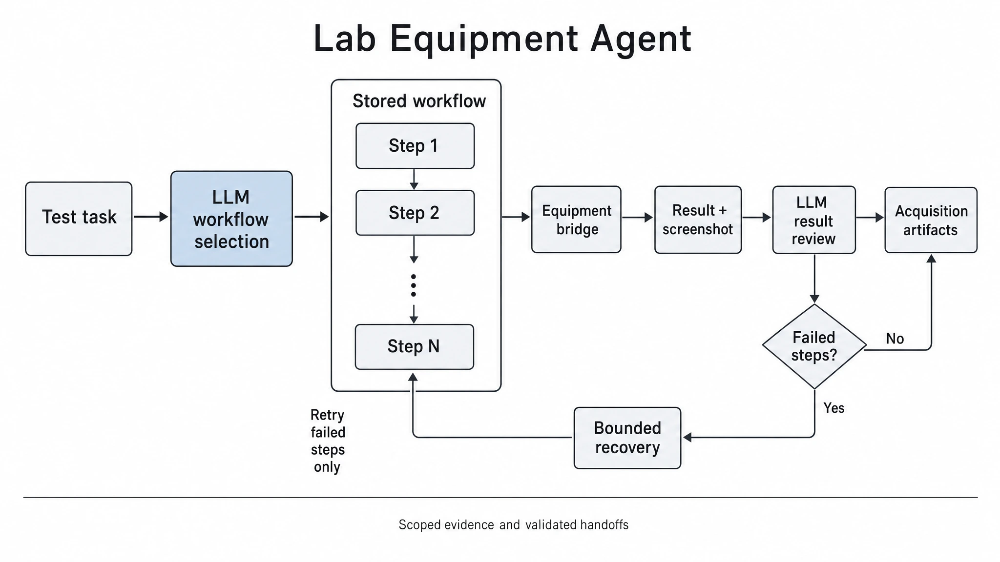

<!-- atr-doc
doc_type: reference
subtype: system
status: active
authority: descriptive
audience: [researcher, operator, developer, maintainer]
scope: [agents, equipment, pyautogui, equipment_runtime, vision_link]
summary: Equipment-owned bounded Flow selection and terminal multimodal review over the existing Linux Runtime and local or Windows workers.
source_of_truth:
  - agents/equipment_agent.py
  - agents/equipment_workflow.py
  - agents/equipment_decision.py
  - scripts/verify_equipment_decisions.py
  - utils/equipment_runtime_service.py
  - utils/equipment_profiles.py
  - utils/equipment_skill_runtime.py
  - utils/equipment_skill_flow.py
  - graphs/modules/equipment/equipment_skill_flows.json
  - device_bridges/windows_pyautogui_bridge.py
  - mcp_tools/equipment_tools.py
last_verified: 2026-09-09
verified_against: working-tree
related_docs:
  - docs/device_bridges/windows_pyautogui_bridge.md
  - docs/hardware/windows_pyautogui_equipment_agent_guideline.md
  - docs/strategy/2026-08-27-windows-lab-equipment-consolidation-report.md
  - docs/superpowers/plans/2026-09-09-equipment-workflow-decision-layer.md
supersedes: []
-->

# Lab Equipment Agent Reference



*Role overview; detailed execution and connection diagrams follow below.*

## Status at a Glance

- Runtime status: Managed stacked Flow decision boundary implemented in the working tree
- LLM decision layer: Implemented; archived terminal evidence checked through registered API/local models
- Physical effect: Existing gated Skills and Windows/Local workers only
- Primary handoff: Verified CSV/readiness → Manipulation clearance → fresh Vision → Analysis
- Live hardware validation: Not performed for this reconstruction
- Known limit: Offline recovery decisions verified; live recovery not exercised; no crash-resume

## Summary and Actual Role

`LabEquipmentAgent` owns the experiment stage for PC-controlled laboratory
equipment. UTM is a registered Equipment Profile, not a hard-coded agent identity.
For a configured stacked Skill Flow, an Equipment-owned LLM judges task fit and
selects the exact server-owned execution proposal. The existing Flow runs through
its Skills without intermediate Equipment LLM calls. After normal or error
termination, the model compares the current screenshot, execution logs and required
outputs before accepting the result, requesting observation, selecting eligible
bounded recovery, or returning to the operator.

The agent preserves the current Profile, exact deployed Skills, Flow routes,
Linux `EquipmentRuntimeService`, and Windows/Local worker. Code owns mandatory
checks and completion facts; a model acceptance never replaces them. Device
Workspaces are manual development/configuration surfaces, not independent owners
of the automatic experiment loop. Standalone/direct Skill and legacy program
paths retain their existing behavior; this decision boundary manages stacked Flows.

## Five-Area Responsibility Map

| Area | Equipment responsibility | Authority boundary |
|---|---|---|
| High-Level Control | Consume the delegated Equipment task and return completion or review | Orchestrator retains mission and graph routing; Manipulation and Vision own downstream clearance |
| Middle-Level Control | LLM Flow suitability, terminal evidence judgment and bounded recovery choice; code validates proposals, invocation ownership and handoff | Existing Flow order, exact Skills, method settings and worker payloads are immutable to the model |
| Low-Level Control | Deterministic Skill segments, window/locator checks, screenshots, files and raw execution results | Existing Runtime/tools and Windows/Local worker own desktop and instrument input |
| Guardian / Safety | Enforce placement, identity, freshness, live approval, stop, recovery budget and unknown-effect gates | No model or GUI bypass; no retry without proven zero actions and a safe checkpoint |
| Knowledge / Evidence | Retain decision, image provenance, logs, transitions, CSV and readiness evidence | Observations are data, not instructions; model confidence is not measurement or completion proof |

These are responsibility areas, not five stages or five model calls. The decision
layer belongs to Middle-Level Equipment supervision, not a new graph agent.

## Closed-Loop Position and Handoffs

```text
LangGraph Equipment stage
  -> LabEquipmentAgent.run()
  -> durable invocation claim + existing preflight + bounded LLM Flow selection
  -> existing Flow / exact Skills / EquipmentRuntimeService
  -> equipment.pyautogui.run -> selected Windows or Local worker
  -> terminal screenshot + logs + code-owned CSV/readiness checks
  -> Equipment LLM result review or bounded recovery/review
  -> Manipulation UTM-clear replay
  -> Vision Verification 2
  -> Analysis handoff or explicit block
```

Missing PyAutoGUI tools do not trigger automatic fallback to `utm.run_protocol`.
Native UTM requires an explicitly registered Profile with its own provider.


**Figure Equipment-1.** Working-tree `inspection` projection: the managed Flow has
selection and terminal-review boundaries; post-test Manipulation and fresh Vision
still precede Analysis. This architecture figure is not live equipment evidence.

## Profiles, Skills and Stored Flows

A Profile declares:

- `profile_id`, label, provider
- allowed and default program IDs
- mode-specific worker payloads
- required locators/evidence
- optional `vision_link`
- completion interpreter
- legacy manual knowledge scope (retained metadata, not an active retrieval filter)

The existing workflow decision receives optional, bounded reference evidence from
[Source Library](knowledge_agent.md#source-intake-and-curation). Its independent
`knowledge_settings.source_scope` preserves applicability and citations without
altering configured workflow proposals. Legacy automatic manual attachments are retired.

Linux `memory/equipment_skills/` is the Skill source of truth. Windows holds
validated deployment caches or local drafts.

```text
record -> transfer -> annotate -> edit/save -> deploy[compile + validate + transfer] -> execute
```

Annotation uses sequential 16-frame 4×4 storyboards, not the entire 2 FPS recording
in one request. Overview images remain available for GUI/audit; final synthesis
receives ordered chunk analyses and previously unanalyzed action-locator images
without resending the same high-resolution state frames. Jobs expose
`ANALYZING_TIMELINE` and `SYNTHESIZING`. Recording analysis is separate from the
managed Flow decisions below; normal Skill execution does not regenerate annotations.

### Profile Skill Flow

The recorded TRAPEZIUMX-V procedure is projected as the workflow-level Agentic
Task `run_utm_compression_cycle` over the existing Profile Skill Flow:

```text
run_utm_compression_cycle
  -> Profile-bound Equipment Skill Flow
    -> block Agentic Task + exact Skill + optional Vision Slot
      -> Equipment Skill Runtime / PyAutoGUI bridge
```

This Equipment-only overlay does not modify Manipulation policy. Identity-bound
upstream `ready_for_equipment` is mandatory for real execution and cannot be
switched off. Only explicit test/replay modes can record simulated gate evidence.

The canonical cycle keeps this block order:

1. Move Jigs for Next Specimen
2. Start Test
3. Detect contact and execute the method-defined relative Stroke
4. Confirm method target and automatic Height return
5. Save Raw Data CSV
6. Validate Raw CSV path, parse, row and stability evidence
7. Transition to Next Test without saving the current test
8. Restore configured robot-entry clearance Height

Observed Force, Stroke and Height are distinct from method targets. Contact,
Stroke, return Height and clearance values come from current method/cell settings
and actual results, not fixed constants. Screens, locators and UI-state changes
remain bounded transition evidence. Both validated CSV and restored clearance are
required for next-specimen readiness and handoff.

CSV promotion requires the save/validation blocks to identify the same Linux-side
`utm_csv` artifact ID/path, with matching artifact-authored run/specimen identity,
completed write, required columns, parse and row evidence. Only one candidate per
stage is allowed. Acquisition probes join only on matching ID/path/run/specimen.
Clearance requires observed Height to match this execution's configured target;
a completed block label is insufficient.

Loading the workflow task does not bind Skill Slots automatically. Operators bind
exact deployed versions. Per-block Vision remains optional; disabling it bypasses
only that block's observation, never upstream readiness. Unsupported task IDs or
changes to the canonical eight-block order fail before save/execution. Before the
first equipment input, code validates all exact versions as deployed, enabled,
same-Profile resources and all enabled Vision tasks against the catalog.

`graphs/modules/equipment/equipment_skill_flows.json` is the single Flow source;
`/equipment/agent-manager` owns authoring. Equipment Workspace, Live GUI and Runtime
IDE read the same API contract and execution projection. `+ Block` creates an empty
composite block independently of Skill availability:

- Skill Slot binds only an enabled, deployed `skill_id@version`; selecting it does not rename the task. Empty drafts may be saved but execution is `unbound`, without fallback.
- Agentic Task stores `agentic.task` and saved `next`, `__complete__`, `__blocked__` routes. Legacy `label` migrates to the task as a compatibility alias; existing workflow summaries and transition annotations supply context.
- Vision Slot selects one optional `vision.task_id` inside the block. `vision.equipment_cross_check` observes only that task and never supplies equipment input.
- Cycles, standalone Vision, unknown destinations, final-block `next`, and missing required routes fail save validation.
- A nonempty active Flow takes precedence over a single Skill. An empty Flow retains the existing single-Skill/Profile-program path.

Transitions retain `block_id`, task, `skill|vision` phase, outcome and target in
`memory/equipment_runtime/equipment_skill_flow_latest/<profile_id>.json`. Saving
does not execute equipment. Vision records also retain task/check identity, mode,
confidence, timestamp/expiry/source, failure code and bounded references. Stale or
mismatched run/loop/specimen evidence follows the `error` route; outcomes never
select an unconfigured Vision task. Current catalog tasks are `utm_pre_start`,
`utm_motion_confirm`, and `utm_test_complete`, defined in
`utils/equipment_vision_tasks.py`.

Live GUI reads current-run Flow progress on authoritative planning refresh and
through independent two-second GET observation during an Agent call. Reads are
coalesced, have three-second timeouts, retry failed terminal fetches, and repaint
only changed checkpoints. Late other-run responses are discarded; completed/blocked
evidence is retained. The latest invocation is shown; earlier loops remain archived.
Cyan pending/success Vision styling does not change gates. These UI reads are not
intermediate LLM decisions.


**Figure Equipment-2.** Working-tree `inspection` projection: only the selected
existing Flow produces instrument actions. Terminal recovery is limited to one
wait/focus attempt, followed by fresh observation and a separate safe-resume
decision. Saving and projections are non-actuating; no live reliability is claimed.

The Skill Workflow Editor edits one exact version's sequential `workflow.json`,
without IF, loops, parallel edges or user Python. Timer waits are fixed; image/text/
file waits have bounded polling and timeout. Save invalidates compilation and
validation. `Deploy` compiles, validates and transfers/registers without executing.
Deployed or disabled versions are immutable; edits require a new version. Separate
compile/validate APIs remain for CLI compatibility.

`Edit Crop` changes only Target ROI on a hash-verified pre-action frame. Original
AI ROI remains the reset reference; Context ROI and the second locator candidate
are unchanged. `Apply Crop` is local; Save updates workflow/annotations and
invalidates compiled/validated outputs. `Replace Locator` instead replaces the
locator PNG with an external file.

## Vision Link

Profiles with `vision_link.enabled=false` use screen/file/equipment state.
Enabled profiles require one of:

1. Existing identity- and freshness-valid Vision evidence
2. A callable `vision.equipment_cross_check` tool

Neither available means `EQUIPMENT_VISION_LINK_UNAVAILABLE` before execution.
Missing required observations from an available tool return Profile-specific
evidence failures. Vision observes; it does not directly control equipment input.

## Execution Records and Projections

`EquipmentExecutionRecord` retains:

- `execution_id`, `sequence_id`
- `run_id`, `experiment_id`, `specimen_id`
- Profile, Skill/program, worker, mode
- event history, raw result, evidence
- completion, failure, recovery, handoff

States such as `RESOLVING`, `PREFLIGHT`, `EXECUTING`, `VERIFYING`, `COMPLETED` and
`BLOCKED` depend on Profile/Skill/provider contracts, not a universal module lifecycle.

Live GUI, Equipment Workspace, CUI and Runtime IDE read the same projection.
Current-run `/api/equipment/runtime/current` and Flow queries clear snapshots on
run changes. The workflow overlay adds the locked entry gate, eight-block
Skill/Vision progress, measurements versus targets, screen transitions, CSV
validation and next-specimen readiness. It adds no independent execution button;
browser refresh does not create an execution.

## Inputs and Outputs

Primary inputs:

- `OrchestratorState`
- exact Profile/Skill/program ID
- run/experiment/specimen identity
- mode, worker, preconditions
- Vision/Guardian/operator evidence

Primary outputs:

- `equipment_result`
- `equipment_profile`
- `equipment_report`
- `equipment_runtime_execution`
- `equipment_runtime_projection`
- `equipment_handoff`
- evidence/artifact references
- hardware alerts and incident records
- `equipment_decisions`, `equipment_workflow_execution_id`, `equipment_workflow_recovery`
- `equipment_workflow_cached` on recorded-result reuse

## LLM Reasoning and Decision Authority

| Question | Evidence and actual choice | Fixed boundary |
|---|---|---|
| Does the stored Flow fit this delegated task? | Goal, exact Flow/Skill deployment and annotations; execute the bound proposal or request operator review | No new Flow, Skill version, route, method setting or worker command |
| Do terminal results support completion? | Current screenshot, execution logs, completion facts and required outputs; accept, observe or request review | CSV/readiness/identity/safety checks must already pass |
| Is a failed block eligible for bounded recovery and resume? | Proven zero actions, no completed segments, checkpoint and post-recovery screen; eligible wait/focus, then a separate resume decision | Never repeat completed work or infer safety from missing evidence |

Contextual suitability and conflicting screen/log evidence are model judgments;
schema checks, measurements, gate enforcement and fixed Skill sequencing remain
deterministic. All decisions route through the registered Equipment owner context
and `equipment_workflow_decision`, using the shared API/local-model interface and
`LLMImageInput` for actual image bytes. No independent provider or fallback model
is introduced. Missing valid images prevents real terminal acceptance or recovery.

### Bounded tool contract

These are agent-local structured decision requests, not new public MCP endpoints.
Only eligible choices are offered at a given checkpoint.
Existing Flow preflight runs before model selection: missing readiness or an
unbound Skill retains its original hard-gate failure without model or hardware
execution. The model is not called to reconsider a deterministic preflight block.

| Choice | Effect |
|---|---|
| `execute_stacked_workflow` | Run the exact configured Flow through existing code after gates |
| `accept_workflow_result` | Accept already successful code-owned results; no equipment input |
| `observe_workflow` | Read the request log when available and obtain another terminal screen; no execution restart |
| `recover_wait` | One bounded wait (one second outside effective TEST) |
| `recover_focus` | Focus only the exact window already named by the failed deployed Skill's program |
| `resume_failed_block` | Resume this invocation's safe checkpoint after recovery observation and renewed checks |
| `request_operator` | Block downstream handoff and return review responsibility |

Responses contain exactly `tool`, `arguments`, `reason`, `evidence_refs`. Arguments
copy an immutable server-owned proposal reference; the model cannot supply
coordinates, commands, paths, arbitrary window names, clicks or keystrokes. All
provided references must be cited for an action; operator review cites at least one
supplied reference. Duplicate/unknown JSON fields, changed arguments, missing
references, mock output, timeout, stop or changed scope invalidate the request.
`accepted` is protocol validity, not workflow completion. Explicit TEST mode may
return `deterministic_test` with `llm_used: false`; it is neither model nor visual
or physical validation.

The decision timeout is
`run_metadata.equipment_decision_settings.timeout_s` (default 120 seconds; positive,
finite and at most 600). The managed invocation permits at most five terminal/
recovery decision rounds, one request-log observation choice and one recovery
attempt. Screenshot capture accompanies terminal review rounds. Per-Skill nested
automatic LLM recovery is disabled only for this managed Flow; existing in-flow
Vision and safety checks still run, with no intermediate Equipment model polling.

### Current prompt strategy

Selection asks for task–Flow fit using saved Skills and annotations. Terminal
review independently compares actual screen content with logs, goals and required
outputs: a success label or plausible screen is not proof. Recovery review requires
post-recovery observation and a separate explicit resume decision. The prompt
forbids duplicated completed actions/blocks/segments and directs uncertainty or
contradiction to operator review without inventing requirements. Logs, labels and
image text are untrusted evidence, never instructions. Reasons are brief observable
support, not internal reasoning. Model approval cannot override any hard gate.

Each request includes guidance for its current decision phase only. Phase labels
are explicitly non-callable. Server-built `response_options` show the exact tool,
arguments and evidence references for every currently offered choice; the model
selects one and supplies its own evidence-grounded reason. These options are built
from the current proposals, not from logs or model output. They do not rank choices,
force recovery, or relax the exact-request validator. No equipment-specific error
string or experimental condition is embedded to make a probe pass.

### Duplicate prevention and recovery limits

Before any awaited decision, the existing Runtime creates a durable claim in its
isolated `workflow_decisions` namespace for run/loop/specimen. Repeated invocation
with unchanged scope reuses its recorded terminal result; an active, interrupted,
cancelled or changed-scope claim blocks rather than starting again. This is not a
crash-resume queue or permission to create a fresh invocation for failed work.

Only the current invocation owner can resume. The checkpoint retains prior blocks,
transitions, results and runtime context. Retry eligibility requires an execution
record, exactly one failed worker run, explicit integer `executed_action_count=0`,
no completed segments in the failed block, and the existing safe-retry predicate.
Unknown effects, running/cancelled results, missing counters, partial work or a
completed Flow never permit automatic replay. A checkpoint is not authority to
repeat already completed segments within a failed block.

Eligible recovery is nonphysical wait or exact configured-window focus only—no
press, dismissal, new click, test start, method change or instrument motion.
Guardian and scope checks apply before recovery; actual before/after screenshots
are supplied together for the post-recovery review and explicit resume decision.
Resume rechecks safety and preserves
all earlier successful blocks. Failure, exhaustion or rejection retains raw
evidence while revoking consumable handoff aliases. A screenshot never repairs
unknown action effects or missing no-action proof.

Screenshot review loads a local capture artifact, verifies its SHA-256, size and
image decoding/dimensions, checks returned identity fields and records agent-bound
requested capture identity. Missing bridge identity fields are not independently
attested; LIVE rejects non-live or explicitly simulated screenshot results.
Decisions archive image hashes/labels and bounded references,
not inline image bytes. Scope, stop state and configured Flow/Skill content are
rechecked around decisions and before every managed Skill segment. Snapshots bind
session, objective, device health and operator approval; a mode change cannot
create another execution under the same invocation claim. Image provenance remains supporting evidence, not a
substitute for the existing execution and handoff gates.

## Cycle-Level Verification and Clearance

For non-physical simulator protocols, the Agent also emits the same scoped
`raw_data_export`, `next_specimen_readiness` and `handoff_eligibility` contracts.
CSV validation, hash and row count come from the local parser; readiness comes
from explicitly simulated completion, next-test reset and clearance evidence.
These records carry `simulated: true` and `actuation_performed: false` and cannot
qualify an effective live/physical execution. Identity mismatch, incomplete
readiness or an invalid CSV keeps disposal handoff ineligible.

The synthetic curve spans the experiment's initial height multiplied by
`target_strain`. Height follows `gauge_length_mm`, `height_mm`, then the third
`specimen_size_mm`/`size_mm` dimension, with experiment fields overriding
candidate parameters. Missing values use the existing test defaults; explicit
invalid values fail. Gauge length uses the same six-decimal normalization as
Analysis, and CSV output preserves the endpoint. The force samples remain synthetic, not performance
predictions. Export-only, abort and generic programs do not claim whole-cycle
readiness. Downstream disposal and fresh Vision verification remain required.

The final `equipment_report.cross_checks` and `equipment_result.cross_checks`
describe the complete agentic cycle, not the last registered Skill. In
particular, `restore_robot_clearance` does not save or parse CSV data; its
per-step `false` flags must not replace completed export evidence.

| Cycle check | Evidence source |
| --- | --- |
| `screen_started` | Completed `start_test` Skill |
| `physical_motion_started` | Completed `start_test` and `monitor_contact_and_run` Skills |
| Save, file creation, parse, export responsibility | Stable, parsed CSV bound to this run/specimen and matched across save/validation |

Per-Skill runtime results remain unchanged. Missing or mismatched CSV evidence,
incomplete Skills, and missing clearance still block downstream handoff. CSV
parsing, header discovery, and minimum-data requirements are unchanged.

The 2026-09-06 non-actuating regression replay used archived run
`run-20260906T122533Z-c0effd`: the original report reproduced the four failed
checks; the corrected cycle projection passed stage validation and the Analysis
handoff gate. Analysis parsed all 2,113 recorded points with the CSV hash
unchanged. This is an archived-data check, not another equipment execution.

### Post-test clearance handoff

In the 2026-09-06 working tree, `ready_for_analysis` still describes Equipment's
data readiness, not permission to skip physical fixture clearance. The graph
first requires verified completion, stable validated CSV, eligible handoff,
`next_test_completed`, `clearance_restored`, and confirmed Verification 1.
It then arms one current-run/loop/specimen `clear_utm_to_disposal` child.
Explicitly conflicting run, specimen, or loop identity blocks; a legacy packet
without a loop field is bound to its current merge invocation.

Equipment retains ownership of the UTM test and clearance restoration. The
[Manipulation Agent](manipulation_agent.md#post-test-utm-clearance) owns the
recorded sweep; [Vision](vision_agent.md#post-test-compressed-specimen-verification)
owns the subsequent fresh empty-fixture snapshot. Only their verified result
releases Analysis. This is not another UTM test, a new CSV parser, or an
Equipment-owned robot motion. A real Equipment test cannot continue using a
fabricated virtual clear result when Manipulation is disabled or preflight-only.

Non-actuating coverage is in `tests/unit/test_utm_clear_cycle.py` and
`tests/unit/test_equipment_agentic_task.py`; the former exercises actual
controller/graph routing with fake device responses. No live replay or
equipment execution was performed for this update.

## Tools, APIs and Connections

| Registered tool | Role |
|---|---|
| `equipment.pyautogui.health` | Selected-worker health |
| `equipment.pyautogui.list_programs` | Registered program catalog |
| `equipment.pyautogui.run` | Existing bounded program; eligible exact-window focus recovery |
| `equipment.pyautogui.screenshot` | Terminal screen capture for shared multimodal review |
| `equipment.pyautogui.request_log` | Read-only execution identity/audit observation |
| `vision.equipment_cross_check` | Configured Profile/block observation; no equipment input |


**Figure Equipment-3.** Working-tree `inspection` projection: registered model
routing selects server-owned proposals; the existing Runtime and worker remain
the actuation boundary. GUI projections, screenshot/log evidence and optional
Vision are distinct from execution authority. No live validation is implied.

Connected `/api/equipment/*` and `/api/bridges*` expose existing worker, Skill,
Profile and runtime services. Agent-local decision names are not new public APIs.
`utm.run_protocol` remains an explicit compatibility path, never automatic fallback.

## Safety and Failure Boundaries

- Profile/program mismatch, unavailable/unhealthy worker, or missing required Vision Link blocks before input.
- Placement, Guardian/operator approval, mode, identity, freshness and live preflight remain mandatory.
- Managed Flow recovery follows the stricter terminal-only contract above; direct/standalone legacy Skill recovery remains unchanged.
- A timeout after invocation is unknown effect, not evidence of failure before action; no automatic replay.
- Incomplete files and rejected terminal results remain evidence but cannot authorize handoff.

Model output grants no arbitrary PyAutoGUI/shell authority. Existing bridge and
Guardian/operator stop paths remain authoritative.

## Current Verification and Known Limits

### Non-actuating verification (2026-09-09)

| Evidence | Observed result | Scope |
|---|---|---|
| Equipment decision/Flow/Skill/Runtime, bridge simulation, Guardian, clearance and documentation regression suite | 505 passed; 5 warnings | Controlled model/worker boundaries; no hardware |
| LangGraph runtime suite | 70 passed; 10 warnings | Existing graph/module compatibility |
| Production-graph virtual two-cycle controller test | Passed; 85.36 s | `run-20260908T172240Z-763676`; graph compatibility, not live-model Flow execution |
| Archived actual Equipment result, screen and CSV validation log | API and local model both accepted completion | Read-only historical evidence review, not a new physical run |

The archived case is Equipment attempt 1, loop 1 of
`run-20260906T154601Z-95cb07`: eight Skill blocks and their eight Vision transitions,
validated 2,114-row CSV evidence, and next-specimen readiness. The screenshot hash
is matched to the archived result, and source files are checked for modification
after inference. Models receive the image through `LLMImageInput` plus compact
block outcomes, logs, failure/action evidence and required-output gates. This
reviews the archived CSV validation evidence; it does not rerun CSV parsing.

`scripts/verify_equipment_decisions.py --execute --image <archived-screen>` uses
registered API/local providers and an empty tool registry. It separates the actual
historical case from synthetic zero-action, partial-action, unknown-effect,
post-recovery and contradictory-output cases. Synthetic success is unscored;
recovery expectations do not authorize equipment retry.

| Registered provider | Scored expectations met | Historical terminal review | Remaining gap |
|---|---|---|---|
| API (`gpt-5.5`) | 7 / 7 | Accepted; 3.437 s | No mismatch in this small probe |
| Local vLLM (`gemma4:31b`) | 7 / 7 | Accepted; 25.539 s | Live recovery effectiveness not exercised |

The local zero-action UI recovery case selected `recover_wait` with exact proposal
arguments and all required evidence references. Five additional local calls also
passed (5/5), including two with reversed proposal order. Phase-specific guidance
and server-built response options separate reasoning-stage labels from callable
tools without changing eligibility or repairing invalid model requests into actions.
Partial-action, unknown-effect and contradictory-output cases selected operator
review on both providers. Synthetic cases reuse historical imagery and do not
establish recovery effectiveness on a current desktop.

The final read-only probe report is
`/tmp/atr-equipment-decisions-jb9vuvkl/results.json`; recovery repetition results are
in `/tmp/atr-equipment-decisions-dx3d0vk6/results.json`. All three source hashes were
unchanged in both probes. These limited checks are not a statistical reliability claim.

The dedicated `equipment_workflow_decision` route retains the existing `e4b` role
and allows 768 local response tokens; generic `tool_formatting` remains at 96.
Repeated artifact trees are omitted from terminal prompts. A single whole-response
JSON code fence may be unwrapped, but prose, multiple objects, duplicate keys,
foreign arguments and invalid references remain rejected. Backend deployment and
thinking settings are unchanged.

The managed Flow tests cover successful work exactly once, bounded failed-block
recovery, repeated/concurrent calls, loop isolation, partial/unknown effects,
approval or scope mutation, cancellation between segments, screenshot provenance
and handoff rejection. These are distinct from the virtual production-graph test;
no registered-model, full managed Flow hardware run is claimed.

An additional startup test, `test_agent_context_uses_openai_backend_as_last_fallback`,
fails on a local-first expectation against unchanged API-first fallback behavior.
It is outside the passing suite above; provider precedence was not changed.

Earlier non-actuating checks covered generic/UTM profiles, Skills, compression
workflow, locked entry gate, optional Vision, CSV/readiness and GUI projections,
and Windows pairing/packaging. The 2026-09-07 GUI checks covered coalesced polling,
retry and terminal evidence retention. The earlier physical eight-block Equipment
→ UTM clear → Analysis → BO-managed LHS → Design run is documented separately in
the [supervised closed-loop demonstration](../paper/evidence/2026-09-07-supervised-closed-loop.md).
That historical execution does not validate this new decision layer. Automated
tests do not actuate the physical UTM; no hardware execution, deployment or service
restart is part of this reconstruction.
