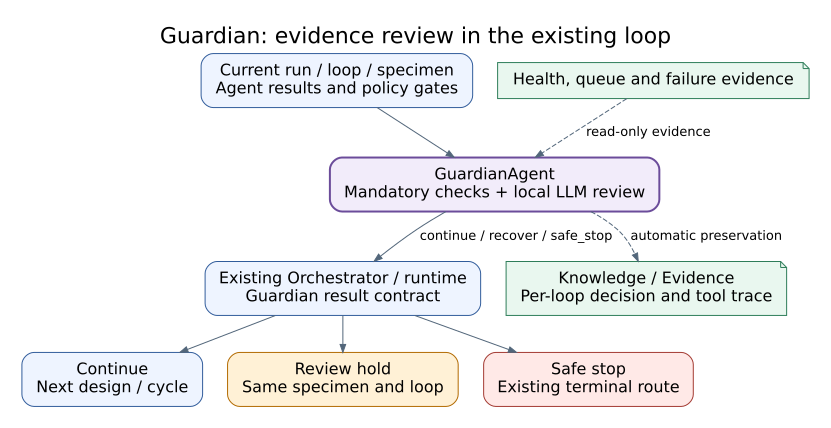
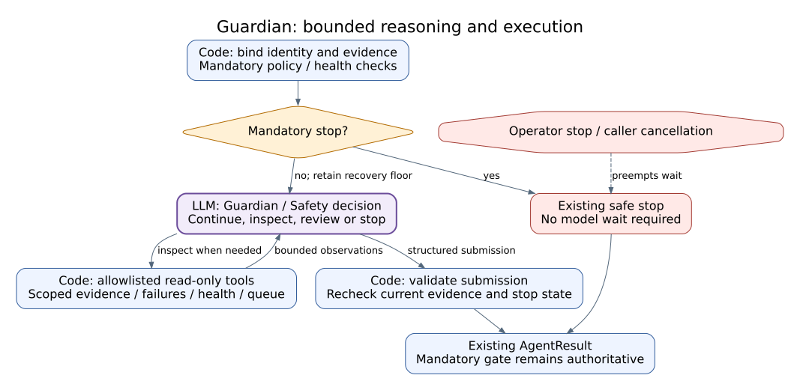

# Guardian Agent Reference

## Summary

`GuardianAgent` is ATR's graph-wide safety review and continuation control
plane. It evaluates current gates and recent failures, incorporates device and
queue health, records risk/incident/approval evidence, and returns continue,
review, stop, or error state. Orchestrator translates that state into graph
routing; Guardian does not coordinate the full workflow or execute devices.

## Scope

Included are Guardian decisions, status aggregation, incidents, alerts, tool
records, approvals, corrective actions, safety budgets, and stop authority.
This Reference does not claim that control presence proves safety effectiveness.

## Source of Truth

- Agent: `agents/guardian_agent.py`
- Module: `graphs/modules/guardian/module.yaml`
- Policy: `policies/guardian_gate.py`
- State/API aggregation: `app/controller.py`, `app/main.py`

## Actual Role

| Does | Does not |
|---|---|
| Evaluate policy, risk, evidence, failures, and health | Replace equipment-specific physical interlocks |
| Return continue/review/stop/error decisions | Directly execute a device or recovery command |
| Produce incidents, alerts, records, and corrective actions | Own general workflow planning |
| Request or require operator approval | Resolve approval on behalf of the operator |
| Enforce safety budgets and stop authority | Prove generalized laboratory safety |

## Three-Level Control Classification

| Level | Guardian responsibility | Authority boundary |
|---|---|---|
| High-Level Control | Cross-level authority that returns continue, review, stop, or error for Orchestrator route translation | May block progression but does not own normal mission planning or silently resume a stopped run |
| Middle-Level Control | Evaluate stage evidence, policy, risk, failures, approvals, freshness, and safety budget; emit incidents, corrective actions, and decision contracts | Model review is advisory; unknown state never becomes allow through fallback |
| Low-Level Control | Reads `device.health` and `experiment.queue.status` and can request/block/stop bounded work | Device-specific hard interlocks, emergency behavior, command acknowledgement, and physical stop effectiveness remain bridge/hardware authority |

Guardian spans all three levels but does not collapse them. It may reject a
High-Level route, invalidate a Middle-Level completion claim, or require fresh
Low-Level status. It cannot replace hardware interlocks or treat a manual
Device Workspace action as automatic-loop completion.

## Closed-Loop Position and Handoffs

**Figure Guardian-1.** Run state, failures, health, approvals, risk, and safety
budget converge on a graph-wide continue/review/stop/error decision that the
Orchestrator translates into a route. This is an `inspection`-backed projection
of baseline `0b7627b`; it does not establish live safety effectiveness.

| Direction | Component | Contract/state | Purpose | Gate |
|---|---|---|---|---|
| In | All stages | current state, decisions, failures, evidence | graph-wide review | evidence completeness |
| In | Device/queue services | health/status | external readiness | stale/unavailable health remains explicit |
| In | Approval service | pending/resolved approvals | human authority | scope and expiry |
| Out | Orchestrator | Guardian decision/contract | route translation | decision schema |
| Out | Operator | incident, alert, approval, corrective action | review/intervention | operator authority |
| Out | Runtime | continue, review, stop, error | cycle or terminal route | safety budget/policy |

## Inputs and Outputs

Inputs include `OrchestratorState`, latest stage reports, device health, recent
failures, tool-call records, approval queue, experiment constraints, loop count,
safe-stop state, and evidence context.

Outputs include Guardian gate results/decisions/contracts, risk vectors,
incident and hardware-alert records, blocked tool-call records, corrective
actions, approval requests, safety-budget state, and a route decision consumed
by Orchestrator.

## Internal Execution

| Step | Kind | Consumes | Produces/decides | Failure boundary |
|---|---|---|---|---|
| `01_check_safety_gates` | internal | stage/risk/evidence/health | pass/block/review facts | unknown or failed gate is not allow |
| `02_review_recent_failures` | internal | errors/incidents/retries | failure context/corrective action | repeated/major failure escalates |
| `03_decide_continue_stop_error` | internal | gate + failure + budget | continue/stop/error/review | invalid decision routes to error/review |

**Figure Guardian-2.** Three manifest steps combine bounded health and queue
reads with deterministic policy, approval, failure, and safety-budget gates;
model review remains advisory. Guardian can block or stop downstream work but
has no direct device-action edge. This `inspection` figure describes internal
contract structure, not independently scheduled graph nodes.

### Execution trace details

| Condition | State and evidence read | Decision | Persisted evidence | Resume requirement |
|---|---|---|---|---|
| Known safe continuation | current reports, fresh health, valid approvals, available budget | continue | gate history and decision contract | Orchestrator translates only the recorded decision |
| Missing or expired approval | scoped request and validity window | review/wait | pending or expired approval state | new operator resolution bound to current action/run |
| Stale or unavailable health | last health timestamp and capability status | review/stop | degraded health and blocker | fresh bounded health evidence |
| Unknown external effect | command, timeout, device/proof mismatch | stop/review | incident, tool record, uncertainty state | independent device and proof inspection |
| Repeated or major failure | failure history, retry count, corrective actions | stop/error | incident and budget consumption | operator review and accepted corrective action |
| Exhausted safety budget | current budget and cycle context | stop/error | terminal budget decision | new governed run or explicitly authorized policy change |

Unknown state never becomes an allow decision through model fallback. Approval
resolution, incident notes, and corrective action may add evidence, but they do
not rewrite the original failure or gate history.

## API Surface

| Class | Method | Path/family | Handler/service | Effect | Notes |
|---|---|---|---|---|---|
| owned | GET | `/api/guardian/status` | Guardian status aggregation | read_only | current graph-wide report |
| owned | GET | `/api/runs/{run_id}/guardian/status` | run Guardian report | read_only | run-scoped evidence |
| operator | POST | `/api/guardian/incidents/{incident_id}/notes` | incident service | local_state | appends operator note |
| operator | POST | `/api/runs/{run_id}/guardian/incidents/{incident_id}/notes` | run incident service | local_state | run-scoped note |
| shared | GET/POST | `/api/runs/{run_id}/approvals*` | approval service | read_only/local_state/physical_possible | request/list/resolve |
| operator | POST | `/api/approvals/{approval_id}/approve`, `/api/approvals/{approval_id}/reject`, `/api/approvals/{approval_id}/revise` | compatibility approval service | local_state/physical_possible | explicit human resolution |

## Tools and Connections

| Tool/service | Registry/implementation | Boundary | Mode | Effect | Evidence |
|---|---|---|---|---|---|
| `device.health` | registered tool/bridge registry | in-process to device status | all | read_only | health snapshot |
| `experiment.queue.status` | experiment queue tool | in-process | all | read_only | queue status |
| LLM role | `guardian_review` | selected model backend | configured | model | advisory review metadata |
| Policy gate | `policies/guardian_gate.py` | deterministic/in-process | all | local_state | gate decision |
| Approval service | controller/API | human boundary | live/configured | physical_possible | request and resolution |

Guardian LLM work has the highest shared lease priority (`0`) relative to active
workflow (`10`), operator chat (`20`), and background reconciliation (`30`).

## State, Events, Artifacts, and Storage

Guardian state is stored in run metadata and events: gate history, contracts,
latest decision, incidents, alerts, tool-call records, approvals, corrective
actions, safety budgets, and handoff status. Run-scoped APIs provide status and
notes. A GUI card is a view over server state, not the source of authority.

## Modes and Fallbacks

Policy review applies to Test, Replay, Simulation, and Live with environment-
appropriate evidence. Test/simulation decisions do not validate Live safety.
Unavailable model advice cannot bypass deterministic policy. Unavailable
device health is degraded/uncertain state, not healthy state.

## Safety, Approval, and Effect Boundary

Guardian can block or stop downstream effects but does not operate equipment.
Approvals bind to action, run/cycle, parameters, device, scope, and validity;
approval resolution remains human/operator authority. Safety-budget exhaustion,
missing evidence, stale health, or unknown effect routes to review/stop/error.

## Errors and Recovery

| Failure | Result | Recovery | Prohibited action |
|---|---|---|---|
| Missing/stale health | uncertain/review | refresh bounded health evidence | assume healthy |
| Policy/schema failure | block/error | correct input and re-evaluate | bypass gate |
| Pending/expired approval | wait/review | obtain current scoped decision | reuse stale approval |
| Repeated major incident | stop/error | operator review and corrective action | unbounded retry |
| Unknown external effect | stop/review | independently inspect state/proof | automatic allow/repeat |

## Operator and GUI Surfaces

In the 2026-09-06 working-tree update, `decision=continue` with `action=recover`
or `action=retry` is a review hold, not a completed experiment. The runtime stays
at Guardian, preserves the specimen and loop number, sets `is_paused`, and
publishes `guardian_recovery_wait` plus an `operator_input_required` event. The
Live planning tail remains alive while waiting and honors stop controls.
Normal continuation still follows the configured next-cycle route; safe stop
still terminates. Resume only re-evaluates Guardian: it does not clear alarms,
waive physical interlocks, restart fabrication, or implement a recovery action.
Unresolved pressure causes another hold. Operators must reconcile the cause
and evidence before proceeding; this is not an automatic stage-retry workflow.

Live GUI exposes Guardian report, risk, incidents, approvals, tool records,
hardware alerts, corrective actions, and budget state. Approval panels resolve
server-side requests. Incident-note APIs append operator context without
rewriting the original incident.

## Current Verification

The 2026-09-07 working-tree correction preserves unavailable-link diagnostics
from Equipment transitions explicitly marked `phase: vision`,
`kind: vision_observation`, and `blocking: false` as warnings. It does not
downgrade required vision gates, explicit blocking severity, physical failures,
or stop requests. Unit regressions cover both the optional observation and
mandatory/safety cases. Read-only re-evaluation of the Equipment result from
`run-20260906T151117Z-8690f9` allows progression with warnings; this is a policy
re-evaluation, not proof that the paused live run resumed. Original gate records
remain historical evidence and must not be rewritten as successful execution.

The UTM2 correction also applies same-capture recovery handling to both
`observation.utm_clear_verification` and `utm_verification_2.record.evidence`,
in addition to the existing UTM1 `observation.raw_capture` path. Only earlier
`ROS_IMAGE_TIMEOUT` attempts are superseded, and only when that capture and its
final, matching-topic frame read succeed. Failed final reads, unrelated captures,
and non-timeout safety failures remain blocking; source evidence is unchanged.
Read-only re-evaluation of the complete Vision result from
`run-20260906T152525Z-11e1ae` returns `allow` after this correction. The original
live run paused at Guardian and was not resumed; this is not an Analysis/BO or
full-cycle success claim.

Verified against `GuardianAgent`, all three module internal steps, two declared
tools, policy gate, status aggregation, incident and approval endpoints at
baseline `0b7627b`. No paper-scoped live safety-effectiveness record exists.

## Limitations and Known Gaps

Hazard coverage, calibration, operator workload, adversarial robustness, and
physical stop latency are not established by this Reference. Domain interlocks
remain external requirements.

## Related Documents

- [Agent Matrix](agent_api_connection_matrix.md)
- [Orchestrator Agent](orchestrator_agent.md)
- [Three-Level Control Model](../runtime/three_level_control_model.md)
- [Safety, Ethics, and Limitations](../paper/08_safety_ethics_and_limitations.md)
- [Guardian Graph-wide Safety](../runtime/guardian_graphwide_safety.md)
- [Security Policy](../../SECURITY.md)
