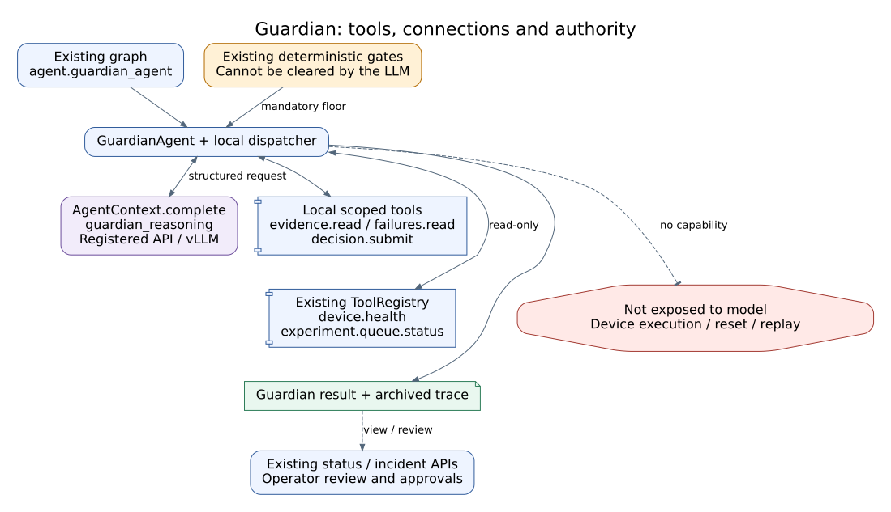

# Guardian Agent Reference

## Status at a Glance

- Runtime status: Implemented; two-cycle virtual controller regression passed
- LLM decision layer: Implemented; registered API and local vLLM verified
- Physical effect: No direct actuation; can block downstream progression
- Primary handoff: `AgentResult.data.guardian` → existing Orchestrator/runtime
- Live hardware validation: Not performed in this revision
- Known gap: Software decision validation does not establish physical stop effectiveness

## Overview and Responsibilities

Guardian reviews whether the evidence for the current work supports progression.
It combines existing mandatory checks with a bounded local model decision, rather
than using a model only to explain an already selected action. It can inspect
evidence, request operator review, or request safe stop. It does not own the
experiment plan, equipment procedures, or automatic recovery.

### Five-Area Responsibility Map

| Area | Guardian responsibility | Boundary / detail |
|---|---|---|
| High-Level Control | Return progression, hold or stop to Orchestrator | Existing routing; [handoffs](#closed-loop-position-and-handoffs) |
| Middle-Level Control | Normalize evidence and validate bounded tool requests | No arbitrary execution; [workflow](#internal-workflow) |
| Low-Level Control | Execute existing health, queue and record reads | No device command; [connections](#tools-apis-and-connections) |
| Guardian / Safety | Model-owned evidence review alongside authoritative code checks | No model override of mandatory gates; [safety](#safety-and-recovery) |
| Knowledge / Evidence | Preserve decision, observation and source identity | Existing per-loop archive; [artifacts](#artifacts-and-verification) |

These are responsibility areas, not five sequential model calls. The model's
decision belongs primarily to Guardian/Safety; it is not a new High-Level planner.

## Closed-Loop Position and Handoffs


**Figure Guardian-1.** Code-level handoff architecture. Solid arrows are the
existing task/result path; dashed arrows are evidence and storage connections.
Physical safety effectiveness is not inferred from this architecture figure.

| Direction | Producer / consumer | Contract and purpose |
|---|---|---|
| In | Runtime | Current run, loop, specimen, mode, operator stop and stage |
| In | Specialist agents | Current results, observations, failures and gate evidence |
| In | Existing status services | Device health and execution queue observations |
| Out | Orchestrator/runtime | `guardian.decision`, `action`, `reason` and existing validation fields |
| Out | Operator | Existing review hold, incident and approval surfaces |
| Out | Archive / Knowledge | Decision and tool observations, with current execution identity |

Graph-wide pre/post/action gates remain in `policies/guardian_gate.py`. The
GuardianAgent node performs its own evidence review at the existing entrypoint;
this revision does not add an LLM call at every graph gate or polling tick.

## Internal Workflow


**Figure Guardian-2.** Mandatory checks precede the normal-path local model
decision. Additional reads return observations to the model; final output is
checked again against current state. This depicts logical responsibilities,
not additional independently scheduled graph nodes.

| Phase | Owner | Result |
|---|---|---|
| Intake | Code | Current identity, existing design/health/gate/consistency checks |
| Mandatory boundary | Code | Existing stop/recover/retry constraints; stopped work does not wait for a model |
| Evidence review | LLM | Select a permitted read or submit a supported decision |
| Read execution | Code | Validated scoped observation returned to the same decision loop |
| Final validation | Code | Schema, evidence references, current identity/state and stop checks |
| Return and preservation | Runtime/archive | Existing route plus per-attempt evidence |

## Decision and Evaluation

**Decision question:** Does the current evidence support progression, and if
not, which observation or operator review is required?

| Evidence | Model responsibility | Code-owned constraint |
|---|---|---|
| Current reports and observations | Interpret agreement or unresolved conflict | Identity and mandatory result gates |
| Health and queue state | Decide whether further status inspection is needed | Read-only, code-bound tool arguments |
| Failure history | Interpret relevance to the current work | Historical records are not current completion proof |
| Missing or failed observations | Identify unresolved evidence and review need | Failure cannot silently become allow |
| Existing gate decisions | Explain required intervention | Model cannot clear or weaken a gate |

The model does not calculate a new subjective safety score or choose physical
recovery commands. Its actual authority is to request evidence and select a
permitted disposition within the deterministic policy boundary.

The prompt supplies a current-state summary, allowed argument schemas, observed
evidence IDs, prior tool observations and remaining turns. It requires exactly
`tool` and `arguments` at the top level; a concise reason belongs only in the
submission arguments. The model should submit once evidence is sufficient and
use review when the final turn still has unresolved evidence. Identity-only or
historical-only references cannot support continuation.

| Model disposition | Existing return | Runtime effect |
|---|---|---|
| `continue` | `decision=continue`, `action=continue` | Existing next-cycle route, when mandatory checks permit |
| `review` | `decision=continue`, `action=recover` | Existing `guardian_recovery_wait` hold |
| `safe_stop` | `decision=stop`, `action=safe_stop` | Existing terminal route |

Existing mandatory `recover`, `retry`, and `safe_stop` decisions remain a floor.
In particular, `continue/recover` means hold for review, **not** permission to
automatically execute recovery or repeat an already completed task.

## Tools, APIs and Connections



**Figure Guardian-3.** Existing registered model and status services surround an
agent-local allowlisted dispatcher. The barred edge marks operations that are
not available to the model. No new device bridge or PLC connection is added.

Requests use a JSON object with `tool` and `arguments`. The `guardian.*` names
are agent-local capabilities, not new public HTTP endpoints or arbitrary
global registry access.

| Tool | Input / output | Implementation / effect |
|---|---|---|
| `guardian.evidence.read` | `section`: identity, baseline, design, health, graph_gates, consistency, observations, retries | Local scoped snapshot read |
| `guardian.failures.read` | `limit`: integer 1–10 → labelled failure records | Existing failure memory read |
| `device.health` | Model arguments `{}`; code composes mode and selected-printer parameters | Existing registered status tool; read-only |
| `experiment.queue.status` | Model arguments `{}`; code binds request identity | Shared queue status; not specimen-completion proof unless response identity matches |
| `guardian.decision.submit` | `action`, concise `reason`, nonempty `evidence_refs` → checked disposition | Local decision; no device execution |

```json
{
  "tool": "guardian.decision.submit",
  "arguments": {
    "action": "review",
    "reason": "Current evidence requires operator reconciliation.",
    "evidence_refs": ["baseline:action"]
  }
}
```

The reference in this example must actually have been supplied by the dispatcher.
Model-generated paths or evidence identifiers are not independently trusted.

| API / connection | Ownership | Effect |
|---|---|---|
| GET `/api/guardian/status` | Existing status aggregation | Read current report |
| GET `/api/runs/{run_id}/guardian/status` | Existing run status aggregation | Read run-scoped report |
| POST `/api/guardian/incidents/{incident_id}/notes` | Existing operator interface | Append incident note |
| POST `/api/runs/{run_id}/guardian/incidents/{incident_id}/notes` | Existing run operator interface | Append run-scoped note |
| GET/POST `/api/runs/{run_id}/approvals*` | Existing shared approval service | Inspect or resolve operator authorization |
| POST `/api/approvals/{approval_id}/approve`, `/reject`, `/revise` | Existing compatibility API | Explicit operator action, never model authority |
| `AgentContext.complete("guardian_reasoning", ...)` | Existing configured model router | API/local inference; Guardian shared lease priority remains 0 |

## Configuration and Operation

Guardian-specific decision settings belong to `run_metadata.guardian_settings`.
They apply to an invocation, not a new global backend configuration or device
policy. Registered model routes and API credentials remain owned by the
existing runtime configuration. Validation uses isolated contexts and does not
change the active GUI model or start/stop local model servers.

| Setting | Default | Accepted range / meaning |
|---|---|---|
| `max_turns` | 6 | Integer 1–12, including decision submission |
| `max_duplicate_requests` | 1 | Integer 0–12, permitted repeated requests |
| `call_timeout_s` | 120 | Positive finite seconds, at most 600 per model/status call |
| `total_timeout_s` | 300 | Positive finite seconds, at most 600 for the decision loop |

The initial health read precedes the decision-loop budget. Cancelling a wrapped
read releases the agent wait; it cannot forcibly terminate an already running
synchronous status request. No actuation is available through these reads.
Explicit deterministic test mode records `llm_used=false`; it is not counted as
model verification. The additive result uses `guardian_evidence_decision.v1`.

The installed-printer status query retains its existing mode/profile/transport
arguments. Test mode is not assumed to mean that every configured device is
virtual; physical execution remains owned by the existing stage and bridge.

## Safety and Recovery

| Condition | Enforced response | Resume requirement |
|---|---|---|
| Operator stop or mandatory safe stop | Existing stop route, without waiting for model judgment | Existing operator/runtime policy |
| Existing recovery/retry requirement | Retain mandatory hold even if model requests continue | Existing evidence and approval conditions |
| Unknown/failed observation | Explicit degraded evidence; no implicit healthy result | Valid observation or operator review |
| Invalid request, output or budget expiry | Review hold | New valid decision under the current state |
| Evidence or identity changes during inference | Do not apply an old approval to new work | Re-evaluate current evidence |
| Caller cancellation | Propagate cancellation and cancel pending model work | Caller-owned lifecycle |

No model tool resets equipment, acknowledges an alarm, changes an interlock,
approves on behalf of an operator, restarts a stage or replays a robot motion.
The existing recovery hold preserves the current specimen and loop number.
Resuming review does not itself prove that the underlying issue was resolved.

## Artifacts and Verification

| Artifact | Producer / consumer | Storage and identity |
|---|---|---|
| Guardian input/result | Agent archive / runtime, reviewer | Existing run/loop/agent/attempt directory |
| Decision and tool trace | Local dispatcher / reviewer, Knowledge | Attached to Guardian result and existing tool archive |
| Gates, incidents and approvals | Existing policies/services / operator | Existing run metadata and events |
| Model verification receipt | Opt-in validation script / developer | `artifacts/validation/guardian-evidence-decision-*/results.json` |

`scripts/verify_guardian_decisions.py --execute` uses only virtual health and
queue registrations with actual registered model calls. Its receipts distinguish
requested and actual model/backend, tool calls, decisions and elapsed time.
The runtime probe exercises the production Guardian node and existing
next-cycle handoff; it is not an all-agent hardware demonstration.

### Verified on 2026-09-11

| Check | Result | Evidence boundary |
|---|---|---|
| Guardian, gates, shield, fault matrix, runtime lifecycle, harness and documentation unit tests | 158 passed in 2.67 s | Final unit suite; five preexisting Pydantic warnings |
| Full virtual controller | Two cycles completed; all nine specialist agent results archived per loop | Real graph/agents; virtual model/acquisition boundaries; network/native-process tripwires enabled |
| Combined regression including the virtual controller | 159 passed in 65.58 s | Final pre-publication run, including contradictory-health coverage; 59 existing warnings |
| Registered GPT API | 5/5 cases passed | Requested `gpt-5.5`; provider returned `gpt-5.5-2026-04-23` |
| Registered local vLLM | 5/5 cases passed | Requested and provider-returned `gemma4:31b` |
| Independent code review | No remaining critical/important findings | Reviewed bounded authority, health compatibility, malformed evidence and probe assertions |
| Changed Guardian documentation | Validation passed; three figures rendered and inspected | Repository-wide validator still reports preexisting Windows bridge and old PLC design errors |
| Physical hardware | Not run | No device actuation or PLC integration in this revision |

| Model scenario | GPT API elapsed | Local Gemma elapsed | Checked outcome |
|---|---|---|---|
| Normal evidence | 5.551 s | 14.752 s | Model-supported continue |
| Requested queue lookup | 8.864 s | 9.377 s | Model selected the read, then submitted continue |
| Conflicting evidence | 5.017 s | 17.639 s | Model itself selected review, not merely a code-forced hold |
| Preexisting hard stop | 0.012 s | 0.013 s | Stop returned without calling either model |
| Existing runtime handoff | 5.082 s | 16.675 s | Guardian → Design, loop increment, no review pause |

These are single-run elapsed observations, not latency guarantees. Model receipts
are in `artifacts/validation/guardian-evidence-decision-lzse61pz/results.json`;
unit and combined logs are `unit-final.txt` and `regression-final.txt` under
`artifacts/validation/guardian-evidence-decision-docs/`. These local validation
artifacts are separate from operational knowledge and are not Git-published;
this reference preserves the reviewable summary. Intermediate failed probes
remain in their separate validation directories.

The probe validates router identity and the provider-returned model ID; only the
explicit GPT snapshot alias above is accepted. A missing response, another model,
malformed decision, or a deterministic hold masking an incorrect model decision
cannot count as successful model verification.

Source: [approved design](../superpowers/specs/2026-09-11-guardian-evidence-decision-design.md),
[implementation plan](../superpowers/plans/2026-09-11-guardian-evidence-decision.md),
[graph-wide safety reference](../runtime/guardian_graphwide_safety.md), and
[loop artifact contract](../runtime/loop_artifact_archiving.md).
