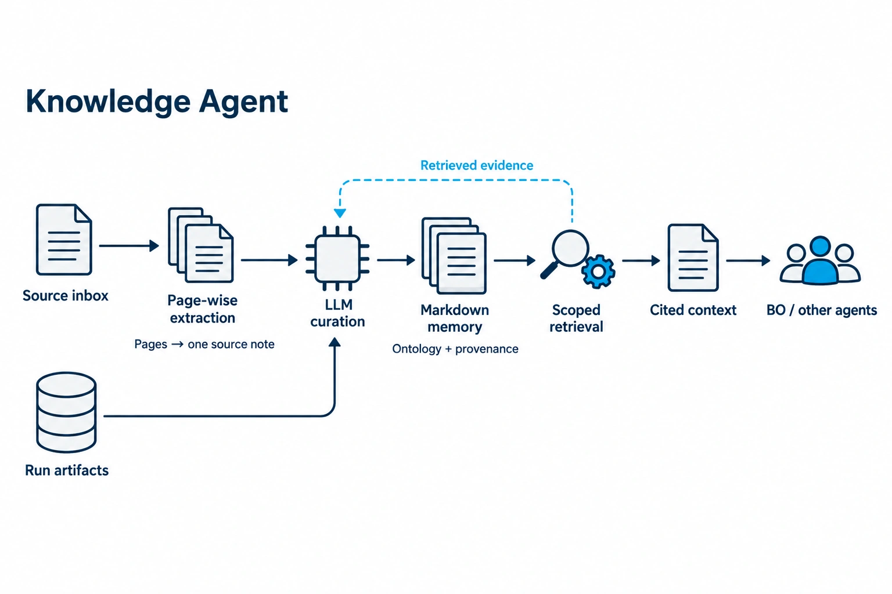

<!-- atr-doc
doc_type: reference
subtype: system
status: active
authority: descriptive
audience: [researcher, reviewer, developer, operator, maintainer]
scope: [agents, knowledge, ontology, markdown_memory, scoped_rag, self_evolution, source_curation]
summary: Ontology-guided Markdown knowledge, source-backed LLM curation, scoped retrieval and preserved research-memory contracts.
source_of_truth:
  - agents/knowledge_agent.py
  - agents/knowledge_decision.py
  - knowledge/markdown_memory.py
  - knowledge/markdown_runtime.py
  - knowledge/http_api.py
  - knowledge/source_library.py
  - knowledge/source_extraction.py
  - knowledge/source_runtime.py
  - knowledge/source_api.py
  - agents/source_curation.py
  - mcp_tools/source_tools.py
  - knowledge/ontology
  - utils/agent_artifact_archive.py
  - graphs/modules/knowledge/module.yaml
last_verified: 2026-09-11
verified_against: working-tree-2026-09-11
related_docs:
  - docs/agents/README.md
  - docs/agents/agent_api_connection_matrix.md
  - docs/knowledge/markdown_memory_operations.ko.md
  - docs/knowledge/manual_rag_knowledge.ko.md
  - docs/superpowers/specs/2026-09-11-source-curation-design.md
  - docs/agents/knowledge_agent_self_evolution_runtime_guideline.md
  - docs/superpowers/specs/2026-09-10-knowledge-markdown-memory-design.md
  - docs/superpowers/specs/2026-09-07-five-area-agent-restructuring-contract-design.md
supersedes: []
-->

# Knowledge Agent Reference



*Role overview; detailed execution and connection diagrams follow below.*

## Status at a Glance

- Runtime status: Implemented — source curation, ontology-guided Markdown memory and typed records
- LLM decision layer: Implemented / API and local vLLM verified
- Physical effect: None
- Primary handoff: `knowledge_context.v1` → BO and downstream context consumers
- Live hardware validation: Not applicable to Knowledge; no new physical validation claimed
- Known gap: Image-only sources need usable text; retrieval benefit has no held-out comparative benchmark

## Overview and Responsibilities

Knowledge turns execution evidence into reusable, source-backed context. Its
LLM decides what is worth retaining, how to classify it, which scoped records
to read, and whether evidence supports a useful handoff. Numerical observations
remain Analysis-owned; Knowledge does not reconstruct or optimize their values.

| Owned by Knowledge | Preserved outside its authority |
|---|---|
| Markdown knowledge, ontology-guided classification and scoped retrieval | Core ontology definitions and experimental settings |
| Source citations, evidence status and append-only note revisions | Original logs, artifacts, metrics and objective evaluations |
| Typed memory, patterns, performance and Evolution evidence packs | BO candidate generation and device execution |
| Local decision/tool trace and explicit evidence gaps | Orchestrator stage transitions and Evolution activation |

The active Knowledge Graph, Neo4j synchronization, Graphify import and relation
reconciliation paths are retired. Ontology classes and relation definitions are
still present: a vocabulary is not an instantiated knowledge graph. Existing
historical graph files and offline utilities are left untouched.

### Five-Area Responsibility Map

These are responsibility areas, not five new runtime stages.

| Area | Responsibility | Authority boundary |
|---|---|---|
| High-Level Control | LLM judges reusable knowledge, relevant scope-bound evidence and qualified publication | Does not alter measurements, objectives or global routing |
| Middle-Level Control | Collect evidence; run the bounded tool loop; assemble existing records and context | Tool validation and output assembly remain code-owned |
| Low-Level Control | Atomic Markdown revisions, search/detail reads, JSONL and local audit append | No device tool, graph backend or model-server startup |
| Guardian / Safety | Validate identity, ontology, sources, scope, lifecycle and tool arguments | Reject unsupported writes or scope expansion; preserve raw evidence |
| Knowledge / Evidence | Keep sources, applicability, observation/interpretation distinction and tool trace | Derived notes are not new measurements or causal proof |

## Closed-Loop Position and Handoffs


**Figure Knowledge-1.** Code-inspection architecture view, 2026-09-11. The normal
stage remains Analysis → Knowledge → BO. Terminal archive intake is a separate,
deterministic preservation hook and cannot replay an agent.

| Direction | Input/output | Existing owner or consumer |
|---|---|---|
| In | Analysis objective, uncertainty, metrics, evaluation and artifact references | Analysis |
| In | Terminal completed/failed/cancelled execution manifest and result | Existing agent archive wrapper |
| In | Markdown candidates, project chunks and published source notes | Scoped retrieval with independent source scope |
| Out | `knowledge_context.v1`: summary, scope, selected records, citations, decision | BO and context consumers |
| Out | `knowledge_report.v1`, typed memory/pattern/performance records | Reports, workspace and local memory |
| Out | `evolution_proposal.v1` and evidence packs | Existing operator-reviewed Evolution path |

## Internal Workflow

1. Persist a copy of current Analysis intake before any LLM call.
2. Freeze source identities and caller scope; expose only evidence inspection initially.
3. Let the LLM inspect, search, read, classify/write, and publish using agent-local tools.
4. Preserve existing numerical memory, provenance, patterns and performance records.
5. Build existing BO/Evolution context and append a local ontology-validated audit event.
6. Save the decision/report; the original archive wrapper preserves the terminal result.


**Figure Knowledge-2.** The LLM selects semantic actions; deterministic code owns
their validation and storage effects. The separate archive hook records observed
execution outcomes even if a run never reaches the Knowledge stage.

### Decision and Prompt Contract

The normal path calls `ctx.complete("knowledge_query", ...)` through ATR's
registered API or local vLLM routing. Every response is one JSON object:

```json
{"tool": "search_knowledge", "arguments": {"query": "export validation", "scope": {"agent_id": "equipment_agent"}, "top_k": 6}}
```

The prompt supplies the goal, run/cycle identity, allowed ontology classes,
allowed corpus/scope, phase-specific tool schemas and actual previous tool
observations. It asks for reusable evidence rather than general commentary:

| Prompt requirement | Enforced effect |
|---|---|
| Inspect before deciding | Only inspection is offered in the initial phase |
| Search excerpts, then read selected records | Unread search IDs cannot be cited |
| Narrow scope without replacing conditions | The same validated filters govern search and detail |
| Distinguish observation, derived interpretation and hypothesis | LLM writes cannot claim `evidence_kind=observed` |
| Reuse existing evidence instead of repeated writes | At most one curated note per decision |
| State insufficient or conflicting evidence explicitly | Publication without a note requires a reason |
| Keep scientific data and command ownership unchanged | No numeric-edit, ontology-edit or device tool exists |

This is a bounded decision layer, not an LLM implementation of file I/O or a
replacement for Analysis/BO. It can withhold new knowledge when evidence is
insufficient. A failed decision is reported as unsuccessful rather than
presented as successful model reasoning.

### Agent-Local Tools

| Tool | Input | Effect and receipt |
|---|---|---|
| `inspect_evidence` | Empty arguments | Read frozen current source identities and content |
| `search_knowledge` | Query, optional narrower scope, top_k, corpus | Ranked metadata/excerpts; no full bodies |
| `read_knowledge` | ID previously returned by search | Read full selected record within the same scope |
| `write_knowledge_note` | Title/body, ontology class, source IDs, kind, tags | Validated atomic Markdown revision receipt |
| `publish_context` | Summary, source IDs, explicit no-note reason when applicable | Accepted cited context or evidence-gap report |

These tools are dispatched inside Knowledge; the module does not register new
bridge commands. Project documents and the curated source library are separate
corpora. `source_scope` filters source material independently of run-specific memory.

### Source Intake and Curation

The existing source folder is a general Knowledge inbox. After an operator enables
automatic intake in the workspace, stable additions and changed contents are
processed outside the experiment stage. Original inputs remain unchanged.

| Step | Owner | Durable result |
|---|---|---|
| Detect stable changes | Local watcher and content hashing | Content-addressed source identity; duplicate path aliases |
| Extract complete source text | Local extraction | `source.md`, individual page files, page-aware blocks and preserved original |
| Inspect and organize | Registered Knowledge LLM | Page-level findings, bounded consolidation and classification/tool trace |
| Validate and publish | Source library | One categorized Markdown document per original source, with ontology and page/block citations |
| Retrieve and apply | Existing agent decision layers | Scoped reference context; unchanged commands and numerical values |

The model reads paginated inputs page-by-page, using smaller blocks within an
unusually long page. Grounded intermediate findings are consolidated into one
final Markdown document; they are not published as separate retrieval entries.
Long-source consolidation is bounded rather than replaying all page text in
every prompt. The model receives the publication schema, valid ontology labels,
available tools and current evidence. It must inspect every block, preserve
units and qualifications, and distinguish source-reported evidence from its
interpretation. Full extracted text is retained separately from the curated
document, with page provenance intact.

The curation prompt exposes one phase-specific schema. Page and intermediate
drafts use compact findings with explicit size budgets; validation feedback
requests a corrected tool payload without repeating successful work. Code
unions page/block provenance across draft revisions and merges. Final output
separates source findings, applicability and evidence limits; original text
remains available for details omitted from the concise note.

Each page draft is cumulative: later content adds to prior findings instead of
replacing them. Quantitative results, units, configurations and qualifications
take priority over background and future-work descriptions. Consolidation must
cover substantive findings from every input and distinguish primary findings
from quoted or appendix material. Reference lists establish provenance, not
proof that a referenced component is used by the described system.

Publication audits retain each tool event with source/page identifiers, content
hashes and durable stage receipts instead of repeating complete page bodies.
Consolidation receives only its current ordered inputs; unrelated page drafts
cannot become extra merge inputs.

Only current, ready sources participate in default retrieval. A changed file has
a new identity; duplicate contents share one publication. Removing an input makes
its old path version ineligible without deleting its audit artifacts. Failed or
unreadable sources remain visible for review/retry, never partial success.

Source intake uses the existing registered inference policy and shared low-priority
lease. It does not start a model, and defers when the selected model is unavailable.
An in-flight model call is not preempted; active workflow calls receive priority at
the next lease boundary. Disabling intake prevents new source jobs.

Other agents share read-only `knowledge.sources.search` and
`knowledge.sources.read`. Knowledge includes selected source notes/citations in
its existing BO handoff. Equipment receives relevant source context at its
existing workflow decision boundary; the configured workflow and bounded
execution proposals remain code-owned. Legacy manual-specific automatic context
attachments and active endpoints are retired, while historical files remain.

## Storage, Scope and Lifecycle

```text
memory/knowledge/markdown/
  <run_id>/<cycle_id>/<agent_id>/<record_id>/revision-000001.md
memory/knowledge/markdown_jobs/<job_id>.json
memory/knowledge/source_library/                source snapshots, blocks, curated notes and settings
memory/knowledge/*.jsonl                         existing typed memory
runs/<run_id>/knowledge/intake_<loop>_<hash>.json pre-LLM immutable source snapshot
runs/<run_id>/knowledge/knowledge_decision.json   current full tool trace
runs/<run_id>/knowledge/knowledge_report.json     current report
runs/<run_id>/runtime/loops/<loop>/<agent>/<attempt>/
  manifest.json, result.json, files/...          existing per-attempt archive
```

Current per-run report aliases remain compatible. The archive wrapper snapshots
each execution separately; Markdown identity also includes run, cycle, agent and
event, so a similar failure in a later cycle is retained independently.

| Field | Meaning |
|---|---|
| run_id / cycle_id / agent_id / event_id | Stable event identity; retries deduplicate |
| ontology_type / ontology_version | Existing ontology vocabulary and version |
| source_refs | Traceable original evidence locations |
| evidence_kind | `observed`, `derived`, or `hypothesis` |
| fidelity | `measured`, `simulated`, `virtual`, or `unknown`; not inferred from test mode |
| tags / applicability | Search classification and exact experimental conditions |
| status / revision / content_hash | Lifecycle and immutable content lineage |

Search filters are conjunctive. Scalar/list fields allow exact run, cycle,
agent, ontology type, fidelity and status selection; tags require every listed
tag and applicability requires every specified key/value. Explicit empty lists
match nothing. Unknown filters are rejected. Default status is `valid`.

Lifecycle supports `valid`, `needs_review`, and `superseded`. Status changes
require a reason and create a new revision. Supersession requires a distinct
valid replacement with matching ontology class and applicability. Producer
retries do not reactivate reviewed/superseded records. Invalid newest revisions
quarantine the record instead of exposing an older valid version.

The in-memory index is rebuildable from Markdown and refreshes changed files
incrementally. It is not an external vector database. Historical archive intake
is an explicit, bounded background job, not a startup scan or a new agent run.

## Tools, APIs and Connections


**Figure Knowledge-3.** Existing FastAPI/workspace entry points reach local
Knowledge stores. Registered inference serves the agent decision and separate
source curation layers; deterministic terminal-history intake does not invoke it.

| Surface | Method / path | Contract |
|---|---|---|
| Status | GET `/api/knowledge/status` | Markdown count/index state; graph explicitly retired |
| Query | POST `/api/knowledge/markdown/query` | `{query, scope, top_k}` → candidate excerpts |
| Detail | POST `/api/knowledge/markdown/read` | `{record_id, scope}` → scoped record, or 404 |
| Default detail | GET `/api/knowledge/markdown/{record_id}` | Valid record only |
| Lifecycle | POST `/api/knowledge/markdown/{record_id}/status` | Status/reason/replacement → immutable receipt |
| History intake | POST `/api/knowledge/markdown/intake` | Run, limit, cursor → queued job |
| Intake progress | GET `/api/knowledge/markdown/intake/{job_id}` | Persisted state and per-file results |
| Preserved | `/api/knowledge/ontology*`, `/activity`, typed memory/context/Evolution APIs | Existing vocabulary and evidence contracts |
| Source status/settings | GET `/api/knowledge/sources/status`, POST `/settings` | Watcher progress and saved explicit enablement |
| Source scan/retry | POST `/api/knowledge/sources/scan`, `/retry` | Discover or schedule unfinished work; no inference in the HTTP request |
| Source retrieval/detail | POST `/api/knowledge/sources/query`, `/read` | Scoped notes and original source provenance |
| Retired | `/graph*`, `/graphify*`, `/relations*`, `/manuals/*` | HTTP 410; no graph/manual factory or worker |

The Knowledge workspace replaces graph-specific tabs with Markdown search and
detail. Memory and Ontology remain; Source Library replaces the old manual tab in
place. It provides enablement, scan/retry, background progress, filters and
full note/source detail. The main dashboard links the same
`/knowledge` route and reads Markdown status.

## Safety, Modes and Recovery

- Original Analysis numbers and objective lineage are copied, not LLM-generated.
- Terminal archive intake is idempotent, has no device/model tool, and records
  cancellation separately from evidence of equipment failure.
- Markdown persistence is local and append-only; an intake error does not replace
  the original agent outcome.
- Normal operation requires a valid model decision. Explicit offline verification
  uses the same tool dispatcher but is labeled `llm_used=false`.
- `knowledge_settings` in run metadata accepts scope, independent `source_scope`, corpora,
  `decision_call_timeout_s` (default 300) and `decision_max_steps` (default 8).
  Core experimental settings and bridges are unchanged.
- Evolution proposals remain recommendations; approval and activation retain
  their existing owners.

## Artifacts and Verification

The 2026-09-11 source-curation matrix passed on both registered providers:

| Actual provider | Valid source → one curated MD | Unreadable input rejected | Scoped Knowledge → BO / Equipment reuse | Nine-page source curation |
|---|---|---|---|---|
| API `gpt-5.5` | 8 / 8 | Pass, before inference | 3 / 3 each | 192.509 s · 26 model calls |
| Registered vLLM `gemma4:31b` | 8 / 8 | Pass, before inference | 3 / 3 each | 936.237 s · 25 model calls |

Both providers discovered all inputs, deduplicated identical content, retained
complete extracted page files, and published one final note per source. Consumer
checks preserved source values, units, qualifications and late-section evidence.
Elapsed times cover complete multi-call source processing, not single inference
latency; the parallel two-provider matrix completed in 1301.396 s.

Validation evidence is kept in a separate external validation directory, not in
this repository or operational knowledge stores. The matrix's aggregate report
survived its original automatic cleanup; intermediate model responses and notes
from that run were not retained. The probe now supports `--artifacts-dir` to
preserve complete isolated workspaces on success or failure. See
[Source Library Operations](../knowledge/manual_rag_knowledge.ko.md#troubleshooting-and-verification)
for the reproduction command and retention boundary.

The 2026-09-11 focused regression run passed **278 tests** in **29.25 s**
(12 existing warnings). Coverage includes source extraction/curation, atomic
publication, page provenance, scoped consumers, external validation retention, background intake, retired
manual endpoints, preserved Knowledge/Equipment APIs and the nonactuating
two-cycle busy-FEM-boundary integration. This is a targeted set, not the entire
repository test suite.

Workspace QA used an isolated FastAPI fixture and existing Playwright Chromium
at 1440×1000 and 390×844. Page identity, meaningful content, filter → excerpt →
same-scope detail, invalid/no-match states, preserved tabs, source enablement,
pending/failed/retry states and original-text inspection passed. Out-of-order
query/detail responses did not replace newer selections. Console errors and
retired-endpoint requests were empty. The fixture was stopped after verification. Lifecycle mutation
remains API-only; the workspace displays and filters lifecycle status.

Eight changed governed documents passed their focused validation. The full
documentation manifest still reports pre-existing Windows bridge/PLC document
governance errors in files outside this change.

The earlier 2026-09-10 execution-memory decision verification remains applicable:

| Actual provider | Classified note | Scoped reuse | Insufficient evidence |
|---|---|---|---|
| API `gpt-5.5` | Pass · 16.876 s | Pass · 11.549 s | Pass · 5.295 s |
| Registered vLLM `gemma4:31b` | Pass · 27.746 s | Pass · 26.820 s | Pass · 11.214 s |

Times cover each complete multi-call decision. All six cases used real model
responses and actual temporary Markdown operations; original synthetic values
were unchanged. [Sanitized verification artifact](assets/verification/knowledge_decisions_2026-09-10.json)
records models, action sequences, note/citation counts and limits.
The executable provider probe is
[`verify_knowledge_decisions.py`](../../scripts/verify_knowledge_decisions.py).

Tests exercise real temporary Markdown files, scoped reads, lifecycle/retries,
archive preservation, retired legacy APIs, Knowledge/BO handoff,
and the existing nonactuating two-cycle integration. Provider probes use
isolated reference evidence with empty device-tool registries and no model-server startup.
They do not establish retrieval quality, causal scientific benefit, or a new
physical closed-loop result.

## Related Documents

- [Markdown Knowledge Operations](../knowledge/markdown_memory_operations.ko.md)
- [Source Library Operations](../knowledge/manual_rag_knowledge.ko.md)
- [Source Intake and Curation Contract](../superpowers/specs/2026-09-11-source-curation-design.md)
- [Knowledge/Self-Evolution Guideline](knowledge_agent_self_evolution_runtime_guideline.md)
- [Agent Matrix](agent_api_connection_matrix.md)
- [Analysis](analysis_agent.md) · [BO](bo_agent.md)
