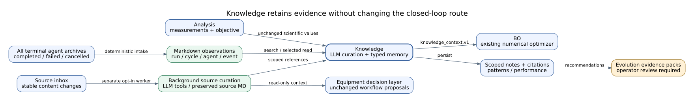
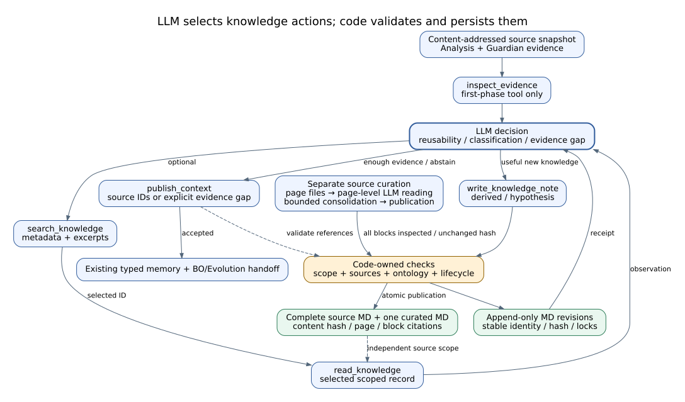
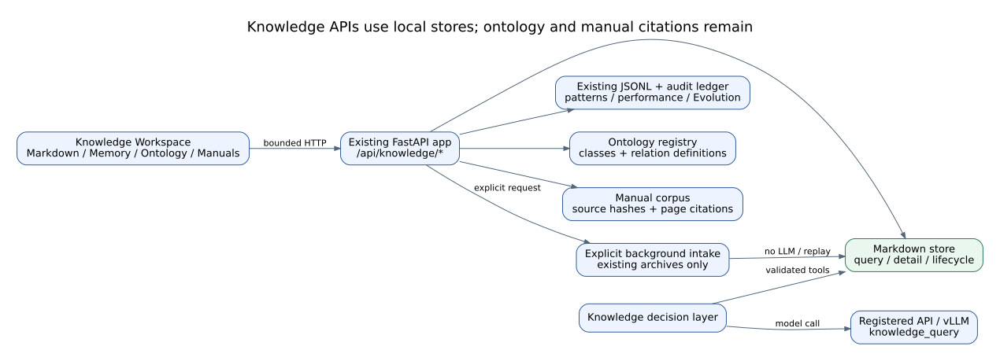

# Knowledge Agent Reference

## Summary

`KnowledgeAgent` owns the research-memory handoff: it collects accepted run
artifacts, normalizes provenance, ingests agent reports, writes experiment
knowledge and performance/pattern records, builds BO context, ranks potential
self-evolution targets, and emits evidence packs and reports. Knowledge service
contracts—not raw LLM output—control persistence and graph mutation.

## Scope

Included are local durable records, ontology validation, audit ledger, outbox,
graph synchronization/query, relation reconciliation/review, and evolution
recommendations. The agent does not activate evolution variants, issue raw
Cypher, or create graph facts without provenance.

## Source of Truth

Knowledge agent/module, service, ontology, ledger/outbox/repositories,
reconciliation service/store, route handlers, and Knowledge operations Guide.

## Actual Role

| Does | Does not |
|---|---|
| Collect and normalize accepted artifacts/provenance | Treat every model statement as a fact |
| Write typed knowledge, pattern, and performance records | Write directly to Neo4j outside service/receipt contracts |
| Build BO and safety/retrieval context | Issue unbounded/raw Cypher |
| Propose relation/evolution changes with evidence | Auto-activate evolution variants |
| Preserve degraded sync state and retryable outbox | Fabricate a graph receipt or discard failed records |

## Closed-Loop Position and Handoffs



**Figure Knowledge-1.** Accepted reports, artifacts, decisions, provenance, and
Analysis evidence become durable local records and bounded contexts for BO,
Design, Orchestrator, Guardian, and operator-reviewed Evolution work. This is
an `inspection`-backed projection of baseline `0b7627b`, not proof of graph
availability or knowledge quality.

| Direction | Component | Contract/state | Purpose | Gate |
|---|---|---|---|---|
| In | All completed agents | reports/artifacts/decisions | durable cycle record | accepted schema/provenance |
| In | Analysis | objective/metrics/evidence | trial context | input/output refs |
| In | Graph/reconciliation | receipts/proposals/decisions | graph maintenance | ontology/operator review |
| Out | BO | `bo_context`/trial history | next candidate | record completeness |
| Out | Design/Orchestrator/Guardian | retrieval/failure/safety context | next-cycle decisions | bounded query/provenance |
| Out | Evolution Lab | proposal/evidence pack | operator review | never direct activation |

## Inputs and Outputs

Input is `OrchestratorState` with stage reports, artifacts, decisions, failures,
metrics, analysis, run/cycle identity, and provenance. Declared outputs include
`knowledge_context.v1`, `evolution_proposal.v1`, `knowledge_report.v1`,
`experiment_knowledge_v1`, `agent_performance_v1`, `failure_pattern_v1`,
`success_pattern_v1`, and `evolution_evidence_pack_v1`.

Transition requires a knowledge record, non-empty `provenance.used`, performance
records for completed stages, BO context or explicit no-context reason, and
evolution evidence packs or explicit no-evolution reason.

The manifest conditions are preserved verbatim for drift checking:

```text
knowledge_record exists
provenance.used is non-empty
agent_performance_records exist for completed stages
bo_context exists or explicit no_bo_context_needed reason exists
evolution_evidence_packs exists or explicit no_evolution_needed reason exists
```

## Internal Execution

| Step ID | Work | Boundary/output |
|---|---|---|
| `01_collect_run_artifacts` | bounded artifact set | missing refs explicit |
| `02_normalize_provenance` | identity/source/use | invalid provenance blocks |
| `03_ingest_agent_reports` | typed report ingestion | schema rejection retained |
| `04_write_experiment_knowledge_record` | cycle record | durable service path |
| `05_update_failure_patterns` | failure aggregation | pattern record |
| `06_update_success_patterns` | success aggregation | pattern record |
| `07_update_agent_performance_ledger` | stage performance | typed records |
| `08_build_bo_context` | trials/constraints/evidence | BO context or reason |
| `09_rank_self_evolution_targets` | evidence-backed ranking | recommendation only |
| `10_build_evolution_evidence_packs` | bounded packs | review input |
| `11_emit_knowledge_report` | human/machine report | report schema |
| `12_emit_evolution_lab_prefill` | workspace prefill | no activation |



**Figure Knowledge-2.** Twelve internal entries, eight output contracts, and
five transition conditions separate provenance/schema gates, experiment
records, patterns, performance, BO context, evolution evidence, reports,
durable local state, outbox, and optional graph receipts. This `inspection`
figure groups contract steps and grants no automatic variant activation.

### Execution trace details

| Phase | State read | Validation/transformation | Durable output | Failure/degraded behavior |
|---|---|---|---|---|
| Collect | accepted stage reports, artifacts, decisions and run/cycle IDs | bound complete referenced set | collection record and explicit missing refs | unreferenced or rejected outputs are not promoted |
| Provenance/report ingest | producer, source, use and schema | normalize provenance and validate typed reports | ledger event and accepted report records | invalid provenance/schema blocks affected record |
| Experiment record | complete accepted cycle context | construct typed knowledge record | `experiment_knowledge_v1` | required record absence blocks transition |
| Patterns/performance | accepted results and failures | update typed success/failure patterns and stage performance | three typed record families | completed stages require performance or explicit defect |
| BO context | compatible trials, constraints and evidence | create bounded context or explicit no-context reason | `knowledge_context.v1`/BO context | absence reason is data, not an empty field |
| Evolution | evidence-backed performance/failure targets | rank targets and build packs or no-evolution reason | `evolution_proposal.v1` and evidence packs | recommendation never activates a variant |
| Report/prefill | complete output contract set | emit human/machine report and workspace prefill | `knowledge_report.v1` and prefill | transition waits for declared conditions |

## API Surface

| Class | Method | Path/family | Effect | Notes |
|---|---|---|---|---|
| owned | GET | `/api/knowledge/evolution-packs`, `/agent-performance`, `/failure-patterns`, `/success-patterns` | read_only | typed Knowledge outputs |
| connected | GET/POST | `/api/knowledge/evolution-outcomes` | read_only/local_state | records reviewed outcomes |
| operator | GET/POST | `/api/knowledge/relations/*` | read_only/local_state/model | status, scan, reconcile, proposals, decisions, approve/revise/reject/defer/re-evaluate |
| operator | POST | `/api/knowledge/graph/edit/validate`, `/graph/edit/apply` | local_state/external_service | existing-node bounded edits |
| connected | GET/POST | `/api/knowledge/graph/health`, `/graph/stats`, `/graph/sync`, `/graph/query`, `/graph/import` | read_only/local_state/external_service | bounded graph operations |
| connected | GET | `/api/knowledge/activity` | read_only | recent bounded Knowledge activity |
| connected | GET/POST | `/api/knowledge/ontology*` | read_only/local_state | registry and validation |
| operator | POST | `/api/knowledge/graphify/scan`, `/graphify/import` | local_state/external_service | controlled import path |
| owned/connected | GET | `/api/knowledge/run-context`, `/bo-context`, `/safety-context` | read_only | bounded consumer context |

## Tools and Connections

| Service | Boundary | Effect | Evidence |
|---|---|---|---|
| Knowledge service | in-process validated ingestion/query | local_state | event/result/report |
| Ontology registry | allowlisted class/relation validation | read_only/local_state | validation result |
| Audit ledger | append/flush/fsync | local_state | immutable event |
| Durable outbox | persisted async sync | local_state | pending/ack/dead-letter |
| Neo4j/graph repository | bounded service/query plans | external_service | matching receipt/health |
| Relation store/service | queue/proposal/decision/draft | local_state/model | immutable proposal/decision |
| LLM `knowledge_synthesis` | selected backend | model | bounded synthesis |
| Background reconciliation LLM | already-loaded model, lease priority 30 | model | proposal; never raw write |

The module declares no direct tools; persistence is through Knowledge service
contracts.



**Figure Knowledge-3.** Knowledge output, context, relation, ontology, graph,
and Graphify APIs pass through the validated service into an audit ledger,
local records, and durable outbox; configured graph writes require receipts,
and relation/model proposals remain operator-reviewed. This `inspection`
figure is not graph-availability or reconciliation-quality evidence.

### Connection lifecycle

| Lifecycle | Authoritative boundary | Required evidence/state | Failure/recovery rule |
|---|---|---|---|
| Validate | Knowledge service, provenance and ontology registry | accepted schema/class/relation/source/use | reject before persistence on failure |
| Append local | audit ledger and typed JSONL/local repositories | immutable event plus typed record | local append/flush failure blocks acknowledgement |
| Enqueue sync | durable outbox | payload identity, attempt and pending state | retain pending/dead-letter state across outage |
| Apply graph | bounded repository/query plan | matching graph health and write receipt | never acknowledge graph success without receipt |
| Read context | bounded service queries | provenance-filtered run/BO/safety response | no raw Cypher or unbounded query surface |
| Relation review | scan/reconcile proposal and immutable operator decision | evidence/confidence/structural gates | defer/reject/re-evaluate without overwriting history |
| Evolution handoff | ranked evidence pack and workspace prefill | operator-reviewable recommendation | no automatic activation edge |

When optional graph sync is degraded, the audit ledger, typed local records,
and durable outbox remain the persistence authority; the UI must not present a
missing receipt as a successful graph write.

## State, Events, Artifacts, and Storage

Typed Knowledge JSONL/local records, audit ledger, durable outbox, graph
receipts, activity events, relation queue/proposal/decision files, graph edit
drafts, reports, BO context, and evolution packs are distinct durable records.
Graph UI layout state is presentation preference, not semantic evidence.

## Modes and Fallbacks

Test/replay can ingest bounded fixtures/records. Graph service absence reports
degraded state while ledger/outbox remain durable. JSON graph is a compatibility
or import path, not a silent Neo4j fallback. Background reconciliation does not
load an unloaded model and must not block the active experiment loop.

## Safety, Approval, and Effect Boundary

Ontology, provenance, duplicate/self-edge, existing-node, confidence/evidence,
and receipt gates constrain graph mutation. Automatic relation promotion needs
LLM confidence at least `0.90`, deterministic evidence at least `0.80`, and all
structural gates; other proposals remain operator-reviewable. Approved edits
still pass `KnowledgeService.ingest()`.

## Errors and Recovery

Invalid provenance/ontology is rejected before persistence. Neo4j outage leaves
outbox pending and exposes degraded health; never acknowledge without matching
receipt. Model unavailable leaves reconciliation pending. Conflicting or
uncertain proposals are deferred/rejected/re-evaluated through immutable
decisions, not silently overwritten.

## Operator and GUI Surfaces

Knowledge workspace exposes Graph Explorer, Memory, Ontology, Sync, Project
Graph, activity, Relation Review, and existing-node Edit Mode. Review and apply
are server validated/audited. Evolution Lab consumes prefill/evidence without
automatic activation.

## Current Verification

Verified against all 12 internal steps, eight output contracts, transition
conditions, 34 Knowledge API routes, service/ontology/ledger/outbox, relation
reconciliation, and current workspace at baseline `0b7627b`.

## Limitations and Known Gaps

No paper-scoped evidence establishes retrieval quality, graph completeness,
relation accuracy, evolution benefit, or external graph availability. Background
LLM proposals remain model-dependent.

## Related Documents

- [Agent Matrix](agent_api_connection_matrix.md)
- [Analysis](analysis_agent.md)
- [BO](bo_agent.md)
- [Knowledge Operations](../knowledge/knowledge_graph_operations.ko.md)
- [Knowledge/Self-Evolution Guideline](knowledge_agent_self_evolution_runtime_guideline.md)
- [Knowledge/BO Feedback](../paper/03_closed_loop_method.md#knowledge-and-optimization-feedback)
