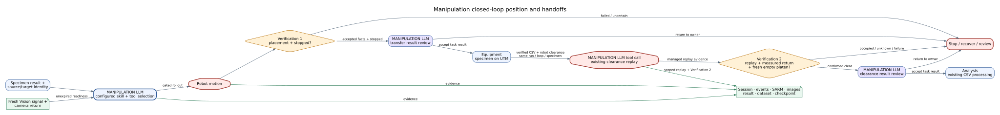
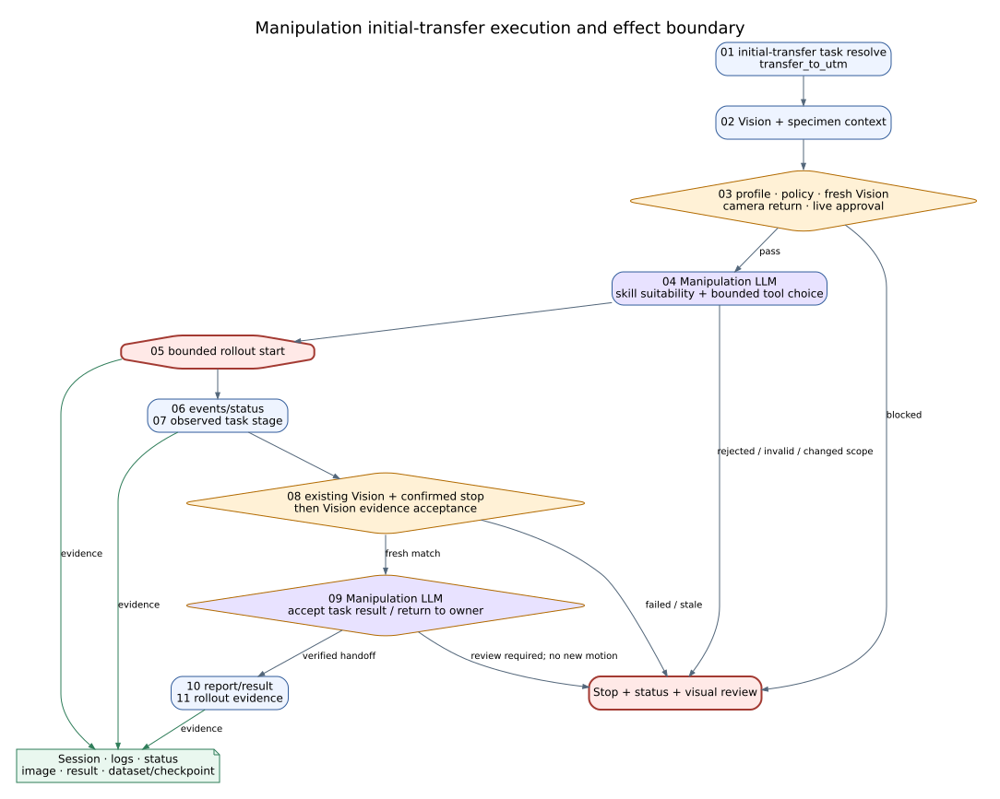
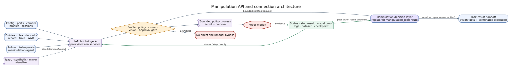

# Manipulation Agent Reference

## Summary

`ManipulationAgent` supervises short, bounded LeRobot/Pi0.5 policies for
specimen transfer. It validates task, profile, policy, fresh Vision context and
live gates; starts and monitors a rollout; scores SARM-lite progress; requests
post-place Vision verification; and packages result/evidence. Pi0.5 is a policy
executor, not a planner, and direct shell generation is prohibited.

## Scope

Supported tasks are `transfer_to_utm` and `clear_utm_to_disposal`. Training,
recording, teleoperation, Isaac, and mirror APIs are connected platform
surfaces; they are not automatically executed by the graph-stage agent.

## Source of Truth

Manipulation agent/module, LeRobot bridge, route handlers, robotics Guides, and
primary graph/sidecar handoffs.

## Actual Role

| Does | Does not |
|---|---|
| Resolve one allowlisted transfer task | Generate arbitrary robot/shell commands |
| Select validated LeRobot/Pi0.5 policy/profile | Train a policy as part of every graph step |
| Start/monitor/stop bounded rollout through bridge | Bypass LeRobot bridge or Guardian |
| Score progress and precursor risk | Treat policy confidence as physical proof |
| Require post-place Vision verification | Self-certify specimen placement |

## Three-Level Control Classification

| Level | Manipulation responsibility | Authority boundary |
|---|---|---|
| High-Level Control | Owns the governed transfer branch after fresh Vision readiness and remains active until bounded rollout termination plus required post-place Vision evidence | Does not advance to Equipment while rollout or post-place verification is incomplete |
| Middle-Level Control | Resolve saved task/policy/profile settings, validate preflight, supervise rollout and motion-state evidence, track grasp/ungrasp/home conditions, request post-place verification, and emit the transfer result | The saved Manipulation Agent configuration is the single policy-path authority unless the current experiment explicitly overrides an allowed field |
| Low-Level Control | Calls `lerobot.rollout.start/stop/status` and `robot.pick_place` where selected | LeRobot process/PID lifecycle, serial ports, camera leases, robot commands, action timing, and optional Isaac sidecars remain bridge authority |

Port/process recovery is Low-Level; retrying or reconstructing the transfer
procedure is Middle-Level; choosing another stage, cycle, review, or stop is
High-Level. Direct rollout in the LeRobot Workspace is manual and does not
substitute for the automatic agent completion contract.

## Closed-Loop Position and Handoffs

**Figure Manipulation-1.** A specimen result and unexpired Vision readiness
enter one of two bounded transfer tasks; robot motion is followed by post-place
Vision verification before Equipment or Knowledge handoff. This is an
`inspection`-backed projection of baseline `0b7627b`, not evidence of motion
accuracy or live transfer reliability.

| Direction | Component | Contract/state | Purpose | Gate |
|---|---|---|---|---|
| In | Specimen | specimen result/location | transfer target | specimen ready |
| In | Vision | fresh pose/readiness | safe pickup/placement context | `expires_at`, camera returned to VLA |
| In | Profile/policy service | robot, camera, checkpoint | executable policy | validation/preflight |
| Out | Vision | session/post-place request | verify placement | bounded rollout state |
| Out | Equipment | verified specimen on UTM | permit protocol | Vision confirmation |
| Out | Knowledge | disposal/rollout evidence | provenance | report/evidence refs |

## Inputs and Outputs

Inputs include `OrchestratorState`, `specimen_result`, latest Vision signal,
manipulation profile, `transfer_readiness.camera_returned_to_vla`, task ID,
policy/profile references, and mode/approval state. Outputs include
`manipulation`, SARM data, `manipulation_report.v1`,
`robot_task_result.v1`, handoff packet, decisions, metrics, rollout runtime,
stage machine, and evidence refs.

## Internal Execution

| Step ID | Work | Boundary/output |
|---|---|---|
| `01_resolve_transfer_task` | allowlisted task/skill | task/skill IDs |
| `02_collect_vision_and_specimen_context` | merge context | stale/missing blocks |
| `03_validate_policy_profile_and_live_gates` | profile/policy/camera/confirmation | preflight |
| `04_select_policy_backend` | LeRobot/Pi0.5 selection | no direct shell |
| `05_start_bounded_rollout` | bridge tool start | session/result |
| `06_monitor_rollout_events` | logs/events/status | rollout runtime |
| `07_score_sarm_stage_progress` | progress/risk/recovery hint | SARM/stage machine |
| `08_request_post_place_vision_verification` | handoff gate | verification pending/result |
| `09_decide_recover_stop_or_handoff` | bounded decision | recover/stop/verify/handoff |
| `10_package_manipulation_report` | typed reports | report/result schemas |
| `11_store_rollout_evidence` | attach logs/data/checkpoint | evidence refs |

Supported task contracts:

- `transfer_to_utm`: `3dp_output_area` → `utm_fixture`, verified by
  `specimen_on_utm_platen`, next agent Lab Equipment.
- `clear_utm_to_disposal`: `utm_fixture` → `discard_bin`, verified by
  `utm_home_restored`, next agent Knowledge.

**Figure Manipulation-2.** Two supported tasks, eleven internal entries, and
four registered tools preserve task resolution, fresh context, live gates,
backend selection, bounded rollout, monitoring, SARM progress, Vision
verification, decision, reporting, and evidence. This `inspection` figure does
not imply independent graph scheduling or validated physical performance.

### Execution trace details

| Phase | Required identity/state | Operation/gate | Evidence/output | Unknown-effect rule |
|---|---|---|---|---|
| Task resolution | allowlisted task, source and target | bind `transfer_to_utm` or `clear_utm_to_disposal` | task/skill/terminal pose | unsupported task blocks before motion |
| Context | specimen ID and unexpired Vision signal | merge pose/readiness and camera-return state | bounded transfer context | stale or mismatched signal blocks |
| Preflight | robot profile, policy/checkpoint, camera, approval and mode | validate profile/policy/live gates | preflight result and blockers | no shell or arbitrary model motion fallback |
| Rollout | task, policy and session configuration | start bounded bridge session | session ID, start result and action budget | start response alone does not prove final pose |
| Monitor | session events/status | track phase, SARM risk and recovery hint | event log, stage machine, progress | missing status triggers stop/status review |
| Post-place | matching session and camera observation | request fresh Vision verification | placement result and evidence refs | failed verification blocks downstream handoff |
| Decide/store | verified result or explicit failure | handoff, bounded recover, or stop | typed report/result, logs, dataset/checkpoint refs | unknown state requires stop, status and visual proof before restart |

## API Surface

| Class | Method | Path/family | Effect | Notes |
|---|---|---|---|---|
| owned | GET/POST | `/api/lerobot/manipulation-agent/config` | read_only/local_state | agent profile/config |
| owned | POST | `/api/lerobot/manipulation-agent/test`, `/run` | local_state/physical_possible | bounded agent workflow |
| connected | GET/POST | `/api/lerobot/rollout/config`, `/rollout/start`, `/rollout/stop`, `/rollout/status` | physical_possible | primary policy session |
| operator | POST | `/api/lerobot/teleoperate/start`, `/teleoperate/stop`, `/teleoperate/status` | physical_possible | manual teleoperation |
| operator | POST | `/api/lerobot/record/*`, `/train/*`, `/wandb-local/*` | local_state/model | dataset/training lifecycle |
| operator | GET/POST | `/api/lerobot/config`, `/sessions`, `/ports/*`, `/camera/test`, `/profiles/validate` | read_only/local_state | readiness/configuration |
| connected | GET/POST | `/api/lerobot/policies`, `/files/*`, `/dataset/inspect`, `/policy/download` | read_only/local_state/external_service | policy/data selection |
| operator | POST | `/api/lerobot/isaac-lab/*`, `/isaac-rgbd/*`, `/augment/*` | local_state/external_service/model | simulation/synthetic/IL/RL/Mimic |
| operator | POST | `/api/lerobot/mirror/*` | read_only/local_state/external_service | Isaac mirror process/loop |
| operator | POST/GET | `/api/lerobot/visualize/*` | local_state/read_only | visualization process/files |

The 87-route family is exhaustive in OpenAPI; categories above cover its
configuration, execution, stop/status, validation, data, simulation, and
evidence responsibilities.

## Tools and Connections

| Tool/service | Boundary | Effect | Evidence |
|---|---|---|---|
| `lerobot.rollout.start` | LeRobot bridge | physical_possible | session/log/status |
| `lerobot.rollout.stop` | LeRobot bridge | physical_possible | stop result |
| `lerobot.rollout.status` | LeRobot bridge | read_only | current session |
| `robot.pick_place` | compatibility bounded bridge | physical_possible | task result |
| Pi0.5/LeRobot policy | policy executor | model/physical_possible | policy/checkpoint/config |
| SARM-lite | in-process progress monitor | read_only/local_state | progress/risk trace |
| Vision | camera/signal handoff | read_only | pose/verification evidence |
| Isaac | optional simulation/mirror services | external_service/model | scenario/output artifacts |

**Figure Manipulation-3.** Configuration, data, execution, and optional Isaac
API families converge on LeRobot services, then pass profile, policy, camera,
Vision, and approval gates before a bounded process can reach the robot.
Status, stop results, visual proof, and training artifacts return separately.
This `inspection` figure is not live or simulation-performance evidence.

### Connection lifecycle

| Lifecycle | Service boundary | Required observation | Recovery rule |
|---|---|---|---|
| Configure | ports, cameras, profiles, sessions and policy refs | stable robot/camera/profile/checkpoint identity | invalid profile or missing port blocks action |
| Prepare | policy/file/dataset services and camera test | policy validation, camera readiness, fresh Vision | downloaded or trained policy is not automatically active |
| Invoke | rollout, manipulation-agent or explicit teleoperation API | session ID, bounded task and action budget | each motion surface retains server/bridge gates |
| Observe/stop | rollout status, events, camera and stop API | current session status plus visual state | timeout/unknown effect prohibits blind replay |
| Persist | logs, dataset, checkpoint, images and result | run/session/specimen-linked references | unlinked artifacts do not satisfy handoff proof |
| Optional simulation | Isaac/synthetic/mirror/visualization | declared simulation configuration | simulation evidence never becomes Live evidence |

UI controls, model output, downloaded policies, and module descriptors cannot
bypass the LeRobot bridge or establish direct-shell authority.

## State, Events, Artifacts, and Storage

State includes task, skill, profile, policy ref, session ID, action count,
runtime phase, SARM/stage-machine state, post-place interlock, verification,
decision, result, and evidence refs. Logs, datasets, checkpoints, images, and
events require run/session/specimen identity.

## Modes and Fallbacks

Test uses fake/virtual policy paths and cannot establish motion. Replay uses
recorded events. Isaac is simulation/mirror evidence. Browser invokes APIs but
does not change evidence class. Live requires a visible robot/camera profile,
valid policy checkpoint, fresh Vision, approvals, and bridge readiness.
Compatibility `robot.pick_place` is explicit, not silent equivalence.

## Safety, Approval, and Effect Boundary

`execution_boundary` is `lerobot_bridge_only`; Guardian has stop authority;
direct shell is false. Live motion requires validated profile/policy, camera
return, fresh Vision, bounded task, approval/policy gates, and a stop path.
Post-place Vision verification blocks Equipment handoff.

## Errors and Recovery

Invalid profile/policy or stale Vision blocks before motion. A rollout error
retains session/log/evidence. Unknown effect requires status, stop request,
visual state verification, and operator/Guardian decision before restart.
Recovery is bounded to an allowlisted skill; arbitrary model-generated motion
is prohibited.

## Operator and GUI Surfaces

The LeRobot workspace manages ports, cameras, profiles, teleoperation,
recording, training, rollout, datasets/policies, Isaac, visualization, mirror,
and agent test/run. Live GUI shows agent report, progress, handoff, and evidence.
Workspace actions remain server/bridge gated.

## Current Verification

Verified against two supported tasks, all 11 internal steps, four tools, and the
87-route LeRobot family at baseline `0b7627b`. This is interface/architecture
verification, not a live transfer result.

## Limitations and Known Gaps

No paper-scoped result establishes grasp success, collision avoidance, policy
generalization, recovery success, or live timing. Hardware, dataset, policy,
camera, and Isaac availability vary.

## Related Documents

- [Agent Matrix](agent_api_connection_matrix.md)
- [Vision](vision_agent.md)
- [Equipment](equipment_agent.md)
- [Three-Level Control Model](../runtime/three_level_control_model.md)
- [Legacy Pi0.5 Transfer Guideline](manipulation_pi05_transfer_runtime_guideline.txt)
- [LeRobot Runtime Guide](../hardware/lerobot_robotis_manipulation_runtime_guideline.md)
- [Isaac Mirror Guide](../hardware/isaac_sim_robotis_omx_mirror_mode.md)
