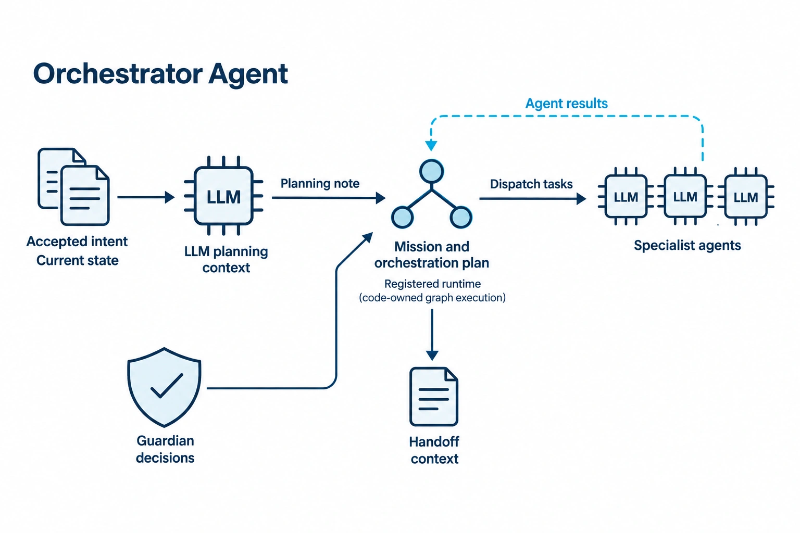
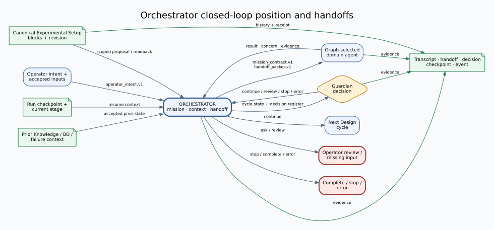
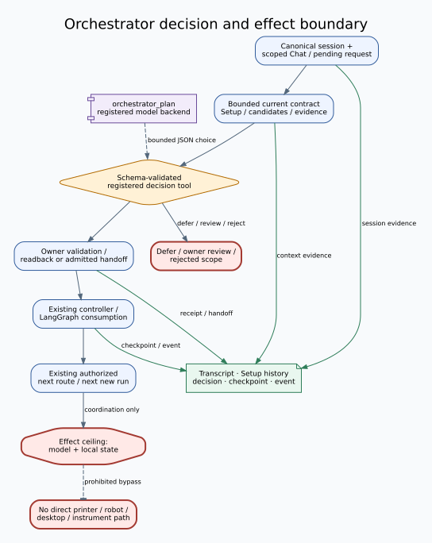
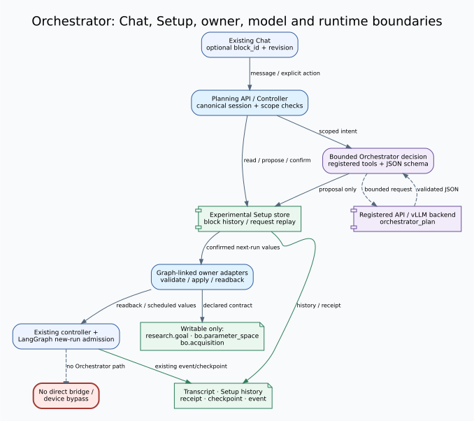

<!-- atr-doc
doc_type: reference
subtype: system
status: active
authority: descriptive
audience: [researcher, operator, developer, maintainer]
scope: [agents, orchestrator, control_plane, experimental_setup]
summary: Current contract for bounded Orchestrator decisions, dynamic Experimental Setup, Chat editing, handoffs, and next-run application.
source_of_truth:
  - agents/orchestrator_agent.py
  - agents/orchestrator_capabilities.py
  - agents/orchestrator_decision.py
  - app/controller.py
  - app/main.py
  - app/planning_setup.py
  - orchestrator/experimental_setup.py
  - orchestrator/setup_application.py
  - orchestrator/langgraph_runtime.py
  - graphs/modules/orchestrator/module.yaml
last_verified: 2026-09-12
verified_against: working-tree
related_docs:
  - docs/agents/README.md
  - docs/agents/agent_api_connection_matrix.md
  - docs/gui/reference/live_gui_reference_alignment.md
  - docs/runtime/langgraph_runtime.md
  - docs/runtime/runtime_ide.md
  - docs/superpowers/specs/2026-09-12-orchestrator-dynamic-experimental-setup-design.md
supersedes: []
-->

# Orchestrator Agent Reference

*Conceptual role overview; editable, inspection-backed architecture figures follow.*

## Status at a Glance

| At a glance | Details |
|---|---|
| Runtime status | Implemented bounded planning, handoff, Setup proposal, and next-new-run application paths in the working tree |
| LLM decision layer | `orchestrator_plan` selects only schema-validated, registered decision tools; code and owners validate every effect |
| Physical effect | No direct device tool or bridge path; downstream routes remain subject to their owners, Guardian, approvals, and device gates |
| Primary handoff | Existing planning/runtime boundary prepares an admitted handoff for the graph-selected domain owner |
| Live hardware validation | None in this work; device actuation and operating-service changes were not performed |
| Verification | Corrected aggregate passed for 78 bounded cases per provider; see [verification evidence](../runtime/evidence/2026-09-12-orchestrator-dynamic-setup-verification.md) for capture/postprocessor epochs and limits |

## Overview and Responsibilities

### Grounded Questions and Memory

The existing Chat question branch now uses a concise research-assistant persona
and reference-only [AX4LAB Wiki context](../knowledge/wiki_memory.md).
Current-state questions use existing owner readback rather than assumed device
availability. Questions do not enter the Experimental Setup mutation or run-start
path. Returned sources identify the evidence cited by the answer.

Explicit memory requests produce a candidate; Chat confirmation calls the
Knowledge memory service, not an execution tool. Private access requires trusted
server identity and consent for every possible model destination. Without that
integration, Chat remains public-Wiki-only. Earlier planning-provider verification
does not establish verification of this new question/memory path.

### Summary, scope, and source of truth

`OrchestratorAgent` coordinates accepted operator intent, bounded decisions,
Setup proposals, existing handoffs, and Guardian route translation. The active
working-tree sources listed in this document's metadata are authoritative;
this Reference describes them and does not make a device, safety, or model
quality claim.

The scope includes the planning session and Experimental Setup state, the
existing controller and LangGraph handoff boundaries, and their visible Chat
surface. It excludes direct bridge configuration, device execution, a new IDE
activation feature, and applying a change to an already-running loop.

| Responsibility area | Current Orchestrator role | Boundary and detailed home |
|---|---|---|
| High-Level Control | Accepts scoped intent; coordinates mission, route, retry/review, and next-new-run selection | [Closed-Loop Position and Handoffs](#closed-loop-position-and-handoffs) |
| Middle-Level Control | Builds bounded context, validates model choices, proposes Setup changes, and prepares admitted handoffs | [Decision and Evaluation](#decision-and-evaluation) |
| Low-Level Control | Has no direct printer, robot, camera, desktop, instrument, or solver tool | [Tools, APIs and Connections](#tools-apis-and-connections) |
| Guardian / Safety | Preserves Guardian and operator decisions; unknown or missing authority does not become continuation | [Safety and Recovery](#safety-and-recovery) |
| Knowledge / Evidence | Keeps planning transcript, Setup history/readback, decision traces, checkpoints, and events distinct | [Artifacts and Verification](#artifacts-and-verification) |

These are cross-cutting responsibility areas, not five runtime stages.

## Closed-Loop Position and Handoffs

**Figure Orchestrator-1.** Operator intent, accepted state, checkpoint, Setup
snapshot, domain results, and Guardian results meet at the existing
Orchestrator boundary. Solid edges show current coordination/evidence paths;
the figure adds no direct-device path. This is an `inspection`
projection of the working tree, not live runtime or safety-effectiveness proof.

The controller retains canonical session, run, scope, pending request, and
execution admission authority. A prepared handoff is consumed once at the
existing runtime boundary; it is not a second dispatcher or a new graph stage.
An accepted setup change is captured and read back when a **new** run starts;
it does not alter the current run or a later cycle in that run.

## Internal Workflow

**Figure Orchestrator-2.** The localized decision boundary reads a bounded
current contract, optionally gathers registered inspection evidence, validates
one tool choice, and returns to the existing controller/runtime path. It does
not portray five areas as sequential stages or add a direct device effect.
This is an `inspection` figure, not evidence that a model, service, or device
executed successfully.

Planning semantic intake distinguishes questions, `change_setup`, `start_run`,
server-bound `confirm_pending`, out-of-scope requests, and unclear requests.
Only the existing explicit start path can start a run. A setup proposal does
not confirm or apply itself; normalized validation results create a new draft
that requires a separate explicit confirmation.

## Decision and Evaluation

`decide_orchestration` calls the registered `orchestrator_plan` model route
with a bounded public context and exact JSON response schema. Its current
tools are `inspect_context`, `inspect_availability`,
`propose_setup_change`, `request_owner_review`, `prepare_handoff`, and
`defer`. The dispatcher checks allowlisted arguments, evidence references,
current scope, admitted candidates, and handler results before returning an
effect. A changed scope before or after a handler result rejects consumption.

`classify_chat_request` is semantic intake only. Questions, negations, quoted
commands, and an unbound approval do not authorize execution. Exact standalone
stop/emergency-stop handling remains on the existing immediate control path,
outside the model and planning lock.

The decision prompt identifies the requested operation and exposes only
registered top-level evidence IDs; nested provenance is retained as provenance,
not silently promoted to a selectable reference. An unclear or off-scope Chat
request records bounded canonical guidance without changing Setup, a pending
authorization, or a follow-up queue. A conditional observation refresh also
requires the current server run, loop, specimen, action, and held checkpoint;
missing or foreign scope becomes the same nonaction clarification.

Availability is an independent, evidence-freshness projection. The synchronous
Setup projection starts at `unknown`; a descriptor, a writable field, or an
owner's presence is not readiness. Read-only inspection may report a fresh
owner result, but it does not start an owner, load a model, or create device
evidence.

The current corrected joined captures have a maximum prompt size of 15,632
UTF-8 bytes against the unchanged 16,000-byte bound. This is controlled prompt
capacity only: it does not establish provider acceptance, a handler effect,
model-driven cycle, served fallback behavior, or a live device result.

Separate fresh capacity probes reported API-served `gpt-5.5-2026-04-23`
(5,227 input / 1,102 output tokens; 16.28 s) selecting
`inspect_availability`, and `gemma4:31b` (6,333 / 214 tokens; 22.03 s)
selecting `request_owner_review` with Guardian context. The negative BO
conditions were retained; physical effects and denied attempts were both zero.
These probes remain capacity/schema evidence, not full-batch or whole-cycle evidence.

## Tools, APIs and Connections

**Figure Orchestrator-3.** Chat and Setup read the same canonical server
snapshot; owner adapters validate and read back the limited next-run settings,
and the existing runtime consumes them only at new-run admission. Solid paths
are current working-tree interfaces; the dashed line marks no direct bridge
bypass. This is an `inspection` projection, not browser, service, or hardware
evidence.

| Surface | Current ownership/effect boundary |
|---|---|
| `GET /api/planning/session` and Setup events | Controller returns canonical `state.setup` and `state.pending_request`; projection revisions and IDs are server-owned |
| `POST /api/planning/message` | Optional `{block_id, revision}` Setup context is validated against the canonical session; a click alone sends nothing |
| `POST /api/planning/setup/actions` | Explicit `confirm` or `discard` for `target: next_run`; validates canonical session, proposal, block revision, and request ID; never starts a run |
| Owner adapters | Only registered graph-linked owners expose descriptors, validation, apply, and readback; actual owner validation precedes draft persistence, and unsupported owners remain read-only |
| Existing controller/runtime handoff | Code consumes a prepared, admitted decision once through the existing path; not a direct `agent.run` or bridge call |
| Model backend | Existing registered API/vLLM route under `orchestrator_plan`; provider selection does not grant tool or device authority |

## Configuration and Operation

Experimental Setup is a server-side, canonical-session state beside the
planning transcript. It is dynamic from graph-linked owner descriptors, not a
fixed five-block form. Active and historical blocks retain stable IDs and
revisions; inactive history is visible but not editable. Draft, confirmed, and
effective values are separate, as are agreement, application, validation, and
availability states.

The current write-enabled public fields are deliberately narrow:

| Owner | Writable public topic | Existing consumer | Apply timing |
|---|---|---|---|
| `orchestrator_agent` | `research.goal` | next new-run planning state / active goal | after explicit confirmation and new-run admission |
| `bo_agent` | `bo.parameter_space` | BO initial-design/request settings | after explicit confirmation and new-run admission |
| `bo_agent` | `bo.acquisition` | BO `run_with_settings` acquisition input | after explicit confirmation and new-run admission |

All other exposed graph owners are read-only or unsupported unless they provide
the complete owner adapter contract. A proposed change is owner-validated before
draft persistence. At new-run admission, the complete captured confirmed set is
validated from one snapshot; same-owner confirmed settings are combined before
any owner effect. Readback is required before an owner receipt is `applied`.
Partial, rejected, failed, or unknown receipts remain explicit and do not claim
a globally applied configuration.

In the existing Live GUI allocation, Setup uses its current dock and internal
vertical scroll. `Edit in Chat` opens the existing Chat with the same
`block_id`/revision context, without sending a message, mutating values, or
starting a run. Chat and Setup use the same canonical state, not a historical
report model. This has focused static-fixture browser coverage; it is not an
operating GUI service claim.

## Safety and Recovery

- Current execution snapshots remain immutable during a setup edit. `scheduled`
  means next-run intent, not successful application.
- Wrong/foreign session IDs, stale block revisions, inactive blocks, unsupported
  owners, invalid values, and changed request IDs are rejected rather than
  widened into a write.
- A transport retry reuses the original request ID and stored outcome; a changed
  request needs a new ID. Response loss triggers refresh/readback, not blind
  reapplication.
- Setup events and reconnect snapshots use canonical revision/projection rules;
  they do not replay actions. Pending state does not resume hardware work.
- Both existing new-run entries stop before runtime/model review/LHS/Design when
  the all-confirmed admission is held. Failed, unknown, or partial receipts keep
  the original failed-run inputs and detached blocked snapshot for readback
  recovery; successful owners are not repeated on an ordinary retry. An explicit
  replacement confirmation is required to supersede a hold.
- Guardian, approval, cancellation, stop, freshness, and domain-device gates
  remain authoritative. Orchestrator does not turn uncertainty into readiness
  or continuation.

## Artifacts and Verification

The working-tree implementation has focused deterministic/API/GUI/loop
evidence recorded by the implementation tasks. The final correction review
directly inspected 117 affected tests, eight retained-input tests, and one
joined trace with zero failures/errors/skips; the joined trace took 48.99 s.
The preceding 44-test mode suite predates the final projection-only `None`
guard and is retained as earlier-epoch evidence, not current whole-suite
evidence. Counts overlap and are not summed. Task 7's isolated browser audit covered the existing
Setup allocation, internal scrolling, and the same Chat context at 1440x960,
1440x480, and 390x640; it did not establish whole-page responsive quality or
an operating service.

Corrected aggregation of the complete immutable raw reports found exactly 78 cases
per provider (72 intake, including H01–H12 holdouts, plus six decisions), with
current frozen source/fixture/prompt epochs, strict statuses/labels/effects,
actual attempt identities, full coverage, and no fallback. The API report
served only `gpt-5.5-2026-04-23`; Gemma used two 39-case shards. Physical
effects and denied attempts were zero; one Gemma lifecycle case was explicitly
simulated with `actual_effect=false`. This is actual bounded model-case
evidence, not a model-driven whole cycle, public-Chat-to-end trace, 20-cycle
campaign, or hardware result. The corrected aggregate uses the same raw capture
epoch and a separately hashed postprocessor; it did not rerun providers. Exact
checks, hashes, and command scope are in the [verification evidence](../runtime/evidence/2026-09-12-orchestrator-dynamic-setup-verification.md).

### Limitations and known gaps

Only `research.goal`, `bo.parameter_space`, and `bo.acquisition` have the
current descriptor-to-owner-to-consumer path. Unknown availability remains
unknown. The current reference is verified against intentional uncommitted
working-tree scope, not a commit containing these changes.

### Related documents

- [Agent Reference Index](README.md)
- [Agent API and Connection Matrix](agent_api_connection_matrix.md)
- [Live GUI reference alignment](../gui/reference/live_gui_reference_alignment.md)
- [Runtime IDE Reference](../runtime/runtime_ide.md)
- [Approved dynamic Experimental Setup design](../superpowers/specs/2026-09-12-orchestrator-dynamic-experimental-setup-design.md)
