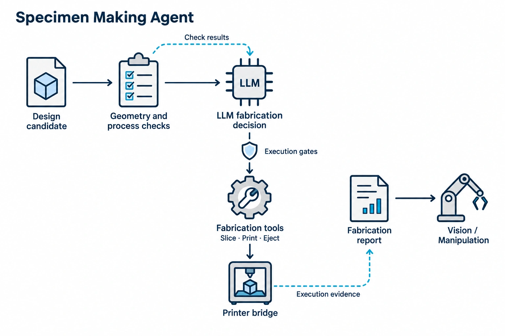
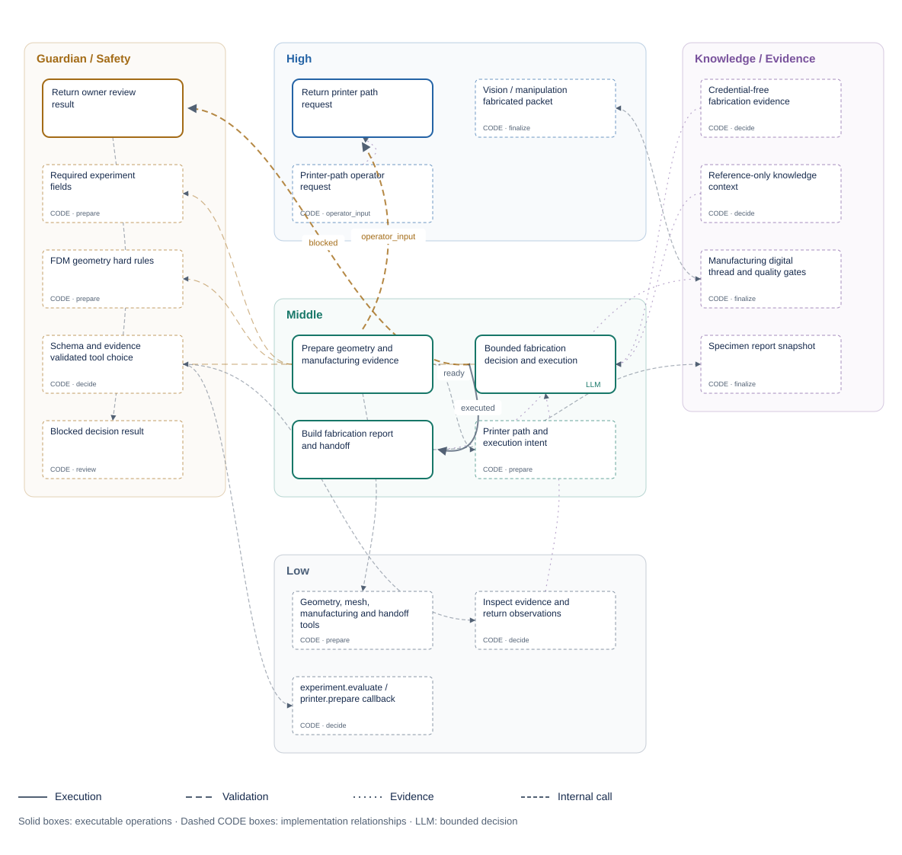

<!-- atr-doc
doc_type: reference
subtype: system
status: active
authority: descriptive
audience: [researcher, operator, developer, maintainer]
scope: [agents, specimen, manufacturing, printer_connection]
summary: Current contract for geometry, manufacturing QA, printer preparation, fabrication evidence, and specimen handoff.
source_of_truth:
  - agents/specimen/agent.py
  - agents/specimen/decision.py
  - agents/specimen/execution.py
  - agents/specimen/structure.py
  - agents/specimen/module.py
  - agents/specimen/presentation.py
  - agents/specimen/frontend/live_report.js
  - utils/specimen_execution.py
  - graphs/modules/specimen/module.yaml
  - device_bridges/printer_fleet/module.py
  - device_bridges/printer_fleet/bridge.py
  - device_bridges/printer_fleet/providers/bambu_autoejection.py
  - device_bridges/printer_fleet/providers/prusa.py
  - packages/agents/specimen/package.yaml
  - app/main.py
  - web/static/planning.js
last_verified: 2026-09-13
verified_against: working-tree-2026-09-13-specimen-modularization
related_docs:
  - docs/agents/README.md
  - docs/agents/agent_api_connection_matrix.md
  - docs/agents/design_agent.md
  - docs/agents/vision_agent.md
  - docs/agents/manipulation_agent.md
  - docs/hardware/bambulab_x2d_device_bridge_runtime_guideline.md
supersedes: []
-->

# Specimen Making Agent Reference

*Role overview; detailed execution and connection diagrams follow below.*

## Status at a Glance

| At a glance | Details |
|---|---|
| Runtime status | Implemented; code-owned module and editable owner execution graph |
| LLM decision layer | Implemented / API and local-model verified without actuation |
| Physical effect | Possible through existing gated printer tools |
| Primary handoff | `specimen_fabricated.v1` → Vision / Manipulation |
| Live hardware validation | Not performed for this decision-layer change |
| Known gap | Suitability decisions do not establish physical print quality |

### Module Ownership and Layout

The installed [Specimen module](../../agents/specimen/module.py) binds the
existing `SpecimenMakingAgent` to `AgentRegistry`. The handler remains
`agent.specimen_agent`; flat Python imports remain compatibility adapters.

| Boundary | Specimen owns | Existing host retained |
|---|---|---|
| Backend | `agents/specimen/agent.py`, `decision.py`, `execution.py` | Agent context, ToolRegistry and orchestration handoffs |
| Internal structure | Registered operations and source-bound `structure.py` relationships | Runtime IDE graph editing, validation and execution trace |
| Report/API | `presentation.py` projection | `/api/agents/specimen/report`, module details and runtime manifests |
| Frontend | `frontend/live_report.js` report and six-card composition | `/live` module host; injected camera, STL and shared helpers; no added polling |
| Configuration | Existing fabrication inputs and module definition | Graph/module stores and run snapshots; no second settings store |
| Storage | `specimen_agent` archive identity and manufacturing artifacts | Existing run/loop/agent/attempt archives; geometry remains under the run's `specimens/` directory |
| Device execution | Existing tool requests only | Printer Fleet and provider implementations remain under `device_bridges/` |

The browser loads `/module-assets/specimen/live_report.js` from the active
code-owned manifest. Applying a valid graph controls active owner/report/asset
access; opening an editor does not activate the owner or operate a printer.
Removing a graph reference never deletes installed code or historical results.

### Agent Package and Device Bridge Composition

The [Specimen Agent Package](../../packages/agents/specimen/package.yaml)
declares `specimen@1.0.0` and its `printer_fleet@1.0.0` dependency. Fleet
references the existing Bambu and Prusa provider components; it is not another
printer protocol or an installer.

| Package boundary | Canonical location | Contract |
|---|---|---|
| Agent | `agents/specimen/` | Decision, execution, report and frontend ownership |
| Shared bridge | [Printer Fleet](../../device_bridges/printer_fleet/README.md) | Registered printer tools and package membership |
| Internal providers | [Printer Fleet package layout](../../device_bridges/printer_fleet/README.md) | Bambu and Prusa implementations within one Device Bridge Package |
| Experimental Package | [Package API](../../packages/README.md) | Graph plan, exact dependencies and portable module drafts |

Bridge code stays under `device_bridges/`; existing connection memory and
run/loop artifacts keep their owners and locations. Export does not bundle that
private storage. Import validates installed dependencies and returns an inactive
draft; existing explicit save/activation remains the execution boundary.

## Overview and Responsibilities

The existing LLM decision boundary receives a bounded, reference-only
[AX4LAB Wiki pack](../knowledge/wiki_memory.md). This supplies platform context
without changing this agent's tools, numerical authority or execution gates.

`SpecimenMakingAgent` turns an approved experiment specification into a
manufacturing digital thread: geometry, mesh and manufacturability evidence,
process/slice artifacts, printer execution state, fabrication monitoring, and
a specimen handoff. Physical printing occurs only through the printer service
and provider gates. After code-owned geometry and manufacturing checks, a bounded
LLM layer decides whether to execute fabrication, inspect evidence, or return the
task. Execution invokes the existing printer route.

### Scope

The agent owns specimen preparation logic and evidence packaging. Printer
transport, provider protocols, Vision confirmation, and robot transfer remain
separate services/agents.

### Source of Truth

Agent and module files plus Bambu/Prusa bridge implementations, printer routes,
geometry/artifact tools, and hardware Guides.

### Actual Role

| Does | Does not |
|---|---|
| Validate required fabrication fields | Design the experiment objective |
| Generate/check geometry and process artifacts | Publish an invalid or unapproved job |
| Decide suitability and invoke a bounded fabrication tool | Rewrite Design/BO variables or operator approvals |
| Prepare provider-specific print execution | Treat MQTT acceptance as proof of physical start |
| Monitor and package fabrication evidence | Self-certify bed clear or autoejection success |
| Handoff specimen state to Vision/Manipulation | Move the specimen with a robot |

### Five-Area Responsibility Map

Figure notation: **LLM** marks the High decision; **LLM call** marks the process
that supplies context and consumes its response ([shared label contract](../runtime/three_level_control_model.md#llm-node-labels)).

The areas describe responsibilities, not five sequential model calls.

| Level | Specimen Making responsibility | Authority boundary |
|---|---|---|
| High-Level Control | LLM judges fabrication suitability and selects bounded inspect, execute or return tools | Global routing/recovery stays with Orchestrator; model selection is not operator approval |
| Middle-Level Control | Prepare geometry and manufacturing evidence, validate tool requests, dispatch existing printer APIs and assemble handoff | Must keep source, sliced, patched, published, started, completed, ejected, and Vision-confirmed states distinct |
| Low-Level Control | Selected Printer Fleet provider owns printer communication and physical execution | Transfer protocol, MQTT/HTTP/FTPS/PrusaLink, printer state, autoejection motion and hard interlocks remain provider authority; slicing is Middle software work |
| Guardian / Safety | Hard checks, strict tool arguments, decision budgets, current intent/stop checks, existing provider gates | No model override of specification, mode, approval or G-code |
| Knowledge / Evidence | Current intent, geometry/QA warnings, manufacturing estimates, decision/tool trace and artifacts | Estimates are not measurements; no synthetic performance prediction |

Printer reconnection or uncertain command effect is a Low-Level concern;
regenerating a failed fabrication artifact is Middle-Level; selecting
retry/review/stop or another cycle is High-Level. The 3DP Device Workspace is a
manual surface and does not independently complete this agent stage.

## Closed-Loop Position and Handoffs

**Figure Specimen-1.** A constrained Design specification becomes a
manufacturing digital thread and then a Vision-verified handoff to
Manipulation; invalid or uncertain fabrication returns to repair, review, or
stop. This is a current `inspection`-backed projection including the bounded
decision layer, not evidence of a successful physical print.

| Direction | Component | Contract/state | Purpose | Gate |
|---|---|---|---|---|
| In | Design | `design_candidate.v1`, JSON-compatible `experiment_spec` in state | fabrication intent | required fields/constraints |
| In | Printer service | fleet/profile/status | resolve provider | connection/readiness |
| Out | Vision | specimen/ejection evidence | verify state and location | fresh camera/proof |
| Out | Manipulation | specimen result/readiness | bounded transfer | Vision and robot preflight |
| Out | Analysis/Knowledge | manufacturing artifacts | provenance/context | artifact hashes |

### Inputs and Outputs

Input is `OrchestratorState` with experiment specification, candidate/specimen
identity, geometry/process constraints, mode, printer profile, and approvals.
Output merged into state includes specimen result, fabrication/process reports,
STL/slice/G-code references, digital-thread evidence, printer/monitor status,
autoejection/bed-clear evidence, decisions, metrics, and handoff packet.
`specimen_decision.v1` is additive in the result and fabrication report. A returned
or failed decision yields a failed `AgentResult`, failure code and blocked specimen
result without a fabricated/ready handoff in its output.

## Internal Workflow

The handler validates input, generates STL, runs mesh/manufacturability checks,
creates a preparation artifact and builds the existing evaluation payload.
`decide_specimen()` dispatches the selected local tool. `execute_fabrication`
invokes `experiment.evaluate → printer.prepare` once with that existing payload.
The preparation artifact alone is not physical completion.

The IDE and this document projection share the
[execution definition](../../graphs/modules/specimen/module.yaml) and
[source relationships](../../agents/specimen/structure.py). Solid owner nodes
are executable; CODE relationships expose inner checks, tools and evidence
without adding execution steps. The document uses the light theme.

| Operation | Work | Output/failure boundary |
|---|---|---|
| `specimen.prepare` | Required fields, execution intent, geometry and manufacturing evidence | `ready` with preparation, or `operator_input` with a pending request |
| `specimen.decide` | Bounded LLM inspection/execute/return loop and existing fabrication callback | `executed` with callback response, or `blocked`; no repeated decision/effect within an invocation |
| `specimen.finalize` | Fabrication report, digital thread and Vision/Manipulation packet | Requires preparation plus the executed branch; produces a fresh `AgentResult` |
| `specimen.review` | Package blocked decision for existing recovery | Requires the blocked branch; no ready fabrication handoff |
| `specimen.operator_input` | Return the prepared printer-path selection request | Requires the pending request; does not fabricate |

Explicit outcome edges determine execution. Saved definitions are checked for
registered operations, branch-specific producers and fresh terminal results.
Preparation and the bounded fabrication decision cannot replay within one
invocation; repeated report-only projection does not issue another print.

**Figure Specimen-2.** The LLM decision sits after hard geometry/manufacturing
checks and before the existing evaluation route. This detailed manufacturing
sequence expands work inside the registered operations above; its numbered
phases are not separate manifest nodes or eleven model calls.
Dashed paths identify explicit deterministic testing and review/return.

### Execution trace details

| Phase | State/identity | Operation and gate | Evidence written | Recovery boundary |
|---|---|---|---|---|
| Specification | candidate/specimen ID, geometry/process constraints | required-field and fabrication-intent validation | accepted intent or blocker | return incomplete input; do not infer defaults as accepted |
| Geometry | design parameters and unit contract | generate STL, then mesh/dimension QA | STL path/hash and QA report | existing runtime failure/revalidation |
| Process planning | material/profile/provider constraints | manufacturability and process validation | plan and rejection reasons | unsupported process blocks slicing |
| Slicing | source STL and selected profile | slice, patch where configured, validate G-code | source/patched hashes, plate and settings | regenerate from tracked source on mismatch |
| Start | current printer state, approval, bed-clear, prestart proof | draft, start gate, then publish | command draft, gate and publish response | a draft or ack alone is not physical start proof |
| Monitoring | job/provider identity and fresh status/video | observe progress, completion, ejection, and bed state | fresh status, camera and bed-clear evidence | unknown state requires inspection, not blind republish |
| Handoff | verified specimen and digital thread | package Vision/Manipulation request | specimen result and handoff artifact | no next job or transfer without matching proof |

## Decision and Evaluation

The model assesses whether checked geometry and manufacturing evidence support
the requested fabrication intent. It interprets relevant warnings and missing or
conflicting evidence; numeric hard checks stay code-owned. Missing measured
performance is normal before fabrication and alone does not require rejection.

| Agent-local tool | Exact arguments | Effect |
|---|---|---|
| `inspect_fabrication_evidence` | `evidence_ref`: supplied ID | Read projected current evidence |
| `execute_fabrication` | `specimen_id`: current specimen | Invoke the existing evaluation callback once |
| `return_to_owner` | `{}` | Return `SPECIMEN_OWNER_REVIEW` through existing failure/recovery handling |

Each response contains exactly `tool`, `arguments`, `reason` and `evidence_refs`.
Execution must cite `context:request`. Available IDs are `context:request`,
`geometry:artifact`, `mesh:checks`, `manufacturability:checks`, `execution:intent`.
Expected mass/time are estimates, not measurements. Only projected evidence fields
enter the prompt: no printer credentials, connection payloads or callbacks.
Records are data, not instructions. The registered role is `specimen_reasoning`
through existing AgentContext/ModuleRuntimeContext and backend routing.

## Tools, APIs and Connections

### API Surface

| Class | Method | Path/family | Service | Effect | Notes |
|---|---|---|---|---|---|
| connected | GET | `/api/printer/status`, `/video-*`, `/fleet`, `/connection`, `/profile` | printer manager | read_only | selected provider and monitoring |
| operator | POST | `/api/printer/fleet`, `/connection`, `/profile` | printer manager | local_state/external_service | configuration/selection |
| connected | POST | `/api/printer/bambu-slice-artifact`, `/bambu-autoejection-patch`, `/bambu-prestart-check` | Bambu artifact pipeline | local_state | prepares validated files |
| connected | POST | `/api/printer/start-command-draft`, `/start-gate` | printer start service | local_state | no publish by itself |
| connected | POST | `/api/printer/start-publish` | provider bridge | physical_possible | requires current gates/proof context |
| connected | GET/POST | `/api/printer/bed-clear`, `/autoejection-status`, `/autoejection-*` | autoejection service | read_only/physical_possible | test/sweep can move printer when live |
| operator | POST | `/api/printer/bambu-autoejection-proof-template`, `/bambu-autoejection-completion-audit` | audit service | local_state | verifies proof package |
| owned | GET | `/api/agents/specimen/report`, `/module-assets/specimen/live_report.js` | registered Specimen module | read_only | current report projection and module frontend |
| shared | GET/POST/PUT | `/api/modules/specimen` and validation/dry-run subroutes | module platform | read_only/local_state | editable owner graph; explicit save/activation |

### Registered Tools and Providers

| Tool/service | Implementation | Boundary | Effect | Evidence |
|---|---|---|---|---|
| `geometry.generate_metamaterial_stl` | geometry tool | in-process/files | local_state | STL/hash |
| `geometry.check_mesh_quality` | geometry tool | in-process | read_only | QA report |
| `geometry.check_manufacturability` | geometry tool | in-process | read_only | manufacturability report |
| `artifact.create_specimen_handoff` | artifact tool | files | local_state | handoff artifact |
| `experiment.evaluate` | experiment service | in-process dispatch | physical_possible through printer tool | evaluation record |
| `printer.prepare` | printer manager | provider bridge | physical_possible | preparation/start evidence |
| Bambu provider | MQTT + HTTP artifact path | external printer | physical_possible | ack, fresh status, hashes, proof |
| Prusa provider | operator-selected bridge | external printer | physical_possible | provider-specific evidence |

Local decision tools do not expand the global module allowlist. Code builds every
provider argument and the existing global tool registry applies its normal policy.

**Figure Specimen-3.** Printer APIs and `printer.prepare` reach a selected
provider only through the printer manager and artifact, approval, prestart, and
bed-clear gates; device status and proof return on a separate evidence path.
Bambu and operator-selected Prusa are different inspected configurations. This
`inspection` figure is not comparative or live-reliability evidence.

### Connection lifecycle

| Lifecycle | Boundary | Required observation | Failure rule |
|---|---|---|---|
| Resolve | fleet/profile and provider selection | stable provider/job/profile identity | no silent provider fallback |
| Prepare | geometry, slicer, G-code patch and artifact route | tracked source and patched hashes | mismatched or missing artifact blocks start |
| Preflight | connection, safe state, approval and bed-clear | current prestart snapshot with no blocker | stale readiness cannot authorize publish |
| Invoke | start gate then provider publish | command identity, topic/path, ack | retry requires known no-effect or resolved state |
| Observe | fresh provider status, video/camera, progress | post-publish state tied to the job | accepted-but-not-started remains explicit |
| Persist/release | proof package and completion audit | hashes, status, ejection and bed-clear evidence | next job remains blocked until release proof |

No UI card, model response, or module display descriptor can bypass the
printer manager, selected provider, Guardian/operator policy, or proof path.

### Digital Thread

For default Bambu slicing, the existing preparation and virtual-preflight paths
forward the experiment specification to the printer provider. Saved 3DP Print
Defaults and experiment overrides therefore reach the resolved vendor profiles;
explicit custom profiles remain unchanged. The [Bambu settings/mode contract](../device_bridges/bambu_x2d_bridge.md#effective-slicing-settings-and-execution-modes-2026-09-14)
defines first-layer speeds and the distinction between physical printing,
ejection-only testing, and non-actuating virtual preparation. Placement and
autoejection authority remain with the provider.

The digital thread links candidate/specimen IDs, source STL, slice/G-code,
patched autoejection artifact, hashes, plate/job/provider identifiers, start
gate/publish response, fresh post-publish status, monitoring, camera/bed-clear
evidence, and handoff. Printer workspace snapshots and events are views over
provider/service state.

## Configuration and Operation

| Setting / mode | Behavior |
|---|---|
| `specimen_reasoning` | Registered `e4b` role and existing API/vLLM model routes |
| `run_metadata.specimen_decision_settings` | Defaults: 6 calls, 45 s per model call, 120 s total decision budget |
| Budget validation | Calls 1–12; time budgets positive finite values ≤300 s |
| Normal runtime / forced-real TEST | LLM decision required; invalid/mock/timeout output cannot auto-execute |
| Explicit non-LLM TEST harness | `mode=deterministic_test`, `llm_used=false`; existing checked path |
| `virtual_bridge` | Existing virtual preparation; no physical fabrication claim |
| `installed_printer` | Existing ejection-only test path and profile policy preserved |
| `physical_print` | Existing full-print and configured ejection-tail policy preserved |
| `execution_policy.printer=preflight_only` | Existing preparation-only contract; no new upload/start authority |

Decision budgets do not limit physical print duration. Existing printer monitoring
and timeout behavior remains provider-owned. The explicit virtual-bridge `OSError`
degraded response is retained; there is no new production decision fallback.

### Multiple Incoming Flows

| Incoming flow | Preserved contract | Non-actuating check |
|---|---|---|
| LHS-supplied owner request | `orchestrator_design_contract.requested_parameters` through Design JSON | Requested cell size/density survive actual Design and Specimen handlers |
| BO redesign | `bo_recommended_constraints`, next-loop identity | Existing Design resolution, then unchanged fabrication parameters |
| Operator constraints | Material and specimen dimensions | PETG / non-cubic dimensions pass through existing handlers |
| Virtual / installed printer / physical print | Existing test path and transport intent | Same evaluation route; ejection-only/full-print flags preserved |
| Saved profile / preflight | Explicit print/ejection settings and execution policy | Profile flags are not replaced; preflight adds no physical authority |

Input-origin checks use representative contract fixtures, not a new LHS or BO
optimization run. Printer-boundary checks capture arguments instead of commanding
hardware. Unsupported geometry/providers still depend on existing implementations.

Test/virtual paths generate artifacts without claiming physical fabrication.
Live requires selected provider, connection, prestart, approval, publish, and
fresh observation. Bambu is the default active profile; Prusa is an explicit
operator selection, not a silent fallback.

## Safety and Recovery

Physical start requires validated artifacts, safe printer state, configured
Guardian/operator confirmation, dry-run/prestart gates, and a current bed-clear
contract. Publish acceptance and physical start are distinct. Autogenerated
G-code remains validated and hashed. Post-ejection next-job release requires
bed-clear evidence. Before dispatch, run/loop/experiment, stage, mode, specification
and stop flags must still match the prepared intent. Model failures and owner
returns do not produce ready handoffs. Once execution begins, exceptions and
cancellation propagate through existing runtime handling; the local LLM loop
never retries an uncertain physical effect.

### Errors and Recovery

| Failure | Recovery | Prohibited action |
|---|---|---|
| mesh/process invalid | existing runtime failure/revalidation | publish anyway |
| model invalid / timeout / exhausted budget | explicit decision failure | silent deterministic execution |
| owner review / changed intent / stop | existing failure/stop route | execute stale payload |
| artifact/hash mismatch | regenerate from source | substitute untracked file |
| accepted but not started | inspect fresh provider state | declare running |
| timeout/unknown print state | query printer/camera/proof | republish blindly |
| bed not clear | operator/vision verification | start next job |
| provider unavailable | explicit reselection/test | silent provider fallback |

### Operator and GUI Surfaces

The 3DP workspace exposes fleet, connection, live status/video, slicing,
prestart, start, autoejection, bed-clear, and proof/audit functions. Live GUI
shows the agent's manufacturing report and evidence. UI confirmation does not
bypass server/provider gates.

For executions requiring after-print confirmation, the Live GUI separates an
SPC call returning from the fabrication task completing. The shared runtime and
operator-retry merge paths preserve `run_metadata.specimen_execution`, scoped by
run, loop, and specimen. Submission and printer completion alone remain
`running` while ActiveCam verification is pending. Paused/interrupted work is
shown as `waiting`; errors override prior success. Only the matching ActiveCam
confirmation changes the task to `done`. A new SPC invocation clears that
execution's previous confirmation; the later UTM observation does not replace
fabrication verification. Virtual and preflight-only results retain their
existing completion semantics.

This lifecycle is display bookkeeping, not a new motion gate or graph route.
Historical completion does not expire when a short-lived pickup signal expires.
Non-actuating regression coverage:
`tests/unit/test_specimen_execution_status.py` and
`tests/js/specimen_lifecycle.test.cjs`.

The 2026-09-07 GUI update separates report ownership from execution completion.
`planning_bootstrap` belongs to the Orchestrator even when its guidance mentions
printers or specimens. Diagnostic events and chat messages may appear in an
SPC report, but their presence cannot mark SPC Done. Scoped execution evidence
remains authoritative; virtual/legacy paths without that record require
explicit `agent_status.specimen_agent.state = "done"` and `success = true`.
Running, waiting, approval and error displays retain their existing precedence.
This is a frontend-only change: reload the Live GUI to load the updated script;
it does not require a Python restart or any equipment action.

## Artifacts and Verification

The Printer Fleet package consolidation was rechecked on 2026-09-13. Specimen
passed the virtual-bridge, installed-printer and physical-print preparation
prefixes with device transports intercepted. A separate registered-API cycle
completed all 13 stage transitions through the next Design handoff, with 34
successful model calls and zero physical calls (393.809 s). This verifies the
software handoff, not live fabrication. See the [consolidation verification record](../oldversion/superpowers/plans/2026-09-13-specimen-agent-packages.md#printer-fleet-consolidation-and-ide-separation--2026-09-13).

Existing per-loop/attempt archiving also retains decision responses, local tool
requests/results and the final `specimen_decision.v1`. Its `status=executed` means
the callback returned, not that a physical print or Vision confirmation completed.
Existing fabrication, verification and completion contracts remain authoritative.

### Module-Migration Evidence — 2026-09-13

| Check | Observed result / scope |
|---|---|
| Owner/catalog/API regression | 67 focused Python checks passed before the final test-only addition |
| Durable deterministic parity | 12 module tests passed, including a synthetic golden for the complete result, state changes and exact ordered tool payloads; no dependency on Git history at test runtime |
| Frontend extraction | 37 JavaScript checks passed; existing report/dashboard and lifecycle behavior retained |
| Saved execution definition | Guarded API save/reload changed real owner call order; preparation bypass rejected without replacing active configuration |
| Supervised status | Fully registered runtime: success continues to Vision; failed Specimen result publishes error |
| Registered-model virtual cycle | Passed through BO, Guardian and next Design: 34 actual `gpt-5.5` calls across all 10 owners, 343.50 s test elapsed, zero physical calls; device observations/data simulated, background FEM not run |

Two older isolated status fixtures still fail because they omit the supervisor
required by their graph. They failed before and after migration; the new guarded
tests retain real supervisor admission. These checks do not claim physical
printing or a comparative API/local-model benchmark. Final package/IDE and cycle checks
are recorded in the [implementation plan](../oldversion/superpowers/plans/2026-09-13-specimen-agent-packages.md).

### Decision-Layer Evidence — 2026-09-08

| Check | Observed result / scope |
|---|---|
| Existing Specimen baseline | 42 tests passed before modification |
| Registered OpenAI module route | `gpt-5.5`: valid execute request, one printer boundary call, 4.346 s agent elapsed |
| Registered vLLM module route | `gemma4:31b` via existing E4B model fallback: valid execute request, one boundary call, 6.936 s |
| Probe isolation | Real Specimen handler, geometry/checks, module context and experiment runtime; non-actuating printer boundary |
| Six execution intents × two registered backends | 12/12 model/tool-routing checks passed; existing virtual, ejection-only, print, profile and preflight intents |
| Selected regression suite | 239 Python tests passed, 3 opt-in slicer tests skipped; 13 JS lifecycle tests passed |
| Existing downstream preflight regression | 20 cycles, 19 BO recommendation applications; Design/Specimen fixture stages, no hardware actuation |
| Regression/integration results | Commands and results in the [implementation plan](../oldversion/superpowers/plans/2026-09-08-specimen-decision-layer.md) |

Timings are single observations, not latency benchmarks. Model artifacts reside
at `/tmp/atr-specimen-verify-rHkdne/` locally. No actual hardware was operated for
this change. Previous physical closed-loop evidence is not attributed to the new
LLM decision layer. Loading Python changes requires a later server restart; the
live server was not restarted by this verification.

### Retained Lifecycle Evidence

On 2026-09-07 the uncommitted GUI change reproduced an idle session with one
orchestrator bootstrap event incorrectly displaying SPC Done. Re-evaluating
the same read-only session/event data with the corrected functions displays
SPC Idle and attributes the bootstrap to the Orchestrator. Behavioral Node
tests cover this classification, message-only diagnostics, explicit completion,
nonterminal success flags, ActiveCam pending state, and existing lifecycle
isolation. This is function-level verification, not a browser or hardware run.

The archived `run-20260906T122533Z-c0effd` was also replayed without actuation:
SPC remained Running after submission, became Done on the matching ActiveCam
confirmation, and stayed Done throughout the later UTM observations. The
combined EQP and SPC/Manipulation regression selection passed 147 Python tests
and 14 JavaScript tests on 2026-09-06 (five existing Python schema warnings).
Backend lifecycle changes require restarting the running server; refreshing a
browser alone does not load updated Python code.

The earlier inspection covered the class, 11 then-declared internal IDs, six tools, 27 primary printer API
entries plus artifact routes, and current Bambu/Prusa provider sources at
baseline `0b7627b`.

The 2026-09-06 display-lifecycle update was checked without device execution:
archived results from `run-20260906T113555Z-8b3e30` produced `running` after SPC
submission and `done` after matching ActiveCam confirmation, with stage and loop
unchanged. The SPC/manipulation lifecycle suites passed 47 Python and 13 JS
tests. This is not a new physical-cycle validation.

A broader controller/runtime selection passed 27 tests and failed two existing
cases: `test_controller_merge_vision_confirmation_marks_specimen_completion`
(expects an untagged later `not_checked` result to retain confirmation) and
`test_planning_tail_continues_original_loop_after_specimen` (its fixture stops
after the second Vision pass). Both failures also reproduce with the new SPC
lifecycle helper disabled; they were not changed as part of this display fix.

### Limitations and Known Gaps

No paper-scoped result establishes print yield, dimensional accuracy,
autoejection reliability, or cross-printer compatibility. Optional slicer,
camera, and provider availability varies by environment.

### Sources and Related Documents

- [Agent Matrix](agent_api_connection_matrix.md)
- [Design](design_agent.md)
- [Vision](vision_agent.md)
- [Manipulation](manipulation_agent.md)
- [Three-Level Control Model](../runtime/three_level_control_model.md)
- [Bambu Runtime Guide](../hardware/bambulab_x2d_device_bridge_runtime_guideline.md)
- [3DP Usage Guide](../tutorials/device_workspace_3dp_usage.ko.md)
- [Specimen handler](../../agents/specimen/agent.py) and [decision dispatcher](../../agents/specimen/decision.py)
- [Five-area contract](../oldversion/superpowers/specs/2026-09-07-five-area-agent-restructuring-contract-design.md)
