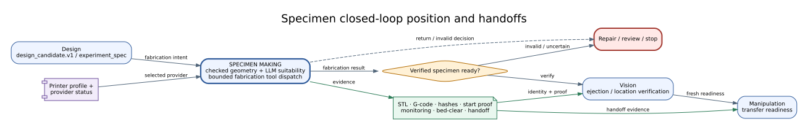
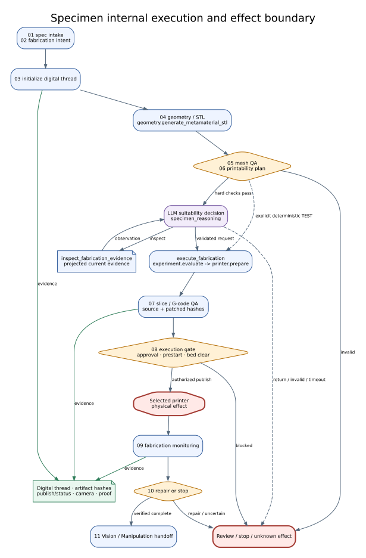
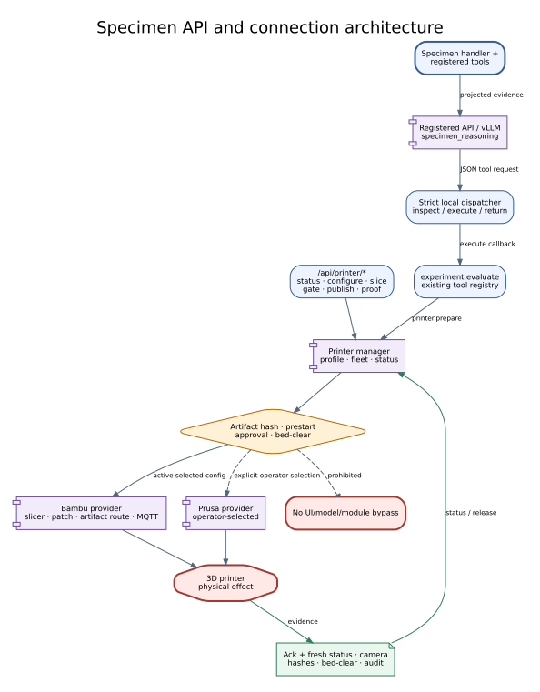

# Specimen Making Agent Reference

## Summary

`SpecimenMakingAgent` turns an approved experiment specification into a
manufacturing digital thread: geometry, mesh and manufacturability evidence,
process/slice artifacts, printer execution state, fabrication monitoring, and
a specimen handoff. Physical printing occurs only through the printer service
and provider gates.

## Scope

The agent owns specimen preparation logic and evidence packaging. Printer
transport, provider protocols, Vision confirmation, and robot transfer remain
separate services/agents.

## Source of Truth

Agent and module files plus Bambu/Prusa bridge implementations, printer routes,
geometry/artifact tools, and hardware Guides.

## Actual Role

| Does | Does not |
|---|---|
| Validate required fabrication fields | Design the experiment objective |
| Generate/check geometry and process artifacts | Publish an invalid or unapproved job |
| Prepare provider-specific print execution | Treat MQTT acceptance as proof of physical start |
| Monitor and package fabrication evidence | Self-certify bed clear or autoejection success |
| Handoff specimen state to Vision/Manipulation | Move the specimen with a robot |

## Closed-Loop Position and Handoffs

**Figure Specimen-1.** A constrained Design specification becomes a
manufacturing digital thread and then a Vision-verified handoff to
Manipulation; invalid or uncertain fabrication returns to repair, review, or
stop. This is an `inspection`-backed projection of baseline `0b7627b`, not
evidence of a successful physical print.

| Direction | Component | Contract/state | Purpose | Gate |
|---|---|---|---|---|
| In | Design | experiment specification | fabrication intent | required fields/constraints |
| In | Printer service | fleet/profile/status | resolve provider | connection/readiness |
| Out | Vision | specimen/ejection evidence | verify state and location | fresh camera/proof |
| Out | Manipulation | specimen result/readiness | bounded transfer | Vision and robot preflight |
| Out | Analysis/Knowledge | manufacturing artifacts | provenance/context | artifact hashes |

## Inputs and Outputs

Input is `OrchestratorState` with experiment specification, candidate/specimen
identity, geometry/process constraints, mode, printer profile, and approvals.
Output merged into state includes specimen result, fabrication/process reports,
STL/slice/G-code references, digital-thread evidence, printer/monitor status,
autoejection/bed-clear evidence, decisions, metrics, and handoff packet.

## Internal Execution

| Step ID | Work | Output/failure boundary |
|---|---|---|
| `01_spec_intake` | required field gate | incomplete input blocks |
| `02_resolve_fabrication_intent` | mode/provider/process | unsupported intent blocks |
| `03_initialize_digital_thread` | identity/provenance | immutable references |
| `04_generate_geometry_stl` | geometry/STL | generation artifact/error |
| `05_mesh_dimensional_qa` | mesh/dimensions | QA pass/repair/stop |
| `06_printability_process_plan` | FDM/process plan | manufacturability gate |
| `07_slice_gcode_qa` | slice/G-code validation | source/patched evidence |
| `08_execution_gate` | virtual/live bridge | approval/prestart/start gate |
| `09_fabrication_monitoring` | runtime/video/status | observation evidence |
| `10_repair_or_stop_decision` | bounded response | repair/review/stop |
| `11_handoff_vision_manipulation` | specimen-ready packet | verification required |

**Figure Specimen-2.** Eleven internal entries keep specification intake,
digital-thread identity, geometry, QA, slicing, execution gates, physical
printing, monitoring, recovery, and handoff distinct. This `inspection` figure
groups manifest entries and does not claim independent graph scheduling or
physical reliability.

### Execution trace details

| Phase | State/identity | Operation and gate | Evidence written | Recovery boundary |
|---|---|---|---|---|
| Specification | candidate/specimen ID, geometry/process constraints | required-field and fabrication-intent validation | accepted intent or blocker | return incomplete input; do not infer defaults as accepted |
| Geometry | design parameters and unit contract | generate STL, then mesh/dimension QA | STL path/hash and QA report | bounded regeneration followed by the same QA |
| Process planning | material/profile/provider constraints | manufacturability and process validation | plan and rejection reasons | unsupported process blocks slicing |
| Slicing | source STL and selected profile | slice, patch where configured, validate G-code | source/patched hashes, plate and settings | regenerate from tracked source on mismatch |
| Start | current printer state, approval, bed-clear, prestart proof | draft, start gate, then publish | command draft, gate and publish response | a draft or ack alone is not physical start proof |
| Monitoring | job/provider identity and fresh status/video | observe progress, completion, ejection, and bed state | fresh status, camera and bed-clear evidence | unknown state requires inspection, not blind republish |
| Handoff | verified specimen and digital thread | package Vision/Manipulation request | specimen result and handoff artifact | no next job or transfer without matching proof |

## API Surface

| Class | Method | Path/family | Service | Effect | Notes |
|---|---|---|---|---|---|
| connected | GET | `/api/printer/status`, `/video-*`, `/fleet`, `/connection`, `/profile` | printer manager | read_only | selected provider and monitoring |
| operator | POST | `/api/printer/fleet`, `/connection`, `/profile` | printer manager | local_state/external_service | configuration/selection |
| connected | POST | `/api/printer/bambu-slice-artifact`, `/bambu-autoejection-patch`, `/bambu-prestart-check` | Bambu artifact pipeline | local_state | prepares validated files |
| connected | POST | `/api/printer/start-command-draft`, `/start-gate` | printer start service | local_state | no publish by itself |
| connected | POST | `/api/printer/start-publish` | provider bridge | physical_possible | requires current gates/proof context |
| connected | GET/POST | `/api/printer/bed-clear`, `/autoejection-status`, `/autoejection-*` | autoejection service | read_only/physical_possible | test/sweep can move printer when live |
| operator | POST | `/api/printer/bambu-autoejection-proof-template`, `/bambu-autoejection-completion-audit` | audit service | local_state | verifies proof package |
| shared | GET/POST | `/api/modules/*` | module platform | read_only/local_state | module lifecycle, not specimen execution |

## Tools and Connections

| Tool/service | Implementation | Boundary | Effect | Evidence |
|---|---|---|---|---|
| `geometry.generate_metamaterial_stl` | geometry tool | in-process/files | local_state | STL/hash |
| `geometry.check_mesh_quality` | geometry tool | in-process | read_only | QA report |
| `geometry.check_manufacturability` | geometry tool | in-process | read_only | manufacturability report |
| `artifact.create_specimen_handoff` | artifact tool | files | local_state | handoff artifact |
| `experiment.evaluate` | experiment service | in-process | local_state | evaluation record |
| `printer.prepare` | printer manager | provider bridge | physical_possible | preparation/start evidence |
| Bambu provider | MQTT + HTTP artifact path | external printer | physical_possible | ack, fresh status, hashes, proof |
| Prusa provider | operator-selected bridge | external printer | physical_possible | provider-specific evidence |

The module LLM role is `tool_formatting`; tool selection and device gates remain
outside unrestricted model authority.

**Figure Specimen-3.** Printer APIs and `printer.prepare` reach a selected
provider only through the printer manager and artifact, approval, prestart, and
bed-clear gates; device status and proof return on a separate evidence path.
Bambu and operator-selected Prusa are different inspected configurations. This
`inspection` figure is not comparative or live-reliability evidence.

### Connection lifecycle

| Lifecycle | Boundary | Required observation | Failure rule |
|---|---|---|---|
| Resolve | fleet/profile and provider selection | stable provider/job/profile identity | no silent provider fallback |
| Prepare | geometry, slicer, G-code patch and artifact route | tracked source and patched hashes | mismatched or missing artifact blocks start |
| Preflight | connection, safe state, approval and bed-clear | current prestart snapshot with no blocker | stale readiness cannot authorize publish |
| Invoke | start gate then provider publish | command identity, topic/path, ack | retry requires known no-effect or resolved state |
| Observe | fresh provider status, video/camera, progress | post-publish state tied to the job | accepted-but-not-started remains explicit |
| Persist/release | proof package and completion audit | hashes, status, ejection and bed-clear evidence | next job remains blocked until release proof |

No UI card, model response, or module display descriptor can bypass the
printer manager, selected provider, Guardian/operator policy, or proof path.

## State, Events, Artifacts, and Storage

The digital thread links candidate/specimen IDs, source STL, slice/G-code,
patched autoejection artifact, hashes, plate/job/provider identifiers, start
gate/publish response, fresh post-publish status, monitoring, camera/bed-clear
evidence, and handoff. Printer workspace snapshots and events are views over
provider/service state.

## Modes and Fallbacks

Test/virtual paths generate artifacts without claiming physical fabrication.
Live requires selected provider, connection, prestart, approval, publish, and
fresh observation. Bambu is the default active profile; Prusa is an explicit
operator selection, not a silent fallback.

## Safety, Approval, and Effect Boundary

Physical start requires validated artifacts, safe printer state, configured
Guardian/operator confirmation, dry-run/prestart gates, and a current bed-clear
contract. Publish acceptance and physical start are distinct. Autogenerated
G-code remains validated and hashed. Post-ejection next-job release requires
bed-clear evidence.

## Errors and Recovery

| Failure | Recovery | Prohibited action |
|---|---|---|
| mesh/process invalid | bounded repair then revalidate | publish anyway |
| artifact/hash mismatch | regenerate from source | substitute untracked file |
| accepted but not started | inspect fresh provider state | declare running |
| timeout/unknown print state | query printer/camera/proof | republish blindly |
| bed not clear | operator/vision verification | start next job |
| provider unavailable | explicit reselection/test | silent provider fallback |

## Operator and GUI Surfaces

The 3DP workspace exposes fleet, connection, live status/video, slicing,
prestart, start, autoejection, bed-clear, and proof/audit functions. Live GUI
shows the agent's manufacturing report and evidence. UI confirmation does not
bypass server/provider gates.

## Current Verification

Verified against the class, 11 internal IDs, six tools, 27 primary printer API
entries plus artifact routes, and current Bambu/Prusa provider sources at
baseline `0b7627b`.

## Limitations and Known Gaps

No paper-scoped result establishes print yield, dimensional accuracy,
autoejection reliability, or cross-printer compatibility. Optional slicer,
camera, and provider availability varies by environment.

## Related Documents

- [Agent Matrix](agent_api_connection_matrix.md)
- [Design](design_agent.md)
- [Vision](vision_agent.md)
- [Manipulation](manipulation_agent.md)
- [Bambu Runtime Guide](../hardware/bambulab_x2d_device_bridge_runtime_guideline.md)
- [3DP Usage Guide](../tutorials/device_workspace_3dp_usage.ko.md)
