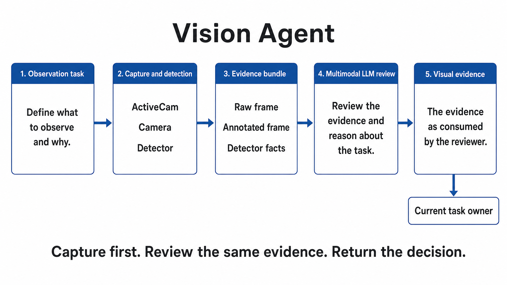

<!-- atr-doc
doc_type: reference
subtype: system
status: active
authority: descriptive
audience: [researcher, operator, developer, maintainer]
scope: [agents, vision, perception, verification, decision_tools]
summary: Bounded multimodal Vision decisions over existing capture, detector, freshness, rollout-stop, and evidence contracts.
source_of_truth:
  - agents/vision_agent.py
  - agents/vision_decision.py
  - agents/base_agent.py
  - orchestrator/langgraph_runtime.py
  - backends/llm_backend.py
  - graphs/modules/vision/module.yaml
  - device_bridges/utm_runtime_bridge.py
  - device_bridges/lerobot_bridge.py
  - app/main.py
  - utils/utm_clear_cycle.py
  - utils/utm_specimen_presence.py
  - mcp_tools/camera_tools.py
last_verified: 2026-09-08
verified_against: working-tree
related_docs:
  - docs/agents/README.md
  - docs/agents/agent_api_connection_matrix.md
  - docs/agents/specimen_agent.md
  - docs/agents/manipulation_agent.md
  - docs/agents/equipment_agent.md
  - docs/agents/vision_pickup_observation_runtime_guideline.txt
supersedes: []
-->

# Vision Agent Reference



*Role overview; detailed execution and connection diagrams follow below.*

## Status at a Glance

| At a glance | Details |
|---|---|
| Runtime status | Existing deterministic paths plus the bounded decision integration are implemented in the working tree |
| LLM decision layer | Generic multimodal review implemented; revised API/local choices matched 12/13 development expectations each, with remaining errors |
| Physical effect | Possible through existing ActiveCam move/capture/return and verified rollout-stop paths |
| Primary handoff | `vision_signal.v1` and role-specific verification evidence to the current graph consumer |
| Live hardware validation | Not performed for this reconstruction |
| Known gap | LIVE downstream handoffs keep their 5-second freshness bound; observed local-vLLM reviews exceeded it |

## Overview and Responsibilities

The existing LLM decision boundary receives a bounded, reference-only
[AX4LAB Wiki pack](../knowledge/wiki_memory.md). This supplies platform context
without changing this agent's tools, numerical authority or execution gates.

`VisionAgent` turns a bounded observation task into current visual evidence. Existing
code owns task resolution, camera and session identity, capture, detector facts,
coordinates, thresholds, freshness, rollout state, and final handoff gates. The
bounded decision layer may select an existing verification routine and may accept
or return the raw-plus-annotated evidence from that same capture.

This is not a replacement detector. The model does not estimate coordinates, edit
thresholds, choose a mode, retimestamp evidence, grant approval, or issue arbitrary
camera/robot/UTM/desktop commands.

| Owned by Vision | Not owned |
|---|---|
| Observation-contract selection within the current Vision task | Experiment planning, graph routing, or another agent's task |
| Existing capture/detector invocation through code-owned callbacks | Free-form bridge methods, driver arguments, poses, ROI, or thresholds |
| Same-capture raw/annotated evidence review | Treating image text or model output as executable instruction |
| Freshness, identity, contradiction, and detector hard gates | Extending TTL or treating stale evidence as current truth |
| Vision reports, signals, decisions, and evidence provenance | Guardian/operator approval or scientific measurement |

### Five-Area Responsibility Map

The five areas are responsibility boundaries, not five sequential model calls.

| Area | Vision responsibility | Authority boundary |
|---|---|---|
| High-Level Control | Decide whether the current bounded observation contract is appropriate and whether current visual evidence supports the requested handoff | Orchestrator owns the mission and graph route; the model cannot select another domain task or declare physical safety |
| Middle-Level Control | Assemble current context, expose the bounded tool set, dispatch the selected existing routine, and combine model decisions with code-owned gates | Existing task resolver, capture ordering, detector result, freshness, and completion state remain authoritative |
| Low-Level Control | Existing camera acquisition, ActiveCam move/capture/return, detector execution, artifact writing, rollout status/stop, and managed-clear operations | Bridges own ports, calibration, robot/process state, replay execution, and command acknowledgement |
| Guardian / Safety | Identity, mode, stop flags, lease, lifecycle, freshness, interlock, decision budget, and hard-gate enforcement | No model response overrides a failed detector, missing stop acknowledgement, stale signal, or Guardian decision |
| Knowledge / Evidence | Preserve `vision_decision.v1`, model/tool trace, raw and annotated image hashes, detector facts, and existing reports/signals | Historical, virtual, mock, or mismatched evidence is never promoted to current physical proof |

## Closed-Loop Position and Handoffs

After accepted placement/clearance evidence and confirmed robot termination, the
existing sidecar invokes [Manipulation's task-result judgment](manipulation_agent.md#bounded-decision-contract)
using the Manipulation module's model binding. Vision retains its visual facts;
Manipulation acceptance is additionally required for task handoff. Robot stop does
not wait for that judgment.


**Figure Vision-1.** Implementation-inspection projection of the bounded Vision
decision layer around the existing graph and domain boundaries. Solid paths are
current runtime/evidence flows; dashed branches are review/return or explicit
non-LLM TEST behavior. The figure is not physical-validation evidence.

| Boundary | Input/output | Authority and gate |
|---|---|---|
| In: runtime | `OrchestratorState`, current task, run/loop/specimen/session/mode including metadata specimen scope | Runtime supplies scope; the model cannot rewrite it |
| In: Specimen | fabrication/ejection context and pickup target | Matching specimen and configured path required |
| In: Manipulation | rollout/session/post-place state | Placement polling and verified stop remain code-owned |
| In: managed clearance | completed replay, measured-home return, fresh UTM capture | No model wait while replay is running or being stopped |
| In: detector | raw frame, annotated copy, detector facts from one capture | Both images are required and must have matching dimensions |
| Out: graph consumers | existing `vision_report.v1`, `vision_signal.v1`, ejection/placement/clearance contracts | Existing deterministic gates decide ready/pending/blocked |
| Out: evidence | `vision_decision.v1`, image hashes/labels, evidence refs, artifacts | Additive record; does not overwrite capture timestamps or detector truth |

## Internal Workflow

| Phase | Implementation | Effect boundary |
|---|---|---|
| Resolve | Existing Vision task and domain context | Unsupported or mismatched task remains blocked/review |
| Select | `select_vision_tool(..., contract_id)` | JSON choice is `execute_verification` or `return_to_owner`; no driver arguments |
| Execute | Existing code-owned callback/routine | Pickup capture may be read-only; ActiveCam may move the robot to capture and return |
| Detect | Existing detector and hard gates | Model does not calculate boxes, coordinates, confidence, ROI, or status |
| Review | `review_visual_evidence(..., capture, contract_id)` | JSON choice is `accept_visual_evidence` or `return_to_owner` over same-capture evidence |
| Finalize | Existing report/signal/verification builders | Code rechecks identity, stop flags, freshness, session and domain gates |
| Archive | Existing execution artifact path plus decision artifact | Preserve actual effects and model/tool evidence separately |


**Figure Vision-2.** The model chooses only a registered local action. ActiveCam
is deliberately shown as physical-possible because its existing routine moves the
robot, captures, and returns it. Placement review occurs only after the verified
rollout stop; clearance review occurs only after completed replay and measured
return. Polling and mandatory stop/cancel paths never wait on the model.

### Path-Specific Ordering

| Path | Decision and evidence order | Completion rule |
|---|---|---|
| Pickup | Select existing verification, capture, review same-capture raw/annotated images plus detector facts | Existing pickup gates pass and evidence remains within the 5-second TTL |
| ActiveCam ejection | Select the existing composite routine, then robot move → capture → return, detector, and same-capture review | Existing ejection, artifact, camera-return and port-release gates pass; no automatic model-driven rerun |
| Manipulation placement | Existing status/interlock and capture polling runs without LLM awaits; existing code verifies and canonically records STOPPED for the matching rollout; only then review its current raw/annotated evidence | Preserve `needs_post_place_vision` / `stopped_pending_visual_review` until acceptance; reuse a same-session verified STOPPED result without repeating the stop |
| Post-test clearance | Existing managed replay monitoring/cancel/timeout and measured-home return complete first; then review a fresh registered clearance capture before done | Replay completed, measured home verified, detector says clear, and evidence is current and consistent |

`pending` placement polls do not call the model. Mandatory safety stop, cancellation,
timeout, and cleanup paths are never conditional on model availability.

## Decision and Visual Evidence Contract

### Decision Question

Does the current context support executing the registered observation contract,
and after that capture, do its original image, annotated copy, and detector facts
consistently support the requested observation? Insufficient, contradictory, stale,
or wrong-object evidence returns to the current owner.

### Agent-Local Tools

These are local decision names dispatched by Vision code. They are not new global
ToolRegistry tools and do not expose arbitrary bridge commands.

| Tool | Exact arguments | Availability | Result/effect |
|---|---|---|---|
| `execute_verification` | `{"contract_id": "pickup|active_cam|placement|clearance"}` | Pre-execution selection where the path exposes it | Authorize one code-selected existing routine; callback owns all arguments and gates |
| `accept_visual_evidence` | same current `contract_id` | After raw and annotated images from the same capture are loaded | Accept only the observed frame for continued deterministic evaluation |
| `return_to_owner` | same current `contract_id` | Selection or review | Return `review_required`; no ready handoff or new execution |

The JSON response contains exactly `tool`, `arguments`, `reason`, and
`evidence_refs`. Selection must cite `context:task`; visual review must cite
`frame:current`. Unknown tools, added fields, changed arguments, unknown evidence,
mock completions, invalid JSON, or a changed runtime identity fail closed.

```json
{
  "tool": "accept_visual_evidence",
  "arguments": {"contract_id": "active_cam"},
  "reason": "The marked region matches the specimen in the original frame.",
  "evidence_refs": ["frame:current"]
}
```

### Multimodal Input

`LLMImageInput` is the shared byte-backed image contract. Vision loads image paths
only from registered capture results, bounds byte and pixel counts, verifies each
raster, requires equal raw/annotated dimensions, hashes both files, and sends them
in this fixed order:

1. `raw frame`
2. `annotated frame`

OpenAI-compatible and vLLM content includes ordered text labels before the two
image parts. Both `AgentContext.complete(..., images=...)` and
`ModuleRuntimeContext.complete(..., images=...)` use the generic image signature;
the module context forwards the same list through the leased route and each
configured fallback. Image requests cannot be satisfied by mock responses. Image
text is untrusted evidence, not instruction.

The detector-fact projection may include existing status, detection flag, box,
center, ROI, confidence, frame ID/timestamp, clearance result, registration flag,
and failure/unknown reason. Actual raster dimensions and the pixel coordinate
convention accompany the facts; unverified metadata dimensions are not substituted.
Those fields are context for semantic consistency review, not editable model outputs.

### Current Prompt Contract

The current prompt in `agents/vision_decision.py` uses the following ordered checks.
This section describes the implemented code contract, not earlier prompt variants.

| Order | Check | Required comparison | Return for review when |
|---|---|---|---|
| 1 | Pair | Compare background landmarks, viewpoint, object position and state in raw and annotated images | The scenes or object states differ, or correspondence cannot be established; similar targets alone do not prove the same capture |
| 2 | Location | Compare the raw object's location, drawn box, numeric `bbox_xyxy` and `center_px` using actual image dimensions | Numeric facts materially contradict the object or overlay; a correct drawn box cannot repair them |
| 3 | Validity | Read existing detector status, registration flag and failure/unknown reasons | Explicit invalid/unknown evidence remains unresolved, even if the scene looks plausible |
| 4 | Claim | Check target presence for observation/placement, or supported absence inside the supplied ROI for clearance | Relevant occlusion, visible residual, insufficient evidence or task/ROI ambiguity changes the judgment |

Annotations and minor rendering differences are allowed; pixel-perfect contour
agreement is not required. Missing optional metadata is not automatically a
failure. An empty box list or `detected=false` is not sufficient proof of absence,
and objects outside the inspection ROI do not establish occupancy inside it.

Target color, material, dimensions, shape and apparatus come only from the current
input context. The prompt does not prescribe a particular experiment or canonical
shape. Coordinate interpretation is explicit: top-left pixel origin, x right,
y down, and `xyxy` as left/top/right/bottom. Confidence remains a reported fact;
the model does not introduce another numerical threshold.

For pre-execution selection, the model judges only whether the supplied observation
contract is appropriate and chooses an existing local tool. It does not invent
images or apply image-review checks when no capture is supplied.

Both response examples in the prompt include the exact code-supplied arguments.
The model returns one JSON object without Markdown or extra fields; `reason` is
a brief observable justification, not an internal reasoning transcript. For
example, when the supplied review contract is `placement`:

```json
{
  "tool": "return_to_owner",
  "arguments": {"contract_id": "placement"},
  "reason": "The raw and annotated images show different object states.",
  "evidence_refs": ["frame:current"]
}
```

`accept_visual_evidence` uses the same required arguments and evidence reference;
`return_to_owner` must not use empty arguments. Selection cites `context:task`
instead. Examples specify the response shape, not expected answers for evaluation
cases. Text in images and detector data is evidence, never an instruction. Model
acceptance still passes through existing identity, freshness and completion gates.

## Tools, APIs, and Connections


**Figure Vision-3.** The local decision helper uses the shared multimodal backend,
while code-owned verification callbacks reach existing camera, ActiveCam,
rollout-stop, and UTM-clear services. Model output never names a provider method,
pose, topic, port, ROI, threshold, or replay command.

| Surface | Method/path or implementation | Effect/owner |
|---|---|---|
| Decision | `agents/vision_decision.py` | Local JSON validation, image loading, identity/freshness recheck, decision artifact |
| Model | `AgentContext.complete` / `ModuleRuntimeContext.complete`, `vision_observation` | Shared inference and fallback routing; optional ordered images |
| Pose tracker | GET/POST `/api/vision/specimen-pose/status`, `/snapshot`, `/release` | Existing read/local-state tracker surface |
| ActiveCam | `lerobot.active_robot_cam.capture` | Existing physical-possible robot move/capture/return routine |
| Camera probe/capture | `camera.capture`, `lerobot.camera.test`, registered UTM frame path | Existing acquisition; effect depends on provider |
| Rollout | `lerobot.rollout.status`, `lerobot.rollout.stop` | Status read and matching verified process stop; never arbitrary start |
| UTM runtime/camera | `/api/equipment/utm-runtime/*`, registered capture service | Existing runtime and visual evidence surfaces |
| Managed clearance | `utils/utm_clear_cycle.py` | Existing replay lifecycle, measured return, and Verification 2 ordering; model cannot call `replay.start` |

### Existing ActiveCam Effect

ActiveCam is not read-only. Its existing routine can command a registered robot
capture pose, acquire the image, and return/release the camera for VLA use. The
model can select only the whole registered verification contract; it cannot provide
a pose, split the routine, change waits, or invoke an automatic retry. A failed or
ambiguous result returns through existing operator/recovery ownership.

## Existing Observation and Handoff Contracts

The reconstruction preserves `vision_report.v1`, `vision_signal.v1`,
`active_cam_ejection_check.v1`, `spc_autoejection_confirmation.v1`,
`vision_manipulation_completion.v1`, and the separate UTM Verification 1/2
records. `vision_decision.v1` is additive and records scope, checkpoint, model use,
selected tool, reason, evidence refs, image hashes, and error/failure state.

| Existing result | Meaning | Model limitation |
|---|---|---|
| `ready` / accepted handoff | All required current code-owned gates passed | Model acceptance alone cannot produce it |
| `pending` | Existing routine is waiting for a real lifecycle or observation condition | Polling does not repeatedly call the model |
| `review_required` | Model unavailable/invalid, evidence expired/contradictory, or owner review selected | Cannot be silently converted to ready |
| `blocked` / `unknown` | Capture, detector, identity, session, stop, registration, or hard gate failed | Model cannot override or retimestamp it |

## Post-Test Clearance Baseline

Verification 1 remains placement evidence. Verification 2 uses the separate
post-clear detector after managed replay completion and measured robot return.
The accepted camera topic, registration anchors, platen ROI, red-residual rules,
material provenance, and thresholds remain unchanged; the model does not adjust
them.

| Result | Existing deterministic meaning | Analysis handoff |
|---|---|---|
| `occupied` | Registered current frame contains sufficient specimen residual | Blocked |
| `clear` | Registered fresh frame supports absence in the inspection region | Allowed only with successful replay, measured return, and accepted visual review |
| `unknown` | Capture, registration, identity, freshness, or material evidence insufficient | Blocked |

A failed capture is never absence. Verification 2 owns distinct raw/annotated
artifacts and does not overwrite placement evidence. The model sees only the same
capture pair selected by existing code.

## Configuration and Modes

| Setting/mode | Behavior |
|---|---|
| `vision_observation` | Existing model role used by the bounded decision helper |
| `run_metadata.vision_decision_settings.timeout_s` | Per-call timeout; positive finite value no greater than 300 seconds, default 45 |
| Normal API/vLLM runtime | Real backend decision required at an exposed decision checkpoint; invalid/mock output returns review |
| `Mode.TEST` without `force_real_llm_in_test` | Explicit `deterministic_test`, `llm_used=false`; not visual validation |
| Forced-real TEST fixture | Exercises the registered API/vLLM model route; must not be described as deterministic-test validation |
| Replay/virtual evidence | Retains its original environment label; never promoted to Live physical proof |

The decision timeout does not extend camera, motion, rollout, replay, or task
deadlines. There is no TTL increase and no timestamp rewrite. For pickup and
ActiveCam, the existing LIVE signal TTL remains 5,000 ms; a slower decision yields
`VISION_EVIDENCE_EXPIRED`/review and requires a new observation through existing
ownership. The helper reuses `ManipulationAgent` freshness semantics, including
the pre-existing 120-second TEST-only grace; this is not a new model-latency grace
and does not alter LIVE behavior.

## Safety, Recovery, and Idempotency

| Condition | Required behavior |
|---|---|
| Stop/safe-stop/E-stop requested | Decision fails closed; mandatory cleanup/stop continues without waiting for model |
| Run/loop/specimen/session/task/mode or metadata specimen scope changed during inference | Discard decision and return a valid blocked observation for the new scope |
| Missing, oversized, invalid, or dimension-mismatched image pair | Return review; do not call acceptance |
| Detector contradiction, wrong object, occlusion, or insufficient clearance evidence | `return_to_owner`/review; hard gate remains authoritative |
| Pickup/ActiveCam evidence older than TTL after review | Reject as expired; do not retimestamp or lengthen TTL |
| ActiveCam failure or ambiguous effect | Do not automatically rerun robot motion; use existing recovery/operator path |
| Placement still pending | Continue code-owned polling/interlock; no LLM await |
| Rollout stop unverified | No placement completion, regardless of image/model result |
| Placement review delayed, rejected, or cancelled after stop | Keep the pending-visual-review handoff/status; a same-session retry reuses the verified STOPPED result without another stop call |
| Replay incomplete or measured return missing | No clearance review or done state |
| Mock/model error/invalid JSON/timeout | Preserve completed physical/capture facts, but leave undecided handoff in review |

Completed effects are never undone or repeated merely because the model returned
late or failed. Callers keep the deterministic final gate and existing runtime
retry policy.

## Operator and GUI Surfaces

Existing Vision, LeRobot, UTM, agent-report, event, and artifact surfaces remain
projections over runtime state. They may display the current decision, evidence
pair, detector facts, freshness, and owner-review reason. A UI action or image
preview does not grant capture, motion, rollout, replay, or equipment authority.

## Verification Status and Evidence

The opt-in [registered multimodal verification script](../../scripts/verify_vision_multimodal.py)
was run with `--execute` against the configured routes. All eight fixture decisions
were accepted:

| Registered route | Selection | Upright | Compressed | Synthetic empty |
|---|---:|---:|---:|---:|
| API `gpt-5.5` | 5.076 s | 4.058 s | 4.220 s | 11.739 s |
| vLLM `e4b` fallback `gemma4:31b` | 4.901 s | 8.302 s | 8.380 s | 8.458 s |

The run registered no hardware tools and performed no physical actuation, service
start, or configuration edit. The upright and compressed source fixtures remained
unchanged; the empty image was synthetic and is not UTM-clearance proof. Results
were recorded in a temporary local report rather than a repository evidence file.

An additional archived-artifact cross-check exercised 13 inputs on each backend:
eight natural captures and five in-memory detector/image-pair perturbations.
All 26 real calls returned without timeout; source image hashes were unchanged.
Historical timestamps were preserved. Expected choices were declared before the
calls and were not sent to the models. They are reference expectations, not an
independently labelled accuracy benchmark.

| Archived input / perturbation | API `gpt-5.5` | Local vLLM `gemma4:31b` |
|---|---|---|
| ActiveCam A/B, placement A/B, compressed reference | Accept | Accept |
| Clear A | Accept | Accept |
| Clear B, recorded as clear by detector | Return: possible residual | Accept |
| Detector `unknown`, visually empty inspection region | Accept | Accept |
| Compressed specimen falsely reported clear | Return | Return intent; invalid arguments |
| Empty region falsely reported occupied | Return | Return intent; invalid arguments |
| Incorrect numeric detector box | Accept; contradiction missed | Accept; contradiction missed |
| Different-camera raw/annotated pair | Accept; mismatch missed | Accept; mismatch missed |
| Compressed raw + upright annotated pair | Accept; mismatch missed | Accept; mismatch missed |

API case latency was 4.061–9.787 seconds; local was 6.234–9.964 seconds.
Declared semantic-choice matches were 8/13 and 9/13, respectively, with tool-choice
agreement on 12/13 inputs. These counts do not imply valid tool execution: local
returned empty `arguments` in its two rejection responses, omitting `contract_id`;
strict parsing rejected both into review. API supplied valid arguments in all
13 responses. The Clear B discrepancy lacks independent human ground truth.

Both historical ActiveCam cases on both backends remained
`VISION_EVIDENCE_EXPIRED` after model acceptance. For clearance, the helper's
visual acceptance is not workflow completion: regression tests explicitly verify
that detector `unknown` or occupied states still block Verification 2 and Analysis.
Image paths/digests confirmed that intentionally mismatched pairs reached the
model; this check does not prove that the model attended to both images.

The input manifest and exact response reports were retained locally at
`/tmp/atr-vision-crosscheck-pDiiDg/input_manifest.json`,
`/tmp/atr-vision-multimodal-e0rujdv8/results.json` (API), and
`/tmp/atr-vision-multimodal-jq8s8wpj/results.json` (local). These temporary files
are not published repository evidence. Reproduction uses the verification script's
`--artifact-manifest` and `--backend` options against available archived captures.

These results describe the initial prompt. The subsequent
[generic prompt comparison](../paper/evidence/2026-09-08-vision-generic-prompt-verification.md)
records a new controlled baseline, the revised prompt/input context, held-out
checks, and remaining errors. The initial 8/8 fixture result is not a claim that
the larger cross-check passed.

The combined regression run after prompt refinement over 14 files reported
271 passes and 10 existing warnings in 14.18 seconds. Focused runs overlap this
coverage and are not added again.
No physical-motion or live-safety validation was performed.

Earlier records for ActiveCam, placement, and UTM Verification 2 validate portions
of the pre-existing deterministic workflow only. They do not validate the new
multimodal decision layer. In particular, prior supervised-loop and compressed
specimen camera evidence must not be reinterpreted as proof of model judgment,
decision latency, or physical safety.

## Limitations and Known Gaps

- The LIVE 5-second freshness bound for pickup/ActiveCam signals and downstream
  handoffs is intentionally unchanged. Pickup explicitly checks expiry after model review.
  The measured local-vLLM image reviews took 8.302--8.458 seconds, so a LIVE
  capture can expire and require owner-driven reobservation. TEST retains its
  existing 120-second grace only for its established test semantics.
- Placement inspection retains its durable image proof, but existing emitted
  signals retain their original expiry and downstream gates remain unchanged.
- No benchmark establishes visual-decision accuracy, calibration robustness,
  lighting robustness, latency, or safety effectiveness.
- Initial archived cross-checks exposed missed numeric-box and cross-image contradictions.
  Model acceptance does not guarantee pair provenance or coordinate consistency;
  the current loader validates image structure/size and records hashes, not
  pixel-level same-capture correspondence. These checks must not be delegated to
  model judgment alone. The revised prompt corrected tested numeric-box and
  different-camera cases and local rejection arguments, but a same-background
  changed-object-state pair still escaped the local model in the development set.
  API also returned one detector-labelled clear capture for possible residual;
  that case lacks independent ground truth.
- Acceptance checks semantic consistency only for the current frame; it does not
  establish future scene state, calibrated coordinates, fixture alignment,
  scientific measurement, or physical safety.
- Backend/provider multimodal support and camera availability remain
  environment-dependent.

## Related Documents

- [Agent Matrix](agent_api_connection_matrix.md)
- [Specimen](specimen_agent.md)
- [Manipulation](manipulation_agent.md)
- [Equipment](equipment_agent.md)
- [Three-Level Control Model](../runtime/three_level_control_model.md)
- [Legacy Vision Guideline](vision_pickup_observation_runtime_guideline.txt)
- [Vision Camera Bridge Guide](../tutorials/device_workspace_vision_camera_bridge_usage.ko.md)
