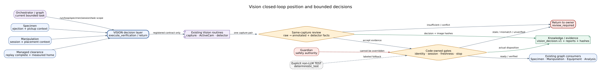
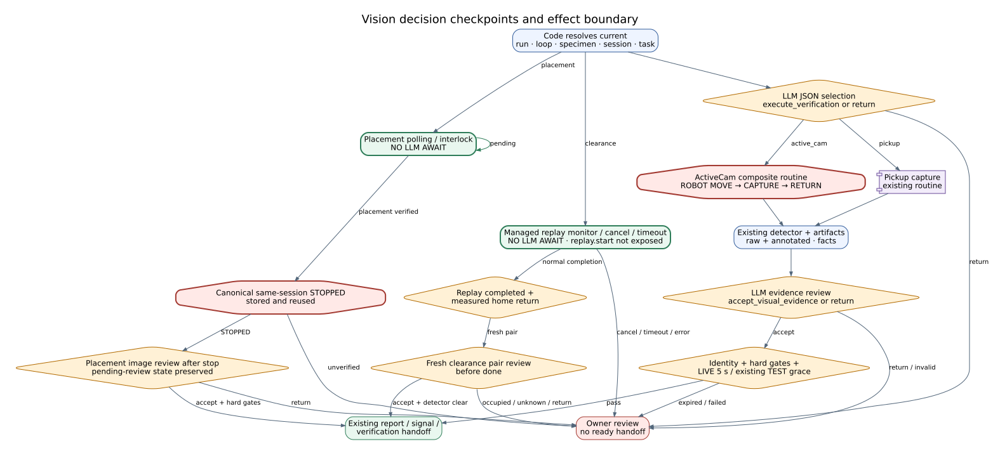
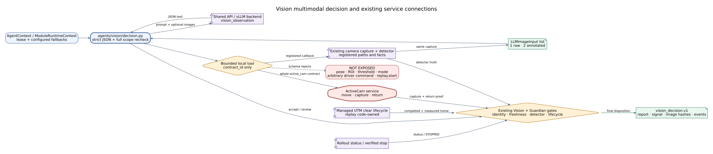

# Vision Agent Reference

## Summary

`VisionAgent` observes laboratory state and emits freshness-bounded evidence and
signals. It resolves observation tasks/zones, captures scenes, estimates state,
detects temporal events, arbitrates signals, and packages `vision_report.v1`
and `vision_signal.v1`. It may stop an active robot rollout after verified UTM
placement; it cannot start robot motion or command printer, UTM, or PyAutoGUI
actions.

For post-test UTM clearance it monitors the scoped managed replay and confirms
absence only after successful replay and measured robot return. It may stop
that pending replay on cancellation or timeout, but cannot start the sweep.

## Scope

Included are specimen pose, pickup/transfer readiness, active robot-camera
ejection checks, UTM placement verification, capture/runtime connections, and
evidence freshness. General computer-vision accuracy is not established.

## Source of Truth

Vision agent/module files, UTM and LeRobot bridge implementations, specimen-pose
tracker routes, and current camera/UTM Guides.

## Actual Role

| Does | Does not |
|---|---|
| Capture and interpret bounded observation tasks | Plan the experiment or choose robot policy |
| Emit pose, readiness, event, and freshness state | Convert stale signals into current truth |
| Confirm autoejection/placement where configured | Start printer, robot, UTM, or desktop action |
| Request/perform verified rollout stop | Treat an image alone as scientific measurement |
| Package visual evidence and uncertainty | Override Guardian or equipment proof contracts |

## Three-Level Control Classification

| Level | Vision responsibility | Authority boundary |
|---|---|---|
| High-Level Control | Executes the Vision stage and verification sidecars, then supplies fresh evidence that can permit or block Specimen/Manipulation/Equipment handoffs | Does not choose the overall next cycle and does not mark a physical task complete without the required current observation contract |
| Middle-Level Control | Select camera/runtime evidence, enforce source identity and freshness, evaluate active-camera ejection and UTM post-place observations, package report/signal/evidence, and request verified rollout stop when its completion contract is met | One detection decision must come from one authoritative raw-frame evaluation path; UI overlays are evidence views, not a second detector |
| Low-Level Control | Calls `camera.capture`, LeRobot camera/active-camera tools, UTM runtime/capture tools, and bounded rollout status/stop tools | Camera ownership, ports, ROS/process lifecycle, frame capture, and robot-process stop acknowledgement remain bridge/tool authority |

Capture or port recovery is Low-Level; rebuilding a stale/invalid Vision signal
is Middle-Level; choosing retry, operator placement review, another agent, or a
terminal route is High-Level. Vision Device Workspace controls remain manual.

## Closed-Loop Position and Handoffs

**Figure Vision-1.** Specimen, manipulation, equipment, and camera context
becomes a freshness-bounded signal for downstream consumers; stale, conflicting,
or low-quality observations are rejected, while only a matching verified task
can stop an active rollout. This is an `inspection`-backed projection of
baseline `0b7627b`, not perception-quality or live-safety evidence.

| Direction | Component | Contract/state | Purpose | Gate |
|---|---|---|---|---|
| In | Specimen | specimen/fabrication/ejection context | observation target | specimen identity |
| In | Manipulation | rollout/session/post-place state | verify transfer | camera/session freshness |
| In | Camera/UTM runtime | frames/pose/runtime graph | scene evidence | availability/quality |
| Out | Manipulation | pickup/transfer readiness | enable bounded policy | unexpired signal |
| Out | Equipment | placement/fixture evidence | enable protocol | verified UTM state |
| Out | Specimen | autoejection confirmation | complete fabrication handoff | active-camera evidence |
| Out | Guardian/Knowledge | reports/decisions/evidence refs | safety/provenance | schema/timestamps |

## Inputs and Outputs

Input is `OrchestratorState` with observation task, specimen result, latest
camera/zone state, manipulation session, and mode. Preserved fields include
`observation.pose_estimate`, `pickup_target`, and `transfer_readiness`.
Outputs include `vision_report.v1`, `vision_signal.v1`, decisions, metrics,
evidence refs, `active_cam_ejection_check.v1`,
`spc_autoejection_confirmation.v1`, and where applicable
`vision_manipulation_completion.v1`. Consumers reject `expires_at` in the past.

## Internal Execution

| Step ID | Work | Boundary/output |
|---|---|---|
| `01_observation_task_resolve` | select bounded task | unsupported task blocks |
| `02_zone_registry_load` | load calibrated zones | missing/stale zone degrades/blocks |
| `03_capture_scene` | acquire frame | capture metadata/evidence |
| `03_active_robot_cam_ejection_check` | active-camera tool check | ejection confirmation schemas |
| `04_perception_backend` | select perception/simulator degrade | environment labeled |
| `05_estimate_scene_state` | pose/presence/readiness | estimate + uncertainty |
| `06_detect_temporal_events` | change/event detection | timestamped event |
| `07_arbitrate_agent_signals` | resolve conflicts/freshness | accepted/blocked signal |
| `08_package_visual_evidence` | attach frames/metadata | evidence refs |
| `09_handoff_signal_bus` | emit `vision_signal.v1` | expiry enforced downstream |
| `10_stop_verified_rollout` | stop after verified UTM placement | completion record or stop error |

**Figure Vision-2.** Eleven manifest entries—including both `03_*` entries—
separate task/zone resolution, capture, perception, temporal events,
arbitration, evidence, signal handoff, and verified rollout stop. This
`inspection` figure groups internal contract steps and grants no robot,
printer, UTM, or desktop start authority.

### Execution trace details

| Phase | Required identity/state | Decision/transformation | Evidence/output | Reject or recovery condition |
|---|---|---|---|---|
| Resolve | task, specimen, zone and calibration IDs | choose bounded observation contract | selected task/zone metadata | unsupported task or stale zone blocks/degrades |
| Capture | camera source and current timestamp | acquire frame and active-camera check | raw frame, source, timestamp | capture failure does not invent pose |
| Perception | labeled environment/backend | estimate pose, presence, readiness, uncertainty | estimate and quality fields | unavailable backend remains degraded |
| Temporal events | prior compatible observation | detect change/ejection/placement event | timestamped event | mismatched identity is not compared |
| Arbitration | confidence, expiry, conflicts, task policy | accept, degrade, or reject signal | `vision_report.v1` and `vision_signal.v1` | expired/conflicting signal blocks downstream use |
| Evidence packaging | accepted frame and metadata | bind raw/annotated artifact to run/session/specimen | evidence references | stream display alone is not durable evidence |
| Verified stop | matching rollout session and UTM placement | request stop and observe result | stop result/completion record | failed or unknown stop stays error/review |

## API Surface

| Class | Method | Path/family | Service | Effect | Notes |
|---|---|---|---|---|---|
| owned | GET | `/api/vision/specimen-pose/status` | pose tracker | read_only | current tracking state |
| owned | POST | `/api/vision/specimen-pose/snapshot` | pose tracker | local_state | captures bounded snapshot |
| owned | POST | `/api/vision/specimen-pose/release` | pose tracker | local_state | releases current tracking lock/state |
| connected | GET | `/api/lerobot/active-robot-cam/specimen-pose` | LeRobot camera | read_only | active robot-camera pose |
| connected | POST | `/api/lerobot/camera/test` | LeRobot bridge | read_only/local_state | camera probe |
| connected | GET/POST | `/api/equipment/utm-runtime/status`, `/start`, `/stop`, `/probe`, `/graph`, `/frame`, `/frame-stream.mjpeg` | UTM runtime | read_only/local_state/external_service | runtime and evidence capture |
| operator | GET/POST | `/api/equipment/utm-runtime/camera-*` | UTM camera service | read_only/local_state | device selection/probe/calibration |

## Tools and Connections

| Tool/service | Boundary | Effect | Evidence |
|---|---|---|---|
| `camera.capture` | selected camera bridge | read_only | frame/meta |
| `lerobot.camera.test` | LeRobot bridge | read_only | probe result |
| `lerobot.active_robot_cam.capture` | robot camera | read_only | ejection frame/confirmation |
| `lerobot.rollout.status` | robot session | read_only | rollout state |
| `lerobot.rollout.stop` | robot process | physical_possible | stop result/session |
| `vision.utm_runtime.start` | UTM ROS/runtime process | external_service | graph/health |
| `vision.utm_specimen_presence.capture` | UTM camera | read_only | annotated/raw frame |
| LLM `vision_observation` | selected model | model | bounded observation rationale |

**Figure Vision-3.** Specimen-pose, LeRobot camera, and UTM runtime/camera
surfaces feed pose tracking and signal arbitration; only a fresh task- and
session-matched branch reaches the rollout-stop service. This `inspection`
figure distinguishes observation from process stop and is not live validation.

### Connection lifecycle

| Connection | Resolve/preflight | Invoke/observe | Persist/recover |
|---|---|---|---|
| Pose tracker | specimen and tracker identity | status, bounded snapshot, release | retain snapshot metadata; release does not erase prior evidence |
| LeRobot camera | active robot/session and camera probe | capture active pose/ejection evidence | reject session mismatch or stale camera result |
| UTM runtime | runtime status, graph and camera mapping | start/probe/frame/stream as configured | capture referenced frame; unavailable graph remains explicit |
| UTM calibration | device list and current configuration | probe, apply, calibrate with status | bind calibration identity; do not reuse stale zones silently |
| Rollout stop | matching session plus verified placement | stop request followed by status/result | unknown result requires operator/Guardian inspection |

The workspace or model can request observation, but neither grants an
unregistered camera source nor a start path to robot, printer, UTM, or
PyAutoGUI execution.

## State, Events, Artifacts, and Storage

Vision stores reports/signals in run metadata and emits node/tool/evidence
events. Frame paths, timestamps, camera/zone/calibration identifiers, confidence,
expiry, run/session/specimen identity, and annotated/raw artifacts support the
handoff. Stream frames are external observations, not durable evidence until
captured and referenced.

### Post-test compressed specimen verification

Verification 1 remains the original specimen-placement check. Verification 2
uses a separate post-clear detector, so the thresholds for initial placement
are not relaxed. The current profile recognizes red material, including the
approximately 30 × 10 mm compressed specimen; it does not infer dimensions
from pixels or require an upright aspect ratio.

| Evidence check | Current post-clear contract |
| --- | --- |
| Camera | Shared UTM1/UTM2 `raw_frame()` path: `/camera/image_raw` or `/camera/image_rect`, profile `camera_utm_primary`, 640 × 480; source header time must be fresh and after replay completion |
| Registration | Both lower-platen green anchors must match their configured windows, area, separation and vertical alignment |
| Inspection region | Registered lower-platen ROI `[210,270,390,363]`; discarded material outside the platen is excluded |
| Residual | Red components of at least 8 pixels are aggregated; 150 pixels blocks clearance, including sufficient thin/fragmented pre-opening red evidence |
| Material | Same-cycle Verification 1 must provide the known-red specimen evidence; unsupported material is not silently treated as absent |

UTM2 keeps UTM1's existing unannotated-frame acquisition and topic order. It
does not open a separate camera path or require the raw topic to time out before
accepting a frame. Both accepted topics must pass the same fixed-profile
registration and region checks; display/overlay topics such as `/image_utm`
remain invalid. The detector and downstream clearance gate share the accepted
topic set. No upright-shape or aspect-ratio limit is imposed on compressed
residuals, and absence is never inferred from failed capture or registration.

| Result | Meaning | Analysis |
| --- | --- | --- |
| `occupied` | Residual specimen evidence remains on the platen | Blocked |
| `clear` | Valid, fresh, registered image supports absence | Allowed only with successful replay and measured return |
| `unknown` | Capture, registration, identity, freshness or material evidence is insufficient | Blocked |

A physical clearance capture does not auto-start the camera runtime or fall
back to a virtual image. Failed capture is never evidence of absence.
`run_metadata.utm_verifications` is bound to run, zero-based loop, and specimen;
each record owns its raw/annotated image and evidence references. Unique
capture files preserve attempts in the existing loop archive. Verification 2
does not overwrite the original placement observation.

The Live GUI's two header selectors read that scoped map directly. Missing
Verification 2 stays Pending even if Verification 1 has an image; virtual
confirmation is explicitly distinguished from a real photograph.
Both selectors display the complete frame in a 4:3, contained-image panel;
the title uses a content-sized row rather than consuming unused card height.
The browser layout regression checks both tab layouts at narrow and wide widths.

## Modes and Fallbacks

Test may use virtual frames/signals; simulation degrade is labeled. Replay uses
recorded images/events. Browser displays and requests observations but does not
make them Live evidence. Live depends on current camera/runtime mapping and
calibration. A fallback source creates a different evidence environment.

## Safety, Approval, and Effect Boundary

Observation is read-only. The exceptional effect is stopping a verified active
rollout; it requires matching session and UTM placement evidence. A pending
managed-clear replay can also be stopped on cancellation/timeout. Vision never
starts motion. Stale signals block downstream physical handoff. Camera
availability is not proof of safe equipment state.

## Errors and Recovery

Capture failure or missing calibration triggers retry/degrade/review without
inventing pose. Conflicting or expired signals are rejected. Unknown robot
state requires rollout status and operator/Guardian review. Failed stop remains
an explicit error; do not claim the robot stopped from a request alone.

For UTM topic reads, a successful final frame may supersede a timeout from an
earlier topic attempt within that same capture. The 2026-09-06 Guardian update
requires a successful capture, an available successful frame, and a final
successful attempt matching the selected topic before excluding those exact
historical `ROS_IMAGE_TIMEOUT` alarms. Attempt history remains in the artifact.
Current frame errors, other cameras, stop failures, and all other interlocks
remain authoritative. Both detected-specimen success and existing non-detection
retry behavior are covered; a successful frame is not by itself transfer proof.

Offline replay of `run-20260906T113555Z-8b3e30`, loop 1, Vision attempt 12,
retained the low-confidence warning but removed the superseded timeout block,
routing to Equipment without incrementing the loop. Equipment was not executed
in this replay. The original first-topic timeout's physical/transport cause
and any timing sensitivity to ActiveCam startup remain unverified; neither
camera timeout budgets nor shared recording/rollout warmup were relaxed.

## Operator and GUI Surfaces

Vision/UTM workspace exposes runtime graph, frame, stream, device mapping,
probe, apply, and calibration. LeRobot workspace exposes camera tests and active
pose. Live GUI displays report/signal/evidence and freshness state.

## Current Verification

ActiveCam's shared frame-detector subprocess response budget defaults to
15 seconds (previously 5), configurable through
`ATR_SPECIMEN_POSE_FRAME_TIMEOUT_S`. This working-tree headroom adjustment
does not change robot capture/return waits, pose validity, detection thresholds,
or signal freshness. `test_active_cam_response_budget.py` verifies acceptance
of an 8-second simulated detector response, bounded timeout of a 20-second
response, and preservation of an explicit shorter override, without actuation.
The reported intermittent timeout was not localized in this run's retained
results, so this is a response-budget adjustment, not a confirmed root-cause
claim. New ActiveCam subprocesses load the change; existing rollout processes
are not restarted automatically.

The [2026-09-07 supervised integration record](../paper/evidence/2026-09-07-supervised-closed-loop.md)
observed distinct Verification 1 placement and Verification 2 empty-fixture
confirmation, followed by Analysis, BO-managed LHS feedback, and the next
Design. Earlier blocked runs below remain historical failures; they are not
reclassified as successful by this later run.

Verified against all 11 manifest entries (including both `03_*` IDs), seven
tools, five direct Vision/LeRobot-camera routes, connected UTM runtime/camera
families, and bridge implementations at baseline `0b7627b`.

The post-clear update was inspected and tested against the uncommitted working
tree on 2026-09-06. `tests/unit/test_utm_clear_presence.py` uses exact copies of
actual upright and compressed-specimen images, with provenance under
[UTM clear fixtures](../../tests/fixtures/utm_clear/PROVENANCE.md).
The compressed positive was also visually checked on the current UTM camera.
Fragmented-residual and registration-negative cases are synthetic tests.
`tests/unit/test_utm_clear_cycle.py` checks replay/return/image
ordering and blocked Analysis without issuing device commands.

On 2026-09-07 KST, run `run-20260906T152525Z-11e1ae` completed managed UTM-clear
replay, verified the measured return, and captured a registered `clear` frame
at `2026-09-06T15:33:18.618067Z`. The operator reported swapping the specimen;
this run is workflow evidence, not a matched compression/material experiment.
Guardian then blocked on an earlier, recovered raw-topic timeout, so Analysis
and BO were not validated. At that revision, raw-topic captures returned
`unknown` because the detector required the rectified topic. The subsequent
shared-frame correction accepts either registered source; historical unknown
observations are not relabelled as successful clearance.

A separate camera-only check at `2026-09-06T15:36:55.959961Z` used the existing
detector on `/camera/image_rect` with an operator-placed compressed specimen.
It returned `occupied`, `clear_confirmed=false`, and valid registration. The
detected bounding box was 81 by 36 pixels (aspect ratio 2.25), with 2,043 red-mask
pixels against the existing 150-pixel threshold. This confirms one elongated
positive example, not robustness to arbitrary shape, position, or material.
No robot, press, loop state, or BO observation was changed by the check.
Local evidence is retained under
`artifacts/validation/utm_clear_compressed_20260906T153656Z/` (runtime artifacts,
not a bundled GitHub fixture).

The shared-frame correction was then checked through the real
`vision.utm_specimen_presence.capture` implementation and an external-runtime
manager using its unchanged `raw_frame()` method (camera reads only, no runtime
start/stop). The raw-topic observation under
`artifacts/validation/utm_shared_capture_fixed_20260906T154422Z/` returned
`occupied`, valid registration, 2,054 red-mask pixels and an 81 × 36 pixel box.
The preceding rectified-topic observation under
`artifacts/validation/utm_shared_capture_fixed_20260906T154400Z/` also returned
`occupied`. These are live positive detector/capture checks, not a resumed loop.
Synthetic tests cover empty frames on both topics, elongated residuals,
fragment aggregation, missing anchors, capture provenance, and the downstream
clearance-to-Analysis transition without device actuation.

## Limitations and Known Gaps

No paper-scoped benchmark establishes detection accuracy, calibration drift,
lighting robustness, latency, or safety effectiveness. Camera/provider support
is environment-dependent.

## Related Documents

- [Agent Matrix](agent_api_connection_matrix.md)
- [Specimen](specimen_agent.md)
- [Manipulation](manipulation_agent.md)
- [Equipment](equipment_agent.md)
- [Three-Level Control Model](../runtime/three_level_control_model.md)
- [Legacy Vision Guideline](vision_pickup_observation_runtime_guideline.txt)
- [Vision Camera Bridge Guide](../tutorials/device_workspace_vision_camera_bridge_usage.ko.md)
