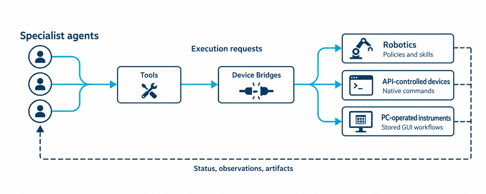

<!-- atr-doc
doc_type: index
subtype: index
status: active
authority: navigation
audience:
  - researcher
  - reviewer
  - operator
  - developer
  - maintainer
scope:
  - device_bridges
  - providers
  - runtime_sidecars
  - api_connections
summary: How AX4LAB connects existing laboratory capabilities through device-specific execution interfaces, with bridge references and integration contracts.
last_verified: 2026-09-11
verified_against: cf8cb9f
related_docs:
  - docs/device_bridges/bridge_api_connection_matrix.md
  - docs/agents/agent_api_connection_matrix.md
  - docs/paper/02_system_architecture.md
  - docs/paper/appendix_a_interfaces.md
  - docs/standards/documentation_standard.md
supersedes: []
-->

# Device Bridges

<sub>Reuse laboratory equipment. Separate research decisions from device execution.</sub>

AX4LAB connects **robot policies, native device APIs, and desktop-operated
instruments** through tools and Device Bridges. Agents own research decisions
and task assessment; bridges adapt those requests to the selected equipment
and return status, observations, and artifacts.

The integration layer lets the framework reuse existing capabilities without
embedding a particular printer protocol, robot process, or desktop workflow
inside the research plan. Computation adapters and virtual devices use related
integration boundaries, but are distinguished from physical equipment below.

## Integration Architecture

Agent procedures call registered tools or shared runtime resources. Managers
select providers where needed; the owning adapter executes the requested
operation and exposes evidence for the agent's next decision.



- Agent decisions and tool ownership — [Agent API and Connection Matrix](../agents/agent_api_connection_matrix.md).
- Protocols, execution modes, and return evidence — [Bridge API and Connection Matrix](bridge_api_connection_matrix.md).

## Integration Approaches

Different interfaces require different adapters, not a new research plan for
each communication protocol.

| Approach | Existing capability | Adapter responsibility | Evidence returned |
|---|---|---|---|
| Policies and robot skills | Learned policies, teleoperation, configured replay | Profile/port/camera handling and execution lifecycle | Session state, telemetry, observations and termination records |
| Native device control | Device APIs and provider protocols | Connection, artifact transfer, command dispatch and status reconciliation | Job/status responses and artifact identity |
| Desktop workflow execution | Instrument software without a usable control API | Selected worker, deployed Flow/Skills and bounded GUI actions | Screenshots, step traces, execution records and acquired files |

These are complementary routes. Observation services support physical tasks;
CAE adapters provide computation; simulators provide explicitly labeled test
responses. A successful API response alone does not establish task completion.

## Bridge Catalog

The eight core references describe operational capabilities, not eight Python
classes or eight identical entries in `/api/bridges`.

| Reference | Capability | Owning consumer | Connection / execution |
|---|---|---|---|
| [Printer Fleet](printer_fleet_bridge.md) | Provider selection and preparation | Specimen | Shared tool → selected printer provider |
| [Bambu X2D](bambu_x2d_bridge.md) | Slicing, printer control and ejection artifacts | Specimen through Printer Fleet | Slicer process, MQTT TLS, FTPS and video |
| [Prusa MK4S](prusa_mk4s_bridge.md) | Printer preparation and provider execution | Specimen through Printer Fleet | PrusaSlicer and PrusaLink HTTP |
| [LeRobot](lerobot_bridge.md) | Policy rollout, replay, teleoperation and ActiveCam | Manipulation / Vision | Managed processes, serial, camera and optional sidecars |
| [Windows PyAutoGUI](windows_pyautogui_bridge.md) | Stored desktop workflows and data acquisition | Equipment | Token-gated HTTP to the selected Windows or Local worker |
| [UTM Vision](utm_vision_bridge.md) | Test-area observation and verification evidence | Vision | Camera/ROS streams, calibration and pose services |
| [CAE Computation](cae_computation_bridges.md) | Preparation, solver execution and model adapters | Analysis | Filesystem, solver processes and field postprocessing |
| [Base and Simulators](base_simulator_bridges.md) | Deterministic substitutes for non-hardware checks | Test harness / configured agents | In-process simulated responses |

The [PLC operator guide](plc_safety_bridge.md) covers a separate Controller-owned
supervisory transport. It is graph/workspace-visible but is not an additional
agent stage or a device tool selected by an LLM.

## Execution and Evidence

**Agents decide what to do and assess the outcome; device integrations own how
the requested operation reaches the selected equipment.** Bridge runtimes may
supervise processes or execute stored workflows without taking ownership of the
research objective.

| Phase | Owner | What must stay identifiable |
|---|---|---|
| Request | Agent procedure / operator surface | Task, requested operation, run and applicable specimen/artifact context |
| Bind and validate | Tool, manager and provider | Selected profile/worker, executable capability, mode and inputs |
| Execute and observe | Device runtime | Invocation or session, progress, actual effect and terminal state |
| Collect evidence | Runtime and artifact services | Logs, captured frames, acquired files and result identity |
| Assess and hand off | Owning agent | Accepted evidence, next task, operator return or failure |

The concrete payloads differ by bridge. The [matrix](bridge_api_connection_matrix.md#evidence-matrix)
maps their evidence; [loop artifact archiving](../runtime/loop_artifact_archiving.md)
describes run/loop/agent/invocation retention.

Current paths worth distinguishing:

- **Equipment:** the stored Flow/Skills execute before terminal agent review. Durable execution records, screenshots and CSV/readiness evidence support assessment without replaying completed work.
- **Robotics and vision:** rollout/replay termination and fresh visual verification are separate evidence. ActiveCam capture can include robot motion; it is not just an image read.
- **Analysis:** measured-data handoff can proceed while optional, frozen-input FEM jobs run independently. Saved-field retrieval does not start a solver.
- **Modes:** TEST does not universally mean no hardware. Selected transport, per-agent settings and live/promotion gates determine the actual effect.

## Extension Points

Extend the narrowest existing boundary that fits the new capability.

| Change | Reuse first | Device-specific work |
|---|---|---|
| Another printer | Fleet/profile selection and `printer.prepare` | Provider transport, preparation/status mapping and supported placement/ejection behavior |
| Another desktop-operated instrument | Equipment worker and Flow/Skill lifecycle | Exact programs, locators, runtime context and exported-data checks |
| Another supported robot or policy | LeRobot profile and session APIs | Hardware support, calibration, camera mapping and policy/task validation |
| Another observation source | Existing capture and evidence handoff | Capture adapter, calibration, timestamp and observation semantics |
| Another computation backend | Analysis request and artifact/job boundaries | Preparation/solve adapter, result parser and numerical verification |

`BaseBridge.execute(command, payload)` is available for adapters that use that
base contract; it is not the universal interface of every service in this catalog.
Tool/resource registration lives in `mcp_tools/` and `app/bootstrap.py`. New
equipment still needs its own integration and validation; registry membership
does not imply plug-and-play compatibility.

## Scope and Classification

<details>
<summary>Registry, graph and runtime classifications</summary>

| Label | Meaning |
|---|---|
| `graph_projected` | represented in `graph.metadata.device_bridges` and `/api/bridges` |
| `tool_registered` | callable through the runtime Tool Registry |
| `api_exposed` | has an operator-facing FastAPI family |
| `provider` | selected behind a manager or shared tool contract |
| `runtime_sidecar` | manages a process, stream, observer, or evidence service |
| `artifact_transformer` | changes files but cannot itself command a device |
| `test_only` | deterministic substitute; does not establish live compatibility |

`camera_utm_bridge` is a shared visual/equipment evidence projection, not a
separate implementation of all tools it lists. `prusa_bridge` is a legacy
graph entry while Bambu is the checked-in default provider. CAE's graph entry
names the facade; CalculiX and PINN have additional registered tools. PLC is a
separate Controller service. Graph labels are not a current model/provider roster.

</details>

## Detailed Figure Navigation

Existing Flow, Execution and Connections diagrams remain unchanged. The new
overview is conceptual; owning references and source code provide detail.

<details>
<summary>Detailed figure index</summary>

| Boundary | Diagrams |
|---|---|
| Printer Fleet | [Flow](assets/figures/printer_fleet_01_system_handoffs.svg) · [Execution](assets/figures/printer_fleet_02_execution_effect_boundary.svg) · [Connections](assets/figures/printer_fleet_03_api_connection_architecture.svg) |
| Bambu Lab X2D | [Flow](assets/figures/bambu_x2d_01_system_handoffs.svg) · [Execution](assets/figures/bambu_x2d_02_execution_effect_boundary.svg) · [Connections](assets/figures/bambu_x2d_03_api_connection_architecture.svg) |
| Prusa MK4S | [Flow](assets/figures/prusa_mk4s_01_system_handoffs.svg) · [Execution](assets/figures/prusa_mk4s_02_execution_effect_boundary.svg) · [Connections](assets/figures/prusa_mk4s_03_api_connection_architecture.svg) |
| LeRobot | [Flow](assets/figures/lerobot_01_system_handoffs.svg) · [Execution](assets/figures/lerobot_02_execution_effect_boundary.svg) · [Connections](assets/figures/lerobot_03_api_connection_architecture.svg) |
| Windows PyAutoGUI | [Flow](assets/figures/windows_pyautogui_01_system_handoffs.svg) · [Execution](assets/figures/windows_pyautogui_02_execution_effect_boundary.svg) · [Connections](assets/figures/windows_pyautogui_03_api_connection_architecture.svg) |
| UTM Vision | [Flow](assets/figures/utm_vision_01_system_handoffs.svg) · [Execution](assets/figures/utm_vision_02_execution_effect_boundary.svg) · [Connections](assets/figures/utm_vision_03_api_connection_architecture.svg) |
| CAE Computation | [Flow](assets/figures/cae_computation_01_system_handoffs.svg) · [Execution](assets/figures/cae_computation_02_execution_effect_boundary.svg) · [Connections](assets/figures/cae_computation_03_api_connection_architecture.svg) |
| Base and Simulators | [Flow](assets/figures/base_simulator_01_system_handoffs.svg) · [Execution](assets/figures/base_simulator_02_execution_effect_boundary.svg) · [Connections](assets/figures/base_simulator_03_api_connection_architecture.svg) |

</details>

## Recommended Reading Paths

| Reader | Start here | Then read |
|---|---|---|
| Paper reviewer | [Matrix](bridge_api_connection_matrix.md) | figures, known gaps, paper interfaces appendix |
| Operator | device-specific Reference | configuration, effect gate, recovery, linked hardware Guide |
| Agent developer | agent Reference | bridge Reference tools/API sections and matrix |
| Integrator | connection figure | protocol, authentication, modes, status/evidence contract |
| Maintainer | source-of-truth and verification sections | validator rules and update checklist |

## Authority and Conflict Resolution

Use this order for current behavior:

```text
executable code and checked-in configuration
-> active Documentation Standard
-> active device-bridge Reference and matrix
-> active hardware/runtime Guide
-> approved Design and implementation Plan
-> time-bounded Evidence or legacy guideline
```

A Reference describes observed implementation. It does not certify a device,
protocol, safety control, or scientific result. When code conflicts with a
Reference, code is current and the document has drift.

## Legacy and Procedural Detail

| Existing Guide | Canonical Reference | Continued use |
|---|---|---|
| [Bambu operation](../hardware/bambulab_x2d_device_bridge_runtime_guideline.md) | [Bambu X2D](bambu_x2d_bridge.md) | Setup, artifacts and supervised validation |
| [Prusa workflow](../hardware/printer_agent_prusabridge_phase1_runtime_guideline.txt) | [Prusa MK4S](prusa_mk4s_bridge.md) | Phase-one workflow context |
| [LeRobot operation](../hardware/lerobot_robotis_manipulation_runtime_guideline.md) | [LeRobot](lerobot_bridge.md) | ROBOTIS/LeRobot operating detail |
| [Equipment operation](../hardware/windows_pyautogui_equipment_agent_guideline.md) | [Windows PyAutoGUI](windows_pyautogui_bridge.md) | Console, evidence and live operation |
| [Windows setup](../hardware/windows_pyautogui_bridge_windows_setup.md) | [Windows PyAutoGUI](windows_pyautogui_bridge.md) | Installation procedure |
| [Vision runtime](../hardware/utm_ros_vision_runtime_bridge.md) | [UTM Vision](utm_vision_bridge.md) | ROS/camera installation and operation |
| [Isaac mirror](../hardware/isaac_sim_robotis_omx_mirror_mode.md) | [LeRobot](lerobot_bridge.md) | Mirror-mode procedure |

## Verification Method

- graph classification: `graphs/configs/atr_closed_loop.yaml`;
- tool/resource registration: `app/bootstrap.py` and `mcp_tools/*_tools.py`;
- runtime behavior: owning `device_bridges/*.py` implementations;
- API families: route declarations in `app/main.py`, `app/analysis_fem_routes.py`
  and `app/cae_fields_routes.py`; deployed `/openapi.json` owns the instance schema;
- configuration: `configs/devices.yaml` and `configs/lerobot.yaml`;
- operator behavior: linked Guides and focused bridge/API tests.

The detailed SVG figures are explanatory `inspection` projections. Their dashed
paths denote conditional, optional, compatibility, or test paths. The overview
uses a dashed line for returned evidence. Neither establishes live execution.

## Update Checklist

When a bridge contract changes:

1. update the owning implementation/configuration and tests;
2. update its Reference and three `.dot` sources;
3. re-render the matching SVG files;
4. update the matrix for entry, protocol, effect, evidence, or recovery drift;
5. update graph/tool classification when registration changes;
6. update root and index navigation if a canonical boundary changes;
7. run documentation, paper, figure-freshness, and focused bridge validation.

## Limitations and Known Gaps

The inventory is capability-oriented and therefore not a class-by-class API
catalog. The graph projection currently under-represents the Bambu default and
the separately registered CalculiX/PINN paths. Optional device, solver, camera,
ROS, serial, and Windows combinations were not all exercised by this
documentation inspection.

## Index Verification

Updated on 2026-09-11 by source inspection at `cf8cb9f`: graph metadata,
bootstrap/tool/resource registration, owning implementations, Equipment Runtime,
Analysis job/field routes and the existing references. This document refresh
does not start a server, device, model rollout or solver.

Individual references retain their own verification dates and evidence scope;
the current index does not silently recertify their older snapshots. The new
[overview prompt](../assets/presentation/device-bridge-overview.txt) and
[image provenance](../assets/presentation/README.md) accompany the figure.

## Related Documents

- [Bridge API and Connection Matrix](bridge_api_connection_matrix.md)
- [Agent Reference Index](../agents/README.md)
- [System Architecture](../paper/02_system_architecture.md)
- [Interfaces Appendix](../paper/appendix_a_interfaces.md)
- [Documentation Standard](../standards/documentation_standard.md)
