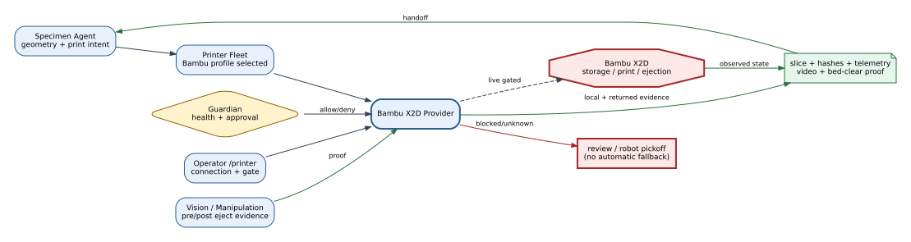
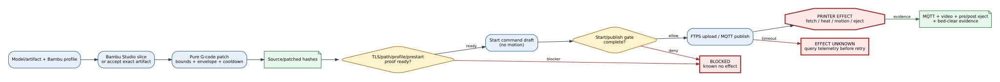
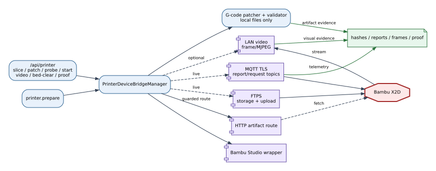

# Bambu Lab X2D Bridge Reference

## Summary

The Bambu X2D provider turns a selected fabrication request into sliced and
identity-tracked artifacts, connection/readiness evidence, and—only on an
allowed live path—transfer and start commands. It also provides a pure-file
native G-code autoejection transformer whose output is inert until published.

## Scope

Included: Bambu Studio runner, connection/fleet/autoejection/bed-clear memory,
TLS probe, MQTT report and command clients, FTPS probing/upload, LAN video,
artifact HTTP route, start gates, and deterministic G-code patching. Excluded:
device firmware internals and claims for untested printer/firmware variants.

## Source of Truth

`bambu_bridge.py` owns the provider and clients;
`bambu_autoejection.py` owns pure transformation and validation;
`devices.printer.bambu` and `devices.printer.autoejection` own defaults.

## Actual Role

The provider resolves connection and slicer configuration, produces or accepts
a sliced artifact, computes/retains identity, probes configured paths, exposes
telemetry/video, and constructs guarded publish operations. It does not infer
bed clearance or autoejection success without configured evidence.

## System Position and Agent Handoffs

**Figure Bambu X2D-1.** Specimen work enters through Printer Fleet; Bambu
artifacts and telemetry return to Specimen, Vision/Manipulation proof, Guardian,
and the operator. Dashed live paths require explicit gates. This is inspection,
not physical validation.

| Upstream | Required context | Output/consumer |
|---|---|---|
| Printer Fleet/Specimen | selected Bambu profile, geometry/slice request | sliced artifact and manufacturing result |
| Operator | connection, profile, start/proof action | redacted readiness or guarded result |
| Vision/Manipulation | pre/post-eject evidence or recovery capability | bed-clear/autoejection status |

## Inputs, Commands, and Outputs

Inputs include printer/profile ID, source artifact or model path, slicer hints,
connection memory, source/patched hash expectations, start intent, and proof
references. Outputs include `.gcode` or `.gcode.3mf`, slice metadata, probe
results, command drafts, MQTT/video state, bed-clear records, and structured
blockers.

## Internal Execution

**Figure Bambu X2D-2.** Slicing and G-code patching remain local artifact
effects; FTPS/MQTT publish is the first printer effect and is separated from
prestart, start, and proof gates. Evidence scope is implementation inspection.

| Phase | Main checks | Effect |
|---|---|---|
| Slice/accept | executable, output, artifact existence and identity | local subprocess/files |
| Patch | object bounds, envelope, motion/feedrate/cooldown, schema marker | new local artifact only |
| Probe | host/path/TLS and provider readiness | bounded network reads |
| Draft/gate | selected profile, route, source/patched hashes, proof blockers | no start command |
| Publish/start | live allowance and complete gate | network command; physical possible |
| Verify | MQTT/video/job/bed-clear/autoejection evidence | status/proof record |

## API Surface

Functional `/api/printer/*` groups include Bambu slicing and autoejection
patch/sweep/proof/completion-audit, upload-path probe, HTTP artifact route,
prestart check, start-command draft, start gate, start publish, video status/
frame/stream, bed clear, and shared connection/profile/status endpoints.

## Tools and Registry Integration

Bambu is selected behind `printer.prepare`; it is not registered as an
independent graph tool. `PrinterDeviceBridgeManager` owns provider methods and
the API uses the same manager. Pure patch endpoints call the transformer but
cannot publish by themselves.

## Connections and Protocols

**Figure Bambu X2D-3.** API/tool requests pass through provider configuration
to Bambu Studio, MQTT TLS, FTPS, artifact HTTP routing, and LAN video; command
and evidence returns remain distinct. UI/model bypass is prohibited.

- Bambu Studio wrapper: bounded local slicing subprocess;
- MQTT over TLS: report/request topics and print-control/project commands;
- FTPS: storage and upload-path probes plus file transfer;
- HTTP artifact route: makes the exact local artifact fetchable by a guarded
  workflow;
- LAN video: status, snapshots, and MJPEG proxy paths.

## Configuration and Secrets

`configs/devices.yaml` defines ports, topic templates, timeouts, slicer wrapper,
video, capabilities, and autoejection requirements. Mutable files include
`memory/bambu_connection.json`, `memory/bambu_autoejection.json`, and
`memory/bambu_bed_clear_evidence.json`. Access codes and serial values may be
stored in connection memory but are redacted from documents and responses.

## State, Events, Artifacts, and Evidence

Key evidence is source/patched SHA-256, slicer output, normalized object bounds,
patch metadata, path-probe results, MQTT sequence/status, video observations,
pre/post-eject references, and bed-clear records. An HTTP URL is routing
metadata, not proof that the printer fetched or ran the artifact.

## Runtime Modes and Fallbacks

Test behavior can create deterministic artifacts and avoid real publish.
Network-in-test promotion must be explicit. Live behavior requires configured
connection and live gates. Bambu failure does not automatically select Prusa;
robot pickoff recovery is separately configured and false by default.

## Safety, Approval, and Effect Boundary

Pure G-code patching never talks to a printer. Physical possibility begins at
FTPS upload, MQTT publish/control, or a printer fetch/start command. The start
path requires artifact identity, route readiness, provider/profile match,
prestart/start gates, and configured proof. Autoejection additionally requires
the verified routine and pre/post vision conditions declared by configuration.

## Errors, Timeouts, and Recovery

Invalid motion/envelope/cooldown, identity mismatch, unavailable path, missing
credential, and proof blockers fail closed. After publish timeout, query MQTT
report/job state and reconcile artifact identity before retry; network timeout
is not evidence of no effect. A failed patch is safe to regenerate because it
has no device effect.

## Operator and GUI Surfaces

The `/printer` workspace exposes fleet, connection, slicing, video, probe,
start-gate, autoejection, bed-clear, and proof views. Operators must distinguish
draft, gate-ready, published, observed-running, and proof-complete states.

## Current Verification

Inspection covered provider/client/patcher code, current configuration, API
handlers, Bambu unit tests, autoejection tests, and the existing completion
audit contract. It does not establish continuous live reliability for X2D.

## Limitations and Known Gaps

### AMS material priority (2026-09-06)

In **3DP → AMS / Material Slots**, use ▲/▼ to reorder slots, then save.
Reordering enables priority; the checkbox can disable it without clearing the
saved order. Defaults are disabled, preserving existing explicit AMS/external
spool behavior. This setting is stored independently of Print Defaults at
`memory/bambu_material_priority.json` through
`GET/POST /api/printer/material-priority`. It is not an in-print spool-change rule.

When enabled, GUI start drafts and agent preparation use the same selection
logic: the first ranked slot with fresh MQTT presence evidence, a matching
material type, and no reported zero/invalid remaining amount. Unknown remaining
percentage alone is allowed when presence and material are known. Unlisted slots
are not an implicit fallback; absent, exhausted, or incompatible candidates are
skipped, and no compatible candidate blocks the start. Standard AMS IDs 0–3 and
tray IDs 0–3 are supported; other AMS types are not automatically mapped.

The actual local sliced plate must identify exactly one used filament and its
matching `filament_type`. Mapping has one entry per filament preset and selects
the actual used index—not a hardcoded five-entry vector. Multiple used materials,
missing evidence, or an artifact/material mismatch block publication. An E-free
motion program is exempt; genuine installed-printer ejection-only conversion
retains its existing flow. Virtual readiness does not read hardware, and start
selection differing between GUI draft and preparation blocks publication.

GUI HTTP-export URLs retain local artifact evidence. A printer-only
`cache/file.gcode.3mf` reference cannot prove its material and is blocked while
priority is enabled: use the GUI Slice/HTTP Artifact route. Agent preparation
with its local artifact supports the existing FTPS and HTTP paths. Selection is
rechecked after slicing; it does not trigger filament changes during a print.

Verification: `tests/unit/test_bambu_material_priority.py`,
`tests/integration/test_bambu_material_priority_api.py`, and
`tests/js/printer_material_priority.test.js` cover persistence, telemetry/order,
artifact binding, shared GUI/agent mapping, and non-actuating behavior.

### Operator-adjustable specimen placement (2026-09-06)

The 3DP workspace Print Defaults exposes `specimen_placement`, shared with
controller initialization, Design/BO redesign handoffs, and Specimen Making.
Save defaults for subsequent requests; manual Slice/Prestart uses the current
form values. Existing run snapshots and already sliced files are not relocated.

| Mode | Meaning | Slicing behavior |
| --- | --- | --- |
| `auto` (legacy default) | Bambu's printable-area arrangement | Original `--arrange 1` path |
| `bed_center` | Physical bed center, X128/Y128 mm for X2D | Original STL + assembly translation, `--arrange 0` |
| `custom` | Operator-entered specimen center X/Y, in printer mm | Same explicit placement path |

The installed X2D profile's shared nozzle region is X20.5–256/Y0–256 mm,
so its automatic center can be X138.25/Y128, not the physical bed center.
Explicit placement reads the effective rectangular machine profile and checks
the **whole specimen bounds**, not only the center. The supported Bambu CLI
`--load-assemble-list` translates the original STL without editing it; `--center`
is not supported by the installed CLI. Explicit relocation of source 3MF
projects is blocked: use the original STL to preserve project settings.

Before accepting an explicitly positioned artifact, the bridge reads the sliced
G-code using the same object-bounds extractor as autoejection. It checks printable
bounds and center agreement within 0.5 mm. Missing evidence or mismatch blocks
preparation/prestart; it never silently reverts to automatic arrangement. Explicit
placement is X2D-only; other providers retain their existing `auto` behavior.
Normal print-cycle autoejection still follows the actual sliced specimen bounds.

The 3DP GUI no longer exposes `Validate Left/Center/Right` or the three Physical
Proof Package `Run Standalone Eject` controls, including their click handlers.
The remaining ejection-test artifact handler fixes `mode=test` and
`start_immediately=false`. Preview validation, artifact generation, proof
templates, completion audit, and regular loop autoejection remain. This is a GUI
entry-point removal, not removal of the existing backend standalone API.

Regression coverage: `tests/unit/test_specimen_placement.py`,
`tests/integration/test_printer_placement_gui.py`, and
`tests/js/printer_placement.test.js`. Optional installed-CLI checks use
`ATR_TEST_REAL_SLICER=1`; they generate temporary files only, without upload,
MQTT publish, or printer actuation.

Bambu is the current configured default but lacks its own
`graph.metadata.device_bridges` entry. Optional transfer/video modes depend on
firmware/network behavior. Autoejection is disabled by default and remains
blocked without verified routine and evidence configuration.

## Related Documents

- [Printer Fleet](printer_fleet_bridge.md)
- [Bambu Runtime Guide](../hardware/bambulab_x2d_device_bridge_runtime_guideline.md)
- [Specimen Agent](../agents/specimen_agent.md)
- [Bridge Matrix](bridge_api_connection_matrix.md)
