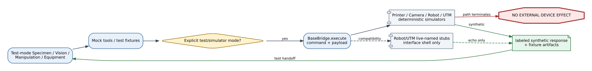
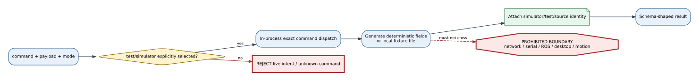
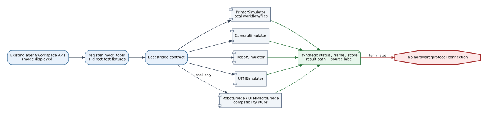

# Base and Simulator Bridge Reference

## Summary

`BaseBridge` defines the minimal `execute(command, payload) -> dict` interface.
Deterministic printer, camera, robot, and UTM simulators and two live-named
compatibility stubs implement that shape for tests and early integration. They
verify routing/schema behavior only; they are not evidence of live devices.

## Scope

Included: base method contract, four simulator responses, printer simulator's
reuse of the Prusa workflow, mock-tool access, compatibility stubs, mode
selection, and evidence limitations. Excluded: provider-specific virtual
systems with richer behavior and all claims of physical compatibility.

## Source of Truth

`device_bridges/base_bridge.py`, `device_bridges/simulator/*.py`,
`robot_bridge.py`, and `utm_macro_bridge.py` define the implementations.
`mcp_tools/mock_tools.py` provides the primary deterministic tool surface used
by agents; not every simulator class is instantiated by production bootstrap.

## Actual Role

These components make tests reproducible, return schema-shaped data, exercise
agent/tool handoffs, and clearly label simulated source. They must not acquire
credentials, contact a device, or upgrade synthetic success into a live result.
The live-named robot and UTM stub classes are placeholders, not production
control implementations.

## System Position and Agent Handoffs

**Figure Base Simulator-1.** Test-mode agents and mock tools can reach
deterministic bridge substitutes and receive labeled synthetic artifacts; the
path terminates before an external device. Compatibility stubs are dashed and
must not be interpreted as evaluated live paths.

| Consumer | Simulated contract | Returned shape |
|---|---|---|
| Specimen | printer prepare/health | workflow-like artifacts/status |
| Vision | camera capture | frame ID and anomaly flag |
| Manipulation | robot task | task and deterministic grasp score |
| Equipment/Analysis | UTM run | profile and mock result-file metadata |

## Inputs, Commands, and Outputs

All bridges accept a string command and mapping payload. Printer simulator
handles `prepare` and `health`; camera returns frame metadata; robot returns a
task/grasp score; UTM returns a result-file path. Unknown printer commands
return a structured failure. Compatibility stubs echo command/payload with a
live-stub label and therefore provide no real device semantics.

## Internal Execution

**Figure Base Simulator-2.** Mode selection and command dispatch produce local
deterministic responses or fixture files, then stop before network, desktop,
serial, ROS, or physical effects. The red live boundary is explicitly
prohibited for simulator evidence.

| Phase | Behavior | Effect |
|---|---|---|
| Select | caller/config chooses test/simulator | local branch |
| Dispatch | exact command and payload | in-process method |
| Generate | deterministic fields or fixture artifact | local memory/file only |
| Label | simulator/bridge/mode identity | evidence metadata |
| Return | schema-shaped result | agent/test consumer |

## API Surface

There is no dedicated simulator API family. Simulated results appear through
the same agent/tool/operator contracts that selected test mode. Provider
workspaces must expose mode/source rather than presenting a simulator class as
a separate live device.

## Tools and Registry Integration

`register_mock_tools` registers deterministic geometry, printer, camera,
vision cross-check, robot, UTM, device-health, and related tool handlers.
Printer tool registration also builds real provider managers whose configured
test paths may be richer than `PrinterSimulator`. Direct simulator classes are
used primarily by tests and compatibility code.

## Connections and Protocols

**Figure Base Simulator-3.** Agent/tool calls enter in-process dispatch and
return labeled synthetic state; no protocol edge reaches hardware. Dashed
compatibility stubs expose only an interface shell, and a real provider must be
selected and gated separately.

No external protocol is required by the four minimal simulators. The printer
simulator may run local workflow/file logic. Any network, serial, camera, ROS,
desktop, or solver connection belongs to a separate live/provider Reference.

## Configuration and Secrets

`configs/devices.yaml` selects simulator/test modes and provider-specific
virtual behavior. Minimal simulators need no credentials. Tests MUST NOT load
real secrets merely to satisfy a simulator path, and fixtures must not copy
connection-memory credentials into returned payloads.

## State, Events, Artifacts, and Evidence

State is deterministic input/output and any explicitly created fixture file.
Evidence must carry simulator/test/source labels. It can support schema,
routing, UI, error-path, and replay tests; it cannot support hardware uptime,
latency, calibration, safety, or scientific-result claims.

## Runtime Modes and Fallbacks

These bridges are test-only. Selection must be explicit through mode/config or
test fixture. A failed live provider cannot silently fall back to simulator and
continue a run as though the physical effect occurred. Virtual-live promotion
is provider-specific and outside this minimal family.

## Safety, Approval, and Effect Boundary

The expected boundary ends at local memory/files. No physical approval is
needed for pure simulation, but live intent must still be rejected rather than
echoed as success. `RobotBridge` and `UTMMacroBridge` currently echo payloads;
their live names do not make them acceptable physical-control paths.

## Errors, Timeouts, and Recovery

Unknown commands should return explicit failure where implemented. A simulator
exception has known no external effect and may be retried after local cleanup.
Simulator success cannot resolve an effect-unknown state left by a previous
live invocation; reconcile the live provider/device separately.

## Operator and GUI Surfaces

Test-mode results appear in printer, camera, manipulation, equipment, and run
views. Surfaces must show `test`, `simulator`, `virtual`, or equivalent source
labels and avoid live-ready badges derived only from mock device health.

## Current Verification

Inspection covered the base and minimal implementation files, mock tool
registration, mode configuration, and existing replay/fault/unit test usage at
`188a1d6`. It did not compare simulator distributions with real devices.

## Limitations and Known Gaps

The minimal camera/robot/UTM simulators expose only small response schemas.
Some primary test paths use richer mock-tool functions instead of these
classes. The live-named compatibility stubs return optimistic echoes and must
not be mistaken for fail-closed production bridges.

## Related Documents

- [Device Bridge Index](README.md)
- [Agent API Matrix](../agents/agent_api_connection_matrix.md)
- [Documentation Standard](../standards/documentation_standard.md)
- [Bridge Matrix](bridge_api_connection_matrix.md)
