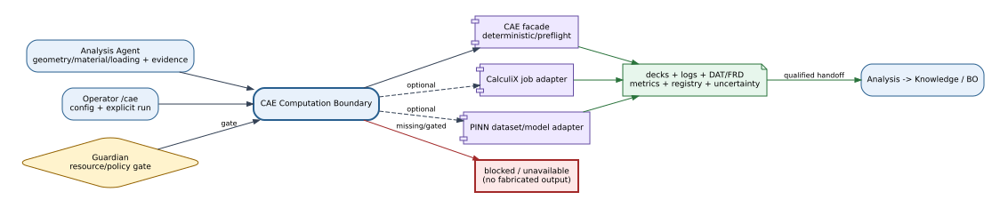
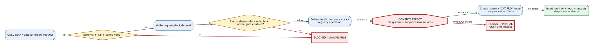
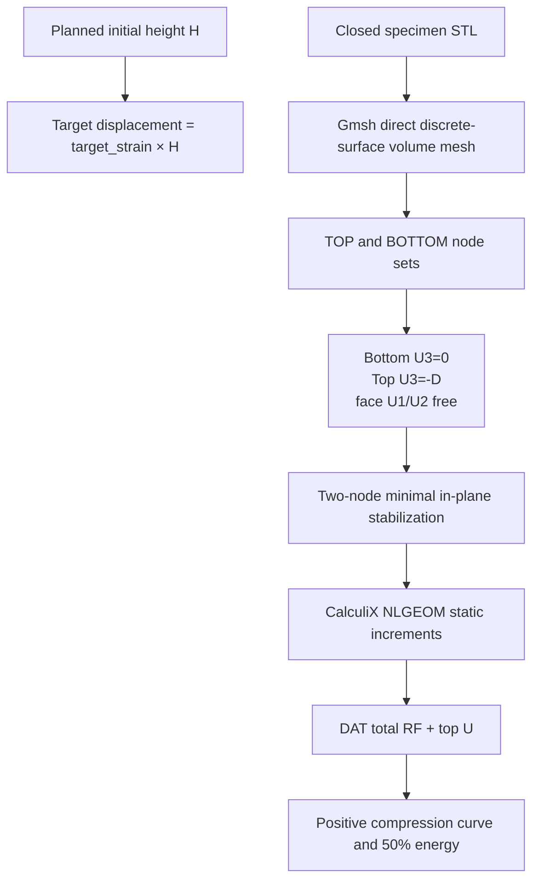
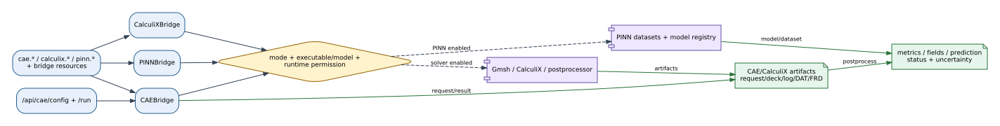

# CAE, CalculiX, and PINN Bridge Reference

## Summary

The CAE Computation boundary provides three related adapters: a deterministic/
real-solver CAE facade, a guarded CalculiX quasi-static job path, and a PINN
dataset/model registry that reports unavailable models instead of inventing
predictions. These are external-computation and filesystem effects, not
physical laboratory device control.

## Scope

Included: solver health/defaults, displacement-controlled compression facade,
STL volume meshing, frictionless-face CalculiX input deck, nonlinear
solve/postprocess/job, force-displacement metrics, PINN
health/dataset/train/predict/registry, artifact paths, runtime gates, and
API/tool integration. Excluded: experimental material calibration, contact or
self-contact, cyclic fatigue, trained-model quality, and scientific equivalence
between deterministic/test and real results.

## Source of Truth

`CAEBridge`, `CalculiXBridge`, and `PINNBridge` define separate contracts.
Their `mcp_tools` registrars are all called by bootstrap. `/api/cae/*` exposes
the facade, while CalculiX and PINN primarily enter through registered tools.

## Actual Role

The boundary normalizes geometry/material/loading or solver/model payloads,
checks availability and explicit runtime gates, writes request/input artifacts,
runs or blocks bounded computation, and returns identity-bearing results. It
does not fabricate solver output or call a missing PINN model a failed physical
experiment.

## System Position and Agent Handoffs

**Figure CAE Computation-1.** Analysis may request deterministic comparison,
guarded CalculiX execution, or optional PINN work; solver/model evidence returns
to Analysis and downstream Knowledge/BO without a physical device effect.
Optional paths are dashed inspection projections.

| Producer | Input | Output/consumer |
|---|---|---|
| Analysis Agent | geometry/material/loading, measurement/FEA evidence | metrics/comparison/uncertainty context |
| Operator `/cae` | configuration and run request | health, blockers, artifacts, result |
| Knowledge/BO | accepted Analysis handoff | derived evidence only; no direct bridge call implied |
| Guardian | process/risk/budget context | allow/block/timeout evidence |

## Inputs, Commands, and Outputs

| Adapter | Inputs | Outputs |
|---|---|---|
| CAE facade | planned size, STL, material, displacement target, boundary, mesh | deterministic or real quasi-static curve, metrics, and artifacts |
| CalculiX | STL or `.inp`, run/specimen/job, material, increments, runtime flag, timeout | Gmsh mesh, deck/manifest, versioned health, DAT/FRD, curve, metrics, trace |
| PINN | UTM/FEA records, dataset/model IDs, metrics/checkpoints, fixture prediction | dataset JSON, registry, registered/unavailable/predicted status |

## Internal Execution

**Figure CAE Computation-2.** Schema/input and availability gates precede
filesystem creation and optional solver/training subprocess work; result
artifacts and logs are validated before Analysis consumption. There is no
physical-effect node because the current boundary controls computation only.

| Phase | Gate/transformation | Effect/evidence |
|---|---|---|
| Configure | enabled/mode/executable/artifact roots/defaults | normalized config/health |
| Prepare | planned height, STL, material, target strain, increments | volume mesh, face sets, deck/manifest, or dataset JSON |
| Execute | solver/training enabled and implementation available | bounded Gmsh/CalculiX subprocess or registry write |
| Postprocess | DAT reaction/displacement history or model/result exists | canonical curve, metrics, artifact paths/status |
| Return | preserve failure/unavailable semantics | Analysis comparison/handoff |

## Quasi-Static Mechanical Contract

No platen solid, contact pair, friction coefficient, self-contact, or dynamic
mass scaling is created. The deck manifest identifies every top/bottom node,
the two stabilizer nodes, mesh height, planned target, and constraint counts.
The target derives from the experiment-planned height rather than a hard-coded
21 mm endpoint or an observed CSV endpoint.

The canonical curve contains finite nonnegative compression magnitudes and an
explicit zero origin. A partial calculation is never extrapolated: peak and
initial stiffness can describe the converged segment, while 50%-height energy
is `null` until the exact target is reached.

## API Surface

`GET/POST /api/cae/config` reads or writes facade workspace settings;
`POST /api/cae/run` executes its bounded run contract. CalculiX and PINN do not
own dedicated HTTP families at this baseline; their exhaustive callable
surface is the Tool Registry. The Runtime IDE may display graph bridge/action
descriptors but those do not grant solver execution.

## Tools and Registry Integration

- `cae.health`, `cae.run_static_analysis` (`cae:calculix` device label);
- `calculix.health`, `prepare_input`, `solve`, `postprocess`, `run_job` plus
  resource `calculix_bridge`;
- `pinn.health`, `dataset.build`, `train`, `predict`, `registry` plus resource
  `pinn_bridge`.

Bootstrap registers all three; the graph projection names the CAE facade and
does not enumerate the other tool groups.

## Connections and Protocols

**Figure CAE Computation-3.** CAE API and three tool families reach independent
facade, solver-job, and model-registry adapters; filesystem and guarded
subprocess boundaries return decks, logs, fields, metrics, and model records.
No model/UI/graph descriptor bypasses execution gates.

Current connections are local filesystem and subprocess/executable discovery.
The CAE facade resolves CalculiX/Gmsh paths and versions; the CalculiX adapter
runs Gmsh volume meshing and `ccx` only behind the per-request execution gate,
then parses native DAT total-force blocks. PINN currently records explicit dataset/
model/prediction contracts and does not hide model unavailability.

## Configuration and Secrets

`devices.cae` defines enabled/mode/provider/solver/mesher/library paths, live
solver requirement, artifact directory, and material/loading/boundary/mesh defaults.
CalculiX falls back to CAE config unless a dedicated section exists. PINN uses
defaults unless `devices.pinn` is provided; runtime training defaults false and
no active model is configured. The current host uses `/home/jin/.local/bin/atr-ccx`
and `/home/jin/.local/bin/atr-gmsh` wrappers for CalculiX 2.21 and Gmsh 4.12.1.
Current adapters require executable paths, not network credentials.

## State, Events, Artifacts, and Evidence

Artifacts include facade requests/results, source STL reference, Gmsh `.geo`
and mesh `.inp`, CalculiX deck and deck manifest, stdout/stderr tails, DAT/FRD,
canonical curve JSON and optional converted fields, PINN dataset JSON,
`model_registry.json`, metrics/checkpoint metadata, and step traces. Raw UTM
measurement remains distinct from derived solver/PINN output.

## Runtime Modes and Fallbacks

CAE test mode returns a labelled 101-point nonlinear cellular compression
equivalent through the same curve contract. Live facade delegates to real
Gmsh/CalculiX and requires configured availability. CalculiX real execution
requires `runtime_solver_enabled`; installation alone never starts a job. PINN training
requires `runtime_training_enabled`; prediction without a registered model is
`unavailable`, not a synthetic fallback. No adapter silently substitutes
another fidelity.

## Safety, Approval, and Effect Boundary

Effects are local filesystem writes and optional CPU/GPU/external solver
processes. They can consume time/resources and overwrite job-named artifacts
within bounded directories but do not command laboratory mechanics. Schema,
identifier, enabled/mode, executable/model availability, runtime permission,
timeout, and artifact checks guard the boundary.

## Errors, Timeouts, and Recovery

Disabled bridge, missing STL/executable/model, disabled runtime gate, invalid
or empty volume mesh, nonzero return, timeout, malformed DAT history, and an
incomplete endpoint remain distinct. On solver timeout retain request/deck and
available partial logs/artifacts, inspect the process and job directory, and
avoid labeling partial output complete. PINN
unavailability should route Analysis without fabricating a curve.

## Operator and GUI Surfaces

The `/cae` workspace exposes facade configuration and runs. Tool/Runtime IDE
surfaces may expose CalculiX/PINN health and actions. Operator output must show
mode, executable/model availability, runtime gate, input identity, artifacts,
and failure/unavailable distinction.

## Current Verification

Verification covered all three bridge and registrar implementations,
configuration, CAE APIs, multifidelity schemas/tests, native DAT parsing, a
real 10 mm cube 50%-compression solve, and a 30 mm dense Gyroid volume mesh.
The cube reached 5.0 mm in 102 increments. This is runtime verification, not
material calibration or experimental validation.

## Limitations and Known Gaps

The graph/API projection does not show CalculiX and PINN as separate bridge
entries despite bootstrap registration. Large TPMS STL files retain their
dense surface triangulation in the volume mesh, so real nonlinear runs can be
expensive even when the interior mesh size is coarse. With no self-contact,
50% deformation may interpenetrate. PINN training currently registers supplied
metadata rather than proving a training backend ran.

## Related Documents

- [Analysis Agent](../agents/analysis_agent.md)
- [Agent API Matrix](../agents/agent_api_connection_matrix.md)
- [Interfaces Appendix](../paper/appendix_a_interfaces.md)
- [Bridge Matrix](bridge_api_connection_matrix.md)
