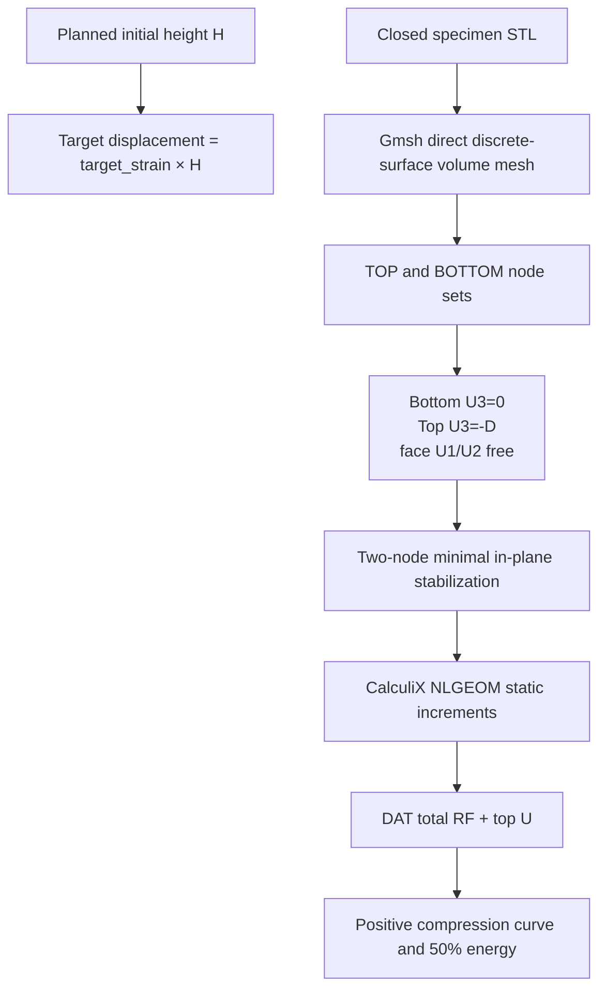

<!-- atr-doc
doc_type: reference
subtype: runtime
status: active
authority: descriptive
audience:
  - researcher
  - operator
  - developer
  - integrator
scope:
  - cae
  - calculix
  - pinn
  - external_computation
summary: Staged, cancellable CAE/CalculiX computation independent of measured BO, saved solver-field access, and explicit-availability PINN operations.
source_of_truth:
  - device_bridges/cae_bridge.py
  - device_bridges/calculix_bridge.py
  - device_bridges/pinn_bridge.py
  - mcp_tools/cae_tools.py
  - mcp_tools/calculix_tools.py
  - mcp_tools/pinn_tools.py
  - configs/devices.yaml
  - app/main.py
  - utils/calculix_fields.py
  - utils/cae_field_view.py
  - app/cae_fields_routes.py
  - app/analysis_fem_routes.py
  - agents/analysis_fem.py
  - agents/analysis_runtime.py
  - utils/cae_model_package.py
last_verified: 2026-09-09
verified_against: working-tree-2026-09-09-nonblocking-fem-live-cards
related_docs:
  - docs/device_bridges/README.md
  - docs/agents/analysis_agent.md
  - docs/paper/appendix_a_interfaces.md
supersedes: []
-->

# CAE, CalculiX, and PINN Bridge Reference

## Status at a Glance

| At a glance | Details |
|---|---|
| Purpose | Staged solver computation and saved-field access |
| Connects | Analysis / CAE workspace ↔ computation services |
| Effect | Local computation and artifacts; no equipment motion |
| Implementation | [CAE tools](../../mcp_tools/cae_tools.py) |
| Verification | [Recorded scope and evidence](#current-verification) · 2026-09-09 |

## Summary

The CAE Computation boundary provides three related adapters: a deterministic/
real-solver CAE facade, a guarded CalculiX quasi-static job path, and a PINN
dataset/model registry that reports unavailable models instead of inventing
predictions. These are external-computation and filesystem effects, not
physical laboratory device control.

Measured CSV analysis returns its BO observation and permits the next loop
without waiting for optional FEM preparation or solving. An Analysis-owned job
retains the frozen input and separately reports computational progress/results.
Simulation-only/preflight requests still depend on their required simulation.

## Scope

Included: solver health/defaults, displacement-controlled compression facade,
STL volume meshing, frictionless-face CalculiX input deck, nonlinear
solve/postprocess/job, force-displacement metrics, PINN
health/dataset/train/predict/registry, artifact paths, runtime gates, and
API/tool integration. Excluded: experimental material calibration, contact or
self-contact, cyclic fatigue, trained-model quality, and scientific equivalence
between deterministic/test and real results.

## Source of Truth

`CAEBridge`, `CalculiXBridge`, and `PINNBridge` define separate contracts.
Their `mcp_tools` registrars are all called by bootstrap. `/api/cae/*` exposes
the facade, while CalculiX and PINN primarily enter through registered tools.

## Actual Role

The boundary normalizes geometry/material/loading or solver/model payloads,
checks availability and explicit runtime gates, writes request/input artifacts,
runs or blocks bounded computation, and returns identity-bearing results. It
does not fabricate solver output or call a missing PINN model a failed physical
experiment.

## System Position and Agent Handoffs

**Figure CAE Computation-1.** Analysis may request deterministic comparison,
guarded CalculiX execution, or optional PINN work; solver/model evidence returns
to Analysis and downstream Knowledge/BO without a physical device effect.
Optional paths are dashed inspection projections.

| Producer | Input | Output/consumer |
|---|---|---|
| Analysis Agent | geometry/material/loading, measurement/FEA evidence | metrics/comparison/uncertainty context |
| Operator `/cae` | configuration and run request | health, blockers, artifacts, result |
| Knowledge/BO | accepted Analysis handoff | derived evidence only; no direct bridge call implied |
| Guardian | process/risk/numerical/resource context | allow/block/cancel and explicitly configured timeout evidence |

## Inputs, Commands, and Outputs

| Adapter | Inputs | Outputs |
|---|---|---|
| CAE facade | planned size, STL, material, displacement target, boundary, mesh | deterministic or real quasi-static curve, metrics, and artifacts |
| CalculiX | STL or `.inp`, run/specimen/job, material, increments, runtime flag, timeout | Gmsh mesh, deck/manifest, versioned health, DAT/FRD, curve, metrics, trace |
| PINN | UTM/FEA records, dataset/model IDs, metrics/checkpoints, fixture prediction | dataset JSON, registry, registered/unavailable/predicted status |

## Internal Execution

**Figure CAE Computation-2.** Schema/input and availability gates precede
filesystem creation and optional solver/training subprocess work; result
artifacts and logs are validated before Analysis consumption. There is no
physical-effect node because the current boundary controls computation only.

| Phase | Gate/transformation | Effect/evidence |
|---|---|---|
| Configure | enabled/mode/executable/artifact roots/defaults | normalized config/health |
| Prepare | planned height, STL, material, target strain, increments | volume mesh, face sets, deck/manifest, or dataset JSON |
| Execute | solver/training enabled and implementation available | bounded Gmsh/CalculiX subprocess or registry write |
| Postprocess | DAT reaction/displacement history or model/result exists | canonical curve, metrics, artifact paths/status |
| Return | preserve failure/unavailable semantics | Analysis comparison/handoff |

### Staged preparation and unchanged-mesh solving

`cae.prepare_static_analysis(payload)` returns `ok`, status, normalized request,
`prepared_input`, deterministic `mesh_quality` and artifact paths. The receipt
binds the prepared deck/mesh and source hashes. The Analysis study presents that
evidence to its bounded LLM decision before requesting
`cae.run_static_analysis({...payload, prepared_input})`. Solving validates and
reuses the receipt; it does not silently remesh. Invalid mesh evidence cannot
authorize a solve. Missing/poor quality leads to remesh or hold, not an LLM waiver.

Optional explicit `surface_remesh` uses the supported isotropic profile before
volume meshing. Its edge length, iteration count and maximum allowed surface
distance are recorded; source STL bytes remain unchanged. The retained background
profile uses 0.6 mm edges, eight iterations and 0.05 mm maximum surface distance.
During a declared mesh study, Analysis scales surface and volume resolutions
together. Without the profile, direct discrete-surface meshing preserves its
existing behavior. Neither path changes supplied material/loading or adds contact.

Mesh validity and corner-scaled-Jacobian quality diagnostics are distinct from
response convergence. The current Analysis check compares peak, work and
normalized force RMSE at three complete, distinct resolutions over the same
full target. A valid or attractive mesh alone is not a converged result; partial
solver histories cannot establish full-target convergence. The remeshed yield-35
MPa FE reference is retained for comparison, not promoted as validated material.

## Quasi-Static Mechanical Contract

No platen solid, contact pair, friction coefficient, self-contact, or dynamic
mass scaling is created. The deck manifest identifies every top/bottom node,
the two stabilizer nodes, mesh height, planned target, and constraint counts.
The displacement ramp spans `increments.time_period`; changing the duration
does not impose the full displacement at time 1 and then hold it. The manifest
also records the nominal displacement per time unit. For rate-independent
static material models this is a load parameter, not evidence of rate effects.
The target derives from the experiment-planned height rather than a hard-coded
21 mm endpoint or an observed CSV endpoint.

The canonical curve contains finite nonnegative compression magnitudes and an
explicit zero origin. A partial calculation is never extrapolated: peak and
initial stiffness can describe the converged segment, while 50%-height energy
is `null` until the exact target is reached.

## API Surface

### Actual solver fields and read-only postprocessing

CalculiX postprocessing now emits `cae_fields.v1` from matching INP/ASCII FRD
files. Supported topology is C3D4; original IDs/connectivity and input hashes are
preserved. Whole-mesh U is requested while existing TOP reaction history remains
in DAT. S is labeled solver-extrapolated/nodally averaged; derived Mises uses
the full averaged tensor. Missing fields and unsupported topology remain explicit.

The converter checks serialized-coordinate precision, connectivity, duplicate
cells, orientation, degeneracy and shared faces. Quality reports expose signed
volume, Jacobian and declared corner-scaled-Jacobian facts, not a combined score.
Field failure is independent of a successful/partial reaction-curve result.
Input, node, element and field-array budgets bound conversion; nested
`computation_limits` controls explicitly configured timeout, threads and generated
mesh size. `timeout_s: null` removes the native wall-clock deadline. Background
FEM uses that explicit unlimited-duration setting, finite candidate/job counts,
and unchanged solver increment/numerical termination limits.
Optional `equation_solver_threads` controls CalculiX's equation-solver thread
count independently of assembly/results threads, within the requested thread
budget. It is recorded with the job and does not modify the process environment
or the next request. This permits isolated diagnosis of native parallel-solver
failures; it is not an automatic retry or a global backend change.

Oversized FRD handling may preserve the original file and select its last
complete displacement-bearing frame into a bounded derived artifact.
`field_selection` records that selection; it is not evidence that the complete
history was converted or that the loading target was reached. Missing/incomplete
fields remain unavailable and never alter the actual DAT reaction history.

`GET /cae/results` and `GET /api/cae/fields`, `/metadata`, `/section`, `/render` expose saved
arrays, volume sections and 4K PNG output. Paths are restricted to artifact roots;
native postprocessing is admitted one request at a time. These routes cannot
invoke a solver. See the [Analysis Reference](../agents/analysis_agent.md#tools-apis-and-connections)
for interaction and field semantics and the [validation record](../paper/evidence/2026-09-09-analysis-improvement-validation.md)
for numerical/browser evidence. High-order topology, raw integration-point stress
and commercial-postprocessor equivalence remain unverified.

`GET/POST /api/cae/config` reads or writes facade workspace settings;
`POST /api/cae/run` executes its bounded run contract. CalculiX and PINN do not
own dedicated HTTP families at this baseline; their exhaustive callable
surface is the Tool Registry. The Runtime IDE may display graph bridge/action
descriptors but those do not grant solver execution.

The separate Analysis-owned lifecycle API is
`GET /api/analysis/fem/jobs?run_id=…&loop_key=…&specimen_id=…`. It reads matching
durable jobs without creating/resuming a worker. Explicit
`POST /api/analysis/fem/jobs/{job_id}/cancel?run_id=…` cancels only the addressed
computation; it does not stop a physical experiment or issue equipment commands.

## Tools and Registry Integration

- `cae.health`, `cae.prepare_static_analysis`, `cae.run_static_analysis` (`cae:calculix` device label);
- `calculix.health`, `prepare_input`, `solve`, `postprocess`, `run_job` plus
  resource `calculix_bridge`;
- `pinn.health`, `dataset.build`, `train`, `predict`, `registry` plus resource
  `pinn_bridge`.

Bootstrap registers all three; the graph projection names the CAE facade and
does not enumerate the other tool groups.

## Connections and Protocols

**Figure CAE Computation-3.** CAE API and three tool families reach independent
facade, solver-job, and model-registry adapters; filesystem and guarded
subprocess boundaries return decks, logs, fields, metrics, and model records.
No model/UI/graph descriptor bypasses execution gates.

Current connections are local filesystem and subprocess/executable discovery.
The CAE facade resolves CalculiX/Gmsh paths and versions; the CalculiX adapter
runs Gmsh volume meshing and `ccx` only behind the per-request execution gate,
then parses native DAT total-force blocks. PINN currently records explicit dataset/
model/prediction contracts and does not hide model unavailability.

## Configuration and Secrets

`devices.cae` defines enabled/mode/provider/solver/mesher/library paths, live
solver requirement, artifact directory, and material/loading/boundary/mesh defaults.
CalculiX falls back to CAE config unless a dedicated section exists. PINN uses
defaults unless `devices.pinn` is provided; runtime training defaults false and
no active model is configured. The current host uses `/home/jin/.local/bin/atr-ccx`
and `/home/jin/.local/bin/atr-gmsh` wrappers for CalculiX 2.21 and Gmsh 4.12.1.
Current adapters require executable paths, not network credentials.

## State, Events, Artifacts, and Evidence

Artifacts include facade requests/results, source STL reference, Gmsh `.geo`
and mesh `.inp`, CalculiX deck and deck manifest, stdout/stderr tails, DAT/FRD,
canonical curve JSON and optional converted fields, PINN dataset JSON,
`model_registry.json`, metrics/checkpoint metadata, and step traces. Raw UTM
measurement remains distinct from derived solver/PINN output.

Background job ownership includes run, loop, original specimen and job IDs;
job-derived attempt specimen IDs isolate native outputs across loops. Immutable
CSV/STL copies and hashes belong to the run's Analysis store. Each attempt exposes
`attempt_id`, `mesh_size_mm`, `mesh_quality`, the actual `curve`, overlap
`comparison`, `field_asset_path`, `solver_status` and `endpoint_reached`.
Native success status is `complete`; completed study/store status is `completed`.
Raw foreground observations and BO artifacts are not overwritten by those results.

### Reusable prepared model package

The CAE prepare hook exports `artifacts.model_package_path` and
`artifacts.model_package_manifest_path`. The folder contains the actual standalone
`model.inp`, plus `mesh.inp`, `source.stl` and `preparation.json` when available.
`model.json` uses `cae_reusable_model.v1`, with mm/N/MPa units, supplied ownership
and physical parameters, and a relative-file SHA-256/byte-size inventory.
The deck and preparation receipt are authoritative for solver conditions.

Copy the entire directory, install compatible CalculiX, and run `ccx -i model`
as described in the included README. No ATR server or original absolute source
path is needed; unresolved external `*INCLUDE` dependencies are rejected during
export. This documentation is an offline reuse instruction, not an execution
request. Export failure is reported separately by `model_package_error`.

The package is marked `validation_status: not_promoted`. It does not claim solver
completion, material calibration, mesh convergence or predictive validity.
Results/contours and experiment comparisons remain associated with the owning
FEM job. Solver versions/thread settings affect reproducibility; importing into
another solver requires checking element/material and boundary support.

## Runtime Modes and Fallbacks

CAE test mode returns a labelled 101-point nonlinear cellular compression
equivalent through the same curve contract. Live facade delegates to real
Gmsh/CalculiX and requires configured availability. CalculiX real execution
requires `runtime_solver_enabled`; installation alone never starts a job. PINN training
requires `runtime_training_enabled`; prediction without a registered model is
`unavailable`, not a synthetic fallback. No adapter silently substitutes
another fidelity.

## Safety, Approval, and Effect Boundary

Effects are local filesystem writes and optional CPU/GPU/external solver
processes. They can consume time/resources and overwrite job-named artifacts
within bounded directories but do not command laboratory mechanics. Schema,
identifier, enabled/mode, executable/model availability, runtime permission,
optional timeout, numerical/resource limits, and artifact checks guard the boundary.

Analysis admits one native FEM computation at a time and does not hold an LLM
lease during native execution. `_cancel_event` and `_progress_callback` are
in-process controls supplied by the owner, never serialized model parameters or
accepted HTTP controls. Cancellation terminates the owned subprocess group and
retains receipts/logs and any usable partial reaction curve. It is not a
laboratory emergency-stop mechanism.

## Errors, Timeouts, and Recovery

Disabled bridge, missing STL/executable/model, disabled runtime gate, invalid
or empty volume mesh, nonzero return, timeout, malformed DAT history, and an
incomplete endpoint remain distinct. On solver timeout retain request/deck and
available partial logs/artifacts, inspect the process and job directory, and
avoid labeling partial output complete. PINN
unavailability should route Analysis without fabricating a curve.

There is no background FEM worker wall-clock cutoff. A null native timeout must
not fall back to a configured default timeout. Operator/application cancellation
and numerical solver termination remain effective. Interrupted jobs retain their
state and are not silently restarted on read-only GUI access.

Native observations include phase/PID, phase elapsed time, and Linux `/proc`
samples of the owned subprocess's CPU time and resident memory when available.
They are not whole-machine utilization, child-process aggregate memory, GPU
usage or statistical performance estimates. Missing samples remain unknown;
CPU percentage is not fabricated from CPU time. Progress callbacks cannot orphan
the process if telemetry persistence fails.

## Operator and GUI Surfaces

The `/cae` workspace exposes facade configuration and runs. Tool/Runtime IDE
surfaces may expose CalculiX/PINN health and actions. Operator output must show
mode, executable/model availability, runtime gate, input identity, artifacts,
and failure/unavailable distinction.

Live Analysis has four consolidated cards: Experiment vs FEM, FEM Response,
Solver Contour and Agentic Progress. Previous/Next navigates attempts and available
contour frames inside those cards; field controls choose actual stress or
displacement without duplicating cards. F-D/S-S and contact-aligned comparison
use declared geometry/coordinates. Pending/partial/failed states stay visible,
and field navigation or rendering never starts a solve. The full `/cae/results`
viewer remains available for detailed saved-field inspection.

## Current Verification

Verification covered all three bridge and registrar implementations,
configuration, CAE APIs, multifidelity schemas/tests, native DAT parsing, a
real 10 mm cube 50%-compression solve, and a 30 mm dense Gyroid volume mesh.
The cube reached 5.0 mm in 102 increments. This is runtime verification, not
material calibration or experimental validation.

The non-actuating background-cycle integration test uses the actual Analysis
agent/runtime/study/store with fixture registered prepare/solve handlers. It
verifies a measured handoff while the fixture solve remains blocked, durable
completion and unchanged BO artifacts. Native cancellation and prepared-receipt
tests are separate from experimental validation.

### Completed long-cycle evidence

The 2026-09-09 native case reached its requested endpoint (79 increments,
159,772 C3D4 elements), with a 32.58-minute initial study and 1.12 GiB peak
sampled process-tree RSS. A separate copied-deck replay overlapped two software
loops completing in 12.72 s; it was explicitly cancelled after verification.
See [Analysis case and actual figures](../agents/analysis_agent.md#completed-native-fem-case--2026-09-09)
for comparison data, resource scope, reusable model artifacts and LLM-review
limitations. Completion is not mesh convergence or independent material validation.

## Limitations and Known Gaps

The graph/API projection does not show CalculiX and PINN as separate bridge
entries despite bootstrap registration. Without explicit surface remeshing,
large TPMS STL files retain their dense surface triangulation in the volume mesh,
so real nonlinear runs can be expensive even when the interior mesh size is
coarse. Surface remeshing adds its own geometry-preservation checks and is not a
guarantee of nonlinear convergence or lower total cost. With no self-contact,
50% deformation may interpenetrate. PINN training currently registers supplied
metadata rather than proving a training backend ran.

## Related Documents

- [Analysis Agent](../agents/analysis_agent.md)
- [Agent API Matrix](../agents/agent_api_connection_matrix.md)
- [Interfaces Appendix](../paper/appendix_a_interfaces.md)
- [Bridge Matrix](bridge_api_connection_matrix.md)
