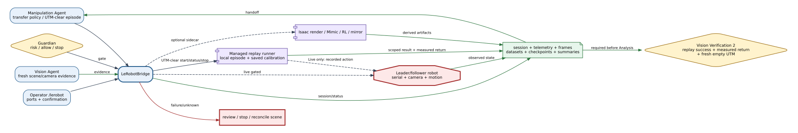
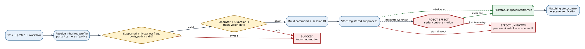
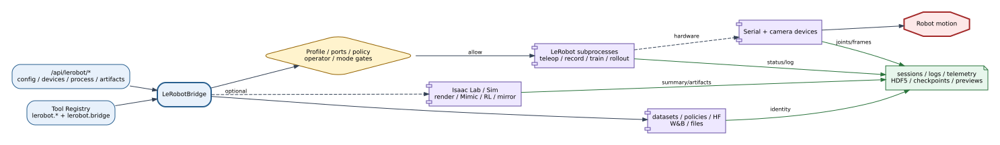

# LeRobot Bridge Reference

## Summary

`LeRobotBridge` is the robot/process boundary for profile and port management,
camera capture, teleoperation, recording, training, policy rollout, dataset
inspection, visualization, and Isaac-based synthetic/Mimic/RL/mirror
workflows. It owns process/session evidence and stop/status operations; agents
own scientific intent and Guardian/operator policy remains authoritative.

## Scope

Included: ROBOTIS OMX-AI and SO-101 profile families, serial-port memory,
camera checks, active robot camera lease, subprocess lifecycle, policies,
datasets, local visualization/W&B, Isaac sidecars, and API/tool integration.
Excluded: model quality, robot manufacturer safety certification, and claims
that test/fake profiles validate a live robot.

## Source of Truth

The public bridge methods and `register_lerobot_tools` define executable entry
points. `configs/lerobot.yaml` defines profiles, commands, storage roots, and
safety limits. Isaac helper modules are subordinate to bridge methods rather
than independently registered top-level device bridges.

## Actual Role

The bridge validates a selected profile, resolves ports/cameras/policies,
builds bounded commands, starts or simulates processes, records session state,
and exposes stop/status and artifacts. It does not decide that a grasp is safe,
convert model advice into unapproved motion, or accept stale Vision evidence.

## System Position and Agent Handoffs

**Figure LeRobot-1.** Manipulation initiates bounded robot work, Vision supplies
camera/verification context, and Guardian/operator gates live effects; session,
telemetry, dataset, and artifact evidence returns to the closed loop. Dashed
Isaac paths are optional sidecars. Evidence level is `inspection`.

| Producer | Input | Output/consumer |
|---|---|---|
| Manipulation Agent | task, profile, policy, fresh Vision and gate context | rollout/session/task evidence |
| Vision Agent | camera/capture request and scene identity | frame/pose metadata and stop-verification context |
| Operator | port/profile/policy/process controls | configuration, status, logs, datasets/checkpoints |
| Guardian | approval, risk, stop decision | blocked/start/stop status and incident evidence |

## Inputs, Commands, and Outputs

| Family | Inputs | Outputs |
|---|---|---|
| Profiles/ports | profile ID, device baselines, serial paths | validated profile and saved/detected mapping |
| Camera | camera name/map, FPS/depth settings, capture intent | availability, frame/artifact metadata |
| Teleop/record | profile, confirmation, repository/dataset/session fields | command/session/status/logs |
| Train/rollout | policy/checkpoint, dataset, task, runtime limits | process status, checkpoint/result, stop evidence |
| Isaac | source datasets, environment, trial/domain settings | HDF5, preview, Mimic/RL summaries, render/mirror state |

## Internal Execution

**Figure LeRobot-2.** Profile/port/policy/Vision/operator gates precede process
start and serial robot motion; process registration, status, telemetry, and
artifacts define recovery. Internal helper stages are not separate graph nodes.

| Phase | Reads/decision | Writes/effect | Recovery anchor |
|---|---|---|---|
| Resolve | profile inheritance, port memory, camera map | normalized redacted config | validation blockers |
| Preflight | workflow support, live flags, operator confirm, policy/path | command preview | no process started |
| Start | subprocess/session identity | process and possible serial/camera effect | PID/session record |
| Observe | log/status/joint/camera output | progress and evidence artifacts | status/telemetry |
| Stop | matching process/session | terminate/control result | stop evidence and scene verification |
| Sidecar | dataset/HDF5/environment contract | Isaac process and derived artifacts | job summary/failure manifest |

## API Surface

`/api/lerobot/*` includes config/profiles/ports, camera and specimen-pose,
teleoperate, record, train, rollout, policies/download, datasets/files,
visualization and local W&B, joint telemetry, sessions, augmentation, Isaac
RGB-D, Isaac Lab validation/prepare/synthetic/Mimic/RL/e2e, and mirror
receiver/loop families. Start, status, stop, and artifact retrieval are distinct
operations. OpenAPI remains exhaustive.

## Tools and Registry Integration

`register_lerobot_tools` stores resource `lerobot.bridge` and registers the
corresponding `lerobot.*` methods. Device-labeled actions include joint probes,
camera capture, teleoperation start, record/train/rollout start, mirror loop,
and visualization start. Manipulation uses the same registered bridge; API
handlers resolve the registered resource when available.

## Connections and Protocols

**Figure LeRobot-3.** The API and Tool Registry converge on one bridge before
subprocess, serial, camera, filesystem/Hugging Face, and optional Isaac/local
service boundaries. Stop/status and evidence paths return independently; no UI
or model bypass is an execution path.

- local subprocesses run LeRobot commands, training, rollout, visualization,
  Isaac workers, and mirror receivers;
- serial device paths identify leader/follower arms;
- camera integrations expose mapped top/wrist/RealSense observations;
- filesystem roots hold datasets, policies, checkpoints, logs, HDF5, previews,
  and job summaries;
- optional Hugging Face and local W&B interactions require their configured
  credentials/services.

## Configuration and Secrets

`configs/lerobot.yaml` owns default mode/profile, profile inheritance, command
templates, safety limits, dataset/output/policy/session roots, Conda
environments, depth settings, sidecar defaults, and token path. Mutable port
and session records live under `memory/` and `runs/`. Hugging Face credentials
are referenced by environment/token path; token values MUST NOT enter docs,
logs, figures, or API responses.

## State, Events, Artifacts, and Evidence

State includes selected profile/ports, process kind/PID/status, session IDs,
commands, timestamps, log paths, and stop results. Evidence may include camera
frames, joint telemetry, episodes, datasets, checkpoints, HDF5 contracts,
success/failure manifests, preview/video files, Isaac summaries, and mirror
receiver samples. Existence is not model-quality or task-success proof.

## Runtime Modes and Fallbacks

Test mode uses fake profiles, simulated sessions, and deterministic artifacts.
Live mode requires a profile with `live_enabled` and workflow-specific
`allow_*`, resolved devices, and operator confirmation where configured.
Profile or policy substitution is explicit. Optional video backend fallback is
an implementation compatibility path, not robot fallback.

## Safety, Approval, and Effect Boundary

Configuration, inspection, dataset processing, and most Isaac work are local
or subprocess effects. Physical possibility begins when teleoperation,
recording with hardware, rollout, mirror loop, or another command opens serial
devices and controls the robot. Required gates include exact profile, supported
workflow, ports, live/allow flags, policy/checkpoint, operator confirmation,
fresh Vision where the agent contract requires it, and Guardian policy.

## Errors, Timeouts, and Recovery

Invalid profiles/ports/policies, unsupported workflows, missing executables,
busy process kinds, malformed HDF5, and failed artifact checks block or fail
with structured status. After start timeout, inspect process/session records,
joint telemetry, logs, camera/scene state, and stop status. Do not restart motion
until the old process and physical effect state are reconciled.

## Operator and GUI Surfaces

The `/lerobot` workspace exposes profiles, ports, camera, teleop/record/train/
rollout, policies, sessions, visualization, augmentation, Isaac, and mirror
operations. The live manipulation workspace can call a bounded agent run, but
the GUI is not an authority boundary and cannot waive bridge or Guardian gates.

Live joint charts replay the selected rollout's saved `motor_events.jsonl`
from its first action sample on every connection, then append all new samples.
The time origin remains the first logged action, not the time the window opens.
Closing the GUI does not stop the in-process motor logger; measured and target
values for all six joints, including the gripper, remain in the saved log.
History is streamed in bounded file chunks without discarding earlier samples;
the GUI retains the complete selected-session history. Read-only bridge safety
observers keep their separate bounded-tail behavior.

Agent-owned streams now support run/loop/agent/attempt directories with a
compatibility locator at the legacy session path. Terminal bridge observations
finalize tracking evidence without an open GUI. See
[Loop Artifact Archiving](../runtime/loop_artifact_archiving.md) for the newer
working-tree storage contract, configured-root resolution, and verification.

`motion_state.grasp_achievement` preserves the first threshold-qualified contact
success in the current rollout execution. The Live GUI's Grasp Achievement card
and saved artifacts use that result; `grasp_outcome`, `latest_grasp_outcome`,
and the complete attempt list retain the latest/raw diagnostic semantics.
The attempt success rate continues to include failed attempts, independently
of the binary achievement. Session changes and logger sequence restarts clear
the achievement; reconnecting and replaying the same log reconstructs it.
This is historical contact evidence, not proof that the specimen is still held.
Final transfer verification, measured-home/stop interlocks, and 3D motion
visualization continue to consume their existing evidence, not this latch.

## Current Verification

Inspection covered bridge/config/tool/API paths and focused tests for core
bridge behavior, GUI API contracts, camera, telemetry, profiles, rollout,
Isaac synthetic/Mimic, and mirror functions at `188a1d6`. No complete physical
robot campaign across every profile/policy was evaluated.

## Limitations and Known Gaps

The bridge is a large multi-responsibility implementation, and optional Isaac,
Hugging Face, W&B, camera, environment, and robot combinations vary. Graph
metadata summarizes only selected rollout/camera tools and not the complete
registered surface. Test fixtures do not establish live safety or performance.

## Related Documents

- [Manipulation Agent](../agents/manipulation_agent.md)
- [Vision Agent](../agents/vision_agent.md)
- [LeRobot Runtime Guide](../hardware/lerobot_robotis_manipulation_runtime_guideline.md)
- [Isaac OMX Mirror Guide](../hardware/isaac_sim_robotis_omx_mirror_mode.md)
- [Bridge Matrix](bridge_api_connection_matrix.md)
