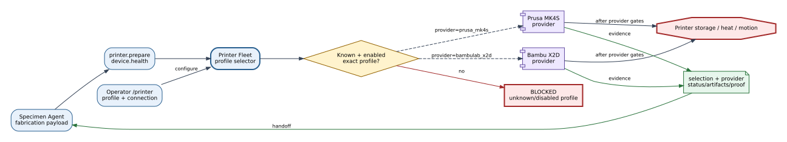
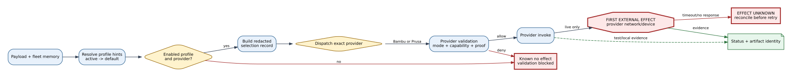
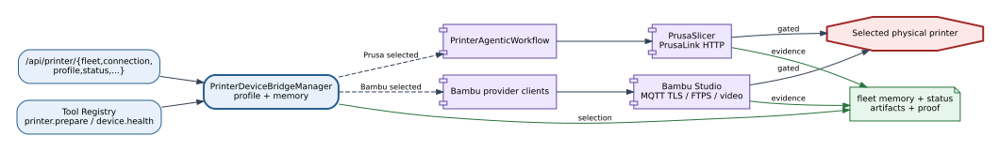

# Printer Fleet Bridge Reference

## Summary

The Printer Fleet boundary chooses one configured printer profile and routes
`printer.prepare` and health work to the matching Bambu or Prusa
implementation. It owns selection and normalized fleet state; provider
implementations own their network commands and device-specific proof.

## Scope

Included: profile inventory, default/explicit selection, connection-memory
paths, shared status/config APIs, provider dispatch, and fallback policy.
Excluded: detailed MQTT/FTPS/PrusaLink behavior, slicer internals, and physical
operating procedures, which belong to provider References and Guides.

## Source of Truth

`PrinterDeviceBridgeManager` and `register_printer_tools` define current
routing. `configs/devices.yaml` declares `bambulab_x2d_lab_01` as the default,
`prusa_mk4s_lab_01` as an explicit alternative, and automatic fallback as
false.

## Actual Role

The manager resolves a profile from payload and fleet memory, returns a
redacted selection record, and delegates to Bambu unless the selected
provider is `prusa_mk4s`. It does not autonomously move a printer, reinterpret
provider failures as success, or switch providers after a failure.

## System Position and Agent Handoffs

**Figure Printer Fleet-1.** Specimen and operator requests enter one selection
boundary and return a provider-qualified result and evidence; the dashed
provider choice is explicit configuration, not automatic fallback. This is an
`inspection` projection, not live-print evidence.

| Producer | Input | Consumer/output |
|---|---|---|
| Specimen Agent | fabrication payload and optional profile/provider selector | provider workflow result and specimen digital thread |
| Operator `/printer` workspace | fleet, connection, profile changes | persisted redacted selection/configuration |
| Guardian/device health | requested profile context | normalized provider health and mode |

## Inputs, Commands, and Outputs

| Category | Current contract |
|---|---|
| Selection input | profile ID, provider/model hints, persisted active profile, configured default |
| Tool command | `printer.prepare`; shared `device.health` |
| Configuration output | enabled profiles, capabilities, active/default IDs, fallback flag |
| Execution output | selected-printer record, selection reason, provider, mode, result/artifact fields |

Selection remains locked for the request. A result cannot silently represent a
different provider than the selected profile.

## Internal Execution

**Figure Printer Fleet-2.** Profile resolution precedes provider dispatch;
provider gates own the first external effect, while manager memory and
selection evidence remain local. Inspection establishes structure only.

| Phase | Read | Decision/write | Failure rule |
|---|---|---|---|
| Resolve | payload hints, fleet memory, enabled profiles | exact active profile and reason | unknown/disabled profile blocks |
| Normalize | capabilities and provider ID | redacted selected-printer record | do not expose credentials |
| Dispatch | provider | Bambu manager or Prusa workflow | no cross-provider retry |
| Return | provider result | normalized provider/mode/fallback fields | preserve provider failure |

## API Surface

| Family | Methods | Purpose/effect |
|---|---|---|
| `/api/printer/fleet` | GET, POST | inspect or select fleet profile; local configuration |
| `/api/printer/connection` | GET, POST | provider-qualified connection memory |
| `/api/printer/profile` | GET, POST | shared print profile defaults |
| `/api/printer/status` | GET | selected provider health/readiness |
| `/api/printer/*` provider actions | mixed | delegated slicing, probe, start, proof, or ejection behavior |

OpenAPI is exhaustive; this table is a functional ownership view.

## Tools and Registry Integration

`register_printer_tools` creates both a Prusa workflow and fleet manager. It
registers `printer.prepare` with device label `printer:fleet` and routes the
call based on `selected_provider`. `device.health` uses the same selection so
health and execution refer to the same provider family.

## Connections and Protocols

**Figure Printer Fleet-3.** API and tool entries converge on the selector,
then cross a provider-owned protocol boundary. No model, UI, or graph
descriptor bypasses provider validation and live gates. Evidence state is
inspection-backed.

The manager itself is in-process. Bambu can use subprocess/MQTT/FTPS/video;
Prusa can use subprocess/PrusaLink HTTP. Those protocols begin after selection
and are documented in the provider References.

## Configuration and Secrets

`configs/devices.yaml` owns default profile, enabled providers, priorities,
capabilities, connection-memory paths, and `allow_automatic_fallback`.
`memory/printer_fleet.json` owns mutable selection. API responses use redacted
profiles; credentials remain in provider memory/environment and MUST NOT be
written to this Reference or figures.

## State, Events, Artifacts, and Evidence

Fleet state includes active/default profile, provider capabilities, selection
reason, and fallback policy. Provider output carries hashes, G-code, telemetry,
job status, or proof. The manager does not convert those artifacts into proof
of physical completion.

## Runtime Modes and Fallbacks

Mode is provider-qualified. Test mode may use synthetic Bambu behavior or
virtual PrusaLink. Live mode delegates only when provider gates allow it.
Automatic provider fallback is disabled; an unavailable Bambu profile does
not make Prusa equivalent, and vice versa.

## Safety, Approval, and Effect Boundary

Profile selection and memory writes have local effects. Physical possibility
begins only inside a provider upload/start/control/ejection path after mode,
capability, artifact, approval, and proof gates. The fleet manager cannot make
a provider safe merely by marking it active.

## Errors, Timeouts, and Recovery

Unknown or disabled profiles block before dispatch. Provider errors and
timeouts retain the selected identity. Before retry, inspect fleet selection,
provider connection, job/telemetry state, and artifact identity. Never switch
providers to recover an unknown physical effect.

## Operator and GUI Surfaces

The `/printer` workspace and fleet/connection/profile/status APIs expose
selection, capability, readiness, and provider-specific controls. UI state is
descriptive; it does not arm a live action outside the API/provider gates.

## Current Verification

Inspection covered the manager/config classes, `register_printer_tools`,
printer route handlers, configured profiles, and focused Bambu/Prusa tests at
baseline `188a1d6`. No multi-printer live failover campaign was run.

## Limitations and Known Gaps

The primary graph advertises `prusa_bridge`, while runtime configuration
defaults to Bambu and routes both providers through `printer.prepare`.
`/api/bridges` therefore does not fully describe printer-provider coverage.

## Related Documents

- [Bambu X2D Bridge](bambu_x2d_bridge.md)
- [Prusa MK4S Bridge](prusa_mk4s_bridge.md)
- [Specimen Agent](../agents/specimen_agent.md)
- [Bridge Matrix](bridge_api_connection_matrix.md)
