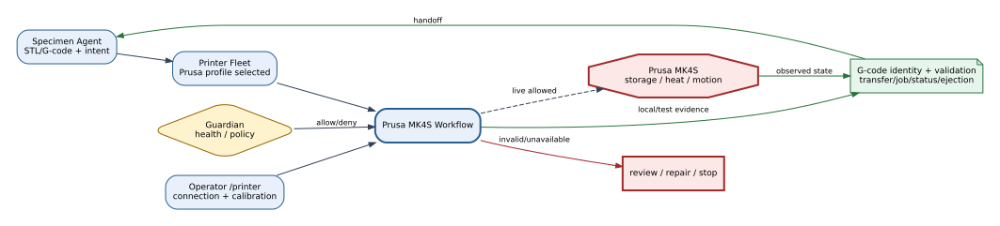
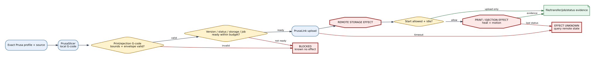
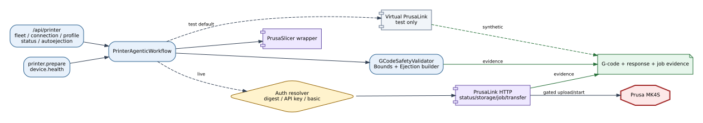

# Prusa MK4S Bridge Reference

## Summary

The Prusa MK4S provider combines PrusaSlicer, G-code validation, PrusaLink
status/storage/job/transfer operations, and an optional calibrated ejection
routine. Test mode defaults to virtual PrusaLink; live upload and start remain
separate allowed actions.

## Scope

Included: configuration and memory resolution, virtual/live PrusaLink client,
slicing, print/ejection G-code validation, upload/start/status polling,
autoejection test, and workflow results. Excluded: firmware internals and
unqualified live behavior beyond recorded evidence.

## Source of Truth

`PrinterAgenticWorkflow` owns preparation and health, `PrusaLinkClient` owns
HTTP operations, `PrusaSlicerRunner` owns local slicing, and the validator/
bounds/ejection classes own deterministic G-code checks.

## Actual Role

The provider prepares an exact artifact for an explicitly selected Prusa
profile, validates it, probes or simulates PrusaLink, and may upload/start only
when mode and live gates permit. It does not treat upload as print completion or
perform uncalibrated ejection.

## System Position and Agent Handoffs

**Figure Prusa MK4S-1.** Printer Fleet sends an explicit Prusa selection to the
workflow; job/status and artifact evidence return to Specimen, Guardian, and
the operator. Live and ejection branches are conditional inspection paths.

| Upstream | Input | Output/consumer |
|---|---|---|
| Specimen/Printer Fleet | exact profile, STL/G-code and print intent | prepared artifact and provider result |
| Operator | connection/profile/ejection calibration | redacted readiness and test result |
| Guardian | device health and failure context | status/job/storage evidence |

## Inputs, Commands, and Outputs

Inputs include runtime mode, source/model path, slicer profile, printer profile,
storage/remote path, connection/auth memory, and optional ejection calibration.
Outputs include sliced G-code, validation/bounds report, transfer/start response,
job/status snapshots, hashes, and structured failure codes.

## Internal Execution

**Figure Prusa MK4S-2.** Local slicing and G-code checks precede PrusaLink
upload/start; ejection is a separately configured physical branch with its own
cooldown, envelope, calibration, and evidence gates. Figure evidence is
inspection only.

| Phase | Check/transformation | Effect |
|---|---|---|
| Resolve | devices config plus connection/profile memory | local state |
| Slice | executable/template/output/timeout | local subprocess and file |
| Validate | print commands, bounds, safe envelope, optional ejection tail | read/local artifact |
| Preflight | version/status/storage/job/transfer and ready-wait budget | network reads |
| Upload/start | live flags, payload identity, idle/finished readiness | physical possible |
| Observe | poll job/status and retain responses | evidence |

## API Surface

Prusa uses shared `/api/printer/status`, `/fleet`, `/connection`, `/profile`,
`/autoejection-status`, `/autoejection-config`, and `/autoejection-test`
families. Bambu-named endpoints reject non-Bambu selection rather than being
reused as Prusa commands.

## Tools and Registry Integration

`register_printer_tools` constructs `PrusaBridgeConfig` and
`PrinterAgenticWorkflow`. `printer.prepare` dispatches here only when the fleet
selector returns `prusa_mk4s`; `device.health` follows the same selection.
`PrusaBridge.execute` is a compatibility wrapper, not the primary registry
entry.

## Connections and Protocols

**Figure Prusa MK4S-3.** Tool/API entries reach PrusaSlicer and PrusaLink only
through the selected workflow, with authentication, live flags, validation,
and status evidence between local intent and physical action. No UI/model
bypass is allowed.

PrusaSlicer runs through the configured wrapper/template. PrusaLink uses HTTP
with digest, API-key, basic, or none authentication as configured; status,
storage, job, transfer, metadata, upload, and start are separate operations.

## Configuration and Secrets

`devices.printer.live`, `slicer`, `virtual_prusalink`,
`test_printer_live_promotion`, and `ejection` define behavior. Mutable
connection/profile data lives under `memory/`. Credential names are
`PRUSA_USERNAME`, `PRUSA_PASSWORD`, and `PRUSA_API_KEY`; values MUST remain out
of documents, figures, events, and normal responses.

## State, Events, Artifacts, and Evidence

Evidence includes source/G-code identity, validation/bounds, slicer command and
output, selected storage/remote path, PrusaLink responses, job transitions,
timeouts, and ejection calibration/result. A successful upload is not a
successful start, and a successful start is not completion.

## Runtime Modes and Fallbacks

Test mode uses virtual PrusaLink by default and validates payloads without
network effects. Deliberate test-to-real promotion requires `transport=real`
and `allow_real_network_in_test=true`. Live mode has independent status,
upload, start, ejection, and cancel/pause flags. There is no automatic Bambu
fallback.

## Safety, Approval, and Effect Boundary

Local slicing/validation is non-physical. Upload changes remote storage; start
can initiate motion and heat. Current config allows live status/upload/start
but disables ejection and cancel/pause. Ejection additionally requires
cooldown, calibrated geometry, envelope/feedrate validation, and configured
vision conditions.

## Errors, Timeouts, and Recovery

Missing executable, invalid G-code, unavailable storage, busy job, auth/network
failure, or disabled action blocks its phase. After upload/start timeout,
inspect remote file metadata, transfer, job, and printer status before retry.
Never assume no effect from a lost HTTP response.

## Operator and GUI Surfaces

The `/printer` workspace presents selected profile, connection, status,
preparation, and ejection controls. Operator interpretation must preserve
virtual versus real transport and upload versus start versus completion state.

## Current Verification

Inspection covered bridge/workflow/client/slicer/validator classes, current
configuration and route integration, unit tests, and the dated MK4S live
validation record. The dated record is evidence for that setup, not a universal
current guarantee.

## Limitations and Known Gaps

The graph names Prusa as the printer bridge but the configured fleet default is
Bambu. Ejection remains disabled and incomplete calibration values prevent
promotion. Firmware/auth/storage variations are not exhaustively evaluated.

## Related Documents

- [Printer Fleet](printer_fleet_bridge.md)
- [Prusa Phase-One Guide](../hardware/printer_agent_prusabridge_phase1_runtime_guideline.txt)
- [Prusa Live Validation Record](../hardware/evidence/prusa_mk4s_live_validation_20260506.md)
- [Specimen Agent](../agents/specimen_agent.md)
