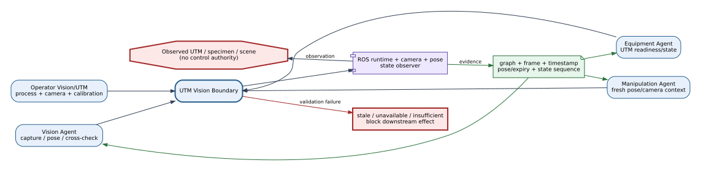
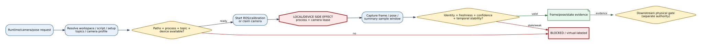
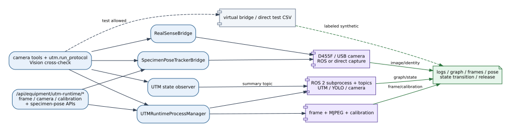

<!-- atr-doc
doc_type: reference
subtype: runtime
status: active
authority: descriptive
audience:
  - researcher
  - operator
  - developer
  - integrator
scope:
  - utm_runtime
  - vision_camera
  - specimen_pose
summary: Current UTM and visual-evidence bridge contract for ROS process lifecycle, topics, camera streams/configuration, RealSense capture, pose tracking, and temporal state evidence.
source_of_truth:
  - device_bridges/camera_vision/module.py
  - device_bridges/camera_vision/utm_runtime_bridge.py
  - device_bridges/camera_vision/realsense_bridge.py
  - device_bridges/camera_vision/specimen_pose_tracker.py
  - device_bridges/camera_vision/utm_state_observer.py
  - device_bridges/utm_macro_bridge.py
  - device_bridges/camera_vision/tools.py
  - mcp_tools/utm_tools.py
  - configs/devices.yaml
  - app/main.py
last_verified: 2026-09-13
verified_against: working-tree
related_docs:
  - docs/device_bridges/README.md
  - docs/agents/vision_agent.md
  - docs/agents/equipment_agent.md
  - docs/hardware/utm_ros_vision_runtime_bridge.md
supersedes: []
-->

# UTM Vision Bridge Reference

## Status at a Glance

| At a glance | Details |
|---|---|
| Purpose | Camera capture, pose tracking and temporal visual evidence |
| Connects | Vision / camera workspace ↔ camera and ROS services |
| Effect | Capture, configuration and process control; not instrument actuation |
| Implementation | [Camera/Vision module](../../device_bridges/camera_vision/module.py) and [runtime](../../device_bridges/camera_vision/utm_runtime_bridge.py) |
| Verification | Package, alias, observation and API regressions on 2026-09-13; earlier physical scope remains [recorded separately](#current-verification) |

## Installed Observation Bridge

`camera_vision@1.0.0` is the observation bridge required by the installed
`vision@1.0.0` Agent Package. The Runtime IDE shows package → bridge → observation
components using the common graph and Inspector. This does not turn each provider
into a peer package. Package ownership and current draft membership are preserved
when opening bridge internals, including shared owners.

The package directory contains the UTM runtime manager, temporal observer,
RealSense adapter, specimen-pose tracker and camera tool registration. Legacy
imports alias these canonical modules, preserving monkeypatches, injected resources
and existing configuration/calibration/output locations. Dependencies are listed in
the [bridge README](../../device_bridges/camera_vision/README.md); discovery does not
install packages, start processes or probe hardware.

LeRobot is a shared execution dependency: it owns ActiveCam move/capture/return
and rollout stop. Camera/Vision owns observation services only. The shared observer
used by Equipment is not recreated. Existing simulated camera tools stay simulated;
the migration does not silently activate the optional RealSense capture route.

## Summary

The UTM Vision boundary manages the configured ROS 2 UTM/YOLO/camera runtime,
camera streams and calibration, bounded RealSense capture, specimen-pose
snapshots, and temporal UTM state observations. Its evidence supports Vision,
Equipment, and Manipulation; it does not by itself authorize equipment or
robot motion.

## Scope

Included: runtime process start/stop/status/probe, expected graph, frame/MJPEG
paths, camera profile/device discovery/apply/cleanup/calibration, RealSense
enumerate/validate/capture, pose status/snapshot/release, summary-topic state
window, and test-only virtual fallback. Direct UTM protocol data generation
and the placeholder macro bridge are documented as compatibility paths.

## Source of Truth

`UTMRuntimeProcessManager` owns ROS process/stream/config lifecycle;
`RealSenseBridge` owns direct device inspection/capture;
`SpecimenPoseTrackerBridge` owns short-lived pose processes;
`utm_state_observer.py` owns temporal summary semantics. API handlers and
camera/UTM tools expose subsets of these components.

## Actual Role

The boundary starts or observes a known process stack, captures identity- and
timestamp-bearing visual/state evidence, labels unavailable/virtual behavior,
and provides stop/release operations. It does not convert a frame into proof of
specimen identity without the downstream Vision contract and does not treat a
single UTM summary sample as stable physical state.

## System Position and Agent Handoffs

**Figure UTM Vision-1.** Vision and Equipment request bounded ROS/camera/state
evidence; pose and temporal summaries feed Manipulation/Equipment gates and
Analysis provenance, while operator-owned process lifecycle remains separate.
Dashed virtual paths are test-only inspection paths.

| Producer | Request | Output/consumer |
|---|---|---|
| Vision Agent | camera, pose, equipment cross-check | fresh frame/signal/evidence |
| Equipment Agent | UTM runtime/state/protocol context | readiness and temporal state proof |
| Manipulation Agent | specimen pose/camera observation | freshness-bounded transfer context |
| Operator | process, topic, camera, calibration controls | status/graph/log/frame/calibration evidence |

## Inputs, Commands, and Outputs

Inputs include runtime mode, workspace/script/setup paths, topics, camera
profile/device/serial, capture attempts, pose confidence/TTL, calibration
request, and state-window duration/sample thresholds. Outputs include process
status/PID/log, graph snapshot, frame data/metadata, device/profile inventory,
calibration command/status, pose result/expiry/release, state sequence/transition,
and structured fallback/failure codes.

## Internal Execution

**Figure UTM Vision-2.** Configuration and device/process probes precede ROS
startup or camera acquisition; timestamps, identity, quality, and temporal
stability gates precede downstream use. Process/camera side effects are not
equipment motion. Evidence status is inspection-backed.

| Phase | Decision | State/evidence |
|---|---|---|
| Resolve | workspace, script, setups, topics, camera profile | normalized runtime/camera config |
| Probe/start | paths, process, ports, topics, device availability | PID/log/graph or blocker |
| Capture | direct/topic frame and identity | image/data URL, dimensions, timestamp |
| Validate | freshness, confidence, marker count, stable sample ratio | signal/transition or insufficient evidence |
| Persist/release | artifact/log/pose lease ownership | evidence path and camera release status |
| Recover | stop calibration/runtime, clean ports, retry probe | explicit stopped/unknown state |

## API Surface

`/api/equipment/utm-runtime/*` includes status/start/stop/probe/graph/frame/
frame-stream, camera config/devices/probe/cleanup/apply, and calibration start/
stop/status. Specimen-pose status/snapshot/release and LeRobot camera routes
connect related visual consumers. The graph workspace projects this boundary
as `camera_utm_bridge`.

## Tools and Registry Integration

Camera tools receive the configured runtime manager and pose tracker during
bootstrap and expose visual capture/cross-check operations. `utm.run_protocol`
is registered separately for deterministic test CSV or explicitly configured
direct live backend. `utm_state_observer` is injected into runtime context for
temporal cross-check. These are coordinated components, not one
`BaseBridge.execute` implementation.

## Connections and Protocols

**Figure UTM Vision-3.** API/tools reach process, camera, pose, and state
components; ROS 2 topics, USB/RealSense, subprocesses, and MJPEG return visual
and temporal evidence. Test-only virtual and legacy direct/macro paths remain
dashed and cannot bypass freshness or proof gates.

- subprocess/shell setup launches the configured external UTM ROS workspace;
- ROS 2 topics include compression summary, raw/annotated frames, camera info,
  and configured stream topics;
- camera access may use ROS subscription or direct RealSense/USB capture;
- MJPEG/frame endpoints proxy bounded observations;
- calibration is a separately managed subprocess/command lifecycle.

## Configuration and Secrets

`devices.utm_vision_runtime` defines workspace, script, logs, timeouts, topics,
setup paths, environment, and virtual-test allowance. `specimen_pose_tracker`
defines D455F serial/topics/script/logs, ROS paths, timeout/confidence, and
virtual-pose policy. Camera profile/calibration memory and runtime artifacts are
mutable. No shared network secret is defined by these bridge configs; device
serials and paths are operational identifiers and should be reviewed before
publication.

## State, Events, Artifacts, and Evidence

State includes process PID/status, expected/observed graph, stream subscriber,
camera profile and calibration status, pose process/lease, and state samples.
Evidence includes logs, frames, timestamps, topics, device serial/backend,
confidence, expiry, marker/span summaries, transition stability, and release
result. A stale or virtual observation remains explicitly labeled.

## Runtime Modes and Fallbacks

Test mode may use a virtual UTM bridge/pose only when explicitly allowed and
must label it. Live mode requires external workspace, setup, process/topic, and
camera readiness. A failed live capture cannot fall back to virtual evidence.
The legacy direct UTM test path creates a deterministic CSV; live direct mode
blocks unless an explicit backend/result file is configured.

## Safety, Approval, and Effect Boundary

Observation is read-oriented, but starting/stopping ROS or calibration
processes and claiming a camera have local/device side effects. This boundary
does not command UTM mechanics. Downstream physical actions require fresh,
identity-consistent evidence plus the Equipment/Manipulation/Guardian gates;
virtual or insufficient temporal evidence cannot satisfy a live gate.

## Errors, Timeouts, and Recovery

Missing workspace/script/setup, process exit, topic/frame timeout, camera
conflict, unavailable device/profile, low-confidence/stale pose, or
insufficient/unstable samples returns an explicit failure. Stop calibration or
runtime and release camera ownership before restart. A missing frame blocks the
handoff; it is not converted to a negative physical observation.

## Operator and GUI Surfaces

The Vision/UTM workspace exposes runtime graph/status, frames, stream, camera
configuration/discovery/probe/apply, calibration, and pose/evidence controls.
The LeRobot workspace also consumes camera/pose data. Operator displays must
show source, mode, timestamp/freshness, and failure/fallback status.

## Current Verification

Inspection covered runtime, RealSense, pose, observer, camera/UTM tool and API
code, current configuration, and focused unit/integration tests at `188a1d6`.
It does not establish long-duration ROS/camera availability or calibrated
measurement accuracy.

## Limitations and Known Gaps

The graph groups camera and UTM evidence under one identifier while actual code
uses several managers and tools. External workspaces and hard-coded local paths
are environment-specific. `RobotBridge`/`UTMMacroBridge` live stubs are not
evidence of a production live control backend.

## Related Documents

- [Vision Agent](../agents/vision_agent.md)
- [Equipment Agent](../agents/equipment_agent.md)
- [UTM ROS Vision Guide](../hardware/utm_ros_vision_runtime_bridge.md)
- [Bridge Matrix](bridge_api_connection_matrix.md)
