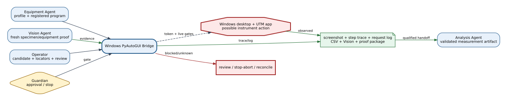
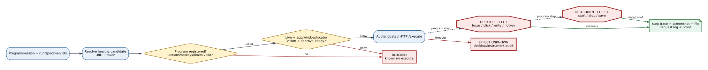
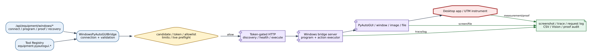

# Windows PyAutoGUI Bridge Reference

## Summary

The Windows PyAutoGUI bridge lets ATR invoke exact registered desktop programs
through a token-gated HTTP server. It resolves a healthy candidate, enforces
action/hotkey/step/time limits, records screenshots and step traces, and
supports proof/audit workflows for UTM and other desktop-controlled equipment.

## Scope

Included: discovery/candidates, connection memory, local bridge supervisor,
authentication, health, programs, locators, screenshots, run sequences, UTM
profile, request log, live preflight/validation, proof package, and completion
audit. Excluded: arbitrary desktop automation and assumptions about instrument
state based only on a successful HTTP response.

## Source of Truth

The Linux client/validator is `WindowsPyAutoGUIBridge`; the install-side server
owns Windows execution; `register_equipment_tools` owns Tool Registry entries;
`devices.equipment.windows_pyautogui` owns allowlists and defaults.

## Actual Role

The bridge normalizes an allowed program or sequence, authenticates a selected
server, invokes bounded actions, collects returned evidence, and persists
connection/profile/operator records. It does not generate unconstrained
PyAutoGUI code, bypass a registered program, or infer physical UTM completion
from cursor movement alone.

## System Position and Agent Handoffs

**Figure Windows PyAutoGUI-1.** Equipment resolves a registered protocol and
Vision/Guardian/operator supply evidence and gates before a token-authenticated
Windows desktop action; CSV, screenshot, trace, and proof return to Analysis.
This is an inspection projection, not live equipment evidence.

| Producer | Input | Output/consumer |
|---|---|---|
| Equipment Agent | exact profile/skill/program and run/specimen identity | equipment result and Analysis handoff |
| Vision Agent | fresh equipment/specimen cross-check | proof input or physical-action blocker |
| Operator | connection/candidate, locator, program, preflight | saved configuration and reviewed proof |
| Guardian | approval/risk/stop context | allow, block, recovery, incident evidence |

## Inputs, Commands, and Outputs

Inputs include bridge URL/token header, candidate identity, program ID or
bounded sequence, locators, UTM profile, run/specimen IDs, expected window/
artifact, and live flags. Outputs include health, program/locator inventory,
screenshots, per-step result/trace, request log, artifact metadata, proof
package, verification/audit blockers, and recovery status.

## Internal Execution

**Figure Windows PyAutoGUI-2.** Candidate/token/program/action validation and
live preflight precede HTTP `/execute`; desktop and possible instrument effects
are followed by step, screenshot, file, Vision, and completion proof. Timeout
after invoke is explicitly effect-unknown.

| Phase | Decision/evidence | Effect/recovery |
|---|---|---|
| Resolve | saved/discovered candidate and token configuration | local selection only |
| Validate | registered program, allowed actions/hotkeys, limits, identities | known-no-effect blocker |
| Preflight | health, PyAutoGUI, target app/window, locators, Vision/approval | no execute on blocker |
| Invoke | authenticated HTTP request with exact program/version | desktop; instrument physical possible |
| Observe | step trace, screenshots, expected text/image/file and request log | proof or effect-unknown |
| Complete | data artifact + save/export + Vision/package audit | Analysis handoff or review |

## API Surface

`/api/equipment/windows/*` includes config/readiness, discover/connect/select/
delete, local-bridge start/status/select/stop, programs/test/run-program,
screenshot/locators/capture-locator, UTM profile, live-preflight/validation,
request-log, evidence-audit, proof-package/verify, completion-audit, and
Vision-proof draft. The proxied Windows UI is a separate operator surface.

## Tools and Registry Integration

Registered tools include `equipment.pyautogui.health`, `list_programs`,
`register_program`, `delete_program`, `run`, `screenshot`, `list_locators`,
`capture_locator`, `request_log`, `utm_profile`, `save_utm_profile`,
`connection_status`, `save_connection`, `select_candidate`, and
`delete_candidate`. Consequential run/capture actions carry the equipment
device label where registered.

## Connections and Protocols

**Figure Windows PyAutoGUI-3.** Equipment API/tools pass through candidate and
token gates to the Windows HTTP server, then through server-side allowlists to
PyAutoGUI and the target desktop/instrument; request, file, screenshot, and
Vision evidence return separately. UI/model bypass is prohibited.

The Linux client uses `httpx`; discovery uses the configured port and bounded
timeout; normal calls use the token header. The Windows server controls
PyAutoGUI/window/image/file operations. Exported files and proof may be
reindexed on the Linux side, but identity must remain linked to the run.

## Configuration and Secrets

`configs/devices.yaml` owns mode, provider, URL/token environment names,
timeouts, discovery port, `allow_live_execute`, allowed actions/hotkeys,
limits, simulator, promotion policy, programs, and UTM defaults. Mutable
connection/profile/locator records live under `memory/`. Secret names are
`WINDOWS_PYAUTOGUI_BRIDGE_URL` and `WINDOWS_PYAUTOGUI_BRIDGE_TOKEN`; token
values MUST be redacted.

## State, Events, Artifacts, and Evidence

State includes selected/standby candidates, health, server identity, program
version/type, request/run/specimen IDs, action trace, and status. Evidence may
include screenshots, locator hashes/coordinates, click retry/fallback fields,
request log, exported CSV identity/quality, Vision cross-check, save/export
proof, proof package verification, and completion audit.

## Runtime Modes and Fallbacks

Simulator mode returns bounded deterministic state and synthetic screenshot
metadata. Test-live promotion is separately configured and disabled by default.
Live mode requires healthy selected candidate, token, `allow_live_execute`, and
preflight. A local bridge process may be added as standby and selected only
when healthy; it is not an automatic failover.

## Safety, Approval, and Effect Boundary

Discovery, configuration, inventory, and most proof reads are non-physical.
Desktop effect begins at accepted `/execute` actions such as focus, click,
write, hotkey, or registered program. Instrument physical effect may follow a
desktop start action. Exact program identity, allowlists/limits, token,
candidate health, live enable, preflight, Vision freshness where required,
Guardian/operator policy, and proof expectations constrain this boundary.

## Errors, Timeouts, and Recovery

Unknown candidate, token/auth failure, disallowed action/hotkey, exceeded
limits, missing target/locator, stale Vision, or failed proof blocks. A timeout
after `/execute` is effect-unknown: inspect request log, desktop screenshot,
target application/instrument, output file, and proof before repeating. Use a
registered stop/abort recovery macro only after its own readiness gate.

## Operator and GUI Surfaces

The Windows equipment workspace embeds status, connection, program, locator,
preflight, execution, trace, artifacts, proof, and recovery controls. The
standalone Windows console and proxied UI expose server-local inspection. GUI
badges do not replace exact request/proof records.

## Current Verification

Inspection covered client/server/config/tool/API paths and deterministic tests
for bridge logic, local supervisor APIs, packaged server helpers, equipment
profiles/skills, and UI contracts at `188a1d6`. It does not prove unattended
desktop or UTM reliability.

## Limitations and Known Gaps

Desktop automation remains sensitive to window, display, DPI, focus, image,
application version, and instrument state. Physical completion needs data,
save/export, and Vision/proof evidence—not HTTP success alone. Live execute is
disabled by default in checked-in configuration.

## Related Documents

- [Equipment Agent](../agents/equipment_agent.md)
- [Windows Equipment Runtime Guide](../hardware/windows_pyautogui_equipment_agent_guideline.md)
- [Windows Bridge Setup](../hardware/windows_pyautogui_bridge_windows_setup.md)
- [Bridge Matrix](bridge_api_connection_matrix.md)
