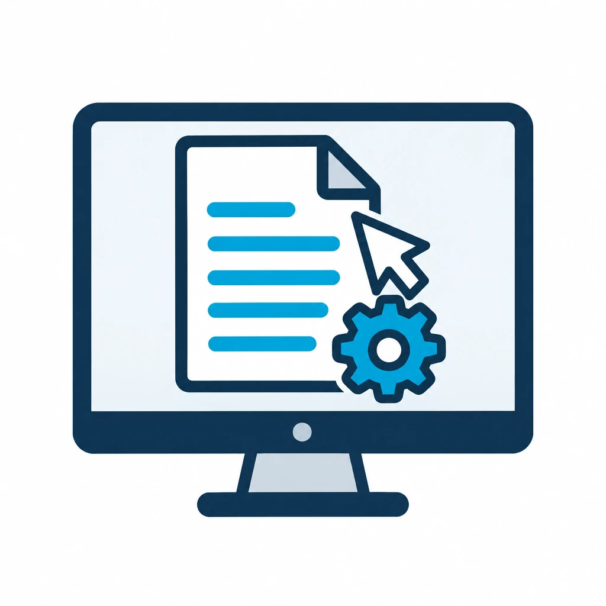
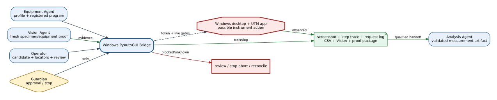
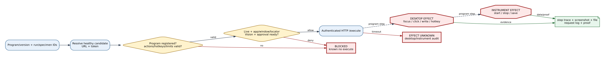
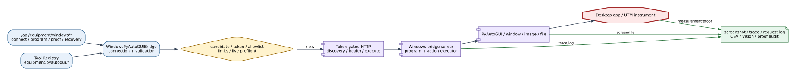

<!-- atr-doc
doc_type: reference
subtype: runtime
status: active
authority: descriptive
audience: [researcher, operator, developer, integrator]
scope: [windows_pyautogui, equipment_worker, pairing, recording]
summary: Lightweight Windows worker contract for paired bounded PyAutoGUI programs and recording evidence.
source_of_truth:
  - Pyautogui_server_for_window/bridge/windows_pyautogui_bridge_server.py
  - install/windows_pyautogui_bridge_server.py
  - device_bridges/windows_pyautogui/bridge.py
  - device_bridges/windows_pyautogui/tools.py
  - device_bridges/windows_pyautogui/module.py
  - device_bridges/windows_pyautogui/README.md
  - packages/agents/equipment/package.yaml
last_verified: 2026-09-29
verified_against: dd0d772
related_docs:
  - docs/agents/equipment_agent.md
  - docs/hardware/windows_pyautogui_bridge_windows_setup.md
  - Pyautogui_server_for_window/README.md
supersedes: []
-->

Verification scope: full-document read and static source/configuration inspection
at `dd0d772`; no hardware, model-provider or service execution. Dated test and
physical-evidence entries below retain their original scope and are not rerun claims.

# Windows PyAutoGUI Bridge Reference



Main GUI: **Windows Automation · Workspace** opens the Windows bridge workspace in a separate window.

## Status at a Glance

| At a glance | Details |
|---|---|
| Purpose | Paired desktop programs, recording and execution evidence |
| Connects | Lab Equipment / workspace ↔ Windows worker |
| Effect | GUI input can operate equipment through the selected application |
| Implementation | [Installed bridge module](../../device_bridges/windows_pyautogui/module.py) · [Windows bridge](../../device_bridges/windows_pyautogui/bridge.py) |
| Package | `windows_pyautogui@1.0.0`, referenced once by `equipment@1.0.0` |
| Verification | Guarded software/API checks through 2026-09-13; no new hardware validation implied |

## Summary

The Windows PyAutoGUI Bridge is the Linux Equipment Runtime's low-level worker.
It executes validated desktop programs and returns screenshots, locators,
recordings, files, and request logs.

It does not own LLM or Guardian decisions, Skill lifecycle, UTM experiment
semantics, completion assessment, Analysis handoffs, or ATR Controller discovery.

## Scope

Paired Windows and explicit Local workers, bounded desktop programs, recordings,
locator evidence and file export. Equipment owns experiment decisions and completion;
this low-level worker does not start a loop or grant device approval.

## Source of Truth

- `device_bridges/windows_pyautogui/bridge.py`, `tools.py`, `module.py`
- `Pyautogui_server_for_window/bridge/windows_pyautogui_bridge_server.py`
- `packages/agents/equipment/package.yaml`

Main-code contract inspected at `e70daa1` on 2026-09-28. The dated migration
verification below is retained with its original no-device scope.

## Actual Role

`device_bridges/windows_pyautogui/module.py` declares the installed
`windows_pyautogui@1.0.0` Bridge Module and runtime identity
`windows_pyautogui_bridge`. The Equipment Agent Package references that bridge
once; the package is a composition contract, not a device or a second worker.
All 18 existing registered tool IDs and the `equipment:windows_pyautogui` queue
remain unchanged. The flat bridge and tool imports are exact compatibility
aliases, so existing imports and monkeypatch targets resolve to the canonical
module objects.

Package and Runtime IDE views show `Equipment Package → Windows/PyAutoGUI →`
the existing bridge, transport, local/Windows worker, profiles, Skills, Flow,
runtime and evidence components. These are source-bound inspection links. They
do not install, pair, select, start, stop, update or execute a worker. The
existing `/equipment/windows` workspace remains the only declared bridge
workspace for both explicit Windows and Local provider selections.

## System Position and Agent Handoffs



**Figure Windows PyAutoGUI-1.** Existing Equipment/bridge/worker boundaries;
inspection diagram, not a physical execution certificate.

## Inputs, Commands, and Outputs

A program declares bounded actions, a target window, timeouts, and locators/checkpoints.

- Built-in `program1` is a non-deletable demonstration.
- Local drafts can be tested only on the Windows worker.
- Deployed programs are read-only caches validated by Linux.
- Retired programs cannot start new executions.

Windows checks allowed actions and bounds, not the program's experimental meaning.

## Internal Execution

Recording captures keyboard/mouse events with monotonic timestamps and writes
full-screen frames directly to disk at 2 FPS. An append-only `timeline.jsonl`
links periodic JPEGs and event/boundary PNGs through `pre_frame_id`,
`event_frame_id`, and `post_frame_id`. RAM holds only a small recent-frame cache
for pre-action assessment. A topmost overlay provides Stop;
`RecordingManager.stop()` closes the listener and overlay, saves a clean final
frame, and releases frame memory. Bounded Evidence has no separate Stop while
active and reads terminal state through `/recordings/status`. Preview returns
only browser-ready frames within the requested cursor/limit page, never absolute Windows paths.

`mask_regions` accepts up to 32 `{x, y, width, height}` entries. Masks apply to
frame buffers, event/exception evidence, locator source images, and checkpoints.
Declare regions that must not be saved, such as passwords or private screens,
when starting recording. Masking failures return recording errors.

Linux imports recordings through `GET /recordings/{id}/package`, which requires
internal-key authentication even on localhost. The package lists each file's
relative path, size, and SHA-256. Linux verifies and saves it under
`artifacts/equipment/recording_imports/{recording_id}`, replacing Windows absolute
paths with Linux artifact paths.

Linux analyzes recordings and generates Skills. The annotator groups 16 frames
into each 4 × 4 storyboard, analyzes every chunk sequentially through the
selected shared multimodal backend, then combines the session overview and chunk
analyses. Each response must return all source-frame IDs in order; missing or
reordered IDs fail validation. Completed chunk JSON survives a safe stop.
The LLM interprets initial state → action → state change → completion/failure
evidence and saves `workflow_summary` and `step_transitions`. Normal execution
uses the compiled deterministic program without repeating this interpretation.

The workspace lists the selected worker's recordings through
`GET /api/equipment/workers/{bridge_id}/recordings`. It queries only that live
worker, with no simulator or other-worker fallback. Package verification and
import begin only after the user selects a recording.



**Figure Windows PyAutoGUI-2.** Bounded worker execution and evidence return;
inspection scope. Current detailed recording behavior is specified above.

## API Surface

| API | Authentication and scope |
|---|---|
| `GET /health` | Local access before pairing; internal key for remote access |
| `GET /pairing/status` | local setup |
| `POST /pairing/new-code` | local setup |
| `POST /pairing/complete` | One-time code exchange |
| `GET /programs` | local setup/paired remote |
| `POST /programs/validate` | local setup |
| `POST /programs/register` | Local setup or paired deployment |
| `DELETE /programs/{id}` | Deletable local drafts |
| `POST /execute` | paired, bounded physical-possible action |
| `POST /screenshot` | paired evidence capture |
| `POST /locators/capture` | paired locator capture |
| `/recordings/...` | pairing-optional recording management |
| `GET /recordings/{id}/package` | paired recording evidence transfer |
| `GET /artifacts`, `/request-log` | paired evidence/audit |
| `GET /update/status` | paired Worker version/update state |
| `POST /update/stage` | paired, bounded release staging |
| `POST /update/apply` | paired, recording-idle process replacement |
| `POST /update/rollback` | paired, recording-idle latest backup restore |



**Figure Windows PyAutoGUI-3.** Existing transport and API connections;
inspection scope, not permission to call an instrument.

## Tools and Registry Integration

The installed module declares the existing registered tool IDs and queue;
see [bridge tools](../../device_bridges/windows_pyautogui/tools.py) and the
[connection matrix](bridge_api_connection_matrix.md). The owning package does
not create a second execution worker.

## Connections and Protocols

`WindowsPyAutoGUIBridge` reads the URL, internal key, timeout, and candidate alias
from connection memory. Scan identifies candidates through public `/discovery`
metadata without a pairing code. Discovery runs only during a scan; supervision
uses `text/plain` `/ping` every 5 seconds without adding audit-log entries.
Enter the four-digit code in the Candidate card and choose Pair & Save to
exchange an internal key. Public discovery does not grant health, execution,
file-transfer, or update access. A payload's `bridge_id` must match a saved
candidate; otherwise the request blocks, with no fallback to the selected worker.
Select/Health/Programs/Test/Run and recording import/deploy/delete use that same worker identity.

Local and Windows Bridge are explicit provider choices, not automatic fallbacks.

<a id="saved-worker-업데이트"></a>

### Saved Worker Updates

A Saved Worker card passes its candidate alias in both the URL and bridge
payload. Check, Update, and Rollback target that worker without changing the
selected worker. Unregistered aliases are rejected without fallback.

Linux builds packages from `Pyautogui_server_for_window/release_manifest.json`,
the source for release versions and file lists. Worker source and startup
commands do not hard-code release numbers. Windows stages only files allowed by both:

- Linux release manifest
- Windows `UPDATE_ALLOWED_PATHS`

Per-file size/SHA-256 and the package digest must match.
`ATR_WINDOWS_BRIDGE_INSTALL_ROOT` identifies the canonical package folder,
avoiding separate source and installed copies. Startup and the logon task call
`scripts/start_supervisor.ps1`. Updates create `updates/update_in_progress.json`
to prevent duplicate startup and preserve files in `updates/backups/<backup-id>`.
The self-updater stops the server, atomically replaces its files, synchronizes
dependencies, restarts it, and checks the target version through local `/ping`.
It skips pip when `requirements-windows.txt` matches the backup. If graceful
shutdown expires, it terminates only the old worker's process tree.
An error at any stage after replacement restores the backup. If updater recovery also
fails, the independent supervisor releases the lock and restarts the canonical
worker. Results are recorded in `updates/status.json` and `supervisor/status.json`.
Frozen EXEs are recorded as bundled runtimes.

Active recording blocks apply/rollback with `PYAUTOGUI_UPDATE_RECORDING_ACTIVE`.
The release manifest excludes user data, pairing keys, recordings, programs,
locators, and artifacts.

Older workers or workers without a saved canonical path need one manual
installation using the new package's `INSTALL_WINDOWS_BRIDGE.cmd`. Afterward,
use Saved Worker controls without moving the package folder.

## Configuration and Secrets

- Installed: the copied package folder contains the program and `.venv`;
  default data is stored separately in `%LOCALAPPDATA%\ATR\PyAutoGUIBridge`.
- Portable: `runtime\python` and `data\` inside the package folder.
- Development: explicitly run the same server as Local Bridge on Linux X11.

Installed and portable versions share the API and program format. PyAutoGUI
requires an interactive desktop, so it does not run as a Windows service.

### Pairing and authentication

Initial pairing uses a four-digit, one-time code:

- Valid for 300 seconds.
- At most 5 attempts.
- Discarded immediately on success.
- A 30-second lockout after the failure limit.
- A long-term internal key generated on success.
- Key saved in protected Windows and Linux connection memory.

The code is used only for initial key exchange. Later requests automatically
use the saved worker secret or internal key; users need not copy it repeatedly.
Codes and keys are excluded from URLs, browser storage, and request audits.

Before pairing, the local Console permits:

- GUI and local Health
- pairing status/new code
- Program Manager
- Recording

Remote `/execute`, screenshots, locators, artifacts, request logs, and updates
require saved connection authentication. Pairing status does not invalidate a
previously saved worker secret.

Recording start/status/list/preview/checkpoint/stop/save/delete do not require
pairing. Evidence export through `GET /recordings/{id}/package` still requires
saved connection authentication. Every POST requires `Content-Type: application/json`.

### Data locations

```text
<data-root>/
  artifacts/bridge_requests.jsonl
  artifacts/pairing.json
  locators/
  programs/
  recordings/
  utm_exports/
```

Do not commit `pairing.json`, connection memory, or user programs/recordings.

The module declaration references existing Linux storage without creating a
second store: `memory/windows_pyautogui_connection.json`,
`memory/equipment_runtime/`, `memory/equipment_skills/`, current workspace
templates/assets and run-scoped artifacts. Windows program, locator, recording,
request-log and export data remain under the selected worker's `<data-root>`.

## State, Events, Artifacts, and Evidence

Acceptance by `/execute` is not physical completion. The worker returns step
traces, screenshots, locators, file metadata, and request identity. Linux
Equipment Runtime assesses completion once using the Profile's completion policy.

A timeout after dispatch leaves the effect unknown. Inspect the desktop,
request log, instrument, and result files before repeating the operation.

A completed deterministic Skill segment is `execution_complete`. It becomes
`ready_for_analysis` only after the Profile's completion policy verifies the evidence.

<a id="순차-skill-편집과-배포"></a>

### Sequential Skill Editing and Deployment

Select the exact Skill version and open Workflow Editor in a separate window.
The editor changes the sequence and action fields in `workflow.json`, not Windows
`programs/*.json`. It supports moving, duplicating, and deleting steps; replacing
locator PNGs; fixed waits; and image/text/file conditions. Condition waits require
a timeout and polling interval.

`Edit Crop` uses Linux's hash-verified pre-action full frame to change only the
Target ROI, retaining Context ROI and auxiliary candidates. Crops are saved as
PNGs with a longest side of at most 512 pixels. `Reset to AI` restores the initial
annotation ROI. `Replace Locator` instead uses a selected PNG. Neither edit is
deployed to Windows before the editor's `Save`.

`Save` checks an optimistic workflow hash: if another window changed the version,
local edits are retained and a conflict is shown. Successful saving invalidates
previous compile/validation outputs. One `Deploy` runs compile, validate, package,
register, and verify on Linux; it does not call `/execute`. Separate
Compile/Validate buttons are hidden, but their APIs remain for automation and CLI use.

## Runtime Modes and Fallbacks

Windows and Local providers are explicit selections. Neither silently replaces
the other. Virtual-device tests do not establish Windows desktop or physical
UTM readiness; current run identity and selected worker remain authoritative.

## Safety, Approval, and Effect Boundary

- Keep the PyAutoGUI failsafe enabled.
- Enforce allowed actions, hotkeys, step counts, and time limits.
- Reject arbitrary Python/shell payloads.
- Exclude credentials from programs and recordings.
- Do not switch providers automatically on Windows.
- Validate physical equipment through each Profile's on-site procedure.

## Errors, Timeouts, and Recovery

A transport timeout after dispatch may have an unknown desktop/device effect.
Inspect current worker execution and fresh evidence through Equipment's existing
recovery route; do not infer no motion or repeat a command from an HTTP error.
See [Equipment selection recovery](../gui/equipment_selection_recovery.md) and
[Resume](../gui/run_resume.md). Stale screenshots and historical completion do
not satisfy a new acquisition.

## Operator and GUI Surfaces

### GUI Screen Reference


*Windows equipment connection workspace.*


*Equipment Agent Manager: deployed Skill and Vision sequence.*

The Windows workspace owns worker/profile setup; Agent Manager displays the profile-bound Flow. Displaying a saved worker or Flow does not execute its actions.
Captured on 2026-09-29 at 1920 × 1080; private values are redacted.
See the [GUI structure guide](../gui/visual_structure.md) for navigation and capture conditions.


### Windows Console

The default Console shows four areas:

1. Bridge Status
2. Program Manager
3. Recording
4. Latest Local Result

Collapsed Diagnostics loads raw Health and request logs only on request. The
Console does not expose UTM proof assessment, Skill compile/deploy, Analysis
handoff, LLM/model controls, or closed-loop control.

### Linux Lab Equipment Workspace

`/equipment/windows` is the Linux-owned equipment workspace, not a copy of the
Windows Console. Its sections appear in this order:

1. `Profile & Worker`: select the exact Equipment Profile and saved worker.
2. `Connection & Profile`: scan/pair/select and manage Local Bridge development targets.
3. `Agentic Progress`: Record, Transfer, Annotate, Build Skill, Preflight, Execute,
   Verify, Handoff from the canonical execution snapshot.
4. `Skill Recording`: import Windows packages, analyze the 2 FPS timeline, and generate Skill drafts. Completed/interrupted chunk storyboards are paginated.
5. `Skill Management`: review/save the exact version in Workflow Editor, then Deploy once to build/check/transfer.
6. `Main Progress`: execute a bounded macro with the selected Profile and Skill/program.
7. `Vision Link`: request optional, Profile-specific Middle-Level verification.
8. `Error Recovery`: use the selected model only for exceptions, not normal execution.
9. `Evidence & Data Transfer`: inspect screen/data/Vision/request evidence and the Analysis handoff audit.

The frontend reads `/api/equipment/runtime/current` and `/api/equipment/skills`.
Profile actions use `/api/equipment/profiles/{profile_id}/preflight|test`.
The Vision checkbox sends `vision_link_enabled`; the backend returns
`requested`, `profile_enabled`, `required`, and `effective`. Clearing the checkbox
cannot disable Vision when the Profile requires it for that mode.

Each toggle saves its Profile-specific value to
`memory/equipment_workspace_settings.json`, surviving page closure, refresh, and
server restart. Only Profiles without a saved value use their defaults.
Screenshot and physical-safety confirmations are operation-specific and are not persisted.

Device-specific locators, exports, and physical-validation settings remain in
`Selected Profile settings and diagnostics`. They belong to the Profile/Skill,
not hard-coded agent or worker logic.

## Current Verification

The 2026-09-13 package migration passed the guarded Equipment owner/module/bridge
selection (285 tests) and the focused frontend/API/control-view selections. The
checks observed zero physical calls and no denied effects. An unchanged second
registered-model attempt completed through the next Design with 34 actual calls;
the first stopped on a later Knowledge tool-contract rejection before BO. This
records one guarded virtual success plus the observed stochastic failure and
says nothing about physical bridge readiness. No worker pairing,
update, restart, desktop input or instrument action was performed. The earlier
physical proof remains linked from the Equipment Reference and is not replaced
or expanded by this migration.

The [2026-09-28 campaign archive audit](../paper/evidence/2026-09-28-campaign-archive-audit.md)
adds recorded multi-cycle Equipment/Analysis evidence. It is not a new worker
pairing test, complete hardware certification or a change to the migration result.

## Limitations and Known Gaps

Interactive desktop/session availability and actual instrument state remain
installation-specific. No physical action was performed by this documentation
audit. A successful program receipt is not by itself experiment completion.

## Related Documents

- [Equipment Agent](../agents/equipment_agent.md)
- [Windows setup](../hardware/windows_pyautogui_bridge_windows_setup.md)
- [Worker README](../../Pyautogui_server_for_window/README.md)
