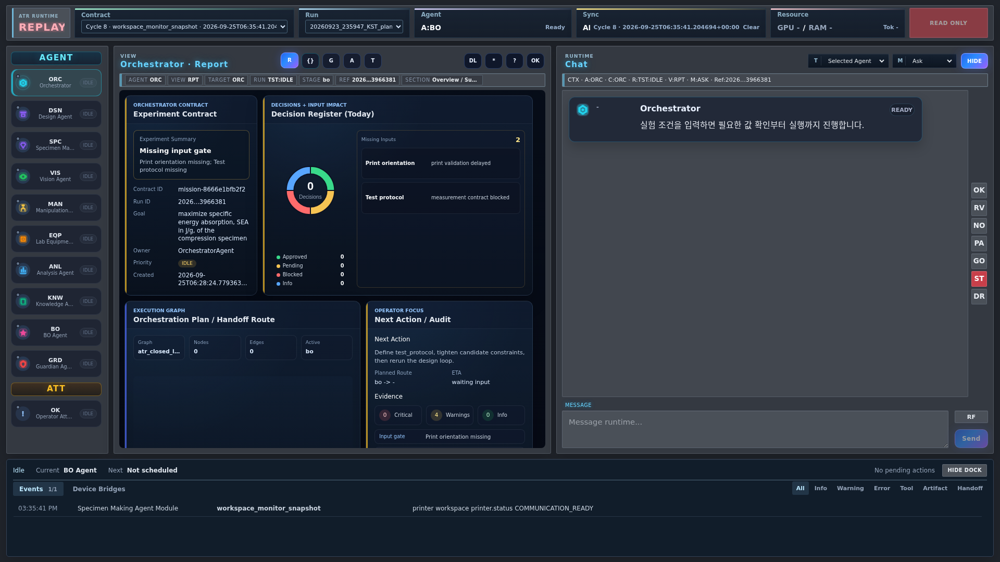

# Read-only run replay

Use Replay to inspect a recorded experiment without contacting its devices.
This is artifact/event review, not LeRobot trajectory replay; the latter is a
separate robot operation that can move hardware.

## Open a recorded point

1. On Main GUI, set Run Control to **replay · read-only review**.
2. Select an **Experiment session**, then **Start**. A separate screen-sized
   `/replay` window opens; this Start opens a viewer, not a new experiment.
3. Check the coral **REPLAY** label and selected run. Choose an available
   cycle/event in **Contract · Replay point**, then select the agent to inspect.
4. Read the point's timestamp, report and chat together. A capture-time point may
   still have a pending verdict; choose a later retained point to look for the
   result. Point changes preserve the selected agent.
5. Open **Artifacts** for original files and downloads. Check the scope notice:
   these are session files and can include files created after the selected point.

The expected result is a recorded point with its available evidence, not a
healthy or successful experiment. **Not recorded** means the viewer lacks that
evidence. It never repairs gaps using a current frame, another run, or later
state. Missing cycles are skipped; if the session has no usable point, inspect
the original [run artifacts](artifact_preservation.md) instead of restarting a
live experiment to populate Replay.



*1920 × 1080 capture, 2026-09-29: coral REPLAY indicator, recorded session and
Contract point selectors, shared agent report and chat. Only retained points can
be selected; this image does not imply complete replay coverage of all 15 cycles.
See [GUI structure](visual_structure.md) for the full page map.*

## Navigate without affecting Live

Opening Replay does **not** call `/api/run/start`, resume an experiment, or replay
a robot trajectory. Existing LeRobot replay APIs are unchanged.

Only the coral **REPLAY** title distinguishes the viewer from LIVE; the template,
agent panels, tabs, cards and renderers are shared with the original LIVE GUI. Select an archived
run, then select a cycle/event in the **Contract · Replay point** dropdown.
The dropdown moves between recorded events. Changing the point preserves
the selected agent. The page does not poll live state or connect to SSE, cameras,
telemetry WebSockets, printers, or robots.

Keyboard navigation (when not editing an input or dropdown): **Left / Right**
selects the previous / next recorded event within the selected session; **Up / Down** selects the
previous / next recorded cycle and opens its first event. Missing cycles are
skipped and navigation stops at the ends, without wrapping. Run Control opens the
viewer as a screen-sized popup window, not another dashboard tab or fullscreen.

## Read-only artifacts

The original **Artifacts** tab lists existing files from the selected session:
images, plots, CSV/JSON/JSONL, logs, STL meshes and 3MF/G-code files. Its existing
agent, loop and folder filters remain available; **All files** shows every scope.
Open original and Download use only `/api/review/<run>/files/...` GET routes.
No preview generates files, resumes an experiment, or calls a device API.

These are **session files**, not reconstructed point-in-time files: a session may
contain artifacts produced after the selected event. This distinction is shown
inside the explorer. Recorded immutable images take precedence in point views.
Archived source-path references use only matching-run, matching-cycle copies
captured no later than the replay point; missing references never fetch a current
camera frame or a file outside the run. Existing archives are not rewritten.

The file service rejects path traversal, symlinks, hidden files and internal
recovery/checkpoint directories. HTML/scripts are served as plain text; file
responses carry a sandbox CSP and `nosniff`. Write methods remain unavailable.

## Activation and experimental isolation

The following recorder details are for installation/support work. Opening the
viewer requires no recorder deployment during an active experiment.

The recorder is installed at the next normal server startup. Do not restart an
active experiment just to enable this feature. The run ID present when the
recorder starts is excluded; subsequent new run IDs are eligible. Existing runs
and existing archives are never backfilled or overwritten. Merely refreshing a
browser cannot install the backend recorder.

The controller passes an already-created presentation event to an optional,
nonblocking sink. There is no extra state serialization on the experimental
callback, no awaited archive operation, and no new device/model calls. A daemon
writer owns archive processing. Its queue holds at most eight events. Overflow
drops **review records only**. Exceptions cannot change experiment state,
verification outcomes, approvals, stage transitions, or completion criteria.

The existing vision preview publisher also submits a display-only capture event
before model review. ActiveCam, Verification 1 and Verification 2 snapshots can
therefore be reviewed while their verdict is still pending. Recording a photo
never changes `confirmed` or supplies success evidence to the experiment.

## Stored evidence

Each point stores the cycle, event, agent, timestamp, bounded event details,
available scoped reports, recent conversation messages in that cycle, and image
references. Reports retained in runtime metadata are accepted only with a matching
specimen or explicit run/cycle identity. Cards and chat reset at cycle boundaries.

Images referenced by the recorded data are copied into a content-addressed
archive. Only local PNG/JPEG/WebP files **inside the same run directory** are
accepted. The replay viewer never follows a live camera URL or reads another
run's image as a fallback. Missing files and data show **Not recorded**. An image
being modified during copying is skipped. File reads are asynchronous best-effort
observations, not a synchronous camera transaction.

The existing LIVE cards receive archived presentation state and saved image/graph
artifacts through a read-only transport adapter. There is no separate report layout.
This is **not** a frame-by-frame reconstruction of the live 3D robot pose or
continuous printer video. Controls are disabled and images without a stored copy
are unavailable. The telemetry/camera connection bundle is not loaded in REPLAY.
Conversation history is bounded to 60 messages per cycle and exported values are
size-limited. Data not emitted in presentation events is not reconstructed from
later live state. A capture-time point can show a pending verdict; later events
may contain the result.

## Storage and limits

```text
runs/<run_id>/review/
  index.json             # Ordered cycle/event index and recording diagnostics
  000001.json            # Immutable read-only point
  000002.json
  assets/<sha256>.png     # Copied image, reused when content is identical
```

Per-run limits: 5,000 points, approximately 128 MB of point JSON, 512 MB of copied
images, 8 MB per image, and 12 images per event/report. Reaching a limit stops
additional archival data, not the experiment. Queue loss and write failures are
reported in subsequent successful archive writes. Abrupt process termination can
lose pending records; this archive is a viewer, not an experiment recovery log.
Original run logs and artifacts remain the experiment's source of truth.

All `/api/review/*` endpoints are GET-only and use confined archive paths. Shared
renderers use an archive-only fetch adapter; non-GET requests and unrecorded API
reads are rejected locally. A separate server-supplied Content Security Policy
blocks live API, camera, websocket, media and form connections even if a renderer
accidentally tries one. UI caches are in-memory within the replay window, never
the LIVE session's browser storage. Structured
credential fields are excluded. This is still local experiment data, not a public
export format: free-form user/model text should be treated as potentially private.

## Validation

Maintainer test reference; these software checks are not required to view a run
and are not a new physical or browser validation claim.

```bash
.venv/bin/python -m pytest tests/unit/test_run_review.py tests/unit/test_vision_capture_preview.py -q
```

Tests cover current-run exclusion, bounded nonblocking queue behavior, disk errors,
capture-before-verdict semantics, immutable copied images, cross-cycle isolation,
cross-run image rejection, path confinement, GET-only routes, and preservation of
the existing event broadcast when the optional recorder fails.
