<!-- atr-doc
doc_type: reference
subtype: system
status: active
authority: descriptive
audience: [user, operator, developer, researcher]
scope: [gui_structure, page_navigation, screenshot_reference]
summary: Screenshot-backed map of the Main GUI, Live GUI, device workspaces, Runtime IDE, Knowledge and Replay.
source_of_truth:
  - app/main.py
  - app/run_review_routes.py
  - web/templates
  - web/static
  - agents
last_verified: 2026-09-29
verified_against: a787f2b
related_docs:
  - docs/gui/gui.md
  - docs/gui/run_replay.md
  - docs/runtime/runtime_ide.md
  - docs/modularity.md
  - docs/agents/README.md
  - docs/device_bridges/README.md
supersedes: []
-->

# GUI Structure and Screen Reference

## Summary

AX4LAB has several views of the same experimental system, not several independent
experiment engines. The Main GUI selects the runtime context; Live GUI presents
agent reports and conversation; device workspaces expose specialized settings;
Runtime IDE exposes executable composition; Knowledge exposes retained context;
Replay reads recorded sessions.

All screenshots below are **1920 × 1080 browser-content captures at 100% scale**,
taken on 29 September 2026. Open an image to inspect its original resolution.
Screenshots use the existing application, not redesigned mockups. Values belong
to the captured installation and are **not recommended defaults**. Private
addresses, credentials and local paths are redacted where present.

## Scope

This document locates information and controls, explains how views relate,
and points to specialist references. It is not a
new operating procedure, a hardware test, or proof that every visible status is
fresh. The photographed session had completed its fifteenth cycle; some reports
still expose missing or historical information. No experiment was started for
these figures.

## Source of Truth

Page routes are defined in `app/main.py` and `app/run_review_routes.py`. Templates
live in `web/templates/`, shared browser behavior in `web/static/`, and installed
agent report renderers in `agents/<agent>/frontend/`. Runtime APIs and recorded
artifacts supply the values. A screenshot records a presentation, not a second
source of runtime truth.

## 1. Page Map

| Surface | Route | Read here | Configure or act here |
|---|---|---|---|
| Main dashboard | `/` | Backend/model availability, run summary, workspace entry points | Backend/model and run controls |
| Live GUI | `/live` | Agent Report, Backend, Graph, Artifacts, Timeline and conversation | Operator messages, approvals and guarded run controls |
| Printer | `/printer` | Printer evidence, telemetry, preparation and ejection status | Selected fleet profile, print defaults and guarded preparation/start |
| Manipulation | `/lerobot` | Policy/session information and robot setup | Teleoperation, recording, training, rollout and agent-bridge settings |
| Vision | `/device-bridge/vision-utm` | Camera/ROS connection and observation panels | Camera/bridge configuration and explicit capture controls |
| Windows automation | `/equipment/windows` | Worker, connection, Skills and evidence | Bridge setup and explicitly requested desktop actions |
| Equipment Agent Manager | `/equipment/agent-manager` | Profile-bound Skill sequence and Vision slots | Equipment Flow composition and save |
| BO workspace | `/bo` | Optimization configuration, objective and available figures | BO configuration; not a substitute for measured observations |
| PLC | `/plc` | PLC transport and latch state | PLC configuration and guarded reset/resume controls |
| Test-mode profiles | `/test-mode-settings` | Installed execution-profile differences | Persistent profile edits for subsequent admission |
| Runtime IDE | `/ide` | Graph, module internals, contracts and execution evidence | Draft edit, validate, compile, dry-run, version and activate |
| Module Management | `/module-management` | Module library, ownership and configuration | Management load, module drafts/configuration and registration |
| Knowledge | `/knowledge` | Wiki, memory, source provenance and delivery evidence | Authorized memory/source operations |
| Replay | `/replay?run_id=…` | Recorded run/cycle/event and retained artifacts | Selection only; no experiment/device execution |

The usual reading path is **Main → Live → selected agent → report or evidence**.
Open a device workspace for its configuration, not to replace that agent's
run-bound completion checks. Use Runtime IDE for execution structure and Replay
for historical inspection.

## 2. Main GUI: Entry and Runtime Control

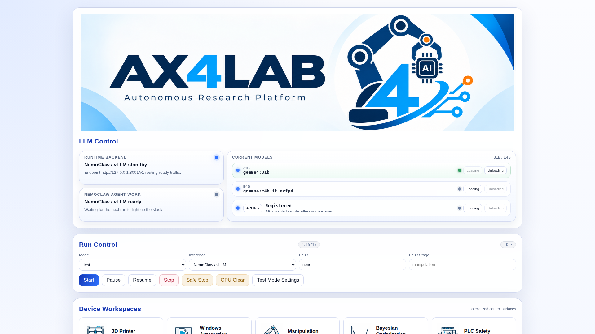

**Figure GUI-1.** The upper dashboard separates model/backend availability from
Run Control. Model readiness does not mean an experiment is running. Mode,
inference backend and run controls are distinct from device settings.

**Figure GUI-2.** The next viewport contains workspace launchers and downstream
status panels. These are links to specialized surfaces, not sequential steps in
the experiment. The dashboard continues below the first viewport.

Test execution profiles have their own editor. The profile name is not enough
to infer whether hardware will be used; inspect the per-agent routes.

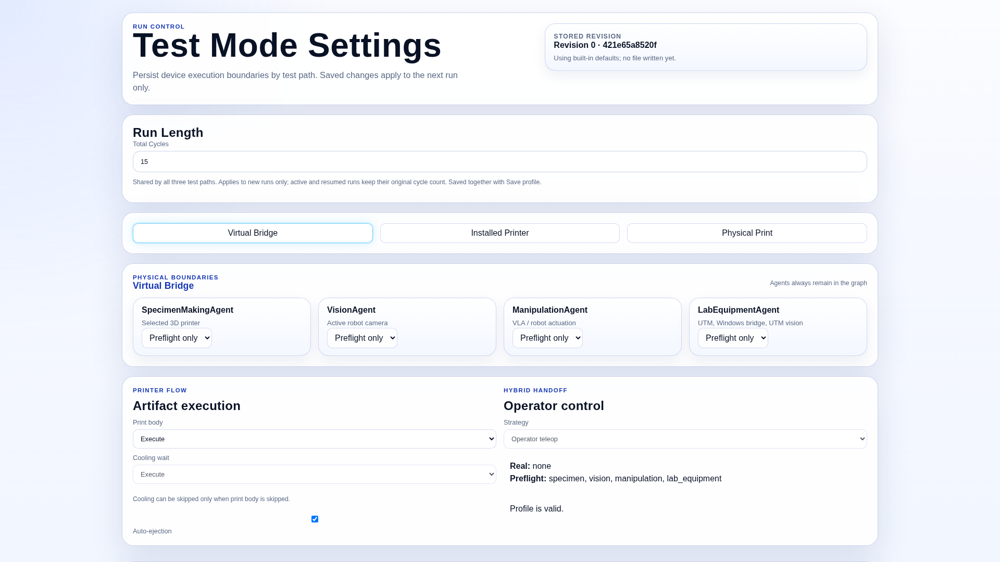

**Figure GUI-3.** Test-mode configuration, photographed without changing or saving
any values. See [Test Mode](../runtime/test_mode.md) for the distinction between
virtual bridges, installed-printer validation and physical printing.

## 3. Live GUI: Persistent Shell and Selected Agent

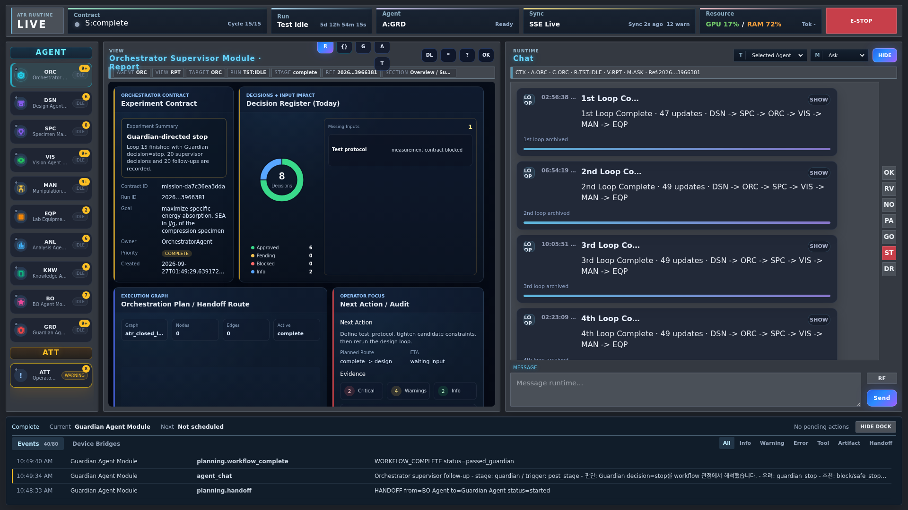

**Figure GUI-4.** The unchanged Live shell, displaying a completed session. The
selected report is Orchestrator while the header identifies the run's last active
agent. Selecting a report does not execute that agent or change the run stage.

| Region | Purpose | How to read it |
|---|---|---|
| Top status strip | Contract/cycle, run, active agent, sync, compute and emergency controls | Run context, not the currently selected report |
| Left agent binder | ORC, DSN, SPC, VIS, MAN, EQP, ANL, KNW, BO, GRD and attention | Single-click selects a report; double-click opens its Backend view |
| Center toolbar | Report / Backend / Graph / Artifacts / Timeline | Different projections of the selected context |
| Context strip | Agent, view, target, run, stage, reference and section | Check this before interpreting a card or trace |
| Report body | Agent-specific cards and plots | Scroll inside this region for lower cards |
| Right chat | Conversation, questions, responses and loop summaries | Can be shown or hidden without changing execution |
| Bottom dock | Current/Next, events and device-bridge evidence | An execution/navigation aid, not another workflow engine |

Report cards and the event dock have independent scroll areas. Hiding chat gives
the report more horizontal space. Agent status badges, selected-tab highlights
and unread counts have different meanings; an illuminated selected tab does not
prove that an agent is running. See [Live behavior](gui.md) for event-driven
attention, telemetry and chat details.

### Agent Reports

Each agent's reference embeds its own full-resolution screenshot alongside its
GUI explanation. This table links those pages rather than duplicating ten large
images here.

| Agent | Main information in its report | Illustrated reference |
|---|---|---|
| ORC | Experiment contract, decision register, handoff route and next action | [Orchestrator](../agents/orchestrator_agent.md#gui-screen-reference) |
| DSN | Generated specimens, physical design space, candidate comparison and constraints | [Design](../agents/design_agent.md#gui-screen-reference) |
| SPC | Selected specimen, printing progress, video, thermal/material and connection evidence | [Specimen Making](../agents/specimen_agent.md#gui-screen-reference) |
| VIS | Live observation, Active Cam evidence, UTM Verification 1/2 | [Vision](../agents/vision_agent.md#gui-screen-reference) |
| MAN | Robot pose, measured/target policy tracking and motion/grasp state | [Manipulation](../agents/manipulation_agent.md#gui-screen-reference) |
| EQP | Agentic Progress, deployed Skill sequence, bridge and test evidence | [Lab Equipment](../agents/equipment_agent.md#gui-screen-reference) |
| ANL | Objective, SS/FD curves, evaluation region and measured metrics | [Analysis](../agents/analysis_agent.md#gui-screen-reference) |
| KNW | Recorded knowledge activity, supply and accessible references | [Knowledge](../agents/knowledge_agent.md#gui-screen-reference) |
| BO | Objective, posterior/acquisition and separate initial-design/LHS evidence | [BO](../agents/bo_agent.md#gui-screen-reference) |
| GRD | Decision, gates, approval queue, incidents and stop verification | [Guardian](../agents/guardian_agent.md#gui-screen-reference) |

### Trace and Evidence Views

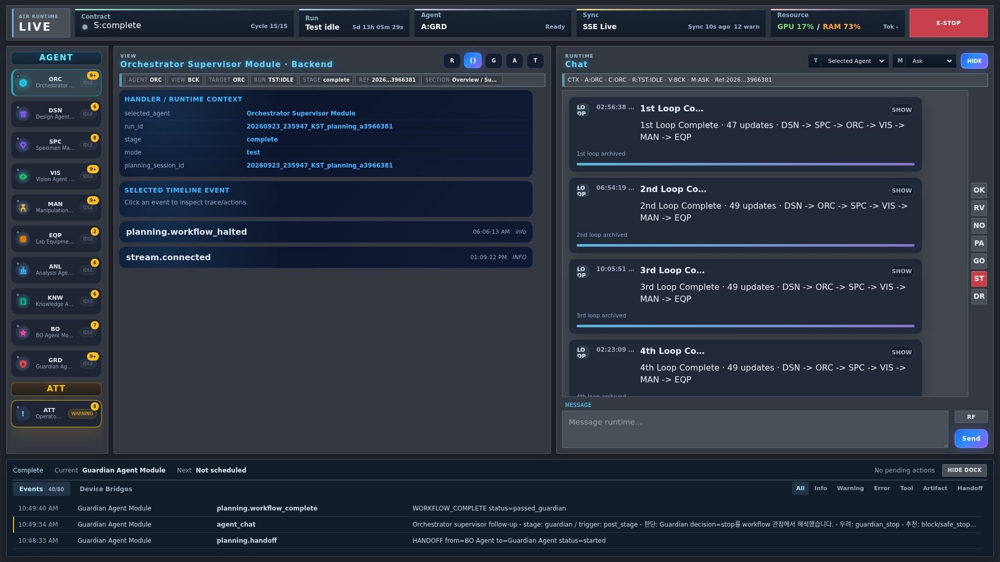

**Figure GUI-5.** Backend is the inspection view for the selected agent's execution
context and trace. It is not the Main GUI's inference-backend selector.

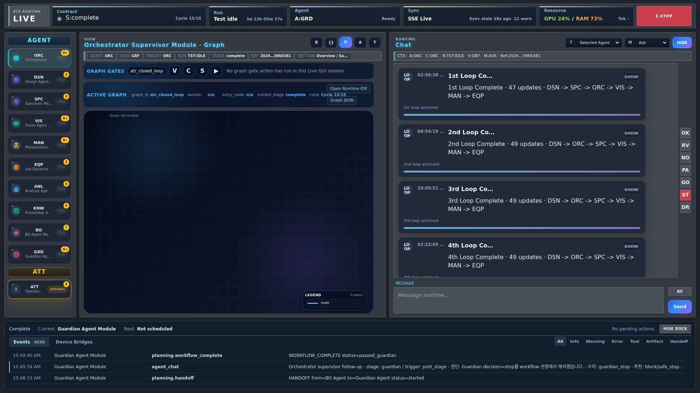

**Figure GUI-6.** Graph exposes runtime graph context and gate controls. This
completed-session capture reports “Graph not loaded”; no nodes were invented.
The populated Runtime IDE graph is shown in Figure GUI-20.

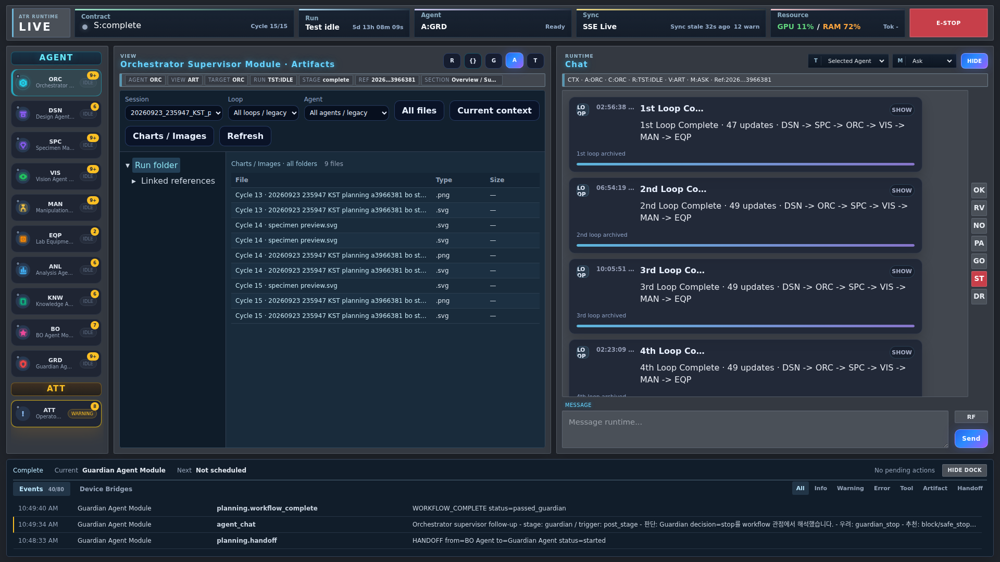

**Figure GUI-7.** Artifacts groups retained files by available run/agent/loop
context. Here All files and Charts / Images expose linked figures across folders.
File existence and physical completion are different claims. See
[Artifact Preservation](artifact_preservation.md).

**Figure GUI-8.** Timeline exposes event order and selection context. An event
entry is evidence to inspect, not authorization to repeat a device command.

## 4. Device Workspaces: Setup Is Separate from Reporting

### Printer

**Figure GUI-9.** The top of `/printer` combines selected-printer identity,
telemetry, camera and guarded preparation/start controls. The camera was not
started for this capture; unavailable telemetry is left visible.

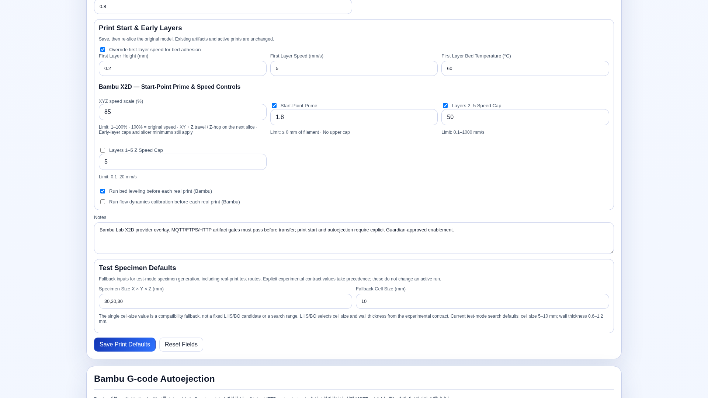

**Figure GUI-10.** A separate scroll position shows Print Start & Early Layers:
XYZ speed scale, start-point prime, independent early-layer/Z caps, bed leveling
and calibration. These are saved installation values, not universal defaults.
Changing a profile requires saving and re-slicing; it does not rewrite an
already-generated file. See the [3DP guide](../tutorials/device_workspace_3dp_usage.ko.md)
and [Bambu bridge](../device_bridges/bambu_x2d_bridge.md).

### Manipulation

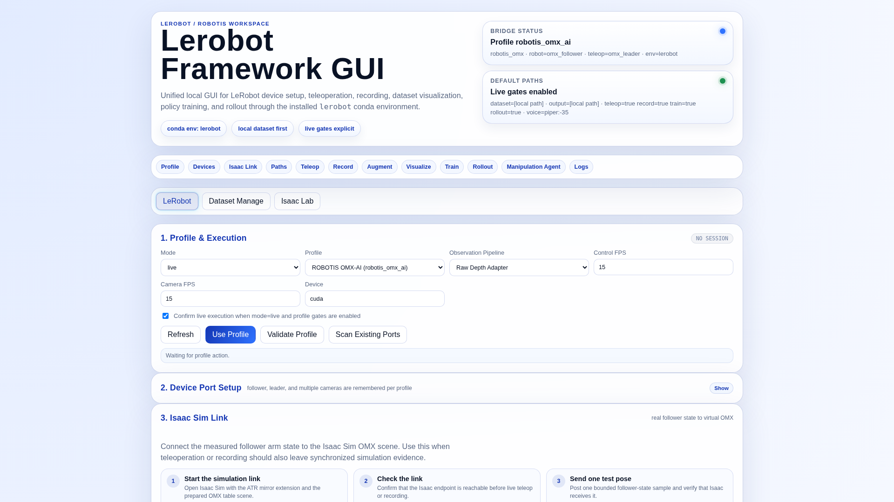

**Figure GUI-11.** `/lerobot` groups profile/device setup, teleoperation, recording,
training, rollout and the Manipulation Agent bridge. The top tabs also separate
dataset management and Isaac Lab surfaces; opening the page does not validate
those optional installations.

**Figure GUI-12.** Standalone Inference / Rollout configuration. The interpolation
checkbox and output-rate setting belong to output delivery, not a new VLA policy.

**Figure GUI-13.** The agent bridge has its own saved task/profile controls for
the existing loop route. Do not assume that inspecting a standalone rollout form
changes the agent's selected profile. See [LeRobot bridge](../device_bridges/lerobot_bridge.md).

### Vision, Equipment and PLC

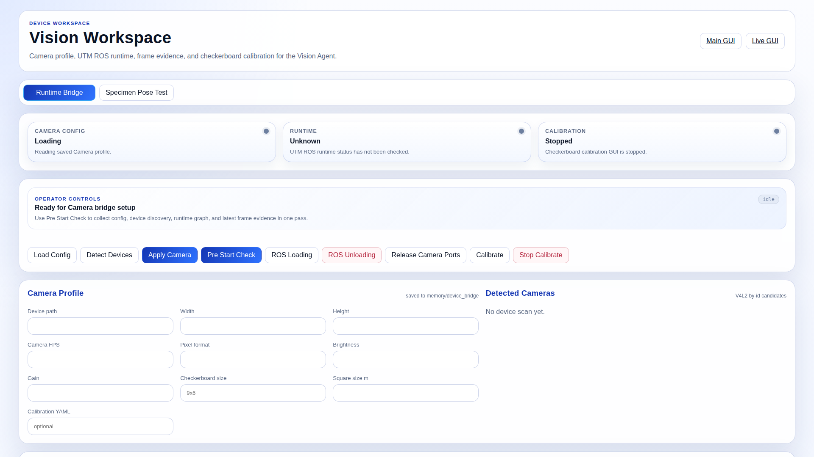

**Figure GUI-14.** Vision Workspace owns camera/bridge setup. The Live VIS report
instead presents task-scoped images and verdicts. Receiving a frame is not the
same as passing placement or clearance verification.

**Figure GUI-15.** Windows Automation exposes bridge connectivity and desktop
automation setup. Private endpoints are redacted; no screen click or remote
command was issued for this figure.

**Figure GUI-16.** Agent Manager composes a profile-bound Flow from exact deployed
Skill versions, completion/failure routes and optional Vision slots. This authoring
view differs from Live EQP's execution-progress cards. See [Equipment](../agents/equipment_agent.md)
and [Windows bridge](../device_bridges/windows_pyautogui_bridge.md).

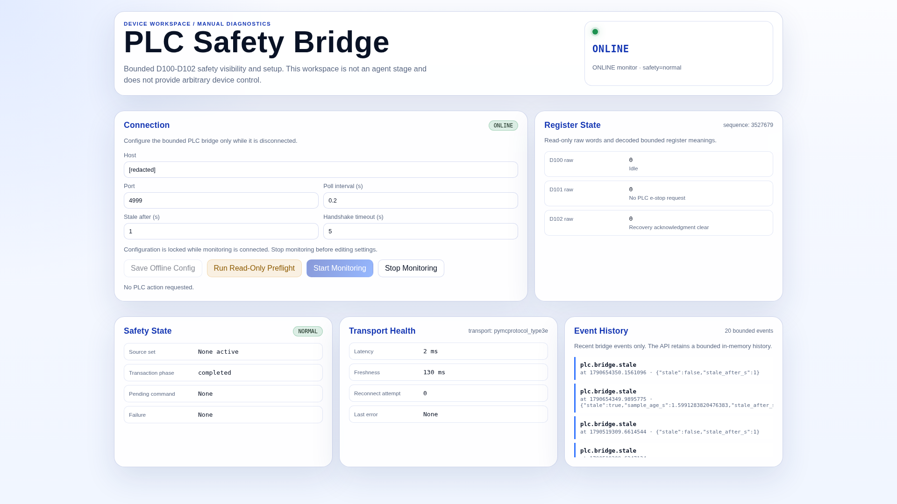

**Figure GUI-17.** PLC has a dedicated status/configuration surface. A GUI reset
button is not proof of a physical reset; use the [PLC contract](../device_bridges/plc_safety_bridge.md).

### BO Workspace

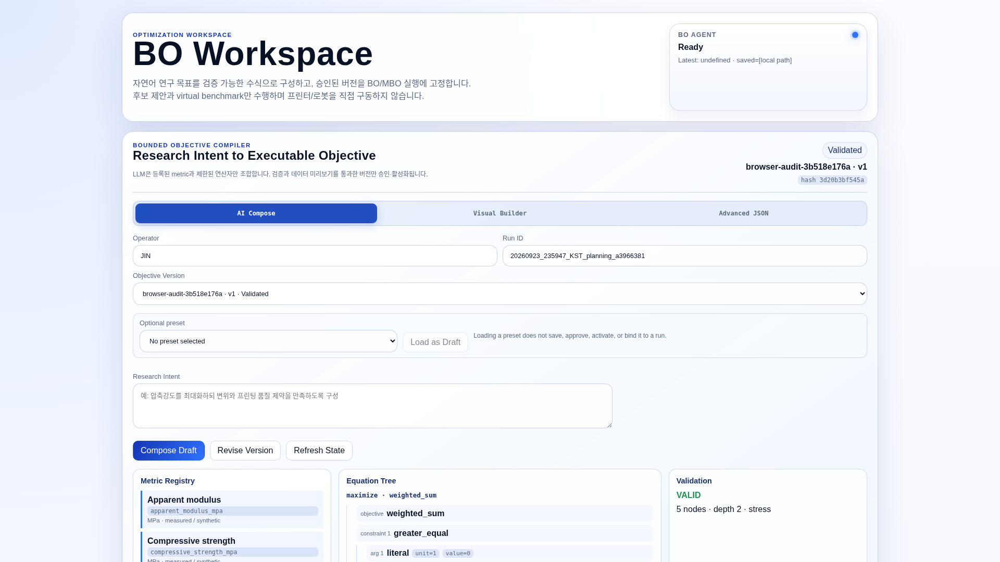

**Figure GUI-18.** `/bo` is the dedicated optimization workspace. Live BO is a
run-scoped report, not this configuration form. Missing posterior evidence is not
filled with synthetic points for documentation. See [BO](../agents/bo_agent.md).

## 5. Runtime IDE and Module Management

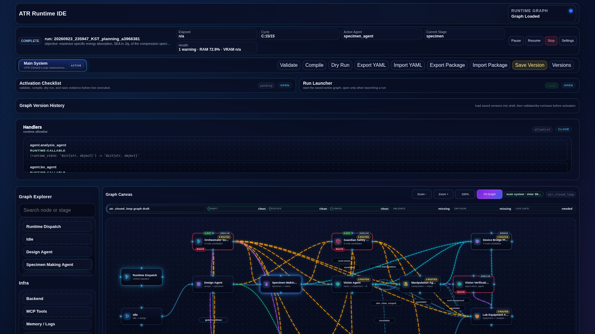

**Figure GUI-19.** Runtime IDE separates the run summary, graph/version controls,
activation checklist and run launcher. Validate, Compile, Dry Run and Save Version
are distinct operations; none was executed while taking this screenshot.

**Figure GUI-20.** Scrolling to Graph Canvas exposes the graph and explorer. Node
selection opens inspection; the editable graph and module internals describe
execution contracts. A drawn edge or source-reference box is not by itself proof
of a scheduled action. Detailed areas and activation rules are in
[Runtime IDE](../runtime/runtime_ide.md).

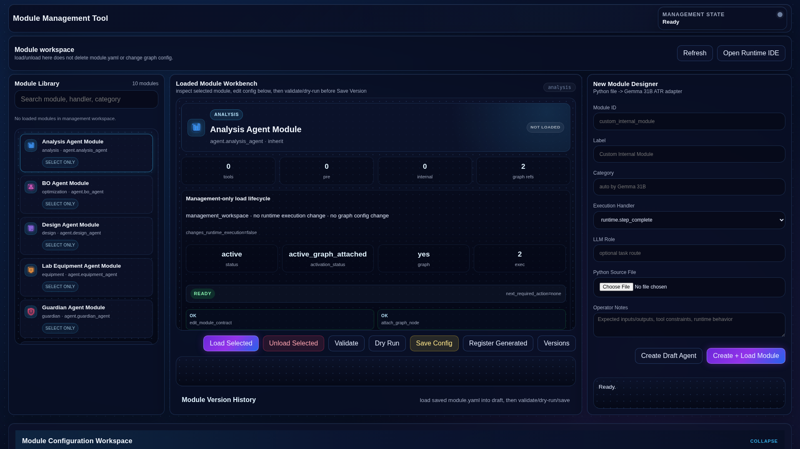

**Figure GUI-21.** Module Management has a library, selected-module workbench,
designer and configuration editor. Management Load, graph attachment, package
membership and runtime activation are separate states. See
[Modularity](../modularity.md); selecting a module does not start it.

## 6. Knowledge: Reference, Memory and Delivery

**Figure GUI-22.** AX4LAB Wiki provides searchable, source-linked explanations.
The list and article panel share the page with freshness and access-scope status.

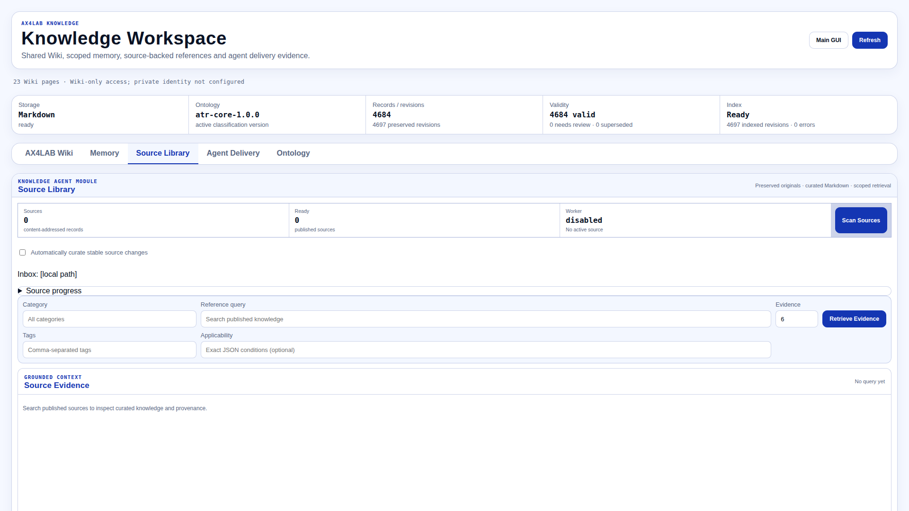

**Figure GUI-23.** Source Library separates originals, curation and retrieval from
the Wiki. This installation had no published Source Library items; the existing
empty state is shown rather than invented citations.

Memory and Agent Delivery are identity-scoped, not public copies of the entire
run archive. This capture context had Wiki-only access. Their
[Memory](assets/screenshots/2026-09-29/knowledge-memory.png) and
[Delivery](assets/screenshots/2026-09-29/knowledge-delivery.png) screens therefore
show the actual access boundary. A delivery receipt, retrieval result and cited
use are separate evidence. See [Knowledge contracts](../knowledge/wiki_memory.md).

## 7. Replay: The Same Layout, Recorded Data

**Figure GUI-24.** Replay reuses the Live template, agent reports and tabs. The
pastel-red REPLAY label, archived-run selector and Contract replay-point selector
identify historical viewing. This screenshot shows a retained point, not the
live fifteenth-cycle state.

Choose the run first, then a recorded point. Left/Right moves between recorded
events; Up/Down moves between available cycles when not editing an input.
Read-only artifacts may include files produced later in the selected session;
the point view is not a claim that every session file existed at that instant.
See [Replay](run_replay.md) for coverage, image mapping and missing-data behavior.

## 8. Choosing the Right Surface

| Question | Start here | Follow through |
|---|---|---|
| Which model/backend is available? | Main → LLM Control | Do not infer availability from a previous chat |
| What is this cycle doing? | Live → top strip and event dock | Select the agent Report, then Backend/Timeline |
| Which specimen and constraints were selected? | Live → DSN | Candidate identity and retained artifacts |
| Which print settings will be used? | Printer → Print Defaults | Saved profile and newly sliced artifact |
| Why did image verification wait? | Live → VIS | Scoped image/verdict, then Vision bridge status |
| What did the robot execute? | Live → MAN | Policy tracking and session artifacts; LeRobot for configuration |
| What is the UTM sequence? | Live → EQP | Agent Manager Flow and exact deployed Skills |
| Which curves and objective were computed? | Live → ANL | Cycle selector, SS/FD view and original CSV/metrics |
| Which knowledge reached an agent? | Knowledge → Agent Delivery | Receipt and citation, not merely library size |
| How are modules connected? | Runtime IDE | Module Management and package/graph contracts |
| What was visible earlier? | Replay | Recorded point plus available archived artifacts |

## Limitations and Known Gaps

- These are single-viewport captures, not full-page images squeezed into 1080
  pixels. Lower cards require scrolling; important configuration sections have
  their own screenshots.
- The source session is complete. Idle, stale, unavailable, unassessed and
  pending labels are preserved. Different cards can have different evidence
  scopes; these images are not a synchronized historical reconstruction.
- Some completed-session projections are incomplete: Guardian details, the Live
  Graph view and live MAN/VIS telemetry are not fully populated. The BO screenshot
  was taken after its recorded posterior and LHS figures finished loading.
  These views are not evidence of a successful fresh execution.
- Knowledge private reads returned the expected access refusal without a trusted
  private identity. The capture did not change authentication or access policy.
- Existing mixed Korean/English UI text is retained; the explanatory document is
  English. Browser chrome, operating-system decorations and mobile layouts are
  outside this 1920 × 1080 content-viewport collection.

## Verification

The screenshot collection used Chromium/Playwright with device scale factor 1,
fresh browser contexts and the current application's templates/assets. The
dedicated Browser plugin was not available. The browser blocked write/control
requests; only inspected Knowledge read/query POST routes were permitted.
Fullscreen activation, LeRobot dataset-list/Mimic-status POST requests and video
stream startup were not used to produce the documentation. The Live HTML was
rendered directly from the checked-in `planning.html` template to avoid the
page route's session-preparation callback; its report data came from existing
read APIs. Other pages used their actual application routes.

No product code, saved device profile, run record or raw artifact was edited.
No model, print, robot motion, camera load, recovery or server restart was started.
The [capture inventory](assets/screenshots/2026-09-29/capture_manifest.json)
records routes, dimensions and image hashes. Screenshots and local links are
checked independently of hardware or scientific validation.

## Related Documents

- [Documentation index](../README.md)
- [Live GUI behavior](gui.md)
- [Agent references](../agents/README.md)
- [Device bridge references](../device_bridges/README.md)
- [Runtime IDE](../runtime/runtime_ide.md)
- [Modularity](../modularity.md)
- [Knowledge](../knowledge/wiki_memory.md)
- [Replay](run_replay.md)
