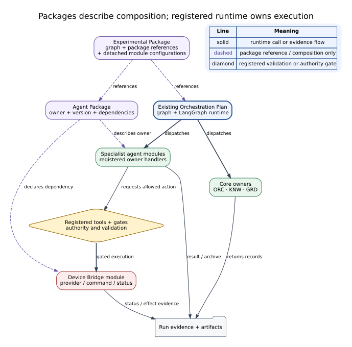

# Packages and Plans — Configuration and Ownership

Modularity separates configuration from execution ownership. Importing a package does not install, connect or run equipment.

| Concept | Responsibility |
|---|---|
| Agent Module | Agent backend, settings, execution definition and Report |
| Agent Package | Module version, owned files and bridge dependencies |
| Device Bridge | Provider connection, protocols, tools, state and effects |
| Experimental Package | Graph/agent references, attachments and detached setting drafts |
| Orchestration Plan | Graph participants, conditions and handoffs |
| Owner Plan | Supported Knowledge/Guardian configuration declarations |

## Connections

Experimental packages reference agent packages and attachments; agent packages reference required bridges. Registered agents and tools invoke bridges through the active graph.

ORC, KNW and GRD remain core platform owners with a different lifecycle from removable specialist packages. A bridge is neither another agent nor a decorative package element.

## Import and application

Import creates a detached draft. Validate only checks it. Explicit Apply uses existing versioned persistence. New runs bind the resulting snapshot; importing a package does not replace an active run's settings.

Knowledge plans configure supported scopes, sources and budgets. Guardian declarations supply advisory context, not changed stop rules, thresholds or interlocks. Absent declarations retain existing defaults.

Dashed lines denote configuration references; solid lines denote execution relationships. This does not imply a remote installer, marketplace or arbitrary code hot swap.

[Modularity reference](../../modularity.md), [run contracts and Setup](experimental-setup.md).
