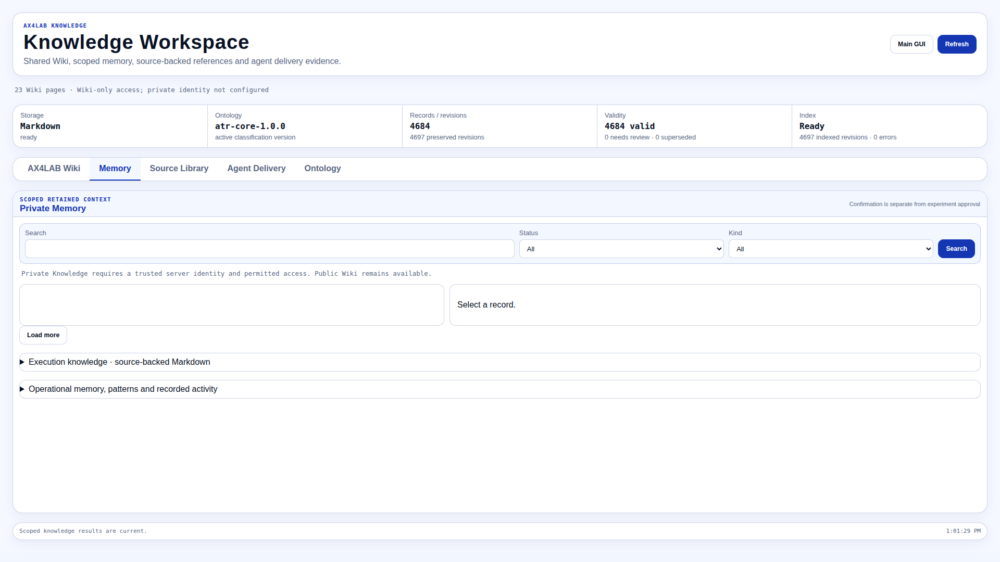
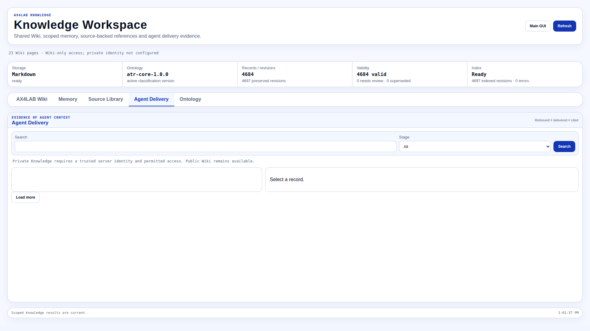

<!-- atr-doc
doc_type: reference
subtype: system
status: active
authority: descriptive
audience: [operator, developer, researcher, maintainer]
scope: [knowledge, ax4lab_wiki, private_memory, agent_context]
summary: Public Wiki and private memory contracts, ownership, and verification boundaries.
source_of_truth:
  - knowledge/context_service.py
  - knowledge/private_memory.py
  - knowledge/workspace_api.py
  - knowledge/delivery.py
  - agents/core/knowledge/context.py
  - app/controller.py
  - web/static/knowledge_workspace.js
  - web/static/knowledge_live.js
  - web/static/planning.js
last_verified: 2026-09-29
verified_against: dd0d772
related_docs:
  - docs/agents/knowledge_agent.md
  - docs/knowledge/publication.md
supersedes: []
-->

Verification scope: full-document read and static source inspection at `dd0d772`.
Historical provider/test results retain their original scope; this review did not
invoke models, mutate Knowledge stores or operate devices.

# AX4LAB Wiki and Memory

Use the Wiki to understand AX4LAB, Source Library to consult submitted
references, execution Markdown to inspect run observations, and private memory
to retain confirmed personal context. Choosing the right store avoids treating
a platform explanation or remembered preference as evidence from this run.

## Choose a Knowledge task

| You want to… | Start here | Check before relying on it |
|---|---|---|
| Understand a role or workflow | Wiki tab; [platform guide](wiki/platform-overview.md) | Page freshness and cited sources |
| Add or retrieve a manual or paper | [Source Library guide](manual_rag_knowledge.en.md) · [한국어](manual_rag_knowledge.ko.md) | Ready publication, original and exact applicability |
| Find an observation from a run | [Execution Markdown guide](markdown_memory_operations.en.md) · [한국어](markdown_memory_operations.ko.md) | Run/cycle/attempt identity and original Analysis evidence |
| Manage a personal preference | Memory tab or the [bounded Chat commands](#chat-memory-commands) | Trusted identity, scope, revision and separate confirmation |
| Check whether a model received context | Agent Delivery or Live evidence | Delivery is not demonstrated use |

The default installation is Wiki-only when no trusted server principal is
available. An unavailable private tab is not an instruction to sign in through
a new AX4LAB login flow: private access requires the installation's trusted
identity integration. Do not change permissions just to make an example work.

## Knowledge Ownership

Knowledge owns retained context, not the current execution state or another
agent's settings. Wiki pages describe the platform; they cannot authorize a
tool call, approve an experiment, or replace fresh owner evidence.

| Corpus | Purpose | Persistence |
|---|---|---|
| AX4LAB Wiki | Shared platform concepts, agent roles and handoff contracts | Reviewed public Markdown under `docs/knowledge/wiki/` |
| Private memory | Confirmed preferences, research context, decisions and temporary instructions | Ignored `memory/knowledge/private/` |
| Execution knowledge | Source-backed observations from individual runs and loops | Existing execution Markdown and operational stores |
| Source Library | Curated reference material with original evidence | Existing source records and ingestion workflow |

The Wiki is a checked seed corpus, not an automatic copy of every document.
A source change can make a page stale; stale content is not asserted as the
current platform contract.

### Reading the expanded Wiki

Open a topic, read the explanation, and inspect its freshness before following
its advice. Use **Sources & verification** when you need the underlying source
or hash. A stale page is context to investigate, not a current operating contract.

Start with the [platform guide](wiki/platform-overview.md). The reviewed corpus
includes ten agent roles and separate explanations of the closed loop, control
levels, packages/plans, Experimental Setup, test modes, workspaces, measured
metrics, BO plots, artifacts and recovery. The retained `knowledge-agent` topic
explains the different stores; `knowledge-role` describes the executing owner.
Existing topic IDs remain stable for citations and saved links.

Pages lead with a self-contained explanation and keep technical source details
separate. The context facade still sends bounded excerpts (up to 2,000 characters
per Wiki search item); expanding the corpus does not enlarge model budgets or
prove that a model read or used every section. Retrieval, full scoped reads and
validated citation evidence remain distinct.

Operational decisions use a narrower adapter: only the exact owner's reviewed
`Runtime decision reference` section is projected, at most 1,200 characters.
General articles, examples and private memory are not implicitly attached to
those decisions. Missing, stale or oversized summaries produce no reference,
not an extra experimental gate. Full explanatory browsing retains its separate
contract. See the [runtime reference safety audit](runtime_reference_safety.md).

The Wiki pane renders a small Markdown subset: headings, paragraphs, lists,
tables, emphasis, code and reviewed document figures. Raw HTML stays literal.
Wiki-to-Wiki links stay in the workspace; source-document links open the public
repository. Only supported figure paths in that repository load images, lazily
and without a referrer. Images require network access; failure leaves an explicit
unavailable caption while the explanation remains readable. There is no new
local file-serving route. Memory and Delivery retain literal text rendering.
Freshness stays visible; hashes and source metadata are under Sources & verification.

## Private Memory Lifecycle

With authorized private access, first inspect the candidate's text and scope.
Confirm only the current revision you intend to retain, then read it back within
the same scope. To revise or forget it, use the separate proposal and confirmation
commands below; a first request alone is not the completed change.

| Action | Meaning |
|---|---|
| Propose | Create a candidate, not an active instruction |
| Confirm | Make the candidate eligible within its authorized scope |
| Edit | Revise the record against its expected revision |
| Dismiss / expire | Remove applicability without approving any runtime action |
| Forget | Erase retained content and its private history; retain only a source tombstone |

Forgetting a memory does not delete its original conversation or experimental
artifact. Those records retain their existing owners and retention policy.
Temporary session/run memories require an expiration timestamp.

Private identity is supplied by a trusted server integration, never by a model
argument, request body, or an assumption that a loopback connection is a user.
The default installation exposes public Wiki access only. Enabling private
access requires a verified principal and allowed mutation origins. Model
consent is separate for local and remote providers.

### Chat memory commands

Memory management uses a bounded command grammar, not unrestricted natural-language
editing. With a trusted server principal, `Show memories` lists accessible
records; `Read memory <record ID>` reads one. `Confirm memory <record ID> revision
<number>` confirms a candidate. To change a record, use:

```text
Edit memory <record ID> revision <number>: new text
Confirm edit memory <record ID> revision <number>
Forget memory <record ID> revision <number>
Confirm forget memory <record ID> revision <number>
```

The confirmation must match the pending change and current revision. It grants
no Setup or execution approval. An unresolved temporary or project scope is
not silently converted into a persistent user preference. Credential-pattern
admission rejects detected secrets before memory storage or model transmission;
it is a bounded guard, not exhaustive data-loss prevention.

## Retrieval and Delivery Evidence

When an answer appears to depend on remembered context, inspect its references
and the delivery record. Follow the cited record rather than assuming that a
search result influenced the answer. The states below describe different
evidence, and an unavailable lookup must not look like a successful empty search.

| State | Evidence required |
|---|---|
| Retrieved | Matching scoped records were selected |
| Delivered | References and bounded content reached the model request |
| Used | Returned citations refer to the supplied records |
| Excluded | The output explicitly gives a bounded non-use reason |
| Unknown | No valid citation or explicit non-use decision is available |
| Unavailable | Retrieval could not complete; this is not an empty search |

Retrieval alone is not proof of use. Missing, stale or inapplicable evidence
must remain distinguishable from a successful knowledge-backed answer.
Explanatory Wiki citations are separate from tool-admission evidence and do not
expand tool authority. Absence of a citation is not a deliberate exclusion.

## Workspace and Live Views

### GUI Screen Reference


*Open the Wiki topic, then check freshness and Sources & verification before treating its description as current.*


*Use Source Library to inspect source progress, then open a ready result and its original/provenance.*



*The Memory tab refuses private reads without trusted identity; this capture does not show a sign-in or permission-grant action.*



*Agent Delivery exposes its access boundary. When authorized, distinguish delivered context from a validated citation in the returned answer.*

Wiki, sources, private memory and delivery receipts answer different questions. The capture browser had Wiki-only access; the private tabs correctly refused reads without a trusted identity. No private records were fabricated or permissions changed.
Captured on 2026-09-29 at 1920 × 1080; private values are redacted.
See the [GUI structure guide](../gui/visual_structure.md) for navigation and capture conditions.

The existing `/knowledge` page provides Wiki, Memory, Source Library, Agent
Delivery and Ontology tabs. Lists use scoped cursors; detail reads and lifecycle
commands use the same service contracts as Chat. Candidate confirmation does
not approve an experiment. Forget requires an explicit separate confirmation.

The Live GUI links sources to Chat responses and exposes Knowledge summaries.
Knowledge-bound or privately scoped Chat HTML is not saved in the browser's
persistent snapshot cache; the existing server transcript is unaffected.
Revision resync runs while the page is visible and after memory actions.
Existing three-expanded-message behavior and source/operational panels remain.

## Integration Limits

The new shared context facade combines public Wiki and authorized private v2
memory. Existing execution Markdown and Source Library retain their own queries
and Workspace panels; a unified historical-experiment adapter is not implemented.
Keeping those panels available is not evidence of unified scoped retrieval.

The trusted-principal integration is an installation hook, not a new sign-in
system. Without that integration, private memory and persisted private delivery
history remain unavailable. Public Wiki and inline public delivery metadata can
still be used. This change has not restarted the operating application.

## Publication

Private memory, input originals, run artifacts and user context are not public
Wiki material. The [publication check](publication.md) inspects staged Git
blobs, including force-added private paths; CI cannot undo a disclosure that
has already been pushed.

See the [Knowledge Agent reference](../agents/knowledge_agent.md) for the
existing LLM curation workflow and its execution handoffs.

## Verification Boundaries

The opt-in [provider probe](../../scripts/verify_knowledge_workspace.py) uses
the registered backends and public Wiki plus synthetic fixtures. The recorded
implementation check exercised ten agent decision entrypoints with matching and nonmatching
references: 20 API (`gpt-5.5`) and 20 local vLLM (`gemma4:31b`) cases returned
responses with consistent outgoing reference-pack accounting. API use outcomes
were all Unknown; local Analysis demonstrated one validated explanatory citation,
and the other 19 local cases remained Unknown. These are response checks, not
all-owner semantic-use passes. Broader applicability-mismatch and semantic-use
acceptance remains incomplete; citations are not forced to improve the count.

Forty controlled actual-entrypoint cases separately verify valid citation,
invalid citation, absent citation and explicit non-use for every owner. They
validate accounting code, not autonomous provider behavior, tool acceptance,
optimization gain or experimental performance.

Separate controller-question probes on both providers checked English/Korean
Wiki answers, unsupported questions, candidate memory, and confirmed-memory
recall followed by forgetting. Each provider met five scenario expectations
after Korean role-query normalization. The question harness uses the real
question method with synthetic transcript persistence; full classifier/Setup
isolation is covered by separate controlled integration tests.

Detailed prompts, responses and unsuccessful development attempts remain under
ignored `runs/validation-knowledge-*`, outside the public Wiki. The final affected
Python aggregate passed 162 tests. The original loop and Setup-admission suites
passed 71 tests with the original handoff budget and execution gates. These are
non-actuating tests, not a physical run. Live/Workspace DOM-boundary tests passed
38 cases, including reverse-order navigation and same-revision tab resync.
That implementation check did not verify browser rendering or physical equipment
operation. The later 2026-09-29 screenshots above document bounded visual
inspection with Wiki-only access; they do not expand private-access, model-use
or physical-validation claims.
