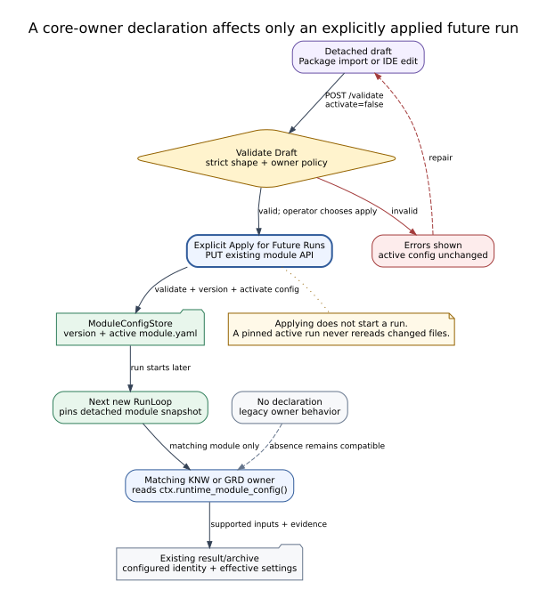

<!-- atr-doc
doc_type: reference
subtype: system
status: active
authority: descriptive
audience:
  - researcher
  - operator
  - developer
  - maintainer
scope:
  - modularity
  - packages
  - agent_modules
  - device_bridges
  - core_owner_plans
summary: Reader-facing map of the implemented module, package, bridge, configuration, and core-owner plan boundaries.
source_of_truth:
  - agents/core
  - agents/module_contract.py
  - agents/module_discovery.py
  - graphs/schema.py
  - graphs/module_store.py
  - packages
  - app/main.py
  - orchestrator/langgraph_runtime.py
  - web/static/runtime_ide.js
  - web/static/experimental_packages.js
last_verified: 2026-09-14
verified_against: working-tree
related_docs:
  - packages/README.md
  - docs/agents/README.md
  - docs/device_bridges/README.md
  - docs/runtime/runtime_ide.md
  - docs/oldversion/superpowers/specs/2026-09-13-package-agent-bridge-modularization-design.md
  - docs/oldversion/superpowers/plans/2026-09-14-core-plans-and-modularity-guide.md
supersedes: []
-->

# Modularity Reference

## Status at a Glance

| At a glance | Current implementation |
|---|---|
| Core | Orchestrator, Knowledge, and Guardian remain bootstrap-registered platform owners, not removable specialist packages |
| Specialist owners | Design, Specimen, Vision, Manipulation, Equipment, Analysis, and BO expose installed Agent Package metadata |
| Device integration | Device Bridges own provider connections, commands, status, and effect boundaries; packages only reference them |
| Package exchange | Experimental Package export/import carries a graph, package references, bindings, and detached module configurations |
| Core owner plans | Optional Knowledge/Guardian `module.owner_plan` declarations can be validated and explicitly applied for future runs |
| Runtime | The existing graph and LangGraph run loop select work; each new run pins its module configuration snapshot |
| Verification scope | Controlled model/equipment substitutes and browser/API checks cover the current contracts; no new hardware result is claimed |

## Summary

AX4LAB modularity separates four questions: who owns a capability, how it is
described, how an experiment composes it, and what actually executes it. This
keeps an agent's reasoning and UI close to its owner while leaving shared graph,
storage, policy, and device-control services in their established locations.

Modularity is a contract boundary, not a promise that every folder can be
hot-swapped. A Package describes composition. The active graph and registered
runtime still decide what runs, and a Device Bridge remains the only module that
can cross its declared provider or equipment effect boundary.

## Scope and Source of Truth

This Reference describes the working-tree implementation verified on
2026-09-14. Executable code, checked-in graph/module configuration, registered
handlers and tools, and persisted run evidence remain authoritative. The
[archived architecture Design](oldversion/superpowers/specs/2026-09-13-package-agent-bridge-modularization-design.md)
records the preceding development decisions; it does not override the current
implementation described here.

## Terms and Relationships

| Term | Owns or describes | Relationship to execution |
|---|---|---|
| Core agent | Platform coordination, knowledge, or mandatory safety policy | Bootstrap-registered; not installed or removed as a specialist package |
| Agent module | One owner's backend, execution catalog, presentation, configuration, tests, and evidence contract | Registered handlers execute only when the active graph invokes them |
| Device Bridge | A provider/device protocol, tools, status, configuration, and effect boundary | Executes only through registered tool/bridge paths and existing gates |
| Agent Package | Installed metadata for an agent module, version, owned files, and bridge dependencies | Reference/composition only; it is not an executor or installer |
| Experimental Package | A portable experiment draft containing graph, Agent Package references, bindings, and `module_configurations` | Import is detached; later graph/module application remains explicit |
| Orchestration Plan | The existing orchestration graph | Selects participants, conditions, and handoffs through the existing runtime |
| Owner Plan | Optional strict declaration inside a Knowledge or Guardian module configuration | An owner interprets supported settings from the run-pinned module snapshot |

## Ownership and Composition


**Figure Modularity-1.** Agent and Experimental Packages describe references;
the existing graph, registered owners, tools, gates, and Device Bridges own the
runtime path. The figure's scope is current contract composition, and its
evidence boundary is repository inspection—not a live device or provider run.
[Editable DOT source](assets/modularity/contracts.dot).

Core and specialist owners share common base, registry, graph, API, and storage
contracts. They differ in lifecycle: specialist modules can appear in installed
Agent Package metadata, while Orchestrator, Knowledge, and Guardian remain
platform-owned. Applying a Knowledge or Guardian declaration changes supported
future-run inputs; it does not make that core owner removable or package-activated.

High, Middle, Low, Guardian/Safety, and Knowledge/Evidence are responsibility
areas inside owner documentation. They are not a mandatory five-step pipeline.
The explicit edges in the active Orchestration Plan remain the execution order.

## Code, Frontend, Configuration, and Storage

The repository keeps ownership visible without forcing every existing service
into a new physical directory:

```text
agents/core/{orchestrator,knowledge,guardian}/  # core backend + owned frontend
agents/<specialist>/                            # specialist backend/module/frontend
device_bridges/<bridge>/                        # bridge, providers, tools, UI refs
packages/agents/<agent>/package.yaml            # installed composition metadata
graphs/modules/<owner>/{module.yaml,ui.yaml}    # active config + presentation
web/{templates,static}/                         # shared Runtime IDE / Live hosts
memory/module_versions/<owner>/                 # immutable module versions
runs/<run_id>/                                  # pinned runtime evidence/artifacts
```

Shared knowledge, learning, policy, API, and storage services stay in their
existing top-level packages and are referenced by their owners. A package does
not copy those services or take ownership of run artifacts. Experimental Package
import remains browser-memory draft state until an existing save/apply route is
used; credentials, local connection values, executable/file payloads, and live
runtime snapshots are outside the portable contract.

## IDE, Package, and Owner-Plan Lifecycle



**Figure Modularity-2.** Import or editing creates a detached draft; validation
does not write, explicit apply uses the current module store, and only a new run
pins and consumes the result. The figure covers configuration lifecycle by
inspection and controlled tests; it does not show a run or device starting.
[Editable DOT source](assets/modularity/lifecycle.dot).

The Package Manager shows the current Orchestration graph as a reference, plus
Default/Configured controls for Knowledge and Guardian. `Validate Draft` calls
the existing module validator without persistence. `Apply for Future Runs`
uses the current module save/version path; applying does not start a run, active
run mutation is rejected, and an imported package never applies itself.

Knowledge supports its declared scope, corpora, source scope, applicability,
decision timeout, and step budget. Guardian supports only reference-only
advisory evidence context. Its operator-stop inputs, deterministic checks,
thresholds, gate precedence, and device interlocks remain outside configurable
owner-plan authority. With no declaration, both owners retain their legacy
behavior and do not emit synthetic plan evidence.

## Extension Example

Suppose a future `spectroscopy` specialist owner needs a vendor instrument. Its
agent module would register the existing-style handler and own its decision,
presentation, tests, and evidence contract. A separate spectroscopy Device
Bridge would own the vendor protocol and gated tool calls. The Agent Package
would reference that bridge dependency, while an Experimental Package could
reference the agent and a detached module configuration. The operator would
still attach and validate the agent in the existing graph, configure the bridge
locally, dry-run, and explicitly save the version before a later run could use
it. The package reference itself would never call the instrument.

## Compatibility and Current Limits

- Existing archives and packages without `owner_plan` remain readable and use
  the legacy owner path.
- The first declaration contract is v1-only and limited to Knowledge and
  Guardian settings validated by those owners.
- Remote installers, a public marketplace, hot code replacement, and concurrent
  execution of conflicting module versions are not implemented.
- Module management selection, package membership, graph attachment, module
  application, and run execution are distinct states.
- Static and controlled-runtime verification establishes interface behavior,
  not physical reliability, safety effectiveness, or scientific validity.

## Verification

On 2026-09-14, focused owner/module/package/API regressions passed 158 tests
with 10 existing deprecation/schema warnings; the Package Manager/editor suite
passed 48 Node tests. A guarded five-route suite passed 5 cases, and isolated
browser/API checks covered invalid input, validation without writes, explicit
Knowledge-only application, Default restore, export, and detached import at
1920 and 900 px. Those checks used controlled model and equipment I/O and made
no physical calls. Exact commands and boundaries remain in the
[implementation and verification record](oldversion/superpowers/plans/2026-09-14-core-plans-and-modularity-guide.md).

## Related Documents

- [Agent and Experimental Packages](../packages/README.md)
- [Agent Reference Index](agents/README.md)
- [Device Bridge Reference Index](device_bridges/README.md)
- [Runtime IDE Reference](runtime/runtime_ide.md)
- [Package, Agent, and Device Bridge Design](oldversion/superpowers/specs/2026-09-13-package-agent-bridge-modularization-design.md)
