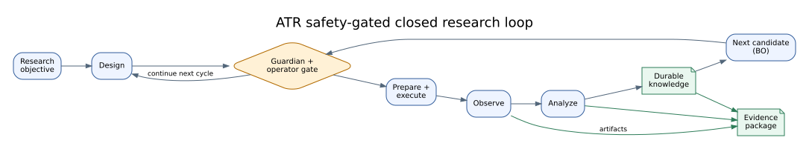

# Problem and Contributions

## Summary

ATR addresses a systems problem: a research loop spans reasoning, software,
physical actions, measurements, analysis, and iterative decision-making, yet
each boundary can lose intent, provenance, safety state, or recovery context.
The primary contribution is a typed, safety-gated, evidence-aware control loop.
The secondary contribution is a platform for extending that loop without
discarding its contracts.

## Scope

This chapter states what the repository is designed to contribute and how
those statements will be evaluated. It does not claim comparative scientific
performance or general safety effectiveness.

## Evidence Basis

The contribution boundaries are derived from the executable graph,
orchestrator/controller contracts, runtime References, and approved
paper-structure design. The initial claim statuses are provisional until the
full artifact manifest is validated.

## Problem

A laboratory workflow is not merely a sequence of API calls. It combines
heterogeneous stages with different failure modes and evidence needs:

- a design decision must remain connected to the objective and prior results;
- specimen preparation and manipulation create physical state that software
  alone cannot assume;
- equipment actions may be irreversible, hazardous, or externally timed;
- analysis can produce derived artifacts whose parameters and inputs must be
  recoverable;
- an optimization step must distinguish measured observations from model
  suggestions;
- a resumed run must preserve why the system arrived at its current state.

Treating these stages as independent tools makes demos easy to assemble but
makes a scientific run difficult to audit. Treating the entire loop as one
opaque agent hides policy boundaries and makes failure recovery ambiguous.
ATR therefore treats the loop as an explicit graph of typed stages, sidecars,
gates, evidence paths, and terminal states.

## System Thesis

The central thesis is that heterogeneous laboratory automation can be made
more inspectable and recoverable by combining:

1. a declared execution graph;
2. typed handoffs and stage-specific responsibilities;
3. Guardian and operator gates before consequential transitions;
4. checkpointed state and bounded failure routes;
5. durable evidence and knowledge feedback;
6. an optimization return path that begins another governed cycle.

Figure 1 summarizes this thesis.

**Figure 1 — Graphical abstract.** ATR connects objective, design, physical
execution, observation, analysis, durable knowledge, and next-candidate
selection through a closed loop. Amber diamonds mark safety or operator gates;
green artifacts mark evidence. The structure is code-backed, while end-to-end
scientific benefit remains `not_evaluated`.

## Research Questions

### RQ1: Closed-loop composition

How does ATR compose heterogeneous research stages into a complete, resumable
closed loop? The unit of analysis is the declared graph plus the runtime state
and handoff contracts, not the presence of individual agents.

### RQ2: Evidence continuity

How does ATR preserve auditable evidence across decisions, execution,
observation, analysis, and knowledge updates? The evaluation must connect a
claim to inputs, command or protocol, environment, commit, outputs, and result.

### RQ3: Safety and operator control

How do Guardian and operator gates constrain unsafe, uncertain, or
irreversible actions? Implemented gates and their measured effectiveness are
different claims and are evaluated separately.

### RQ4: Contract-preserving extension

How can new agents, devices, models, and workspaces be added without weakening
the system contracts? Extensibility is relevant only when new components enter
through declared schemas, policies, and evidence paths.

## Contributions

| Priority | Contribution | RQ | Initial claim | Current evidence state |
|---|---|---|---|---|
| Primary | A declared, resumable multi-agent graph spanning the research loop | RQ1 | `C-SYS-ARCH-01` | `supported` by bounded repository inspection |
| Primary | An evidence model separating inspection, tests, replay, simulation, browser, and live results | RQ2 | `C-TRACE-DOC-01` | `partially_supported`; documentation contracts are testable, full run lineage is not yet evaluated here |
| Primary | Guardian, dry-run, approval, stop, and error routes around consequential actions | RQ3 | `C-SAFE-LIVE-01` | `not_evaluated` for live effectiveness |
| Secondary | Module, backend, bridge, graph, and workspace extension surfaces | RQ4 | `C-PLAT-EXT-01` | `supported` as an inspected architecture claim |

## Relationship to Existing Systems

The repository structure was informed by public research-code patterns in
[NIMO](https://github.com/NIMS-DA/nimo),
[AlabOS](https://github.com/CederGroupHub/alabos),
[ResearchAgent](https://github.com/JinheonBaek/ResearchAgent), and
[AI Scientist-v2](https://github.com/SakanaAI/ai-scientist-v2). These projects
provide context for experiment loops, laboratory orchestration, research-agent
workflows, and paper-facing artifact presentation. This chapter does not claim
feature absence or superiority over those systems; a manuscript-level related
work section requires source-specific scientific comparison.

## Contribution Boundaries

- Graph structure does not prove correct scientific decisions.
- A recorded safety gate does not prove risk reduction across laboratories.
- An extension interface does not prove third-party component compatibility.
- A browser workspace does not prove physical-device execution.
- Documentation validation does not establish experimental validity.

These boundaries are deliberate: they make later evaluation results additive
rather than requiring the thesis to be rewritten around overbroad claims.

## Limitations and Known Gaps

The current paper package does not yet include a controlled baseline study,
multi-run physical experiment series, user study, incident analysis, or
statistical comparison. The contribution table reports only the evidence state
available at publication-package construction time.

## Verification

Verified on 2026-08-09 against graph and controller baseline `0b7627b` and the
current code snapshot. Claim statuses are machine-checked in
`artifact_manifest.yaml` once the evidence package is complete.

## Related Documents

- [Paper index](README.md)
- [System architecture](02_system_architecture.md)
- [Closed-loop method](03_closed_loop_method.md)
- [Platform architecture](04_platform_architecture.md)
