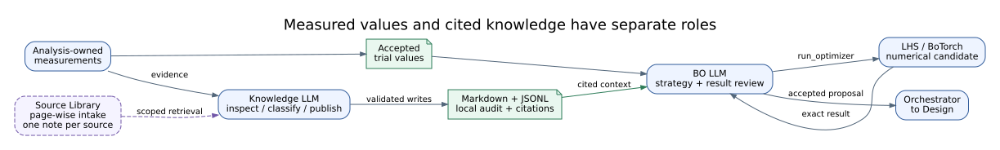

<!-- atr-doc
doc_type: reference
subtype: system
status: review
authority: descriptive
audience:
  - researcher
  - reviewer
  - developer
scope:
  - paper
  - closed_loop_method
  - evidence_flow
  - safety_gates
summary: Explains one ATR research cycle, its evidence flow, feedback path, and guarded failure transitions.
source_of_truth:
  - graphs/configs/atr_closed_loop.yaml
  - orchestrator/langgraph_runtime.py
  - app/controller.py
  - policies/guardian_gate.py
  - agents/knowledge_agent.py
  - knowledge/markdown_runtime.py
  - knowledge/source_api.py
  - agents/bo_agent.py
  - agents/bo_decision.py
  - utils/utm_clear_cycle.py
last_verified: 2026-09-12
verified_against: 5542ef2
paper_section: closed_loop_method
research_questions:
  - RQ1
  - RQ2
  - RQ3
claim_ids:
  - C-SYS-ARCH-01
  - C-TRACE-DOC-01
  - C-SAFE-LIVE-01
related_docs:
  - docs/paper/02_system_architecture.md
  - docs/paper/05_experimental_setup.md
  - docs/paper/07_reproducibility.md
  - docs/paper/08_safety_ethics_and_limitations.md
supersedes: []
-->

# Closed-Loop Method

## Status at a Glance

| At a glance | Details |
|---|---|
| Topic | Orchestration handoffs, verification and feedback |
| Evidence boundary | [Retained one-cycle demonstration](evidence/2026-09-07-latest-cycle-demonstration.md), with its mixed-mode limits |
| Recorded basis | 2026-09-12 · [Scope and verification](#verification) |

## Summary

One ATR cycle converts a research objective and prior evidence into a governed
candidate, performs or requests bounded actions, captures observations,
derives analysis, updates durable knowledge, and selects the next candidate.
Each transition carries state and evidence rather than relying on an agent's
conversation history as the run record.

## Scope

This chapter describes the implemented method at the control-flow level. It
does not prescribe a domain-specific scientific protocol and does not claim
that every stage must invoke physical equipment in every mode.

## Evidence Basis

The method is reconstructed from the graph configuration, runtime/controller,
Guardian policy, Knowledge and Bayesian-optimization agents at baseline
`5542ef2`. Behavioral claims remain bounded by the evidence manifest; updating
this description does not extend the scope of retained demonstrations.

## Cycle Semantics

The nominal path is:

1. **Initialize or resume.** Load objective, run/cycle identity, current stage,
   checkpointed state, and prior accepted evidence.
2. **Design.** Produce a typed design or protocol artifact linked to the
   objective and available context.
3. **Prepare and position.** Create or identify the specimen and verify the
   physical state needed for measurement.
4. **Execute and clear.** Resolve capabilities, validate dry-run and approval
   requirements, invoke a bridge, and capture proof. Where the selected route
   requires post-test clearance, return through Manipulation and Vision before
   Analysis; a completed measurement alone does not satisfy that handoff.
5. **Analyze.** Convert validated observations into derived artifacts while
   preserving parameters and input identity.
6. **Update knowledge.** Preserve numerical observations and cycle reports;
   use bounded LLM tools to classify Markdown knowledge and publish cited,
   scope-qualified context alongside typed memory and local audit records.
7. **Select next candidate.** Use constraints and prior trials to propose the
   next design point.
8. **Gate continuation.** Guardian and operator policy choose continue, stop,
   review, or error before another consequential cycle.

The actual graph can branch, invoke sidecars, retry bounded operations, or
terminate early. The list is an explanatory projection of the declared graph,
not a replacement for it. The current specimen-transfer route returns to
Vision for placement confirmation before Equipment, then uses a separate
Manipulation clearance task and Vision confirmation after Equipment. The
[Orchestration Route](../../README.md#orchestration-route) shows the broader
graph; these handoffs are not new top-level agents.

## Control and Evidence Flow

**Figure 3 — Closed-loop control and evidence flow.** Blue arrows represent
stage/control progression; green arrows represent durable artifact and
evidence flow. The dashed equipment-to-analysis edge applies only without a
required clearance contract. The feedback edge carries accepted knowledge and candidate
context into the next design stage. The paths are code-backed; continuity
through a complete physical campaign remains `not_evaluated`.

Each stage may produce three distinct outputs:

- a **control output** selecting or enabling the next transition;
- a **domain artifact** such as a design, image, measurement, analysis, or
  candidate;
- an **evidence record** connecting the artifact to context, provenance, and
  verification state.

Conflating these outputs is unsafe. A model suggestion can be a domain artifact
without being an approved control decision, and an API success response can be
execution evidence without being a valid scientific observation.

## Safety-Gated Sequence

**Figure 4 — Safety-gated sequence.** A consequential equipment request passes
schema/capability checks, Guardian policy, configured operator approval, and a
dry-run/proof boundary before live invocation. Denial, timeout, failed proof,
or stop decisions route to review or error. The sequence documents implemented
control points; safety effectiveness is `not_evaluated` for live campaigns.

| Gate | Input | Allow condition | Deny or uncertain route | Evidence |
|---|---|---|---|---|
| Schema/capability | Typed action and selected bridge | Contract valid and capability available | Reject before external action | Validation result |
| Guardian | Action, risk, context, prior evidence | Policy permits continuation | Stop, error, or operator review | Guardian decision |
| Operator approval | Human-readable consequential action | Explicit approval within scope/time | Wait, reject, or stop | Approval event |
| Dry run | Resolved command without physical mutation | Preconditions and parameters pass | Block live invocation | Dry-run artifact |
| Execution proof | Bridge response and observed outcome | Expected bounded proof captured | Review, retry policy, or error | Proof artifact and event |

No single gate is treated as universal risk control. Their composition and
domain-specific adequacy are evaluation questions.

## Knowledge and Optimization Feedback

**Figure 5 — Knowledge and Bayesian-optimization feedback.** Measured values
remain Analysis-owned; cited context comes from Knowledge. BO's LLM calls the
numerical optimizer and reviews its exact result before the existing
Orchestrator-to-Design handoff. Dashed source intake is separate from the cycle;
global Guardian gates are omitted from this data-flow view. The feedback path is
implemented; optimization benefit is `not_evaluated` in this package.

Knowledge retains ontology-validated local audit events, typed memory and
append-only Markdown notes. Its LLM selects evidence inspection, scoped search,
note writing and context publication; deterministic code checks each action.
Source Library is a separate intake path that preserves originals, processes
long documents page by page and publishes one cited note per source. It is not
a required stage on every experimental cycle.

Analysis-owned observations feed the numerical trial history; retrieved prose
does not become a new measurement. BO's LLM requests the configured optimizer
and reviews its result, while LHS or BoTorch owns the numerical coordinates.
Continuous-domain values are handed to Design without snapping to an old
candidate table. The output remains a proposal, not an automatic physical
command. See [Knowledge](../agents/knowledge_agent.md) and
[BO](../agents/bo_agent.md) for the implemented contracts.

## Failure and Recovery Semantics

| Failure class | Required state | Default system response | Resume concern |
|---|---|---|---|
| Invalid contract | No external effect assumed | Reject and record error | Correct input/schema before retry |
| Unavailable model/device | Capability unresolved | Degrade, wait, or error according to policy | Re-resolve capability and preserve request identity |
| Approval denied/expired | No approved action | Stop or remain pending | New approval must reference current action/context |
| External timeout | Effect may be unknown | Record uncertainty and require evidence/review | Do not blindly repeat physical action |
| Analysis failure | Inputs retained | Retry bounded analysis or route to error | Preserve parameters and prior partial outputs |
| Knowledge storage/retrieval degradation | Source artifacts and existing records retained | Report the storage error or evidence gap according to the active path | Do not invent citations, notes or successful write receipts |
| Guardian stop | Explicit stop decision | Enter terminal or review path | Resume requires a new governed decision |

The critical distinction is whether an external effect may already have
occurred. Software retry policies MUST NOT be copied directly onto uncertain
physical actions.

## Cycle Completion

A cycle is not complete merely because every function returned. Completion
requires an explicit terminal or continuation state plus the artifacts and
evidence needed to explain that state. A run may end successfully, stop by
policy, await review, or terminate with a diagnosable error; these outcomes
must remain distinct.

The [latest one-cycle demonstration](evidence/2026-09-07-latest-cycle-demonstration.md)
records this continuation boundary: measured compression data passed through
Analysis and BO-managed initialization into the next Design/Specimen stage.
Its mixed-mode scope and non-blocking findings are recorded separately from
full-manufacturing, campaign-level, and scientific-validation claims.

## Limitations and Known Gaps

This method description has not yet been validated as a complete live-hardware
campaign across all stages. It does not quantify throughput, recovery time,
operator burden, hazard coverage, or scientific improvement from the feedback
loop.

## Verification

Route, Knowledge and BO descriptions were checked through static repository
inspection on 2026-09-12 against `5542ef2`. The original 2026-08-09 inspection
and later demonstrations retain their own dates and configurations. Test,
replay, simulation, browser and live evidence are not inferred from the graph.
The separately recorded Orchestrator Setup verification covers bounded
next-new-run admission and provider-case aggregation, not a model-driven or
physical whole cycle; see the [runtime evidence note](../runtime/evidence/2026-09-12-orchestrator-dynamic-setup-verification.md).

## Related Documents

- [System architecture](02_system_architecture.md)
- [Experimental setup](05_experimental_setup.md)
- [Reproducibility](07_reproducibility.md)
- [Safety, ethics, and limitations](08_safety_ethics_and_limitations.md)
