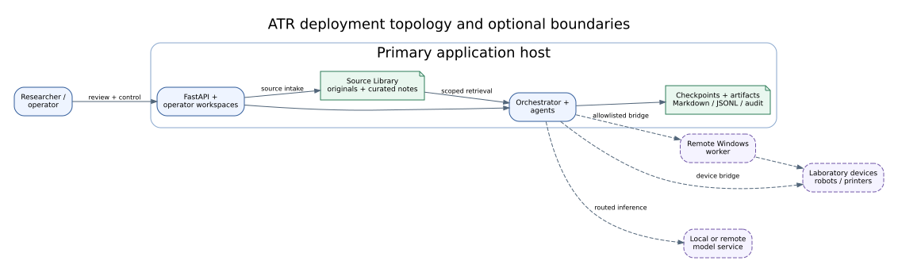

# Platform Architecture

## Summary

The ATR platform exposes extension surfaces for agent modules, execution
graphs, model backends, device bridges, durable knowledge, and operator
workspaces. This is the secondary contribution: it matters because it enables
new laboratory capabilities to enter the closed-loop system through declared
contracts instead of bypassing its gates and evidence paths.

## Scope

This chapter describes extension categories and their contract boundaries. It
does not promise that arbitrary third-party components are compatible or safe.

## Source of Truth

The platform surface is observed in module manifests and UI descriptors,
backend/model routing, device bridges, FastAPI routes, graph management, and
web workspaces at code baseline `0b7627b`.

## Platform Role in the System

The platform is not a separate product narrative attached to the paper. Its
role is to answer RQ4: how can a new capability participate in RQ1–RQ3 without
weakening stage, safety, and evidence contracts?

An extension is system-compatible only when it:

1. declares its identity and capability;
2. accepts and returns bounded schemas;
3. uses the orchestrator or service boundary assigned to it;
4. participates in required policy and approval gates;
5. emits evidence suitable for its environment;
6. fails in a way the runtime can diagnose and recover from.

## Extension Surfaces

| Surface | Extension unit | Required boundary | System value | Evidence status |
|---|---|---|---|---|
| Agent module | Module manifest, handler, schemas, optional UI metadata | Stage contract and runtime registration | Adds domain reasoning or transformation | Architecture inspected |
| Execution graph | Versioned graph configuration | Valid nodes, handlers, transitions, safety metadata | Adapts workflow without hiding control flow | Architecture inspected |
| Model backend | Routed provider/model adapter | Bounded completion contract, readiness, priority lease where applicable | Replaces inference implementation | Architecture inspected |
| Device bridge | Capability-oriented adapter | Allowlisted actions, dry run, proof, timeout, authentication | Connects physical or external tools | Architecture inspected; broad live reliability not evaluated |
| Knowledge backend | Service/repository/outbox contract | Ontology, provenance, receipt, bounded queries | Preserves durable context and lineage | Architecture and focused tests referenced elsewhere |
| Operator workspace | FastAPI route plus static/template surface | API authorization, explicit mutation, audit event | Exposes control and review | Route surface inspected; browser coverage varies |

## Module and Graph Contracts

Module manifests bind stable identifiers to handlers, schemas, and optional
presentation descriptors. UI metadata is treated as presentation configuration,
not arbitrary executable plugin code. Graph configurations select registered
handlers and declare transitions; activation and mutation remain runtime
operations with run-state constraints.

This separation permits two kinds of change:

- a module can evolve its internal implementation while preserving its
  declared boundary;
- a graph can compose existing modules differently while keeping the workflow
  visible and versioned.

Neither change is automatically safe: validators and dry runs detect contract
defects, while domain and physical risks remain subject to policy and evidence.

## Backend and Model Contracts

Backend abstraction prevents a paper claim from depending on one model server
or vendor. Routing identifies a task, selected model/provider, readiness state,
and bounded request/response path. The shared LLM lease prioritizes Guardian
and active workflow access over lower-priority background work such as
knowledge relation reconciliation.

Model substitution changes the evaluated system configuration. A result
obtained with one provider or model MUST name it and MUST NOT be generalized to
all supported adapters.

## Device Bridge Contracts

Device bridges translate typed actions into provider-specific operations. The
repository contains bridge surfaces for laboratory equipment, printers,
robotics, Windows GUI automation, cameras, and analysis services. The relevant
paper claim is not the number of integrations; it is that external actions are
placed behind capability resolution, policy, dry-run, proof, and error
contracts.

A bridge implementation MUST NOT be described as live-validated unless a
corresponding `E-LIVE` record identifies equipment, configuration, protocol,
operator boundary, and result.

## Operator Workspaces

The FastAPI application exposes paper-relevant workspaces for live runtime,
planning, graph/module management, knowledge review, equipment, printing,
robotics, optimization, and analysis. At baseline `0b7627b`, inspection finds
346 FastAPI `APIRoute` entries and 353 total application routes. These counts
show surface breadth and documentation drift; they are not usability or
reliability metrics.

Mutation-capable workspaces must make review and apply distinct where the
underlying service requires it. For example, knowledge relation proposals and
graph edits retain server-side validation and audited ingestion rather than
writing directly to the graph backend.

## Deployment Topology

**Figure 6 — Deployment topology.** The primary application, orchestrator,
agents, evidence stores, and local workspaces may coordinate remote Windows
workers, device bridges, model services, and optional graph backends. Dashed
links are deployment options, not proof that every combination has been
validated.

Deployment boundaries matter to claims. A local test backend, remote API,
Windows worker, simulator, and physical instrument are different evidence
environments even when they implement the same logical interface.

## Compatibility Boundaries

- Extension identifiers and schemas are versioned contracts.
- An optional backend must expose degraded or unavailable state explicitly.
- External credentials belong in runtime configuration, never documentation.
- Remote workers require allowlists and authentication appropriate to their
  effect surface.
- A workspace cannot authorize a service operation that the underlying policy
  rejects.
- A new adapter creates a new evaluation configuration; interface compatibility
  does not imply equivalent scientific behavior.

## Limitations and Known Gaps

No compatibility matrix currently covers every combination of graph, module,
model, device, operating system, and workspace. Route counts overrepresent
breadth if read as user-visible features. Optional external services may be
unavailable in a clean local environment.

## Verification

Verified by repository and route inspection on 2026-08-09 against code
baseline `0b7627b`. Detailed interfaces and deployment prerequisites are
separated into the appendices; behavioral coverage is reported in the
evaluation chapter.

## Related Documents

- [System architecture](02_system_architecture.md)
- [Interface appendix](appendix_a_interfaces.md)
- [Deployment appendix](appendix_b_hardware_and_deployment.md)
- [Current code snapshot](../runtime/current_code_snapshot.md)
