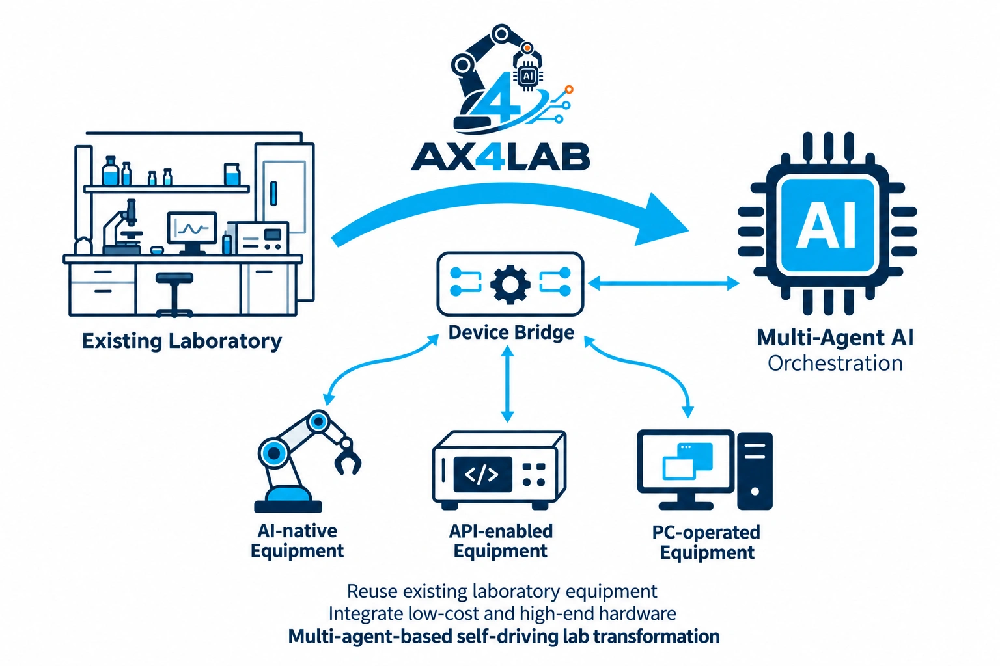

<!-- atr-doc
doc_type: index
subtype: index
status: active
authority: navigation
audience:
  - researcher
  - reviewer
  - artifact_evaluator
  - developer
scope:
  - paper
  - research_artifact
summary: Canonical reading path for the system-first ATR paper and its evidence package.
related_docs:
  - docs/standards/paper_documentation_standard.md
  - docs/paper/01_problem_and_contributions.md
  - docs/paper/02_system_architecture.md
  - docs/paper/03_closed_loop_method.md
  - docs/paper/04_platform_architecture.md
supersedes: []
-->

# Autonomous Researcher Framework Paper Package

## Summary

**Working title:** *Autonomous Researcher Framework: Transforming Existing Laboratories
with Structured AI Layers and VLA-Enabled Manipulation*

ATR adds structured AI layers to existing laboratory equipment. A VLA-enabled
robot arm connects physical stages without making bespoke fixtures or dedicated
transfer automation the organizing principle. Specialist agents coordinate
research decisions and execution; the platform supports equipment reuse and
robot integration through LeRobot.

[Results](06_evaluation_and_results.md) · [Reproduce](07_reproducibility.md) ·
[Agent references](../agents/README.md) · [Device interfaces](../device_bridges/README.md)



## Abstract

Existing laboratories contain equipment with heterogeneous automation
interfaces. ATR investigates how those capabilities can be composed into a
self-driving research loop without requiring a purpose-built laboratory.
Specialist agents connect research intent, design, fabrication, perception,
robotic transfer, testing, analysis, knowledge, and optimization. Scoped LLM
decision layers interpret evidence and call tools, while established numerical
methods and device bridges execute bounded tasks. Explicit handoffs preserve
measurement identity and feed observations into subsequent design decisions.
A retained supervised mixed-mode run demonstrates equipment testing through
analysis, next-point selection, and next-design entry; its printing deposition
was skipped. The extensible platform supports this system through modular
interfaces and operator workspaces. The system places integration complexity in structured software rather than
extensive hardware modification. Equipment reuse and VLA-enabled manipulation
provide a route to lower equipment and fixture costs; comparative savings and
scientific gains are not yet measured.

## Scope

Included:

- the implemented closed-loop graph and stage contracts;
- Guardian, approval, checkpoint, evidence, and recovery boundaries;
- the knowledge and Bayesian-optimization feedback path;
- platform extension surfaces relevant to the system thesis;
- evaluation design, reproduction tiers, limitations, and claim traceability.

Excluded until qualifying evidence exists:

- comparative scientific performance;
- unattended operation claims;
- generalized safety effectiveness;
- production reliability across arbitrary laboratories;
- attribution of authors, affiliations, venue, or DOI.

## Research Questions

| ID | Question | Primary chapters |
|---|---|---|
| RQ1 | How does ATR compose heterogeneous research stages into a complete, resumable closed loop? | [System architecture](02_system_architecture.md), [closed-loop method](03_closed_loop_method.md) |
| RQ2 | How does ATR preserve auditable evidence across decisions, execution, observation, analysis, and knowledge updates? | [Closed-loop method](03_closed_loop_method.md), [traceability](09_claim_evidence_traceability.md) |
| RQ3 | How do Guardian and operator gates constrain unsafe, uncertain, or irreversible actions? | [System architecture](02_system_architecture.md), [safety and limitations](08_safety_ethics_and_limitations.md) |
| RQ4 | How can new agents, devices, models, and workspaces be added without weakening system contracts? | [Platform architecture](04_platform_architecture.md), [interfaces appendix](appendix_a_interfaces.md) |

## Reading Path

1. [Problem and contributions](01_problem_and_contributions.md)
2. [System architecture](02_system_architecture.md)
3. [Closed-loop method](03_closed_loop_method.md)
4. [Platform architecture](04_platform_architecture.md)
5. [Experimental setup](05_experimental_setup.md)
6. [Evaluation and results](06_evaluation_and_results.md)
7. [Reproducibility](07_reproducibility.md)
8. [Safety, ethics, and limitations](08_safety_ethics_and_limitations.md)
9. [Claim-evidence traceability](09_claim_evidence_traceability.md)
10. [Interface appendix](appendix_a_interfaces.md) and
    [deployment appendix](appendix_b_hardware_and_deployment.md)

## Claim Status Legend

| Status | Meaning |
|---|---|
| `supported` | The bounded claim follows from referenced evidence. |
| `partially_supported` | Some scope, environment, or outcome remains unverified. |
| `not_evaluated` | No qualifying evidence has been recorded. |
| `contradicted` | Recorded evidence conflicts with the proposition. |

The machine-readable state is in
[`artifact_manifest.yaml`](artifact_manifest.yaml). A passing inspection or
test establishes only its declared environment; it does not become scientific
or live-hardware evidence.

## Figure Index

| Figure | Purpose | Evidence state |
|---|---|---|
| [Figure 1](assets/figures/01_graphical_abstract.svg) | System thesis and closed-loop research flow | Code-backed structure; scientific outcome not evaluated |
| [Figure 2](assets/figures/02_layered_architecture.svg) | Layered system and secondary platform surfaces | Code/configuration inspection |
| [Figure 3](assets/figures/03_closed_loop_evidence_flow.svg) | Control, artifact, and evidence flow | Code/configuration inspection |
| [Figure 4](assets/figures/04_safety_gated_sequence.svg) | Guardian/operator gate sequence | Implemented paths; effectiveness not evaluated |
| [Figure 5](assets/figures/05_knowledge_bo_feedback.svg) | Knowledge and Bayesian-optimization feedback | Implemented paths; scientific benefit not evaluated |
| [Figure 6](assets/figures/06_deployment_topology.svg) | Local, remote-worker, and optional backend topology | Supported configuration surfaces, not deployment certification |

## Table Index

| Table system | Canonical location |
|---|---|
| Contribution and research-question matrix | [Problem and contributions](01_problem_and_contributions.md) |
| Agent and stage contracts | [System architecture](02_system_architecture.md) |
| Safety gates and failure routes | [Closed-loop method](03_closed_loop_method.md) |
| Extension surfaces | [Platform architecture](04_platform_architecture.md) |
| Evaluation and principal-result status | [Evaluation and results](06_evaluation_and_results.md) |
| Reproduction tiers | [Reproducibility](07_reproducibility.md) |
| Limitations and risk controls | [Safety, ethics, and limitations](08_safety_ethics_and_limitations.md) |

## Evidence Basis

The initial architecture narrative was checked on 2026-08-09 against code
baseline `0b7627b`. The paper-documentation implementation commits change
documentation and validators, not the measured runtime code. Exact commands,
outputs, and hashes are recorded in the evidence package.

## Limitations and Known Gaps

The repository contains historical and domain-specific documents outside this
paper path. They remain useful but are not automatically paper evidence. The
paper package does not yet contain comparative benchmarks, a physical
end-to-end experiment series, an approved author list, a venue-formatted
manuscript, or an archival DOI.

## Verification

Run from repository root:

```bash
.venv/bin/python scripts/validate_documentation.py
.venv/bin/python scripts/validate_paper_publication.py
```

The second command becomes fully green only when the complete public file set
and artifact manifest are present.

## Related Documents

- [Paper Documentation Standard](../standards/paper_documentation_standard.md)
- [Current Code Snapshot](../runtime/current_code_snapshot.md)
- [Paper-first documentation design](../superpowers/specs/2026-08-09-github-paper-first-documentation-design.md)
