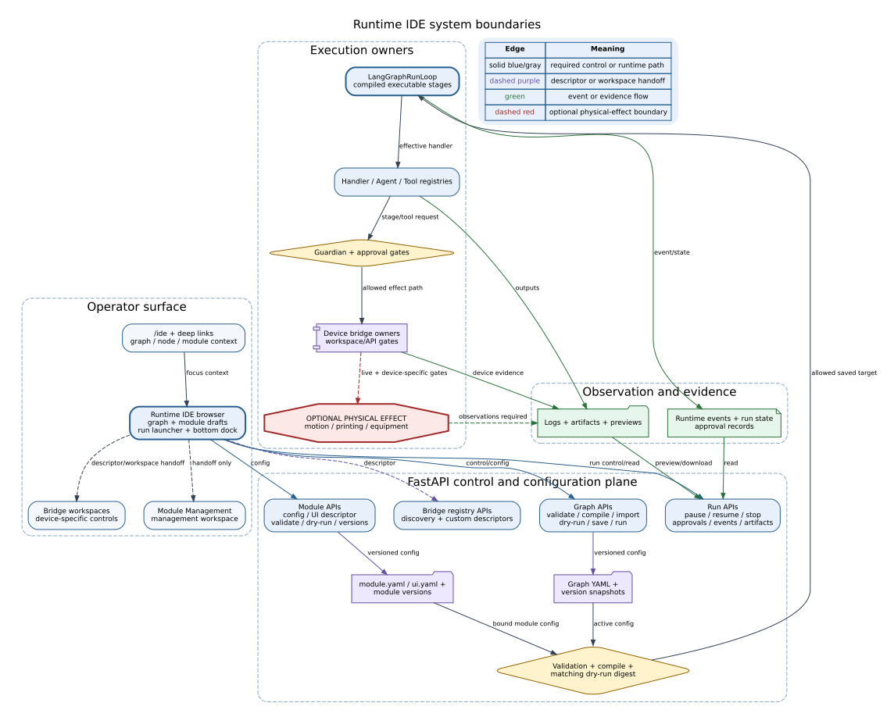
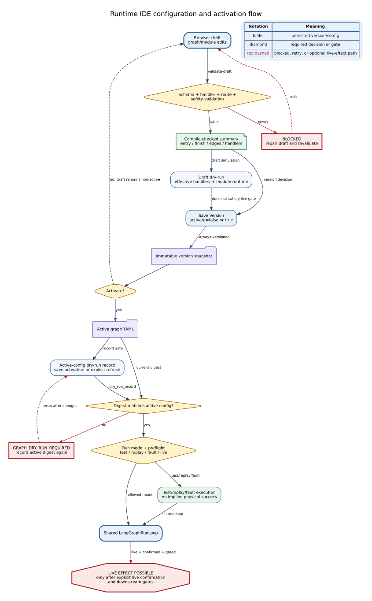
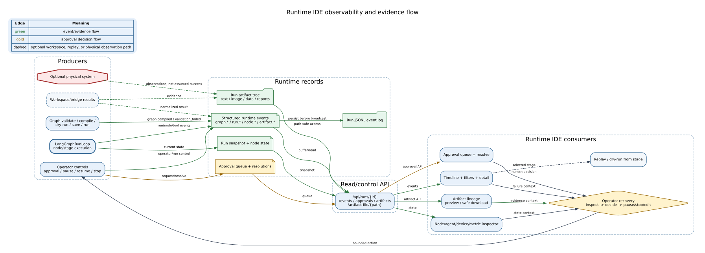

# Runtime IDE Reference

## Summary

ATR Runtime IDE is the operator-facing configuration, execution, and
observation surface at `/ide`. It presents the graph and module contracts used
by the backend, lets an operator build a draft, validate and compile it, inspect
dry-run evidence, create an immutable version, activate a validated graph or
module, start an allowed run mode, resolve approvals, and inspect events and
artifacts.

The IDE is not an independent workflow engine. `app/main.py` owns its APIs,
`graphs/*` owns validation and persistence, and
`orchestrator/langgraph_runtime.py` owns executable stage progression. Device
workspaces and bridge implementations own device-specific effects. The IDE
projects and controls those components through bounded interfaces; it does not
replace their authority.

## Scope

This Reference covers:

- the current server-rendered `/ide` page and JavaScript client;
- graph and module draft editing;
- validate, compile, dry-run, save, version, and activation semantics;
- saved test, replay, fault-injection, and live run launch;
- approvals and pause/resume/stop controls;
- runtime status, event timeline, replay, and artifact lineage;
- API, file, event, and physical-effect boundaries;
- operator recovery after validation, gate, approval, or runtime failures.

It does not replace:

- [LangGraph Runtime](langgraph_runtime.md) for compiler, routing, and module
  runtime details;
- [GUI Guide](../gui/gui.md) for the wider application page inventory;
- [Device Bridge References](../device_bridges/README.md) for device-specific
  protocols, confirmations, timeouts, and recovery;
- dated Evidence for live hardware reliability, safety effectiveness, or
  scientific results.

## Source of Truth

| Concern | Current implementation source |
|---|---|
| Page route and REST APIs | `app/main.py` |
| Visible operator surface | `web/templates/runtime_ide.html` |
| Client state, editing, API calls, and rendering | `web/static/runtime_ide.js` |
| Layout, status, and effect styling | `web/static/runtime_ide.css` |
| Shared graph layout geometry | `web/static/runtime_graph_geometry.js` |
| Graph/module schemas | `graphs/schema.py` |
| Validation and executable compilation | `graphs/validator.py`, `graphs/compiler.py`, `graphs/registry.py` |
| Active graph and module configuration | `graphs/configs/*.yaml`, `graphs/modules/*/module.yaml`, optional `ui.yaml` |
| Versioned configuration | `graphs/version_store.py`, `graphs/module_store.py` |
| Runtime execution | `orchestrator/langgraph_runtime.py` |
| Profile-bound Equipment Skill Flow | `utils/equipment_skill_flow.py`, `graphs/modules/equipment/equipment_skill_flows.json` |
| Interaction and runtime regression evidence | `tests/ui/runtime_ide_browser_audit.py`, `tests/unit/test_langgraph_runtime.py` |

Historical Codex packages under `docs/ATR_*_Package/` describe implementation
inputs and visual intent. They are not the current runtime or interface source
of truth.

## System Position and Authority Boundary

The browser reads and submits structured graph/module payloads. FastAPI
validates them against the same schemas, handler registry, and compiler used by
the execution path. Version stores write immutable snapshots and may atomically
replace active YAML only after validation. The run API then compiles the active
graph again and invokes the shared `LangGraphRunLoop`.



**Figure Runtime IDE-1.** Runtime IDE projects configuration, runtime, bridge,
approval, and evidence state while execution stays with the owning backend and
device components. Dashed edges are descriptor/workspace handoffs or optional
physical-effect paths. The figure is based on repository inspection; it is not
live-device, safety-effectiveness, or scientific evidence.

Important boundaries:

- a graph editor change is a browser draft until a validated save activates it;
- a module edit changes configuration, not Python source;
- Module Management `Load`/`Unload` changes management-workspace selection,
  not graph attachment or runtime activation;
- a bridge custom action is descriptor metadata and does not call its endpoint;
- a timeline event proves that an event was emitted, not that a physical action
  achieved the intended outcome;
- live execution remains subject to graph, operator, Guardian, tool, bridge,
  and device-specific gates.

## Operator Surface Map

| Surface | Operator purpose | Primary API/state | Persisted change | Highest possible effect |
|---|---|---|---|---|
| Header and top bar | Identify run, stage, agent, elapsed time, health; pause/resume/stop | `/api/state`, `/api/runs/{run_id}`, run-control endpoints | Runtime events/state; no config write | Active run control |
| Main System tab and graph canvas | Inspect and edit node positions, logical transitions, routes, and module attachment in a draft | `/api/graphs`, `/api/graphs/{graph_id}` | None until Save Version | Draft configuration only |
| Validate / Compile | Check schema, registry, handler signature, route, dispatch, and safety consistency | `POST /api/graphs/{graph_id}/validate-draft` (current Validate and Compile buttons), dedicated `/validate` and `/compile` APIs also exist | `graph.compiled` or `graph.validation_failed` event | No stage/device execution |
| Dry Run | Simulate transition sequence and expose effective graph/module handlers | `POST /api/graphs/{graph_id}/dry-run` | Draft evidence only for supplied drafts; in-memory gate record for active config | Non-device simulation |
| Save Version / Versions | Create immutable graph version and activate current IDE graph | `PUT /api/graphs/{graph_id}` with `activate=true`; version list/read APIs | `memory/graph_versions/<graph_id>/*.yaml`; active `graphs/configs/*.yaml` | Changes next run target; no run by itself |
| Activation checklist and run launcher | Show validation/compile/dry-run/save readiness and select mode/backend/fault inputs | dry-run gate, graph run, runtime model/backend APIs | Run record and runtime events | Test or explicitly gated live run |
| Module editor | Edit module step order, handlers, prompts, tools, LLM hints, retry/timeout, and safety config | `/api/modules/{module_id}/*` | `memory/module_versions/`; active `module.yaml` when activated | Alters module behavior on an attached future run |
| Infra and bridge descriptor editor | Inspect normalized bridge contracts and add a custom action descriptor | `GET /api/bridges`, `POST /api/bridges/{bridge_id}/actions` | Versioned graph metadata | Descriptor/workspace handoff only |
| Bottom dock inspector | Inspect node, agent, device, metrics, readiness, approvals, timeline, artifacts, replay, and logs | run/state/event/artifact/approval APIs and SSE | Approval/event records; no config unless a separate edit is applied | Observation plus bounded run/approval control |
| Import / Export YAML | Exchange a graph draft | export/import APIs | Import stays a checked draft until Save Version | No activation on import |

The visible graph selector and `Load Graph` button are intentionally hidden.
The fixed `Main System` tab is the normal entry. Workspace graph configs remain
discoverable through the API and run contracts, while the browser keeps the
operator focused on one main graph editing context.

## Entry Paths and Context Handoffs

The direct route is `/ide`. The client accepts these query aliases:

| Context | Accepted query keys | Behavior |
|---|---|---|
| Graph | `graph`, `graph_id` | Selects a discovered graph when available |
| Node/stage | `node`, `node_id`, `stage` | Resolves the matching graph node and focuses it |
| Module | `module`, `module_id` | Highlights or opens the matching module editing context |
| Action | `action` | Supports handoff intent such as `attach` |
| Source | `source` | Preserves caller context for audit and operator explanation |

Current handoffs include:

- Live GUI: `/ide?graph=<graph_id>&node=<node_id>&source=live_graph`;
- Module Management for an attached module: graph and node context;
- Module Management for an unattached module:
  `/ide?module=<module_id>&action=attach`.

An attach handoff highlights the module and tells the operator where to work.
It does not add a node, connect an edge, save YAML, or activate execution
automatically.

## Graph Draft Editing

The graph canvas and JSON editor are two views of a browser-side graph payload.
The canvas supports:

- node selection and inspector focus;
- position drag/snap, zoom, fit, minimap, and persisted `GraphNode.position`;
- click or drag port connection;
- default and conditional logical transitions;
- selected-edge removal;
- node removal through the trash zone;
- graph YAML export and checked draft import;
- compiled route and handler evidence display.

Logical transition editing updates `graph.transitions` and logical transition
edges together. These audit/UI edges are distinct from compiler-owned
dispatch/step-completion edges. Overlay nodes and `control_overlay`,
`device_bridge`, `evidence_flow`, or `runtime_sidecar` edges describe the
runtime plane but are excluded from executable LangGraph stage compilation.

The draft is dirty after a material edit. Dirty status invalidates previously
displayed activation evidence in the browser. The backend still revalidates
every submitted payload; client state is never the execution authority.

## Module and Bridge Descriptor Editing

### Equipment Agent Flow projection

The Equipment module tab is a read-only projection of the Profile-bound flow in
`graphs/modules/equipment/equipment_skill_flows.json`. It selects a Profile,
refreshes the derived supervisor/Skill/Vision graph and latest phase state, and
opens `/equipment/agent-manager` for any edit. Runtime IDE does not maintain or
save a second Equipment flow draft.

The code-owned `run_utm_compression_cycle` is a workflow-level supervisor above,
not a replacement for, that editable Profile flow:

```text
workflow-level Agentic Task
  -> Profile-bound Equipment Skill Flow
    -> block Agentic Task + exact Skill + optional Vision
      -> Equipment Skill Runtime / PyAutoGUI bridge
```

Its identity-bound `ready_for_equipment` entry handoff is mandatory and locked;
Runtime IDE and Agent Manager expose no enable switch for it. Per-block Equipment
Vision remains independently optional. Disabling one of those Vision slots only
bypasses the concurrent Equipment observation for that block and does not bypass
the upstream entry confirmation. The overlay does not alter Manipulation Agent
source or policy.

Agent Manager can load the canonical eight-block compression-cycle template as
an unsaved draft. It never binds a Skill, enables Vision, saves, or executes the
equipment automatically. Runtime values for Force, Stroke, Height, contact,
relative travel, automatic return, and robot clearance come from the selected
method/cell and observed evidence; the template contains no numeric defaults.
Unsupported task IDs and noncanonical block revisions are rejected. Before the
first device action, the Equipment Agent preflights every exact deployed Skill,
target Profile, enabled catalog-backed Vision task, and the Vision runtime tool
when any Vision slot is active. Final readiness requires same-artifact Raw CSV
proof whose artifact directly carries the expected run/specimen identity, plus
observed Height matching the configured clearance target.

The dedicated Agent Manager is the sole authoring surface. Its `+ Block` action
creates one composite block containing an initially unbound Low-Level Skill slot, a
Middle-Level Agentic Task with bounded completion routes, and an optional embedded
Vision slot. `agentic.task` is the canonical task name shown by every runtime
projection; the legacy `label` field is only a migration-compatible alias.
The Task does not introduce another LLM workflow. At execution time it references
the selected Skill's existing annotation context and the existing bounded recovery
decision path; deterministic Skill playback remains LLM-free.
There is no standalone `+ Vision` action. Equipment Workspace and Live GUI also
consume the same `/api/equipment/profiles/{profile_id}/skill-flow` payload as
read-only execution projections.

The Equipment Flow Supervisor is the High-Level projection. Skill and Vision
phase transitions are recorded under
`memory/equipment_runtime/equipment_skill_flow_latest/<profile_id>.json` and
reflected on the graph. Only `LabEquipmentAgent` executes the flow; opening or
saving Agent Manager never actuates equipment. Live reads this checkpoint with
the current `run_id`; mismatched Profile-latest records are omitted and a run
transition clears the browser's Equipment snapshot and invalidates older
in-flight refresh generations before rendering.

An enabled Vision node is bound to one catalog-backed `vision.task_id`, not a
free-form condition. Runtime IDE resolves its label from the shared
`vision_tasks` payload and projects the latest `vision_task_id`, `check_id`, and
bounded outcome from the execution transition. It never infers a task from a
display label, dispatches a Vision check, or edits the selection. Task changes
are made only in Agent Manager and appear here on the next normal refresh.

The existing `/live` Equipment dashboard is the read-only operational projection
for this workflow task. When overlay evidence exists it adds the locked entry
gate, eight block states, exact Skill version and optional Vision state, observed
versus target Force/Stroke/Height, bounded screen transitions, Raw Data CSV
validation, and next-specimen clearance/handoff readiness. It does not add direct
`Start Test` or arbitrary equipment-click actions; existing bridge health actions
remain diagnostic only.

The module editor reads and writes `graphs/modules/<module_id>/module.yaml`
through `ModuleConfigStore`. Supported configuration includes:

- allowlisted module and internal-step handlers;
- internal graph step ordering, addition, and deletion;
- prompt paths and bounded overrides;
- tool allowlists;
- LLM backend, model, and fallback hints;
- timeout and retry policy;
- safety and human-approval flags.

`PUT /api/modules/{module_id}` validates, versions, and optionally activates
module YAML. Activation updates configuration only. The module affects a run
when an executable graph node references it, graph validation succeeds, and the
graph itself passes the save/dry-run/run gates. The IDE does not edit arbitrary
Python source or bypass generated-handler registration.

Optional `ui.yaml` is a presentation descriptor. It may change labels, cards,
charts, report sections, and allowlisted navigation/read-only API actions; it
cannot register tools, handlers, graph routes, or physical execution rights.

The Infra panel reads normalized bridge manifests. Saving a custom action calls
`POST /api/bridges/{bridge_id}/actions`, writes descriptor metadata into the
active graph, and records a graph version. The endpoint returns
`execution_scope=descriptor_only`. A custom, POST, confirmation-required, or
non-read-only action remains a bridge-workspace handoff; it is not executed by
the descriptor editor.

## Validation, Compilation, and Dry-Run Gates

Graph validation is more than YAML parsing. It checks registered and callable
handlers, module references, unique nodes/stages, stage dispatch, configured
transitions, default logical routes, cycle guards, finish edges, and required
Guardian paths. Successful compilation returns a summary of entry/finish nodes,
executable and logical edges, stage dispatch, configured transitions, and
per-node handler metadata.

The current IDE `Validate` and `Compile` buttons both submit the draft to
`/validate-draft`; they emphasize different evidence in the client. Dedicated
`/validate` and `/compile` endpoints remain available to other API consumers.
No validation or compilation endpoint activates the draft.

Draft dry-run sends the current graph payload and returns transition sequence,
effective handlers, sanitized module runtime, and a digest-labeled record with
`draft=true` and `live_gate_recorded=false`. It cannot satisfy the live gate.
Active-config dry-run omits the draft payload and records the digest used by the
live-run preflight.



**Figure Runtime IDE-2.** A browser draft becomes an execution target only
through validation, compile evidence, immutable versioning, activation, and a
matching active-config dry-run record. Red/dashed loops show repair or live
effect boundaries. The figure is an inspection-backed control-flow projection,
not proof that any live run or safety gate is effective.

## Versioning, Save, and Activation

`GraphVersionStore` writes immutable snapshots under
`memory/graph_versions/<graph_id>/` and atomically replaces the selected active
graph YAML when `activate=true`. The current IDE `Save Version` control sends
`PUT /api/graphs/{graph_id}` with `activate=true`.

The backend:

1. rejects active-graph modification while a run is active;
2. parses the submitted graph and checks path/body identity;
3. validates and compiles it;
4. creates a version snapshot;
5. atomically writes the active YAML;
6. creates a dry-run record for that exact activated digest;
7. returns version, activation, compiled graph, dry-run, and gate evidence.

The separate compatibility endpoint `/save-version` defaults to a version-only
write unless `activate=true` is explicit. Import similarly remains a parsed,
validated, compile-checked draft until an explicit save.

Module versions use `memory/module_versions/<module_id>/`; active module config
is `graphs/modules/<module_id>/module.yaml`. A module save does not attach the
module to the main graph.

## Operator Workflow

Use this order for a normal graph change:

1. **Open with context.** Enter `/ide` directly or follow a graph/node/module
   deep link. Confirm the selected graph and focused node/module.
2. **Inspect current authority.** Check active run status, graph identity,
   readiness, version history, module binding, bridge contracts, and outstanding
   approvals before editing.
3. **Edit a draft.** Move/connect nodes, update logical transitions, or edit a
   module contract. Treat the dirty graph/module as non-active.
4. **Validate.** Resolve schema, handler, module, dispatch, transition, finish,
   cycle, and Guardian errors.
5. **Compile and inspect.** Compare the compiled entry, finish, executable
   edges, stage dispatch, configured transitions, and effective handlers with
   the intended canvas.
6. **Dry-run the draft.** Check the sequence, next-stage decisions, module
   runtime, tools, and handlers. This is evidence for the draft only.
7. **Save Version.** The main IDE control validates again, creates a version,
   activates the graph, and records the exact active digest. Recheck the
   activation checklist and version result.
8. **Choose run mode.** Prefer test for configuration exercise. Replay or
   fault-injection require appropriate inputs. Live requires explicit operator
   confirmation plus graph and downstream device gates.
9. **Launch the saved active target.** Do not treat unsaved editor state as the
   run payload. Inspect the run id, active stage, approval queue, device state,
   and health.
10. **Observe and recover.** Use timeline, event detail, node inspector,
    artifact lineage, preview/download, and replay. Pause/stop for bounded
    recovery; edit a new draft and repeat the gates for configuration defects.

For a module-only change, validate and dry-run the module, save its version,
then repeat graph validation/dry-run if the attached module changes the active
graph's effective behavior.

## Run Modes and Execution Effects

| Mode | Primary use | Graph gate | Operator/device gate | Effect boundary |
|---|---|---|---|---|
| `test` | Deterministic integration and configured simulator paths | Active graph must validate and compile | No live confirmation; individual test substitutes still define their own limits | No implied physical effect or success |
| `replay` | Re-evaluate saved/selected runtime context and stage route | Active graph validates/compiles; replay inputs must resolve | No automatic hardware authority | Event/config comparison only unless a separate implementation explicitly allows more |
| `fault-injection` | Exercise retry/error/Guardian paths | Active graph validates/compiles; fault name/stage accepted by runtime | No live confirmation | Injected runtime behavior, not physical validation |
| `live` | Execute the saved active orchestration target | Valid compile plus matching active-config dry-run digest; workspace graph requires `metadata.executable_from_runtime_ide=true` | IDE confirmation checkbox, Guardian/approval rules, tool and bridge allow flags, device preflight | Physical effects may occur only through the owning bridge/device path |

`POST /api/graphs/{graph_id}/run` always loads and compiles the active YAML; it
does not run the unsaved browser draft. For live mode, a missing or stale digest
returns HTTP 409 with `GRAPH_DRY_RUN_REQUIRED`. A non-primary workspace graph
without explicit live metadata is rejected even if it compiles.

The IDE's live confirmation is necessary at its boundary but not sufficient for
a device effect. Device-specific confirmation, calibration, freshness,
interlock, and stop semantics remain in bridge/workspace implementations.

## API and Connection Architecture

| API family | Important endpoints | Owner and connection | IDE use / authority |
|---|---|---|---|
| Page and shared state | `GET /ide`, `/api/state`, `/api/devices/state`, `/api/events/stream`, `/api/events/recent` | FastAPI controller and SSE event stream | Render current status; no configuration authority from display alone |
| Graph discovery/edit | `GET /api/graphs`, `GET /api/graphs/{id}`, `PUT /api/graphs/{id}` | Graph schema/compiler plus `GraphVersionStore` | Load draft; validated version and optional activation |
| Graph checking | `/validate`, `/validate-draft`, `/compile`, `/dry-run`, `/dry-run-gate`, `/import-yaml`, `/export-yaml` | Validator, compiler, handler registry, in-memory gate record | Produce schema/compile/sequence/digest evidence; import/draft checks do not activate |
| Graph versions/run | `/versions`, `/versions/{version_id}`, `/save-version`, `POST /api/graphs/{id}/run` | File-backed graph versions and `MainController`/`LangGraphRunLoop` | Inspect/recover versions and start a compiled saved target |
| Module config | `/api/modules`, `/api/modules/{id}`, `/validate`, `/dry-run`, `PUT /api/modules/{id}`, `/versions` | `ModuleConfigStore`, module schema/registry | Edit/version/activate module config; no automatic graph attachment |
| Module UI | `GET/PUT /api/modules/{id}/ui` | Module-local `ui.yaml` normalizer | Presentation descriptors only |
| Registries | `/api/handlers`, `/api/tools`, `/api/runtime/agent-manifests`, `/api/bridges` | Runtime registries and graph/module metadata | Discover allowed handlers/tools/agents/bridges |
| Bridge descriptor | `POST /api/bridges/{bridge_id}/actions` | Active graph metadata + graph version store | Save descriptor only; never invoke target hardware |
| Run control | `GET /api/runs/{run_id}`, `POST .../pause`, `.../resume`, `.../stop`, emergency endpoints | `MainController` addressed by current run id | Bounded control of current run; wrong/stale run ids are rejected |
| Approval | `GET/POST .../approvals`, `POST .../approvals/{approval_id}/resolve` | Runtime event/approval state | Request and resolve current pending approval; resolution is audited |
| Observation | `GET .../events`, `GET .../artifacts`, `GET .../artifact-file/{artifact_path}` | Runtime event buffer and path-safe run directory | Timeline, lineage, inline preview, or explicit download |
| Backend/model | `/api/runtime/backend`, `/api/runtime/models`, API-key endpoints | Runtime model/backend manager | Select or inspect model backend; separate from graph activation |

API keys and secret values must not be copied into graph/module documents,
figures, screenshots, logs, or artifact previews. The UI may manage secret
availability through dedicated endpoints, but configuration prose should refer
to environment/config keys rather than values.

## Runtime Events, Timeline, and Artifact Evidence

Graph configuration operations emit `graph.compiled` on successful compile
checks and `graph.validation_failed` on failure. Runs, nodes, tools, approvals,
operator actions, workspaces, and artifacts emit structured events through the
controller. Controller-origin events are persisted to the run JSONL log before
SSE broadcast; `/api/runs/{run_id}/events` currently reads the controller's
recent-event buffer for the selected run.

The IDE uses event and run payloads to render:

- timeline ordering and severity filters;
- selected event detail and graph-node focus;
- active agent, device, metric, and readiness panels;
- pending and resolved approval items;
- replay/dry-run comparison from a selected stage;
- artifact lineage, safe inline preview, and explicit download.

`/artifact-file/{artifact_path}` resolves beneath the selected run directory.
An escaping or unknown path is rejected by the server. Artifact existence is
evidence that a file was recorded, not proof that its content is correct or
that a physical task succeeded.



**Figure Runtime IDE-3.** Runtime and operator actions produce events, state,
approvals, logs, and artifacts that the IDE reads for observation and bounded
recovery. Dashed edges are optional workspace, replay, or physical-observation
paths. This is inspection evidence of data flow; event visibility does not
establish physical success, safety effectiveness, or scientific validity.

## Approvals, Safety, and Stop Controls

An approval request is an `approval.requested` runtime event with an approval
id, stage, requester, reason, safety class, and payload. The queue is derived for
the addressed run. Resolution requires a currently pending id and records the
operator, decision, note, time, runtime-gate state, and `approval.resolved`
event. Unknown or already resolved ids return an error.

Approval in the IDE does not bypass:

- graph validation and dry-run gates;
- module safety configuration;
- Guardian policies;
- tool allowlists;
- bridge live-mode and device-preflight checks;
- scene/evidence freshness requirements.

Pause and resume apply to the active addressed run. Stop requests bounded
termination through the controller. Emergency stop/resume/reset endpoints are
separate higher-consequence controls and retain controller/device semantics.
After any timeout, transport loss, or incomplete stop acknowledgement, treat
the effect as unknown until controller, worker/device, and physical scene state
are reconciled.

## Persistence and Configuration Ownership

| State/artifact | Owner and location | Lifetime | What the IDE may do |
|---|---|---|---|
| Active graph config | `graphs/configs/<graph_id>.yaml` | Repository/file lifetime | Replace atomically only through validated activation |
| Graph version | `memory/graph_versions/<graph_id>/<version_id>.yaml` | File lifetime | Create, list, inspect; version read does not activate |
| Active module config | `graphs/modules/<module_id>/module.yaml` | Repository/file lifetime | Replace atomically after module validation |
| Module UI descriptor | `graphs/modules/<module_id>/ui.yaml` | Repository/file lifetime | Edit normalized presentation metadata only |
| Module version | `memory/module_versions/<module_id>/<version_id>.yaml` | File lifetime | Create, list, inspect |
| Dry-run live gate | `_RUNTIME_GRAPH_DRY_RUN_RECORDS[graph_id]` in `app/main.py` | Process memory; lost on restart | Record/check exact active digest; never assume durability |
| Current run/controller state | `MainController` snapshot and runtime state | Process/run lifetime | Read and issue bounded run controls |
| Recent events and approval queue | Controller recent-event buffer | Process/buffer lifetime | Read/filter/resolve current pending items |
| Durable event log | Run-directory JSONL | Run artifact lifetime | Produced by controller; current `/events` API does not promise full historical replay from file |
| Run artifacts | `runs/<run_id>/...` | File lifetime | List, preview path-safely, download |
| Bridge action descriptor | Active graph `metadata.device_bridges[].actions[]` plus graph version | Graph config/version lifetime | Author descriptor; actual endpoint remains bridge/workspace-owned |

Version and artifact directories may be excluded from source control while still
being durable on the host. Their existence and retention depend on deployment
storage policy.

## Errors and Recovery

| Condition | Observable result | Effect assumption | Recovery |
|---|---|---|---|
| Invalid graph schema/route/module/handler | `ok=false`, validation errors, `graph.validation_failed` | Draft not active; no run from failed request | Focus reported node/route/module, repair draft, validate again |
| Handler signature or registration drift | Validation/compile rejection and handler metadata error | Handler did not enter an allowed compiled target | Select registered runtime-state-compatible handler or approve generated adapter through its explicit path |
| Dirty editor after prior checks | Activation checklist invalidates displayed evidence | Previous browser evidence does not cover new draft | Validate, compile, and dry-run the new draft |
| Missing/stale active digest | HTTP 409 `GRAPH_DRY_RUN_REQUIRED` | Live graph run did not start through this API | Run active-config dry-run or save/activate the intended graph, recheck digest, retry |
| Workspace graph live disabled | HTTP 400 metadata error | Live run did not start | Use test/replay/fault mode or review and explicitly change `executable_from_runtime_ide` with full validation |
| Save while run active | HTTP 409 | Active config unchanged by rejected save | Stop/finish the addressed run, reconcile state, retry validation/save |
| Module not attached/ready | Lifecycle/readiness shows missing requirements | Module edit is not active graph execution | Complete handler/output/tool requirements, attach through a graph draft, repeat graph gates |
| Custom bridge action is non-read-only or confirmation-required | Descriptor reports workspace handoff/blocked reason | IDE descriptor editor did not actuate device | Open owning bridge workspace and follow its confirmation/preflight procedure |
| Approval missing or rejected | Run waits, fails, or follows configured rejection path | Do not assume requested effect occurred | Inspect request context/evidence; resolve only with authorized decision or stop run |
| Wrong or stale run id | 404/409 from run-control API | No valid control acknowledgement | Refresh `/api/state`, select current run id, inspect worker/device state before retry |
| Event stream disconnect | Stale UI state or reconnect warning | Runtime may still be active | Read current state/run APIs, reconnect stream, avoid duplicate effects |
| Artifact path invalid/missing | 404 or safe-path rejection | No artifact evidence available at requested path | Refresh artifact list; verify producer/run id; do not weaken path checks |
| Stop/transport timeout | Incomplete acknowledgement | Effect unknown | Reconcile controller, process/device status, and physical scene; use emergency procedure if required |

Do not repair a configuration failure by editing active YAML concurrently with
an active run or by bypassing the validator. Do not repair an unknown physical
effect by assuming a missing event means “nothing happened.”

## Verification

This Reference was checked on 2026-08-09 against commit `541c93a` by repository
inspection of the declared source files. The following evidence types are
appropriate:

- documentation validator: required sections, figures, captions, navigation,
  and selected high-consequence API/UI source tokens;
- `tests/unit/test_documentation_validation.py`: documentation contract;
- `tests/unit/test_langgraph_runtime.py`: graph validation/compile/dry-run,
  activation, approval, bridge descriptor, and artifact contracts;
- `tests/ui/runtime_ide_browser_audit.py`: selected DOM layout and interaction
  flows when a server and WebDriver are available;
- byte comparison of fresh Graphviz renders with checked-in SVG files.

Recommended repository checks:

```bash
.venv/bin/python scripts/validate_documentation.py
.venv/bin/pytest -q tests/unit/test_documentation_validation.py
.venv/bin/pytest -q tests/unit/test_langgraph_runtime.py \
  -k 'validate or compile or dry_run or activated_graph or approval or artifact'
.venv/bin/python -m py_compile tests/ui/runtime_ide_browser_audit.py
```

Browser audit success is interaction evidence for its tested environment and
viewport. It does not prove live device readiness or scientific outcomes.

## Limitations and Known Gaps

- The current interface is server-rendered HTML/JavaScript, not the historical
  React implementation described in package instructions.
- The IDE `Compile` button currently uses `validate-draft` and presents the
  returned compile evidence; API consumers may call the dedicated compile
  endpoint directly.
- The live dry-run gate is process memory. A server restart requires a new
  active-config dry-run or validated activation before live launch.
- The run events endpoint reads the current recent-event buffer; durable JSONL
  logs exist, but this endpoint is not a full historical log reader.
- Module Management and Runtime IDE expose adjacent module workflows with
  different authority. Operators must not interpret management selection as
  graph attachment.
- Workspace graph live eligibility is metadata-controlled and does not prove
  attached device readiness.
- Browser audits cover selected scenarios and reference viewports, not every
  browser, zoom level, or accessibility path.
- Code inspection establishes interface and control flow, not live reliability,
  safety effectiveness, or scientific validity.

## Related Documents

- [LangGraph Runtime](langgraph_runtime.md) — executable graph, compiler,
  routing, and module-runtime authority
- [Runtime Architecture](architecture.md) — wider server/runtime architecture
- [Closed Loop and Pages Reference](closed_loop_and_pages_reference.md) — page
  and end-to-end loop mapping
- [GUI Guide](../gui/gui.md) — application-wide GUI behavior
- [Device Bridge Reference Index](../device_bridges/README.md) —
  device-specific effects and recovery
- [Agent Reference Index](../agents/README.md) — stage roles and handoffs
- [Documentation Standard](../standards/documentation_standard.md)
- [Runtime IDE Documentation Design](../superpowers/specs/2026-08-09-runtime-ide-reference-documentation-design.md)
