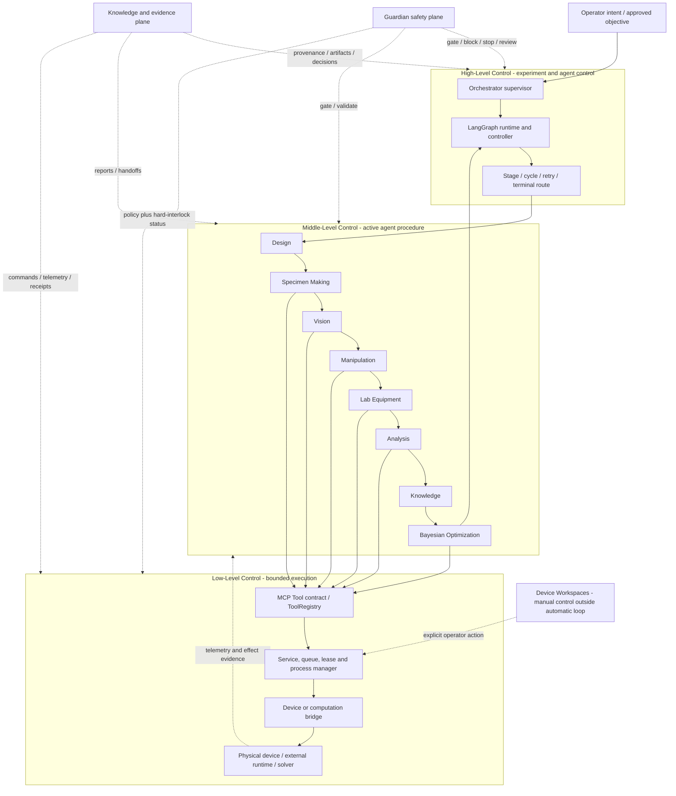

# Three-Level Control Model

## Summary

ATR describes control during an **automatic experiment loop** through three
levels. This vocabulary names boundaries already present in the runtime; it
does not create a second scheduler or a new device path.

1. **High-Level Control** governs the experiment mission, active agent, stage
   transition, cycle, retry, review, and terminal route.
2. **Middle-Level Control** governs the bounded procedure inside the active
   agent and produces typed handoffs, reports, decisions, and evidence.
3. **Low-Level Control** executes a registered tool through its service or
   device bridge and owns protocol details, process/device state, telemetry,
   and hard execution interlocks.

Guardian safety and Knowledge/evidence are cross-level planes. Device
Workspaces are manual maintenance and commissioning surfaces outside the
automatic-loop hierarchy, even when they reuse the same low-level bridges.

## 한국어 요약

자동 실험 루프에서 **High-Level Control**은 어떤 에이전트와 사이클을 진행할지,
**Middle-Level Control**은 선택된 에이전트가 내부 절차를 어떤 순서와 계약으로
수행할지, **Low-Level Control**은 등록된 tool과 bridge가 실제 소프트웨어·장비를
어떻게 구동할지를 담당합니다. Guardian은 세 계층 모두를 차단·검토할 수 있는
안전면이고, Knowledge/Evidence는 모든 계층의 근거를 보존하는 증거면입니다.
Device Workspace는 동일한 bridge를 사용할 수 있지만 자동 루프 밖의 수동
운영면이므로 세 계층의 자동 진행과 동일시하지 않습니다.

## Control Diagram

**Figure 1. Three-level control in the automatic experiment loop.** Solid
arrows show the nominal control direction. Dotted arrows show safety,
evidence, telemetry, or manual-operation relationships. Not every agent calls
a physical device: Design, Knowledge, BO, and parts of Analysis remain
computational, but they still respect the same registered-tool boundary when a
tool or external service is used.

## Level Contracts

| Level | Primary question | Authoritative components | Owns | Must not do |
|---|---|---|---|---|
| High-Level Control | What agent/stage/cycle runs next? | Orchestrator, LangGraph runtime, `MainController`, checkpoint/run state | mission, route, stage, cycle, retry/review/terminal decision | implement device protocol details or infer a physical effect from a chat response |
| Middle-Level Control | How does the active agent complete its bounded responsibility? | `agents/*_agent.py`, module manifest, typed handoff/report schemas | internal procedure, deterministic validation, bounded model reasoning, agent result and handoff | bypass graph routing, claim an unobserved device result, or bypass bridge interlocks |
| Low-Level Control | How is one approved bounded action executed and observed? | ToolRegistry/MCP tool, service, queue/lease/process manager, device/computation bridge | protocol command, port/process lease, device state, hard interlocks, telemetry, command/effect evidence | choose the research objective, silently change the active agent, or convert uncertain effect into success |
| Guardian safety plane | May work continue safely and with sufficient evidence? | Guardian agent, policy gates, approval service, bridge hard interlocks | allow/block/review/stop decisions and incidents | replace hardware interlocks or execute normal device work directly |
| Knowledge/evidence plane | What proves what was requested, executed, observed, and accepted? | event log, artifacts, typed reports, Knowledge service, ledger/outbox/graph receipts | provenance, immutable records, context for later cycles | rewrite prior evidence or treat a proposal as an executed result |

## State and Failure Propagation

| Direction | Required behavior |
|---|---|
| High → Middle | Dispatch one allowlisted agent handler with run/cycle identity, typed state, and bounded context. |
| Middle → Low | Issue only registered tool requests allowed by the module manifest; preserve action identity and expected evidence. |
| Low → Middle | Return explicit command, status, telemetry, artifact, receipt, or uncertainty. A timeout is not automatically success or failure. |
| Middle → High | Merge a typed agent result and handoff only after the agent's completion conditions are satisfied. |
| Any level → Guardian | Surface stale state, missing evidence, failed precondition, unknown external effect, policy breach, or exhausted retry budget. |
| Any level → Evidence | Persist enough identity and provenance to distinguish intent, decision, command, observed effect, and accepted scientific result. |

Recovery remains at the level that owns the failed invariant. A device
reconnection belongs to Low-Level Control; rebuilding an agent output belongs
to Middle-Level Control; choosing retry, review, another agent, another cycle,
or a terminal state belongs to High-Level Control.

## Agent Classification

| Agent | High-Level relationship | Middle-Level ownership | Low-Level boundary |
|---|---|---|---|
| Orchestrator | Primary mission, dispatch, handoff, cycle, and route owner | intent normalization, mission/context compilation, follow-up and decision register | no direct device tools; delegates through agent stages |
| Design | Receives a governed design stage and returns a Specimen handoff | objective normalization, constrained candidate generation, scoring, selection, experiment specification | deterministic local computation; no device authority |
| Specimen Making | Converts the selected design into a verified fabrication handoff | geometry, mesh/manufacturability QA, slicing plan, print lifecycle, ejection/bed-clear evidence | geometry/artifact tools and selected printer fleet/provider bridge |
| Vision | Supplies observation and verification sidecars used by stage routing | camera selection, freshness/quality checks, active-camera and UTM verification signals | camera, LeRobot camera, ROS/UTM runtime, and verified rollout-stop tools |
| Manipulation | Runs the governed physical-transfer branch and waits for post-place verification | policy/task selection, preflight, rollout supervision, motion-state and completion contract | LeRobot rollout/process, robot, serial/camera lease, and optional Isaac sidecars |
| Lab Equipment | Runs after verified placement and hands measurement evidence to Analysis | profile/skill/protocol selection, preflight, execution proof, export/handoff | Windows PyAutoGUI and UTM/equipment bridges |
| Analysis | Converts identified measurement evidence into an evaluation handoff | parsing, units, curves, metrics, uncertainty, CAE comparison, objective evaluation | bounded CAE/CalculiX or other computation bridge; no direct physical actuator |
| Knowledge | Persists accepted evidence and supplies bounded context to BO and later cycles | provenance/schema validation, typed records, patterns, relation review, context assembly | ledger, outbox, ontology, graph repository/Neo4j/Graphify adapters; no physical actuator |
| Bayesian Optimization | Proposes the next governed candidate after accepted Analysis/Knowledge evidence | prior filtering, LHS/GP/acquisition, constraints, recommendation and Design handoff | BoTorch/benchmark computation tools; proposal only |
| Guardian | Cross-level safety/control authority for continue, review, stop, or error | risk/evidence/health/approval evaluation and corrective-action records | read-only health/queue tools and stop/block authority; hard interlocks remain in bridges |

## Device Workspace Boundary

Device Workspaces support setup, calibration, troubleshooting, manual tests,
training, direct rollout, or explicit operator control. They may call the same
services and bridges as the automatic loop, but they do not become High-Level
Control and do not prove that an automatic agent handoff occurred.

When a workspace action must be visible to the runtime, it emits normalized
events and artifacts with an explicit manual/workspace origin. Automatic-loop
completion still requires the relevant agent and graph contracts.

## Naming Rule

Use these names in new explanatory documents, GUI labels, figures, and paper
text:

- `High-Level Control` — experiment/agent/cycle control;
- `Middle-Level Control` — internal agent procedure control;
- `Low-Level Control` — registered tool, service, bridge, and device execution;
- `Guardian Safety Plane` — cross-level safety and approval authority;
- `Knowledge/Evidence Plane` — cross-level provenance and durable evidence;
- `Device Workspace` — manual control outside the automatic loop.

The names do not require renaming Python classes, stage enums, event schemas,
API paths, or persisted artifacts. Runtime renaming should occur only if a
future typed contract needs to expose the level explicitly.

## Source of Truth

- `graphs/configs/atr_closed_loop.yaml`
- `orchestrator/langgraph_runtime.py`
- `app/controller.py`
- `orchestrator/state.py`
- `agents/*_agent.py`
- `graphs/modules/*/module.yaml`
- `mcp_tools/tool_registry.py`
- `device_bridges/*`

This explanation was reconciled with repository state at commit `25f692e`.
Executable code, active graph configuration, module manifests, tool registry,
and bridge implementations remain authoritative.
