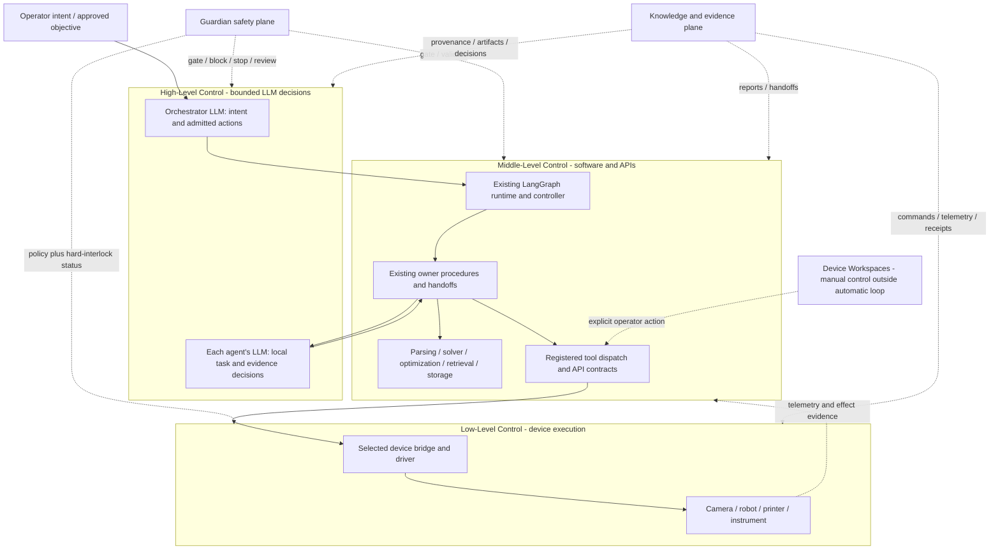

# Three-Level Control Model

## Summary

ATR describes control during an **automatic experiment loop** through three
levels. This vocabulary names boundaries already present in the runtime; it
does not create a second scheduler or a new device path.

1. **High-Level Control** is the bounded LLM reasoning and decision layer inside
   each agent. Orchestrator owns global intent and routing decisions; specialist
   agents retain their local decision scope.
2. **Middle-Level Control** implements software processes, APIs, tool dispatch,
   numerical computation, validation, storage and typed handoffs. Runtime routing
   and composite owner handlers stay unchanged.
3. **Low-Level Control** is actual device execution through the selected bridge
   and driver: device state, commands, telemetry and hard execution interlocks.
   A parser, solver, retrieval operation or API wrapper is not a physical device.

Guardian safety and Knowledge/evidence are cross-level planes. Device
Workspaces are manual maintenance and commissioning surfaces outside the
automatic-loop hierarchy, even when they reuse the same low-level bridges.

### LLM Node Labels

Runtime IDE and document figures use **LLM** for an actual High-level decision
and **LLM call** for a process that supplies its context and consumes the returned
decision. A call relationship does not mean the functions share a file or that
the LLM belongs to Middle. Mode policy still determines whether a particular run
uses a real model; the badge alone is not execution evidence. Existing High,
Middle, Low and cross-cutting background areas remain unchanged.

## 한국어 요약

각 에이전트 내부에서 **High-Level Control**은 LLM 추론·의사결정,
**Middle-Level Control**은 API·내부 프로세스·계산·툴 디스패치,
**Low-Level Control**은 실제 장비/브릿지 실행 경계입니다. Guardian은 세 계층 모두를 차단·검토할 수 있는
안전면이고, Knowledge/Evidence는 모든 계층의 근거를 보존하는 증거면입니다.
Device Workspace는 동일한 bridge를 사용할 수 있지만 자동 루프 밖의 수동
운영면이므로 세 계층의 자동 진행과 동일시하지 않습니다.

## Control Diagram

**Figure 1. Three-level control in the automatic experiment loop.** Solid
arrows show the nominal control direction. Dotted arrows show safety,
evidence, telemetry, or manual-operation relationships. Not every agent calls
a physical device: Design, Knowledge, BO, and parts of Analysis remain
computational, but they still respect the same registered-tool boundary when a
tool or external service is used.

## Level Contracts

| Level | Primary question | Authoritative components | Owns | Must not do |
|---|---|---|---|---|
| High-Level Control | What permitted choice is supported by current evidence? | Existing agent-local model decision functions | scoped reasoning, tool choice and evidence review | invent device effects or bypass code-owned constraints |
| Middle-Level Control | How is the accepted task processed and dispatched? | Existing runtime/controller, agent functions, ToolRegistry, software services | internal procedure, APIs, numerical work, deterministic validation, result and handoff | bypass graph routing, claim unobserved effects or bypass bridge interlocks |
| Low-Level Control | How does the selected device execute and report an action? | Device bridge and driver | protocol command, port/device state, hard interlocks, telemetry, effect evidence | choose the research objective, silently change the active agent or convert unknown effects into success |
| Guardian safety plane | May work continue safely and with sufficient evidence? | Guardian agent, policy gates, approval service, bridge hard interlocks | allow/block/review/stop decisions and incidents | replace hardware interlocks or execute normal device work directly |
| Knowledge/evidence plane | What proves what was requested, executed, observed, and accepted? | event log, artifacts, typed reports, Knowledge service, ledger/outbox/graph receipts | provenance, immutable records, context for later cycles | rewrite prior evidence or treat a proposal as an executed result |

## State and Failure Propagation

| Direction | Required behavior |
|---|---|
| High → Middle | Return a bounded decision/tool request; existing code validates identity, schema and authority before dispatch. |
| Middle → Low | Issue only registered tool requests allowed by the module manifest; preserve action identity and expected evidence. |
| Low → Middle | Return explicit command, status, telemetry, artifact, receipt, or uncertainty. A timeout is not automatically success or failure. |
| Middle → High | Supply scoped context and observations to the existing model decision boundary; handoff requires code-owned completion conditions. |
| Any level → Guardian | Surface stale state, missing evidence, failed precondition, unknown external effect, policy breach, or exhausted retry budget. |
| Any level → Evidence | Persist enough identity and provenance to distinguish intent, decision, command, observed effect, and accepted scientific result. |

Recovery remains at the level that owns the failed invariant. A device
reconnection belongs to Low-Level Control; rebuilding an agent output belongs
to Middle-Level Control; choosing retry, review, another agent, another cycle,
or a terminal state may involve the High LLM decision where implemented. Existing
deterministic routing and safety decisions remain code-owned; this classification
does not introduce model calls or move those decisions into a new model loop.

## Agent Classification

| Agent | High-Level relationship | Middle-Level ownership | Low-Level boundary |
|---|---|---|---|
| Orchestrator | LLM intent, availability and admitted action review | Existing runtime supervision, contract/plan builders and tool dispatch | No direct device execution |
| Design | LLM candidate suitability and bounded tool choice | Candidate generation, inspection, validation and handoff | No direct device execution |
| Specimen Making | LLM fabrication suitability and bounded tool choice | Geometry, manufacturing checks, existing printer API calls and handoff | Selected Printer Fleet provider and printer |
| Vision | LLM observation choice and same-frame evidence review | Task resolution, detectors, interlocks, capture/status/stop API dispatch | Selected camera and LeRobot device paths |
| Manipulation | LLM saved-skill suitability and post-Vision result review | Profile binding, API dispatch, preflight and completion supervision | LeRobot robot policy/replay execution and device lifecycle |
| Lab Equipment | LLM stacked-Flow selection and terminal evidence/recovery review | Existing exact Flow/Skill supervision, APIs, CSV checks and handoff | Selected desktop/instrument worker and device driver |
| Analysis | LLM data, simulation and model-review choices | Parsing, units, objectives, solver, postprocessing and asynchronous FEM scheduling | No direct device execution |
| Knowledge | LLM scoped retrieval and evidence curation | Provenance, ontology, Markdown/JSONL persistence and context assembly | No direct device execution |
| Bayesian Optimization | LLM strategy/tool choice and numerical result review | LHS/BoTorch, constraints, numeric recommendation and handoff | No direct device execution |
| Guardian | Existing LLM policy-evidence review | Deterministic safety/risk checks, health APIs and incident/route results | Hardware interlocks and effective stops remain in device bridges |

## Device Workspace Boundary

Device Workspaces support setup, calibration, troubleshooting, manual tests,
training, direct rollout, or explicit operator control. They may call the same
services and bridges as the automatic loop, but they do not become High-Level
Control and do not prove that an automatic agent handoff occurred.

When a workspace action must be visible to the runtime, it emits normalized
events and artifacts with an explicit manual/workspace origin. Automatic-loop
completion still requires the relevant agent and graph contracts.

## Naming Rule

Use these names in new explanatory documents, GUI labels, figures, and paper
text:

- `High-Level Control` — agent-local LLM reasoning and decisions;
- `Middle-Level Control` — internal processes, APIs and software tools;
- `Low-Level Control` — device bridge/driver execution;
- `Guardian Safety Plane` — cross-level safety and approval authority;
- `Knowledge/Evidence Plane` — cross-level provenance and durable evidence;
- `Device Workspace` — manual control outside the automatic loop.

The names do not require renaming Python classes, stage enums, event schemas,
API paths, or persisted artifacts. Runtime renaming should occur only if a
future typed contract needs to expose the level explicitly.

## Source of Truth

- `graphs/configs/atr_closed_loop.yaml`
- `orchestrator/langgraph_runtime.py`
- `app/controller.py`
- `orchestrator/state.py`
- `agents/*_agent.py`
- `graphs/modules/*/module.yaml`
- `mcp_tools/tool_registry.py`
- `device_bridges/*`

This classification was reconciled with the 2026-09-13 working tree. It changes
presentation and documentation only, not calls, workflow order, gates or handoffs.
Executable code, active graph configuration, module manifests, tool registry,
and bridge implementations remain authoritative.
