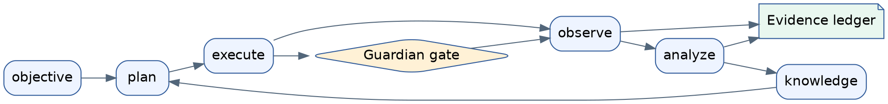

# Paper-First GitHub Documentation Implementation Plan

> **For agentic workers:** REQUIRED SUB-SKILL: Use superpowers:subagent-driven-development (recommended) or superpowers:executing-plans to implement this plan task-by-task. Steps use checkbox (`- [ ]`) syntax for tracking.

**Goal:** Publish a paper-shaped, evidence-aware GitHub documentation surface that presents Autonomous Researcher Framework primarily as a safety-gated closed-loop system and secondarily as an extensible platform.

**Architecture:** The root README is the paper landing page, while `docs/paper/` is the canonical long-form argument split into focused chapters. Editable Graphviz sources and rendered SVGs support the system narrative, and a machine-readable artifact manifest connects claims to reproducible evidence. A dedicated validator enforces the public file set, narrative order, claim-evidence integrity, and privacy constraints alongside the existing documentation-governance validator.

**Tech Stack:** Markdown with governed YAML front matter, YAML 1.2, Citation File Format 1.2, Python 3.12, PyYAML, pytest, Graphviz DOT/SVG, Git.

## Global Constraints

- The system contribution is primary; the platform contribution is secondary.
- The English `README.md` and English paper documents are canonical; `README.ko.md` is the Korean landing-page companion.
- Do not invent authors, affiliations, a DOI, benchmark values, live-hardware outcomes, or scientific conclusions.
- Claims without repository-backed evidence use `not_evaluated`; incomplete evidence uses `partially_supported`.
- Every `supported` or `partially_supported` claim references evidence records in `docs/paper/artifact_manifest.yaml`.
- Evidence records identify environment, verified commit, command, inputs, outputs, and result.
- Figure sources are Graphviz `.dot`; checked-in `.svg` files are deterministic renderings from `/usr/bin/dot`.
- Commands and links use repository-relative paths and must not disclose personal absolute paths, credentials, tokens, private endpoints, or unpublished datasets.
- The existing uncommitted `.env.example` change is user-owned and must remain untouched and unstaged.
- Adding an open-source license, publishing GitHub Pages, creating a GitHub Release, assigning a DOI, or uploading to Zenodo remains outside this implementation because each requires an explicit owner or external publication decision.
- The repository-facing `LICENSE` file states the current no-license condition without assigning ownership or granting permissions.

---

### Task 1: Publication Contract Validator

**Files:**
- Create: `scripts/validate_paper_publication.py`
- Create: `tests/unit/test_paper_publication_validation.py`

**Interfaces:**
- Consumes: repository root `Path`, `docs/paper/artifact_manifest.yaml`, governed Markdown documents.
- Produces: `load_yaml_mapping(path: Path) -> dict[str, Any]`.
- Produces: `validate_artifact_manifest(root: Path, path: Path) -> list[str]`.
- Produces: `validate_paper_structure(root: Path) -> list[str]`.
- Produces: `validate_publication(root: Path) -> list[str]` and a CLI returning zero only when no errors exist.
- Required claim statuses: `supported`, `partially_supported`, `not_evaluated`, `contradicted`.
- Required evidence environments: `inspection`, `test`, `replay`, `simulation`, `browser`, `live`.

- [ ] **Step 1: Write failing tests for structural, narrative, evidence, checksum, and privacy rules**

```python
def test_supported_claim_requires_existing_evidence(tmp_path: Path) -> None:
    manifest = write_manifest(
        tmp_path,
        claims=[{"id": "C-SYS-01", "status": "supported", "evidence_ids": ["E-404"]}],
        evidence=[],
    )
    errors = module.validate_artifact_manifest(tmp_path, manifest)
    assert any("unknown evidence id E-404" in error for error in errors)


def test_not_evaluated_claim_may_have_no_evidence(tmp_path: Path) -> None:
    manifest = write_manifest(
        tmp_path,
        claims=[{"id": "C-LIVE-01", "status": "not_evaluated", "evidence_ids": []}],
        evidence=[],
    )
    assert module.validate_artifact_manifest(tmp_path, manifest) == []


def test_evidence_output_checksum_must_match(tmp_path: Path) -> None:
    output = write(tmp_path, "docs/paper/evidence/report.md", "measured\n")
    manifest = write_manifest(tmp_path, claims=[], evidence=[evidence(output, sha256="0" * 64)])
    errors = module.validate_artifact_manifest(tmp_path, manifest)
    assert any("sha256 mismatch" in error for error in errors)


def test_readme_places_system_before_platform(tmp_path: Path) -> None:
    write_required_publication_tree(tmp_path)
    write(tmp_path, "README.md", "# Project\n## Platform\n## System\n")
    errors = module.validate_paper_structure(tmp_path)
    assert any("System must appear before Platform" in error for error in errors)


def test_public_paper_rejects_personal_absolute_paths(tmp_path: Path) -> None:
    write_required_publication_tree(tmp_path)
    write(tmp_path, "docs/paper/README.md", "Run `/home/alice/project/script.py`.\n")
    errors = module.validate_paper_structure(tmp_path)
    assert any("personal absolute path" in error for error in errors)
```

- [ ] **Step 2: Run the tests and verify the missing module fails**

Run: `.venv/bin/python -m pytest -q tests/unit/test_paper_publication_validation.py`

Expected: FAIL because `scripts/validate_paper_publication.py` does not exist.

- [ ] **Step 3: Implement the validator and CLI**

```python
CLAIM_STATUSES = {"supported", "partially_supported", "not_evaluated", "contradicted"}
EVIDENCE_ENVIRONMENTS = {"inspection", "test", "replay", "simulation", "browser", "live"}
REQUIRED_ROOT_FILES = (
    "README.md", "README.ko.md", "CITATION.cff", "LICENSE",
    "CONTRIBUTING.md", "SECURITY.md", "CHANGELOG.md", "REQUIREMENTS.md",
)
REQUIRED_PAPER_FILES = (
    "docs/paper/README.md",
    "docs/paper/01_problem_and_contributions.md",
    "docs/paper/02_system_architecture.md",
    "docs/paper/03_closed_loop_method.md",
    "docs/paper/04_platform_architecture.md",
    "docs/paper/05_experimental_setup.md",
    "docs/paper/06_evaluation_and_results.md",
    "docs/paper/07_reproducibility.md",
    "docs/paper/08_safety_ethics_and_limitations.md",
    "docs/paper/09_claim_evidence_traceability.md",
    "docs/paper/appendix_a_interfaces.md",
    "docs/paper/appendix_b_hardware_and_deployment.md",
    "docs/paper/artifact_manifest.yaml",
)


def sha256_file(path: Path) -> str:
    digest = hashlib.sha256()
    with path.open("rb") as handle:
        for chunk in iter(lambda: handle.read(65536), b""):
            digest.update(chunk)
    return digest.hexdigest()


def validate_publication(root: Path) -> list[str]:
    manifest = root / "docs/paper/artifact_manifest.yaml"
    errors = validate_paper_structure(root)
    if manifest.exists():
        errors.extend(validate_artifact_manifest(root, manifest))
    return errors
```

The implementation validates unique IDs, status values, evidence references, required evidence fields, repository-contained input/output paths, output hashes, required files, README heading order, missing Graphviz/SVG pairs, and personal POSIX or Windows user-profile paths in `README.md`, `README.ko.md`, and `docs/paper/**/*.md`.

- [ ] **Step 4: Run the focused tests and verify they pass**

Run: `.venv/bin/python -m pytest -q tests/unit/test_paper_publication_validation.py`

Expected: all tests PASS.

- [ ] **Step 5: Commit the validator**

```bash
git add scripts/validate_paper_publication.py tests/unit/test_paper_publication_validation.py
git commit -m "test: enforce paper publication contracts"
```

### Task 2: Paper Documentation Standard

**Files:**
- Create: `docs/standards/paper_documentation_standard.md`
- Modify: `docs/standards/documentation_standard.md`
- Modify: `docs/templates/document_types.md`
- Modify: `docs/document_manifest.yaml`

**Interfaces:**
- Consumes: the approved paper-first design and existing document taxonomy.
- Produces: normative rules for chapter front matter, claim IDs, evidence IDs, quantitative statements, terminology, figures, tables, links, commands, language synchronization, review gates, and publication safety.
- Produces: a reusable paper chapter front-matter template with `paper_section`, `research_questions`, `claim_ids`, `last_verified`, and `verified_against`.

- [ ] **Step 1: Write the normative paper standard**

The standard defines these exact claim prefixes: `C-SYS`, `C-SAFE`, `C-TRACE`, `C-PLAT`, `C-EVAL`, and `C-LIMIT`. It defines evidence prefixes `E-INSPECT`, `E-TEST`, `E-REPLAY`, `E-SIM`, `E-BROWSER`, and `E-LIVE`, requires SI units, requires denominator/sample size for rates, prohibits causal wording without causal evidence, and requires every figure caption to state the message, scope, and evidence state.

- [ ] **Step 2: Add the paper chapter template and governance cross-reference**

```yaml
---
doc_type: reference
subtype: system
status: review
authority: descriptive
audience:
  - researcher
  - reviewer
scope:
  - paper
paper_section: system_architecture
research_questions:
  - RQ1
claim_ids:
  - C-SYS-ARCH-01
summary: Describes the verified system architecture and its evidence boundary.
source_of_truth:
  - orchestrator/graph.py
last_verified: 2026-08-09
verified_against: 0b7627b
related_docs:
  - docs/paper/README.md
supersedes: []
---
```

If the implementation baseline moves before this task starts, replace `0b7627b` with the newly measured short commit in every new paper document.

- [ ] **Step 3: Register the standard and run documentation governance validation**

Run: `.venv/bin/python scripts/validate_documentation.py`

Expected: `Documentation validation passed`.

- [ ] **Step 4: Commit the standard**

```bash
git add docs/standards/paper_documentation_standard.md docs/standards/documentation_standard.md docs/templates/document_types.md docs/document_manifest.yaml
git commit -m "docs: define paper documentation standard"
```

### Task 3: System-First Paper Core and Figures

**Files:**
- Create: `docs/paper/README.md`
- Create: `docs/paper/01_problem_and_contributions.md`
- Create: `docs/paper/02_system_architecture.md`
- Create: `docs/paper/03_closed_loop_method.md`
- Create: `docs/paper/04_platform_architecture.md`
- Create: `docs/paper/assets/figures/01_graphical_abstract.dot`
- Create: `docs/paper/assets/figures/01_graphical_abstract.svg`
- Create: `docs/paper/assets/figures/02_layered_architecture.dot`
- Create: `docs/paper/assets/figures/02_layered_architecture.svg`
- Create: `docs/paper/assets/figures/03_closed_loop_evidence_flow.dot`
- Create: `docs/paper/assets/figures/03_closed_loop_evidence_flow.svg`
- Create: `docs/paper/assets/figures/04_safety_gated_sequence.dot`
- Create: `docs/paper/assets/figures/04_safety_gated_sequence.svg`
- Create: `docs/paper/assets/figures/05_knowledge_bo_feedback.dot`
- Create: `docs/paper/assets/figures/05_knowledge_bo_feedback.svg`
- Create: `docs/paper/assets/figures/06_deployment_topology.dot`
- Create: `docs/paper/assets/figures/06_deployment_topology.svg`
- Create: `docs/paper/assets/tables/README.md`
- Modify: `docs/document_manifest.yaml`

**Interfaces:**
- Consumes: current orchestrator graph, agent contracts, safety gates, knowledge reconciliation, backend abstractions, web routes, and the measured baseline commit.
- Produces: the canonical RQ1–RQ4 narrative, six editable figures, and contribution/stage/safety/extension tables.
- Narrative order: problem → thesis → research questions → system contributions → platform contribution → evidence limits.

- [ ] **Step 1: Measure the latest code-backed architecture snapshot**

Run the existing snapshot commands documented in `docs/runtime/current_code_snapshot.md`, record the short Git commit, and reconcile the observed FastAPI route count, total app route count, graph nodes, graph edges, and `stage_dispatch` edges with `docs/document_manifest.yaml`.

Expected baseline at planning time: FastAPI routes `346`, total routes `353`, graph nodes `19`, graph edges `68`, stage dispatch edges `12`. If execution observes different values, the observed values are authoritative and all new prose uses them consistently.

- [ ] **Step 2: Write the paper index and system-first core chapters**

The paper index contains the working title, one-paragraph abstract, RQ1–RQ4, chapter map, claim-status legend, figure index, table index, and explicit statement that physical end-to-end scientific performance is not yet evaluated. The system chapters distinguish code inspection, automated tests, simulation/replay, browser validation, and live-hardware evidence.

- [ ] **Step 3: Write focused Graphviz sources**



Each figure uses the same visual grammar: blue rounded boxes for system components, amber diamonds for safety/operator gates, green notes for durable evidence, solid arrows for control/data flow, and dashed arrows for optional or secondary platform paths.

- [ ] **Step 4: Render and syntax-check all figures**

Run: `for source in docs/paper/assets/figures/*.dot; do /usr/bin/dot -Tsvg "$source" -o "${source%.dot}.svg"; done`

Expected: six non-empty SVG files and no Graphviz parser errors.

- [ ] **Step 5: Register the chapters and table-source policy, then validate**

Run: `.venv/bin/python scripts/validate_documentation.py`

Expected: `Documentation validation passed`.

- [ ] **Step 6: Commit the paper core**

```bash
git add docs/paper docs/document_manifest.yaml
git commit -m "docs: add system-first paper core"
```

### Task 4: Evaluation, Reproducibility, Safety, and Traceability

**Files:**
- Create: `docs/paper/05_experimental_setup.md`
- Create: `docs/paper/06_evaluation_and_results.md`
- Create: `docs/paper/07_reproducibility.md`
- Create: `docs/paper/08_safety_ethics_and_limitations.md`
- Create: `docs/paper/09_claim_evidence_traceability.md`
- Create: `docs/paper/appendix_a_interfaces.md`
- Create: `docs/paper/appendix_b_hardware_and_deployment.md`
- Create: `docs/paper/evidence/architecture_inspection.md`
- Create: `docs/paper/evidence/documentation_validation.md`
- Create: `docs/paper/artifact_manifest.yaml`
- Modify: `docs/document_manifest.yaml`

**Interfaces:**
- Consumes: measured Task 3 snapshot, focused validator results, existing runtime documentation, requirements, and deployment configuration examples.
- Produces: evaluation matrix, principal-results table, reproduction tiers 0–4, risk/limitation register, interface appendix, deployment appendix, claim-evidence table, and machine-readable evidence records.
- Artifact manifest schema version: `1`; release status: `development`.

- [ ] **Step 1: Write evidence records from real inspection and test output**

`architecture_inspection.md` records the exact command, commit, environment, timestamp, measured counts, and interpretation boundary. `documentation_validation.md` records the exact pytest and validator commands, passed test counts, exit status, and explicitly states that documentation validation is not scientific or live-hardware validation.

- [ ] **Step 2: Write the evaluation and reproducibility chapters**

The evaluation matrix has rows for architecture completeness, stage-contract integrity, checkpoint/resume behavior, Guardian/operator gate behavior, evidence traceability, Bayesian optimization feedback, knowledge reconciliation, backend substitution, browser workflows, and live equipment. Rows without executed evidence show `not_evaluated`; no empty result cells are allowed.

Reproduction tiers are exact:

1. Tier 0 — static repository and document inspection.
2. Tier 1 — focused unit and contract tests.
3. Tier 2 — simulation or deterministic replay.
4. Tier 3 — browser-level platform validation.
5. Tier 4 — supervised live-hardware execution.

- [ ] **Step 3: Write safety, traceability, and appendices**

The safety chapter distinguishes implemented controls from validation status and lists human oversight, least privilege, secrets handling, data governance, physical hazards, model uncertainty, and dual-use concerns. The interface appendix maps agent/stage inputs, outputs, schemas, and failure behavior. The deployment appendix separates local, remote Windows worker, and optional service backends without promising unsupported deployment modes.

- [ ] **Step 4: Create the artifact manifest with evidence hashes**

```yaml
version: 1
release_status: development
verified_commit: 0b7627b
claims:
  - id: C-SYS-ARCH-01
    research_questions: [RQ1]
    status: supported
    evidence_ids: [E-INSPECT-ARCH-001]
  - id: C-TRACE-DOC-01
    research_questions: [RQ2]
    status: partially_supported
    evidence_ids: [E-TEST-DOC-001]
  - id: C-SAFE-LIVE-01
    research_questions: [RQ3]
    status: not_evaluated
    evidence_ids: []
  - id: C-PLAT-EXT-01
    research_questions: [RQ4]
    status: supported
    evidence_ids: [E-INSPECT-ARCH-001]
evidence:
  - id: E-INSPECT-ARCH-001
    environment: inspection
    verified_commit: 0b7627b
    command: .venv/bin/python scripts/validate_documentation.py
    inputs:
      - orchestrator/graph.py
      - app/main.py
    outputs:
      - path: docs/paper/evidence/architecture_inspection.md
        sha256: 64-character lowercase digest printed by sha256sum during Step 4
    result: pass
```

The real manifest must contain the literal digest printed by `sha256sum docs/paper/evidence/architecture_inspection.md`; the descriptive value in this plan is not copied into the manifest. The second evidence entry uses `E-TEST-DOC-001` and the literal digest from `sha256sum docs/paper/evidence/documentation_validation.md`.

- [ ] **Step 5: Run governance and publication validation**

Run: `.venv/bin/python scripts/validate_documentation.py`

Run: `.venv/bin/python scripts/validate_paper_publication.py`

Expected at this stage: documentation governance passes; publication validation reports only the root public files intentionally scheduled for Task 5.

- [ ] **Step 6: Commit the evidence-aware paper chapters**

```bash
git add docs/paper docs/document_manifest.yaml
git commit -m "docs: add paper evaluation and traceability"
```

### Task 5: GitHub Landing Page and Public Repository Surface

**Files:**
- Modify: `README.md`
- Modify: `README.ko.md`
- Modify: `docs/README.md`
- Create: `CITATION.cff`
- Create: `LICENSE`
- Create: `CONTRIBUTING.md`
- Create: `SECURITY.md`
- Create: `CHANGELOG.md`
- Modify: `docs/document_manifest.yaml`

**Interfaces:**
- Consumes: Task 3 narrative and figures, Task 4 claim statuses, existing setup commands, and current `REQUIREMENTS.md`.
- Produces: a reviewer-first English README, synchronized Korean companion, citation metadata without invented personal authorship, current no-license notice, contribution workflow, private vulnerability-reporting guidance, and an auditable changelog.
- Root README exact order: title/status → one-sentence thesis → graphical abstract → paper summary → problem → system contribution → architecture → closed loop → safety → evaluation status → platform contribution → reproducibility → paper documentation → citation → license/security.

- [ ] **Step 1: Rewrite `README.md` as the paper landing page**

Use code-backed current counts only in an explicitly dated architecture snapshot table. Show principal results as evidence status rather than performance marketing: inspected architecture and documentation checks may be supported, while scientific efficacy, live-hardware robustness, and comparative performance remain `not_evaluated`.

- [ ] **Step 2: Synchronize `README.ko.md` and update the documentation index**

The Korean README mirrors thesis, RQs, contribution priority, figures, evidence status, setup path, paper links, citation status, and license/security status. `docs/README.md` places the paper reader path before developer/operator paths while retaining links to governed runtime references.

- [ ] **Step 3: Add citation, contribution, security, changelog, and license-status files**

```yaml
cff-version: 1.2.0
message: If you use this software, cite it using the metadata in this file.
title: "Autonomous Researcher Framework: A Safety-Gated Closed-Loop Multi-Agent System and Extensible Platform for Laboratory Automation"
type: software
authors:
  - name: Autonomous Researcher Framework contributors
version: 0.1.0-dev
date-released: 2026-08-09
repository-code: https://github.com/JIN9811/autonomous_researcher
license: LicenseRef-Proprietary
```

Confirm the GitHub repository URL with `git remote get-url origin`. `LICENSE` states that no open-source license has been granted and that permissions require maintainer approval. `SECURITY.md` instructs reporters to use GitHub private vulnerability reporting when available and not to open public issues containing exploit details or secrets.

- [ ] **Step 4: Register governed Markdown files and validate the public surface**

Run: `.venv/bin/python scripts/validate_documentation.py`

Run: `.venv/bin/python scripts/validate_paper_publication.py`

Expected: both commands exit zero.

- [ ] **Step 5: Commit the public repository surface**

```bash
git add README.md README.ko.md docs/README.md CITATION.cff LICENSE CONTRIBUTING.md SECURITY.md CHANGELOG.md docs/document_manifest.yaml
git commit -m "docs: publish paper-first GitHub surface"
```

### Task 6: End-to-End Publication Verification

**Files:**
- Modify only if verification exposes a defect: files created or modified in Tasks 1–5.
- Preserve without staging: `.env.example`.

**Interfaces:**
- Consumes: complete public documentation surface.
- Produces: verified repository state with deterministic diagrams, valid governed documents, internally consistent evidence hashes, and passing focused tests.

- [ ] **Step 1: Verify the worktree scope**

Run: `git status --short`

Expected: `.env.example` remains the only unrelated modification; all implementation files are committed before the final verification-fix commit.

- [ ] **Step 2: Re-render figures and prove deterministic output**

Run: `for source in docs/paper/assets/figures/*.dot; do /usr/bin/dot -Tsvg "$source" -o "${source%.dot}.verify.svg"; cmp "${source%.dot}.svg" "${source%.dot}.verify.svg"; done`

Expected: all `cmp` calls exit zero. Remove only the explicit `*.verify.svg` verification files after successful comparison.

- [ ] **Step 3: Run focused and governance tests**

Run: `.venv/bin/python -m pytest -q tests/unit/test_documentation_validation.py tests/unit/test_paper_publication_validation.py`

Run: `.venv/bin/python scripts/validate_documentation.py`

Run: `.venv/bin/python scripts/validate_paper_publication.py`

Expected: all tests pass and both validators exit zero.

- [ ] **Step 4: Run public-content safety scans**

Run: `rg -n '/home/[^/[:space:]]+|C:\\Users\\|BEGIN (RSA |OPENSSH |EC )?PRIVATE KEY|api[_-]?key\s*[:=]|token\s*[:=]' README.md README.ko.md CITATION.cff CONTRIBUTING.md SECURITY.md CHANGELOG.md LICENSE docs/paper docs/standards/paper_documentation_standard.md`

Expected: no personal path, private key, or credential assignment matches. Normative prose that names a prohibited token pattern without containing a credential is reviewed manually and may be retained only if it cannot be mistaken for a secret.

- [ ] **Step 5: Validate all artifact hashes and inspect the final diff**

Run: `.venv/bin/python scripts/validate_paper_publication.py && git diff HEAD~5 --check`

Expected: publication validation passes and `git diff --check` reports no whitespace errors.

- [ ] **Step 6: Commit verification corrections if any tracked file changed**

```bash
git add scripts/validate_paper_publication.py tests/unit/test_paper_publication_validation.py docs README.md README.ko.md CITATION.cff LICENSE CONTRIBUTING.md SECURITY.md CHANGELOG.md
git commit -m "docs: verify paper publication package"
```

Do not create an empty commit when verification requires no correction.
