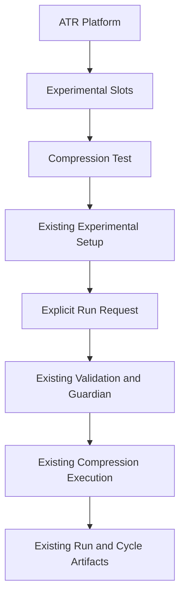

# Single Compression Experiment Slot Implementation Plan

> **대체됨 — 이 계획을 실행하지 말 것.** 연구 캠페인과 BO 연속값 지원을 제외한 잘못된 범위로 작성됐다. 최신 실행 기준은 [에이전트 소유 설정·변경 전파·연속 BO 통합 구현안](2026-09-07-agent-owned-campaign-continuous-bo.md)과 [통합 설계안](../specs/2026-09-07-single-compression-experiment-slot-design.md)이다. 아래 작업/코드는 과거 계획 기록이며 통합 범위의 실행 지침이 아니다.

> **For agentic workers:** REQUIRED SUB-SKILL: Use superpowers:subagent-driven-development (recommended) or superpowers:executing-plans to implement this plan task-by-task. Steps use checkbox (`- [ ]`) syntax for tracking. 위임 실행은 사용자 또는 적용 지침의 허용 범위에서만 한다.

**Goal:** ATR의 상위 개념으로 Experimental Slots를 드러내고, 압축시험 슬롯 하나를 기존 설정·채팅·실행·기록 경로에 연결한다.

**Architecture:** 실험 슬롯은 실험 유형을 설명하는 얇은 정의이며 별도 실행기가 아니다. 서버의 현재 그래프·설정을 기존 planning snapshot으로 투영하고 카드와 ORC가 이를 함께 사용한다. 실제 실행은 기존 controller 진입점과 에이전트 그래프에 남긴다.

**Tech Stack:** Python, 기존 MainController/Pydantic state, 기존 planning HTTP/event 경로, vanilla JavaScript/CSS, pytest, Node.js 기반 UI helper 회귀검증.

**Spec:** [최신 통합 설계 — 이 과거 계획과 범위가 다름](../specs/2026-09-07-single-compression-experiment-slot-design.md).

**Status:** superseded / authority: execution / execution_status: cancelled. 작성·폐기일 2026-09-07. 이 문서의 코드 블록은 폐기된 계획의 기록이며 현재 구현 사실이나 실행 지침이 아니다.

## Global Constraints

- 기존 경로 재사용 → 기존 경로 최소 확장 → 불가피한 경우만 신규 추가.
- 슬롯은 실험 유형 단위이고, 설정은 그 슬롯 내부의 구성값이다.
- 실제 제공하는 슬롯은 압축시험 하나뿐이며, 추가 슬롯이 구현되었다고 표시하지 않는다.
- GUI 라벨은 기존 영어 원칙을 유지하고, ORC 채팅은 사용자 언어를 따른다. 이 문서는 한글 개선안이다.
- 슬롯 기본 연결은 실험 설정의 확정이나 장비 승인이 아니다.
- 측정 CSV·설계 파일·분석 결과는 기존 아티팩트이며 슬롯이 아니다.
- BO·Design 연속값 지원, 목적함수 변경, 장비 구동 로직 변경은 이번 범위에서 제외한다.
- 새로운 슬롯 API·DB·workspace·범용 실행기·승인 상태 머신을 만들지 않는다.
- 기존 미커밋 변경을 보존한다. 사용자 요청 전에는 커밋·푸시하지 않는다.
- 구현 검증은 비구동으로 한정한다. 운영 서버 호출·재시작, 프린터/로봇/UTM 구동, 진행 중 run 복구를 하지 않는다.

---

## 1. 구현 후 사용자 흐름

```text
ATR
 └─ Experimental Slots
     └─ Compression Test [Current · Registered]
         ├─ 카드 클릭 → 기존 Experimental Setup 표시/포커스
         ├─ ORC 채팅 → 현재 설정 조회 및 기존 변경 경로
         └─ 별도 실행 요청 → 기존 검사·승인·Guardian → 기존 실행 그래프
                                                     └─ 기존 run/artifact 기록
```

최초 ORC 안내 예시:

> 현재 실험 슬롯은 압축시험입니다. 연결된 설정을 Experimental Setup에서 확인하거나 채팅으로 변경할 수 있습니다. 슬롯 등록은 실행 준비 완료를 뜻하지 않습니다.

하나뿐인 슬롯을 세션마다 다시 선택하게 하지 않는다. 다른 실험을 실행할 수 있는 가짜 카드도 만들지 않는다. 현재 Setup의 입력은 readonly 요약이며 `Draft Mission Update`가 채팅 초안을 만드는 구조이므로, 이번 작업에서 별도 폼 저장 기능을 새로 만들지 않는다.

## 2. 현재 코드와 변경 경계

| 파일/경계 | 확인한 현재 동작 | 이번 변경 |
|---|---|---|
| `experiments/schemas.py` | 실험 request/result 계약, 실험 유형 registry는 없음 | 변경하지 않음 |
| `experiments/slots.py` — 신규 | 대응하는 실험 유형 정의 없음 | 압축시험 1개와 순수 조회 함수 |
| `app/controller.py` / `planning_snapshot` | 기존 session/state/runtime 응답 | 작은 `experimental_slot` 필드 추가 |
| 같은 파일 / `_ensure_planning_intro` | 현재 no-op | 최초 슬롯 안내만 멱등적으로 기록 |
| 같은 파일 / 기존 prompt builder | ORC 설정·실행 안내 | 서버 슬롯 정보 추가, 존재하지 않는 슬롯 생성 금지 |
| 같은 파일 / `start`, `_handoff_planning_to_design` | 기존 시작 및 채팅 handoff | 실제 시작 시 슬롯 출처 메타데이터만 추가 |
| `web/static/planning.js` / `renderLiveExperimentSetupPanel` | 선택된 과거 report도 설정 출처가 됨 | 현재 설정 출처 분리 + 상위 슬롯 카드 |
| 같은 파일 / Setup click handler | 모든 Setup action을 채팅 초안으로 처리 | 카드 클릭과 기존 draft action 명시적 분기 |
| `web/static/styles.css` | 기존 Setup 레이아웃 | 작은 슬롯 카드 스타일 |
| 기존 graph/agents/bridge/BO/저장소 | 현재 압축시험 사이클 | 실행 로직·토폴로지·산출물 경로 변경 없음 |

새 템플릿 페이지는 필요 없다. `web/templates/planning.html`의 기존 `live-experiment-setup-panel` 안에서 상위 카드와 하위 설정을 구분한다.

## 3. 데이터 계약과 호환 규칙

### 3.1 슬롯 정의와 현재 상태를 분리

슬롯 정의는 `id=compression`, `version=1`, `graph_id=atr_closed_loop`와 기존 계약의 참조만 가진다. 프린터 주소, 모드, 시편 치수, 목적값을 슬롯 기본값으로 복사하지 않는다.

현재 상태는 다음 형식으로 `planning_snapshot()`에 추가한다.

```json
{
  "experimental_slot": {
    "schema": "experimental_slot_context.v1",
    "status": "linked",
    "definition": {
      "id": "compression",
      "version": 1,
      "label": "Compression Test",
      "description": "Specimen compression using the existing ATR experiment workflow.",
      "graph_id": "atr_closed_loop",
      "references": {
        "setup": "state.current_experiment_spec",
        "profile": "state.current_experiment_spec.test_mode_profile",
        "execution": "graphs/configs/atr_closed_loop.yaml",
        "io_contract": "experiments/schemas.py",
        "analysis": "agents/analysis_agent.py"
      }
    },
    "active_graph_id": "atr_closed_loop"
  }
}
```

`references`는 기존 책임 위치를 설명하는 내부 참조다. 파일을 동적으로 import하거나 장비를 초기화하는 명령이 아니다. 그래프 파일 경로는 기본 정의의 참조일 뿐, 사용자가 선택한 실제 graph config/version을 덮어쓰지 않는다.

| 조건 | 처리 |
|---|---|
| 현재 그래프가 `atr_closed_loop` | 압축시험 슬롯 연결 표시 |
| 과거 run에 슬롯 필드가 없음 | 과거 기록은 그대로 읽음. 현재 슬롯은 현재 controller에서 별도 조회 |
| 현재 그래프가 다른 기존 그래프 | `status=unlinked`, `definition=null`; 기존 비압축 경로를 차단하지 않음 |
| 서버 상태가 아직 오지 않음/응답 필드 없음 | 프런트엔드 `unavailable`; 압축시험 연결 성공으로 추정하지 않음 |
| 이미 실행 중인 run | 당시 기록한 슬롯 출처 유지. 카드 클릭으로 변경하지 않음 |
| 다른 실험 슬롯을 채팅으로 요청 | 현재 등록은 압축시험뿐임을 안내. 새 슬롯/실행을 만들지 않음 |

`linked`는 등록된 그래프와 연결됐다는 뜻이지 `ready`, 장비 정상, 승인 완료라는 뜻이 아니다. 새로운 물리 실행 gate를 슬롯 계층에 추가하지 않는다.

### 3.2 run에 추가할 최소 출처

```json
{
  "run_metadata": {
    "experimental_slot": {
      "schema": "experimental_slot_binding.v1",
      "id": "compression",
      "version": 1,
      "graph_id": "atr_closed_loop"
    }
  }
}
```

실제 graph hash/version/path는 기존 `runtime_graph`가 권위 있는 값이다. 슬롯 바인딩에 이를 복제하지 않는다. cycle별 기록이 기존 run/state를 보존하는 경로를 활용하고, 모든 artifact에 같은 필드를 중복 삽입하거나 저장 경로를 재편하지 않는다.

---

## Task 1: 압축시험 슬롯 정의와 순수 조회

**Files:**

- Create: `experiments/slots.py`
- Create/Test: `tests/unit/test_experimental_slots.py`

**Interfaces:**

- Consumes: 현재 그래프 식별자 `str`.
- Produces: `slot_for_graph(graph_id: str) -> dict[str, Any] | None`.
- 반환 dict는 호출자가 수정해도 원본 정의를 오염시키지 않는 복사본이다. import나 조회에 I/O·장비 접근이 없다.

- [ ] **1. 조회·격리 실패 테스트를 작성한다.**

```python
from experiments.slots import slot_for_graph


def test_compression_slot_references_existing_execution():
    slot = slot_for_graph("atr_closed_loop")
    assert slot["id"] == "compression"
    assert slot["version"] == 1
    assert slot["references"]["execution"] == "graphs/configs/atr_closed_loop.yaml"
    assert "mode" not in slot
    assert "specimen_size_mm" not in slot


def test_other_graph_is_not_mislabeled_as_compression():
    assert slot_for_graph("custom_graph") is None
    assert slot_for_graph("") is None


def test_slot_definition_is_not_mutated_by_consumers():
    slot_for_graph("atr_closed_loop")["references"]["setup"] = "bad"
    assert slot_for_graph("atr_closed_loop")["references"]["setup"] == "state.current_experiment_spec"
```

- [ ] **2. 위 테스트만 실행해 신규 모듈 부재로 실패함을 확인한다.**

Run: `.venv/bin/python -m pytest tests/unit/test_experimental_slots.py -q`

- [ ] **3. 최소 정의와 조회를 구현한다.**

```python
from copy import deepcopy
from typing import Any

_COMPRESSION_SLOT = {
    "id": "compression",
    "version": 1,
    "label": "Compression Test",
    "description": "Specimen compression using the existing ATR experiment workflow.",
    "graph_id": "atr_closed_loop",
    "references": {
        "setup": "state.current_experiment_spec",
        "profile": "state.current_experiment_spec.test_mode_profile",
        "execution": "graphs/configs/atr_closed_loop.yaml",
        "io_contract": "experiments/schemas.py",
        "analysis": "agents/analysis_agent.py",
    },
}


def slot_for_graph(graph_id: str) -> dict[str, Any] | None:
    if graph_id != _COMPRESSION_SLOT["graph_id"]:
        return None
    return deepcopy(_COMPRESSION_SLOT)
```

- [ ] **4. 같은 명령으로 3개 테스트 PASS를 확인하고 diff를 검토한다.** registry class, plugin loader, 설정 파일 자동 생성이 추가되지 않았는지 확인한다. 커밋하지 않는다.

## Task 2: 현재 슬롯 투영·ORC 안내·기존 실행 기록 연결

**Files:**

- Modify: `app/controller.py`
- Create/Test: `tests/unit/test_controller_experimental_slot.py`
- Regression: `tests/unit/test_controller_planning.py`

**Interfaces:**

- Consumes: Task 1의 `slot_for_graph(graph_id: str) -> dict[str, Any] | None`.
- Produces: `MainController._experimental_slot_context() -> dict[str, Any]`.
- Produces: `MainController._bind_experimental_slot_to_run() -> None`.
- Extends: 기존 `_ensure_planning_intro() -> None`, `planning_snapshot()`와 prompt builder. 새 HTTP 요청이나 실행 진입점은 만들지 않는다.
- 기록 식별: `schema=experimental_slot_intro.v1`, `event_type=experimental_slot.intro`, `event_fields={slot_id, slot_version}`. 기존 message scalar allowlist에 이미 있는 키를 사용한다.

- [ ] **1. 장비 초기화가 없는 controller 단위 테스트를 추가한다.**

```python
from copy import deepcopy
from types import SimpleNamespace
from app.controller import MainController


def bare_controller(graph_id="atr_closed_loop"):
    controller = MainController.__new__(MainController)
    controller._active_graph_id = graph_id
    controller._state = SimpleNamespace(
        run_metadata={"runtime_graph": {"graph_id": graph_id, "graph_hash": "kept"}},
        current_experiment_spec={"specimen_size_mm": [30, 30, 30]},
    )
    return controller


def test_slot_query_is_read_only():
    controller = bare_controller()
    before = deepcopy(vars(controller._state))
    assert controller._experimental_slot_context()["definition"]["id"] == "compression"
    assert vars(controller._state) == before


def test_binding_preserves_graph_and_spec():
    controller = bare_controller()
    before = deepcopy(vars(controller._state))
    controller._bind_experimental_slot_to_run()
    controller._bind_experimental_slot_to_run()
    assert controller._state.run_metadata["experimental_slot"]["id"] == "compression"
    assert controller._state.run_metadata["runtime_graph"] == before["run_metadata"]["runtime_graph"]
    assert controller._state.current_experiment_spec == before["current_experiment_spec"]


def test_unregistered_graph_remains_unlinked():
    controller = bare_controller("custom_graph")
    controller._bind_experimental_slot_to_run()
    assert controller._experimental_slot_context()["status"] == "unlinked"
    assert "experimental_slot" not in controller._state.run_metadata
```

- [ ] **2. 위 신규 테스트만 실행한다.**

Run: `.venv/bin/python -m pytest tests/unit/test_controller_experimental_slot.py -q`

Expected: 신규 메서드가 아직 없어 FAIL. 구현 후에는 PASS.

- [ ] **3. 以下の薄い投影・記録を追加し、既存入口に接続する。**

```python
def _experimental_slot_context(self) -> dict[str, Any]:
    definition = slot_for_graph(self._active_graph_id)
    binding = self._state.run_metadata.get("experimental_slot")
    if isinstance(binding, dict) and binding.get("graph_id") != self._active_graph_id:
        return {
            "schema": "experimental_slot_context.v1",
            "status": "mismatch",
            "definition": None,
            "active_graph_id": self._active_graph_id,
            "reason_code": "EXPERIMENTAL_SLOT_GRAPH_MISMATCH",
        }
    return {
        "schema": "experimental_slot_context.v1",
        "status": "linked" if definition else "unlinked",
        "definition": definition,
        "active_graph_id": self._active_graph_id,
    }


def _bind_experimental_slot_to_run(self) -> None:
    definition = slot_for_graph(self._active_graph_id)
    if definition is None:
        return
    self._state.run_metadata.setdefault("experimental_slot", {
        "schema": "experimental_slot_binding.v1",
        "id": definition["id"],
        "version": definition["version"],
        "graph_id": self._active_graph_id,
    })
```

연결 위치는 다음으로 제한한다.

1. `planning_snapshot()` 최상위에 `experimental_slot=self._experimental_slot_context()`를 추가한다. 기존 snapshot 구현에 이미 있는 처리는 유지하되, 슬롯 투영 때문에 새 write나 시작 동작을 만들지 않는다.
2. `_compact_planning_run_metadata()`에 작은 `experimental_slot` 키를 보존한다. 대용량 payload 제한은 풀지 않는다.
3. `start()`에서 새 state와 기존 `runtime_graph` 작성 직후, `run.created` 이전에 `_bind_experimental_slot_to_run()`을 호출한다.
4. `_handoff_planning_to_design()`의 기존 PLC/안전 잠금 검사를 통과하고 workflow 초기화가 끝난 뒤, 첫 accepted 메시지 이전에 같은 함수를 호출한다.
5. 실행 중 run은 `setdefault`로 최초 바인딩을 유지한다. 기존 그래프 선택·revision·mode/프로필·fault·cycle 계약을 변경하지 않는다. 이미 기록한 바인딩과 실제 그래프가 불일치하면 `status=mismatch`와 원인 코드를 투영하고 최초 성공 안내를 생략한다. 기존 안전 승인 정책은 재정의하지 않는다.

- [ ] **4. 최초 안내의 멱등성 테스트를 먼저 추가한다.** 아래 fixture는 실제 LLM/장비를 만들지 않는다.

```python
def test_intro_is_once_per_transcript_and_survives_memory_window(tmp_path):
    import json
    controller = bare_controller()
    path = tmp_path / "messages.jsonl"
    controller._planning_messages = []
    controller._planning_transcript_path = lambda: path

    def record(entry):
        controller._planning_messages.append(entry)
        with path.open("a", encoding="utf-8") as stream:
            stream.write(json.dumps(entry, ensure_ascii=False) + "\n")
        return entry

    controller._record_planning_message = record
    controller._ensure_planning_intro()
    controller._ensure_planning_intro()
    assert len(path.read_text(encoding="utf-8").splitlines()) == 1

    restored = bare_controller()
    restored._planning_messages = []
    restored._planning_transcript_path = lambda: path
    restored._record_planning_message = record
    restored._ensure_planning_intro()
    assert len(path.read_text(encoding="utf-8").splitlines()) == 1
```

- [ ] **5. 안내를 기존 transcript에 기록하고 bootstrap·prompt에 연결한다.**

구현 순서는 `현재 슬롯 조회 → 동일 transcript의 기존 intro 확인 → 없으면 _record_planning_message`다. `schema`, `event_fields.slot_id/version`으로 식별하고 같은 transcript에서 브라우저 session_id가 달라도 중복시키지 않는다. 프로세스 메모리 캐시는 transcript 경로별로 두되 최초 한 번 기존 JSONL을 확인한다. 메모리 메시지 window에서 사라진 안내를 다시 추가하지 않는다. 주기적 snapshot 조회는 transcript 검색·기록을 호출하지 않는다.

```python
entry = {
    "role": "orchestrator",
    "schema": "experimental_slot_intro.v1",
    "event_type": "experimental_slot.intro",
    "event_fields": {"slot_id": "compression", "slot_version": 1},
    "content": "현재 실험 슬롯은 압축시험입니다. 연결된 설정을 Experimental Setup에서 확인하거나 채팅으로 변경할 수 있습니다. 슬롯 등록은 실행 준비 완료를 뜻하지 않습니다.",
    "ok": True,
}
```

위 예시의 id/version은 실제 `definition`에서 가져온다. 마지막 사용자 메시지가 영어이면 동일 의미의 영어 문구를 쓴다. 언어 정보가 없는 최초 진입은 현재 서비스 기본인 한국어를 사용한다. 새 언어 설정 저장소를 만들지 않는다. JSONL의 일부 잘못된 줄은 건너뛰고, 파일 읽기 실패는 기존 로깅 경로로 알린다. 조회 실패/미연결을 압축시험 성공 안내로 덮지 않는다.

`prepare_live_gui`의 기존 초기화 위치를 활용한다. 실행 중 early return에서도 최초 안내가 필요한 경우에는 `bootstrap_live_orchestrator`에서 session binding 후 같은 멱등 함수를 호출한다. 시작 요청·mode 변경·장비 연결 함수를 안내 생성에서 호출하지 않는다. 기존 bootstrap LLM 호출은 유지하되 슬롯 소개를 중복하지 않도록 prompt에 이미 안내한 사실을 포함한다. 슬롯 안내를 위한 추가 LLM 호출은 없다.

기존 live/test ORC prompt에 다음 계약과 JSON context만 추가한다. 기존 설정 검증·intent 처리·실행 trigger는 교체하지 않는다.

```text
experimental_slot_context is authoritative for the current experiment type.
A slot is an experiment type, not a run, input field, specimen, or artifact.
Only Compression Test is registered. Do not create or select another slot.
Slot registration does not mean setup is complete or execution is approved.
Use the existing setup revision and execution request paths.
Do not repeat an experimental_slot_intro already present in this transcript.
Follow the operator's language; use Korean when no operator language is available.
```

- [ ] **6. 신규 테스트와 관련 기존 planning 회귀 테스트를 실행한다.** 준비/시작 fixture는 임시 경로와 mocked agent/tool 경계를 사용하고 운영 인스턴스를 호출하지 않는다. 안내 후 `_run_task` 생성 없음, safety latch/mode/spec/프로필 변화 없음, compact projection에서 바인딩 보존을 추가 검증한다. 커밋하지 않는다.

## Task 3: 상위 슬롯 카드와 현재 Experimental Setup 연결

**Files:**

- Modify: `web/static/planning.js`
- Modify: `web/static/styles.css`
- Create/Test: `tests/unit/test_planning_experimental_slot_js.py`

**Interfaces:**

- Consumes: Task 2의 `session.experimental_slot`, 기존 `session.state`.
- Produces: `currentExperimentSetupModel(session)` → `{slot, state, spec}`. session 외의 선택된 보고서 전역변수를 읽지 않는다.
- Extends: `renderLiveExperimentSetupPanel`, 기존 `[data-experiment-setup-action]` click handler.
- Actions: `open_setup`은 화면만 열고, `draft_apply`만 기존 채팅 초안을 만든다.

- [ ] **1. 서버 현재 상태가 과거 report보다 우선하고, 미수신 상태를 성공으로 가정하지 않는 실행 테스트를 작성한다.** 기존 JS helper 검증 방식처럼 Node에서 함수를 실행한다.

```python
import json
import shutil
import subprocess
from pathlib import Path


def test_current_setup_ignores_report_history():
    source = Path("web/static/planning.js").read_text(encoding="utf-8")
    start = source.index("function currentExperimentSetupModel(")
    end = source.index("\nfunction ", start + 1)
    helper = source[start:end]
    session = {
        "experimental_slot": {"status": "linked", "definition": {"id": "compression"}},
        "state": {"current_experiment_spec": {"material": "PLA"}},
    }
    script = helper + "\nconst liveSelectedReport = {spec: {material: 'ABS'}};\n"
    script += "console.log(JSON.stringify([currentExperimentSetupModel(" + json.dumps(session) + "), currentExperimentSetupModel({})]));"
    node = shutil.which("node")
    assert node, "Node.js is required for executable UI helper tests"
    result = subprocess.run([node, "-e", script], check=True, capture_output=True, text=True)
    current, missing = json.loads(result.stdout)
    assert current["spec"]["material"] == "PLA"
    assert current["slot"]["definition"]["id"] == "compression"
    assert missing["slot"]["status"] == "unavailable"
```

- [ ] **2. 신규 테스트를 실행하고 helper 부재로 실패하는지 확인한다.**

Run: `.venv/bin/python -m pytest tests/unit/test_planning_experimental_slot_js.py -q`

- [ ] **3. pure helper를 기존 Setup renderer 바로 앞에 추가한다.**

```javascript
function currentExperimentSetupModel(session) {
  const current = session || {};
  const state = current.state || {};
  return {
    slot: current.experimental_slot || {status: "unavailable", definition: null},
    state,
    spec: state.current_experiment_spec || {},
  };
}
```

카드와 Setup, `Draft Mission Update`의 payload 모두 이 helper를 사용한다. 보고서/아티팩트 뷰의 `selectedReportModel` 자체는 변경하지 않는다. 기존 `orchestratorContext`에는 현재 state/spec를 반영한 모델을 넘겨 과거 mission/pending approval이 섞이지 않도록 한다.

- [ ] **4. 기존 panel 안에 카드와 하위 Setup 영역을 렌더링하고 action을 분리한다.**

```html
<section class="live-experimental-slots" aria-label="Experimental Slots">
  <span>Experimental Slots</span>
  <button type="button" data-experiment-setup-action="open_setup"
          aria-controls="live-current-experiment-setup">
    <strong>Compression Test</strong>
    <span>Current · Registered</span>
  </button>
</section>
<section id="live-current-experiment-setup" tabindex="-1" aria-label="Experimental Setup">
</section>
```

위 하위 section 안에 기존 Setup 내용을 유지한다. 표시명은 서버 definition을 `escapeHtml`로 이스케이프하여 넣는다. `unlinked`는 `No linked experimental slot`, `unavailable`은 `Experimental slot unavailable`, `mismatch`는 `Experimental slot binding mismatch`로 표시하고 작동하는 압축시험 선택 버튼을 만들지 않는다. `Registered`를 `Ready`로 치환하지 않는다.

```javascript
const action = button.dataset.experimentSetupAction;
if (action === "open_setup") {
  const setup = document.getElementById("live-current-experiment-setup");
  if (setup) {
    setup.hidden = false;
    setup.focus({preventScroll: true});
    setup.scrollIntoView({block: "nearest"});
  }
  return;
}
if (action !== "draft_apply") return;
const current = currentExperimentSetupModel(liveLastSession);
```

이 분기 이후 기존 draft 코드는 `current.state/spec`와 현재 슬롯 id를 사용한다. 카드는 fetch/POST, 채팅 전송, runtime 시작을 하지 않는다. 버튼의 native Enter/Space 동작을 유지한다. 주기적 재렌더링이 포커스를 강제로 가져오지 않게 한다.

```css
body.planning-live-body .live-experimental-slots {
  display: grid;
  gap: 8px;
  margin-bottom: 12px;
}
body.planning-live-body .live-experimental-slots button {
  display: flex;
  flex-wrap: wrap;
  justify-content: space-between;
  gap: 8px;
  text-align: left;
}
```

색/테두리/포커스 스타일은 기존 버튼과 theme 토큰을 재사용한다. 슬롯 하나를 보이려고 별도 workspace나 새로운 상위 탭을 만들지 않는다. 기존 Setup의 `ready` 표현을 유지하는 경우 반드시 설정 상태임을 명시하고 장비 준비 상태와 혼동시키지 않는다.

- [ ] **5. helper 테스트 PASS 후 클릭·키보드·과거 결과 조회 회귀를 검증한다.** 로컬 정적 fixture에서 `fetch`, 실행 함수, 채팅 전송을 spy로 교체하고 카드 클릭/Enter/Space의 호출 횟수가 0임을 확인한다. 과거 결과 조회는 보고서만 바꾸며 카드/Setup/draft 대상은 현재 서버 상태에 남아야 한다. 커밋하지 않는다.

## Task 4: 기존 경로 회귀검증과 문서 연결

**Files:**

- Extend/Test: `tests/unit/test_controller_experimental_slot.py`
- Extend/Test: `tests/unit/test_planning_experimental_slot_js.py`
- Modify after implementation: `docs/runtime/autonomous_experiment_runtime.md`
- Modify after implementation: `docs/agents/orchestrator_agent.md`
- Modify after implementation: `README.md`, `README.en.md`

README 변경은 기존 언어별 문서의 역할을 유지한다. `README.ko.md`에 별도 내비게이션을 유지하고 있다면 같은 runtime 링크를 그 표에도 반영한다. 언어별 README의 내용 전체를 동기화하는 작업으로 확대하지 않는다.

**Interfaces:**

- Consumes: Task 1–3의 정의/투영/기록/UI, 변경하지 않은 기존 실행 및 artifact 계약.
- Produces: 아래 수용 기준의 실행 결과와 구현 사실에 맞는 문서. 장비 실증 성공 주장은 만들지 않는다.

- [ ] **1. UI action 회귀 테스트를 추가한다.** 기존 click handler의 등록 코드를 테스트 DOM에 연결하여 `open_setup` 뒤 draft/start spy가 호출되지 않는지 검사한다. helper만 통과한 것을 클릭 동작 검증으로 대체하지 않는다.
- [ ] **2. 기존 시작·handoff 테스트 fixture로 테스트/실제 프린터 모드별 바인딩을 확인한다.** controller 자체는 실제 경로를 사용하고 agent/tool 호출 경계만 mock한다. `_handoff_planning_to_design` 전체를 성공 반환 함수로 대체하지 않는다.
- [ ] **3. 아래 검증표에 대응하는 테스트 결과를 남긴다.**

| 검사 | 수용 기준 |
|---|---|
| 현재 슬롯 GET/주기적 조회 | 신규 transcript write, 실행 task, 장비 요청 없음 |
| 최초 안내/새 탭/새로고침 | 같은 transcript에서 슬롯 안내 1회, 별도 필수 LLM 호출 없음 |
| transcript 복원/메모리 window 만료 | 초기 안내 중복 없음 |
| card/Setup/ORC | 같은 현재 서버 슬롯/설정 사용 |
| 과거 보고서 선택 | 현재 슬롯/설정/draft 변경 없음, 과거 보고서 자체는 정상 조회 |
| custom graph/구형 응답 | 압축시험으로 오인하지 않고 기존 동작 유지 |
| 실제 시작 | 기존 safety 검사 뒤 출처 추가, run 시작 함수·graph revision 유지 |
| 기존 safety latch | 기존 `SAFETY_LATCH_ACTIVE` 유지, 슬롯 선택으로 해제되지 않음 |
| mode/profile/실제 프린터 | 기존 per-device 정책·출력 skip·이젝션 값 변하지 않음 |
| 후속 cycle/BO redesign | 기존 cycle 계약·LHS/BO 경로 유지, 같은 run의 슬롯 출처 유지 |
| 아티팩트 | 기존 경로·run/cycle/specimen 연결 보존, 슬롯 디렉터리로 이관 없음 |
| 실패 표시 | 미연결/미수신을 등록 성공·실행 준비 완료로 표시하지 않음 |

신규 표시는 아래처럼 기존 불변값 assertion과 함께 확인한다. 이 helper를 기존 시작/handoff mock fixture의 실행 전후에 사용한다.

```python
def assert_slot_binding_preserves_execution(before, after):
    assert after["current_experiment_spec"] == before["current_experiment_spec"]
    assert after["mode"] == before["mode"]
    assert after["emergency_stop_requested"] == before["emergency_stop_requested"]
    assert after["run_metadata"]["runtime_graph"] == before["run_metadata"]["runtime_graph"]
    assert after["run_metadata"]["experimental_slot"]["id"] == "compression"
```

위 비교는 바인딩 호출 전후에 적용한다. 전체 실제 사이클 전후의 spec/stage가 같아야 한다고 잘못 테스트하지 않는다.

- [ ] **4. 다음 순서로 비구동 테스트를 실행한다.** 실행 전 기존 fixture가 운영 장비를 호출하지 않는지 확인하고 network/device 경계는 mock한다. 기존 실패는 변경 전 결과와 구분하여 보고하고 이번 수정의 성공으로 숨기지 않는다.

```bash
.venv/bin/python -m pytest tests/unit/test_experimental_slots.py tests/unit/test_controller_experimental_slot.py tests/unit/test_planning_experimental_slot_js.py -q
.venv/bin/python -m pytest tests/unit/test_controller_planning.py -k 'real_printer_choice_preserves_explicit_per_device_policy or printer_choice_snapshots_saved_hybrid_profile_and_preserves_it_for_redesign or test_mode_initial_cycle_is_seeded_from_bo_lhs or next_cycle_contract_republishes_bo_next_design_request' -q
.venv/bin/python -m pytest tests/unit/test_agent_artifact_archive.py tests/unit/test_experiment_runtime.py -q
node --check web/static/planning.js
git diff --check
```

Python 테스트 코드에 운영 `http://...` 주소를 주입하거나 TestClient 대신 실행 중 GUI 서버를 호출하지 않는다. 환경 의존성으로 테스트를 실행하지 못하면 `not run`으로 기록한다. 임의 fallback으로 통과시키지 않는다.

- [ ] **5. 실제 구현 완료 후에만 현재 동작 문서를 갱신한다.**

`docs/runtime/autonomous_experiment_runtime.md`에 플랫폼→실험 슬롯→Setup→기존 실행 흐름, 슬롯/아티팩트 차이, graph/run binding, legacy/unlinked 동작을 추가한다. `docs/agents/orchestrator_agent.md`에 초기 슬롯 안내와 설정 변경/실행 책임 경계를 넣는다. README 두 언어의 기존 문서 표에서 이 runtime 문서로 진입하게 한다. 압축시험 외 슬롯은 아직 미구현임을 명시한다.

추가할 도표의 의미:



슬롯 정의 문서는 Design, 본 문서는 Plan이며 둘을 실증 결과로 인용하지 않는다. 문서 표준의 plan 예외에 따라 이번 계획은 manifest 준수를 완료했다고 주장하지 않는다. 공개 reference의 코드/계약 링크는 구현 완료 시 실제 파일과 대조한다.

- [ ] **6. 변경 파일·검증 결과·미검증 항목을 보고하고 멈춘다.** 실제 장비 검증, 운영 반영, 커밋·푸시는 사용자의 별도 요청을 기다린다.

## 4. 범위 및 자체 검토

- 플랫폼 확장성은 `experiments/slots.py`의 실험 유형 경계로 표현하고, 현재 실행 엔진을 범용화하지 않는다.
- 첫 슬롯 연결은 기존 압축시험 실행의 이름표·설정 진입·출처 연결까지이며, 압축시험 조건을 다른 미래 실험에 공통 규칙으로 강제하지 않는다.
- 초기 카드/안내, 기존 설정 경로, 실행 참조, 과거 기록 분리, 비구동 검증, 문서 연결은 각각 Task 1–4에 포함된다.
- BO 연속값, 캠페인 관리, 상세 설정 버전 체계는 별도 합의/계획으로 남긴다.
- 이 계획 작성 시 코드·장비·서버·Git 이력은 변경하지 않는다. 변경물은 이 Plan과 함께 읽을 기준 Design 사본뿐이다.
