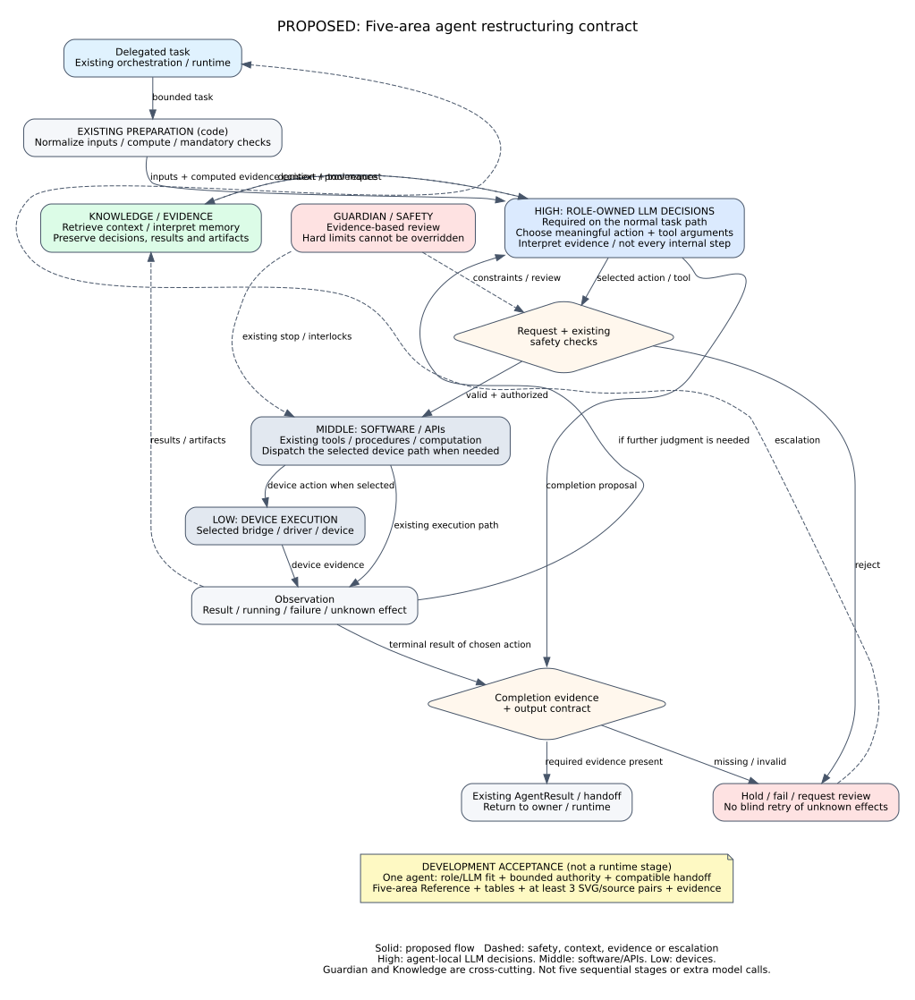

# 에이전트 5영역 재구성 통합 계약 설계

## Summary

이 문서는 **에이전트 재구성 자체의 공통 계약**이다. 문서 정리만을 위한
별도 규칙이 아니며, 각 에이전트의 구조·LLM 판단·툴 호출·기존 Reference·표·SVG·검증을
하나의 완료 단위로 묶는다.

**LLM은 모든 에이전트의 정상 유효 작업 경로에 참여한다. 다만 에이전트 내부 전체
실행 경로가 아니라, 그 전문 역할에 맞는 일부 의사결정층만 담당한다.**
입력 정규화·정형 계산·장비 실행·필수 검증·보관을 매 단계 LLM 호출로 바꾸지 않는다.
예외 때만 LLM을 호출하는 구조도 목표가 아니다. 의사결정층은 새로운 여섯 번째 계층이나
별도 에이전트가 아니라, 기존 책임 영역 안에서 실제 선택권을 가진 논리적 구간이다.

핵심 완료식은 다음과 같다.

**한 에이전트 재구성 완료 = 실제 판단/툴 실행 구현 + 기존 인계 호환성 +
5영역 Reference + 계약 표 + SVG/원본 + 검증 근거.**

사용자가 합의한 방향을 상세 계약으로 정리한 검토안이다. 이 문서 작성은 에이전트
구현이나 전체 사이클 변경 승인이 아니다. 적용은 한 에이전트씩 별도 확인 후 진행한다.

## Problem

기존 코드에는 역할·입출력·툴·브릿지 경계가 있지만, 여러 LLM 호출은 실행 선택에
영향을 주지 않는 설명 메모 생성에 머문다. 반대로 `agentic`, `reasoning`이라는
화면 단계명만으로 실제 모델 판단·툴 실행이 존재한다고 해석할 위험이 있다.

에이전트 내부 판단권을 확대하면서도 기존 실행 경로를 보존하려면, 코드만이 아니라
문서와 검증에서도 **모델이 결정하는 것 / 코드가 강제하는 것 / 실행기가 수행하는 것**이
일치해야 한다. 문서 갱신은 재구성 이후의 선택 작업이 아니라 완료 조건이다.

## Goals and Non-goals

### 목표

- High-Level, Middle-Level, Low-Level, Guardian / Safety, Knowledge / Evidence를 모든 에이전트에 적용하는 공통 책임 계약으로 사용한다.
- 각 에이전트의 정상 유효 작업 경로에 역할 적합성이 설명되는 LLM 의사결정층과 의미 있는 툴 호출을 둔다.
- 맥락·상충 근거·불확실성을 종합하는 판단과 정형 계산·필수 실행을 분리한다. LLM의 선택은 실제 후속 작업에 반영한다.
- 기존 함수·등록 툴·Skill·브릿지·런타임·아카이브를 우선 사용한다.
- 기존 `docs/agents/*_agent.md`를 같은 다섯 영역으로 재구성한다.
- 구현, 표, 피겨, 검증의 대응 관계를 에이전트별로 확인한다.
- 미변경 에이전트와 변경된 에이전트가 기존 계약으로 함께 동작하게 한다.

### 이번 설계에서 하지 않는 일

- 모든 에이전트의 동시 구현, 런타임/브릿지 교체, 그래프 경로 전면 변경.
- 다섯 실행 stage, 다섯 하위 에이전트, 다섯 프로세스의 의무 생성.
- 전체 내부 단계를 LLM이 스케줄링하는 범용 루프로 교체하거나 단순 계산·고정 순서까지 모델 선택으로 포장하기.
- 임의 shell/Python 실행, 자유로운 장비 명령 생성, 기존 안전 인터록 해제.
- 캠페인·슬롯·새 설정 연동 시스템 등 이번 요청 밖의 기능 재도입.
- 열 개의 중복 Reference 신설, 기존 문서 일괄 이동·폐기.
- 실제 장비 구동, 운영 서버 재시작, 과거 실증의 새 구현 실증으로의 전용.

## Current Context

- 보호 기준점: `closed-loop-stable`, 커밋 `ef4a996c3faf201b01078cf33cd5e485891b0218`.
- 기존 계층 정의: `docs/runtime/three_level_control_model.md`.
- 기존 진입점: `docs/agents/README.md`, 각 Agent Reference, API/Connection Matrix.
- 기존 실행 경계: `AgentContext`, 등록 툴, `AgentResult`, LangGraph/controller의 상태·인계 처리.
- 기존 보관: run/loop/agent/attempt 단위 아티팩트 및 이벤트.

현행 코드 조사에서는 Design의 LLM 검토 메모, Analysis 요약, Guardian의 정책 메모와
실제 계산·결정 분기가 분리되어 있었다. BO의 일부 후보 평가 및 Equipment의 조건부
계획·복구에는 실제 선택 참여가 있다. 각 에이전트 착수 시 해당 기준을 다시 확인한다.
현재 기능으로 간주할 근거는 코드와 실행 기록이지 문서의 단계 이름이 아니다.

## Options Considered

| 방식 | 장점 | 한계 | 선택 |
|---|---|---|---|
| 문서 제목만 다섯 영역으로 변경 | 변경량이 작음 | 실제 판단·툴 호출 재구성을 보장하지 못함 | 제외 |
| 전체 에이전트와 공통 런타임을 한 번에 교체 | 일괄 통일 가능 | 기존 실증 경로 훼손과 원인 분리 위험, 요청 범위 초과 | 제외 |
| 공통 통합 계약 아래 에이전트 하나씩 재구성 | 기존 경계 보존, 개별 검증, 문서와 구현의 동시 완료 | 전환 기간에는 구현 상태가 서로 다름 | 채택 제안 |

## Decision

**5영역 통합 계약을 먼저 검토하고, 에이전트별로 분석 → 변경 범위 확인 → 구현 →
문서/피겨 갱신 → 검증 → 사용자 확인 순으로 적용한다.** 한 에이전트 검증을 위해
다른 에이전트 전체를 먼저 바꾸어야 하는 설계는 채택하지 않는다.

다섯 영역은 책임 구분이다. High/Middle/Low는 제어 계층이며 Guardian/Safety와
Knowledge/Evidence는 이 계층들을 가로지르는 공통 영역이다. 다섯 영역을 순서대로
한 번씩 실행해야 한다는 뜻이 아니다.

2026-09-07 보정: **모든 에이전트에 LLM 판단층이 있어야 한다는 조건은 유지한다.**
이를 모든 내부 단계의 LLM화나 예외 전용 LLM으로 해석하지 않는다. 각 에이전트는 먼저
자기 역할에서 LLM에 적합한 의사결정 문제를 정의하고, 그 경계에만 판단·툴 호출을 배치한다.

## Architecture and Contracts

### 1. 다섯 영역의 책임 계약

| 영역 | 주된 책임 | LLM의 역할 | 기존 코드/실행기의 역할 | 경계 |
|---|---|---|---|---|
| High-Level Control | 목표·위임·인계·사이클 진행 | 허용된 작업 위임, 결과 검토, 추가 작업/진행/상위 검토 판단 | 실행 가능한 경로, 상태 전이, 식별자와 인계 계약 적용 | 전문 에이전트를 건너뛰어 브릿지 직접 제어 금지 |
| Middle-Level Control | 담당 작업의 수행 전략 | 상태를 보고 툴·인자를 선택하고 반환 결과로 다음 행동/완료 판단 | 입력 검증, 계산, 계약 검사, 실행 예산 강제 | 다른 에이전트의 설정·산출물 소유권 침범 금지 |
| Low-Level Control | 단일 요청 실행·관측 | LLM을 의무 배치하지 않음 | 기존 함수·툴·서비스·Skill·브릿지·VLA/solver 실행 | 연구 목표나 다음 에이전트를 임의 변경하지 않음 |
| Guardian / Safety | 위험 판단과 실행 제한 | 근거 조회, 불일치 판단, 보류/검토/정지 요청 등 실제 판단 | 하드 제한·기존 승인·인터록·긴급 정지 강제 | 모델 허용으로 코드/장비 차단을 무효화할 수 없음 |
| Knowledge / Evidence | 근거 제공·지식 갱신·이력 보존 | 검색 대상/관계/기억 내용 선택, 근거 기반 해석 | 원시 기록 자동 저장, 출처·스키마·정체성 검증 | 가설을 측정 사실로 저장하거나 타 에이전트 설정 직접 변경 금지 |

각 Agent Reference는 다섯 영역을 모두 설명하되, 직접 소유하지 않는 영역에서는
연결 대상과 계약만 기록한다. Guardian과 Knowledge도 자기 전문 작업의 판단–툴–관측
루프를 갖지만, 이를 위해 별도의 Guardian/Knowledge 복제 에이전트를 만들지 않는다.
High 담당 에이전트는 High의 위임 판단에, Middle 담당 에이전트는 전문 작업 판단에,
Guardian/Knowledge 에이전트는 각자의 검토·지식 판단에 LLM을 둔다. 모든 에이전트의
다섯 영역 각각에 모델을 배치하거나 모든 결정권을 Middle로 옮긴다는 뜻이 아니다.

### 2. 공통 실행 계약



**Figure Contract-1.** Proposed architecture: deterministic preparation feeds a
role-owned LLM decision layer on the normal task path. Only that bounded layer
selects meaningful actions/tools and interprets observations; existing execution,
mandatory checks and handoff remain code-owned. Its owner is High, Middle,
Guardian or Knowledge according to the agent, not an additional control level.
The lower acceptance box is a development-completion contract, not a runtime stage.
This design figure is not evidence of implemented or live-validated behavior.

| 단계 | 계약 |
|---|---|
| 작업 수신 | 목표·필수 입력·제약·기존 run/loop/specimen/attempt 정체성을 확보한다. 결손 입력은 명시적으로 반환한다. |
| 근거 구성 | 기존 코드가 입력 정규화·기본 계산·필수 사전 검사를 수행할 수 있다. 그 결과와 필요한 관측·이전 결과·지식·허용 툴 스키마를 판단층에 제공한다. 툴 출력/외부 문서는 근거이지 실행 권한이 아니다. |
| 모델 판단 | 정상 작업에서 역할에 맞는 판단층을 거친다. 모델이 근거를 종합해 채택/추가 확인/허용된 수정/상위 반환 등 해당 역할의 행동과 툴·인자를 선택한다. 전체 실행 단계의 스케줄링은 맡기지 않는다. |
| 요청 검증 | 허용 툴, 인자 타입·범위, 입력 정체성, 기존 승인·안전 조건을 검사한다. 자유 텍스트를 임의 실행하지 않는다. |
| 기존 기능 실행 | 검증된 요청만 기존 구현으로 전달한다. 실행 중이면 기존 상태 조회 경로를 사용한다. |
| 결과 관측 | 구조화된 성공/실패/진행 중/결과 불명 및 아티팩트 참조를 반환한다. 추가 판단이 필요한 관측은 같은 판단층에 돌려준다. 판단이 끝난 후의 정형적 패킷 생성·보관 성공마다 모델을 다시 호출하지 않는다. |
| 완료 확인 | 모델의 완료 주장과 필수 결과·증거를 대조한다. 호출 성공만으로 물리 작업/분석 완료를 선언하지 않는다. |
| 인계 | 기존 `AgentResult`와 인계 필드로 반환한다. 다음 stage 변경은 기존 High/runtime 경계가 적용한다. |

툴 호출은 native function calling 또는 검증 가능한 구조화 출력으로 구현할 수 있다.
형식보다 중요한 것은 **모델이 만든 판단·툴 선택·인자가 실제 실행에 반영되고,
추가 판단이 필요한 결과가 모델에 다시 제공되는가**이다. 전용 provider SDK나 새 전역
프레임워크 도입은 필수가 아니다. 위 표는 경계 계약이며 모든 내부 함수 앞뒤를 모델로
감싸라는 호출 순서 명세가 아니다.

기존 순수 계산 함수를 agent-scoped tool로 노출할 수 있지만, 등록명·범위·스키마는
해당 에이전트 설계에서 기존 등록 방식을 확인한 뒤 확정한다. 존재하지 않는 툴을
현재 등록된 API로 문서화하지 않는다. 검증된 Skill/Flow를 통째로 선택·호출하는 것도
유효한 툴 호출이며, 안정화한 내부 클릭·모션을 LLM으로 다시 생성할 필요는 없다.

### 3. 의미 있는 LLM 관여의 판정

#### 역할과 LLM의 적합성 계약

에이전트별 구현에 앞서 다음 내용을 해당 Reference의 Middle 영역
`LLM Reasoning and Decision Authority`에 적고, 실제 소유 영역이 High/Guardian/Knowledge면
그 영역의 책임 설명과 연결한다.

| 항목 | 반드시 설명할 내용 |
|---|---|
| 판단 문제 | 이 에이전트의 전문 역할에서 모델이 답해야 할 구체적인 질문 |
| 판단 근거 | 목표·관측·계산·과거 기록과 출처, 결손/불확실성 |
| LLM 적합성 | 맥락 해석·상충 근거 종합·추가 확인 선택 등 모델에 맡기는 이유. 단순 산술·타입 검사로 충분한 부분과 구분 |
| 실제 선택권 | 허용된 행동·툴·인자와 각 선택이 바꾸는 후속 작업. 형식적인 승인·고정 행동 설명만으로는 부족 |
| 고정 경계 | 다른 에이전트 소유 변수, 사용자 확정 조건, 필수 계산·실행·검증, 변경 금지 항목 |
| 정상 경로 위치 | 판단층의 입력 시점, 결과 소비 지점, 필요한 경우만 되돌아오는 관측 경로 |
| 검증 방법 | 정상 채택과 다른 근거에서의 추가 확인/상위 반환 등 판단 차이가 실제 실행에 반영되는지 검사 |

선택의 개수나 툴 호출 횟수 자체는 기여가 아니다. 가능한 판단이 없는 고정 작업에
더미 선택지를 만들지 않는다. 전체 에이전트의 역할에서 적합한 판단 경계를 찾지 못하면
그 문제를 사용자와 재검토하며, 예외 전용 호출이나 의미 없는 승인으로 완료 처리하지 않는다.

#### 관여 판정

| 구분 | 판정 |
|---|---|
| 코드가 정한 실행을 마친 뒤 설명 메모만 생성 | 설명용 호출. 재구성 완료 조건을 충족하지 않음 |
| 실행과 무관한 더미 툴을 형식적으로 한 번 호출 | 충족하지 않음 |
| 결과와 무관하게 같은 실행을 하는 형식적 승인 | 충족하지 않음. 선택의 실제 효과와 근거 의존성이 필요 |
| 예외 때만 LLM을 호출하고 정상 유효 작업은 기존 고정 실행만 수행 | 부분 구현. 정상 작업의 판단 참여 조건은 미충족 |
| 정상 경로의 일부 판단층에서 근거를 종합하고 실제 행동/툴을 선택하며 필요시 결과를 재판단 | 목표 구조. 역할 적합성과 계약·검증 근거 필요 |
| 모든 내부 계산·고정 실행 순서를 모델이 하나씩 지시 | 목표가 아님. 국소 판단층 밖의 기존 실행을 유지 |
| 이미 유효하게 완료된 작업, 사전 차단, 운영자 취소, 상태 polling | 불필요한 LLM 호출을 강제하지 않음. 무호출 사유를 기록 |

기존 행동이 안전하고 충분하면 모델이 동일한 선택을 하는 것은 정상이다. 모델 관여를
증명하기 위해 불필요한 선택지·호출·재시도를 늘리거나 매 polling마다 추론하지 않는다.
결정론적 대체 실행은 사용 여부와 이유를 구분해서 기록하며 LLM 경로 검증으로 세지 않는다.
명시적인 비LLM 테스트 모드는 재현용으로 구분할 수 있으나, 이를 정상 LLM 작업 경로의
검증으로 대체하지 않는다. 모드별 기존 정책 변경은 개별 설계에서 확인한다.

### 4. 에이전트별 적용 범위와 문서 소유권

아래는 분석 초점과 보존 경계이며, 개별 툴 스키마나 변경 구현을 미리 확정하는 표가 아니다.

| 에이전트 | 주된 판단 영역 | 재구성 시 분석할 판단/툴 경계 | 보존할 전문 실행 | 갱신할 기존 Reference |
|---|---|---|---|---|
| Orchestrator | High | 위임·조회·추가 작업·진행 판단 | 기존 graph/runtime와 인계 | [Orchestrator](../../agents/orchestrator_agent.md) |
| Design | Middle | 목표·상위 요청·설계 검증·실험 근거를 종합한 설계 채택/추가 확인/허용된 수정/상위 반환 | BO/LHS 지정점·사용자 조건, 후보 생성·형상·제약·점수 계산, 기존 인계 | [Design](../../agents/design_agent.md) |
| Specimen Making | Middle | 제작 준비·작업 선택·완료 근거 검토 | 슬라이싱·전송·프린터·이젝션 | [Specimen](../../agents/specimen_agent.md) |
| Vision | Middle | 관측/검증 요청·해석·재관측 | 카메라·검출·좌표·freshness 검증 | [Vision](../../agents/vision_agent.md) |
| Manipulation | Middle | 작업/Skill 선택·감독·완료 판단 | LeRobot/VLA·녹화 모션·종료 경로 | [Manipulation](../../agents/manipulation_agent.md) |
| Lab Equipment | Middle | 저장 Skill/Flow 선택·결과 확인·제한된 복구 | 기존 장비 Skill·worker·통신 | [Equipment](../../agents/equipment_agent.md) |
| Analysis | Middle | 분석/검증/해석 툴 선택·결과 채택 | 파서·단위·지표 계산·solver | [Analysis](../../agents/analysis_agent.md) |
| BO | Middle | 최적화 요청·전략·후보 검토 | 수치 최적화·LHS·관측 품질 검사 | [BO](../../agents/bo_agent.md) |
| Guardian | Guardian/Safety | 근거 조회·위험 판단·허용/보류/정지 요청 | 기존 코드 gate·하드 인터록 | [Guardian](../../agents/guardian_agent.md) |
| Knowledge | Knowledge/Evidence | 검색·관계 판단·기억 갱신 | 저장·출처·스키마 검증·원본 보존 | [Knowledge](../../agents/knowledge_agent.md) |

#### Design 우선 재검토 — 구현 전 검토안

검토 기준은 현재 [Design 코드](../../../agents/design_agent.py),
[모듈 정의](../../../graphs/modules/design/module.yaml),
[controller](../../../app/controller.py), [기존 테스트](../../../tests/unit/test_design_agent.py)다.
아래는 현재 구현과 제안을 구분한 첫 적용 대상 검토이며, 구현 승인이 아니다.

| 현재 확인한 지점 | 재구성에 주는 의미 |
|---|---|
| `_deterministic_design_payload()`가 근거 수집·후보 생성·검사·점수순 선택·보고서/인계를 모두 수행 | 이 함수를 통째로 호출하는 LLM wrapper는 기존 코드의 선택을 그대로 실행할 뿐이다. 후보/근거 준비와 최종 확정 사이에 판단 경계를 둬야 함 |
| `run()`의 `design_reasoning`은 이미 선택된 후보의 위험/전략 메모만 요청 | 메모 호출을 실질적 판단층으로 대체할 지점. 현재 메모는 후보 선택권이 없음 |
| `_resolve_constraints()`는 BO 추천과 `orchestrator_design_contract.requested_parameters`를 반영 | 상위 지정 변수는 판단층의 읽기 전용 조건. 실험점 재최적화는 Design의 역할이 아님 |
| `_estimate_candidate()`의 목적값·불확실성·정보량은 수식 기반 proxy | 이름만 보고 측정값·학습된 posterior로 해석하면 안 됨. LLM 입력에 근거 종류와 한계를 명시해야 함 |
| `_attach_candidate_preview_artifacts()`는 코드에서 `geometry.generate_metamaterial_stl`을 호출하지만 모듈의 `tools` 목록은 비어 있음 | 기존 계산/미리보기 기능이 없는 것이 아니라 모델이 선택하는 툴 계약이 없는 상태. 실제 사용 기능과 선언·문서의 일치를 개별 구현에서 확인 |
| controller의 `_run_planning_design_stage()`는 반환 후 `_build_planning_spec()`과 기존 모드 정책을 적용 | 클래스 단독 결과뿐 아니라 controller 처리 후 최종 인계가 LLM 판단 대상·상위 조건과 일치하는지 검증해야 함. controller/모드 정책을 임의 제거하지 않음 |

**권장 판단 문제:** 상위에서 요청한 실험점을 구현한 설계가 목표·제작성·기존 실험
근거에 비추어 채택 가능한가, 아니면 무엇을 더 확인하거나 어떤 문제를 상위에 반환해야 하는가?

기존 코드로 조건과 후보/검사 근거를 준비한 뒤, **최종 후보 확정 및 authoritative
인계 생성 전**에 국소 판단층을 둔다. LLM은 정상 경로에서도 이 질문을 판단하며,
필요하면 후보 상세/관련 근거 조회 또는 기존 검사·형상 보고서 생성 기능을 툴로 요청한다.
이미 있는 동일 검사를 LLM 참여 증명만을 위해 반복하지 않는다. 추가 결과는 같은 판단층에
돌려주고, 최종 결정이 내려지면 기존 코드가 검증·보고서·인계·보관을 수행한다.

| 허용할 판단 | 조건과 실행 효과 |
|---|---|
| 설계 채택 | 검증된 후보 식별자와 근거로 최종 확정을 요청. 후보 내용은 저장된 결과에서 가져오며 모델이 임의 수치로 덮어쓰지 않음 |
| 추가 확인 | 결손/상충 근거와 목적을 명시해 필요한 기존 조회·검사 툴을 호출하고 결과를 재판단 |
| 허용된 수정·재생성 | 상위에서 변경을 허용한 Design 소유 변수와 지원 함수가 확인된 경우에만 가능. BO/LHS 변수나 사용자 고정 조건은 변경 불가; 수정 자유도가 없으면 이 선택을 노출하지 않음 |
| 상위 반환 | 충족 불가 조건·근거 부족·소유권 밖 문제를 근거와 함께 반환. 새로운 장비 실행이나 BO 재최적화를 직접 시작하지 않음 |

LLM 적합성은 단순 수치 크기 비교가 아니라 **서로 다른 근거의 관련성·충분성과
목표 대비 절충을 해석해 후속 행동을 정하는 것**에 있다. 하드 제약의 판정은 코드에
남는다. 과거 기록이 없으면 없다고 제공하고, 모델이 가상의 실패 사례로 보류하지 않도록
결정 근거 참조를 남긴다. 구체적인 툴 등록명·입력 스키마는 아직 확정하지 않았다.

현재 후보가 모두 거절되면 보수적 seed를 넣는 분기에는 같은 필터를 다시 적용하는
호출이 없다. 따라서 향후 채택 계약에서는 원 후보와 수정 후보 모두 검증 근거가 있어야
한다는 점을 검토해야 한다. 이번 문서 갱신으로 기존 fallback이나 실행 흐름을 바꾸지는 않는다.

### 5. 문서 계약은 구현 계약의 일부

각 에이전트 재구성은 **기존 Reference 파일 자체를 갱신**한다. 별도 목표 문서만
추가하고 기존 Reference를 낡은 상태로 남기면 미완료다. 현재/제안/검증 완료 상태를
분리하며, 미구현 내용을 active Reference의 현재 기능으로 쓰지 않는다.

Agent Reference의 본문은 짧은 개요와 아래 **다섯 H2 영역**을 중심으로 구성한다.
기존 세부 API·연결·설정·오류·근거 정보는 삭제하지 않고 해당 영역의 H3로 이동한다.
메타데이터는 기존 front matter 규칙을 유지한다. 별도 여섯 번째 제어 계층을 만들지 않는다.

```text
# <Agent Name>
짧은 개요: 목적 / 주 소유 영역 / 입력 → 작업 → 출력

## 1. High-Level Control
### Mission and Responsibility
### Inputs and Handoffs
### Closed-Loop Position

## 2. Middle-Level Control
### Internal Workflow
### LLM Reasoning and Decision Authority
### Decision Inputs, Allowed Choices, and LLM Fit
### Tool-Calling Loop
### Completion and Escalation

## 3. Low-Level Control
### Tool Catalog
### APIs and Connections
### Execution, Configuration, and Modes

## 4. Guardian / Safety
### Decision Boundaries
### Validation and Approval
### Failure, Retry, and Stop

## 5. Knowledge / Evidence
### Knowledge Inputs
### Decisions, Artifacts, and Storage
### Knowledge Outputs
### Verification and Known Gaps
### Source of Truth and Related Documents
```

소유하지 않는 기능은 `Not owned`와 실제 담당자를 적는다. 비장비 에이전트의 Low는
계산·검색·저장 실행을 설명한다. 에이전트 Reference와 피겨는 영어로 작성하고,
이 한국어 설계안은 사용자 검토용으로 유지한다.

### 6. 필수 표 계약

| 영역 | 필수 표 | 열에 포함할 정보 |
|---|---|---|
| High | 책임·인계 표 | 책임자, 입력 생산자, 계약/필드, 소비자, 시작/완료 조건 |
| Middle | 단계·판단권 표 | 판단 문제, 정상 경로 위치, 사용 근거, LLM 적합성, 모델 선택권, 코드 고정 조건, 실제 적용 함수, 결과 |
| Low | 툴 표 | 실제 등록명, 입력 스키마/제약, 출력 상태, 구현/연결 대상, 부작용, 실행 전제조건 |
| Low | API·설정 표 | 소유/연결/공유 API, 방식, 설정 소유자, 기본값 출처, 적용 시점, 모드 차이 |
| Guardian/Safety | 실패·검증 대응 표 | 실패/차단 조건, 감지자, 허용 대응, 재시도 가능성, 정지/상위 요청, 필요한 근거 |
| Knowledge/Evidence | 근거·산출물 표 | 입력/출력, 종류, producer/consumer, 저장 패턴, 정체성, 원본/파생 구분 |
| Knowledge/Evidence | 검증 표 | 검사 항목, 입력/모드, 기대 결과, 실제 결과, 근거/커밋, 미검증 범위 |

설정은 값만 적지 않고 소유자·출처·허용 범위·적용 시점을 함께 기록한다. 실험별
치수·변형률·특정 장비 이름을 공통 계약의 고정값으로 두지 않는다. 실제 측정 사례의
값은 해당 evidence의 입력 조건으로만 명시한다.

### 7. 필수 SVG 계약

| 피겨 | 필수 내용 | 배치 |
|---|---|---|
| 1. Closed-loop position and handoffs | 해당 에이전트의 위치, 호출/인계, High/Middle/Low 및 공통 영역과의 관계 | High |
| 2. Reasoning and execution loop | 기존 전처리 → 국소 LLM 판단층 ↔ 필요한 툴/관측 → 기존 실행·완료의 경계. LLM 소유 영역, 정상 경로 참여, 조건부 반복, 안전·기록을 명시 | Middle; 실제 소유 영역 및 Safety/Evidence에서 참조 |
| 3. Tool/API/connection architecture | 실제 툴·함수·서비스·브릿지/계산기, 요청/결과 방향, 부작용 발생 지점 | Low |

- 재구성된 모든 Agent Reference는 최소 세 개의 실제 역할에 맞는 SVG를 갖는다.
- 기존 `.dot`/`.svg` 자산·stem·링크를 우선 재사용한다. 비장비 에이전트에 가짜 장비 연결을 그리지 않는다.
- 안전/지식 흐름이 복잡할 때만 전용 피겨를 추가한다. 다섯 영역마다 그림을 기계적으로 복제하지 않는다.
- 원본과 SVG는 `docs/agents/assets/figures/`에 함께 보관한다. 캡션·영문 라벨·편집 원본·재렌더링 일치를 필수로 한다.
- LLM 판단, 결정론적 검증, 실행, 관측/증거를 색 외의 텍스트·도형·선으로도 구분한다.
- 조건부/보조/제안 경로를 명시한다. 현재 기능을 나타내는 실선과 다른 의미를 범례로 설명한다.
- 단계명이 실제 별도 호출을 뜻하는지, 단순 표시/체크포인트인지 구분한다.
- 그림이 코드 검사 근거인지 테스트/실증 근거인지 캡션에 명시한다.
- 기존에는 일부 에이전트만 세 번째 피겨가 필수였다. 새 요구는 재구성 대상부터 적용하며,
  해당 자산을 추가할 때 기존 Standard·validator inventory·테스트도 같은 범위로 맞춘다.
  미변경 에이전트의 문서까지 일괄 교체하지 않는다.

### 8. 추적성과 기존 계약 보존

각 변경 패키지는 결정 지점 → 코드/툴 → Agent Reference의 영역/표 → SVG → 검증을
연결한 짧은 추적표를 가진다. 이 표는 해당 Reference의 Verification에 포함하며
별도 중복 문서군을 만들지 않는다.

외부 입출력과 인계 필드는 우선 유지한다. 판단 이벤트에 추가 정보가 필요하면 기존
이벤트·metadata·아카이브에 후방 호환되게 기록한다. 새로운 전역 저장 시스템이나
모든 에이전트가 동시에 따라야 하는 새 필수 스키마는 이 계약의 전제가 아니다.

문서의 기준 커밋·변경 상태·툴 존재 여부·API 소유권을 명시한다. 과거 모드별 동작을
이번 변경으로 묵시적으로 바꾸지 않는다. 구성의 경로·타입·안전 의미가 달라지는 부분은
해당 에이전트 작업에서 별도 합의하고 인접 계약 테스트를 포함한다.

## Failure and Safety Design

| 상황 | 계약상 대응 |
|---|---|
| 등록되지 않은 툴, 잘못된 인자, 권한 밖 요청 | 실행 전 거부. 제한된 수정 요청 또는 기존 실패/검토 경로로 반환 |
| 모델 시간 초과·잘못된 구조화 출력 | 남은 실행 예산과 기존 효과 상태에 따라 보류/실패/명시된 대체 경로. 성공을 꾸미지 않음 |
| 무한 호출·같은 관측의 반복 | agent-owned 호출/시간 예산과 무진전 조건을 적용. 임계값은 설정으로 관리 |
| 툴이 아직 실행 중 | 기존 작업 ID로 상태 확인. 새 실행 명령을 중복 전송하지 않음 |
| 물리 작업의 실행 여부 불명 | 자동 재전송 금지. 상태·증거 확인 또는 운영자 검토 |
| LLM은 완료라지만 필수 증거 없음 | 완료/인계 거부. 허용된 추가 관측 또는 상위 요청 |
| Safety hard block 또는 긴급 정지 | 모델 응답을 기다리거나 허용 판단으로 우회하지 않음 |
| 에이전트 내부에서 해결할 수 없는 목표/입력 문제 | 소유자/High에 반환. 브릿지나 다른 에이전트 설정을 직접 수정하지 않음 |
| 문서·외부 툴 결과에 실행 지시가 포함됨 | 관측/근거로 취급. 등록 권한과 상위 작업 계약을 변경할 수 없음 |

새로운 공통 승인 단계나 정상 사이클 차단 gate를 무조건 추가하지 않는다. 기존
안전 경계에서 필요한 검증을 재사용하고, 추가 제한이 꼭 필요하면 개별 변경에서 근거와
영향을 제시한다. Guardian의 전문 추론 추가가 긴급 정지 경로의 LLM 의존화를 뜻하지 않는다.

## Acceptance Criteria

### 에이전트 하나의 완료 조건

| ID | 통과 조건 | 근거 |
|---|---|---|
| AC-01 | 다섯 영역의 책임과 외부 소유권이 명확함 | 코드/계약과 Reference 대응표 |
| AC-02 | 정상 유효 작업의 국소 의사결정층에서 모델의 의미 있는 판단·툴 선택·인자가 실행에 반영됨 | 통제된 모델 응답 테스트 + 실제 모델 비구동 호출 기록을 구분. 예외 전용/설명 전용은 불충족 |
| AC-03 | 판단에 필요한 서로 다른 근거·툴 결과가 후속 작업/완료·상위 요청에 반영됨 | 정상 채택과 추가 확인/반환 분기 테스트, 요청/응답 연결. 임의로 비최적 선택을 강제하지 않음 |
| AC-04 | 잘못된 툴·인자·권한은 효과 발생 전에 거부됨 | 부정 테스트, 실행 호출 0회 확인 |
| AC-05 | 필수 증거 없이는 완료·인계되지 않음 | 완료 조건 테스트 |
| AC-06 | timeout·취소·예산·불명 효과·재시도를 명시적으로 처리함 | 실패 시나리오 테스트 |
| AC-07 | 기존 입출력·모드·인접 에이전트·루프 경로가 유지됨 | 기존 회귀 + 인접 계약 + 비구동 루프 연결 검사 |
| AC-08 | 해당 기존 Reference가 다섯 영역으로 갱신됨 | 필수 표, 설정/API/툴 소유권, 출처·기준 커밋 |
| AC-09 | 최소 세 개의 피겨와 원본이 실제 구현에 맞음 | 임베딩/캡션/링크 검사, Graphviz 재렌더링 비교 |
| AC-10 | 결정·툴·결과·아티팩트가 기존 loop/attempt 기록에 연결됨 | 재조회·식별자·실패 기록 검사 |
| AC-11 | 관련 문서·검증 규칙과 링크가 동기화됨 | 해당 범위 문서/피겨 검사, 표↔코드 추적 확인 |
| AC-12 | 실장비 미검증과 코드/모델 테스트 통과가 구분됨 | 검증 상태표와 사용자 검토 |
| AC-13 | 해당 판단층의 역할·LLM 적합성·실제 선택권·고정 경계가 구체적임 | 역할 적합성 표와 코드/테스트 대응. 전체 내부 실행의 LLM화가 아님을 확인 |
| AC-14 | 타 에이전트/사용자 확정 조건을 모델이 임의 변경하지 않음 | 권한 밖 변경 거부 및 상위 입력 보존 테스트. Design에서는 BO/LHS 지정점 보존 포함 |

모의 모델 응답으로 dispatcher를 검사하는 것과 실제 모델의 툴 선택을 확인하는 것은
다르다. 비구동 검사에서는 실제 bridge actuation 없이 선택/결과 처리와 기존 경로를
확인하며, 이를 실장비 검증으로 표현하지 않는다. 실제 장비 검증은 별도 사용자 승인
후 수행하고, 수행 전에는 `hardware validation pending`으로 남긴다.

### 적용 단위

1. **분석:** 대상 에이전트의 현재 호출·입출력·효과·문서·피겨를 읽고 보존 경계를 기록한다.
2. **설계 확인:** 역할에 맞는 LLM 판단 문제·정상 경로 위치·실제 선택권·고정 경계, 사용할 기존 툴, 파일 변경 범위, 검증 항목을 사용자와 확인한다.
3. **구현:** 승인된 에이전트 범위만 변경한다. 공통 adapter가 필요하면 최소 범위와 비대상 회귀를 포함한다.
4. **문서 동시 갱신:** 해당 Reference·표·SVG·원본·변경된 연결 요약을 맞춘다.
5. **검증:** AC 항목별 근거와 미검증 범위를 남긴다. 기준 실증을 새 구현 결과로 재분류하지 않는다.
6. **사용자 검토:** 다음 에이전트로 넘어가기 전 결과를 확인한다. 커밋·푸시는 별도 지시에 따른다.

첫 대상 후보는 앞서 논의한 Design이다. 이 설계안은 Design 구현 착수를 자동 승인하지
않으며 나머지 순서를 일괄 확정하지 않는다. `closed-loop-stable` 태그는 이동하지 않는다.

## Open Questions

공통 틀에 남은 필수 선택은 없다. 이 상세안의 사용자 검토가 필요하다. 실제 툴 등록명,
에이전트별 파라미터 범위·예산값·모델 선택·구체적인 테스트 입력은 각 에이전트 구조를
확인한 후 해당 작업에서 확정한다. 이는 공통 계약의 빈칸이 아니라 개별 작업의 책임이다.

## Related Evidence and Plan

### Design 추가 인수 기준: 가상 폐루프 · API · Gemma4 31B

2026-09-07 사용자 요청으로 다음 통합 검증을 추가한다. **통과 전에는 통과로 기록하지 않는다.**

| 항목 | 통과 조건 | 검증 경계 |
|---|---|---|
| 기존 API | 현재 앱의 실제 HTTP API로 실행을 요청하고 상태·이벤트·아티팩트를 조회한다 | 운영 GUI는 재시작하지 않고 임시 서버 사용 |
| 실제 로컬 모델 | `gemma4:31b` 응답으로 Design의 판단 및 툴 호출이 실제 수행된다 | 모의 LLM·다른 모델로의 폴백은 통과 근거에서 제외 |
| 가상 폐루프 | Design → Specimen → Vision/Manipulation → Equipment → Analysis → Knowledge/BO → 다음 Design을 추적한다 | 장비는 가상/비구동 모드, 기존 에이전트와 그래프 경로 유지 |
| 피드백 | BO의 다음 요청값이 다음 Design의 요청/실현 파라미터로 연결된다 | 기존 직렬화 정밀도 이내 비교 |
| 증거 | API 응답, 모델 ID/판단 기록, 단계 결과, 루프별 아티팩트와 실패 원인을 보존한다 | 실장비 실증과 구분; 임시 설정/환경 차이 명시 |

현재 상태: **DesignAgent의 API 및 등록 vLLM 31B 응답·툴 호출·인계 검증은 통과,
가상 폐루프 인수 검증은 미완료**다. 실제 `DesignAgent.run`과 `AgentContext.complete`를
사용했으며 API는 6.34초, 31B는 12.11초에 후보 채택과 인계 생성을 완료했다.
31B 응답은 기본 E4B 연결 실패 후 기존 모델 폴백 경로로 얻었다. E4B 기본 모델이나
무폴백 실행 통과로 표현하지 않으며, 이번 확인에는 장비·프리뷰 툴을 연결하지 않았다.

검증은 ATR에 등록된 백엔드·모델 라우팅·기존 요청 옵션을 사용한다.
기본 Design 경로는 `gemma4:e4b-it-nvfp4`이며, 등록된 31B 경로의 응답만으로
Design의 기본 모델을 검증했다고 표현하지 않는다. 실행 조건과 확인 결과는
[등록 경로 검증 기록](../../paper/evidence/2026-09-07-design-gemma31b-virtual-api-verification.md)에 보존한다.

기존 [1사이클 실증](../../paper/evidence/2026-09-07-latest-cycle-demonstration.md)은
보존할 경로의 기준 근거이며 이 재구성의 검증 결과가 아니다. 이후 사용자 승인으로
Design에 한해 [구현 계획](../plans/2026-09-07-design-decision-layer.md)과
[5영역 Reference](../../agents/design_agent.md)를 적용한다. 타 에이전트의 일괄
재구성이나 장비 브릿지 변경은 이 작업에 포함하지 않는다.

## Limitations and Known Gaps

툴 호출을 추가하는 것만으로 모델 판단의 정확성이나 연구 성능이 향상됐다고 주장할 수
없다. 모델 오류·추론 지연·의존성 증가를 실제 에이전트별로 측정해야 한다. 모든 내부
함수를 툴로 쪼개는 것이 목표가 아니며 안정된 복합 기능을 유지할 수 있다.
논문 기여 후보는 전문 역할에 맞는 판단층이 실험 근거를 후속 작업에 연결하는 방식이다.
단순 LLM 도입을 신규성이나 성능 개선의 증명으로 쓰지 않는다. 기존 고정 경로,
설명만 추가한 경로, 국소 의사결정층을 비교해 판단 유효성·재작업·지연·비용을 확인하고,
선행연구 대비 새로움은 별도 검토한다.

현재 전체 문서 검증에는 이 작업 이전의 Windows bridge Reference와 PLC 설계 문서
형식 문제가 알려져 있다. 이번 설계 작성은 그 무관한 문서나 validator를 수정하지 않는다.
향후 다섯 영역·세 피겨 계약을 검사하는 규칙은 해당 변경 범위와 함께 적용해야 하며,
현재 validator가 이 새 계약의 모든 의미를 이미 검증한다고 주장하지 않는다.

## Verification

검토 기준일: 2026-09-07. 기존 계층 정의, Agent Reference 목차, 문서 Standard와
템플릿, 피겨 검사 방식, 보호 커밋을 읽어 이 계약을 작성했다. 실제 기능 변경은 없다.
본 문서·상대 링크·설계 SVG의 형식 검증과 의미 검토는 런타임/실장비 검증과 구분한다.
동일 날짜의 사용자 보정에 따라 모든 에이전트의 정상 경로에 역할 적합한 국소
의사결정층을 두는 기준으로 본문·문서 계약·피겨·완료 조건을 함께 갱신했다.

## Related Documents

- [기존 3계층 제어 정의](../../runtime/three_level_control_model.md)
- [Agent Reference 인덱스](../../agents/README.md)
- [API/Connection Matrix](../../agents/agent_api_connection_matrix.md)
- [문서 Standard](../../standards/documentation_standard.md)
- [논문 문서 Standard](../../standards/paper_documentation_standard.md)
- [Loop Artifact Archiving](../../runtime/loop_artifact_archiving.md)
